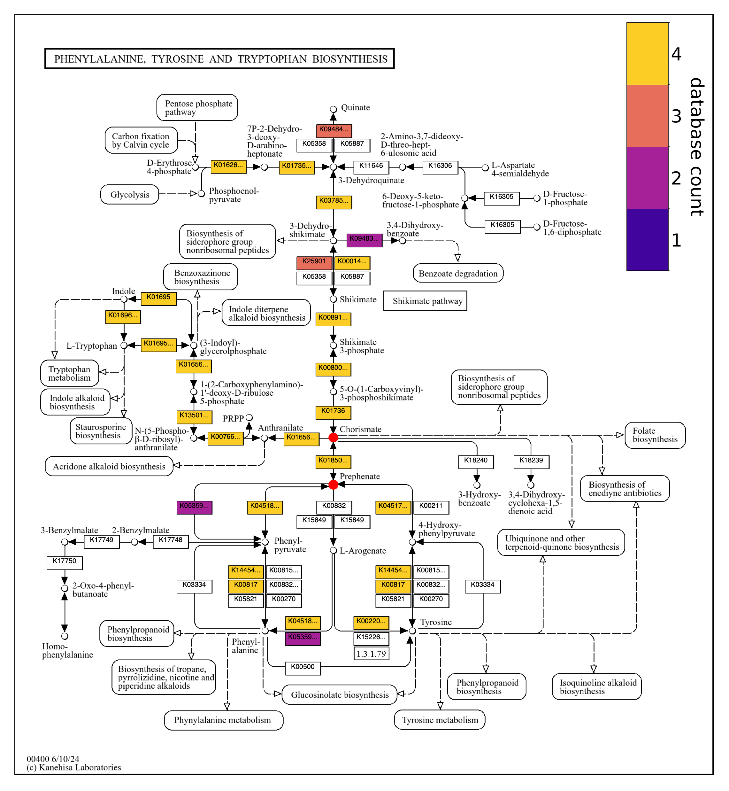
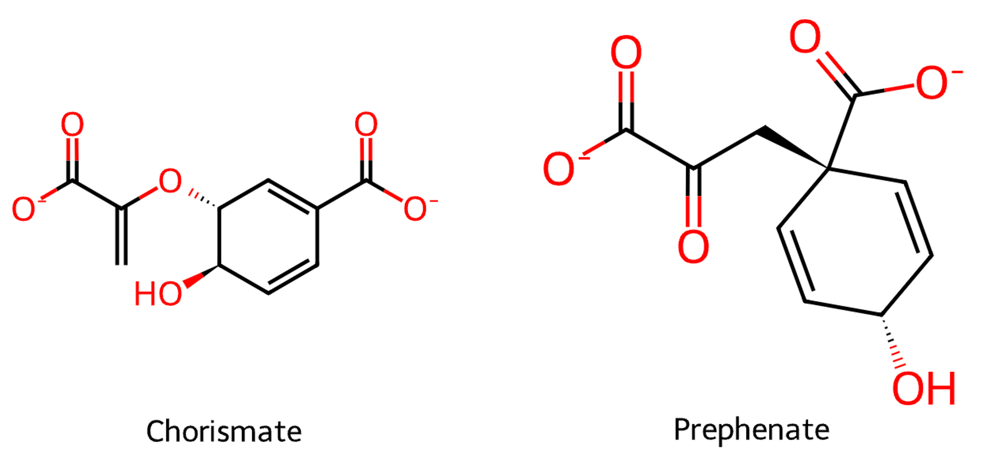

<div class="extra-info" markdown="1">

<span class="extra-info-header">Summary</span>

**The purpose of this page** is to provide access to our bioinformatics workflow that predicted compound identifications of molecular features in our study titled "**Bacterial interactions shape the molecular composition of dissolved organic matter**" by Füssel et al.

In addition to providing transparency in our methods, this workflow can be used as the basis for genomically guided compound prediction in other metabolomics experiments, which will also help refine and validate the approach.

</div>

{:.notice}
If you have any questions, notice an issue, and/or are unable to find an important piece of information here, please feel free to leave a comment down below, send an e-mail to [us](/people/), or get in touch with us through Discord:



## Study description

### Background

Microorganisms in the surface ocean remineralize the majority (~84%) of photosynthetically fixed carbon within minutes to days, with ~16% persisting for weeks to years, and <1% entering the long-lived reservoir of dissolved organic matter (DOM) that is comparable in size to the atmospheric carbon dioxide pool. The activity of microbial communities shapes the molecular composition of the marine DOM pool and drives the sequential transformtion of labile to persistent DOM. It is challenging to gain mechanistic insights into these microbially mediated processes in complex natural environments. Methodological and technological limitations such as the incomplete functional annotation of genes and the selective and incomplete recovery of dissolved organic compounds from seawater complicate the effective, direct integration of biological and chemical data. To explore the nature of microbial interactions driving DOM transformation, we used four bacterial isolates from the same North Sea water sample in a fully factorial setup, allowing us to study and compare the fates of several thousand largely unknown molecular formulas across eleven microbial co-cultures.

### Cultures

We cultured four isolates that belonged to three genera (*Pelagimonas*, *Sulfitobacter*, *Phaeobacter*) within the family *Roseobacteraceae*, a diverse clade of heterotrophic bacteria in a combinatorial fashion (i.e., as individuals as well as co-cultures two, three, and all four strains) as triplicates using an artificial seawater minimal medium, which contained 1 g/L of glucose, trace elements, vitamins, and a bicarbonate buffer.

The four strains had divergent metabolic capabilities from their genomes and substrate utilization preferences in culture. *Pelagimonas varians* SH4-1 (**SH4**) has a more extensive set of sugar metabolism genes than the other three strains, and grew on a variety of organic acids and monosaccharides, as well as a few polysaccharides. In the glucose minimal medium, SH4 had a negligible lag phase and grew to a higher optical density compared to the other strains. *Phaeobacter* sp. **SH40** and *Sulfitobacter* sp. SH22-1 (**SH22**) grew well on organic acids and relatively poorly on sugars, and *Sulfitobacter* sp. SH24-1b (**SH24**) exhibited limited growth on all tested substrates. After a longer lag phase compared to SH4, the three other strains also grew more slowly to stationary phase.

Growth in co-culture contrasted with growth in monoculture. The observed growth exceeded modeled growth based on competitive glucose consumption, especially in co-cultures with SH4. The discrepancy between co-culture growth curves and models generally increased with the addition of strains, suggesting metabolic cross-feeding across strains.

### Untargeted metabolomics

We extracted DOM from the filtered (0.2 µm) culture supernatant of each biological replicate at the beginning of the experiment and after 255 hours. DOM was extracted via Priority PolLutant (PPL) SPE cartridges, which preferentially retain hydrophobic organic compounds. Analytes were then measured by FT-ICR-MS in negative ion mode using electrospray ionization. The mass error was <0.1 ppm for all samples following calibration to endogenous peaks. Only masses detected in all replicates of a culture and not present in blanks were retained. Molecular formulas were assigned to spectra by [ICBM-OCEAN](https://pubs.acs.org/doi/10.1021/acs.analchem.9b05659) software.

Molecular formula fates were tracked from pure culture to co-cultures. The fastest growing strain, SH4, yielded 2,216 formulas, or 89% of unique formulas found in pure cultures of the four strains. Across all co-cultures, 2,066 formulas were also found in pure cultures, while 2,508 were not. A majority of formulas novel to the co-cultures were unique to a single co-culture.

### Compound prediction

A formula can represent various isomers, so we used the metabolic networks predicted for each of the strains and groups of strains in co-cultures to propose molecular identifications of the formulas, as described in this workflow. This approach involves the anvi'o . Reaction networks are constructed from [KEGG Ortholog](https://www.genome.jp/kegg/ko.html) (KO) annotations of genes (see ) and associated reaction and compound entries from the [ModelSEED Biochemistry Database](https://github.com/ModelSEED/ModelSEEDDatabase) (see ). KOs are often annotated with KEGG reactions and EC numbers, indicating potential reactions that may be catalyzed by a gene protein product. Genomic reaction networks of co-cultured strains were merged to produce networks representing the combined metabolic potential of the community.

For each molecular feature in a culture, we matched its neutral formula, formula with one subtracted proton and charge of -1, and formula with two subtracted protons and charge of -2 to the formulas of compounds in the culture reaction network. The network often contains compounds in the protonation state that would exist in aqueous solution, so it is necessary to also search for -1 and -2 variants of the neutral formula to capture metabolites such as mono- and dicarboxylates.

#### Criteria

Formula matches to reaction network compounds were screened using a set of filters. Some of these criteria are implemented automatically while others require interpretation.

##### Multiple compound matches

A formula can match multiple compounds in a reaction network, and the strength of the evidence supporting each match can vary. We chose to retain formulas that match multiple closely related metabolites, such as isomers occurring in the same KEGG Pathway. Otherwise, we ignored formulas that match compounds with different metabolic roles. The search for deprotonated versions of each formula increases the likelihood of discarded uncertain matches to multiple compounds.

##### Compound consistency across cultures

If a formula is found in multiple cultures, a compound match must occur in all of the cultures' reaction networks. If the formula is from cultures A and B, but the matching compound is only in the culture A network and not the culture B network, then the compound match would be ignored.

##### KO annotation specificity

Matching compounds must be strongly associated with KO annotations. We evaluated whether there was sufficient evidence to include compounds in the reaction network given the specificity of KO and associated reaction annotations involving the compounds. We ignored compounds included in the network via KOs associated with higher EC categories, such as 1.1.1.- and 2.3.-.-, or broad EC categories, such as 1.1.1.1 (alcohol dehydrogenase), that are linked to numerous ModelSEED reactions. Likewise, we ignored compounds included in the network via KOs with unconstrained catalytic capabilities, such as K00128 (aldehyde dehydrogenase), which is associated with a variety of reactions not necessarily catalyzed by the particular gene product. Many KOs, however, are associated with a single reaction, reducing the uncertainty that participating compounds are actually involved in the organism's metabolism.

##### Production pathway

Matching compounds must be produced by reactions in a network, not just consumed. Furthermore, reactions are more likely to occur in the organism when they are well-connected to other reactions encoded by the network rather than isolated from other parts of the network, particularly where reaction substrates and products do not arise from and feed into other reactions in the network. We checked KEGG pathway maps for reaction connectivity. Gene KO annotations are also occasionally wrong, with a lower-ranking KO hit to the gene sequence rather than the top hit representing the true protein product, and co-occurrence of a KO with others in a KEGG pathway bolsters confidence in the KO. Additionally, annotation of multiple genes with the same KO bolsters annotation confidence.

##### Compound chemistry

Chemical considerations support the existence of a matching compound. Predicted compounds are more likely to exist in the sample when they have properties consistent with sample extraction and ionization. The SPE cartridges used in our study are more likely to retain hydrophobic compounds, and the negative ion mode in which the mass spectrometer was run favors ionization of compounds that can attain a -1 charge, such as carboxylic and phenolic acids.

##### Known biological isomers

There is the possibility that the true compound represented by a formula is not encoded in the reaction network. It is therefore sensible to compare the number of compounds with the formula in the network to the number in a large database of metabolites. We find the number of isomeric compounds in the ModelSEED Biochemistry compound database. This database includes pesticides and other synthetic compounds, many of which are not represented in the KEGG compound database, one of the databases incorporated into the ModelSEED database. Thus we also subset the isomeric ModelSEED compounds to those in the KEGG database. Furthermore, we subset isomeric KEGG compounds that participate in KEGG reactions, as these tend to be more common biological substrates. All else equal, matching compounds with fewer "potential false negative" isomers in the reference databases are more likely to actually be in the culture than compounds with more isomers.

## Reproducing this workflow

### Computational environment

This workflow uses the development version of [anvi'o](https://anvio.org) (`8-dev`), which you can install and activate following [anvi'o installation instructions](https://anvio.org/install/#development-version). Any more recent version of anvi'o should also work successfully. Load the anvi'o conda environment before running the workflow. The ModelSEED database should be installed in the default location for the anvi'o environment by .

The computational demands of reproducing the workflow are minimal. All commands below should run within a few minutes or less on a modest laptop.

### The data pack

Below you will find brief descriptions of individual files used in our downstream analyses. If you would like to follow this workflow, you can download the following data pack that includes the four genomes and the metabolomics table associated with each culture experiment. For this, please open a terminal, create a work directory, and type the following commands (or replace directory names manually):

``` bash
# make sure there is a Downloads directory at your home
mkdir -p ~/Downloads

# change your current directory
cd ~/Downloads

# download the data pack
curl -o roseobacteraceae-dom-datapack.tar.gz https://merenlab.org/data/DOM-molecular-composition/files/roseobacteraceae-dom-datapack.tar.gz

# unpack the data pack
tar -zxvf roseobacteraceae-dom-datapack.tar.gz

# go into the resulting data directory:
cd roseobacteraceae-dom-datapack
```

If you are here, you should be looking at a directory structure like this:

```
.
├── SH4-CONTIGS.db
├── SH40-CONTIGS.db
├── SH24-CONTIGS.db
├── SH22-CONTIGS.db
├── roseobacteraceae-dom-datapack-data.tsv
```

### Genomes

The files with the extension `.db` represent the four isolate genomes sequenced with PacBio Hifi long reads. To include them in our computational workflows we used the anvi'o program  to turn the FASTA files into so-called  files for downstream analyses. This file format contains much more information than a FASTA file, including gene coordinates, function annotations, and metabolic module membership of individual genes that will be essential to have in this workflow.

You can use the program  to learn more about the contents of a given :

``` bash
anvi-db-info SH22-CONTIGS.db

DB Info (no touch)
===============================================
Database Path ................................: SH22-CONTIGS.db
description ..................................: [Not found, but it's OK]
db_type ......................................: contigs (variant: unknown)
version ......................................: 24


DB Info (no touch also)
===============================================
project_name .................................: S_marinus_SH22
contigs_db_hash ..............................: hash52f2e51b
split_length .................................: 20000
kmer_size ....................................: 4
num_contigs ..................................: 4
total_length .................................: 4087537
num_splits ...................................: 201
gene_level_taxonomy_source ...................: None
genes_are_called .............................: 1
external_gene_calls ..........................: 0
external_gene_amino_acid_seqs ................: 0
skip_predict_frame ...........................: 0
splits_consider_gene_calls ...................: 1
trna_taxonomy_was_run ........................: 0
trna_taxonomy_database_version ...............: None
creation_date ................................: 1717747570.84562
modules_db_hash ..............................: a2b5bde358bb
scg_taxonomy_was_run .........................: 1
scg_taxonomy_database_version ................: GTDB: v214.1; Anvi'o: v1
gene_function_sources ........................: COG20_FUNCTION,Transfer_RNAs,CAZyme,KOfam,KEGG_Module,COG20_CATEGORY,KEGG_BRITE,KEGG_Class,COG20_PATHWAY
reaction_network_ko_annotations_hash .........: 1e5748cd73acfd2c24692de4d2c488044059aa32
reaction_network_kegg_database_release .......: 5a9644d40061
reaction_network_modelseed_database_sha ......: 194ac8afe48f8a606c0dd07ba3c7af10c02ba2fd

* Please remember that it is never a good idea to change these values. But in some
  cases it may be absolutely necessary to update something here, and a
  programmer may ask you to run this program and do it. But even then, you
  should be extremely careful.


AVAILABLE GENE CALLERS
===============================================
* 'prodigal' (3,851 gene calls)
* 'Transfer_RNAs' (45 gene calls)
* 'Ribosomal_RNA_23S' (3 gene calls)
* 'Ribosomal_RNA_16S' (3 gene calls)


AVAILABLE FUNCTIONAL ANNOTATION SOURCES
===============================================
* CAZyme (129 annotations)
* COG20_CATEGORY (3,208 annotations)
* COG20_FUNCTION (3,208 annotations)
* COG20_PATHWAY (830 annotations)
* KEGG_BRITE (2,396 annotations)
* KEGG_Class (511 annotations)
* KEGG_Module (511 annotations)
* KOfam (2,400 annotations)
* Transfer_RNAs (45 annotations)


AVAILABLE HMM SOURCES
===============================================
* 'Archaea_76' (76 models with 35 hits)
* 'Bacteria_71' (71 models with 72 hits)
* 'Protista_83' (83 models with 3 hits)
* 'Ribosomal_RNA_12S' (1 model with 0 hits)
* 'Ribosomal_RNA_16S' (3 models with 3 hits)
* 'Ribosomal_RNA_18S' (1 model with 0 hits)
* 'Ribosomal_RNA_23S' (2 models with 3 hits)
* 'Ribosomal_RNA_28S' (1 model with 0 hits)
* 'Ribosomal_RNA_5S' (5 models with 0 hits)
* 'Transfer_RNAs' (61 models with 45 hits)
```

You can get a standard FASTA file for a given genome using the program :

``` bash
anvi-export-contigs -c SH22-CONTIGS.db -o SH22.fa
```

### Metabolomics table

The other file in this data pack, `roseobacteraceae-dom-datapack-data.tsv`, contains the processed spectral data, including monoisotopic molecular formulas and sample abundances. This is the same file that appears in our Füssel et al. publication as SI Table 2b.

Here are the first few lines of this table, so you can browse the individual columns that are included:

|**`mz`**|**`diff`**|**`reference`**|**`formula`**|**`formula_isotopefree`**|**`formula_ion`**|**`homseries`**|**`totalc`**|**`HC`**|**`OC`**|**`C`**|**`H`**|**`O`**|**`N`**|**`S`**|**`P`**|**`MDL_3`**|**`ResPow`**|**`m1`**|**`SE`**|**`present_in`**|**`AI`**|**`AImod`**|**`DBE`**|**`Aromatic`**|**`AromaticO_rich`**|**`AromaticO_poor`**|**`Highlyunsaturated`**|**`HighlyunsaturatedO_rich`**|**`HighlyunsaturatedO_poor`**|**`Unsaturated`**|**`UnsaturatedO_rich`**|**`UnsaturatedO_poor`**|**`UnsaturatedwithN`**|**`Saturated`**|**`SaturatedO_rich`**|**`SaturatedO_poor`**|**`mean_signal_to_MDL`**|**`homnetworkmember`**|**`diff_filter`**|**`alternative_formula`**|**`SH4_Start`**|**`SH22_Start`**|**`SH24_Start`**|**`SH40_Start`**|**`SH22_SH4_Start`**|**`SH24_SH4_Start`**|**`SH4_SH40_Start`**|**`SH22_SH24_Start`**|**`SH22_SH40_Start`**|**`SH24_SH40_Start`**|**`SH22_SH24_SH4_Start`**|**`SH22_SH4_SH40_Start`**|**`SH24_SH4_SH40_Start`**|**`SH22_SH24_SH40_Start`**|**`SH22_SH24_SH4_SH40_Start`**|**`SH4_Final`**|**`SH22_Final`**|**`SH24_Final`**|**`SH40_Final`**|**`SH22_SH4_Final`**|**`SH24_SH4_Final`**|**`SH4_SH40_Final`**|**`SH22_SH24_Final`**|**`SH22_SH40_Final`**|**`SH24_SH40_Final`**|**`SH22_SH24_SH4_Final`**|**`SH22_SH4_SH40_Final`**|**`SH24_SH4_SH40_Final`**|**`SH22_SH24_SH40_Final`**|**`SH22_SH24_SH4_SH40_Final`**|
|:--|:--|:--|:--|:--|:--|:--|:--|:--|:--|:--|:--|:--|:--|:--|:--|:--|:--|:--|:--|:--|:--|:--|:--|:--|:--|:--|:--|:--|:--|:--|:--|:--|:--|:--|:--|:--|:--|:--|:--|:--|:--|:--|:--|:--|:--|:--|:--|:--|:--|:--|:--|:--|:--|:--|:--|:--|:--|:--|:--|:--|:--|:--|:--|:--|:--|:--|:--|:--|:--|:--|
|95.0138555132338|0.0281917|96.021129238|C_5 H_4 O_2|C5H4O2|C_5 H_3 O_2|4610|5|0.800|0.400|5|4|2|0|0|0|2234458.755|2256845.978|95.0138533467|0.0475922619|46|0.67|0.75|4|1|0|1|0|0|0|0|0|0|0|0|0|0|2.40|50|FALSE|NA|0.00000000|0.00000000|0.00000000|0.00000000|0.00000000|0.00000000|0.00000000|0.00000000|0.00000000|0.00000000|0.00000000|0.00000000|0.00000000|0.00000000|0.00000000|0.00000000|0.00000000|0.00000000|0.00000000|0.00000000|0.00005244|0.00006392|0.00040420|0.00000000|0.00000000|0.00000000|0.00000000|0.00007395|0.00000000|0.00000000|
|95.0502412690511|0.0320849|96.057514619|C_6 H_8 O_1|C6H8O|C_6 H_7 O_1|4610|6|1.333|0.167|6|8|1|0|0|0|2234458.755|2147563.946|95.0502396249|0.0406344107|56|0.40|0.45|3|0|0|0|1|0|1|0|0|0|0|0|0|0|2.36|50|FALSE|NA|0.00000000|0.00000000|0.00000000|0.00000000|0.00000000|0.00000000|0.00000000|0.00000000|0.00000000|0.00000000|0.00000000|0.00000000|0.00000000|0.00000000|0.00000000|0.00005490|0.00000000|0.00000000|0.00000000|0.00000000|0.00010295|0.00010424|0.00000000|0.00000000|0.00000000|0.00015376|0.00000000|0.00000000|0.00000000|0.00000000|
|97.0294959619701|0.0698105|98.036779238|C_5 H_6 O_2|C5H6O2|C_5 H_5 O_2|4610|5|1.200|0.400|5|6|2|0|0|0|2235191.822|2138590.306|97.0294935409|0.0620774329|85|0.33|0.50|3|0|0|0|1|0|1|0|0|0|0|0|0|0|2.70|50|FALSE|NA|0.00000000|0.00000000|0.00000000|0.00000000|0.00000000|0.00000000|0.00000000|0.00000000|0.00000000|0.00000000|0.00000000|0.00000000|0.00000000|0.00000000|0.00000000|0.00007827|0.00000000|0.00000000|0.00000000|0.00000000|0.00011741|0.00022261|0.00000000|0.00000000|0.00000000|0.00014084|0.00008886|0.00020904|0.00010036|0.00014362|
|100.0404053413720|0.0349439|101.047678242|C_4 H_7 O_2 N_1|C4H7NO2|C_4 H_6 O_2 N_1|3423|4|1.750|0.500|4|7|2|1|0|0|2236291.873|2138425.208|100.0404041292|0.0737641951|24|0.00|0.00|2|0|0|0|0|0|0|1|0|1|1|0|0|0|1.41|27|FALSE|NA|0.00000000|0.00000000|0.00000000|0.00000000|0.00000000|0.00000000|0.00000000|0.00000000|0.00000000|0.00000000|0.00000000|0.00000000|0.00000000|0.00000000|0.00000000|0.00000000|0.00000000|0.00000000|0.00000000|0.00000000|0.00000000|0.00000000|0.00000000|0.00005162|0.00011517|0.00000000|0.00000000|0.00000000|0.00000000|0.00000000|
|101.0244171971140|0.0022346|102.031693857|C_4 H_6 O_3|C4H6O3|C_4 H_5 O_3|4610|4|1.500|0.750|4|6|3|0|0|0|2236658.677|2100978.308|101.0244159934|0.0508603586|156|0.00|0.20|2|0|0|0|0|0|0|1|1|0|0|0|0|0|1.82|50|FALSE|NA|0.00000000|0.00000000|0.00009419|0.00000000|0.00000000|0.00000000|0.00000000|0.00000000|0.00000000|0.00000000|0.00000000|0.00000000|0.00000000|0.00000000|0.00000000|0.00007653|0.00000000|0.00000000|0.00000000|0.00000000|0.00011193|0.00012835|0.00012838|0.00006791|0.00000000|0.00009100|0.00004771|0.00011538|0.00000000|0.00007668|
|101.0396688839130|0.0459102|102.046950000|C_8 H_6|C8H6|C_8 H_5|4610|8|0.750|0.000|8|6|0|0|0|0|2236658.677|1976775.861|101.0396669676|0.0686485050|36|0.75|0.75|6|1|0|1|0|0|0|0|0|0|0|0|0|0|2.69|50|FALSE|NA|0.00000000|0.00000000|0.00000000|0.00000000|0.00000000|0.00000000|0.00000000|0.00000000|0.00000000|0.00000000|0.00000000|0.00000000|0.00000000|0.00000000|0.00000000|0.00006977|0.00000000|0.00000000|0.00000000|0.00000000|0.00000000|0.00000000|0.00022576|0.00000000|0.00000000|0.00000000|0.00000000|0.00012265|0.00000000|0.00000000|
|102.0560542629160|0.0237912|103.063328242|C_4 H_9 O_2 N_1|C4H9NO2|C_4 H_8 O_2 N_1|3423|4|2.250|0.500|4|9|2|1|0|0|2237025.541|2026054.176|102.0560530102|0.1558467278|17|0.00|0.00|1|0|0|0|0|0|0|0|0|0|0|0|0|0|1.53|27|FALSE|NA|0.00000000|0.00000000|0.00000000|0.00000000|0.00000000|0.00000000|0.00000000|0.00000000|0.00000000|0.00000000|0.00000000|0.00000000|0.00000000|0.00000000|0.00000000|0.00000000|0.00010476|0.00000000|0.00000000|0.00000000|0.00000000|0.00000000|0.00000000|0.00000000|0.00000000|0.00000000|0.00000000|0.00000000|0.00000000|0.00000000|
|102.9859214249310|0.0325117|103.993201238|C_3 H_4 O_2 S_1|C3H4O2S|C_3 H_3 O_2 S_1|3715|3|1.333|0.667|3|4|2|0|1|0|2237392.465|1957173.000|102.9859199500|0.2308225502|27|0.00|0.00|2|0|0|0|1|1|0|0|0|0|0|0|0|0|1.51|30|FALSE|NA|0.00000000|0.00000000|0.00000000|0.00000000|0.00000000|0.00000000|0.00000000|0.00000000|0.00000000|0.00000000|0.00000000|0.00000000|0.00000000|0.00000000|0.00000000|0.00000000|0.00000000|0.00000000|0.00000000|0.00000000|0.00000000|0.00006466|0.00000000|0.00000000|0.00000000|0.00000000|0.00000000|0.00000000|0.00000000|0.00000000|
|103.0400590982740|0.0800309|104.047343857|C_4 H_8 O_3|C4H8O3|C_4 H_7 O_3|4610|4|2.000|0.750|4|8|3|0|0|0|2237392.465|1961126.500|103.0400536960|0.0554939082|100|0.00|0.00|1|0|0|0|0|0|0|1|1|0|0|0|0|0|79.08|50|FALSE|NA|0.00000000|0.00000000|0.00000000|0.00000000|0.00000000|0.00000000|0.00000000|0.00000000|0.00000000|0.00000000|0.00000000|0.00000000|0.00000000|0.00000000|0.00000000|0.02121257|0.00000000|0.00039499|0.00000000|0.00000000|0.00185427|0.00250969|0.00037960|0.00006953|0.00011791|0.00027330|0.00017926|0.00143951|0.00048814|0.00040238|
|103.0553130612920|0.1009681|104.062600000|C_8 H_8|C8H8|C_8 H_7|4610|8|1.000|0.000|8|8|0|0|0|0|2237392.465|2085497.409|103.0553111458|0.0903881368|22|0.62|0.62|5|1|0|1|0|0|0|0|0|0|0|0|0|0|1.56|50|FALSE|NA|0.00000000|0.00000000|0.00000000|0.00000000|0.00000000|0.00000000|0.00000000|0.00000000|0.00000000|0.00000000|0.00000000|0.00000000|0.00000000|0.00000000|0.00000000|0.00004035|0.00000000|0.00000000|0.00000000|0.00000000|0.00000000|0.00000000|0.00000000|0.00000000|0.00000000|0.00000000|0.00000000|0.00000000|0.00000000|0.00000000|
|104.0505372294390|0.3364148|105.057849004|C_7 H_7 N_1|C7H7N|C_7 H_6 N_1|3423|7|1.000|0.000|7|7|0|1|0|0|2237759.450|1930600.560|104.0505355175|0.5149217715|25|0.67|0.67|5|1|0|1|0|0|0|0|0|0|0|0|0|0|1.39|27|FALSE|NA|0.00000000|0.00000000|0.00000000|0.00000000|0.00000000|0.00000000|0.00000000|0.00000000|0.00000000|0.00000000|0.00000000|0.00000000|0.00000000|0.00000000|0.00000000|0.00000000|0.00000000|0.00000000|0.00000000|0.00000000|0.00000000|0.00000000|0.00000000|0.00000000|0.00000000|0.00008673|0.00000000|0.00000000|0.00000000|0.00000000|
|105.0345944057540|0.0586372|106.041864619|C_7 H_6 O_1|C7H6O|C_7 H_5 O_1|4610|7|0.857|0.143|7|6|1|0|0|0|2238126.495|2008009.077|105.0345925729|0.3127859784|39|0.67|0.69|5|1|0|1|0|0|0|0|0|0|0|0|0|0|1.40|50|FALSE|NA|0.00000000|0.00000000|0.00000000|0.00000000|0.00000000|0.00000000|0.00000000|0.00000000|0.00000000|0.00000000|0.00000000|0.00000000|0.00000000|0.00000000|0.00000000|0.00000000|0.00000000|0.00000000|0.00000000|0.00000000|0.00000000|0.00006203|0.00000000|0.00000000|0.00000000|0.00000000|0.00000000|0.00000000|0.00005143|0.00000000|
|107.0502357662910|0.0224047|108.057514619|C_7 H_8 O_1|C7H8O|C_7 H_7 O_1|4610|7|1.143|0.143|7|8|1|0|0|0|2238860.765|1887046.786|107.0502337204|0.0583066930|126|0.50|0.54|4|1|0|1|0|0|0|0|0|0|0|0|0|0|7.52|50|FALSE|NA|0.00000000|0.00000000|0.00000000|0.00000000|0.00000000|0.00000000|0.00000000|0.00000000|0.00000000|0.00000000|0.00000000|0.00000000|0.00000000|0.00000000|0.00000000|0.00026394|0.00000000|0.00000000|0.00000000|0.00019360|0.00067382|0.00078355|0.00070539|0.00000000|0.00011044|0.00061324|0.00024031|0.00106589|0.00070622|0.00057724|
|108.0454820492240|0.0471515|109.052763623|C_6 H_7 O_1 N_1|C6H7NO|C_6 H_6 O_1 N_1|3423|6|1.167|0.167|6|7|1|1|0|0|2239227.990|1887069.400|108.0454815707|0.1086665235|60|0.50|0.56|4|1|0|1|0|0|0|0|0|0|0|0|0|0|3.78|27|FALSE|NA|0.00000000|0.00000000|0.00000000|0.00000000|0.00000000|0.00000000|0.00000000|0.00000000|0.00000000|0.00000000|0.00000000|0.00000000|0.00000000|0.00000000|0.00000000|0.00000000|0.00000000|0.00053209|0.00030703|0.00000000|0.00000000|0.00006015|0.00000000|0.00027031|0.00038705|0.00000000|0.00008938|0.00000000|0.00000000|0.00000000|
|109.0658885686900|0.0034613|110.073164619|C_7 H_10 O_1|C7H10O|C_7 H_9 O_1|4610|7|1.429|0.143|7|10|1|0|0|0|2239595.276|1907711.752|109.0658874467|0.0511481349|137|0.33|0.38|3|0|0|0|1|0|1|0|0|0|0|0|0|0|2.82|50|FALSE|NA|0.00005259|0.00000000|0.00000000|0.00000000|0.00000000|0.00000000|0.00008990|0.00000000|0.00000000|0.00000000|0.00000000|0.00006936|0.00000000|0.00008719|0.00010021|0.00019081|0.00000000|0.00000000|0.00000000|0.00000000|0.00037872|0.00033969|0.00000000|0.00000000|0.00000000|0.00012937|0.00000000|0.00000000|0.00000000|0.00000000|
|111.0087713970950|0.0354592|112.016043857|C_5 H_4 O_3|C5H4O3|C_5 H_3 O_3|4610|5|0.800|0.600|5|4|3|0|0|0|2240330.028|1860703.739|111.0087700372|0.0676582216|119|0.50|0.71|4|1|1|0|0|0|0|0|0|0|0|0|0|0|1.53|50|FALSE|NA|0.00000000|0.00000000|0.00000000|0.00000000|0.00000000|0.00000000|0.00000000|0.00000000|0.00000000|0.00000000|0.00000000|0.00000000|0.00000000|0.00000000|0.00000000|0.00003877|0.00000000|0.00008944|0.00000000|0.00000000|0.00006990|0.00009919|0.00007880|0.00000000|0.00000000|0.00000000|0.00005030|0.00011178|0.00006070|0.00006852|
|114.0560473631960|0.0386483|115.063328242|C_5 H_9 O_2 N_1|C5H9NO2|C_5 H_8 O_2 N_1|3423|5|1.800|0.400|5|9|2|1|0|0|2241432.608|1828463.053|114.0560475526|0.1283682584|95|0.00|0.00|2|0|0|0|0|0|0|1|0|1|1|0|0|0|1.86|27|FALSE|NA|0.00000000|0.00000000|0.00000000|0.00008120|0.00000000|0.00000000|0.00000000|0.00000000|0.00000000|0.00012011|0.00000000|0.00000000|0.00000000|0.00000000|0.00000000|0.00000000|0.00000000|0.00022755|0.00021206|0.00000000|0.00000000|0.00005687|0.00000000|0.00009448|0.00000000|0.00000000|0.00000000|0.00000000|0.00000000|0.00000000|
|115.0036843829750|0.0201619|116.010958476|C_4 H_4 O_4|C4H4O4|C_4 H_3 O_4|4610|4|1.000|1.000|4|4|4|0|0|0|2241800.255|1798563.500|115.0036840529|0.0779625901|94|0.00|0.50|3|0|0|0|1|1|0|0|0|0|0|0|0|0|1.66|50|FALSE|NA|0.00005517|0.00000000|0.00000000|0.00000000|0.00000000|0.00000000|0.00000000|0.00000000|0.00000000|0.00000000|0.00000000|0.00000000|0.00000000|0.00000000|0.00000000|0.00000000|0.00000000|0.00000000|0.00000000|0.00000000|0.00000000|0.00000000|0.00000000|0.00006655|0.00000000|0.00000000|0.00000000|0.00007120|0.00005576|0.00000000|
|115.0553195669310|0.0344728|116.062600000|C_9 H_8|C9H8|C_9 H_7|4610|9|0.889|0.000|9|8|0|0|0|0|2241800.255|1757533.933|115.0553173348|0.1109887279|45|0.67|0.67|6|1|0|1|0|0|0|0|0|0|0|0|0|0|3.44|50|FALSE|NA|0.00000000|0.00000000|0.00000000|0.00000000|0.00000000|0.00000000|0.00000000|0.00000000|0.00000000|0.00000000|0.00000000|0.00000000|0.00000000|0.00000000|0.00000000|0.00010459|0.00000000|0.00000000|0.00000000|0.00000000|0.00006484|0.00010215|0.00031981|0.00000000|0.00000000|0.00000000|0.00000000|0.00021672|0.00011680|0.00000000|
|117.0345855886080|0.0220176|118.041864619|C_8 H_6 O_1|C8H6O|C_8 H_5 O_1|4610|8|0.750|0.125|8|6|1|0|0|0|2242535.730|1693286.109|117.0345837876|0.1468502474|64|0.71|0.73|6|1|0|1|0|0|0|0|0|0|0|0|0|0|7.57|50|FALSE|NA|0.00000000|0.00000000|0.00000000|0.00000000|0.00000000|0.00000000|0.00000000|0.00000000|0.00000000|0.00000000|0.00000000|0.00000000|0.00000000|0.00000000|0.00000000|0.00025536|0.00000000|0.00000000|0.00000000|0.00000000|0.00016141|0.00022868|0.00108416|0.00000000|0.00000000|0.00000000|0.00005057|0.00056176|0.00048878|0.00009414|
|117.0557115866400|0.0494567|118.062993857|C_5 H_10 O_3|C5H10O3|C_5 H_9 O_3|4610|5|2.000|0.600|5|10|3|0|0|0|2242535.730|1735420.716|117.0557092044|0.2877162635|74|0.00|0.00|1|0|0|0|0|0|0|1|1|0|0|0|0|0|2.49|50|FALSE|NA|0.00000000|0.00000000|0.00000000|0.00000000|0.00000000|0.00000000|0.00000000|0.00000000|0.00000000|0.00000000|0.00000000|0.00000000|0.00000000|0.00000000|0.00000000|0.00013221|0.00000000|0.00000000|0.00000000|0.00000000|0.00011136|0.00014889|0.00010388|0.00000000|0.00000000|0.00009287|0.00006809|0.00015296|0.00010295|0.00010574|
|117.0709629508030|0.0899234|118.078250000|C_9 H_10|C9H10|C_9 H_9|4610|9|1.111|0.000|9|10|0|0|0|0|2242535.730|1643075.394|117.0709600004|0.2995694356|71|0.56|0.56|5|1|0|1|0|0|0|0|0|0|0|0|0|0|18.74|50|FALSE|NA|0.00000000|0.00000000|0.00000000|0.00000000|0.00000000|0.00000000|0.00000000|0.00000000|0.00000000|0.00000000|0.00000000|0.00000000|0.00000000|0.00000000|0.00000000|0.00163395|0.00000000|0.00000000|0.00000000|0.00000000|0.00068428|0.00090488|0.00193652|0.00000000|0.00000000|0.00042827|0.00013660|0.00126878|0.00045145|0.00030455|
|118.0298358415610|0.0113410|119.037113623|C_7 H_5 O_1 N_1|C7H5NO|C_7 H_4 O_1 N_1|3423|7|0.714|0.143|7|5|1|1|0|0|2242903.558|1786864.132|118.0298356003|0.0621286083|38|0.80|0.82|6|1|0|1|0|0|0|0|0|0|0|0|0|0|2.83|27|FALSE|NA|0.00000000|0.00000000|0.00000000|0.00000000|0.00000000|0.00000000|0.00000000|0.00000000|0.00000000|0.00000000|0.00000000|0.00000000|0.00000000|0.00000000|0.00000000|0.00000000|0.00000000|0.00059625|0.00000000|0.00000000|0.00000000|0.00000000|0.00000000|0.00000000|0.00000000|0.00000000|0.00000000|0.00000000|0.00000000|0.00000000|
|118.0331989036020|0.0864244|119.040485623|C_4 H_9 O_1 N_1 S_1|C4H9NOS|C_4 H_8 O_1 N_1 S_1|2328|4|2.250|0.250|4|9|1|1|1|0|2242903.558|1726953.242|118.0331978601|0.1764849790|33|0.00|0.00|1|0|0|0|0|0|0|0|0|0|0|0|0|0|1.75|8|FALSE|NA|0.00000000|0.00000000|0.00000000|0.00000000|0.00000000|0.00000000|0.00000000|0.00000000|0.00000000|0.00000000|0.00000000|0.00000000|0.00000000|0.00000000|0.00000000|0.00000000|0.00000000|0.00000000|0.00000000|0.00000000|0.00000000|0.00009807|0.00000000|0.00000000|0.00000000|0.00000000|0.00005414|0.00010486|0.00000000|0.00000000|
|118.0509610909830|0.0448352|119.058242861|C_4 H_9 O_3 N_1|C4H9NO3|C_4 H_8 O_3 N_1|3423|4|2.250|0.750|4|9|3|1|0|0|2242903.558|1807663.056|118.0509604080|0.0559783664|36|0.00|0.00|1|0|0|0|0|0|0|0|0|0|0|0|0|0|3.16|27|FALSE|NA|0.00000000|0.00000000|0.00000000|0.00000000|0.00000000|0.00000000|0.00000000|0.00000000|0.00000000|0.00000000|0.00000000|0.00000000|0.00000000|0.00000000|0.00000000|0.00000000|0.00000000|0.00055533|0.00000000|0.00000000|0.00000000|0.00000000|0.00000000|0.00012309|0.00014975|0.00000000|0.00000000|0.00000000|0.00000000|0.00000000|
|118.0662130626320|0.0798666|119.073499004|C_8 H_9 N_1|C8H9N|C_8 H_8 N_1|3423|8|1.125|0.000|8|9|0|1|0|0|2242903.558|1749825.800|118.0662119608|0.0620450414|55|0.57|0.57|5|1|0|1|0|0|0|0|0|0|0|0|0|0|2.52|27|FALSE|NA|0.00000000|0.00000000|0.00000000|0.00000000|0.00000000|0.00000000|0.00000000|0.00000000|0.00000000|0.00000000|0.00000000|0.00000000|0.00000000|0.00000000|0.00000000|0.00002750|0.00000000|0.00053495|0.00000000|0.00000000|0.00000000|0.00006186|0.00000000|0.00000000|0.00000000|0.00000000|0.00000000|0.00009519|0.00008829|0.00000000|
|119.0138366416140|0.1346846|120.021129238|C_7 H_4 O_2|C7H4O2|C_7 H_3 O_2|4610|7|0.571|0.286|7|4|2|0|0|0|2243271.447|1682790.200|119.0138336946|0.1518552092|45|0.80|0.83|6|1|0|1|0|0|0|0|0|0|0|0|0|0|2.05|50|FALSE|NA|0.00000000|0.00000000|0.00000000|0.00000000|0.00000000|0.00000000|0.00000000|0.00000000|0.00000000|0.00000000|0.00000000|0.00000000|0.00000000|0.00000000|0.00000000|0.00005108|0.00000000|0.00000000|0.00000000|0.00000000|0.00007889|0.00007796|0.00000000|0.00000000|0.00000000|0.00000000|0.00000000|0.00000000|0.00000000|0.00000000|
|119.0172143468010|0.0871489|120.024501238|C_4 H_8 O_2 S_1|C4H8O2S|C_4 H_7 O_2 S_1|3715|4|2.000|0.500|4|8|2|0|1|0|2243271.447|1712802.154|119.0172119940|0.0658483958|26|0.00|0.00|1|0|0|0|0|0|0|1|0|1|0|0|0|0|1.62|30|FALSE|NA|0.00000000|0.00000000|0.00000000|0.00000000|0.00000000|0.00000000|0.00000000|0.00000000|0.00000000|0.00000000|0.00000000|0.00000000|0.00000000|0.00000000|0.00000000|0.00000000|0.00000000|0.00000000|0.00000000|0.00000000|0.00000000|0.00006240|0.00000000|0.00000000|0.00000000|0.00000000|0.00000000|0.00000000|0.00000000|0.00006782|
|119.0349869692270|0.0410272|120.042258476|C_4 H_8 O_4|C4H8O4|C_4 H_7 O_4|4610|4|2.000|1.000|4|8|4|0|0|0|2243271.447|1748584.976|119.0349868693|0.1931883383|42|0.00|0.00|1|0|0|0|0|0|0|1|1|0|0|0|0|0|1.69|50|FALSE|NA|0.00000000|0.00000000|0.00000000|0.00000000|0.00000000|0.00000000|0.00000000|0.00000000|0.00000000|0.00000000|0.00000000|0.00000000|0.00000000|0.00000000|0.00000000|0.00000000|0.00000000|0.00012461|0.00000000|0.00000000|0.00000000|0.00000000|0.00000000|0.00011364|0.00012481|0.00000000|0.00000000|0.00000000|0.00000000|0.00000000|
|(...)|(...)|(...)|(...)|(...)|(...)|(...)|(...)|(...)|(...)|(...)|(...)|(...)|(...)|(...)|(...)|(...)|(...)|(...)|(...)|(...)|(...)|(...)|(...)|(...)|(...)|(...)|(...)|(...)|(...)|(...)|(...)|(...)|(...)|(...)|(...)|(...)|(...)|(...)|(...)|(...)|(...)|(...)|(...)|(...)|(...)|(...)|(...)|(...)|(...)|(...)|(...)|(...)|(...)|(...)|(...)|(...)|(...)|(...)|(...)|(...)|(...)|(...)|(...)|(...)|(...)|(...)|(...)|(...)|(...)|(...)|

## Creating the reaction networks

The workflow was originally implemented in a Jupyter notebook that used anvi'o libraries to process the anvi'o .

Python cells of the Jupyter notebook are split up into sections of this workflow document with accompanying explanations and analyses of the output. If you wish to follow along interactively in Python, you can enter `python3` in your terminal and run the code blocks sequentially. The following package imports are first required in the Python interactive shell.

```python
import os
import sys
import rdkit
import itertools
import numpy as np
import pandas as pd

from rdkit import Chem
from copy import deepcopy
from typing import Iterable
from collections import defaultdict
```

Imports from anvi'o will fail if the anvi'o package isn't in the Python module search path, a problem that can arise in Jupyter notebooks. If you have used the standard installation instructions on the anvi'o installation page, running this command should solve that issue:

```python
sys.path.append('~/github/anvio')
```

Then you should be able to run these two lines without any errors:

```python
import anvio
import anvio.reactionnetwork as rn
```

### Genomic networks

The four  files in our data pack for the four strains we have worked with contain gene calls with KO annotations and reaction networks based on the KOs. Genes were annotated with KOs using , and networks were constructed with .

List the strains and their database files. Load reaction networks into memory. The dictionary of reaction networks is keyed by tuples, as co-culture "metagenomic" reaction networks keyed by tuples of strain IDs will be added to the dictionary.

```python
all_strains = ['SH22', 'SH24', 'SH4', 'SH40']
strain_names = {
    'SH22': 'Sulfitobacter sp. SH22-1',
    'SH24': 'Sulfitobacter sp. SH24-1b',
    'SH4': 'Pelagimonas varians SH4-1',
    'SH40': 'Phaeobacter sp. SH40'
}
all_contigs_dbs = [f'{strain}-CONTIGS.db' for strain in all_strains]
```

```python
con = rn.Constructor()
all_networks: dict[tuple[str], rn.GenomicNetwork] = {}
for contigs_db in all_contigs_dbs:
    strain = contigs_db[: contigs_db.index('-CONTIGS.db')]
    all_networks[(strain, )] = con.load_contigs_database_network(contigs_db, quiet=True)
```

### Remove EC categories from networks

Avoid the inclusion of reactions on the basis of higher EC categories, such as 1.1.1.- or 2.3.-.-, that annotate KOs. Higher categories encompass a range of ModelSEED reactions that cannot be confidently attributed to the particular enzyme. Inclusion of these reactions increases the likelihood of false positive formula matches to compounds that are not actually produced by the organism. Networks filtered to removed EC categories are called "refined" networks. These network are used in formula matching.

```python
all_refined_networks: dict[tuple[str], rn.GenomicNetwork] = {}
for strain_combo, unrefined_network in all_networks.items():
    modelseed_reaction_ids_to_retain = []
    for ko in unrefined_network.kos.values():
        modelseed_reaction_ids_to_check = []
        for modelseed_reaction_id, ec_numbers in ko.ec_number_aliases.items():
            for ec_number in ec_numbers:
                if '-' not in ec_number:
                    modelseed_reaction_ids_to_retain.append(modelseed_reaction_id)
                    break
            else:
                modelseed_reaction_ids_to_check.append(modelseed_reaction_id)
        for modelseed_reaction_id in modelseed_reaction_ids_to_check:
            if modelseed_reaction_id in ko.kegg_reaction_aliases:
                modelseed_reaction_ids_to_retain.append(modelseed_reaction_id)
    modelseed_reaction_ids_to_retain = set(modelseed_reaction_ids_to_retain)
    refined_network = unrefined_network.subset_network(reactions_to_subset=modelseed_reaction_ids_to_retain)
    all_refined_networks[strain_combo] = refined_network
```

### Networks based on KEGG reactions

Compare the sizes of reaction networks constructed in two ways: first, using the default of both KEGG reaction and EC number annotations of KOs, and second, using just KEGG reaction annotations. KEGG reactions are more specific than EC numbers, which often map to a larger group of reactions in the ModelSEED database, as explained above in [KO annotation specificity](#ko-annotation-specificity). The "EC+KEGG" network is prone to more false positive formula-compound matches that must be evaluated and fewer false negatives, or missing formula-compound matches, than the "just KEGG" network.

Although it would be useful to design a flag in  that allows a network to be constructed from KEGG reactions excluding EC numbers, for now we will remove the parts of the "EC+KEGG" networks that are based solely on EC numbers. This is achieved using the function from the anvi'o library that subsets networks by select items.

```python
all_kegg_networks: dict[tuple[str], rn.GenomicNetwork] = {}
for strain_combo, ec_kegg_network in all_networks.items():
    modelseed_reaction_ids_to_retain = []
    for ko in ec_kegg_network.kos.values():
        for modelseed_reaction_id in ko.kegg_reaction_aliases:
            modelseed_reaction_ids_to_retain.append(modelseed_reaction_id)
    modelseed_reaction_ids_to_retain = set(modelseed_reaction_ids_to_retain)
    kegg_network = ec_kegg_network.subset_network(reactions_to_subset=modelseed_reaction_ids_to_retain)
    all_kegg_networks[strain_combo] = kegg_network
```

### Co-culture "metagenomic" networks

Merge genomic reaction networks to represent co-culture "metagenomic" reaction networks. The network merge function avoids duplicate entries, such as KOs or reactions shared by both networks. Genes with identical anvi'o gene caller IDs (GCIDs) in different genomes would be considered the same in merging, so the identity of the genes must be maintained by adjusting integer GCIDs to be non-overlapping. Since the number of genes in these genomes is less than 10,000, add 10,000 to SH22 genome GCIDs, 20,000 to SH24 GCIDs, 30,000 to SH4 GCIDs, and 40,000 to SH40 GCIDs. Each gene in the network can thereby be traced back to the source genome, with SH22 genes, for example, having GCIDs between 10,000 and 20,000.

```python
def make_gcids_nonoverlapping(networks: dict[tuple[str], rn.GenomicNetwork], increment: int = 10000) -> None:
    i = increment
    for network in networks.values():
        gcids_to_remove = []
        for gcid, gene in network.genes.items():
            assert gcid < increment
            new_gcid = i + gcid
            gene.gcid = new_gcid
            gcids_to_remove.append(gcid)
        for gcid in gcids_to_remove:
            gene = network.genes.pop(gcid)
            network.genes[gene.gcid] = gene
        i += increment
```

```python
def merge_networks(networks: dict[tuple[str], rn.GenomicNetwork]) -> None:
    merged_networks = {}
    for r in range(2, len(networks) + 1):
        for combo in itertools.combinations(networks.items(), r):
            merged_strains = tuple()
            merged_network = None
            for strains, network in combo:
                merged_strains += strains
                if merged_network is None:
                    merged_network = network
                else:
                    merged_network = merged_network.merge_network(network)
            merged_networks[merged_strains] = merged_network
    networks.update(merged_networks)
```

```python
make_gcids_nonoverlapping(all_networks)
merge_networks(all_networks)

make_gcids_nonoverlapping(all_refined_networks)
merge_networks(all_refined_networks)

make_gcids_nonoverlapping(all_kegg_networks)
merge_networks(all_kegg_networks)
```

List the strain combination tuples identifying the co-culture networks.

```python
all_strain_combos = list(all_networks)
```

### Compare networks constructed with different KO annotations

Compare the three types of networks constructed on the basis of varying KO annotations: KEGG reactions and all EC numbers ("default networks"), KEGG reactions and EC numbers but not higher EC categories ("refined networks"), and just KEGG reactions ("KEGG networks"). How many compounds are removed from the default networks excluding higher EC categories and EC numbers altogether?

```python
header = ['strains', 'EC+KEGG_network_compounds', 'refined_network_compounds', 'KEGG_network_compounds']
rows = []
for strain_combo, ec_kegg_network in all_networks.items():
    refined_network = all_refined_networks[strain_combo]
    kegg_network = all_kegg_networks[strain_combo]
    row = []
    row.append('_'.join(strain_combo))
    row.append(len(ec_kegg_network.metabolites))
    row.append(len(refined_network.metabolites))
    row.append(len(kegg_network.metabolites))
    rows.append(row)
network_compound_counts = pd.DataFrame(rows, columns=header).set_index('strains')
network_compound_counts['refined_compound_fraction'] = network_compound_counts['refined_network_compounds'] / network_compound_counts['EC+KEGG_network_compounds']
network_compound_counts['KEGG_compound_fraction'] = network_compound_counts['KEGG_network_compounds'] / network_compound_counts['EC+KEGG_network_compounds']
print(network_compound_counts.to_string())
```

```python
mean_refined_compound_fraction = network_compound_counts['refined_compound_fraction'].mean()
mean_kegg_compound_fraction = network_compound_counts['KEGG_compound_fraction'].mean()
print(f"An average of {round((1 - mean_refined_compound_fraction) * 100, 1)}% of compounds in the \"EC+KEGG\" network are removed ignoring higher EC categories in the \"refined\" network")
print(f"{round((1 - mean_kegg_compound_fraction) * 100, 1)}% of compounds in the \"EC+KEGG\" network are removed ignoring EC numbers and only considering KEGG reactions in the \"KEGG\" network")
```

On average 40.8% of compounds in the default "EC+KEGG" network are removed ignoring higher EC categories in the "refined" network. On average 73.2% of compounds in the default "EC+KEGG" network are removed ignoring EC numbers and only considering KEGG reactions in the "KEGG" network.

## Prepare metabolomics data

Load the metabolomics data table, SI Table 2b from the paper. Each row represents a monoisotopic molecular feature.

```python
roseobacteraceae_dom_df = pd.read_csv('roseobacteraceae-dom-datapack-data.tsv', sep='\t', header=0)
```

Confirm that a unique molecular formula was assigned to each feature.

```python
len(roseobacteraceae_dom_df) == roseobacteraceae_dom_df['formula_isotopefree'].nunique()
```

### Add deprotonated formulas

Add formulas for deprotonated versions of compounds as they may exist in the aqueous solution of cultures and the ModelSEED database used to populate compounds in reaction networks. Allow up to 2 hydrogens, 1 per oxygen, to be removed from each neutral formula. It does not make sense to remove 3 hydrogens in searching for common metabolites, since there are few with a -3 charge -- primarily the tricarboxylic acids citrate, isocitrate, and aconitate in the TCA cycle.

```python
formula_data = roseobacteraceae_dom_df[['formula', 'formula_isotopefree', 'O', 'H']]

deprot_rows = []
for _, row in formula_data.iterrows():
    formula_isotopefree = row.formula_isotopefree

    atom_count = {}
    for atomic_entry in row.formula.split():
        atom, count = atomic_entry.split('_')
        count = int(count)
        atom_count[atom] = count

    deprot_row = []
    for num_protons_subtracted in range(1, 3):
        if num_protons_subtracted > row.O:
            deprot_row.append('')
            continue

        new_atom_count = atom_count.copy()
        new_atom_count['H'] = atom_count['H'] - num_protons_subtracted

        new_formula_isotopefree = ''
        for atom, count in new_atom_count.items():
            new_formula_isotopefree += f'{atom}{count}' if count > 1 else atom
        deprot_row.append(new_formula_isotopefree)
    deprot_rows.append(deprot_row)

header = [f'formula_isotopefree_minus_{num_protons_subtracted}_H' for num_protons_subtracted in range(1, 3)]
deprot_table = pd.DataFrame(deprot_rows, columns=header)

cols = roseobacteraceae_dom_df.columns.tolist()
col_idx = cols.index('formula_isotopefree')
before = roseobacteraceae_dom_df[cols[: col_idx + 1]]
after = roseobacteraceae_dom_df[cols[col_idx + 1: ]]
feature_table = pd.concat([before, deprot_table, after], axis=1)
```

Make a new version of the table with a row per formula protonation state.

```python
new_rows = []
new_idx = 0
for _, row in feature_table.iterrows():
    new_row = row.drop(['formula_isotopefree_minus_1_H', 'formula_isotopefree_minus_2_H'])
    new_row.name = new_idx
    new_row['search_formula'] = row['formula_isotopefree']
    new_row['search_charge'] = 0
    new_rows.append(new_row)
    new_idx += 1
    break

    if not row['formula_isotopefree_minus_1_H']:
        continue
    new_row = row.drop(['formula_isotopefree_minus_1_H', 'formula_isotopefree_minus_2_H'])
    new_row.name = new_idx
    new_row['search_formula'] = row['formula_isotopefree_minus_1_H']
    new_row['search_charge'] = -1
    new_rows.append(new_row)
    new_idx += 1

    if not row['formula_isotopefree_minus_2_H']:
        continue
    new_row = row.drop(['formula_isotopefree_minus_1_H', 'formula_isotopefree_minus_2_H'])
    new_row.name = new_idx
    new_row['search_formula'] = row['formula_isotopefree_minus_2_H']
    new_row['search_charge'] = -2
    new_rows.append(new_row)
    new_idx += 1

feature_table = pd.DataFrame(new_rows)
last_col_names = ['search_formula', 'search_charge']
first_col_names = feature_table.columns.tolist()[: -2]
feature_table = feature_table[last_col_names + first_col_names]
```

## Match formulas to compounds

### Find database isomers

Find compounds in the ModelSEED Biochemistry database with molecular formulas, including deprotonated formulas. To help evaluate the number of possible biomolecular isomers that could exist as part of controlling false positive compound matches (see the section, [Known biological isomers](#known-biological-isomers)), subset isomeric compounds in the KEGG compound database, and those that participate in KEGG reactions.

```python
# Keys are (<formula>, <charge>), values are {<source of isomers>: [(<ModelSEED compound ID>, <ModelSEED compound name>)]}.
compound_isomers: dict[tuple[str, int], dict[str, list[tuple[str, str]]]] = {}
# Load the ModelSEED database from the default anvi'o installation location.
modelseed_db = rn.ModelSEEDDatabase()
compounds_table = modelseed_db.compounds_table

# Subset compounds with KEGG aliases.
compounds_with_kegg_alias_table = compounds_table[compounds_table['KEGG'].notna()]

# Subset compounds that participate in KEGG reactions.
kegg_reactions_table = modelseed_db.kegg_reactions_table
kegg_reaction_compound_ids = []
for compound_ids in kegg_reactions_table['compound_ids']:
    if not isinstance(compound_ids, str):
        continue
    compound_ids: str
    if compound_ids.strip() == '':
        continue
    for compound_id in compound_ids.split(';'):
        kegg_reaction_compound_ids.append(compound_id)
kegg_reaction_compound_ids = sorted(set(kegg_reaction_compound_ids))
select_rows = []
for row in compounds_with_kegg_alias_table.itertuples():
    if row.Index in kegg_reaction_compound_ids:
        select_rows.append(row)
compounds_with_kegg_reaction_table = pd.DataFrame(select_rows).set_index('Index')

for feature_row in feature_table.itertuples():
    formula = feature_row.search_formula
    charge = feature_row.search_charge
    compound_isomers[(formula, charge)] = isomers = {'modelseed_isomers': [], 'kegg_isomers': [], 'kegg_isomers_with_reaction': []}
    for compound_row in compounds_table[(compounds_table['formula'] == formula) & (compounds_table['charge'] == charge)].itertuples():
        isomers['modelseed_isomers'].append((compound_row.Index, compound_row.name))
    for compound_row in compounds_with_kegg_alias_table[(compounds_with_kegg_alias_table['formula'] == formula) & (compounds_with_kegg_alias_table['charge'] == charge)].itertuples():
        isomers['kegg_isomers'].append((compound_row.Index, compound_row.name))
    for compound_row in compounds_with_kegg_reaction_table[(compounds_with_kegg_reaction_table['formula'] == formula) & (compounds_with_kegg_reaction_table['charge'] == charge)].itertuples():
        isomers['kegg_isomers_with_reaction'].append((row.Index, row.name))
```

```python
charge_isomer_stats: dict[int, dict[str, list[int]]] = {}
for charge in [0, -1, -2]:
    charge_isomer_stats[charge] = {'modelseed_isomers': [], 'kegg_isomers': [], 'kegg_isomers_with_reaction': []}
for (formula, charge), isomers in compound_isomers.items():
    isomer_stats = charge_isomer_stats[charge]
    for db_source, entries in isomers.items():
        if len(entries):
            isomer_stats[db_source].append(len(entries))

for charge, isomer_stats in charge_isomer_stats.items():
    formula_count = len(feature_table[feature_table['search_charge'] == charge])
    print(f"{formula_count} formulas with a charge of {charge} will be searched against reaction networks")
    for db_source, entry_counts in isomer_stats.items():
        print(f"- {len(entry_counts)} match {db_source.replace('_', ' ')}, {round(np.mean(entry_counts), 1)} isomers per formula on average")
```

A minority of molecular formulas match database compounds. A greater proportion of neutral formulas match database compounds than speculative deprotonated formulas with a -1 charge, and more -1 formulas match database compounds than -2 formulas.

- 4522 formulas with a charge of 0 will be searched against reaction networks
  - 667 match ModelSEED compounds, 3.4 isomers per formula on average
  - 554 match KEGG compounds, 2.8 isomers per formula on average
  - 280 match KEGG compounds in a reaction, 2.2 isomers per formula on average
- 4414 formulas with a charge of -1 will be searched against reaction networks
  - 243 match ModelSEED compounds, 2.7 isomers per formula on average
  - 189 match KEGG compounds, 2.2 isomers per formula on average
  - 130 match KEGG compounds in a reaction, 1.9 isomers per formula on average
- 4181 formulas with a charge of -2 will be searched against reaction networks
  - 73 match ModelSEED compounds, 2.1 isomers per formula on average
  - 50 match KEGG compounds, 1.8 isomers per formula on average
  - 40 match KEGG compounds in a reaction, 2.0 isomers per formula on average

Since reaction network compounds must be in ModelSEED, these statistics also show the upper bound of the number of formulas that may be identified in the genomes.

### Search reaction network compounds

Match molecular formulas to compounds predicted in the reaction networks. If a feature is observed in a particular culture, match it to that culture's network. Match to the "refined" network, which ignores higher EC category annotations of KOs, and match to the "KEGG" network, which ignores EC number annotations altogether.

```python
def match_formulas(networks: dict[tuple[str], rn.GenomicNetwork]) -> tuple[
    dict[tuple[str, int], dict[tuple[str], list[rn.ModelSEEDCompound]]],
    dict[tuple[str, int], dict[tuple[str], rn.GenomicNetwork]],
    dict[tuple[str], dict[tuple[str, int], list[rn.ModelSEEDCompound]]],
    dict[tuple[str], dict[tuple[str, int], rn.GenomicNetwork]]
]:
    formula_culture_compounds: dict[tuple[str, int], dict[tuple[str], list[rn.ModelSEEDCompound]]] = {}
    formula_culture_subnetwork: dict[tuple[str, int], dict[tuple[str], rn.GenomicNetwork]] = {}
    culture_formula_compounds: dict[tuple[str], dict[tuple[str, int], list[rn.ModelSEEDCompound]]] = {}
    culture_formula_subnetwork: dict[tuple[str], dict[tuple[str, int], rn.GenomicNetwork]] = {}
    for row in feature_table.itertuples():
        formula = row.search_formula
        charge = row.search_charge
        formula_culture_compounds[(formula, charge)] = culture_compounds = {}
        formula_culture_subnetwork[(formula, charge)] = culture_subnetwork = {}
        for strain_combo, network in networks.items():
            final_abund = getattr(row, f"{'_'.join(strain_combo)}_Final")
            start_abund = getattr(row, f"{'_'.join(strain_combo)}_Start")
            if final_abund - start_abund == 0:
                continue

            matcher = rn.FormulaMatcher(network)
            compounds, subnetwork = matcher.match_metabolites_network(formula, charge=charge)
            culture_compounds[strain_combo] = compounds
            culture_subnetwork[strain_combo] = subnetwork

            try:
                formula_compounds = culture_formula_compounds[strain_combo]
            except KeyError:
                culture_formula_compounds[strain_combo] = formula_compounds = {}
            formula_compounds[(formula, charge)] = compounds

            try:
                formula_subnetwork = culture_formula_subnetwork[strain_combo]
            except KeyError:
                culture_formula_subnetwork[strain_combo] = formula_subnetwork = {}
            formula_subnetwork[(formula, charge)] = subnetwork
    return formula_culture_compounds, formula_culture_subnetwork, culture_formula_compounds, culture_formula_subnetwork
```

```python
formula_culture_refined_compounds, formula_culture_refined_subnetwork, culture_formula_refined_compounds, culture_formula_refined_subnetwork = match_formulas(all_refined_networks)
formula_culture_kegg_compounds, formula_culture_kegg_subnetwork, culture_formula_kegg_compounds, culture_formula_kegg_subnetwork = match_formulas(all_kegg_networks)
```

```python
formula_count = len(feature_table[feature_table['search_charge'] == charge])
charge_match_stats: dict[int, dict[str, int]] = {}
for charge in [0, -1, -2]:
    charge_match_stats[charge] = {'search_formulas': 0, 'refined': 0, 'kegg': 0}
for (formula, charge), culture_compounds in formula_culture_refined_compounds.items():
    match_stats = charge_match_stats[charge]
    match_stats['search_formulas'] += 1
    for compounds in culture_compounds.values():
        if compounds:
            match_stats['refined'] += 1
            break
for (formula, charge), culture_compounds in formula_culture_kegg_compounds.items():
    match_stats = charge_match_stats[charge]
    for compounds in culture_compounds.values():
        if compounds:
            match_stats['kegg'] += 1
            break

for charge, match_stats in charge_match_stats.items():
    print(f"{match_stats['search_formulas']} formulas with a charge of {charge} were searched against reaction networks")
    print(f"- {match_stats['refined']} match refined network compounds")
    print(f"- {match_stats['kegg']} match KEGG network compounds")
```

Here are the numbers of formulas of different charges that match reaction network compounds.

- 4522 formulas with a charge of 0 were searched against reaction networks
  - 71 match refined network compounds
  - 53 match KEGG network compounds
- 4414 formulas with a charge of -1 were searched against reaction networks
  - 29 match refined network compounds
  - 20 match KEGG network compounds
- 4181 formulas with a charge of -2 were searched against reaction networks
  - 15 match refined network compounds
  - 15 match KEGG network compounds

## Evaluate compound matches

Evaluate the strength of compound matches using the [criteria](#criteria) given earlier.

### Detailed compound match report

We generated a report for each compound match to evaluate the criteria. The report is structured like the reaction network, showing the genes, then KO annotations, then reaction annotations that are the basis of the inclusion of the compound in the network.

```python
# Filter the feature table to rows representing search formulas that match network compounds.
matching_formulas: list[tuple[str, int]] = []
for (search_formula, search_charge), culture_compounds in formula_culture_refined_compounds.items():
    for compounds in culture_compounds.values():
        if compounds:
            matching_formulas.append((search_formula, search_charge))
matching_feature_table = feature_table[feature_table[['search_formula', 'search_charge']].apply(tuple, axis=1).isin(matching_formulas)]

indent_increment = 4
for formula_isotopefree, group_table in matching_feature_table.groupby('formula_isotopefree'):
    # Print neutral formulas that have at least one search formula match network compounds.
    print(f"Feature neutral formula: {formula_isotopefree}")

    group_matching_formulas: list[tuple[str, int]] = []
    for group_row in group_table.itertuples():
        group_matching_formulas.append((group_row.search_formula, group_row.search_charge))

    for strain_combo in all_strain_combos:
        formula_compounds = culture_formula_refined_compounds[strain_combo]
        for group_matching_formula in group_matching_formulas:
            if group_matching_formula in formula_compounds:
                break
        else:
            continue
        # Print cultures with a network compound matching a search formula.
        print(f"{' ' * indent_increment}Culture: {'_'.join(strain_combo)}")

        for group_matching_formula in group_matching_formulas:
            try:
                matching_compounds = formula_compounds[group_matching_formula]
            except KeyError:
                continue
            # Print search formulas that match the culture network.
            print(f"{' ' * indent_increment * 2}Search formula: {group_matching_formula[0]} [{group_matching_formula[1]}]")

            isomers = compound_isomers[group_matching_formula]
            modelseed_isomer_count = len(isomers['modelseed_isomers'])
            kegg_isomer_count = len(isomers['kegg_isomers'])
            kegg_with_reaction_isomer_count = len(isomers['kegg_isomers_with_reaction'])
            # Print database isomer counts.
            print(f"{' ' * indent_increment * 2}- ModelSEED database isomer count: {modelseed_isomer_count}")
            print(f"{' ' * indent_increment * 2}- ModelSEED database KEGG compound isomer count: {kegg_isomer_count}")
            print(f"{' ' * indent_increment * 2}- ModelSEED database KEGG compound in KEGG reaction isomer count: {kegg_with_reaction_isomer_count}")

            formula_subnetwork = formula_culture_refined_subnetwork[group_matching_formula][strain_combo]
            for compound in matching_compounds:
                # Print compound matches.
                print(f"{' ' * indent_increment * 3}ModelSEED {compound.modelseed_id} {compound.modelseed_name}")
                print(f"{' ' * indent_increment * 3}- KEGG compound aliases: {' '.join(compound.kegg_aliases)}")

                compound_subnetwork = formula_subnetwork.subset_network(metabolites_to_subset=[compound.modelseed_id])
                for gcid, gene in compound_subnetwork.genes.items():
                    # Print genes linked to the compound.
                    print(f"{' ' * indent_increment * 4}Gene {gcid}")

                    for ko_id in gene.ko_ids:
                        # Print KO annotations of the gene. Print ModelSEED reactions associated
                        # (via EC numbers and KEGG reactions) with the KO. Print all EC numbers and
                        # KEGG reactions associated with the KO.
                        ko = compound_subnetwork.kos[ko_id]
                        print(f"{' ' * indent_increment * 5}KO {ko_id} {ko.name}")
                        print(f"{' ' * indent_increment * 5}- KO-associated ModelSEED reaction IDs: {' '.join(ko.reaction_ids)}")
                        message = ""
                        for modelseed_reaction_id, kegg_reaction_ids in ko.kegg_reaction_aliases.items():
                            message += f"{modelseed_reaction_id}: {' '.join([kegg_reaction_id for kegg_reaction_id in kegg_reaction_ids])} ; "
                        message = message[: -3]
                        print(f"{' ' * indent_increment * 5}- KO-associated ModelSEED reaction KEGG reaction aliases: {message}")
                        message = ""
                        for modelseed_reaction_id, ec_numbers in ko.ec_number_aliases.items():
                            message += f"{modelseed_reaction_id}: {' '.join([ec_number for ec_number in ec_numbers])} ; "
                        message = message[: -3]
                        print(f"{' ' * indent_increment * 5}- KO-associated ModelSEED reaction EC number aliases: {message}")

                        for reaction_id in ko.reaction_ids:
                            # Print ModelSEED reactions involving the compound. Print all KEGG and
                            # EC number aliases of the reaction.
                            reaction = compound_subnetwork.reactions[reaction_id]
                            equation = rn.get_chemical_equation(
                                reaction,
                                use_compound_names=[compound_subnetwork.metabolites[compound_id].modelseed_name for compound_id in reaction.compound_ids],
                                ignore_compartments=True
                            )
                            print(f"{' ' * indent_increment * 6}ModelSEED reaction {reaction_id}")
                            print(f"{' ' * indent_increment * 6}{equation}")
                            print(f"{' ' * indent_increment * 6}- KEGG reaction aliases: {' '.join(reaction.kegg_aliases)}")
                            print(f"{' ' * indent_increment * 6}- EC number aliases: {' '.join(reaction.ec_number_aliases)}")
                            try:
                                kegg_reaction_aliases = " ".join(ko.kegg_reaction_aliases[reaction_id])
                            except KeyError:
                                kegg_reaction_aliases = ""
                            print(f"{' ' * indent_increment * 6}- KO KEGG reaction associations: {kegg_reaction_aliases}")
                            try:
                                ec_number_aliases = " ".join(ko.ec_number_aliases[reaction_id])
                            except KeyError:
                                ec_number_aliases = ""
                            print(f"{' ' * indent_increment * 6}- KO EC number associations: {ec_number_aliases}")
```

Part of the report for the first match in the output is shown below. A feature was assigned the neutral molecular formula of C<sub>10</sub>H<sub>10</sub>O<sub>6</sub>. The deprotonated variants of the formula with a -1 and -2 charge were also searched against the reaction networks of the culture with this feature. As shown, one network was from the pure culture of SH4, while another was from the co-culture of SH22 and SH4. The feature matched compounds in the SH4 network and all SH4 co-culture networks, suggesting that it was produced by SH4 but not fully consumed by SH22, SH24, and SH40 in co-culture. C<sub>10</sub>H<sub>8</sub>O<sub>6</sub><sup>-2</sup> was the only deprotonated formula that matched compounds in the networks. To evaluate the potential breadth of the match, we found all isomers with the formula in the ModelSEED Biochemistry compound database, and two subsets of the database in KEGG. There were three isomers with the formula in each of the three sets of reference compounds. These three compounds -- prephenate, chorismate, and isochorismate -- are also in the reaction networks (note that since they are in the SH4 network, they must be in the co-culture networks which are supersets of the SH4 network). The absence of other isomeric compounds in the ModelSEED database besides those in the reaction network reduces the likelihood of missing biological compounds that may actually represent the molecular feature. Isochorismate is ignored because it is only included on the basis of an enzyme which consumes it, isochorismate pyruvate lyase (K04782), not any enzymes that produce it.

Prephenate and chorismate are related compounds in the shikimate pathway for biosynthesis of aromatic amino acids and other compounds. The report presents genomic evidence for production of these compounds. The SH4 genome encodes chorismate mutase, the key enzyme responsible for prephenate biosynthesis from chorismate. The genome also encodes cyclohexadienyl dehydratase and prephenate dehydrogenase, enzymes which react prephenate to form the precursors of phenylalanine and tyrosine, respectively. Chorismate mutase (K04092) has KEGG reactions and an EC number linked to three ModelSEED reactions, redundant entries with different IDs for the same chorismate mutase reaction of chorismate to prephenate.

```
Feature neutral formula: C10H10O6
    Culture: SH4
        Search formula: C10H8O6 [-2]
        - ModelSEED database isomer count: 3
        - ModelSEED database KEGG compound isomer count: 3
        - ModelSEED database KEGG compound in KEGG reaction isomer count: 3
            ModelSEED cpd00219 Prephenate
            - KEGG compound aliases: C00254
                Gene 30271
                    KO K04092 chorismate mutase [EC:5.4.99.5]
                    - KO-associated ModelSEED reaction IDs: rxn01256 rxn19309 rxn33299
                    - KO-associated ModelSEED reaction KEGG reaction aliases: rxn01256: R01715 ; rxn19309: R01715 ; rxn33299: R01715
                    - KO-associated ModelSEED reaction EC number aliases: rxn01256: 5.4.99.5 ; rxn19309: 5.4.99.5 ; rxn33299: 5.4.99.5
                        ModelSEED reaction rxn01256
                        1 Chorismate -> 1 Prephenate
                        - KEGG reaction aliases: R01715
                        - EC number aliases: 5.4.99.5
                        - KO KEGG reaction associations: R01715
                        - KO EC number associations: 5.4.99.5
                        ModelSEED reaction rxn19309
                        1 Chorismate -> 1 Prephenate
                        - KEGG reaction aliases: R01715
                        - EC number aliases: 5.4.99.5
                        - KO KEGG reaction associations: R01715
                        - KO EC number associations: 5.4.99.5
                        ModelSEED reaction rxn33299
                        1 Chorismate -> 1 Prephenate
                        - KEGG reaction aliases: R01715
                        - EC number aliases: 5.4.99.5
                        - KO KEGG reaction associations: R01715
                        - KO EC number associations: 5.4.99.5
                Gene 34329
                    KO K00220 cyclohexadieny/prephenate dehydrogenase [EC:1.3.1.43 1.3.1.12]
                    - KO-associated ModelSEED reaction IDs: rxn01268 rxn28086 rxn33078
                    - KO-associated ModelSEED reaction KEGG reaction aliases: rxn01268: R01728 ; rxn28086: R01728 ; rxn33078: R01728
                    - KO-associated ModelSEED reaction EC number aliases: rxn01268: 1.3.1.12 ; rxn28086: 1.3.1.12 ; rxn33078: 1.3.1.12
                        ModelSEED reaction rxn01268
                        1 NAD + 1 Prephenate -> 1 NADH + 1 CO2 + 1 p-hydroxyphenylpyruvate
                        - KEGG reaction aliases: R01728
                        - EC number aliases: 1.3.1.12
                        - KO KEGG reaction associations: R01728
                        - KO EC number associations: 1.3.1.12
                        ModelSEED reaction rxn28086
                        1 NAD + 1 Prephenate -> 1 NADH + 1 CO2 + 1 p-hydroxyphenylpyruvate
                        - KEGG reaction aliases: R01728
                        - EC number aliases: 1.3.1.12
                        - KO KEGG reaction associations: R01728
                        - KO EC number associations: 1.3.1.12
                        ModelSEED reaction rxn33078
                        1 NAD + 1 Prephenate -> 1 NADH + 1 CO2 + 1 p-hydroxyphenylpyruvate
                        - KEGG reaction aliases: R01728
                        - EC number aliases: 1.3.1.12
                        - KO KEGG reaction associations: R01728
                        - KO EC number associations: 1.3.1.12
                    KO K04517 prephenate dehydrogenase [EC:1.3.1.12]
                    - KO-associated ModelSEED reaction IDs: rxn01268 rxn28086 rxn33078
                    - KO-associated ModelSEED reaction KEGG reaction aliases: rxn01268: R01728 ; rxn28086: R01728 ; rxn33078: R01728
                    - KO-associated ModelSEED reaction EC number aliases: rxn01268: 1.3.1.12 ; rxn28086: 1.3.1.12 ; rxn33078: 1.3.1.12
                        ModelSEED reaction rxn01268
                        1 NAD + 1 Prephenate -> 1 NADH + 1 CO2 + 1 p-hydroxyphenylpyruvate
                        - KEGG reaction aliases: R01728
                        - EC number aliases: 1.3.1.12
                        - KO KEGG reaction associations: R01728
                        - KO EC number associations: 1.3.1.12
                        ModelSEED reaction rxn28086
                        1 NAD + 1 Prephenate -> 1 NADH + 1 CO2 + 1 p-hydroxyphenylpyruvate
                        - KEGG reaction aliases: R01728
                        - EC number aliases: 1.3.1.12
                        - KO KEGG reaction associations: R01728
                        - KO EC number associations: 1.3.1.12
                        ModelSEED reaction rxn33078
                        1 NAD + 1 Prephenate -> 1 NADH + 1 CO2 + 1 p-hydroxyphenylpyruvate
                        - KEGG reaction aliases: R01728
                        - EC number aliases: 1.3.1.12
                        - KO KEGG reaction associations: R01728
                        - KO EC number associations: 1.3.1.12
                Gene 32286
                    KO K01713 cyclohexadienyl dehydratase [EC:4.2.1.51 4.2.1.91]
                    - KO-associated ModelSEED reaction IDs: rxn01000 rxn28085 rxn33346 rxn33962
                    - KO-associated ModelSEED reaction KEGG reaction aliases: rxn01000: R01373 ; rxn28085: R01373 ; rxn33346: R01373
                    - KO-associated ModelSEED reaction EC number aliases: rxn01000: 4.2.1.51 4.2.1.91 ; rxn28085: 4.2.1.51 4.2.1.91 ; rxn33346: 4.2.1.51 4.2.1.91 ; rxn33962: 4.2.1.51
                        ModelSEED reaction rxn01000
                        1 H+ + 1 Prephenate -> 1 H2O + 1 CO2 + 1 Phenylpyruvate
                        - KEGG reaction aliases: R01373
                        - EC number aliases: 4.2.1.51 4.2.1.91
                        - KO KEGG reaction associations: R01373
                        - KO EC number associations: 4.2.1.51 4.2.1.91
                        ModelSEED reaction rxn28085
                        1 H+ + 1 Prephenate -> 1 H2O + 1 CO2 + 1 Phenylpyruvate
                        - KEGG reaction aliases: R01373
                        - EC number aliases: 4.2.1.51 4.2.1.91
                        - KO KEGG reaction associations: R01373
                        - KO EC number associations: 4.2.1.51 4.2.1.91
                        ModelSEED reaction rxn33346
                        1 H+ + 1 Prephenate -> 1 H2O + 1 CO2 + 1 Phenylpyruvate
                        - KEGG reaction aliases: R01373
                        - EC number aliases: 4.2.1.51 4.2.1.91
                        - KO KEGG reaction associations: R01373
                        - KO EC number associations: 4.2.1.51 4.2.1.91
                        ModelSEED reaction rxn33962
                        1 Prephenate <-> 1 H2O + 1 CO2 + 1 Chloroplast Phenylpyruvate
                        - KEGG reaction aliases:
                        - EC number aliases: 4.2.1.51
                        - KO KEGG reaction associations:
                        - KO EC number associations: 4.2.1.51
                Gene 30738
                    KO K04518 prephenate dehydratase [EC:4.2.1.51]
                    - KO-associated ModelSEED reaction IDs: rxn01000 rxn28085 rxn33346 rxn33962
                    - KO-associated ModelSEED reaction KEGG reaction aliases: rxn01000: R01373 ; rxn28085: R01373 ; rxn33346: R01373
                    - KO-associated ModelSEED reaction EC number aliases: rxn01000: 4.2.1.51 ; rxn28085: 4.2.1.51 ; rxn33346: 4.2.1.51 ; rxn33962: 4.2.1.51
                        ModelSEED reaction rxn01000
                        1 H+ + 1 Prephenate -> 1 H2O + 1 CO2 + 1 Phenylpyruvate
                        - KEGG reaction aliases: R01373
                        - EC number aliases: 4.2.1.51 4.2.1.91
                        - KO KEGG reaction associations: R01373
                        - KO EC number associations: 4.2.1.51
                        ModelSEED reaction rxn28085
                        1 H+ + 1 Prephenate -> 1 H2O + 1 CO2 + 1 Phenylpyruvate
                        - KEGG reaction aliases: R01373
                        - EC number aliases: 4.2.1.51 4.2.1.91
                        - KO KEGG reaction associations: R01373
                        - KO EC number associations: 4.2.1.51
                        ModelSEED reaction rxn33346
                        1 H+ + 1 Prephenate -> 1 H2O + 1 CO2 + 1 Phenylpyruvate
                        - KEGG reaction aliases: R01373
                        - EC number aliases: 4.2.1.51 4.2.1.91
                        - KO KEGG reaction associations: R01373
                        - KO EC number associations: 4.2.1.51
                        ModelSEED reaction rxn33962
                        1 Prephenate <-> 1 H2O + 1 CO2 + 1 Chloroplast Phenylpyruvate
                        - KEGG reaction aliases:
                        - EC number aliases: 4.2.1.51
                        - KO KEGG reaction associations:
                        - KO EC number associations: 4.2.1.51
            ModelSEED cpd00216 Chorismate
            - KEGG compound aliases: C00251
                Gene 32359
                    KO K01657 anthranilate synthase component I [EC:4.1.3.27]
                    - KO-associated ModelSEED reaction IDs: rxn00726 rxn00727 rxn27709 rxn32242 rxn33991 rxn35359 rxn38042 rxn38043
                    - KO-associated ModelSEED reaction KEGG reaction aliases: rxn00726: R00985 ; rxn00727: R00986 ; rxn27709: R00986 ; rxn32242: R00985 ; rxn35359: R00985 ; rxn38042: R00986 ; rxn38043: R00986
                    - KO-associated ModelSEED reaction EC number aliases: rxn00726: 4.1.3.27 ; rxn00727: 4.1.3.27 ; rxn27709: 4.1.3.27 ; rxn32242: 4.1.3.27 ; rxn33991: 4.1.3.27 ; rxn35359: 4.1.3.27 ; rxn38042: 4.1.3.27 ; rxn38043: 4.1.3.27
                        ModelSEED reaction rxn00726
                        1 NH3 + 1 Chorismate -> 1 H2O + 1 Pyruvate + 1 H+ + 1 Anthranilate
                        - KEGG reaction aliases: R00985
                        - EC number aliases: 4.1.3.27
                        - KO KEGG reaction associations: R00985
                        - KO EC number associations: 4.1.3.27
                        ModelSEED reaction rxn00727
                        1 L-Glutamine + 1 Chorismate -> 1 Pyruvate + 1 L-Glutamate + 1 H+ + 1 Anthranilate
                        - KEGG reaction aliases: R00986
                        - EC number aliases: 4.1.3.27
                        - KO KEGG reaction associations: R00986
                        - KO EC number associations: 4.1.3.27
                        ModelSEED reaction rxn27709
                        1 L-Glutamine + 1 Chorismate -> 1 Pyruvate + 1 L-Glutamate + 1 H+ + 1 Anthranilate
                        - KEGG reaction aliases: R00986
                        - EC number aliases: 4.1.3.27
                        - KO KEGG reaction associations: R00986
                        - KO EC number associations: 4.1.3.27
                        ModelSEED reaction rxn32242
                        1 NH3 + 1 Chorismate -> 1 H2O + 1 Pyruvate + 1 H+ + 1 Anthranilate
                        - KEGG reaction aliases: R00985
                        - EC number aliases: 4.1.3.27
                        - KO KEGG reaction associations: R00985
                        - KO EC number associations: 4.1.3.27
                        ModelSEED reaction rxn33991
                        1 PRPP + 1 Chorismate + 1 Glutamine -> 1 PPi + 1 Pyruvate + 1 L-Glutamate + 2 H+ + 1 N-5-phosphoribosyl-anthranilate
                        - KEGG reaction aliases:
                        - EC number aliases: 2.4.2.18 4.1.3.27
                        - KO KEGG reaction associations:
                        - KO EC number associations: 4.1.3.27
                        ModelSEED reaction rxn35359
                        1 NH3 + 1 Chorismate -> 1 H2O + 1 Pyruvate + 1 H+ + 1 Anthranilate
                        - KEGG reaction aliases: R00985
                        - EC number aliases: 4.1.3.27
                        - KO KEGG reaction associations: R00985
                        - KO EC number associations: 4.1.3.27
                        ModelSEED reaction rxn38042
                        1 L-Glutamine + 1 Chorismate -> 1 Pyruvate + 1 L-Glutamate + 1 H+ + 1 Anthranilate
                        - KEGG reaction aliases: R00986
                        - EC number aliases: 4.1.3.27
                        - KO KEGG reaction associations: R00986
                        - KO EC number associations: 4.1.3.27
                        ModelSEED reaction rxn38043
                        1 L-Glutamine + 1 Chorismate -> 1 Pyruvate + 1 L-Glutamate + 1 H+ + 1 Anthranilate
                        - KEGG reaction aliases: R00986
                        - EC number aliases: 4.1.3.27
                        - KO KEGG reaction associations: R00986
                        - KO EC number associations: 4.1.3.27
                Gene 30271
                    KO K04092 chorismate mutase [EC:5.4.99.5]
                    - KO-associated ModelSEED reaction IDs: rxn01256 rxn19309 rxn33299
                    - KO-associated ModelSEED reaction KEGG reaction aliases: rxn01256: R01715 ; rxn19309: R01715 ; rxn33299: R01715
                    - KO-associated ModelSEED reaction EC number aliases: rxn01256: 5.4.99.5 ; rxn19309: 5.4.99.5 ; rxn33299: 5.4.99.5
                        ModelSEED reaction rxn01256
                        1 Chorismate -> 1 Prephenate
                        - KEGG reaction aliases: R01715
                        - EC number aliases: 5.4.99.5
                        - KO KEGG reaction associations: R01715
                        - KO EC number associations: 5.4.99.5
                        ModelSEED reaction rxn19309
                        1 Chorismate -> 1 Prephenate
                        - KEGG reaction aliases: R01715
                        - EC number aliases: 5.4.99.5
                        - KO KEGG reaction associations: R01715
                        - KO EC number associations: 5.4.99.5
                        ModelSEED reaction rxn33299
                        1 Chorismate -> 1 Prephenate
                        - KEGG reaction aliases: R01715
                        - EC number aliases: 5.4.99.5
                        - KO KEGG reaction associations: R01715
                        - KO EC number associations: 5.4.99.5
                Gene 31901
                    KO K00766 anthranilate phosphoribosyltransferase [EC:2.4.2.18]
                    - KO-associated ModelSEED reaction IDs: rxn33991
                    - KO-associated ModelSEED reaction KEGG reaction aliases:
                    - KO-associated ModelSEED reaction EC number aliases: rxn33991: 2.4.2.18
                        ModelSEED reaction rxn33991
                        1 PRPP + 1 Chorismate + 1 Glutamine -> 1 PPi + 1 Pyruvate + 1 L-Glutamate + 2 H+ + 1 N-5-phosphoribosyl-anthranilate
                        - KEGG reaction aliases:
                        - EC number aliases: 2.4.2.18 4.1.3.27
                        - KO KEGG reaction associations:
                        - KO EC number associations: 2.4.2.18
                Gene 31902
                    KO K01658 anthranilate synthase component II [EC:4.1.3.27]
                    - KO-associated ModelSEED reaction IDs: rxn00726 rxn00727 rxn27709 rxn32242 rxn33991 rxn35359 rxn38042 rxn38043
                    - KO-associated ModelSEED reaction KEGG reaction aliases: rxn00726: R00985 ; rxn00727: R00986 ; rxn27709: R00986 ; rxn32242: R00985 ; rxn35359: R00985 ; rxn38042: R00986 ; rxn38043: R00986
                    - KO-associated ModelSEED reaction EC number aliases: rxn00726: 4.1.3.27 ; rxn00727: 4.1.3.27 ; rxn27709: 4.1.3.27 ; rxn32242: 4.1.3.27 ; rxn33991: 4.1.3.27 ; rxn35359: 4.1.3.27 ; rxn38042: 4.1.3.27 ; rxn38043: 4.1.3.27
                        ModelSEED reaction rxn00726
                        1 NH3 + 1 Chorismate -> 1 H2O + 1 Pyruvate + 1 H+ + 1 Anthranilate
                        - KEGG reaction aliases: R00985
                        - EC number aliases: 4.1.3.27
                        - KO KEGG reaction associations: R00985
                        - KO EC number associations: 4.1.3.27
                        ModelSEED reaction rxn00727
                        1 L-Glutamine + 1 Chorismate -> 1 Pyruvate + 1 L-Glutamate + 1 H+ + 1 Anthranilate
                        - KEGG reaction aliases: R00986
                        - EC number aliases: 4.1.3.27
                        - KO KEGG reaction associations: R00986
                        - KO EC number associations: 4.1.3.27
                        ModelSEED reaction rxn27709
                        1 L-Glutamine + 1 Chorismate -> 1 Pyruvate + 1 L-Glutamate + 1 H+ + 1 Anthranilate
                        - KEGG reaction aliases: R00986
                        - EC number aliases: 4.1.3.27
                        - KO KEGG reaction associations: R00986
                        - KO EC number associations: 4.1.3.27
                        ModelSEED reaction rxn32242
                        1 NH3 + 1 Chorismate -> 1 H2O + 1 Pyruvate + 1 H+ + 1 Anthranilate
                        - KEGG reaction aliases: R00985
                        - EC number aliases: 4.1.3.27
                        - KO KEGG reaction associations: R00985
                        - KO EC number associations: 4.1.3.27
                        ModelSEED reaction rxn33991
                        1 PRPP + 1 Chorismate + 1 Glutamine -> 1 PPi + 1 Pyruvate + 1 L-Glutamate + 2 H+ + 1 N-5-phosphoribosyl-anthranilate
                        - KEGG reaction aliases:
                        - EC number aliases: 2.4.2.18 4.1.3.27
                        - KO KEGG reaction associations:
                        - KO EC number associations: 4.1.3.27
                        ModelSEED reaction rxn35359
                        1 NH3 + 1 Chorismate -> 1 H2O + 1 Pyruvate + 1 H+ + 1 Anthranilate
                        - KEGG reaction aliases: R00985
                        - EC number aliases: 4.1.3.27
                        - KO KEGG reaction associations: R00985
                        - KO EC number associations: 4.1.3.27
                        ModelSEED reaction rxn38042
                        1 L-Glutamine + 1 Chorismate -> 1 Pyruvate + 1 L-Glutamate + 1 H+ + 1 Anthranilate
                        - KEGG reaction aliases: R00986
                        - EC number aliases: 4.1.3.27
                        - KO KEGG reaction associations: R00986
                        - KO EC number associations: 4.1.3.27
                        ModelSEED reaction rxn38043
                        1 L-Glutamine + 1 Chorismate -> 1 Pyruvate + 1 L-Glutamate + 1 H+ + 1 Anthranilate
                        - KEGG reaction aliases: R00986
                        - EC number aliases: 4.1.3.27
                        - KO KEGG reaction associations: R00986
                        - KO EC number associations: 4.1.3.27
                Gene 33798
                    KO K01736 chorismate synthase [EC:4.2.3.5]
                    - KO-associated ModelSEED reaction IDs: rxn01255 rxn32460
                    - KO-associated ModelSEED reaction KEGG reaction aliases: rxn01255: R01714 ; rxn32460: R01714
                    - KO-associated ModelSEED reaction EC number aliases: rxn01255: 4.2.3.5 ; rxn32460: 4.2.3.5
                        ModelSEED reaction rxn01255
                        1 5-O--1-Carboxyvinyl-3-phosphoshikimate -> 1 Phosphate + 1 Chorismate
                        - KEGG reaction aliases: R01714
                        - EC number aliases: 4.2.3.5
                        - KO KEGG reaction associations: R01714
                        - KO EC number associations: 4.2.3.5
                        ModelSEED reaction rxn32460
                        1 5-O--1-Carboxyvinyl-3-phosphoshikimate -> 1 Phosphate + 1 Chorismate
                        - KEGG reaction aliases: R01714
                        - EC number aliases: 4.2.3.5
                        - KO KEGG reaction associations: R01714
                        - KO EC number associations: 4.2.3.5
            ModelSEED cpd00658 Isochorismate
            - KEGG compound aliases: C00885
                Gene 33754
                    KO K04782 isochorismate pyruvate lyase [EC:4.2.99.21]
                    - KO-associated ModelSEED reaction IDs: rxn04454
                    - KO-associated ModelSEED reaction KEGG reaction aliases: rxn04454: R06602
                    - KO-associated ModelSEED reaction EC number aliases: rxn04454: 4.2.99.21
                        ModelSEED reaction rxn04454
                        1 Isochorismate -> 1 Pyruvate + 1 SALC
                        - KEGG reaction aliases: R06602
                        - EC number aliases: 4.2.99.21
                        - KO KEGG reaction associations: R06602
                        - KO EC number associations: 4.2.99.21
    Culture: SH22_SH4
        Search formula: C10H8O6 [-2]
        - ModelSEED database isomer count: 3
        - ModelSEED database KEGG compound isomer count: 3
        - ModelSEED database KEGG compound in KEGG reaction isomer count: 3
            ModelSEED cpd00216 Chorismate
            - KEGG compound aliases: C00251
                Gene 11205
                    KO K01657 anthranilate synthase component I [EC:4.1.3.27]
                    - KO-associated ModelSEED reaction IDs: rxn00726 rxn00727 rxn27709 rxn32242 rxn33991 rxn35359 rxn38042 rxn38043
                    - KO-associated ModelSEED reaction KEGG reaction aliases: rxn00726: R00985 ; rxn00727: R00986 ; rxn27709: R00986 ; rxn32242: R00985 ; rxn35359: R00985 ; rxn38042: R00986 ; rxn38043: R00986
                    - KO-associated ModelSEED reaction EC number aliases: rxn00726: 4.1.3.27 ; rxn00727: 4.1.3.27 ; rxn27709: 4.1.3.27 ; rxn32242: 4.1.3.27 ; rxn33991: 4.1.3.27 ; rxn35359: 4.1.3.27 ; rxn38042: 4.1.3.27 ; rxn38043: 4.1.3.27
                        ModelSEED reaction rxn00726
                        1 NH3 + 1 Chorismate -> 1 H2O + 1 Pyruvate + 1 H+ + 1 Anthranilate
                        - KEGG reaction aliases: R00985
                        - EC number aliases: 4.1.3.27
                        - KO KEGG reaction associations: R00985
                        - KO EC number associations: 4.1.3.27
                        ModelSEED reaction rxn00727
                        1 L-Glutamine + 1 Chorismate -> 1 Pyruvate + 1 L-Glutamate + 1 H+ + 1 Anthranilate
                        - KEGG reaction aliases: R00986
                        - EC number aliases: 4.1.3.27
                        - KO KEGG reaction associations: R00986
                        - KO EC number associations: 4.1.3.27
                        ModelSEED reaction rxn27709
                        1 L-Glutamine + 1 Chorismate -> 1 Pyruvate + 1 L-Glutamate + 1 H+ + 1 Anthranilate
                        - KEGG reaction aliases: R00986
                        - EC number aliases: 4.1.3.27
                        - KO KEGG reaction associations: R00986
                        - KO EC number associations: 4.1.3.27
                        ModelSEED reaction rxn32242
                        1 NH3 + 1 Chorismate -> 1 H2O + 1 Pyruvate + 1 H+ + 1 Anthranilate
                        - KEGG reaction aliases: R00985
                        - EC number aliases: 4.1.3.27
                        - KO KEGG reaction associations: R00985
                        - KO EC number associations: 4.1.3.27
                        ModelSEED reaction rxn33991
                        1 PRPP + 1 Chorismate + 1 Glutamine -> 1 PPi + 1 Pyruvate + 1 L-Glutamate + 2 H+ + 1 N-5-phosphoribosyl-anthranilate
                        - KEGG reaction aliases:
                        - EC number aliases: 2.4.2.18 4.1.3.27
                        - KO KEGG reaction associations:
                        - KO EC number associations: 4.1.3.27
                        ModelSEED reaction rxn35359
                        1 NH3 + 1 Chorismate -> 1 H2O + 1 Pyruvate + 1 H+ + 1 Anthranilate
                        - KEGG reaction aliases: R00985
                        - EC number aliases: 4.1.3.27
                        - KO KEGG reaction associations: R00985
                        - KO EC number associations: 4.1.3.27
                        ModelSEED reaction rxn38042
                        1 L-Glutamine + 1 Chorismate -> 1 Pyruvate + 1 L-Glutamate + 1 H+ + 1 Anthranilate
                        - KEGG reaction aliases: R00986
                        - EC number aliases: 4.1.3.27
                        - KO KEGG reaction associations: R00986
                        - KO EC number associations: 4.1.3.27
                        ModelSEED reaction rxn38043
                        1 L-Glutamine + 1 Chorismate -> 1 Pyruvate + 1 L-Glutamate + 1 H+ + 1 Anthranilate
                        - KEGG reaction aliases: R00986
                        - EC number aliases: 4.1.3.27
                        - KO KEGG reaction associations: R00986
                        - KO EC number associations: 4.1.3.27
...
```

### Pathway integration

It is important to assess the connectivity of putative compounds in the metabolic network of an organism to evaluate the likelihood that compounds are actually in the culture. Pathway-level analysis using maps was performed for each matching compound. The genomic capacity of the four strains to cycle prephenate and chorismate in the shikimate pathway is displayed in a KEGG pathway map produced by . The possibility of prephenate and chorismate being erroneous matches is reduced by the extensive genomic evidence for production of these compounds by SH4.

[](images/01_chorismate_prephenate_pathway_figure_1.png){:.center-img .width-40}

### Extraction and ionization chemistry

Putative exometabolites are more likely when their structures are consistent with retention in the sample extract and the conditions of electrospray ionization. The PPL SPE cartridges used for DOM extraction in this study retain aromatic compounds well. The mass spectrometer was run in negative ion mode in this study, so compounds such as carboxylic and phenolic acids that can assume a -1 charge through a ready change in protonation state are easily ionized. Prephenate and chorismate are aromatic carboxylates that are well-suited for extraction and ionization, increasing the likelihood that they are indeed exometabolites.

```python
# Here is the source on how to render molecules as a grid of SVG images in RDKit:
# https://iwatobipen.wordpress.com/2020/05/01/draw-molecules-as-svg-in-horizontal-layout-drawing-rdkit-memo/

class HorizontalDisplay:
    def __init__(self, *args):
        self.args = args

    def _repr_html_(self):
        template = '<div style="float:left;padding:10px;">{0}</div>'
        return "\n".join(template.format(arg) for arg in self.args)

def draw_structures(
    compounds: list[rn.ModelSEEDCompound] = None,
    panel_width: int = 250,
    panel_height: int = 250
) -> HorizontalDisplay:
    drawing_texts = []

    for compound in compounds:
        mol: Chem.Mol = Chem.MolFromSmiles(compound.smiles)
        mol.SetProp('_Name', compound.modelseed_name)
        d2d = rdMolDraw2D.MolDraw2DSVG(panel_width, panel_height)
        d2d.DrawMolecule(mol, legend=mol.GetProp('_Name'))
        d2d.FinishDrawing()
        text = d2d.GetDrawingText()
        drawing_texts.append(text)

    if not drawing_texts:
        return
    print(len(drawing_texts))

    return HorizontalDisplay(*drawing_texts)
```

```python
chorismate = all_refined_networks[('SH4', )].metabolites['cpd00216']
prephenate = all_refined_networks[('SH4', )].metabolites['cpd00219']
draw_structures([prephenate, chorismate, isochorismate])
```

[](images/02_chorismate_prephenate_structures_figure_2.png){:.center-img .width-40}

### Evaluation table

The evaluation of formula matches to network compounds is summarized in the following table. Compound matches that were not found in **all** of the reaction networks of cultures containing the particular formula were first screened out and not included in the table (see [Compound consistency across cultures](#compound-consistency-across-cultures)). A molecular feature's "Neutral formula" in the table has an "Ionized formula" that was searched against the reaction networks to yield a "Compound match". "Database isomers" of the ionized formula are the numbers of isomeric ModelSEED Biochemistry database compounds, the subset aliasing KEGG compounds, and the subset aliasing KEGG compounds in reactions (see [Known biological isomers](#known-biological-isomers)).

Subsequent columns after "Compound match" evaluate [criteria](#criteria) for compound assignment confidence. A value of 1 indicates that the compound passes the filter, and a value of 0 indicates removal by the filter. The last column, "Passes filters", has a value of 1 if the compound match has a value of 1 in each of the individual filter columns. To expedite the process of evaluating compounds, the series of filters was applied from left to right, and evaluation was stopped if a value of 0 was recorded: this is the reason for absent values in the individual filter columns to the right of a 0.

Examples of compound matches that are retained and discarded illustrate the filters. As discussed above, C<sub>10</sub>H<sub>10</sub>O<sub>6</sub> matched three compounds in the culture reaction networks containing the formula: the deprotonated variant of the formula, C<sub>10</sub>H<sub>8</sub>O<sub>6</sub><sup>-2</sup>, matched prephenate, chorismate, and isochorismate. These represented the only three isomeric compounds recorded in the ModelSEED Biochemistry database and the two KEGG subsets (the value of "3,3,3" in the "Database isomers" column). We judged that this relatively low number allowed the compounds to pass the "Database isomer specificity" filter, with a value of 1. The "Annotation specificity" filter was passed because the compounds were populated in the reaction networks via KO enzyme annotations with KEGG reactions and EC numbers that always specifically involve the compounds. Isochorismate did not pass the next "Metabolic integration" filter since the compound was only included in reaction networks via isochorismate pyruvate lyase (K04782), which consumes but does not produce the compound. In contrast, chorismate and prephenate are well-integrated metabolites produced by enzymes of the genomically complete shikimate pathway. Chorismate and prephenate then passed the "Ionizability" filter, which accounts for plausible chemical properties that make a compound suitable for measurement. Finally, the compounds passed the "Metabolic similarity" filter since they have similar metabolic roles as adjacent isomers in the shikimate pathway.

The next formula in the table, C<sub>10</sub>H<sub>11</sub>NO<sub>2</sub>, matches 5-hydroxy-1H-indole-3-ethanol and indole-3-glycol. Both compounds passed the "Database isomer specificity" filter but were removed by the next "Annotation specificity" filter due to the broadness of the enzyme annotations that resulted in the compounds' inclusion in the reaction networks. The compounds are involved in some of the numerous ModelSEED alcohol dehydrogenase reactions associated with EC 1.1.1.1, which annotates the enzymes S-(hydroxymethyl)glutathione dehydrogenase / alcohol dehydrogenase (K00121) and alcohol dehydrogenase, propanol-preferring (K13953). High uncertainty in the reaction specificity of the gene enzyme products reduces the likelihood that the particular compounds actually occur in the strains' metabolomes.

Further down the table occurs C<sub>12</sub>H<sub>22</sub>O<sub>11</sub>, which matches a number of disaccharides in the reaction networks. Before reaching the "Ionizability" filter, which would discard sugar compound matches due to the lack of an acidic proton for straightforward negative ionization, the compounds are filtered out by "Database isomer specificity." A large number of possible compounds besides the matched disaccharides have the same formula in the reference databases (66 isomers in ModelSEED, 35 and 22 in the KEGG subsets), increasing the likelihood that other compounds produced by the strains actually represent the formula.

From this table, 53 molecular formulas had compound matches that passed the filters. These comprise SI Table 2f in our Füssel et al. publication.

|**Neutral formula**|**Ionized formula**|**Database isomers**|**Compound match**|**Database isomer specificity**|**Annotation specificity**|**Metabolic integration**|**Ionizability**|**Metabolic similarity**|**Passes filters**|
|:--|:--|:--|:--|:--|:--|:--|:--|:--|:--|
|C10H10O6|C10H8O6 -2|3,3,3|Prephenate|1|1|1|1|1|1
|C10H10O6|C10H8O6 -2|3,3,3|Chorismate|1|1|1|1|1|1
|C10H10O6|C10H8O6 -2|3,3,3|Isochorismate|1|1|0|||0
|C10H11NO2|C10H11NO2|2,0,0|1H-indole-3-ethanol, 5-hydroxy-|1|0||||0
|C10H11NO2|C10H11NO2|2,0,0|indole-3-glycol|1|0||||0
|C10H11NO3|C10H11NO3|6,6,3|3-Carbamoyl-2-phenylpropionaldehyde|1|0||||0
|C10H11NO3|C10H11NO3|6,6,3|4-Hydroxy-5-phenyltetrahydro-1,3-oxazin-2-one|1|0||||0
|C10H12N4O5|C10H12N4O5|1,1,1|Inosine|1|1|1|1|1|1
|C10H14N2O5|C10H14N2O5|3,2,1|Thymidine|1|1|1|1|1|1
|C10H7NO2|C10H7NO2|3,2,1|3-indoleglyoxal|1|0||||0
|C10H7NO3|C10H7NO3|4,3,3|1-Nitronaphthalene-7,8-oxide|1|0||||0
|C10H7NO3|C10H7NO3|4,3,3|1-Nitronaphthalene-5,6-oxide|1|0||||0
|C10H8O|C10H8O|5,4,4|(1S,2R)-Naphthalene epoxide|1|0||||0
|C10H8O|C10H8O|5,4,4|(1R,2S)-Naphthalene epoxide|1|0||||0
|C10H9NO2|C10H9NO2|14,7,4|5-Hydroxyindoleacetaldehyde|1|0||||0
|C10H9NO2|C10H9NO2|14,7,4|indole-3-ketol|1|0||||0
|C10H9NO2|C10H9NO2|14,7,4|3-Indoleglycolaldehyde|1|0||||0
|C10H9NO3|C10H9NO3|3,2,2|5-Phenyl-1,3-oxazinane-2,4-dione|1|0||||0
|C11H10O|C11H10O|2,2,2|1-Naphthalenemethanol|1|0||||0
|C11H10O|C11H10O|2,2,2|(2-Naphthyl)methanol|1|0||||0
|C11H12N2O2|C11H12N2O2|7,6,3|L-Tryptophan|1|1|1|1|1|1
|C11H12N2O2|C11H12N2O2|7,6,3|D-Tryptophan|1|1|0|||0
|C11H12N2O5|C11H12N2O5|2,1,1|5-Hydroxy-N-formylkynurenine|1|1|1|1|1|1
|C11H13NO6|C11H13NO6|1,1,1|Nicotinate D-ribonucleoside|1|1|1|1|1|1
|C11H22N2O4S|C11H22N2O4S|3,1,1|Pantetheine|1|1|1|1|1|1
|C12H22O11|C12H22O11|66,35,22|Maltose|0|||||0
|C12H22O11|C12H22O11|66,35,22|Lactose|0|||||0
|C12H22O11|C12H22O11|66,35,22|Cellobiose|0|||||0
|C12H22O11|C12H22O11|66,35,22|Melibiose|0|||||0
|C12H22O11|C12H22O11|66,35,22|Sucrose|0|||||0
|C12H22O11|C12H22O11|66,35,22|Galactinol|0|||||0
|C12H22O11|C12H22O11|66,35,22|Epimelibiose|0|||||0
|C12H22O11|C12H22O11|66,35,22|Trehalose|0|||||0
|C12H22O14S|C12H21O14S -1|3,0,0|2-O-sulfo-alpha,alpha-trehalose|1|1|0|||0
|C12H24O2|C12H23O2 -1|1,1,1|Dodecanoic acid|1|1|1|1|1|1
|C14H10O8|C14H9O8 -1|1,1,1|2-Protocatechoylphloroglucinolcarboxylate|1|1|1|0||0
|C14H17NO7|C14H17NO7|4,4,2|Taxiphyllin|1|0||||0
|C14H18N2O4|C14H18N2O4|2,2,1|alpha-Ribazole|1|1|1|1|1|1
|C14H26O2|C14H25O2 -1|2,1,0|Tetradecenoate|1|1|1|1|1|1
|C15H10O7|C15H9O7 -1|13,13,3|Quercetin|1|1|0|||0
|C16H30O2|C16H29O2 -1|9,1,1|Hexadecanoate|1|1|1|1|1|1
|C17H12O7|C17H12O7|6,6,5|Aflatoxin B1-exo-8,9-epoxide|1|0||||0
|C17H32O2|C17H31O2 -1|7,2,0|Fatty acid (Anteiso-C17:1)|1|1|0||1|1
|C17H32O2|C17H31O2 -1|7,2,0|Fatty acid (Iso-C17:1)|1|1|1|1|1|1
|C18H26O3|C18H26O3|2,2,1|6-Methoxy-3-methyl-2-all-trans-polyprenyl-1,4-benzoquinol|1|1|0|||0
|C18H32O16|C18H32O16|39,25,10|Manninotriose|0|||||0
|C18H32O16|C18H32O16|39,25,10|Melitose|0|||||0
|C18H32O16|C18H32O16|39,25,10|Amylotriose|0|||||0
|C18H32O16|C18H32O16|39,25,10|Galactomannan|0|||||0
|C18H32O16|C18H32O16|39,25,10|Glycan|0|||||0
|C18H34O2|C18H33O2 -1|8,5,1|Oleate|1|1|1|1|1|1
|C18H34O2|C18H33O2 -1|8,5,1|Octadecanoate|1|1|1|1|1|1
|C18H37O7P|C18H36O7P -1|2,0,0|1-isopentadecanoyl-sn-glycerol 3-phosphate|1|1|1|1|1|1
|C18H37O7P|C18H36O7P -1|2,0,0|1-anteisopentadecanoyl-sn-glycerol 3-phosphate|1|1|0|||0
|C19H32O4|C19H32O4|1,1,1|Decylubiquinol|1|1|1|1|1|1
|C21H20O11|C21H20O11|8,6,5|Cyanidin 3-O-glucoside|1|0||||0
|C23H46NO7P|C23H46NO7P|3,0,0|2-Acyl-sn-glycero-3-phosphoethanolamine octadec-11-enoyl|1|1|1|1|1|1
|C23H46NO7P|C23H46NO7P|3,0,0|1-(9Z-octadecenoyl)-sn-glycero-3-phosphoethanolamine|1|1|1|1|1|1
|C24H42O21|C24H42O21|26,11,8|Glycogen|0|||||0
|C24H42O21|C24H42O21|26,11,8|Maltotetraose|0|||||0
|C24H42O21|C24H42O21|26,11,8|6-alpha-D--1-4-alpha-D-Glucano--Glucan|0|||||0
|C24H42O21|C24H42O21|26,11,8|Stachyose|0|||||0
|C4H4O4|C4H2O4 -2|2,2,2|Fumarate|1|1|1|1|1|1
|C4H4O4|C4H2O4 -2|2,2,2|Maleate|1|1|1|1|1|1
|C4H6N4O|C4H6N4O|2,1,1|5-Amino-4-imidazolecarboxyamide|1|1|1|1|1|1
|C4H6O3|C4H5O3 -1|8,6,5|4-Oxobutanoate|1|1|1|1|0|0
|C4H6O3|C4H5O3 -1|8,6,5|Acetoacetate|1|1|1|1|0|0
|C4H6O3|C4H5O3 -1|8,6,5|2-Oxobutyrate|1|1|1|1|0|0
|C4H6O3|C4H5O3 -1|8,6,5|3-Oxo-2-methylpropanoate|1|1|1|1|0|0
|C4H6O3|C4H5O3 -1|8,6,5|(S)-Methylmalonate semialdehyde|1|1|1|1|0|0
|C4H7NO2|C4H7NO2|8,6,2|2-iminobutanoate/2-aminocrotonate|1|1|1|1|1|1
|C4H8O2S|C4H7O2S -1|3,1,1|3-Methylthiopropionate|1|1|1|1|1|1
|C4H8O3|C4H7O3 -1|12,6,6|3-hydroxybutanoate|1|1|1|1|1|1
|C4H8O3|C4H7O3 -1|12,6,6|4-Hydroxybutanoate|1|1|1|1|1|1
|C4H8O4|C4H8O4|6,4,1|D-Erythrose|1|||||0
|C4H9NO2|C4H9NO2|19,12,7|GABA|1|1|1|1|1|1
|C4H9NO2|C4H9NO2|19,12,7|Dimethylglycine|1|1|1|1|1|1
|C4H9NO2|C4H9NO2|19,12,7|3-Aminoisobutanoate|1|1|0|||0
|C4H9NO3|C4H9NO3|14,8,7|L-Threonine|1|1|1|1|1|1
|C4H9NO3|C4H9NO3|14,8,7|L-Homoserine|1|1|1|1|1|1
|C4H9NO3|C4H9NO3|14,8,7|L-Allothreonine|1|0||||0
|C5H10N2O3S|C5H10N2O3S|2,1,1|Cys-Gly|1|1|1|1|1|1
|C5H4O2|C5H4O2|3,2,2|Furfural|1|0||||0
|C5H4O2|C5H4O2|3,2,2|Protoanemonin|1|0||||0
|C5H6O2|C5H6O2|4,2,2|Furfuryl alcohol|1|0||||0
|C5H6O4|C5H5O4 -1|4,3,3|2,5-Dioxopentanoate|1|1|1|1|1|1
|C5H6O4|C5H4O4 -2|4,4,4|Itaconate|1|0||||0
|C5H6O4|C5H4O4 -2|4,4,4|Citraconate|1|0||||0
|C5H6O5|C5H4O5 -2|4,2,2|2-Oxoglutarate|1|1|1|1|1|1
|C5H8N2O2|C5H8N2O2|3,3,2|Dihydrothymine|1|1|1|1|1|1
|C5H8O4|C5H7O4 -1|9,5,5|Acetolactate|1|1|1|1|1|1
|C5H8O4|C5H6O4 -2|2,1,1|2-Oxo-3-hydroxyisovalerate|1|1|1|1|1|1
|C5H8O4|C5H6O4 -2|2,1,1|Glutarate|1|1|1|1|1|1
|C5H9NO2|C5H9NO2|7,4,3|L-Proline|1|1|1|1|1|1
|C5H9NO3|C5H9NO3|15,11,10|L-Glutamate5-semialdehyde|1|1|1|1|0|0
|C5H9NO3|C5H9NO3|15,11,10|L-Glutamate1-semialdehyde|1|1|1|1|0|0
|C5H9NO3|C5H9NO3|15,11,10|5-Aminolevulinate|1|1|1|1|0|0
|C5H9NO3|C5H9NO3|15,11,10|4-hydroxyproline|1|1|1|1|0|0
|C5H9NO3|C5H9NO3|15,11,10|(2S,3S)-3-hydroxypyrrolidine-2-carboxylic acid|1|1|1|1|0|0
|C5H9NO3|C5H9NO3|15,11,10|trans-4-Hydroxy-L-proline|1|1|1|1|0|0
|C5H9NO3|C5H9NO3|15,11,10|trans-L-3-Hydroxyproline|1|1|1|1|0|0
|C5H9NO3|C5H9NO3|15,11,10|cis-4-Hydroxy-D-proline|1|1|1|1|0|0
|C5H9NO4|C5H9NO4|3,3,3|O-Acetyl-L-serine|1|1|1|1|1|1
|C6H10O5|C6H10O5|24,10,5|L-Fucono-1,5-lactone|1|1|1|1|1|1
|C6H10O5|C6H9O5 -1|4,4,3|2-Dehydro-3-deoxy-L-fuconate|1|1|1|1|1|1
|C6H10O5|C6H9O5 -1|4,4,3|2-Dehydro-3-deoxy-L-rhamnonate|1|1|1|1|1|1
|C6H11NO4|C6H11NO4|5,3,2|O-Acetyl-L-homoserine|1|1|1|1|1|1
|C6H12O4|C6H11O4 -1|5,5,3|2,3-Dihydroxy-3-methylvalerate|1|1|1|1|1|1
|C6H12O4|C6H11O4 -1|5,5,3|Pantoate|1|1|1|1|1|1
|C6H13NO2|C6H13NO2|16,11,6|L-Isoleucine|1|1|1|1|1|1
|C6H13NO2|C6H13NO2|16,11,6|L-Leucine|1|1|1|1|1|1
|C6H6O4|C6H5O4 -1|7,6,6|2-Hydroxymuconic semialdehyde|1|1|1|1|1|1
|C6H6O4|C6H5O4 -1|7,6,6|3-oxoadipate-enol-lactone|1|1|1|1|1|1
|C6H6O5|C6H4O5 -2|12,5,5|2-Hydroxymuconate|1|1|1|1|1|1
|C6H6O5|C6H4O5 -2|12,5,5|4-Oxalocrotonate|1|1|1|1|1|1
|C6H8O5|C6H6O5 -2|5,3,3|2-Oxoadipate|1|1|1|1|1|1
|C6H8O6|C6H8O6|7,5,5|Glucurone|1|0||||0
|C6H8O6|C6H6O6 -2|5,2,2|Parapyruvate|1|1|1|1|1|1
|C6H9NO2|C6H9NO2|7,5,1|delta1-Piperideine-2-carboxylate|1|1|1|1|1|1
|C7H10O6|C7H9O6 -1|3,1,1|5-Dehydroquinate|1|1|1|1|1|1
|C7H10O6|C7H8O6 -2|3,3,2|4-Hydroxy-2-ketopimelate|1|0||||0
|C7H11NO2|C7H11NO2|3,3,0|L-Hypoglycin|1|0||||0
|C7H6O5|C7H5O5 -1|4,1,1|Gallate|1|1|0|||0
|C7H7NO|C7H7NO|3,1,1|Benzamide|1|1|1|1|1|1
|C7H8O|C7H8O|7,5,5|m-Cresol|1|0||||0
|C7H8O|C7H8O|7,5,5|p-Cresol|1|0||||0
|C7H8O|C7H8O|7,5,5|o-Cresol|1|0||||0
|C7H8O4|C7H7O4 -1|13,9,9|2-hydroxy-5-methyl-6-oxohexa-2,4-dienoate|1|0||||0
|C7H8O4|C7H7O4 -1|13,9,9|2-Hydroxy-6-oxo-hept-2,4-dienoate|1|0||||0
|C7H8O4|C7H7O4 -1|13,9,9|4-Methyl-3-oxoadipate-enol-lactone|1|1|0|||0
|C7H8O4|C7H7O4 -1|13,9,9|2-Hydroxy-5-methyl-cis,cis-muconic semialdehyde|1|0||||0
|C7H8O4|C7H7O4 -1|13,9,9|2-hydroxy-6-oxohepta-2,4-dienoate|1|0||||0
|C7H8O5|C7H7O5 -1|6,3,2|3-Dehydroshikimate|1|1|1|1|1|1
|C7H8O6|C7H6O6 -2|5,2,2|(E)-3-(Methoxycarbonyl)pent-2-enedioate|1|1|1|1|1|1
|C7H9NO3|C7H9NO3|4,2,2|trans-2,3-dihydro-3-hydroxyanthranilic acid|1|1|1|1|1|1
|C7H9NO3|C7H9NO3|4,2,2|(1R,6S)-6-Amino-5-oxocyclohex-2-ene-1-carboxylate|1|1|1|1|1|1
|C8H10O|C8H10O|14,10,7|2-phenylethanol|1|0||||0
|C8H10O2|C8H10O2|14,7,5|Tyrosol|1|0||||0
|C8H11NO|C8H11NO|7,5,2|N,N-Dimethylaniline N-oxide|1|1|0|||0
|C8H11NO3|C8H11NO3|1,1,1|Pyridoxol|1|1|1|1|1|1
|C8H12N2O3S|C8H12N2O3S|1,1,1|6-aminopenicillanate|1|1|0|||0
|C8H15NO6|C8H15NO6|16,9,7|N-acetyl-beta-D-hexosamines|1|1|1|1|1|1
|C8H8O|C8H8O|10,8,8|alpha-Tolualdehyde|1|0||||0
|C8H8O4|C8H8O4|3,2,1|3,4-Dihydroxymandelaldehyde|1|0||||0
|C8H8O4|C8H7O4 -1|16,11,10|Homogentisate|1|1|1|1|1|1
|C8H8O4|C8H7O4 -1|16,11,10|Homoprotocatechuate|1|0||||0
|C8H8O4|C8H7O4 -1|16,11,10|2-Hydroxy-6-oxoocta-2,4,7-trienoate|1|0||||0
|C8H8O6|C8H6O6 -2|10,6,6|Fumarylacetoacetate|1|1|1|1|1|1
|C8H8O6|C8H6O6 -2|10,6,6|4-Maleylacetoacetate|1|1|1|1|1|1
|C8H8O6|C8H6O6 -2|10,6,6|5-Carboxymethyl-2-hydroxymuconic semialdehyde|1|1|1|1|1|1
|C8H9NO|C8H9NO|9,5,5|2-Phenylacetamide|1|1|1|1|1|1
|C8H9NO3|C8H9NO3|7,6,4|Pyridoxal|1|1|1|1|1|1
|C9H10O5|C9H9O5 -1|8,3,3|Vanillylmandelic acid|1|0||||0
|C9H11NO2|C9H11NO2|11,10,6|L-Phenylalanine|1|1|1|1|1|1
|C9H11NO2|C9H11NO2|11,10,6|D-Phenylalanine|1|1|1|1|1|1
|C9H11NO3|C9H11NO3|11,6,4|L-Tyrosine|1|1|0|||0
|C9H11NO4|C9H11NO4|2,1,1|L-Dopa|1|0||||0
|C9H12N2O5|C9H12N2O5|3,1,1|Deoxyuridine|1|1|1|1|1|1
|C9H16O9|C9H15O9 -1|5,2,2|alpha-Mannosylglycerate|1|1|1|1|1|1
|C9H7N|C9H7N|2,2,2|2-Benzazine|1|1|1|1|1|1
|C9H7NO|C9H7NO|9,6,4|1(2H)-Isoquinolinone|1|1|1|1|1|1|

## The end

If you made it all the way here, you now know how we developed a computational workflow for "genomically guided metabolomics" and how we applied it to an intricate microbial co-culture experiment. In the end is the beginning, because this is only a first foray into a promising approach for plucking molecular needles out of the mass spectral haystack. Next we are exploring tandem mass spectrometry datasets to match structures instead of just molecular formulas and targeted metabolomes to further validate our approach. Best of luck, to you and us.
