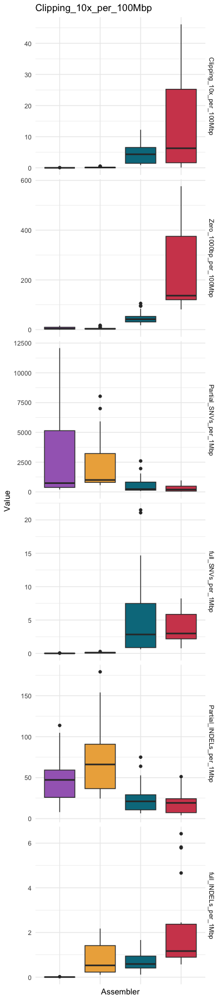

<div class="extra-info" markdown="1">

<span class="extra-info-header">Summary</span>

**The purpose of this page** is to provide access to our bioinformatics workflow that generated the results for our study titled "**Assemblies of long-read metagenomes suffer from diverse forms of errors**" by [Trigodet et al.](https://doi.org/10.1101/2025.04.22.649783).

In addition to providing a level of transparency to clarify our findings, we are hoping that the workflow implemented on this page can be used to include additional assemblers or datasets to advance these benchmarks.

Here are the DOIs for the intermediate data products:
- The assemblies: [10.6084/m9.figshare.29107748.v3](https://doi.org/10.6084/m9.figshare.29107748.v3)
- The anvi'o contigs and profile databases: [10.6084/m9.figshare.29246210](https://doi.org/10.6084/m9.figshare.29246210)
- The outputs of `anvi-script-find-misassemblies`: [10.6084/m9.figshare.29279228](https://doi.org/10.6084/m9.figshare.29279228)
- The two pangenomes of *Methanothrix* and *E. coli*: [10.6084/m9.figshare.29864903](https://doi.org/10.6084/m9.figshare.29864903)

Unfortunately, the alignment files are way to large to be shared (over 2Tb in total). But the following workflow will help you reproduce them.

---

**A quick note from Meren for those who made it all the way here**: _Evaluating the work of others and offering critical insights is a difficult task. Nevertheless, we committed ourselves to this endeavor with a sense of responsibility towards our community, and with the hope that a broader recognizing of these issues may serve as the first step towards addressing and ultimately eliminating most critical errors in long-read assembly outputs. We recognize that developing assembly algorithms, especially for metagenomes, is a notoriously complex and difficult task. Our investigations have only deepened our appreciation for those who dedicate their time and expertise to creating and maintaining these algorithms, which undoubtedly represent one of the pillars of modern microbiology. We remain grateful for their contributions and for sharing their talents with the scientific community._
</div>

{:.notice}
If you have any questions, notice an issue, and/or are unable to find an important piece of information here, please feel free to leave a comment down below, send an e-mail to [us](/people/), or get in touch with us through Discord:




## Study description

With current long-read sequencing technologies and their associated assemblers, we are able to generate complete and circular genomes from metagenomes. We noticed that most practices to benchmark long-read assemblers rely on contigs' length distribution, alignment to reference genomes (in the case of mock community), number of high-quality and complete MAGs; but they rarely take into account the agreement of individual long read back to their assembly.

We used long-read mapping to identify potential assembly errors in 4 long-read assemblers, using 21 HiFi Pacbio metagenomes from various biome, including two commonly used mock communities. To do this, we (1) assembled the 21 metagenomes with the 4 different assemblers, (2) mapped long reads back to their respective assembly, (3) run the command , (4) summarized the outputs, (5) manually investigated some examples of assembly errors.

As we progressed in our investigation of assembly errors, we also notice a high number of repeated sequence, particularly on short circular contigs. These repeats did not look natural and escaped our approach using long-read mapping signal to find issues in long-read assemblies but we found a way to report them.

## Downloading the data for this reproducible workflow

This reproducible workflow describes all steps that start from raw sequencing data to intermediate data products we have generated, which supported all our analyses:

 - Assembled contigs in the form of anvi'o  files.
 - Read recruitment results as BAM files along with the anvi'o  files.

### Downloading metagenomes

All the raw data used in this study are publicly available through the following SRA accession ids:

```
SRR15214153
SRR15275213
SRR15275212
SRR15275211
SRR15275210
SRR10963010
SRR14289618
ERR7015089
ERR10905741
ERR10905742
ERR10905743
SRR11606871
SRR13128014
SRR31805823
SRR31805822
SRR31805821
SRR31805820
SRR31805819
SRR31805818
SRR31805817
SRR31805816
```

You can use the program  with the anvi'o workflow [sra-download](https://anvio.org/help/main/workflows/sra-download/) to download all of these metagenomes by simply including a path for the `SRA_accession_list` variable in the workflow config file to point to a text file (i.e., `SRA_accession_list.txt`) with accession IDs above after generating a default workflow contig:

```bash
anvi-run-workflow -w sra_download -c config.json
```

{:.notice}
These metagenomes take a total disk space of 417.1 Gb

After downloading all 21 metagenomes, you will need a  file that contains the name and path for each metagenome. It is a two-column TAB delimited file that should look like this (where `/path/to/` is replaced with the appropriate path for these metagenomes on your system):

```
sample    path
ATCC    /path/to/ATCC.fq.gz
Zymo_HiFi    /path/to/Zymo_HiFi.fq.gz
HumanO1    /path/to/HumanO1.fq.gz
Human02    /path/to/Human02.fq.gz
HumanV1    /path/to/HumanV1.fq.gz
HumanV2    /path/to/HumanV2.fq.gz
SheepA    /path/to/SheepA.fq.gz
SheepB    /path/to/SheepB.fq.gz
Chicken    /path/to/Chicken.fq.gz
AD2W1    /path/to/AD2W1.fq.gz
AD2W20    /path/to/AD2W20.fq.gz
AD2W40    /path/to/AD2W40.fq.gz
AD_sludge    /path/to/AD_sludge.fq.gz
HADS_001    /path/to/HADS_001.fq.gz
HADS_002    /path/to/HADS_002.fq.gz
HADS_005    /path/to/HADS_005.fq.gz
HADS_006    /path/to/HADS_006.fq.gz
HADS_007    /path/to/HADS_007.fq.gz
HADS_008    /path/to/HADS_008.fq.gz
HADS_013    /path/to/HADS_013.fq.gz
HADS_014    /path/to/HADS_014.fq.gz
```

## Details of the computational environment

We used the anvi'o version `8-dev`, which is the development version following the `v8` stable release. We introduced the program  between `v8` and the next stable release `v9`. This reproducible workflow should work without a problem with more recent version of anvi'o. If that is not the case, please reach out to any of us.

Besides anvi'o, another very useful software is [IGV](https://igv.org/doc/desktop/) (v2.17.4). We used it to manually inspect the results from  and to generate some the of figures in the paper.

Assuming you want to reproduce a part or all of this study, choose your favorite working directory and store it as a variable `$WD`:

```bash
cd /where/you/want/to/work
WD=$PWD
```

The rest of the document will make use of the terminal variable `$WD`. We assume that your  file is in `$WD`, along with an empty subdirectory for each assembler. Here is how the `$WD` should look like at this stage:

```
.
├── HiCanu
├── hifiasm-meta
├── metaFlye
├── metaMDBG
└── samples.txt
```

Most of the work was carried out on an high performance computing cluster, using the job scheduler slurm. This reproducible workflow does not include any reference to slurm or PBS in the command lines. If you are interested, we use a slurm wrapper called [clusterize](https://github.com/merenlab/clusterize) to make our lives easier.

## Metagenomic assembly

We started our analysis by assembling each long-read sequencing dataset using [HiCanu v2.2](https://github.com/marbl/canu), [hifiasm-meta v0.3](https://github.com/xfengnefx/hifiasm-meta), [metaFlye v2.9.5](https://github.com/mikolmogorov/Flye) and [metaMDBG v0.3, v1 and v1.1](https://github.com/GaetanBenoitDev/metaMDBG). In the following sections, we share the detailed commands that we used for each assembler.


#### HiCanu

We ran HiCanu with similar flags as [Feng et al. 2022](https://doi.org/10.1038/s41592-022-01478-3) did in their benchmark between hifiasm-meta, metaFlye and HiCanu. With the flag `useGrid=false`, Canu would use all resource available, which was set to 120 CPUs with slurm.

```bash
mkdir -p $WD/HiCanu/01_ASSEMBLIES
cd $WD/HiCanu/01_ASSEMBLIES

while read sample path
do
  if [ ${sample} == "sample" ]; then continue; fi
  canu maxInputCoverage=1000 genomeSize=100m batMemory=200 useGrid=false -d ${sample} -p ${sample} -pacbio-hifi $path
done < ../../samples.txt
```

#### hifiasm-meta

For hifiasm-meta, we simply run the assembler with the default parameters.

```bash
mkdir -p $WD/hifiasm-meta/01_ASSEMBLIES
cd $WD/hifiasm-meta/01_ASSEMBLIES

while read sample path
do
  if [ ${sample} == "sample" ]; then continue; fi
  mkdir -p ${sample}
  hifiasm_meta -o ${sample}/${sample} -t 120 $path
done < ../../samples.txt
```

#### metaFlye

We used the flags `--meta` and `--pacbio-hifi`:

```bash
mkdir -p $WD/metaFlye/01_ASSEMBLIES
cd $WD/metaFlye/01_ASSEMBLIES

while read sample path
do
  if [ ${sample} == "sample" ]; then continue; fi
  flye --meta --pacbio-hifi $path -o ${sample} -t 20
done < ../../samples.txt
```

#### metaMDBG

We used two version of metaMDBG: v0.3 the original version used in the metaMDBG paper; and v1, the latest version at the time of making this study. Note that in our paper, we only kept the results of v1 as both version were very similar. The results for v0.3 are present in the supplementary materials.

For v0.3, we used the default parameters:

```bash
mkdir -p $WD/metaMDBG-0.3/01_ASSEMBLIES
cd $WD/metaMDBG-0.3/01_ASSEMBLIES

while read sample path
do
  if [ ${sample} == "sample" ]; then continue; fi
  metaMDBG asm ${sample} $path -t 40
done < ../../samples.txt
```

And for v1, we used the flag `--in-hifi` for the input sequences. The rest of the parameters are left as default.

```bash
mkdir -p $WD/metaMDBG-1/01_ASSEMBLIES
cd $WD/metaMDBG-1/01_ASSEMBLIES

while read sample path
do
  if [ ${sample} == "sample" ]; then continue; fi
  metaMDBG asm --out-dir ${sample} --in-hifi $path --threads 40
done < ../../samples.txt
```

We also ran metaMDBG v1.1 which was released after we started this analysis. We used the same command as for v1.

## Finalizing assembled FASTA files

Not all assemblers create a fasta file and/or provide low level summaries table like contig lengths and circularity. But they all have that information store in various fashion.

I also decided to rename all the contigs to make the downstream investigation a little bit easier. I wanted the name of the assembler, the name of the sample, whether the contig is circular or linear, and have the original contigs' name too. Here is the renaming structure I wanted:

```
assembler_sample_[circular,linear]_original-contig-name
```
For instance for metaMDBG:
```
>metaMDBG_Chicken_circular_ctg744
```

I could have added contig's length, but you will see that it is reported in most outputs anyway.

I made custom scripts for each assembler to accommodate for their difference in output format. These scripts output a renamed fasta file `assembly_renamed.fa` per assembly, a low level summary table for each contigs (name, length, circularity) `asssembly_renamed_info.txt`, and a single  per assembler for downstream application. If you are allergic to `awk` commands, maybe now is a good time to give up on this reproducible workflow.

#### HiCanu

Nothing special for the output of HiCanu. The circularity nature of the contigs is stored in the fasta defline `suggestCircular=yes/no`.

```bash
cd $WD/HiCanu/01_ASSEMBLIES

echo -e "name\tpath" > fasta.txt

for sample in `sed 1d ../../samples.txt | cut -f1`
do
  # rename
  awk -v sample="${sample}" 'BEGIN{FS=" "}{if($0 ~ />/){if(seq!=""){print seq}; gsub(">","",$0); if($7=="suggestCircular=yes"){cir="circular"}else{cir="linear"}; print ">HiCanu_" sample "_" cir "_" $1; seq=""; next}else{seq = seq $0}}END{print seq}' ${sample}/${sample}.contigs.fasta > ${sample}/assembly_renamed.fasta

  # summary with new name
  echo -e "contig_id\tlength\tcircular" > ${sample}/assembly_renamed_info.txt
  awk 'BEGIN{FS="_"}{if($0 ~ />/){gsub(">","", $0); contig_name=$0; if($0 ~ /circular/){cir="circular"}else{cir="linear"}; next}else{print contig_name "\t" length($0) "\t" cir; next}}' ${sample}/assembly_renamed.fasta >> ${sample}/assembly_renamed_info.txt

  # fasta.txt
  echo -e "${sample}\t${PWD}/${sample}/assembly_renamed.fasta" >> fasta.txt
done
```

#### hifiasm-meta

The output of hifiasm-meta does not include a fasta file. The contigs are stored in a graph format file `*.p_ctg.gfa`. I am sure there are other ways to convert a gfa to fasta, but `awk` is my friend.

```bash
cd $WD/hifiasm-meta/01_ASSEMBLIES

echo -e "name\tpath" > fasta.txt

for sample in `sed 1d ../../samples.txt | cut -f1`
do
  # rename
  awk -v sample="${sample}" '/^S/{i=substr($2, length($2)); if(i=="c"){cir="circular"}else{cir="linear"}; gsub(/\./,"_",$2); print ">hifiasm_meta_"sample"_"cir"_"$2"\n"$3}' ${sample}/${sample}.p_ctg.gfa > ${sample}/assembly_renamed.fasta

  # summary with new name
  echo -e "contig_id\tlength\tcircular" > ${sample}/assembly_renamed_info.txt
  awk 'BEGIN{FS="_"}{if($0 ~ />/){gsub(">","", $0); contig_name=$0; if($0 ~ /circular/){cir="circular"}else{cir="linear"}; next}else{print contig_name "\t" length($0) "\t" cir; next}}' ${sample}/assembly_renamed.fasta >> ${sample}/assembly_renamed_info.txt

  # fasta.txt
  echo -e "${sample}\t${PWD}/${sample}/assembly_renamed.fasta" >> fasta.txt
done
```


#### metaFlye

Flye provides the most user friendly output: a fasta file and a summary file. It is honestly this summary file that inspired me to make one for each assembler. For consistency, I am still making my own summary in the same way as I did for the other assemblers.

```bash
cd $WD/metaFlye/01_ASSEMBLIES

echo -e "name\tpath" > fasta.txt
for sample in `sed 1d ../../samples.txt | cut -f1`
do
  # rename
  awk -v sample="${sample}" 'NR==FNR{if($4=="Y"){cir="circular"}else{cir="linear"}; a[$1]=cir; next}NR!=FNR{if($1 ~ />/){if(seq!=""){print seq}; gsub(">","",$1); print ">metaFlye_" sample "_" a[$1] "_" $1; seq=""; next}else{seq=seq $0}}END{print seq}' ${sample}/assembly_info.txt ${sample}/assembly.fasta > ${sample}/assembly_renamed.fasta

  # summary with new name
  echo -e "contig_id\tlength\tcircular" > ${sample}/assembly_renamed_info.txt
  awk 'BEGIN{FS="_"}{if($0 ~ />/){gsub(">","", $0); contig_name=$0; if($0 ~ /circular/){cir="circular"}else{cir="linear"}; next}else{print contig_name "\t" length($0) "\t" cir; next}}' ${sample}/assembly_renamed.fasta >> ${sample}/assembly_renamed_info.txt

  # fasta.txt
  echo -e "${sample}\t${PWD}/${sample}/assembly_renamed.fasta" >> fasta.txt
done
```

#### metaMDBG

The contigs info for metaMDBG are all in the defline of the fasta file. The format changed a bit between v0.3 and v1, so two different renaming script for you.

For v0.3:

```bash
cd $WD/metaMDBG-0.3/01_ASSEMBLIES

echo -e "name\tpath" > fasta.txt
for sample in `sed 1d ../../samples.txt | cut -f1`
do
  # rename
  zcat ${sample}/contigs.fasta.gz | awk -v sample="${sample}" 'BEGIN{FS="_"}{if($0 ~ />/){gsub(">","",$0); if($3=="c"){cir="circular"}else{cir="linear"}; print ">metaMDBG_v0_3_" sample "_" cir "_" $1; next}else{print}}' > ${sample}/assembly_renamed.fasta

  # summary with new name
  echo -e "contig_id\tlength\tcircular" > ${sample}/assembly_renamed_info.txt
  awk 'BEGIN{FS="_"}{if($0 ~ />/){gsub(">","", $0); contig_name=$0; if($0 ~ /circular/){cir="circular"}else{cir="linear"}; next}else{print contig_name "\t" length($0) "\t" cir; next}}' ${sample}/assembly_renamed.fasta >> ${sample}/assembly_renamed_info.txt

  # fasta.txt
  echo -e "${sample}\t${PWD}/${sample}/assembly_renamed.fasta" >> fasta.txt
done
```

For v1 (and v1.1):
```bash
cd $WD/metaMDBG-1/01_ASSEMBLIES

echo -e "name\tpath" > fasta.txt

for sample in `sed 1d ../../samples.txt | cut -f1`
do
  # rename
  zcat ${sample}/contigs.fasta.gz | awk -v sample="${sample}" 'BEGIN{FS=" "}{if($0 ~ />/){gsub(">","",$0); if($4=="circular=yes"){cir="circular"}else{cir="linear"}; print ">metaMDBG_v1_" sample "_" cir "_" $1; next}else{print}}' > ${sample}/assembly_renamed.fasta

  # summary with new name
  echo -e "contig_id\tlength\tcircular" > ${sample}/assembly_renamed_info.txt
  awk 'BEGIN{FS="_"}{if($0 ~ />/){gsub(">","", $0); contig_name=$0; if($0 ~ /circular/){cir="circular"}else{cir="linear"}; next}else{print contig_name "\t" length($0) "\t" cir; next}}' ${sample}/assembly_renamed.fasta >> ${sample}/assembly_renamed_info.txt

  # fasta.txt
  echo -e "${sample}\t${PWD}/${sample}/assembly_renamed.fasta" >> fasta.txt
done
```

Retrospectively, what would I have done differently? I would make sure not to include `_` in the name of the assembler like I did for metaMDBG_v1 or hifi_meta. It creates an uneven number of fields between the assemblers. Beginner mistake. No cookies for me.


## Mapping long reads back to assemblies

{:.notice}
In the following sections, you will see bash commands nested in a double loop (per assembler and per sample). These command would take a really long time if run sequentially. In reality I ran the nested command using slurm on an high-performance cluster.

When it comes to mapping long reads, the most commonly used program is probably [minimap2](https://github.com/lh3/minimap2). We used it to map each samples' long reads to their respective assembly by each assembler.

We used the same minimap2 command for all assemblers:

```bash
for assembler in HiCanu hifiasm-meta metaFlye metaMDBG-0.3 metaMDBG-1 metaMDBG-1-1
do
    cd $WD/${assembler}

    while read sample path
    do
      if [ ${sample} = "name" ]; then continue; fi
      mkdir -p 02_MAPPING/${sample}
      path_reads=`grep ${sample} $WD/samples.txt | cut -f2`
      minimap2 -ax map-hifi \
               -p 1 \
               -o 02_MAPPING/${sample}/${sample}.sam \
               -t 12 \
               --secondary-seq \
               $path \
               $path_reads
    done < fasta.txt
done
```

By default, minimap2 reports secondary mapping if their alignment score is over 80% of the primary mapping score. Secondary mapping, also called multi-mapping, is when a read can map in multiple places. We want to keep secondary mapping if their alignment quality is as good as the primary alignment, so we used the flag `-p 1` which control the min ratio of secondary/primary score. You may argue that allowing multi-mapping can created artificially inflated coverage values in certain cases, and I would agree with you. For this analysis however, I want to maximise the chances for long read to map anywhere that is equally good.

Another default behavior of minimap2 regarding secondary mapping is that it does not report the read sequence in the resulting sam/bam file. It make sense if you want to save some redundancy and therefore some valuable disk space. However, the anvio profiler skip any entry in a bam file that does not have a read sequence, notably because it won't be able to compute single-nucleotide variants and insertion-deletions. We used the flag `--secondary-seq` to make sure minimap2 does actually report a read sequence for every entry in the sam/bam, including for secondary mapping.

Next we need to convert the sam file to a bam file, sort it and index. For the second step, I am using .

```bash
# sam to bam
for assembler in HiCanu hifiasm-meta metaFlye metaMDBG-0.3 metaMDBG-1 metaMDBG-1-1
do
    cd $WD/${assembler}

    while read sample path
    do
        if [ ${sample} = "name" ]; then continue; fi
        samtools view -bS -F 4 -@ 12 02_MAPPING/${sample}/${sample}.sam -o 02_MAPPING/${sample}/${sample}-RAW.bam
    done < fasta.txt
done

# sorting and indexing with anvi-init-bam
for assembler in HiCanu hifiasm-meta metaFlye metaMDBG-0.3 metaMDBG-1 metaMDBG-1-1
do
    cd $WD/${assembler}

    while read sample path
    do
        if [ ${sample} = "name" ]; then continue; fi
        anvi-init-bam -T 12 -o 02_MAPPING/${sample}/${sample}.bam 02_MAPPING/${sample}/${sample}-RAW.bam
    done < fasta.txt
done
```


## Running anvi-script-find-misassemblies

That's it. You have the minimum required input to run the command , which is a  of long reads mapped onto an assembly made from these long reads.

To run the command:
```bash
for assembler in HiCanu hifiasm-meta metaFlye metaMDBG-0.3 metaMDBG-1 metaMDBG-1-1
do
    cd $WD/${assembler}
    mkdir -p 03_MISASSEMBLIES

    while read sample path
    do
        if [ ${sample} = "name" ]; then continue; fi
        anvi-script-find-misassemblies -b 02_MAPPING/${sample}/${sample}.bam -o 03_MISASSEMBLIES/${sample} --just-do-it
    done < fasta.txt
done
```

The script creates two output files: one for clipping events and one for contig regions with no coverage. Check out [the help page for this command](https://anvio.org/help/main/programs/anvi-script-find-misassemblies/) to learn more about clipping events, the outputs format and default parameters.

## Generating anvi'o contigs and profile databases

Running  is only half the fun. Yes, it does tell us which contigs have clipping events and therefore likely contains an assembly error, but it does not tell us about the nature of these errors. To better understand the nature and consequence of these clipping events, we can use anvi'o to create and annotate contigs and profile database. This will allow us to compute (1) completion/redundancy estimate, (2) SNVs/INDELs profile, (3) import and summarize gene level taxonomy, ...

### Contigs database

We used the build-in anvi'o snakemake workflow to generate and annotate contigs databases. The command  needs two inputs: (1) which workflow we want to run and (2) a json config file that specify which rules and parameters we want to run in the workflow.

For this workflow, I wanted to run  to identify microbial single-copy core genes, ribosomal RNAs and tRNAs. The only other command I wanted to include is  to get ribosomal protein level taxonomy estimation.

Here is the config file that is present in each assembler sub-directory:

{:.notice}
As you can see in the following config file, I am using a number of threads that are only suitable for an high-performance cluster. If you want to reproduce all or part of this work on a smaller machine, please scale down the `threads` and `max_threads` accordingly.

```json
{
    "fasta_txt": "fasta.txt",
    "anvi_gen_contigs_database": {
        "--project-name": "{group}",
        "threads": 60
    },
    "anvi_run_hmms": {
        "run": true,
        "threads": 60,
        "--also-scan-trnas": true
    },
    "anvi_run_kegg_kofams": {
        "run": false
    },
    "anvi_run_ncbi_cogs": {
        "run": false
    },
    "anvi_run_scg_taxonomy": {
        "run": true,
        "threads": 60
    },
    "anvi_script_reformat_fasta": {
        "run": false
    },
    "output_dirs": {
        "CONTIGS_DIR": "04_CONTIGS",
        "LOGS_DIR": "00_LOGS"
    },
    "max_threads": 300,
    "config_version": "3",
    "workflow_name": "contigs"
}
```

Now to run the workflow for each assembler:

{:.notice}
If you are running a similar workflow on a HPC then  can use your scheduler (slurm, PBS) to send individual rules as independent jobs on the cluster. This is exactly what I did, even thought the following command does not include the flags for it because my HPC/scheduler is potentially different than yours. Check [this tutorial](https://merenlab.org/2018/07/09/anvio-snakemake-workflows/#what-to-do-when-submitting-jobs-with-a-slurm-system) to learn how you can make it work.

```bash
for assembler in HiCanu hifiasm-meta metaFlye metaMDBG-0.3 metaMDBG-1 metaMDBG-1-1
do
    cd $WD/${assembler}
    anvi-run-workflow -w contigs -c config.json
done
```

### Summarize the contigs databases

Once we have the contigs databases, we can use  to generate common contig length distribution statistics, but also leverage the SCGs collections to estimate the number of microbial populations in each assembly.

```bash
for assembler in HiCanu hifiasm-meta metaFlye metaMDBG-0.3 metaMDBG-1 metaMDBG-1-1
do
    cd $WD/${assembler}
    mkdir -p 05_CONTIGS_STATS

    for sample in `sed 1d fasta.txt | cut -f1`
    do
        anvi-display-contigs-stats --report-as-text -o 05_CONTIGS_STATS/${sample}.txt 04_CONTIGS/${sample}-contigs.db
    done
done
```

### Profile database

In addition to the contigs database, we generated profile database that parse bam file to quantify nucleotide level coverage, single-nucleotide variation and insertion-deletion events.

If you are familiar with anvi'o build-in workflow, you probably wonder why we did not use the "metagenomics" workflow in reference mode because it is basically the "contigs" workflow with mapping and profiling included. Well, at the time of writing, the "metagenomic" workflow only works with short-read metagenome, specifically paired-end reads only. If you are reading this in 2027 and we have not yet updated the workflow for long-read metagenome, then I owe you a coffee or a tea for your patience.

Here is the command used to profile the bam files:

```bash
for assembler in HiCanu hifiasm-meta metaFlye metaMDBG-0.3 metaMDBG-1 metaMDBG-1-1
do
    cd $WD/${assembler}

    while read sample path
    do
        if [ ${sample} = "name" ]; then continue; fi
        anvi-profile -i 02_MAPPING/${sample}/${sample}.bam -o 06_PROFILE/${sample} -T 60 -S ${sample} -c 04_CONTIGS/${sample}-contigs.db
    done < fasta.txt
done
```

### Collection

Over the course of this analysis we had various question for specif contigs, like the SCG completion/redundancy for large circular contigs (over 1 Mbp, a.k.a potential complete genomes), for all circular contigs, or for all contigs over 100 Mbp long. For that we can leverage the  system in anvi'o. Collection were created for storing binning result, where a set of contigs was associated with a bin name. Then you can use load of anvi'o command to get summary statistic for each bins, like . In this case, I don't want to bin together contigs, I want each contigs to represent its own 'bin' and estimate taxonomy, or SCG completion/redundancy for each contig of interest. The solution is pretty simple, I just need to make collections where the name of the bin is the name of the contigs.

First, I need to create  files for each assembler/sample pair and for each contig collection that I am interested in, like only circular contigs or only large contigs, etc. To do that, I will parse the low-level assembly text file that I generated earlier:

```bash
for assembler in HiCanu hifiasm-meta metaFlye metaMDBG-0.3 metaMDBG-1 metaMDBG-1-1
do
    cd $WD/${assembler}
    mkdir -p 07_COLLECTION

    while read sample path
    do
        if [ ${sample} = "name" ]; then continue; fi
        # collection for contigs over 1 Mbp
        awk 'NR>1{if($2>1000000){print $1 "\t" $1}}' 01_ASSEMBLIES/${sample}/assembly_renamed_info.txt > 07_COLLECTION/${sample}-long.txt

        # collection for all circular contigs
        awk 'NR>1{if($3=="circular"){print $1 "\t" $1}}' 01_ASSEMBLIES/${sample}/assembly_renamed_info.txt > 07_COLLECTION/${sample}-circular.txt

        # collection for circular contigs over 500 kbp
        awk 'NR>1{if($2>500000 && $3=="circular"){print $1 "\t" $1}}' 01_ASSEMBLIES/${sample}/assembly_renamed_info.txt > 07_COLLECTION/${sample}-long-circular.txt

        # collection for contig over 100 kbp
        awk 'NR>1{if($2>100000){print $1 "\t" $1}}' 01_ASSEMBLIES/${sample}/assembly_renamed_info.txt > 07_COLLECTION/${sample}-min100k.txt
    done < fasta.txt
done
```

And once we have all the , we can use  to import them into the profile database:

```bash
for assembler in HiCanu hifiasm-meta metaFlye metaMDBG-0.3 metaMDBG-1 metaMDBG-1-1
do
    cd $WD/${assembler}
    mkdir -p 07_COLLECTION

    while read sample path
    do
        if [ ${sample} = "name" ]; then continue; fi
        anvi-import-collection -c 04_CONTIGS/${sample}-contigs.db \
            -p 06_PROFILE/${sample}/PROFILE.db \
            -C LONG \
            --contigs-mode \
            07_COLLECTION/${sample}-long.txt

        anvi-import-collection -c 04_CONTIGS/${sample}-contigs.db \
            -p 06_PROFILE/${sample}/PROFILE.db \
            -C CIRCULAR \
            --contigs-mode \
            07_COLLECTION/${sample}-circular.txt

        anvi-import-collection -c 04_CONTIGS/${sample}-contigs.db \
            -p 06_PROFILE/${sample}/PROFILE.db \
            -C LONG_CIRCULAR \
            --contigs-mode \
            07_COLLECTION/${sample}-long-circular.txt

        anvi-import-collection -c 04_CONTIGS/${sample}-contigs.db \
            -p 06_PROFILE/${sample}/PROFILE.db \
            -C MIN100k \
            --contigs-mode \
            07_COLLECTION/${sample}-min100k.txt
    done < fasta.txt
done
```

### Gene level taxonomy

In the figure 2 of the paper where we show a few example of chimeric contigs, you can see a layer representing taxonomy over the contigs. This was computed using gene level taxonomy with [Kaiju](https://github.com/bioinformatics-centre/kaiju).

Kaiju was developed to perform short-read level taxonomy, but in this case we extract all gene calls for the contigs database and used them as input for Kaiju. We then imported the results in the contigs database using .

The first step is to export the gene calls from the contigs databases:
```bash
for assembler in HiCanu hifiasm-meta metaFlye metaMDBG-0.3 metaMDBG-1 metaMDBG-1-1
do
    cd $WD/${assembler}
    mkdir -p 08_KAIJU/gene_calls

    while read sample path
    do
        if [ ${sample} = "name" ]; then continue; fi
        anvi-get-sequences-for-gene-calls -o 08_KAIJU/gene_calls/${sample}.fa -c 04_CONTIGS/${sample}-contigs.db
    done < fasta.txt
done
```

Then we can run Kaiju:

{:.notice}
Kaiju is not installed in the anvi'o conda environment. Make sure you install it properly, like in a separate conda environment and activate it before running the following commands. Note that you will need to download a reference database using `kaiju-makedb`. I used the `nr_euk` database which include the NCBI BLAST nr database and additional protein from fungi and microbial eukaryotes.

```bash
for assembler in HiCanu hifiasm-meta metaFlye metaMDBG-0.3 metaMDBG-1 metaMDBG-1-1
do
    cd $WD/${assembler}

    while read sample path
    do
        if [ ${sample} = "name" ]; then continue; fi

        # replace the path to kaiju database with the appropriate one
        kaiju -t /PATH/TO/KAIJU/DATABASE/nr_euk/nodes.dmp \
          -f /PATH/TO/KAIJU/DATABASE/nr_euk/nr_euk/kaiju_db_nr_euk.fmi \
          -i 08_KAIJU/gene_calls/${sample}.fa \
          -o 08_KAIJU/${sample}_nr_euk.out \
          -z 30 \
          -v
    done < fasta.txt
done
```

Before we import the results back into the contigs database, we need to run the command `kaiju-addTaxonNames` to add taxon name to the Kaiju output:

```bash
for assembler in HiCanu hifiasm-meta metaFlye metaMDBG-0.3 metaMDBG-1 metaMDBG-1-1
do
    cd $WD/${assembler}

    while read sample path
    do
        if [ ${sample} = "name" ]; then continue; fi

        kaiju-addTaxonNames -t /PATH/TO/KAIJU/DATABASE/nr_euk/nodes.dmp \
          -n /PATH/TO/KAIJU/DATABASE/nr_euk/names.dmp \
          -i 08_KAIJU/${sample}_nr_euk.out \
          -o 08_KAIJU/${sample}_nr_euk.names \
          -r superkingdom,phylum,order,class,family,genus,species
    done < fasta.txt
done
```

Now we can finally import the gene level taxonomy into the contigs database with 

```bash
for assembler in HiCanu hifiasm-meta metaFlye metaMDBG-0.3 metaMDBG-1 metaMDBG-1-1
do
    cd $WD/${assembler}

    while read sample path
    do
        if [ ${sample} = "name" ]; then continue; fi
        anvi-import-taxonomy-for-genes -c 04_CONTIGS/${sample}-contigs.db -p kaiju -i 08_KAIJU/${sample}_nr_euk.names --just-do-it
    done < fasta.txt
done
```

### SNVs and INDELs

We want to report instance where single-nucleotide variants and insertions/deletions did not agree with the majority of long read or not supported at all by any long read. To access that information, we first need to export the 'variable nucleotide' and 'indels' table from the profile database:

```bash
for assembler in HiCanu hifiasm-meta metaFlye metaMDBG-0.3 metaMDBG-1 metaMDBG-1-1
do
    cd $WD/${assembler}
    mkdir -p 09_SNV_INDELS

    while read sample path
    do
        if [ ${sample} = "name" ]; then continue; fi
        anvi-export-table --table indels 06_PROFILE/${sample}/PROFILE.db -o 09_SNV_INDELS/indels-${sample}.txt
        anvi-export-table --table variable_nucleotides 06_PROFILE/${sample}/PROFILE.db -o 09_SNV_INDELS/SNVs-${sample}.txt
    done < fasta.txt
done
```

We compute the actual number of unsupported SNVs/INDELs, or supported by a minority of long reads later when we compute the global summary. We also computed the number of genes impacted by these unexpected SNVs/INDELs.

## BLAST-searching assembled sequences that lack coverage

From the output of , we found many region with no apparent coverage. For these sequence, there are two possibilities: either the mapper failed to map the reads where they should, or the underlying sequence does not exist in the long reads. While the assembler is not responsible for mapping failure, it should not generate made-up sequence, and to check for them I simply blasted the region with no apparent coverage against the original long reads and counted the contig sequences with no hits.

First, we need to make a blast database of the long reads:

```bash
cd $WD
mkdir -p LONG_READ_BLASTDB

while read sample path
do
    if [ ${sample} = "sample" ]; then continue; fi
    # the sed command convert the fastq to fastq which is directly passed to makeblastdb
    zcat $reads | sed -n '1~4s/^@/>/p;2~4p' | makeblastdb -out LONG_READ_BLASTDB/${sample} -dbtype nucl -title ${sample}
done < samples.txt
```

Then, from the output of , I extract regions of contigs longer than 500 bp with no apparent coverage. I create a bed file from these location and use [bedtools](https://github.com/arq5x/bedtools2) to create a fasta file which will be my subject sequences for the blast against the long reads:

```bash
for assembler in HiCanu hifiasm-meta metaFlye metaMDBG-0.3 metaMDBG-1 metaMDBG-1-1
do
    cd $WD/${assembler}

    while read sample path
    do
        if [ ${sample} = "name" ]; then continue; fi
        mkdir -p 10_BLAST_ZERO_COVERAGE/${sample}
        awk '$4>500 && NR>1{split($3,a, "-");OFS="\t"; print $1,a[1],a[2]}' 03_MISASSEMBLIES/${sample}-zero_cov.txt > 10_BLAST_ZERO_COVERAGE/${sample}/zero_cov_regions.bed
        bedtools getfasta -fi 01_ASSEMBLIES/${sample}/assembly_renamed.fasta -bed 10_BLAST_ZERO_COVERAGE/${sample}/zero_cov_regions.bed > 10_BLAST_ZERO_COVERAGE/${sample}/zero_cov_regions.fa

        blastn -query 10_BLAST_ZERO_COVERAGE/${sample}/zero_cov_regions.fa -num_threads 5 -db $WD/LONG_READ_BLASTDB/${sample} -dust no -max_target_seqs 1 -outfmt 7 -out 10_BLAST_ZERO_COVERAGE/${sample}/zero_cov_regions_ouput.txt
    done < fasta.txt
done
```

Now I want to find the query with no hits. If you paid attention to the previous command, you probably noticed that I use the blast output format 7 which is 'Tabular with comment lines'. It is very similar to the classic format 6 (tab-delimited table) but it contains additional commented lines, including one that say how many hits were found. I will use that line to search for query sequence with no hit.

```bash
for assembler in HiCanu hifiasm-meta metaFlye metaMDBG-0.3 metaMDBG-1 metaMDBG-1-1
do
    grep -h -B2 "# 0 hits" ${assembler}/10_BLAST_ZERO_COVERAGE/*/zero_cov_regions_ouput.txt |\
        grep Query |\
        cut -d ' ' -f3 |\
        awk -F ":" '{OFS="\t"; split($2, a, "-"); print $0, a[2]-a[1]}' >> non_existing_sequence.txt
done
```

The output of this command can be found in the Supplementary Table 3.

## Characterizing prematurely circularized contigs

One of the most dramatic errors a long-read assembler can make is to falsely report a contig as circular when part of a genome is missing. It is rather difficult to estimate the rate of this type of error because they can be hard to detect in the first place. We decided to compute the number of circular contigs under 500 kbp with at least three ribosomal proteins as a proxy for the rate of premature circularization and allow us to compare the different assemblers.

We don't have an anvi'o command to directly extract the number of contigs matching our criteria. But we can write a short python script to do it for us:

```python
#!/usr/bin/env python
# -*- coding: utf-8
"""Computes number of circular contigs < 500kbp with at least x RP genes"""

import os
import sys
import anvio
import anvio.utils as utils
import argparse

from anvio.dbops import ContigsSuperclass
from anvio.argparse import ArgumentParser
from anvio.ccollections import Collections
from anvio.hmmops import SequencesForHMMHits
from anvio.errors import ConfigError, FilesNPathsError, DictIOError


def main(args):
    input_table = open(args.input_table)
    hmm_sources = ['Bacteria_71', 'Archaea_76']
    collections = Collections()
    min_rp = int(args.min_RP)

    d = {}
    entry_count = 0
    # going through each sample
    for entry in input_table:
        assembler, sample, contigs_db, profile_db = entry.strip().split("\t")
        entry_count += 1

        # add sample to dict
        d[entry_count] = {'sample': sample, 'assembler': assembler, 'count': 0}

        # get collection info
        collections = Collections()
        collections.populate_collections_dict(profile_db)
        collection = collections.get_collection_dict("CIRCULAR")

        # init contigs.db and filter for contigs < 500k
        i = argparse.Namespace(contigs_db=contigs_db)
        c = ContigsSuperclass(i)
        contig_info = c.contigs_basic_info.items()
        filtered_splits = {
                contig: splits for contig, splits in collection.items()
                if next((info['length'] for name, info in contig_info if name == contig), 0) < 500000
                }

        # get hit per bin
        s = SequencesForHMMHits(contigs_db)

        # get all RP genes in list of sources
        # and get hmm hits per bin
        gene_names = set()
        hit_per_bin = {}
        for source in hmm_sources:
            gene_names.update([g.strip() for g in s.hmm_hits_info[source]['genes'].split(',') if 'Riboso' in g or 'riboso' in g])
            # get the hits
            hits = s.get_hmm_hits_per_bin(filtered_splits, source = source)
            # update the main hit dict
            for genome in hits:
                if genome not in hit_per_bin:
                    hit_per_bin[genome] = hits[genome]
                else:
                    for gene in hits[genome]:
                        if gene not in hit_per_bin[genome]:
                            hit_per_bin[genome][gene] = hits[genome][gene]

        # how many genome with 2 rp
        for genome in hit_per_bin:
            count = 0
            for gene in gene_names:
                if gene in hit_per_bin[genome] and hit_per_bin[genome][gene] > 0:
                    count += 1
            if count >= min_rp:
                d[entry_count]['count'] += 1

    # write output
    utils.store_dict_as_TAB_delimited_file(d, args.output, headers = ['entry_count', 'sample', 'assembler', 'count'], do_not_write_key_column = True)


if __name__ == '__main__':
    # setup the command line user interface
    parser = ArgumentParser()
    parser.add_argument('--input-table', help = 'A tab delimited file with contigs_db and profile_db')
    parser.add_argument('--min-RP', help = 'Min number of Ribosomal protein to occur')
    parser.add_argument('--output', help = 'Outputfile')

    args = parser.get_args(parser)

    try:
        main(args)
    except ConfigError as e:
        print(e)
        sys.exit(-1)
    except FilesNPathsError as e:
        print(e)
        sys.exit(-2)
    except DictIOError as e:
        print(e)
        sys.exit(-3)
```

And here is how I ran it:

```bash
for assembler in HiCanu hifiasm-meta metaFlye metaMDBG-0.3 metaMDBG-1 metaMDBG-1-1
do
    for sample in `sed 1d samples.txt | cut -f1`
    do
        contig=${assembler}/04_CONTIGS/${sample}-contigs.db
        profile=${assembler}/06_PROFILE/${sample}/PROFILE.db
        echo -e "$assembler\t$sample\t$contig\t$profile" >> ${assembler}/input_prem_circular.txt
    done
    ./circ_contigs_with_min_RPs.py --input-table ${assembler}/input_prem_circular.txt --min-RP 3 --output ${assembler}/circ_contigs_with_min_RPs.txt"
done
```


## Finding repeats

After inspecting multiple contigs with either no coverage or with clipping events, we noticed that some were covered in repeated sequences, notably in short contigs. So we decided to go after repeated sequence in all contigs under 50 kbp, with a particular focus on circular contigs.

I looked for a software to identify repeats, and there were many but none that were able to automatically identify the repeats I could see during careful manual inspection. Many of these software are designed to find short tandem repeats, but most of the repeats I observed could be either slightly imperfect, distant from each other and rather long (multi kbp).

When I talk about manual inspection of contigs for repeats, I simply mean that I was blasting the contig against itself and then looking at the dotplot on NCBI BLAST. I found these plots very useful to understand the amount and distribution of repeats along a sequence. If I can see repeats in dotplots, then I must be able to extract that information from the blast output itself and systematically describe the amount and size of repeats. Even more interesting, I can compute the fraction of a contigs covered by repeated sequence (sequence found at least two times).

### Blast contigs against themselves

The first step is to blast all contigs against themselves:

```bash
for assembler in HiCanu hifiasm-meta metaFlye metaMDBG-0.3 metaMDBG-1 metaMDBG-1-1
do
    cd $WD/${assembler}

    for sample in `sed 1d fasta.txt | cut -f1`
    do
        mkdir -p 11_REPEATS/${sample}

        # blast and filter the output for recriprocal hits only (contigs against itself)
        makeblastdb -in 01_ASSEMBLIES/${sample}/assembly_renamed.fasta -out 11_REPEATS/${sample}/db -dbtype nucl
        blastn -query 01_ASSEMBLIES/${sample}/assembly_renamed.fasta -db 11_REPEATS/${sample}/db -outfmt 6 -num_threads 50 | awk '$1==$2' > 11_REPEATS/${sample}/blast_out.txt
    done
done
```

### Contigs covered with at least 70% of repeats

To compute the fraction of contigs coverage with sequence at least duplicated, we can simply create a bed file of the blast hits, excluding the perfect hit of the sequence against itself, and use [bedtools](https://github.com/arq5x/bedtools2) again to compute the (horizontal) coverage of repeats along the contig. We only considered repeats longer than 200 bp and with at least 80% identity.

```bash
for assembler in HiCanu hifiasm-meta metaFlye metaMDBG-0.3 metaMDBG-1 metaMDBG-1-1
do
    cd $WD/${assembler}

    for sample in `sed 1d fasta.txt | cut -f1`
    do
        # create a bed file, filter for min length 200bp and min identity 80%
        awk '{if (($7!=$9 || $8!=$10) && $3>=80 && $4>200){OFS="\t"; print $1,$7,$8}}' 11_REPEATS/${sample}/blast_out.txt > 11_REPEATS/${sample}/blast_out-RAW.bed
        bedtools sort -i 11_REPEATS/${sample}/blast_out-RAW.bed > 11_REPEATS/${sample}/blast_out.bed && rm 11_REPEATS/${sample}/blast_out-RAW.bed

        # contigs to bed file
        awk '$0 ~ "^>" {name=substr($0, 2); printf name"\t1\t"} $0 !~ "^>" {printf length($0)"\n"}' 11_REPEATS/${sample}/contigs.fa > 11_REPEATS/${sample}/contigs.bed

        # bedtools coverage
        bedtools coverage -a 11_REPEATS/${sample}/contigs.bed -b 11_REPEATS/${sample}/blast_out.bed > 11_REPEATS/${sample}/coverage_out.txt
    done
done
```

### A comprehensive repeat report

Last but not least, I want to properly report the repeats per contig: how many unique one, how many copies, their position and average % identity from the blast output. For this task, I will finally use python. Conceptually what the script does is, per contigs, looking at all hits and connect them. For instance if a A matches to B, and B to C, then we have a repeat with three copies of length A (or B or C). To accommodate for gaps in the alignment, I report the start position of repeats + their alignment length, which can be slightly larger than the repeat length if the gap distribution between hits and query is not equal.

Here is the python script (disclaimer: I receive the help of ChatGPT for the writing of this script):

```python
import csv
import argparse
import pandas as pd

parser = argparse.ArgumentParser()
parser.add_argument('input')
parser.add_argument('assembler')
parser.add_argument('sample')
parser.add_argument('output_prefix')
args = parser.parse_args()

columns = ["query_id", "subject_id", "identity", "alignment_length", "mismatches",
           "gap_opens", "q_start", "q_end", "s_start", "s_end", "evalue", "bit_score"]

# get BLAST results
blast_df = pd.read_csv(args.input, sep="\t", names=columns)
blast_df = pd.read_csv(args.input, sep="\t", names=columns, usecols=[0, 1, 2, 3, 6, 7, 8, 9])

# filter for min alignment length and min identity
blast_df = blast_df.query("alignment_length >= 200 and identity >= 80")

repeats = {}
repeat_id = 1

for query_id, blast_df_seq in blast_df.groupby('query_id'):
    positions_seen = {}

    for row in blast_df_seq.itertuples(index=False):
        q_start, s_start, align_len, identity = row.q_start, row.s_start, row.alignment_length, row.identity
        already_added = False

        # if hit already exsist in the main dict, check identity
        for unique_repeat, repeat_dict in positions_seen.items():
            if repeat_dict['length'] == align_len:
                for i, (start, current_identity) in enumerate(repeat_dict['pos']):
                    if start == s_start:
                        # update identity if absent
                        if current_identity == 'NA':
                            repeat_dict['pos'][i] = (start, identity)
                        already_added = True

        if already_added:
            continue

        q_id = f"{row.query_id}_{repeat_id}"
        positions_seen[q_id] = {'length': align_len, 'pos': []}

        for hit in blast_df_seq.itertuples(index=False):
            if q_start >= hit.q_start and row.q_end <= hit.q_end:
                start = q_start - hit.q_start + hit.s_start
                percent_identity = hit.identity if q_start == hit.q_start and q_start + align_len == hit.q_start + hit.alignment_length else 'NA'
                positions_seen[q_id]['pos'].append((start, percent_identity))

        repeat_id += 1
    repeats.update(positions_seen)

max_copy = 0
longest_repeat = 0
total_length = 0
identities = []
num_repeats = 0

with open(args.output_prefix + "-extensive.txt", "w") as f:
    writer = csv.writer(f, delimiter='\t')
    for repeat_id, repeat_dict in repeats.items():
        positions = repeat_dict['pos']
        if len(positions) > 1:
            num_copies = len(positions)

            # Compute average percent identity per repeat
            identity_values = [value[1] for value in positions if isinstance(value[1], (int, float))]
            avg_identity = sum(identity_values) / len(identity_values) if identity_values else 0
            repeat_dict['avg_identity'] = avg_identity
            identities.append(avg_identity)

            # Track repeat statistics
            total_length += repeat_dict['length']
            longest_repeat = max(longest_repeat, repeat_dict['length'])
            max_copy = max(max_copy, num_copies)

            # write the results
            writer.writerow([args.assembler, args.sample, repeat_id, num_copies, repeat_dict['length'], repeat_dict['avg_identity'], positions])
            num_repeats += 1  # Only count repeats with more than 1 copy

# Compute averages
repeat_avg_length = total_length / num_repeats
repeat_avg_identity = sum(identities) / num_repeats

with open(args.output_prefix + "-summary.txt", "w") as f:
    writer = csv.writer(f, delimiter='\t')
    writer.writerow([args.assembler, args.sample, num_repeats, max_copy, longest_repeat, repeat_avg_identity, round(repeat_avg_length, 2)])
```

Here is how I ran the script:

```bash
for assembler in HiCanu hifiasm-meta metaFlye metaMDBG-0.3 metaMDBG-1 metaMDBG-1-1
do
    for sample in `sed 1d samples.txt | cut -f1`
    do
       python find_repeats.py ${assembler}/11_REPEATS/${sample}/blast_out.txt ${assembler} ${sample} ${assembler}/11_REPEATS/${sample}/repeats
    done
done
```

It generates two output: `repeats-summary.txt` and `repeats-extensive.txt` that looks like this:

```
$ cat metaMDBG-1/11_REPEATS/HumanO1/repeats-summary.txt
metaMDBG-1	HumanO1	6175	73	29078	90.22595550847534	1292.9

$ head metaMDBG-1/11_REPEATS/HumanO1/repeats-extensive.txt | h 10
metaMDBG-1	HumanO1	metaMDBG_v1_HumanO1_circular_ctg39125_2	2	8833	99.887	[(7511, 99.887), (1, 99.887)]
metaMDBG-1	HumanO1	metaMDBG_v1_HumanO1_circular_ctg39125_3	3	1321	99.697	[(15022, 99.697), (7512, 'NA'), (1, 99.697)]
metaMDBG-1	HumanO1	metaMDBG_v1_HumanO1_circular_ctg40448_5	2	14500	99.993	[(6713, 99.993), (1, 99.993)]
metaMDBG-1	HumanO1	metaMDBG_v1_HumanO1_circular_ctg40448_6	3	7788	99.987	[(13425, 99.987), (6713, 'NA'), (1, 99.987)]
metaMDBG-1	HumanO1	metaMDBG_v1_HumanO1_circular_ctg40448_7	4	1075	100.0	[(20138, 100.0), (13426, 'NA'), (6714, 'NA'), (1, 100.0)]
metaMDBG-1	HumanO1	metaMDBG_v1_HumanO1_circular_ctg40534_9	2	11694	100.0	[(6837, 100.0), (1, 100.0)]
metaMDBG-1	HumanO1	metaMDBG_v1_HumanO1_circular_ctg40534_10	3	4858	100.0	[(13673, 100.0), (6837, 'NA'), (1, 100.0)]
metaMDBG-1	HumanO1	metaMDBG_v1_HumanO1_circular_ctg40534_11	5	1410	96.809	[(4823, 96.809), (11659, 96.809), (1488, 96.809), (8324, 96.809), (15160, 96.809)]
metaMDBG-1	HumanO1	metaMDBG_v1_HumanO1_circular_ctg41102_13	2	10478	99.217	[(5095, 99.217), (1, 99.217)]
metaMDBG-1	HumanO1	metaMDBG_v1_HumanO1_circular_ctg41102_14	3	5312	99.962	[(10224, 99.962), (5130, 'NA'), (1, 99.962)]
```

The summary output has 7 columns: assembler, sample, number of unique repeats, maximum number of copies for one repeat, maximum length of a repeat, average percent identity between repeats, average repeat length.

The extensive output contains information for each repeat. The 7 columns include the assembler, sample name, a unique id per repeat which consists of the contigs name with a number, the number of copies for that repeat, the alignment lengths between the repeats (including gaps when present), the average % identity between the repeats and a list of positions and % identity for each copy of the repeats. When no percent identity are reported ("NA"), it means that one copy of the repeat was found inside a large hit and therefore it is not possible to infer the % identity from the blast output alone.

### Generating dotplots

Dotplot are a way to represent the alignment result of a query (x axis) vs a subject sequence (y sequence), and a line is drawn for every alignment using the start-stop coordinate from the query and subject. Simple and very useful to spot repeats when you plot the result of a reciprocal blast where the query is also the subject sequence.

From the results generated [above](#blast-contigs-against-themselves), we can create the perfect input table to make dotplots for contigs covered by at least 70% of repeats:
```bash
for assembler in HiCanu hifiasm-meta metaFlye metaMDBG-0.3 metaMDBG-1 metaMDBG-1-1
do
    awk 'NR==FNR{if($1 ~ /circular/ && $7 > 0.7 && $6 < 50000){a[$1]}}NR!=FNR{if($1 in a && $1==$2){OFS="\t"; print $1,$7,$8,$9,$10}}' <(cat ${assembler}/11_REPEATS/*/coverage_out.txt) <(cat ${assembler}/11_REPEATS/*/blast_out.txt) > ${assembler}/repeats_dotplot.txt
done

# for convenience, we can concatenate all the outputs into a single file
cat */repeats_dotplot.txt > repeats_dotplot_all_assemblers.txt
```

Then in R, we can import that table and randomly select x number of contig to display. In this example, you can have a look at 10 random contigs < 50 kbp covered with at least 70% of repeat from each assembler:

```R
library(tidyverse)
setwd("/path/to/working/dir/")

# The plot function
P <- function(df){
  p <- ggplot(df)
  p <- p + geom_segment(aes(x=xstart, y=ystart, xend=xend, yend=yend))
  p <- p + facet_wrap(~contig_id, scales = "free")
  p <- p + scale_x_continuous(expand = c(0, 0)) + scale_y_continuous(expand = c(0, 0))
  p <- p + theme_minimal()
  print(p)
}

# Import the data
blast <- read.table('repeats_dotplot_all_assemblers', sep = "\t")
colnames(blast) <- c('contig_id', 'xstart', 'xend', 'ystart', 'yend')

# Select 50 random contigs per assembler
uniq_id <- unique(blast$contig_id)
keep_HiCanu <- sample(uniq_id[grep('HiCanu',uniq_id)],10)
keep_metaFlye <- sample(uniq_id[grep('metaFlye',uniq_id)], 10)
keep_hifiasm <- sample(uniq_id[grep('hifiasm',uniq_id)], 10)
keep_metaMDBG <- sample(uniq_id[grep('metaMDBG_v1',uniq_id)], 10)

keep <- c(keep_HiCanu, keep_hifiasm, keep_metaFlye, keep_metaMDBG)

# filter for contigs of choice
df <- blast[blast$contig_id %in% keep,]

# Make the plot
P(df)
```

[](images/06_repeats_dotplot.png){:.center-img .width-90}

To reproduce the dotplots in Figure 5, here is the list of contigs we used:

```R
# The list of contigs:
contigs_for_figure <- c('HiCanu_Human02_circular_tig00005749', 'HiCanu_AD2W1_circular_tig00025985',
'HiCanu_SheepB_circular_tig00019371',
'hifiasm_meta_HADS_014_circular_s42988_ctg043618c',
'hifiasm_meta_HADS_001_circular_s34783_ctg036226c',
'hifiasm_meta_AD2W20_circular_s7655_ctg013881c',
'metaFlye_AD2W20_circular_contig_72019',
'metaFlye_Human02_circular_contig_18082',
'metaFlye_SheepB_circular_contig_38665',
'metaMDBG_v1_AD2W20_circular_ctg113190',
'metaMDBG_v1_HADS_007_circular_ctg278738' ,
'metaMDBG_v1_HADS_014_circular_ctg253551')

# Filter for contigs of interest
df <- blast[blast$contig_id %in% contigs_for_figure, ]

# Plot the plot
P(df)
```

[](images/07_repeats_dotplot.png){:.center-img .width-90}

## Summarizing key statistics

To summarize all the assembly information in a single table, I have the following script. It extract information from the output of  (number of contigs, total length, N50, shortest and longest contig, estimated number of genome, total number of genes) which was generate [here](summarize-the-contigs-databases), the number of circular contigs (from [here](#reformat-the-contigs)). It reports the number of repeats, their average length, average percent identity, maximum size and maximum number of copies generated in [the section above](#find_repeats). It also extract the number of prematurely circular contigs based on metrics discussed in [here](#prematurely-circular-contigs). Then, it extracts the number of SNVs and INDELs either supported by a minority of long reads, or not supported at all by any long reads, as well as the number of unique genes impacted by these unexpected SNVs and INDELs. It uses the outputs generated [here](#snvs-and-indels). The scripts also goes through the output of , generated [here](#running-anvi-script-find-misassemblies), and reports many metrics related to clipping events and regions without coverage. Last but not least, the scripts summarizes the amount of contigs covered by at least 70% of repeats, and report the values for all contigs + circular contigs only for three ranges of contig's length: all length, under 50kbp, over 50kbp.

The following script is then run in a loop over each assembly:

```python
#!/usr/bin/env python
# -*- coding: utf-8 -*-

import sys
import re


def extract_value_from_file(filepath, pattern, field_index=1):
    """Extract a value from a file based on a pattern match."""
    with open(filepath, 'r') as f:
        for line_num, line in enumerate(f, 1):
            if pattern in line:
                parts = line.strip().split('\t')
                if len(parts) > field_index:
                    value = parts[field_index]
                    return value


def count_circular(filepath, thresholds):
    """
    Count circular contigs in a file and categorize by length.

    Parameters:
        filepath (str): Path to the input file.
        threshold (int): Length threshold to split circular contigs.

    Returns:
        dict: Counts of total, <= threshold, and > threshold circular contigs.
    """
    total_circular = {'count': 0, 'length': 0}
    for threshold in thresholds:
        total_circular[f"under_{threshold}"] = {'count': 0, 'length': 0}
        total_circular[f"over_{threshold}"] = {'count': 0, 'length': 0}

    with open(filepath, 'r') as f:
        for i, line in enumerate(f):
            if i == 0:
                continue  # Skip header
            parts = line.strip().split('\t')
            contig_length = int(parts[1])
            circularity = parts[2].strip()
            if re.search(r'circular', circularity):
                total_circular['count'] += 1
                total_circular['length'] += contig_length
                for threshold in thresholds:
                    if contig_length <= threshold:
                        total_circular[f"under_{threshold}"]['count'] += 1
                        total_circular[f"under_{threshold}"]['length'] += contig_length
                    else:
                        total_circular[f"over_{threshold}"]['count'] += 1
                        total_circular[f"over_{threshold}"]['length'] += contig_length
    return total_circular


def extract_column_from_file(filepath, column_index, skip_carriage_return=False):
    """Extract a specific column from a file."""
    with open(filepath, 'r') as f:
        line = f.readline().strip()
        value = line.split('\t')[column_index]
        if skip_carriage_return:
            value = value.replace('\r', '')
        return value


def calculate_estimated_genomes(filepath):
    """Calculate estimated number of genomes from last 3 lines."""
    with open(filepath, 'r') as f:
        lines = f.readlines()
        if len(lines) < 3:
            return "0"
        last_three = lines[-3:]
        total = 0
        for line in last_three:
            parts = line.split('\t')
            if len(parts) > 1:
                total += int(parts[1])
        return str(total)


def extract_premature_circular_contigs(assembler, sample):
    """Extract premature circular contigs count."""
    with open('circ_contigs_with_min_RPs.txt', 'r') as f:
        for line in f:
            if sample in line and assembler in line:
                parts = line.strip().split('\t')
                return parts[2] if len(parts) > 2 else "0"


def analyze_indels(filepath, total_size):
    """Analyze INDELs from the indels file."""
    partial_indel = 0
    full_indel = 0
    gene_partial = set()
    gene_full = set()

    with open(filepath, 'r') as f:
        for i, line in enumerate(f):
            if i == 0:  # Skip header
                continue

            parts = line.strip().split('\t')

            col16 = float(parts[15])  # 0-indexed, so col 16 is index 15
            col17 = float(parts[16])
            col5 = parts[4]

            if col16 == col17:
                full_indel += 1
                if col5 != "-1":
                    gene_full.add(col5)
            else:
                if col17 > 0 and col16 / col17 > 0.5:
                    partial_indel += 1
                    if col5 != "-1":
                        gene_partial.add(col5)

    total_size_val = int(total_size)
    total_size_mb = total_size_val / 1000000 if total_size_val > 0 else 1
    partial_rate = partial_indel / total_size_mb if total_size_mb > 0 else 0
    full_rate = full_indel / total_size_mb if total_size_mb > 0 else 0
    return f"{partial_indel}\t{partial_rate:.6f}\t{len(gene_partial)}\t{full_indel}\t{full_rate:.6f}\t{len(gene_full)}"


def analyze_snvs(filepath, total_size):
    """Analyze SNVs from the SNVs file."""
    partial_snv = 0
    full_snv = 0
    gene_partial = set()
    gene_full = set()

    with open(filepath, 'r') as f:
        for i, line in enumerate(f):
            if i == 0:  # Skip header
                continue

            parts = line.strip().split('\t')

            col15 = parts[14]  # 0-indexed
            col5 = parts[4]
            a_count = int(parts[15])
            c_count = int(parts[16])
            g_count = int(parts[17])
            t_count = int(parts[18])

            counts = {'A': a_count, 'C': c_count, 'G': g_count, 'T': t_count}

            if counts[col15] == 0:
                full_snv += 1
                gene_full.add(col5)
            else:
                for base, count in counts.items():
                    if counts[col15] <= count:
                        partial_snv += 1
                        gene_partial.add(col5)
                        break

        total_size_val = int(total_size)
        total_size_mb = total_size_val / 1000000 if total_size_val > 0 else 1
        partial_rate = partial_snv / total_size_mb if total_size_mb > 0 else 0
        full_rate = full_snv / total_size_mb if total_size_mb > 0 else 0
        return f"{partial_snv}\t{partial_rate:.6f}\t{len(gene_partial)}\t{full_snv}\t{full_rate:.6f}\t{len(gene_full)}"


def analyze_clippings(assembler, sample, total_size, num_circular):
    """Analyze clipping events from clipping and zero coverage files."""
    clip = 0
    clip_10x = 0
    zero = 0
    zero_1000 = 0
    circ_clip = 0
    circ_zero = 0
    clip_10kbp = set()
    clip_10x_10kbp = set()
    zero_10kbp = set()
    zero_1000_10kbp = set()
    num_circ_clip = set()

    small_circular = num_circular['under_10000']
    large_circular = num_circular['over_10000']
    num_small_circ = set()
    num_large_circ = set()
    num_small_circ_clip = 0
    num_large_circ_clip = 0

    # Process clipping file
    clipping_file = f"{assembler}/03_MISASSEMBLIES/{sample}-clipping.txt"
    with open(clipping_file, 'r') as f:
        for i, line in enumerate(f):
            if i == 0:  # Skip header
                continue
            parts = line.strip().split('\t')
            contig_name = parts[0]

            length = int(parts[1])
            col5 = float(parts[4])
            col7 = float(parts[6])

            if col7 == 1:
                clip += 1
                if length > 10000:
                    clip_10kbp.add(contig_name)
                if col5 > 10:
                    clip_10x += 1
                    if length > 10000:
                        clip_10x_10kbp.add(contig_name)
                if 'circular' in contig_name:
                    circ_clip += 1
                    num_circ_clip.add(contig_name)
                    if length <= 10000:
                        num_small_circ_clip += 1
                        num_small_circ.add(contig_name)
                    else:
                        num_large_circ_clip += 1
                        num_large_circ.add(contig_name)

    # Process zero coverage file
    zero_file = f"{assembler}/03_MISASSEMBLIES/{sample}-zero_cov.txt"
    with open(zero_file, 'r') as f:
        for i, line in enumerate(f):
            if i == 0:  # Skip header
                continue
            parts = line.strip().split('\t')

            contig_name = parts[0]
            length = int(parts[1])
            col4 = int(parts[3])

            zero += 1
            if length > 10000:
                zero_10kbp.add(contig_name)
            if col4 > 1000:
                zero_1000 += 1
                if length > 10000:
                    zero_1000_10kbp.add(contig_name)
                if 'circular' in contig_name:
                    circ_zero += 1

    total_size_val = int(total_size) if total_size and total_size != "0" else 1
    num_circular_count = int(num_circular['count'])

    # Calculate rates with safe division
    clip_rate1 = clip / (total_size_val / 10000000) if total_size_val > 0 else 0
    clip_10x_rate = clip_10x / (total_size_val / 100000000) if total_size_val > 0 else 0
    zero_rate = zero / (total_size_val / 1000000) if total_size_val > 0 else 0
    zero_1000_rate = zero_1000 / (total_size_val / 100000000) if total_size_val > 0 else 0
    circ_clip_ratio = (len(num_circ_clip) / num_circular_count * 100) if num_circular_count > 0 else 0
    small_circ_clip_ratio = (len(num_small_circ) / small_circular['count'] * 100) if small_circular['count'] > 0 else 0
    small_circ_clip_rate = num_small_circ_clip / (small_circular['length'] / 10000) if small_circular['length'] > 0 else 0
    large_circ_clip_ratio = (len(num_large_circ) / large_circular['count'] * 100) if large_circular['count'] > 0 else 0
    large_circ_clip_rate = num_large_circ_clip / (large_circular['length'] / 10000) if large_circular['length'] > 0 else 0

    return (f"{clip}\t{clip_rate1:.6f}\t{len(clip_10kbp)}\t"
            f"{clip_10x}\t{clip_10x_rate:.6f}\t{len(clip_10x_10kbp)}\t"
            f"{zero}\t{zero_rate:.6f}\t{len(zero_10kbp)}\t{zero_1000}\t{zero_1000_rate:.6f}\t"
            f"{len(zero_1000_10kbp)}\t{num_circular_count}\t{circ_clip}\t"
            f"{len(num_circ_clip)}\t{circ_clip_ratio:.6f}\t{circ_zero}\t"
            f"{small_circular['count']}\t{num_small_circ_clip}\t{len(num_small_circ)}\t{small_circ_clip_ratio}\t{small_circ_clip_rate}\t"
            f"{large_circular['count']}\t{num_large_circ_clip}\t{len(num_large_circ)}\t{large_circ_clip_ratio}\t{large_circ_clip_rate}")


def analyze_repeats(filepath, min_threshold=None, max_threshold=None):
    """Analyze repeats for contigs"""
    num_contig = 0
    num_bad = 0
    num_circ_contig = 0
    num_circ_bad = 0

    with open(filepath, 'r') as f:
        for line in f:
            parts = line.strip().split('\t')

            contig_name = parts[0]
            col6 = int(parts[5])
            col7 = float(parts[6])

            if (max_threshold is None or col6 < max_threshold) and (min_threshold is None or col6 > min_threshold):
                num_contig += 1
                if col7 > 0.7:
                    num_bad += 1

                if 'circular' in contig_name:
                    num_circ_contig += 1
                    if col7 > 0.7:
                        num_circ_bad += 1

    ratio = num_bad / num_contig if num_contig != 0 else 0
    ratio_circ = num_circ_bad / num_circ_contig if num_circ_contig != 0 else 0

    return f"{num_contig}\t{num_bad}\t{ratio:.6f}\t{num_circ_contig}\t{num_circ_bad}\t{ratio_circ:.6f}"


def main():
    if len(sys.argv) != 3:
        print("Usage: python script.py <assembler> <sample>")
        sys.exit(1)

    assembler = sys.argv[1]
    sample = sys.argv[2]

    # Extract basic assembly statistics
    stats_file = f"{assembler}/05_CONTIGS_STATS/{sample}.txt"
    total_num_seq = extract_value_from_file(stats_file, "Num Contigs")
    total_size = extract_value_from_file(stats_file, "Total Length")
    n50 = extract_value_from_file(stats_file, "N50")
    shortest_contig = extract_value_from_file(stats_file, "Shortest Contig")
    longest_contig = extract_value_from_file(stats_file, "Longest Contig")
    estimated_num_genomes = calculate_estimated_genomes(stats_file)
    total_num_genes = extract_value_from_file(stats_file, "Num Genes (prodigal)")

    # Count circular contigs
    assembly_info_file = f"{assembler}/01_ASSEMBLIES/{sample}/assembly_renamed_info.txt"
    num_circular = count_circular(assembly_info_file, [10000, 50000])

    # Extract repeat statistics
    repeats_summary_file = f"{assembler}/11_REPEATS/{sample}/repeats-summary.txt"
    num_repeats = extract_column_from_file(repeats_summary_file, 2)
    max_repeat_copy = extract_column_from_file(repeats_summary_file, 3)
    average_repeat_length = extract_column_from_file(repeats_summary_file, 6, skip_carriage_return=True)
    average_repeat_identity = extract_column_from_file(repeats_summary_file, 5)
    longest_repeat = extract_column_from_file(repeats_summary_file, 4)

    # Extract premature circular contigs
    premature_circular_contigs = extract_premature_circular_contigs(assembler, sample)

    # Analyze INDELs and SNVs
    indels_file = f"{assembler}/09_SNV_INDELS/indels-{sample}.txt"
    snvs_file = f"{assembler}/09_SNV_INDELS/SNVs-{sample}.txt"
    indels_result = analyze_indels(indels_file, total_size)
    snvs_result = analyze_snvs(snvs_file, total_size)

    # Analyze clippings
    clippings_result = analyze_clippings(assembler, sample, total_size, num_circular)

    # Analyze repeats for contigs < 50000bp
    coverage_file = f"{assembler}/11_REPEATS/{sample}/coverage_out.txt"
    repeats_all = analyze_repeats(coverage_file)
    repeats_under_50k = analyze_repeats(coverage_file, max_threshold=50000)
    repeats_over_50k = analyze_repeats(coverage_file, min_threshold=50000)

    # Print all results
    print(f"{sample}\t{assembler}\t{total_size}\t{total_num_seq}\t{n50}\t"
          f"{shortest_contig}\t{longest_contig}\t{estimated_num_genomes}\t"
          f"{total_num_genes}\t{clippings_result}\t{premature_circular_contigs}\t"
          f"{snvs_result}\t{indels_result}\t{repeats_all}\t"
          f"{repeats_under_50k}\t{repeats_over_50k}\t{num_repeats}\t{max_repeat_copy}\t"
          f"{average_repeat_length}\t{average_repeat_identity}\t{longest_repeat}")


if __name__ == "__main__":
    main()
```

Now the loop to run that script for each assembly:

```bash
for assembler in HiCanu hifiasm-meta metaFlye metaMDBG-0.3 metaMDBG-1 metaMDBG-1-1
do
    for sample in `sed 1d samples.txt | cut -f1`
    do
        ./summarize.py ${assembler} ${sample} >> summary-unsorted.txt
    done
done

# header for the final summary table
echo -e "Sample\tAssembler\tTotal_size\tNumber_contigs\tN50\tMin\tMax\tNum_expected_populations\tNum_genes\tClipping\tClipping_per_10Mbp\tNum_contigs10kbp_clipping\tClipping_10x\tClipping_10x_per_100Mbp\tNum_contigs10kbp_clipping_10x\tZero\tZero_per_Mbp\tNum_contigs10k_zero\tZero_1000bp\tZero_1000bp_per_100Mbp\tNum_contigs10kbp_zero_1000\tNum_circular\tClipping_circular\tNum_cir_contigs_impacted\tPercent_circular_contigs_impacted\tCirc_Zero_1000bp\tNum_cir_contig_under_10k\tClipping\tNum_contigs_with_clipping\tRatio_contig_with_clipping\tClipping_rate\tNum_cir_contig_over_10k\tClipping\tNum_contigs_with_clipping\tRatio_contig_with_clipping\tClipping_rate\tPremature_circular_contigs_max500kbp\tPartial_SNVs\tPartial_SNVs_per_1Mbp\tNum_gene_partial_SNVs\tfull_SNVs\tfull_SNVs_per_1Mbp\tNum_gene_full_SNVs\tPartial_INDELs\tPartial_INDELs_per_1Mbp\tNum_gene_partial_INDELs\tfull_INDELs\tfull_INDELs_per_1Mbp\tNum_gene_full_INDELs\tNum_contigs\tNum_contigs_with_repeats\tRatio\tNum_circ_contigs\tNum_circ_contigs_with_repeats\tRatio_circ\tNum_contigs_under_50k\tNum_contigs_with_repeats_under_50k\tRatio_under_50k\tNum_circ_contigs_under_50k\tNum_circ_contigs_with_repeats_under_50k\tRatio_circ_under_50k\tNum_contigs_over_50k\tNum_contigs_with_repeats_over_50k\tRatio_over_50k\tNum_circ_contigs_over_50k\tNum_circ_contigs_with_repeats_over_50k\tRatio_circ_over_50k\tNum_repeats\tMax_repeat_copies\tAverage_repeat_length\tAverage_repeat_identity\tLongest_repeat" > summary.txt

# sort the final table by sample and assembler
sort -k3,2 summary-unsorted.txt >> summary.txt
```

You can find the result of this summary in Supplementary Table 2.

### Visualizing various statistics

From the output above, one can generate multiple summary plots just like we did in Figure 1, where we summarized and compared a few metrics per assembler. For that, we will need R.

This first bit of code is to import the summary table and create a group column matching to the sample origin. For instance all marine samples are called "marine". One anaerobic digester sludge sample came from a different study than the other 3 and we kept it in a different sample group. Similarly, SheepA and SheepB are in their own group because of the massive difference in sequencing depth for SheepB. Eventually, we transform the data into a long format and make sure the sample and metrics are ordered like we want.

```R
library(tidyverse)
library(DescTools)

# change path to your working directory
setwd("/path/to/your/working/dir")

# Import the summary table
df <- read.table("summary.txt", header = T, sep = "\t")

# Keep one version of metaMDBG
# you can skip this step to look at the difference between version,
# but don't forget to add more colors to the plot function (which expect 4 by default)
df <- df[df$Assembler!="metaMDBG-0.3", ]
df <- df[df$Assembler!="metaMDBG-1-1", ]

# Create a group column according to sample origin
# SheepA and SheepB are separate category because of the massive sequencing depth of SheepB
df <- df %>%
  mutate(group = case_when(
    grepl("HADS", Sample) ~ "Marine",
    grepl("Human", Sample) ~ "Human",
    grepl("AD2", Sample) ~ "Anaerobic_digester",
    grepl("AD_sludge", Sample) ~ "Anaerobic_digester_sludge",
    grepl("Chicken", Sample) ~ "Chicken",
    grepl("SheepA", Sample) ~ "SheepA",
    grepl("SheepB", Sample) ~ "SheepB",
    grepl("ATCC", Sample) ~ "ATCC",
    grepl("Zymo", Sample) ~ "Zymo"
    ))

# Set custom order for the groups and metrics
group_order <- c("ATCC", "Zymo", "Human", "Chicken", "SheepA", "SheepB", "Anaerobic_digester", "Anaerobic_digester_sludge", "Marine")
metrics_order <- colnames(df[,!names(df) %in% c("Assembler", "Sample", "group")])

# long format
df_long <- df %>%
  pivot_longer(cols = -any_of(c("Assembler", "Sample", "group")),
               names_to = "Metric",
               values_to = "Value",
                )
# add some order
df_long <- df_long %>%
  mutate(
    Metric = factor(Metric, levels = metrics_order),
    group = factor(group, levels = group_order)
  )
```

#### Statistics per assembler

For each metric, we can aggregate the values per assembler just like in Figure 1, which is useful to easily compare the performance of the assembler across all samples. Here is the plot function:

```R
# Plot by assembler, for as many metrics as you want
Asssembler_boxplot <- function(df, metric=''){
  p <- ggplot(df[df$Metric %in% metric,], aes(x = Assembler, y = Value, fill = Assembler))
  p <- p + geom_boxplot()
  p <- p + labs(x = "Assembler", y = "Value", title = metric)
  p <- p + facet_grid(Metric~., scales = 'free')
  p <- p + theme_minimal()
  p <- p + scale_fill_manual(values = c('#a46abf', '#edae49', '#00798c', '#d1495b'))
  p <- p + theme(axis.text.x = element_blank(), legend.position="none")
  print(p)
}
```

To reproduce the same plots as in Figure 1 (excluding the Zymo and ATCC mock communities)
```R
Assembler_boxplot(df_long[!(df_long$group == "Zymo" | df_long$group == "ATCC"),],
                  metric = c("Clipping_10x_per_100Mbp",
                             "Zero_1000bp_per_100Mbp",
                             "Partial_SNVs_per_1Mbp",
                             "full_SNVs_per_1Mbp",
                             "Partial_INDELs_per_1Mbp",
                             "full_INDELs_per_1Mbp"))
```
[](images/01_box_plot_figure_1.png){:.center-img .width-40}

To reproduce the boxplot in Figure 3 about the prematurely circularized contigs

```R
Assembler_boxplot(df_long[!(df_long$group == "Zymo" | df_long$group == "ATCC"),],
                  metric = c("Premature_circular_contigs_max500kbp"))
```
[](images/02_box_plot_figure_3.png){:.center-img .width-40}

To reproduce the two boxplot in Figure 5:
```R
Assembler_boxplot(df_long[!(df_long$group == "Zymo" | df_long$group == "ATCC"),],
                  metric = c("Ratio",
                             "Ratio_circ_under_50k"))
```

[](images/03_box_plot_figure_5.png){:.center-img .width-40}

#### Statistics across sample type

To better appreciate the difference that are sample specific, we can make similar boxpots per sample type. Here is the plot function:

```R
# compute mean value wihtin each sample group
df_group_summary <- df_long %>%
  group_by(group, Assembler, Metric) %>%
  summarise(
    mean_value = mean(Value, na.rm = TRUE),
    ci_low = MeanCI(Value, conf.level = 0.95)['lwr.ci'],
    ci_high = MeanCI(Value, conf.level = 0.95)['upr.ci'],
    .groups = 'drop'
  )

# Plot by group
Group_barplot <- function(df, metric='', has_legend = F){
  p <- ggplot(df[df$Metric %in% metric,], aes(x = Assembler, y = mean_value, fill = Assembler))
  p <- p + geom_errorbar(aes(ymin = ci_low, ymax = ci_high),
                position = position_dodge(width = 0.8),
                width = 0.2)
  p <- p + geom_bar(stat = "identity", position = position_dodge(width = 0.8), width = 0.7)
  p <- p + ggtitle(metric)
  p <- p + facet_grid(Metric~group, scales = 'free')
  p <- p + theme_bw()
  p <- p + scale_fill_manual(values = c('#a46abf', '#edae49', '#00798c', '#d1495b'))
  p <- p + theme(axis.text.x = element_blank(),
                 axis.ticks.x = element_blank(),
                 axis.title.x = element_blank(),
                 axis.title.y = element_blank(),
                 legend.position = 'none',
                 strip.background = element_blank())
  if (has_legend) {
    p <- p + theme(legend.position = "bottom")
  }
  print(p)
}
```
To plot the same metrics as in Figure 1, across sample type

```R
Group_barplot(df_group_summary, metric = c("Clipping_10x_per_100Mbp",
                                           "Zero_1000bp_per_100Mbp",
                                           "Partial_SNVs_per_1Mbp",
                                           "full_SNVs_per_1Mbp",
                                           "Partial_INDELs_per_1Mbp",
                                           "full_INDELs_per_1Mbp"))
```

[](images/04_across_samples.png){:.center-img .width-80}

### Length distribution of circular contigs

In Figure 1H, we show the length distribution of circular contigs, including the ones with at least one clipping events. First, we need to get that information from the assembly info file generated [here](#reformat-the-contigs) and from the output of , which you can find [here](#running-anvi-script-find-misassemblies).

```bash
for assembler in HiCanu hifiasm-meta metaFlye metaMDBG-0.3 metaMDBG-1 metaMDBG-1-1
do
  awk -v assembler="$assembler" '{if($1 ~ /circular/){a[$1]=$2}}END{for (i in a){print assembler "\tall\t" a[i]}}' ${assembler}/01_ASSEMBLIES/*/assembly_renamed_info.txt
  awk -v assembler="$assembler" '{if($1 ~ /circular/ && $7 == 1){a[$1]=$2}}END{for (i in a){print assembler "\tclipping\t" a[i]}}' ${assembler}/03_MISASSEMBLIES/*clipping.txt
done > circular_clip_length.txt
```

Then in R:

```R
library(scales)
library(tidyverse)

# import the table
df <- read.table('circular_clip_length.txt', col.names = c("Tool", "Category", "Length"), sep = "\t")

# keep one version of metaMDBG
df <- df[df$Tool != "metaMDBG-0.3" & df$Tool != "metaMDBG-1-1",]

# Plot histogram
P <- function(df){
  p <- ggplot(df, aes(x = Length, fill = Category))
  p <- p +geom_histogram(position = "identity", alpha = 0.6)
  p <- p +scale_fill_manual(values = c("clipping" = "#9a75fc", "all" = "#d1c0fe"))
  p <- p +theme_minimal()
  p <- p +scale_x_log10()
  p <- p +facet_wrap(~Tool, scales = "free")
  p <- p +labs(x = "Length",
       y = "Count")
  p <- p +theme(legend.title = element_blank())
  print(p)
}

P(df)
```

[](images/05_circular_contigs_length_distribution.png){:.center-img .width-80}

## Splitting key contigs

In the paper, Figure 2 shows a few example of chimeric contigs by displaying the contigs length, coverage, GC content, and gene level taxonomy. For each assembly break-point, you can also see the detail of long-read mapping and the amount of clipping events. You can find other similar figures in the paper like in Figure 4D and Supplementary Figure 1.

To generate these figures, I used the program  to extract the contigs of interest from a  and . Technically, this is enough to visualize the contigs in a similar way as in the paper (drawing type to 'Phylogram', order to 'Alphabetical'), but you would also see that it does not look quite like the figures in the paper. As you may know, when you use , anvi'o will split large contigs into chunks of ~20kbp (split around genes, so size will vary a little bit between split). Then in the interactive interface, every branch of the inner dendrogram represent one split and the coverage value is the mean coverage for all nucleotide in that split. Because of the size of the contigs I want to visualize, I would like more granularity regarding the computation of mean coverage across the contig. To to that, I have to re-generate a contigs database and use the flag `--split-length` to specify my desired split length, and also use `--skip-mindful-splitting` to skip the soft splitting around gene, but rather generate split of equal length. Depending on the contig's length, I wanted to generate split of size 1000bp or 5000bp.

Unfortunately, if I re-create contigs database, I would loose the gene-level taxonomy generated with Kaiju [here](#gene-level-taxonomy). To circumvent this problem and not re-run Kaiju, I simply exported the original gene calls from the split contigs database, and subset the original Kaiju output for these gene-calls which I imported in my newly created contigs database.

Last but not least, I also need a bam file with only the long read mapping to the contig of interest to be able to generate the part of the figure showing the detail of the long-read mapping.

I made a script to do all of that. It takes as input a tab-delimited file with a row for each contig of interest and three columns: the name of the assembler, name of the sample and name of the contigs. For instance here is the input file (called `to_split.txt`) for the contigs shown in Figure 2:

```
hifiasm-meta	HADS_008	hifiasm_meta_HADS_008_linear_s2415_ctg002422l
metaFlye	AD2W1	metaFlye_AD2W1_linear_contig_13644
metaFlye	Human02	metaFlye_Human02_linear_contig_672
metaMDBG-1	HADS_001	metaMDBG_v1_HADS_001_linear_ctg259019
metaMDBG-1	HADS_014	metaMDBG_v1_HADS_014_linear_ctg274970
metaMDBG-1	HADS_008	metaMDBG_v1_HADS_008_linear_ctg359954
```

And here is the script. I am using the collection MIN100k because I know my contigs of interest are present in this collection of contigs. If you are interested in other contigs not present in the collection made [here](#collection), you can make your own collection only containing your contigs of interest.

```bash
cd $WD

while read assembler sample contig
do
  mkdir -p SPLIT
  split_wd="SPLIT/${contig}/${contig}/"

  #split the contig
  anvi-split -c ${assembler}/04_CONTIGS/${sample}-contigs.db -p ${assembler}/06_PROFILE/${sample}/PROFILE.db -C MIN100k -b ${contig} -o SPLIT/${contig}

  # subset the bam file
  samtools view -h ${assembler}/02_MAPPING/${sample}/${sample}.bam  $contig > ${split_wd}/mapping-RAW.sam
  # remove header lines not matching the contig of interest
  awk -v contig="$contig\t" '{if($0 ~ /@SQ/){if($0 ~ contig){print}}else{print}}' ${split_wd}/mapping-RAW.sam > ${split_wd}/mapping.sam
  samtools view -b ${split_wd}/mapping.sam > ${split_wd}/mapping.bam
  samtools index ${split_wd}/mapping.bam

  # get fasta, gene calls, and gene level taxo ready
  anvi-export-contigs -c ${split_wd}/CONTIGS.db -o ${split_wd}/contigs.fa
  anvi-export-gene-calls -c ${split_wd}/CONTIGS.db -o ${split_wd}/gene_calls.txt --gene-caller prodigal
  awk 'NR==FNR{if(NR==2){start=$1}{end=$1}}NR!=FNR{if($2>=start && $2<=end){print}}' ${split_wd}/gene_calls.txt ${assembler}/08_KAIJU/${sample}_nr_euk.names > ${split_wd}/taxo.names

  # make contigs db and profile with 1000 and 5000 split size
  for size in 1000 5000
  do
    anvi-gen-contigs-database -f ${split_wd}/contigs.fa --skip-mindful-splitting --split-length ${size} --external-gene-calls ${split_wd}/gene_calls.txt -o ${split_wd}/CONTIGS-${size}.db
    anvi-profile -c ${split_wd}/CONTIGS-${size}.db -i ${split_wd}/mapping.bam -o ${split_wd}/PROFILE-${size} --cluster-contigs -T 20
    anvi-import-taxonomy-for-genes -c ${split_wd}/CONTIGS-${size}.db -p kaiju -i ${split_wd}/taxo.names  --just-do-it
  done
  rm ${split_wd}/*sam
  rm ${split_wd}/*RAW.bam
done < to_split.txt
```

Now you have a directory with as many sub-directories as contigs of interest and you can use anvi-interactive to generate similar plots as in Figure 2.

If you don't want to bother changing the interface setting to 'Phylogram', order 'Alphabetical', width of the figure, high of the GC layers, and more; then you can use the following  file and the program  to automatically create figure with the same aesthetics as in the paper. Or get creative, make modification for one contig of interest, save and export the state and import it for all you other contigs and profile database.

The :
```json
{
    "version": "3",
    "tree-type": "phylogram",
    "order-by": "<> Alphabetical:none:none",
    "current-view": "mean_coverage",
    "angle-min": "0",
    "angle-max": "270",
    "tree-radius": "0",
    "tree-height": "0",
    "tree-width": "0",
    "layer-margin": 15,
    "outer-ring-height": "60",
    "outer-ring-margin": "30",
    "edge-normalization": false,
    "show-grid-for-bins": false,
    "show-shade-for-bins": true,
    "shade-fill-opacity": "0.1",
    "invert-shade-for-bins": false,
    "inverse-fill-opacity": "0.1",
    "inverse-color": "#000",
    "grid-color": "#FFFFFF",
    "grid-width": "1",
    "samples-order": "custom",
    "max-font-size": "60",
    "optimize-speed": true,
    "show-bin-labels": true,
    "begins-from-branch": false,
    "bin-labels-font-size": "128",
    "autorotate-bin-labels": true,
    "estimate-taxonomy": false,
    "bin-labels-angle": "0",
    "background-opacity": "0.15",
    "max-font-size-label": "120",
    "draw-guide-lines": "no",
    "state-name": "",
    "show-support-values": false,
    "support-range-low": "0",
    "support-range-high": "100",
    "support-display-symbol": false,
    "support-symbol-invert": false,
    "support-display-number": false,
    "support-symbol-size": "12",
    "support-min-symbol-size": "1",
    "support-symbol-color": "#AA0000",
    "second-support-symbol-color": "#2bab00",
    "support-font-color": "#2bab00",
    "second-support-font-color": "#AA0000",
    "support-font-size": "24",
    "support-text-rotation": "0",
    "support-threshold": "0",
    "support-symbol-data": null,
    "support-show-operator": "AND",
    "support-bootstrap0-range-low": "0",
    "support-bootstrap0-range-high": "100",
    "support-bootstrap1-range-low": "0",
    "support-bootstrap1-range-high": "100",
    "layer-order": [
        "__parent__",
        "length",
        "taxonomy",
        "gc_content",
        "mapping"
    ],
    "categorical_data_colors": {
        "taxonomy": {
            "Bacillota": "#81f77b",
            "None": "#FFFFFF",
            "Spirochaetota": "#3cd334",
            "Unknown_Bacteria": "#affca6",
            "Pseudomonadota": "#5dd886",
            "Bacteroidota": "#f4de7c",
            "Fusobacteriota": "#c6173a"
        }
    },
    "stack_bar_colors": {},
    "layers": {
        "length": {
            "color": "#414141",
            "height": "0",
            "margin": "15",
            "type": "bar",
            "color-start": "#FFFFFF"
        },
        "gc_content": {
            "color": "#004a0f",
            "height": "40",
            "margin": "15",
            "type": "line",
            "color-start": "#FFFFFF"
        },
        "mapping": {
            "color": "#000000",
            "height": "180",
            "margin": "15",
            "type": "line",
            "color-start": "#FFFFFF"
        },
        "__parent__": {
            "height": "0",
            "margin": "15"
        },
        "taxonomy": {
            "color": "#000000",
            "height": "40",
            "margin": "15",
            "type": "color",
            "color-start": "#DDDDDD"
        }
    },
    "views": {
        "mean_coverage": {
            "length": {
                "normalization": "none",
                "min": {
                    "value": "0",
                    "disabled": true
                },
                "max": {
                    "value": "0",
                    "disabled": true
                }
            },
            "gc_content": {
                "normalization": "none",
                "min": {
                    "value": "0",
                    "disabled": true
                },
                "max": {
                    "value": "0",
                    "disabled": true
                }
            },
            "mapping": {
                "normalization": "none",
                "min": {
                    "value": "0",
                    "disabled": true
                },
                "max": {
                    "value": "0",
                    "disabled": true
                }
            },
            "__parent__": {
                "min": {
                    "disabled": false
                },
                "max": {
                    "disabled": false
                }
            },
            "taxonomy": {
                "min": {
                    "disabled": false
                },
                "max": {
                    "disabled": false
                }
            }
        }
    },
    "samples-categorical-colors": {},
    "samples-stack-bar-colors": {},
    "samples-edge-length-normalization": true,
    "samples-ignore-branch-length": false,
    "samples-tree-height": "400",
    "samples-layer-order": [
        {
            "layer_name": "total_reads_mapped",
            "group": "default"
        },
        {
            "layer_name": "num_SNVs_reported",
            "group": "default"
        },
        {
            "layer_name": "num_INDELs_reported",
            "group": "default"
        },
        {
            "layer_name": "total_reads_kept",
            "group": "default"
        }
    ],
    "samples-layers": {
        "default": {
            "total_reads_mapped": {
                "data-type": "numeric",
                "height": 500,
                "margin": 15,
                "normalization": "none",
                "color": "#919191",
                "min": {
                    "value": 0,
                    "disabled": false
                },
                "max": {
                    "value": 937,
                    "disabled": false
                },
                "type": "bar",
                "color-start": "#EFEFEF"
            },
            "num_SNVs_reported": {
                "data-type": "numeric",
                "height": 500,
                "margin": 15,
                "normalization": "none",
                "color": "#919191",
                "min": {
                    "value": 0,
                    "disabled": false
                },
                "max": {
                    "value": 2041,
                    "disabled": false
                },
                "type": "bar",
                "color-start": "#EFEFEF"
            },
            "num_INDELs_reported": {
                "data-type": "numeric",
                "height": 500,
                "margin": 15,
                "normalization": "none",
                "color": "#919191",
                "min": {
                    "value": 0,
                    "disabled": false
                },
                "max": {
                    "value": 74,
                    "disabled": false
                },
                "type": "bar",
                "color-start": "#EFEFEF"
            },
            "total_reads_kept": {
                "data-type": "numeric",
                "height": 500,
                "margin": 15,
                "normalization": "none",
                "color": "#919191",
                "min": {
                    "value": 0,
                    "disabled": false
                },
                "max": {
                    "value": 621,
                    "disabled": false
                },
                "type": "bar",
                "color-start": "#EFEFEF"
            }
        }
    },
    "samples-groups": {
        "default": false
    }
}
```


## The _Methanothrix_ pangenome

We wanted to highlight the dangers associated with the premature circularization of genomes and we found the perfect example with a contigs assembled by hifiasm-meta from the sample AD_sluge. The contigs was 1.26 Mbp long and the estimated completion based on archaeal SCGs were 22.37%. The taxonomy, estimated from ribosomal protein and GTDB, was matching the genus _Methanothrix_, a methanogenic archaea classically found in anaerobic digester.

As you can imagine, the low completion estimation is already a very obvious clue that this so-called 'circular' genome is far from complete. One clipping event was reported for that contig but without clear evidence for the deletion of an entire part of a genome. But upon careful inspection of the read mapping, we found an unusual amount of mapping (not adding up to 100% and therefore not reported as a clipping event) surrounding a transposase gene (Figure 3D, Supplementary Figure 2). When the mapping software decide to clip a read, it will try to map the remainder of the read anywhere else and that information is reported in the bam file. I found out that all clipping reads had corresponding supplementary alignments to the same other contigs, which turns out to correspond to the remainder of the _Methanothrix_ genome.

### Downloading publicly available _Methanothrix_ genomes

We created a pangenome using the incomplete 'circular' genome, the complementary contigs, a MAG of these two contigs (the complete _Methanothrix_ assembled from AD_sludge) and 36 _Methanothrix_ genomes from NCBI RefSeq. We used [ncbi-genome-download](https://github.com/kblin/ncbi-genome-download) to download all publicly available genome matching the genus _Methanothrix_ from RefSeq:

```bash
cd $WD
mkdir -p Methanothrix_pangenome | cd Methanothrix_pangenome
ncbi-genome-download archaea --assembly-level all --genera "Methanothrix" --metadata metadata.txt -s refseq
```

Then we can use the program , which is going to generate fasta file for each downloaded genome, as well as a  file containing the name and path to each genome's fasta

```bash
anvi-script-process-genbank-metadata -m metadata.txt -o NCBI_genomes --output-fasta-txt fasta.txt --exclude-gene-calls-from-fasta-txt
```

Now we need to add the _Methanothrix_ contigs made by hifiasm-meta:

```bash
mkdir -p 01_HIFIASM_CONTIGS

# get the prematurely circularized contig
grep -A1 hifiasm_meta_AD_sludge_circular_s87_ctg000123c $WD/hifiasm-meta/01_ASSEMBLIES/AD_sludge/assembly_renamed.fasta > 01_HIFIASM_CONTIGS/hifiasm_meta_AD_sludge_circular_s87_ctg000123c.fasta

# get the complementary Methanothrix contig
grep -A1 hifiasm_meta_AD_sludge_linear_s64_ctg000087l $WD/hifiasm-meta/01_ASSEMBLIES/AD_sludge/assembly_renamed.fasta > 01_HIFIASM_CONTIGS/hifiasm_meta_AD_sludge_linear_s64_ctg000087l.fasta

# concatenate the two contigs in a single fasta
cat 01_HIFIASM_CONTIGS/hifiasm_meta_AD_sludge_circular_s87_ctg000123c.fasta 01_HIFIASM_CONTIGS/hifiasm_meta_AD_sludge_linear_s64_ctg000087l.fasta > 01_HIFIASM_CONTIGS/hifiasm_meta_AD_sludge_Methanothrix_MAG.fasta

# update the fasta.txt
echo -e "hifiasm_meta_AD_sludge_circular_s87_ctg000123c\t01_HIFIASM_CONTIGS/hifiasm_meta_AD_sludge_circular_s87_ctg000123c.fasta
hifiasm_meta_AD_sludge_linear_s64_ctg000087l\t01_HIFIASM_CONTIGS/hifiasm_meta_AD_sludge_linear_s64_ctg000087l.fasta
hifiasm_meta_AD_sludge_Methanothrix_MAG\t01_HIFIASM_CONTIGS/hifiasm_meta_AD_sludge_Methanothrix_MAG.fasta" >> fasta.txt
```

### Running the anvi'o pangenomics workflow

To generate a pangenome, we can use the build-in pangenomics workflow in . Just like for [the contigs workflow](#contigs_database), we need to provide a  file which specifies which rules and parameters we want to run. Here is my config file for this workflow:

```json
{
    "fasta_txt": "fasta.txt",
    "anvi_gen_contigs_database": {
        "--project-name": "{group}",
        "threads": 5
    },
    "anvi_run_hmms": {
        "run": true,
        "threads": 10,
        "--also-scan-trnas": true
    },
    "anvi_run_kegg_kofams": {
        "run": true,
        "threads": 20
    },
    "anvi_run_ncbi_cogs": {
        "run": true,
        "threads": 10
    },
    "anvi_run_scg_taxonomy": {
        "run": true,
        "threads": 10
    },
    "anvi_run_trna_scan": {
        "run": false,
        "threads": 6
    },
    "anvi_script_reformat_fasta": {
        "run": true,
        "--prefix": "{group}",
        "--simplify-names": true
    },
    "anvi_pan_genome": {
        "threads": 120
    },
    "project_name": "Methanothrix",
    "external_genomes": "external-genomes.txt",
    "output_dirs": {
        "FASTA_DIR": "02_FASTA",
        "CONTIGS_DIR": "03_CONTIGS",
        "PAN_DIR": "04_PAN",
        "LOGS_DIR": "00_LOGS"
    },
    "max_threads": "120",
    "config_version": "3",
    "workflow_name": "pangenomics"
}
```

Basically, it will generate  for each genome, run  which annotated single-copy core genes, ribosomal RNAs and tRNA (though the last two are not useful for pangenomics). I also annotate genes using  and . Once the  are done and annotated, the workflow will run  and .

To run the workflow:

```bash
anvi-run-workflow -w pangenomics -c config.json
```

🎉 you now have a  and a pan-db and you can use  to visualize the pangenome. You will easily see that the so-called 'circular' _Methanothrix_ genome is missing a large fraction of the core genome shared by all other genome of that genus. Moreover, you can see that the complementary contigs perfectly complement the missing part of the core genomes. Finally, the MAGs containing the two contigs now perfectly fits in this pangenome of _Methanothrix_.

### Estimating KEGG metabolic module completion

If the previous pangenome was not convincing to you and you want more proof that the so-called 'circular' _Methanothrix_ contigs is incomplete, we can complete the completeness of KEGG metabolic module using .

We run the command  and use the  file as input file. I ask for the matrix output so that we can make a heatmap figure quickly with . I also use the flag `--include-metadata` which will include all the information about each module (module name, class, category, and sub-category). In the following code, I split the matrix and module information into two separate file, which will be useful for making the heatmap with .

```bash
anvi-estimate-metabolism --matrix-format -e external-genomes.txt --include-metadata

# extract the matrix
cut -f1,6- metabolism-module_pathwise_presence-MATRIX.txt > matrix.txt

# newick tree for modules
anvi-matrix-to-newick -o module.tree matrix.txt

# extract the module data
cut -f-5 metabolism-module_pathwise_presence-MATRIX.txt | awk '{print $1 "\t" $0}' > module_metadata.txt
```

Now we can use  with the flag `--manual` to visualize the heatmap. The command include a , which will be create the first time you run this command. It is used to store aesthetics from the interactive interface such as color, size, genome or module order.

```bash
# first anvi-interactive to create the profile.db
anvi-interactive --manual -t module.tree -d matrix.txt -p PROFILE.db
```

But that heatmap is not very informative without additional information about the KEGG metabolic module. It's ok, we made `module_metadata.txt` just before, and we can import it using :

```bash
anvi-import-misc-data -t items -p PROFILE.db module_metadata.txt
```

In the pangenome, I reorder the genomes based on the gene-cluster frequency (and then moved the hifiasm-meta contigs to the top to highlight them). If you want to match that genome order in the KEGG metabolic module heatmap, you will need a  file like this one (called `genomes_order.txt`):

```
item_name	data_type	data_value
genome_order	basic	M_sp__GCF_041082135_1,M_sp__GCF_013177915_1,M_thermoacetophila_PT_GCF_000014945_1,M_sp__GCF_024518575_1,M_sp__GCF_030055635_1,M_harundinacea_6Ac_GCF_000235565_1,M_sp__GCF_011620785_1,M_sp__GCF_023229265_1,M_soehngenii_GCF_023228095_1,M_soehngenii_GCF_028714415_1,M_soehngenii_GCF_036778355_1,M_soehngenii_GCF_036829155_1,M_soehngenii_GCF_037045625_1,M_soehngenii_GCF_034007965_1,M_sp__GCF_017994095_1,M_sp__GCF_022839595_1,M_soehngenii_GP6_GCF_000204415_1,M_soehngenii_GCF_913757535_1,M_sp__GCF_040769265_1,M_soehngenii_GCF_036840985_1,M_soehngenii_GCF_038448995_1,M_soehngenii_GCF_035375645_1,M_soehngenii_GCF_038448585_1,M_soehngenii_GCF_038449035_1,M_sp__GCF_020844815_1,M_soehngenii_GCF_035413665_1,M_sp__GCF_035447905_1,M_soehngenii_GCF_035363055_1,M_soehngenii_GCF_035343255_1,M_soehngenii_GCF_035340835_1,M_soehngenii_GCF_036838265_1,M_sp__GCF_035448965_1,M_sp__GCF_029972695_1,M_sp__GCF_016706325_1,M_sp__GCF_018436085_1,M_sp__GCF_040771845_1,reconstituted_genome,complementary_linear_contig,circular_contig,
```

Then you can use  to import it:

```bash
anvi-import-misc-data -t layer_orders -p PROFILE.db genomes_order.txt
```

Now if you run  again, you will see the heatmap showing the presence/absence of KEGG metabolic module across all 39 genomes:

```bash
anvi-interactive --manual -t module.tree -d matrix.txt -p PROFILE.db
```

You will be able to easily notice the absence of notable metabolic module in the prematurely circularized _Methanothrix_ contig, like most metabolic module associated with methanogenesis. Modules associated with nucleotide metabolism, cofactor and vitamin metabolism and amino acid metabolism were also absent from the hifiasm-meta contig, despite begin present in every single other _Methanothrix_ genome.

## The _E. coli_ pangenome

In the last part of the paper, we discuss the relevance of mock communities in assessing the performance of long-read assembler. Particularly, we got interested in the Zymo mock community that contains five strains of _E. coli_ which is supposed to pose a challenge for the assembler. The author of both hifiasm-meta and metaMDBG both reported that they assembled a complete genome of one of the five _E. coli_ and we found out that HiCanu was also able to generate a complete _E. coli_ genome.

So far, the metrics used to assess the performance of these long-read assembler with mock communities was to compute whole genome average-nucleotide identity. That ANI value is then used as a proxy for how well the expected genome are assembled.

We decided to make a pangenome of the five _E. coli_ from the Zymo mock community with the three "complete and circular" _E. coli_ contigs made by HiCanu, hifiasm-meta and metaMDBG.

Let's create a new directory:

```bash
cd $WD
mkdir -p E_coli && cd E_coli
```

### Downloading the _E. coli_ genome

You can download the reference genomes used to make the Zymo D6331 mock community by clicking on this link [here](https://s3.amazonaws.com/zymo-files/BioPool/D6331.refseq.zip). Or you can copy the following command:

```bash
curl -o D6331.refseq.zip https://s3.amazonaws.com/zymo-files/BioPool/D6331.refseq.zip
unzip D6331.refseq.zip
```

Let's make a  with the _E. coli_ genome from Zymo:

```bash
readlink -f D6331.refseq/genomes/* |\
  grep Escherichia |\
  awk -F '/' \
    'BEGIN{OFS="\t"; print "name", "path"}
    # rename the genomes
    {name=gensub(/Escherichia_coli_(.+).fasta/, "E_coli_\\1", "g", $NF); print name, $0}' > fasta.txt
```

Then we need to add the _E. coli_ genomes from the three assembler that managed to make a "complete and circular" contig. Here are the name of the contigs matching _E. coli_ in for each assembler:

Assembler | contig name
-- | --
HiCanu | HiCanu_Zymo_HiFi_circular_tig00000856
hifiasm-meta | hifiasm_meta_Zymo_HiFi_circular_s3_ctg000006c
metaMDBG | metaMDBG_v1_Zymo_HiFi_circular_ctg1302

To extract them and add them to the  file:

```bash
mkdir -p 01_ASSEMBLED_E_COLI

grep -A1 HiCanu_Zymo_HiFi_circular_tig00000856 $WD/HiCanu/01_ASSEMBLIES/Zymo_HiFi/assembly_renamed.fasta > 01_ASSEMBLED_E_COLI/E_coli_HiCanu.fasta
grep -A1 hifiasm_meta_Zymo_HiFi_circular_s3_ctg000006c $WD/hifiasm-meta/01_ASSEMBLIES/Zymo_HiFi/assembly_renamed.fasta > 01_ASSEMBLED_E_COLI/E_coli_hifiasm-meta.fasta
grep -A1 metaMDBG_v1_Zymo_HiFi_circular_ctg1302 $WD/metaMDBG-1/01_ASSEMBLIES/Zymo_HiFi/assembly_renamed.fasta > 01_ASSEMBLED_E_COLI/E_coli_metaMDBG.fasta

echo -e "E_coli_HiCanu\t01_ASSEMBLED_E_COLI/E_coli_HiCanu.fasta
E_coli_hifiasm-meta\t01_ASSEMBLED_E_COLI/E_coli_hifiasm-meta.fasta
E_coli_metaMDBG\t01_ASSEMBLED_E_COLI/E_coli_metaMDBG.fasta" >> fasta.txt
```

### Running the anvi'o pangenomics workflow

Just like for the [_Methanothrix_ pangenome](#methanothrix-pangenome), we can use the build-in pangenomics workflow in anvi'o using . For that, we need a  file:

```json
{
    "fasta_txt": "fasta.txt",
    "anvi_gen_contigs_database": {
        "--project-name": "{group}",
        "threads": 2
    },
    "anvi_run_hmms": {
        "run": true,
        "threads": 12,
        "--also-scan-trnas": false
    },
    "anvi_run_kegg_kofams": {
        "run": true,
        "threads": 24
    },
    "anvi_run_ncbi_cogs": {
        "run": true,
        "threads": 24
    },
    "anvi_run_scg_taxonomy": {
        "run": true,
        "threads": 12
    },
    "anvi_script_reformat_fasta": {
        "run": true,
        "--prefix": "{group}",
        "--simplify-names": true
    },
    "anvi_pan_genome": {
        "threads": 24
    },
    "anvi_compute_genome_similarity": {
        "run": true,
        "additional_params": "",
        "threads": 24
    },
    "project_name": "E_coli",
    "external_genomes": "external-genomes.txt",
    "output_dirs": {
        "FASTA_DIR": "01_FASTA",
        "CONTIGS_DIR": "02_CONTIGS",
        "PHYLO_DIR": "01_PHYLOGENOMICS",
        "PAN_DIR": "03_PAN",
        "LOGS_DIR": "00_LOGS"
    },
    "max_threads": 96,
    "config_version": "3",
    "workflow_name": "pangenomics"
}
```

This config file is very similar to the one use for the _Methanothrix_ pangenome, and the only difference is the addition of the command  to compute the average-nucleotide identity between the genomes (using pyANI by default).

Then we can run the workflow:

```bash
anvi-run-workflow -w pangenomics -c config.json
```

Congratulation, you now have the same pangenome as the one in Supplementary Figure 3. You will see the two _E. coli_ genomes assembled by HiCanu and hifi-meta matches perfectly with _E. coli_ B3008 and B766 respectively. However, the "complete and circular" _E. coli_ genome assembled by metaMDBG does not match perfectly to any reference genome.

### Generating the smaller pangenome

In the paper, we made another pangenome for Figure 6 that only include the reference genomes and the _E. coli_ from metaMDBG. To reproduce that pangenome, you can make another  and another workflow-config file with a different output directory.

Make a smaller  only including the contig from metaMDBG and the reference genomes:
```bash
grep -v HiCanu fasta.txt | grep -v hifiasm > fasta_metaMDBG.txt
```

You can also modify the  file to match with the new  file, and change the output directory:

```bash
sed 's/"fasta.txt",/"fasta_metaMDBG.txt",/' config.json |\
  sed 's/03_PAN/04_PAN_metaMDBG/' |\
  sed 's/external-genomes.txt",/external-genomes-metaMDBG.txt",/' > config_metaMDBG.json
```

Then run the new workflow:

```bash
anvi-run-workflow -w pangenomics -c config_metaMDBG.json
```

Now you have the same pangenome as shown in Figure 6. Or you would if you re-order the gene-clusters based on the synteny of the metaMDBG contig. You can now better appreciate how the metaMDBG contig does not correspond to a single reference _E. coli_ genome, but rather a mix of multiple genomes. It does not share the same gene-clusters as the closest _E. coli_ (B1109) based on ANI alone.


### Inspect two genomic region with assembly errors

In Figure 6 of the paper, we highlight two regions of the metaMDBG contig that contain genes not found in B1109 (closest _E. coli_ genome based on ANI). These regions can be found at the contig position 3,664,005-3,748,424 (region 1) and 3,257,487-3,284,669 (region 2). We used [IGV](https://igv.org/) to visualized the local coverage and the detail of the long-read mapping.

We notice the presence of a rather large (~10kbp) region with no apparent coverage in the first region highlighted in Figure 6. We suspected that this genomic region could be duplicated in another _E. coli_ contig assembled by metaMDBG and that the long reads were mapping preferentially else where. So we extracted the region without coverage and blasted it against the rest of the assembly:

```bash
# extract the region of interest
echo ">metaMDBG_v1_Zymo_HiFi_circular_ctg1302:3727967-3737570" > metaMDBG_v1_Zymo_HiFi_circular_ctg1302-3727967-3737570.fasta
sed 1d 01_ASSEMBLED_E_COLI/E_coli_metaMDBG.fasta | cut -c 3727967-3737570 >> metaMDBG_v1_Zymo_HiFi_circular_ctg1302-3727967-3737570.fasta

# blast
blastn -query metaMDBG_v1_Zymo_HiFi_circular_ctg1302-3727967-3737570.fasta \
       -subject $WD/metaMDBG-1/01_ASSEMBLIES/Zymo_HiFi/assembly_renamed.fasta \
       -outfmt 6 \
       -out metaMDBG_v1_Zymo_HiFi_circular_ctg1302-3727967-3737570_blast.txt
```

The output of the blast command can be found in Supplementary Table 5.

## The END

If you made it all the way down here: thank you very much for following this adventure into the realm of long-read assemblers. May your contigs be real and trustworthy.
