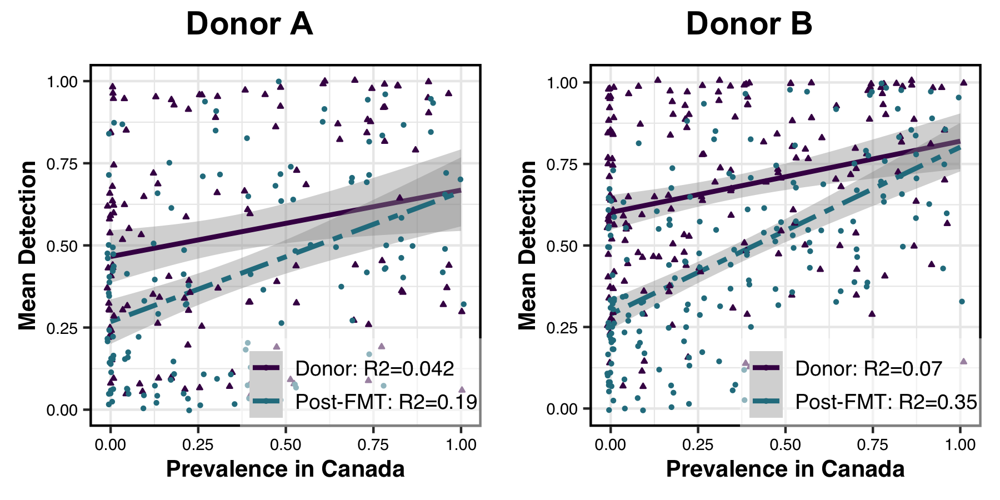
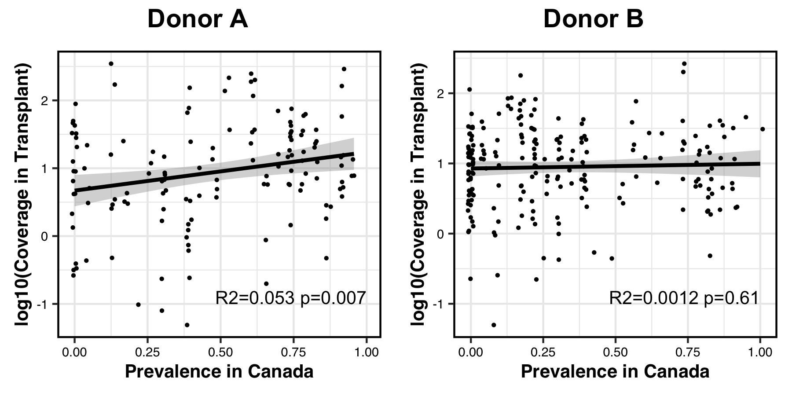




<div class="extra-info" markdown="1">

<span class="extra-info-header">Summary</span>

**The purpose of this page** is to discuss key findings of the study "**[Adaptive ecological processes and metabolic independence drive microbial colonization and resilience in the human gut](https://doi.org/10.1101/2021.03.02.433653)**" by Watson et al.

On this page you will find data and ad hoc scripts for important analyses, results of which discussed in the paper.

</div>

{:.notice}
If you have any questions and/or if you are unable to find an important piece of information here, please feel free to leave a comment down below, send an e-mail to [us]({{ site.url }}/people/), or get in touch with us through Slack:




## Study description

{:.notice}
You can find a crude summary of our study [here](https://twitter.com/merenbey/status/1369016402896695298) as a Twitter thread.

Briefly, our study involves the investigations of human gut metagenomes to understand the ecology of microbes before and after fecal microbiota transplantation (FMT) experiments, and the relevance of emerging ecological principals to inflammatory bowel disease (IBD). For this, we

* **Reconstruct metagenome-assembled genomes** (MAGs) from FMT donor gut metagenomes,
* Characterize the distribution of donor populations in donor and recipient gut metagenomes before and after FMT using these genomes,
* Investigate the prevalence of donor populations **in global gut metagenomes**,
* Define a set of quantitative criteria to **determine 'colonization' events unambigously**,
* Identify '**high-fitness**' and '**low-fitness**' donor populations based on **their colonization abilities and prevalence in global gut metagenomes**,
* Determine **metabolic pathways that are enriched** in either of these high-fitness or low-fitness groups,
* Study microbial genomes reconstructed from **healthy individuals and individuals with IBD** to test whether the enrichment of high-fitness and low-fitness genomes were identical between these cohorts (they were not).

Here is a sketch that aims to capture the points below:

[](images/workflow-sketch.jpeg){:.center-img .width-50}

Most of these steps are indeed detailed in [our manuscript](https://doi.org/10.1101/2021.03.02.433653). On this page, **you will find details of intermediate steps and anvi'o reusable data currencies to reproduce our main findings**.

## Reproducible donor and recipient metagenomes

{:.warning}
[doi:10.6084/m9.figshare.14331236](https://doi.org/10.6084/m9.figshare.14331236){:target="_blank"} serves the anvi'o reproducible donor and recipient data.

This section will introduce the primary data objects that can be used in [the anvi'o software ecosystem](/help). This subsection will describe how they were generated, give access to them, and demonstrate how they can be used.

### Background information

{:.warning}
The NCBI BioProject accession ID [PRJNA701961](https://www.ncbi.nlm.nih.gov/bioproject/?term=prjna701961) gives access to raw sequences for each donor and recipient metagenome. Details of each metagenome and their individual accession IDs are [listed in this supplementary table](https://figshare.com/articles/dataset/Supplementary_Tables/14138405?file=26827157).

We generated our data objects from the shotgun sequencing of donor and recipient stool metagenomes. The program  took us from raw metagenomic sequences to anvi'o contigs and profile databases (which will be explained later) by running the [anvi’o workflow for metagenomics]() in a scalable fashion. Details of this workflow is described [in our study](https://doi.org/10.1101/2021.03.02.433653) in detail, but briefly, *for each donor and their recipients* this workflow, **co-assembled** donor metagenomes, profiled resulting donor contigs in the context of donor and recipient metagenomes through metagenomic read recruitment (which enabled us to **reconstruct and refine donor genomes** using  and , and summarized the coverage and detection of donor genomes across metagenomes for downstream analyses.

We uploaded the resulting data packs to FigShare and the following subsections explain how to download and work with them.

### Download

You can download either or both data packs for donor A (4.14 Gb compressed) and donor B (4.59 Gb compressed) the following way:

``` bash
# download donor A data pack:
curl -L https://ndownloader.figshare.com/files/27452192 \
     -o FMT_DONOR_A_AND_RECIPIENTS.tar.gz

# download donor B data pack:
curl -L https://ndownloader.figshare.com/files/27452216 \
     -o FMT_DONOR_B_AND_RECIPIENTS.tar.xz
```

Once you download either (or both) of these data packs, the following commands will enable you to unpack and investigate their contents (the example here is given for donor A, but will also work for donor B with slight changes):

``` bash
# unpack (this should take about 30 seconds on a standard
# laptop and result in a directory that takes about 8Gb
# of storage space
tar -zxvf FMT_DONOR_A_AND_RECIPIENTS.tar.gz

# go into the directory:
cd FMT_DONOR_A_AND_RECIPIENTS

# make sure you have all the files:
ls -l

total 7.8G
4.0G Mar 28 11:19 AUXILIARY-DATA.db
1.4G Mar 28 11:18 CONTIGS.db
124K Mar 28 11:23 MAGs-additional-data.txt
4.4K Mar 28 11:19 MAGs-order-by-detection.newick
2.5G Mar 28 11:38 PROFILE.db
```

If you see a similar output, you have everything you need to reproduce and scrutinize our figures and findings interactively.

These files give access to (1) the co-assemblies of the stool metagenomes from a given donor, (2) gene calls and annotations of gene functions for each donor contig, (3) nucleotide-resolved coverage and detection data for each donor contig across all donor and recipient metagenomes, and (4) genomes we have reconstructed from these data (which is stored as a collection named `default` in the merged profile database).

### Reproduce

The two main files in these data pack are `CONTIGS.db` and `PROFILE.db`, and the vast majority of analyses in our study used the information stored in these artifacts.

{:.notice}
Examples below are for donor A, but will also work for donor B with slight changes.

Genomes described in our study is stored in a  called `default`:

``` bash
anvi-show-collections-and-bins -p PROFILE.db

Collection: "default"
===============================================
Collection ID ................................: default
Number of bins ...............................: 128
Number of splits described ...................: 21,741
Bin names ....................................: DA_MAG_00001, DA_MAG_00002, DA_MAG_00003, DA_MAG_00004, DA_MAG_00005, DA_MAG_00006, DA_MAG_00007, DA_MAG_00008, DA_MAG_00009, DA_MAG_00010, DA_MAG_00011,
                                                DA_MAG_00012, DA_MAG_00013, DA_MAG_00014, DA_MAG_00015, DA_MAG_00016, DA_MAG_00017, DA_MAG_00018, DA_MAG_00019, DA_MAG_00020, DA_MAG_00021, DA_MAG_00022,
                                                DA_MAG_00023, DA_MAG_00024, DA_MAG_00025, DA_MAG_00026, DA_MAG_00027, DA_MAG_00028, DA_MAG_00029, DA_MAG_00030, DA_MAG_00031, DA_MAG_00032, DA_MAG_00033,
                                                DA_MAG_00034, DA_MAG_00035, DA_MAG_00036, DA_MAG_00037, DA_MAG_00038, DA_MAG_00039, DA_MAG_00040, DA_MAG_00041, DA_MAG_00042, DA_MAG_00043, DA_MAG_00044,
                                                DA_MAG_00045, DA_MAG_00046, DA_MAG_00047, DA_MAG_00048, DA_MAG_00049, DA_MAG_00050, DA_MAG_00051, DA_MAG_00052, DA_MAG_00053, DA_MAG_00054, DA_MAG_00055,
                                                DA_MAG_00056, DA_MAG_00057, DA_MAG_00058, DA_MAG_00059, DA_MAG_00060, DA_MAG_00061, DA_MAG_00062, DA_MAG_00063, DA_MAG_00064, DA_MAG_00065, DA_MAG_00066,
                                                DA_MAG_00067, DA_MAG_00068, DA_MAG_00069, DA_MAG_00070, DA_MAG_00071, DA_MAG_00072, DA_MAG_00073, DA_MAG_00074, DA_MAG_00075, DA_MAG_00076, DA_MAG_00077,
                                                DA_MAG_00078, DA_MAG_00079, DA_MAG_00080, DA_MAG_00081, DA_MAG_00082, DA_MAG_00083, DA_MAG_00084, DA_MAG_00085, DA_MAG_00086, DA_MAG_00087, DA_MAG_00088,
                                                DA_MAG_00089, DA_MAG_00090, DA_MAG_00091, DA_MAG_00092, DA_MAG_00093, DA_MAG_00094, DA_MAG_00095, DA_MAG_00096, DA_MAG_00097, DA_MAG_00098, DA_MAG_00099,
                                                DA_MAG_00100, DA_MAG_00101, DA_MAG_00102, DA_MAG_00103, DA_MAG_00104, DA_MAG_00105, DA_MAG_00106, DA_MAG_00107, DA_MAG_00108, DA_MAG_00109, DA_MAG_00110,
                                                DA_MAG_00111, DA_MAG_00112, DA_MAG_00113, DA_MAG_00114, DA_MAG_00115, DA_MAG_00116, DA_MAG_00117, DA_MAG_00118, DA_MAG_00119, DA_MAG_00120, DA_MAG_00121,
                                                DA_MAG_00122, DA_MAG_00123, DA_MAG_00124, DA_MAG_00125, DA_MAG_00126, DA_MAG_00127, DA_MAG_00128

```

The genome names shown here will indeed match to the genome names in [our supplementary tables](https://doi.org/10.6084/m9.figshare.14138405).

To interactively visualize all donor genomes stored in the  we called `default` across all donor and recipient metagenomes, you can run this  command:

``` bash
anvi-interactive --profile-db PROFILE.db \
                 --contigs-db CONTIGS.db \
                 --collection-name default \
                 --additional-layers MAGs-additional-data.txt \
                 --tree MAGs-order-by-detection.newick
```

Which will open a browser window to display the detection of donor A genomes which reproduces the panel in Figure 01 interactively:

[](images/donor-A-interactive.png){:.center-img .width-50}

If you are interested in investigating the coverages of a single donor genome, say `DA_MAG_00052`, you can run the following  command:

``` bash
anvi-refine --profile-db PROFILE.db \
            --contigs-db CONTIGS.db \
            --collection-name default \
            --bin-id DA_MAG_00052
```

Which will open a browser window to display the detection of each contig in the donor A genome `DA_MAG_00052`:

[](MAG_00052.png){:.center-img .width-50}

Where you can right-click on any split and inspect nucleotide-level coverage values, genes and their functions for each section of the genome.

---

In addition to the examples shown above, these data packs can be used for additional investigations thanks to their versatility. `CONTIGS.db` is an , and any anvi'o program [that runs on contigs databases](/software/anvio/help/main/artifacts/contigs-db/) will run on this file. Similarly, `PROFILE.db` is an , and you can find [here](/software/anvio/help/main/artifacts/profile-db/) a list of programs in the anvi'o ecosystem that will work with this artifact.

## Estimating the global prevalence of donor genomes

{:.notice}
Details of each publicly available metagenome used and their individual accession IDs are listed in [this supplementary table](https://figshare.com/articles/dataset/Supplementary_Tables/14138405?file=26827166).

To determine the prevalence of donor genomes in 17 different countries, we ran a separate anvi’o metagenomics workflow. This time, the workflow (1) recruited reads from 1,984 publicly available gut metagenomes to our donor contigs using bowtie2, (2) profiled mapping results and (3) summarized the detection of each MAG in each global metagenome.

Included in the resulting summary files is information about the detection of each donor genome in each global metagenome. We summarized the detection results by country, using a minimum detection threshold of 0.25. You can reproduce this step the following way:

```bash
# download the input files for donor A (3.7Mb) and donor B (5.2Mb)
for file in detection-global-DA.txt \
            detection-global-DB.txt;
do curl -L https://merenlab.org/data/fmt-gut-colonization/files/${file} \
        -o ${file};
done

# download the script
curl -L https://merenlab.org/data/fmt-gut-colonization/files/summarize-global-detection.py \
      -o summarize-global-detection.py

# run the script and look at the output files:
# detection-global-by-country-DA.txt and
# detection-global-by-country-DB.txt
python3 summarize-global-detection.py
```

## Investigating the ecological forces driving colonization outcomes

<div class="extra-info" markdown="1">

<span class="extra-info-header">Recreating input data files (optional steps)</span>

Analyses in the following sections outside of this box use data tables derived from the output of . You can download these tables directly using the instructions in this section, or you can reproduce them yourself using instructions in this box using the primary anvi'o databases you have downloaded as a part of the data packs for the donor A and donor B.

{:.warning}
To fully reproduce what we did, you need to run  with the `--init-gene-coverages` flag. Andrea's laptop run out of memory when testing this, so it is recommended that you only do this if you have a fancy, powerful computer with sufficient resources :( --Andrea.

The following steps will generate the input data tables:

```bash
# make sure you're in the directory containing the data packs
ls -l

Apr  1 12:26 FMT_DONOR_A_AND_RECIPIENTS
Mar 31 17:17 FMT_DONOR_A_AND_RECIPIENTS.tar.gz
Apr  1 12:30 FMT_DONOR_B_AND_RECIPIENTS
Mar 31 18:34 FMT_DONOR_B_AND_RECIPIENTS.tar.gx

# run anvi-summarize
anvi-summarize --pan-or-profile-db FMT_DONOR_A_AND_RECIPIENTS/PROFILE.db \
               --contigs-db FMT_DONOR_A_AND_RECIPIENTS/CONTIGS.db \
               --collection-name default \
               --init-gene-coverages \
               --output-dir FMT_DONOR_A_AND_RECIPIENTS/SUMMARY

# repeat above step for donor B

# download script to get mean coverage of SCGs
curl -L https://merenlab.org/data/fmt-gut-colonization/files/make-scg-cov-tables.py \
     -o make-scg-cov-tables.py

# run script and note the output files:
# scg-cov-DA.txt and
# scg-cov-DB.txt
python3 make-scg-cov-tables.py

# copy other relevant files to working directory to follow the rest of the workflow
cp FMT_DONOR_A_AND_RECIPIENTS/SUMMARY/bins_across_samples/detection.txt detection-FMT-DA.txt
cp FMT_DONOR_B_AND_RECIPIENTS/SUMMARY/bins_across_samples/detection.txt detection-FMT-DB.txt

cp FMT_DONOR_A_AND_RECIPIENTS/SUMMARY/bins_across_samples/mean_coverage_Q2Q3.txt mean-cov-DA.txt
cp FMT_DONOR_B_AND_RECIPIENTS/SUMMARY/bins_across_samples/mean_coverage_Q2Q3.txt mean-cov-DB.txt
```

</div>

This section will describe how to recreate Figure 2 in our study:

[](images/Figure_02.png){:.center-img .width-50}

We wanted to determine whether colonization outcomes were driven primarily by neutral or adaptive ecological forces. If colonization outcomes were driven by neutral forces, we would expect the successful colonizers to be the populations that were the most abundant in the donor stool sample used for transplantation. These would be the populations most likely to survive the bottleneck event that occured when a portion of the stool sample was selected for transplantation, and the most likely to survive the effects of ecological drift in the gut. Alternatively, if colonization outcomes were driven by adaptive ecological forces, we would expect the successful colonizers to be the populations that were the most fit in the gut environment.

To test whether colonization outcomes were driven by neutral or adaptive forces we measured the correlation of dose and fitness with colonization outcome. We measured dose using the mean coverage of a population in the donor stool sample used for transplantation and we used population prevalence in healthy adult guts as a proxy for fitness.

### Preliminary analysis
As a simple preliminary analysis we first measured whether the fitness of a population was correlated with its detection in donor or recipient post-FMT metagenomes, to see if the post-FMT gut environment was selecting for fitter populations than the donor gut environment.

If you want to reproduce this analysis, you can do so with the following steps:

``` bash
# download the input files
for file in metadata-donor.txt \
            metadata-recipient.txt \
            metadata-transplants.txt \
            detection-FMT-DA.txt \
            detection-FMT-DB.txt \
            detection-global-by-country-DA.txt \
            detection-global-by-country-DB.txt;
do curl -L https://merenlab.org/data/fmt-gut-colonization/files/${file} \
        -o ${file};
done

# make sure you have all the files
ls -l

total 456
46K Mar 31 12:30 detection-FMT-DA.txt
58K Mar 31 12:30 detection-FMT-DB.txt
42K Mar 31 12:30 detection-global-by-country-DA.txt
60K Mar 31 12:30 detection-global-by-country-DB.txt
956B Mar 31 12:30 metadata-donor.txt
3.9K Mar 31 12:30 metadata-recipient.txt
592B Mar 31 12:30 metadata-transplants.txt

# download the script to create mean detection vs. prevalence tables
curl -L https://merenlab.org/data/fmt-gut-colonization/files/make-mean-detec-vs-prev-table.py \
     -o make-mean-detec-vs-prev-table.py

# run the script to make aforementioned tables
python3 make-mean-detec-vs-prev-table.py

# download the script to visualize results
curl -L https://merenlab.org/data/fmt-gut-colonization/files/Figure-02A.R \
     -o Figure-02A.R

# run the script to visualize results
Rscript Figure-02A.R
```

Which generates a PDF that looks like this:

[](images/Figure_02A.png){:.center-img .width-50}

### Defining colonization success and failure

Our preliminary results indicated that FMT may be selecting for fitter microbes in the recipient post-FMT gut environment. However, we wanted to more directly test whether neutral or adaptive forces were driving colonization.

We began with a simple definition of colonization: a population is absent in a recipient pre-FMT, present in the donor stool samples used for transplantation, and present in the recipient post-FMT. Whereas if a population is present in the donor stool sample used for transplantation and absent in the recipient pre-FMT, it failed to colonize. However, we decided that looking at the presence or absence of population genomes in donor and recipient samples did not provide sufficient resolution. If a population is present in the donor and in the recipient pre-FMT, how do we know if the post-FMT population is native to the recipient or came from the donor? Even if we don't see a population pre-FMT, how do we know that the post-FMT population wasn't already present in the recipient at undetectable levels? To resolve these ambiguities, we used subpopulation, or strain, level information from DESMAN. DESMAN provides the number of subpopulations, or strains, of each population in each metagenome, along with their relative abundances.

This led us to create the definition of colonization, or non-colonization, outlined in Supplementary Figure 4:

[](images/Figure_S04.png){:.center-img .width-50}

To run the above workflow to determine if a population colonized a recipient in our study, you can do the following:
```bash
# download additional input files
for file in scg-cov-DA.txt \
            scg-cov-DB.txt \
            subpop-comp-DA.txt \
            subpop-comp-DB.txt \
            subpop-num-DA.txt \
            subpop-num-DB.txt;
do curl -L https://merenlab.org/data/fmt-gut-colonization/files/${file} \
        -o ${file};
done

# download the script
curl -L https://merenlab.org/data/fmt-gut-colonization/files/determine-colonization.py \
     -o determine-colonization.py

# run the script and look at the output files:
# colonized-DA.txt,
# colonized-DB.txt, 
# did-not-colonize-DA.txt and
# did-not-colonize-DB.txt
python3 determine-colonization.py
```

We then used the output of this workflow to measure the correlation of dose and fitness with colonization outcome, to determine whether colonization is driven by neutral or adaptive forces.

### Correlation of dose and fitness with colonization outcome

We used logistic regression to test for a correlation between dose and colonization outcome, and fitnes and colonization outcome. We then further evaluated our regression models using ROC curves.

If you would like to recreate this analysis, you can do so through the following steps:

```bash
# download additional files
for file in mean-cov-DA.txt \
            mean-cov-DB.txt;
do curl -L https://merenlab.org/data/fmt-gut-colonization/files/${file} \
        -o ${file};
done

# download script to consolidate relevant data
curl -L https://merenlab.org/data/fmt-gut-colonization/files/make-summary-tables-for-regression.py \
     -o make-summary-tables-for-regression.py

# run script to consolidate data
python3 make-summary-tables-for-regression.py

# download script to visualize results
curl -L https://merenlab.org/data/fmt-gut-colonization/files/Figure-02BC.R \
     -o Figure-02BC.R

# run script to visualize results
Rscript Figure-02BC.R
```

Which generates a PDF that looks like this:

[](images/Figure_02BC.png){:.center-img .width-50}

### Correlation of fitness with dose

Our logistic regression analysis showed that fitness was correlated with colonization success in the donor B cohort, and dose was not. This indicates that within the donor B cohort, colonization outcome was likely driven by adaptive, rather than neutral, ecological forces.

However, within the donor A cohort both fitness and dose were correlated with colonization success. The donor A ROC curves suggested a possible correlation between fitness and dose, confounding our ability to determine which of these factors were relevant to colonization outcome. To see if this was the case we performed a linear regression to see if fitness and dose were correlated with one another within each cohort.

To reproduce that analysis, you can follow these steps:

```bash
# download the script
curl -L https://merenlab.org/data/fmt-gut-colonization/files/Figure-02D.txt \
     -o Figure-02D.R

# run the script
Rscript Figure-02D.R
```

Which produces a PDF that looks like this:

[](images/Figure_02D.png){:.center-img .width-50}

Indeed, in donor A populations fitness and dose are correlated with one another, while this is not the case for donor B populations.

## Investigating metabolic competence among microbial genomes reconstructed from healthy individuals and individuals with IBD

{:.warning}
[doi:10.6084/m9.figshare.14225840](https://doi.org/10.6084/m9.figshare.14225840) serves each genome used in the analysis below.

This section will describe how to go from FASTA files for a given set of genomes to the Figure 4 in our study:

[](images/Figure_04.png){:.center-img .width-50}

Our analyses in the previous chapters of our study showed that while the healthy donor environment could support both high-fitness and low-fitness populations, challenging microbes to colonize a new environment or to withstand massive ecosystem perturbation during FMT selects for high-fitness populations, suggesting that metabolic competence is a more critical determinant of fitness during stress than during homeostasis. Based on these observations, we hypothesized that,

* A gut environment in homeostasis will support a range of microbial populations with a wide spectrum of metabolic competency, and
* A gut environment under stress will select for high metabolic competency in microbial populations.

### Publicly available datasets

To test these hypotheses, we proceeded to compared genomes reconstructed from a cohort of healthy individuals by [Pasolli et al. (2019)](https://doi.org/10.1016/j.cell.2019.01.001) to genomes reconstructed from individuals who were diagnosed with inflammatory bowel disease (IBD). Our IBD dataset was composed of two cohorts: a set of patients with pouchitis from [Vineis et al (2016)](https://doi.org/10.1128/mBio.01713-16), and a set of pediatric Crohn's disease patients described in [Quince et al. (2015)](https://doi.org/10.1038/ajg.2015.357).

### FASTA files to anvi'o contigs databases

At this stage we have multiple FASTA files for each individual in three cohorts (healthy, pouchitis, and Crohn's) for downstream analyses. We first converted each FASTA file into an anvi'o  using the program  and then processed each resulting contigs-db using,

* The program  to run hidden Markov models for the identification of single-copy core genes,
* The program  to identify and store taxonomic information,
* and the program  to identify KEGG orthologs in each of our genomes for metabolic reconstruction.

The resulting contigs databases are publicly available. If you would like to reproduce the steps below, you should first download the following file [943 Mb] to your work directory,

``` bash
curl -L https://ndownloader.figshare.com/files/26842652 \
     -o WATSON_ET_AL_CONTIGS_DBS_FOR_METABOLIC_COMPARISON.tar.gz
```

And unpack it [2.7 Gb]:

``` bash
tar -zxvf WATSON_ET_AL_CONTIGS_DBS_FOR_METABOLIC_COMPARISON.tar.gz
```

After having generated a contigs database for each genome, we used all the information about these genomes that were available to us to prepared an  file. This is simply a TAB-delimited text file that describes the location of each contigs database for each genome on the disk, along with optional metadata columns to describe their properties. Here are a few lines from this file:

|name|individual|cohort|from|accession ID|genome_completion|genome_redundancy|num_splits|total length|t_phylum|t_class|t_order|t_family|t_genus|t_species|contigs_db_path|
|:--|:--|:--|:--|:--|:--|:--|:--|:--|:--|:--|:--|:--|:--|:--|:--|
|POU_P204_MAG_00001|POU_P204|POUCHITIS|Vineis et al. (doi:10.1128/mBio.01713-16)|phs000262.v3.p2 (dbGaP)|94.37|0.00|104|2081795|Firmicutes|Clostridia|Oscillospirales|Acutalibacteraceae|UMGS1071|None|WATSON_ET_AL_CONTIGS_DBS_FOR_METABOLIC_COMPARISON/POU_P204_MAG_00001.db|
|POU_P204_MAG_00002|POU_P204|POUCHITIS|Vineis et al. (doi:10.1128/mBio.01713-16)|phs000262.v3.p2 (dbGaP)|100.00|0.00|129|2564734|Firmicutes|Clostridia|Lachnospirales|Anaerotignaceae|Anaerotignum|Anaerotignum sp001304995|WATSON_ET_AL_CONTIGS_DBS_FOR_METABOLIC_COMPARISON/POU_P204_MAG_00002.db|
|POU_P204_MAG_00003|POU_P204|POUCHITIS|Vineis et al. (doi:10.1128/mBio.01713-16)|phs000262.v3.p2 (dbGaP)|98.59|1.41|202|4105023|Bacteroidota|Bacteroidia|Bacteroidales|Bacteroidaceae|Bacteroides|Bacteroides fragilis|WATSON_ET_AL_CONTIGS_DBS_FOR_METABOLIC_COMPARISON/POU_P204_MAG_00003.db|
|POU_P204_MAG_00004|POU_P204|POUCHITIS|Vineis et al. (doi:10.1128/mBio.01713-16)|phs000262.v3.p2 (dbGaP)|98.59|5.63|263|5146152|Bacteroidota|Bacteroidia|Bacteroidales|Bacteroidaceae|Bacteroides|None|WATSON_ET_AL_CONTIGS_DBS_FOR_METABOLIC_COMPARISON/POU_P204_MAG_00004.db|
|(...)|(...)|(...)|(...)|(...)|(...)|(...)|(...)|(...)|(...)|(...)|(...)|(...)|(...)|(...)|(...)|
|HMP_1061_SRS011061_bin.13|HMP_1061|HEALTHY|Passoli et al. (doi:10.1016/j.cell.2019.01.001)|SRS011061|76.06|40.85|233|1846034|Bacteroidota|Bacteroidia|Bacteroidales|Rikenellaceae|Alistipes|Alistipes putredinis|WATSON_ET_AL_CONTIGS_DBS_FOR_METABOLIC_COMPARISON/HMP_2012__SRS011061__bin.13.db|
|HMP_1061_SRS011061_bin.14|HMP_1061|HEALTHY|Passoli et al. (doi:10.1016/j.cell.2019.01.001)|SRS011061|98.59|0.00|219|2831497|Firmicutes|Clostridia|Oscillospirales|Ruminococcaceae|CAG-353|CAG-353 sp900066885|WATSON_ET_AL_CONTIGS_DBS_FOR_METABOLIC_COMPARISON/HMP_2012__SRS011061__bin.14.db|
|HMP_1061_SRS011061_bin.20|HMP_1061|HEALTHY|Passoli et al. (doi:10.1016/j.cell.2019.01.001)|SRS011061|85.92|0.00|300|1255151|Firmicutes|Clostridia|TANB77|CAG-508|CAG-273|CAG-273 sp000435755|WATSON_ET_AL_CONTIGS_DBS_FOR_METABOLIC_COMPARISON/HMP_2012__SRS011061__bin.20.db|
|HMP_1061_SRS011061_bin.23|HMP_1061|HEALTHY|Passoli et al. (doi:10.1016/j.cell.2019.01.001)|SRS011061|77.46|4.23|391|1510418|Firmicutes|Clostridia|Oscillospirales|Acutalibacteraceae|UMGS172|UMGS172 sp900539855|WATSON_ET_AL_CONTIGS_DBS_FOR_METABOLIC_COMPARISON/HMP_2012__SRS011061__bin.23.db|
|HMP_1061_SRS011061_bin.26|HMP_1061|HEALTHY|Passoli et al. (doi:10.1016/j.cell.2019.01.001)|SRS011061|100.00|2.82|232|1903353|Firmicutes|Negativicutes|Acidaminococcales|Acidaminococcaceae|Succiniclasticum|Succiniclasticum sp900544275|WATSON_ET_AL_CONTIGS_DBS_FOR_METABOLIC_COMPARISON/HMP_2012__SRS011061__bin.26.db|
|(...)|(...)|(...)|(...)|(...)|(...)|(...)|(...)|(...)|(...)|(...)|(...)|(...)|(...)|(...)|(...)|

You can also download a copy of it on your disk and explore it the following way:

``` bash
curl -L https://merenlab.org/data/fmt-gut-colonization/files/external-genomes.txt \
     -o external-genomes.txt
```

The next step is to estimate the completion of each metabolic module described in KEGG database for each genome using the program :

### Computing metabolic completion

``` bash
anvi-estimate-metabolism -e external-genomes.txt \
                         --matrix-format \
                         -O metabolism
```

On a laptop computer this command will take up-to 25 minutes to characterize all metabolic modules in 604 genomes, and will generate the following files:

* `metabolism-completeness-MATRIX.txt`
* `metabolism-ko_hits-MATRIX.txt`
* `metabolism-presence-MATRIX.txt`

The output file we will use for downstream analyses is `metabolism-completeness-MATRIX.txt` (and if you don't want to wait for the , you can download this file into your work directory from [here](files/metabolism-completeness-MATRIX.txt)). In this particular file each column represents a genome, each row represents a KEGG module, and each data point is the estimated completeness of a given KEGG module in a given genome. Here is a few lines and columns from this file:

|module|POU_P204_MAG_00001|POU_P204_MAG_00002|POU_P204_MAG_00003|POU_P204_MAG_00004|POU_P204_MAG_00005|(...)|
|:--:|:--:|:--:|:--:|:--:|:--:|:--:|
|M00001|0.8|0.9|1.0|1.0|0.9|(...)|
|M00002|0.66|1.0|1.0|1.0|1.0|(...)|
|M00003|0.87|0.87|1.0|1.0|0.75|(...)|
|M00004|0.57|0.71|1.0|1.0|1.0|(...)|
|M00005|1.0|1.0|1.0|1.0|1.0|(...)|
|M00006|0.0|0.0|1.0|1.0|1.0|(...)|
|M00007|0.75|1.0|1.0|1.0|1.0|(...)|
|M00008|0.0|0.0|0.75|0.75|0.5|(...)|
|M00009|0.25|0.5|0.62|0.75|0.56|(...)|
|(...)|(...)|(...)|(...)|(...)|(...)|(...)|

### Visualizing data in R

The rest of our analysis will take place in R. You can download the entire R script we used to generate relevant figure, and run it in your work directory get all the figures in a single step the following way:

``` bash
# download the script
curl -L https://merenlab.org/data/fmt-gut-colonization/files/plot-metabolic-competency.R \
     -o plot-metabolic-competency.R

# turn the executable bit on
chmod +x plot-metabolic-competency.R

# run it, and investigate the resulting PDF files:
./plot-metabolic-competency.R
```

The following steps highlight and describe some of the relevant steps in the script. As a reminder, we will need the following libraries to be initialized for everything downstream to run:

``` R
#!/usr/bin/env Rscript
library(ggplot2)
library(MASS)
library(ggridges)
library(gridExtra)
library(reshape2)
library(reshape)
```

We first read in the metabolic completion and external genomes files:

```
module_completion <- read.table(file='metabolism-completeness-MATRIX.txt', header = TRUE, sep = "\t")
external_genomes <- read.table(file='external-genomes.txt', header = TRUE, sep = "\t")
```

A quick check to make sure the number of genomes per group makes sense based on what we know about our groups:

```
   CROHNS  FMT_HIGH_FITNESS  FMT_LOW_FITNESS   HEALTHY    POUCHITIS 
      256                20               20       264           44
```

We then turn the matrix formatted file into a data frame, and add some relevant information per genome using the external genomes file:

``` R
# turn the boring matrix format into a data frame
df <- melt(module_completion)

# set some meaningful column names
colnames(df) <- c('module', 'genome', 'completion')

# use the external genomes file to associate each genome with a 'group',
# and an individual:
df$group <- external_genomes$cohort[match(df$genome, external_genomes$name)]
df$individual <- external_genomes$individual[match(df$genome, external_genomes$name)]
```

Our matrix contains 303 modules. But our statistical enrichment analysis of the high-fitness versus low-fitness genomes had revealed a set of 33 modules. Thus, we want to investigate only those modules across these new genomes to investigate whether there is a difference in genomes across cohorts:

``` R
df <- df[df$module %in% modules_of_interest, ]
```

Finally, some boring steps of defining explicit orders for x-axes in the visualizations that will follow:

``` R
# some boring steps of defining explicit orders for x-axes in boxplots
HEALTHY_subset <- aggregate(df[df$group == "HEALTHY", 3], list(df[df$group == "HEALTHY", ]$individual), median)
HEALTHY_order <- HEALTHY_subset[order(-HEALTHY_subset$x),]$Group.1
POUCHITIS_subset <- aggregate(df[df$group == "POUCHITIS", 3], list( df[df$group == "POUCHITIS", ]$individual), median)
POUCHITIS_order <- POUCHITIS_subset[order(-POUCHITIS_subset$x),]$Group.1
CROHNS_subset <- aggregate(df[df$group == "CROHNS", 3], list( df[df$group == "CROHNS", ]$individual), median)
CROHNS_order <- CROHNS_subset[order(-CROHNS_subset$x), ]$Group.1
individuals_order <- c(c('FMT_HIGH_FITNESS', 'FMT_LOW_FITNESS'), HEALTHY_order, POUCHITIS_order, CROHNS_order)

# set explicit group orders, and assign some group colors
groups_order <- c("FMT_HIGH_FITNESS", "FMT_LOW_FITNESS", "HEALTHY", "POUCHITIS", "CROHNS")
group_colors <- c("#ec5f1c", "#034f84", "#feb236", "#86af49", "#ff0202")
```

After these preparations, we are ready to run the following section,

``` R
# plot the boxplots
pdf(file = "boxplots.pdf",  width = 13, height = 5)
plot_individuals <- ggplot(data=df, aes(x=individual, y=completion, group=individual)) +
  geom_boxplot(aes(fill=group), alpha=0.35, outlier.shape = NA, color='#808080') +
  geom_jitter(colour='#222222', width = 0.20, height = 0.02, size=0.1, alpha=0.5) +
  theme_bw() +
  theme(legend.position="bottom", axis.title.y = element_blank(), axis.text.y = element_blank(), axis.ticks.y = element_blank()) +
  xlab("Individuals") +
  scale_x_discrete(limits = individuals_order) +
  scale_fill_manual(values = group_colors)

plot_groups <- ggplot(data=df, aes(x=group, y=completion, group=group)) +
  geom_boxplot(aes(fill=group), alpha=0.35, outlier.shape = NA, color=NA) +
  geom_violin(fill="#505050", alpha=0.35, width=1.3, colour = '#505050') +
  geom_jitter(colour='#222222', width = 0.3, height = 0.02, size=0.1, alpha=0.05) +
  theme_bw() +
  theme(legend.position="bottom") +
  ylab("Metabolic module completion") +
  xlab("Groups") +
  scale_x_discrete(limits = groups_order) +
  scale_fill_manual(values = group_colors)

grid.arrange(plot_groups, plot_individuals, ncol=2, widths=c(1, 3))
dev.off()
```

which generates a PDF file in our work directory that looks like this:

[](images/boxplots.png){:.center-img .width-100}

To visualize the ridge-line plots, we first selected a set of modules that differed significantly between the genomes from the healthy cohort and from those who were diagnosed with IBD to show some examples:


``` R
# modules_to_display <- c("M00924","M00122", "M00023", "M00028", "M00570", "M00082", "M00844", "M00015",  "M00526", "M00022")
dfx <- df[df$module %in% modules_to_display, ]
dfx$module = factor(dfx$module, levels=modules_to_display)
```

Then, running the following section,

``` R
pdf(file = "ridges-for-metabolisms.pdf",  width = 13, height = 5)
ggplot(data=dfx, aes(x = completion, y = individual, fill = group)) +
  geom_density_ridges(scale = 10, size = 0.25, rel_min_height = 0.01, alpha=0.35, colour="#222222") +
  theme_ridges() +
  scale_y_discrete(limits = individuals_orderx) +
  scale_fill_manual(values = group_colors) +
  scale_x_continuous(breaks=c(0, 1)) +
  coord_cartesian(xlim = c(-0.5, 1.5)) +
  theme(legend.position="bottom", axis.title.y = element_blank(), axis.text.y = element_blank(), axis.ticks.y = element_blank()) +
  facet_wrap(. ~ module, nrow = 2)
dev.off()
```

which generates a PDF file in our work directory that looks like this:

[](images/ridges-for-metabolism.png){:.center-img .width-100}

Finally we run the following test to estimate the statistical significance of differences to report in our study,

``` R
printf <- function(...) invisible(print(sprintf(...)))
printf("DIFFERENCES BETWEEN HEALTHY vs CROHNS + POUCHITIS for RIDGELINE PLOTS")
for(module in modules_to_display){
    w <- wilcox.test(dfx[dfx$group == "HEALTHY" & dfx$module == module, ]$completion, dfx[dfx$group %in% c("CROHNS", "POUCHITIS") & dfx$module == module, ]$completion)
    printf("%s: %f", module, w$p.value)
}
```

And combined both panels in [Inkscape](https://inkscape.org/) to finalize the figure for publication.

## NMDS ordination of metagenomes by taxonomic composition

<div class="extra-info" markdown="1">

<span class="extra-info-header">Recreating input data files (optional steps)</span>

The analysis in this section uses taxonomic composition tables that were generated from raw, short-read metagenomes by kraken2 and subseqeuntly merged and reformatted using anvi'o and a few ad hoc scripts. This box describes that workflow for anyone who would like to recreate it, otherwise the final taxonomic composition tables are provided after the box.

First, we ran kraken2 on all raw metagenomes from our study (see [Background information](https://merenlab.org/data/fmt-gut-colonization/#background-information)) and the publicly available Canadian gut metagenomes (see [Estimating the global prevalence of donor genomes](https://merenlab.org/data/fmt-gut-colonization/#estimating-the-global-prevalence-of-donor-genomes):

```bash
mkdir -p kraken2-output

while read sample r1 r2; do
    if [ "$sample" == "sample" ]; then
        continue
    fi
    kraken2 --paired $r1 $r2 \
            --db $DB_PATH \
            --gzip-compressed \
            --use-names \
            --report kraken2-output/${sample}-kraken2.txt \
            --use-mpa-style \
            --threads 10"
done < samples.txt
```

If you run this command yourself you should replace `$DB_PATH` with the path to the kraken2 database on your computer. You will also need to provide a TAB-delimited `samples.txt` file providing the paths to your R1 and R2 files for each metagenome, formatted this way:

|sample|r1|r2|
|:--|:--|:--|
|DA_D_01|DA_D_01_R1.fastq.gz|DA_D_01_R2.fastq.gz|
|DA_D_02|DA_D_02_R1.fastq.gz|DA_D_02_R2.fastq.gz|

Next, using the same `samples.txt` file, we created a blank  for each sample:

```bash
mkdir -p taxonomy-profiles

while read sample r1 r2; do
    if [ "$sample" == "sample" ]; then
		continue
    fi
    anvi-interactive --profile-db taxonomy-profiles/${sample}.db \
                     --view-data kraken2-output/${sample}-kraken2.txt \
                     --title $sample \
                     --manual \
                     --dry-run
done < samples.txt
```

And imported the kraken2 taxonomy into each profile:

```bash
while read sample r1 r2; do
    if [ "$sample" == "sample" ]; then
        continue
    fi
    anvi-import-taxonomy-for-layers --profile-db taxonomy-profiles/${sample}.db \
                                    --parser krakenuniq \
                                    --input-files kraken2-output/${sample}-kraken2.txt
done < samples.txt
```

Before merging the profiles for each group of samples and exporting taxonomy tables:

```bash
# download the script to merge profiles
curl -L https://merenlab.org/data/fmt-gut-colonization/files/merge-taxonomy-profiles.py \
     -o merge-taxonomy-profiles.py

# make an output directory
mkdir -p taxonomy-tables

# run the script for each group
python merge-taxonomy-profiles.py taxonomy-profiles/DA*.db taxonomy-tables/DA
python merge-taxonomy-profiles.py taxonomy-profiles/DB*.db taxonomy-tables/DB
python merge-taxonomy-profiles.py taxonomy-profiles/CAN*.db taxonom-tables/CAN
```

Finally, we cleaned up the taxonomy tables (this optional command works in linux but not in MacOSX):

```bash
# get rid of t_*! from taxon names
for x in taxonomy-tables/*_t_*; do sed -i -r 's/t_\w+?!//g' $x; done
```

And merged the tables of groups we'd like to compare (the following script is set up to merge DA, DB and CAN, but can be easily modified for a different set of groups):

```bash
# download the script to merge tables
curl -L https://merenlab.org/data/fmt-gut-colonization/files/merge-taxonomy-tables.py \
     -o merge-taxonomy-tables.py

# run the script
python3 merge-taxonomy-tables.py
```

</div>

This section will describe how to recreate Supplementary Figure 2 in our study:

[](images/Figure_S02.png){:.center-img .width-50}

And Supplementary Figure 3:

[](images/Figure_S03.png){:.center-img .width-50}

To compare the the similarity of donor, recipient and healthy Canadian stool samples, we performed a non-metric multidimensional scaling (nMDS) ordination analysis with Horn-Morisita dissimilarity indices on taxonomic composition data for each sample metagenome. To reproduce this analysis, you can do the following:

```bash
# download the input files
for file in metadata-ordination-Figure-S02.txt \
            metadata-ordination-Figure-S03.txt \
            taxonomy-genus-DA-DB-CAN.txt;
do curl -L https://merenlab.org/data/fmt-gut-colonization/files/${file} \
        -o ${file};
done

# download the scripts
for file in Figure-S02.shx \
            Figure-S03.shx \
            ordination-plot.R;
do curl -L https://merenlab.org/data/fmt-gut-colonization/files/${file} \
        -o ${file};
done

# run the scripts to generate plots
bash Figure-S02.shx
bash Figure-S03.shx
```


<div style="display: block; height: 200px;">&nbsp;</div>

