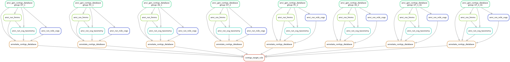
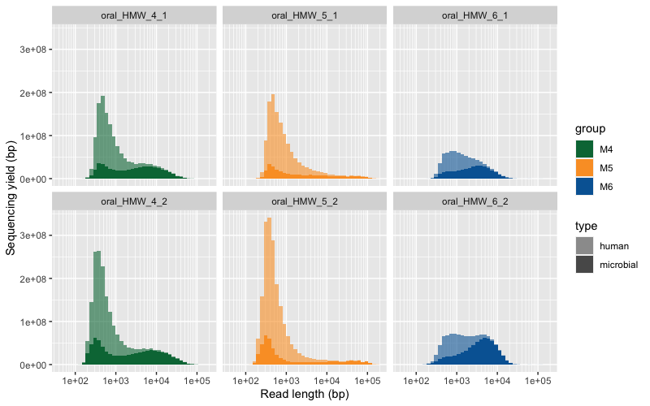
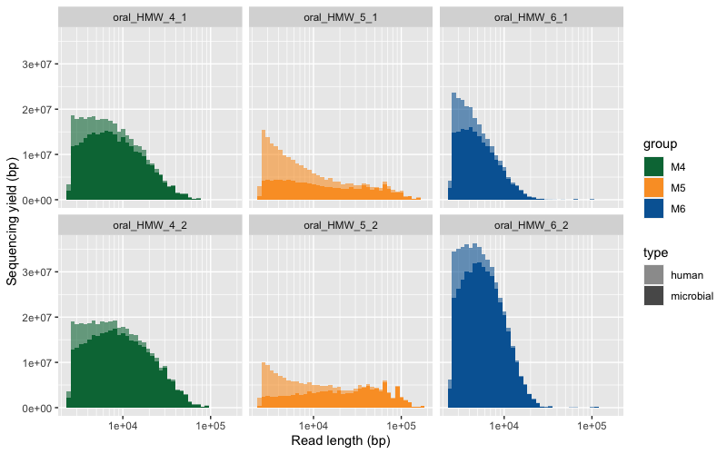
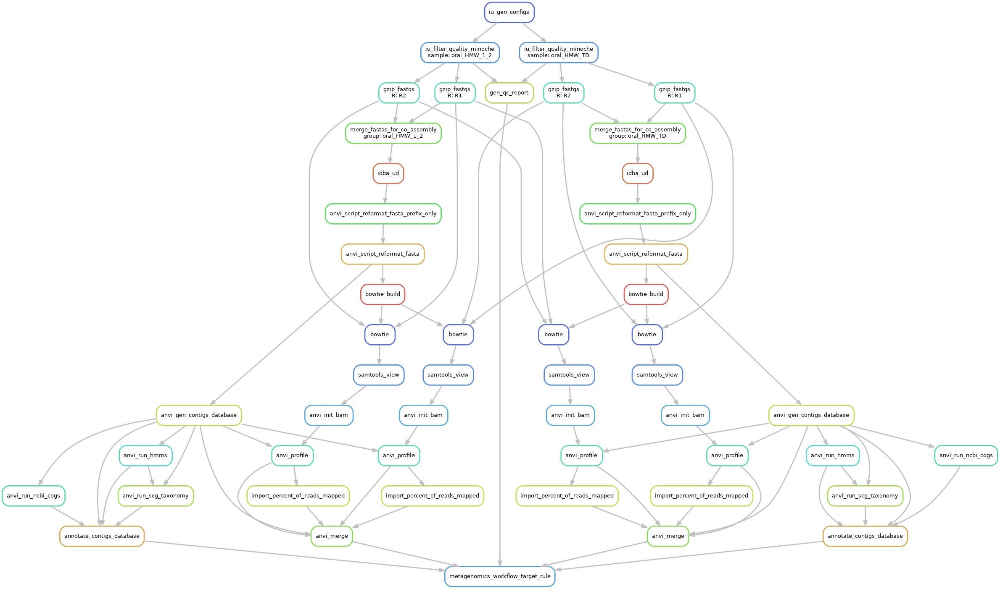
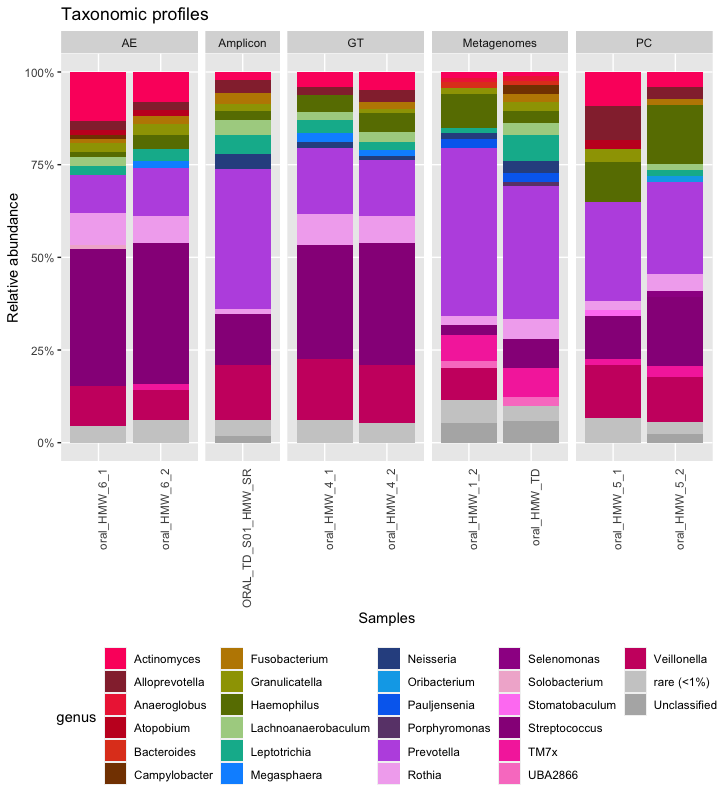

<div class="extra-info" markdown="1">

<span class="extra-info-header">Summary</span>

**The purpose of this page** is to provide access to reproducible data products that underlie our key findings in the study "**[High molecular weight DNA extraction strategies for long-read sequencing of complex metagenomes](https://www.biorxiv.org/content/10.1101/2021.03.03.433801v2)**" by Trigodet & Lolans et al.

In addition to the following data items, on this page you will find command lines for important analyses, results of which are discussed in the paper:

* [PRJNA703035](https://www.ncbi.nlm.nih.gov/bioproject/?term=PRJNA703035): The **raw sequencing data**.
* [doi:10.6084/m9.figshare.14141228](https://figshare.com/articles/dataset/Assembled_minION_long-reads/14141228): Data products that give reproducible access to **anvi’o contigs databases for assembled long-read sequences**.
* [doi:10.6084/m9.figshare.14141414](https://figshare.com/articles/dataset/Unassembled_minION_long-reads/14141414): Data products that give reproducible access to **anvi’o contigs databases for unassembled long-read sequences**.
* [doi:10.6084/m9.figshare.14141819](https://figshare.com/articles/dataset/Assembled_Illumina_Short_Reads/14141819): Data products that give reproducible access to **anvi’o contigs databases for assembled shotgun metagenomes**.
* [doi:10.6084/m9.figshare.14141918](https://figshare.com/articles/dataset/Supplementary_Tables_and_Figures/14141918): Supplementary Tables and Figures


</div>

{:.notice}
If you have any questions and/or if you are unable to find an important piece of information here, please feel free to leave a comment down below, send an e-mail to [us]({{ site.url }}/people/), or get in touch with us through Slack:



<div class="pub_float">
<div class='altmetric-embed' data-badge-type='donut' data-doi="10.1101/2021.03.03.433801"></div>
<div class="__dimensions_badge_embed__" data-doi="10.1101/2021.03.03.433801" data-hide-zero-citations="true" data-legend="hover-bottom" data-style="small_circle"></div>
    <span class="pub-title"><a href=" https://doi.org/10.1101/2021.03.03.433801" target="_new">High molecular weight DNA extraction strategies for long-read sequencing of complex metagenomes</a></span>
    <span class="pub-authors"><span class="pub-member-author">Trigodet F<sup>☯</sup></span>, <span class="pub-member-author">Lolans K<sup>☯</sup></span>, <span class="pub-member-author">Fogarty EC</span>, <span class="pub-member-author">Shaiber A</span>, Morrison HG, Barreiro L, Jabri B, <span class="pub-member-author">Eren AM</span></span>
    <span class="pub-co-first-authors"><sup>☯</sup>Co-first authors</span>
    <div class="pub-info">
    <div class="pub-featured-image">
    <a href="/images/pubs/Trigodet_and_Lolans_et_al_HMW.png"></a>
    </div>
    <div class="pub-highlights">
    <span style="display: inline-block; padding-bottom: 5px;">- A study that <b>benchmarks six high molecular weight DNA extraction strategies</b> (commercially available kits, phenol-chloroform extraction, and agarose encasement followed by agarase digestion) <b>for long-read sequencing of metagenomes</b> with MinION.</span><br><span style="display: inline-block; padding-bottom: 5px;">-  It turns out the protocol that works best for sequencing DNA from microbial isolates may not be the most effetive method for long-read sequencing of metagenomes ¯\_(ツ)_/¯</span>
    </div>
    </div>
    <span class="pub-journal"><b>bioRxiv</b> <a href="https://doi.org/10.1101/2021.03.03.433801" target="_blank">🔗</a></span>
</div>

## Study description
Long read sequencing offers new opportunities for metagenomics studies, especially the ability to generate reads overlapping conserved or complex genomic regions which often fragments metagenome-assembled genomes when using short-reads.

Oxford Nanopore Technology, with sequencer like the MinION, offers no theoretical limits on sequence length. The practical limits are actually the DNA fragments obtained from the DNA extraction itself, therefore creating a revival of attention on high molecular weight (HMW) DNA extraction methodologies in the past few years.

We chose to compare different HMW DNA extractions in the context of metagenomics analysis and using a low biomass and host contaminated type of sample: the human oral cavity.   

## HMW DNA extraction protocols
We tested six HMW DNA extractions, but only three were able to generate enough DNA yield and purity to match the requirements for MinION sequencing. For these extraction methods, we had an original nomenclature (M#_#), which is different from the protocol's name in the manuscript. Here is a table to summarize the three HMW DNA extraction methods, their replicates, variants, and also the additional sample used for amplicon and short-read sequencing.

DNA extractions sequenced with MinION (long-read metagenomes):

| Sample | Method | Manuscript name | Old name
| - | - | - | -
| oral_HMW | Qiagen Genomic Tip 20/G with enzymatic treatment | GT_1 | M4_1
| oral_HMW | Qiagen Genomic Tip 20/G with enzymatic treatment | GT_2 | M4_2
| oral_HMW | Phenol/Chloroform Extraction | PC_1 | M5_1
| oral_HMW | Phenol/Chloroform Extraction | PC_2 | M5_2
| oral_HMW | Agarose Plug Encasement & Extraction | AE_1 | M6_1
| oral_HMW | Agarose Plug Encasement & Extraction | AE_2 | M6_2
| oral_HMW | Qiagen Genomic Tip 20/G with enzymatic treatment and size-selection | GT_1_SS | M4_1_SS
| oral_HMW | Qiagen Genomic Tip 20/G with enzymatic treatment and size-selection | GT_2_SS | M4_2_SS

DNA extractions sequenced with Illumina (short-read metagenomes):

| Sample | Method | Manuscript name | Old name
| - | - | - | -
| oral_HMW | DNeasy PowerSoil Isolation Kit with modified bead beating | PB_2 | M1_2
| oral_TD | DNeasy Powersoil Isolation Kit | TD | TD


DNA extractions sequenced with Illumina (short-read amplicon):

| Sample | Method | Manuscript name | Old name
| - | - | - | -
| oral_TD | DNeasy Powersoil Isolation Kit | TD | TD


## Setting up your environment
For a better reproducibility, anyone can download the raw data and intermediate anvi'o contigs databases and create a directory to reproduce the analysis.

Here is the list of software required:
 - [anvi'o](https://merenlab.org/2016/06/26/installation-v2/)
 - [oligotyping - MED](https://merenlab.org/2014/08/16/installing-the-oligotyping-pipeline/)
 - [minimap2](https://github.com/lh3/minimap2)
 - [IDBA-UD](https://github.com/loneknightpy/idba)
 - [vsearch](https://github.com/torognes/vsearch)
 - [Flye](https://github.com/fenderglass/Flye)
 - [Pilon](https://github.com/broadinstitute/pilon)
 - r package: [tidyverse](https://www.tidyverse.org/), [dada2](https://benjjneb.github.io/dada2/index.html), [scales](https://scales.r-lib.org/), [Biostrings](https://bioconductor.org/packages/release/bioc/html/Biostrings.html), [reshape2](https://cran.r-project.org/web/packages/reshape2/index.html)

Most section will require the reader to create a tab delimited files with the name of samples and path to the appropriate data (raw sequences, assemblies). But let's start by creating a working directory variable:
```bash
export WD="/path/to/your/working/directory/Trigodet_Lolans_et_al_2021/"
```

## Mapping and removing of the human reads
In this first step, we are filtering out the long-reads mapping to the human genome.
This part of the workflow is not fully reproducible since we asked to remove human read during the SRA submission. Any read identified as a human read by the SRA pipeline are replaced by a read of the same length, with Ns.

But you may still be interested in the way we removed and assessed the amount of human read contamination. You can get the fastq without the reads with Ns and still performed the mapping to the human genome, in case there were some differences between how SRA identifies human reads compare to us. To do that, you can use `fastq-dump` to download the raw fastq file with the argument `--read-filter pass`.

We want to remove human reads from all the long-read sequencing sample: GT_1, GT_2, PC_1, PC_2, AE_1, AE_2, GT_1_SS and GT_2_SS (the size selection samples).

We need a tab delimited text file with the following samples and the path to the raw long-reads, hereafter referred as `raw_reads.txt`:

```
sample  path
GT_1  /path/to/GT_1.fastq
GT_2  /path/to/GT_2.fastq
PC_1  /path/to/PC_1.fastq
PC_2  /path/to/PC_2.fastq
AE_1  /path/to/AE_1.fastq
AE_2  /path/to/AE_2.fastq
GT_1_SS  /path/to/GT_1_SS.fastq
GT_2_SS  /path/to/GT_2_SS.fastq
```

We also need your favorite humane genome (GRCh38), and index it with minimap2:
```bash
cd $WD

# create a directory for you to download the
# human genome
mkdir -p 00_LOGS
mkdir -p 01_RESOURCES
mkdir -p 01_RESOURCES/HUMAN_GENOME

cd 01_RESOURCES/HUMAN_GENOME

# replace the human genome file name with the
# one you have downloaded
minimap2 -x map-ont \
         -d GRCh38_latest_genomic.mmi \
         GRCh38_latest_genomic.fna.gz
```

Map the long reads with minimap2:
```bash
cd $WD

mkdir -p 02_MAPPING
mkdir -p 02_MAPPING/HUMAN_GENOME

while read sample path; do
  if [ "$sample" == "sample" ]; then continue; fi
    minimap2 -a 01_RESOURCES/HUMAN_GENOME/GRCh38_latest_genomic.mmi \
             $path \
             -t 10 \
             > 02_MAPPING/HUMAN_GENOME/$sample.sam
done < raw_reads.txt
```

Now, let's filter out the reads mapping to the human genome:

```bash
cd $WD

mkdir -p 03_FASTA

while read sample path; do
  if [ "$sample" == "sample" ]; then continue; fi
  samtools view -F 4 02_MAPPING/HUMAN_GENOME/$sample.sam | cut -f 1 | sort -u > 02_MAPPING/HUMAN_GENOME/$sample-ids-to-remove.txt

  iu-remove-ids-from-fastq -i $path \
                           -l 02_MAPPING/HUMAN_GENOME/$sample-ids-to-remove.txt \
                           -d " "

  seqkit fq2fa -w 0 $path.survived > 03_FASTA/$sample-bacterial-reads.fa
  seqkit fq2fa -w 0 $path.removed > 03_FASTA/$sample-human-reads.fa

done < raw_reads.txt
```

Now we can assess the amount of human and microbial reads. Keep in mind that if you have downloaded the SRA fastq with the `--read-filter pass`, a majority of human reads have already been removed.
```bash
# total number of reads
while read sample path; do
  if [ "$sample" == "sample" ]; then continue; fi
  num_seq=$((`wc -l < $path` / 4))
  echo -e "$sample\t$num_seq"
done < raw_reads.txt

# microbial reads
for sample in `ls 03_FASTA/*-bacterial-reads.fa`; do
  num_seq=$((`wc -l < $sample` / 2))
  echo -e "$sample\t$num_seq"
done

# human reads
for sample in `ls 03_FASTA/*-human-reads.fa`; do
  num_seq=$((`wc -l < $sample` / 2))
  echo -e "$sample\t$num_seq"
done
```

## Size distribution table and figure
Let's generate anvi'o contigs databases with the microbial reads.
They will be useful to summarize some read metrics, but also later for the taxonomic composition analysis.

We used the anvi'o build in snakemake workflow for contigs. To do that, we need a `fasta.txt` file, which should look like this if you have followed the above directory structure:
```
sample  path
GT_1  $WD/03_FASTA/GT_1-bacterial-reads.fa
GT_2  $WD/03_FASTA/GT_2-bacterial-reads.fa
PC_1  $WD/03_FASTA/PC_1-bacterial-reads.fa
PC_2  $WD/03_FASTA/PC_2-bacterial-reads.fa
AE_1  $WD/03_FASTA/AE_1-bacterial-reads.fa
AE_2  $WD/03_FASTA/AE_2-bacterial-reads.fa
GT_1_SS  $WD/03_FASTA/GT_1_SS-bacterial-reads.fa
GT_2_SS  $WD/03_FASTA/GT_2_SS-bacterial-reads.fa
```

We also need a `config.json` file which is used to pass arguments to the workflow command. You can modify it to change/increase the number of threads, run (or not) some optional commands, and the output directory. Here, the new directory will be `04_CONTIGS` for the contigs.db.
You can get a default config file like this:
```bash
anvi-run-workflow -w contigs --get-default-config config.json
```

Here is the workflow graph:
```bash
anvi-run-workflow -w contigs -c config.json --save-workflow-graph
```


```bash
cd $WD
anvi-run-workflow -w contigs -c config.json
```

Get some basic information:
```bash
anvi-display-contigs-stats -o 04_CONTIGS/contig_stats.txt 04_CONTIGS/*contigs.db
```

For the reads length distribution, we focused on the non-treated sample (no size selection). We need a file `microbial_human_reads.txt` with the sample name, path to the microbial and human reads:

```
name  microbial  human
GT_1  $WD/03_FASTA/GT_1-bacterial-reads.fa  $WD/03_FASTA/GT_1-human-reads.fa
GT_2  $WD/03_FASTA/GT_2-bacterial-reads.fa  $WD/03_FASTA/GT_2-human-reads.fa
PC_1  $WD/03_FASTA/PC_1-bacterial-reads.fa  $WD/03_FASTA/PC_1-human-reads.fa
PC_2  $WD/03_FASTA/PC_2-bacterial-reads.fa  $WD/03_FASTA/PC_2-human-reads.fa
AE_1  $WD/03_FASTA/AE_1-bacterial-reads.fa  $WD/03_FASTA/AE_1-human-reads.fa
AE_2  $WD/03_FASTA/AE_1-bacterial-reads.fa  $WD/03_FASTA/AE_1-human-reads.fa
```

Get the size distribution:
```bash
echo -e "sample\ttype\tlength" > size_distribution.txt
while read name microbial human; do
  if [ "$name" == "name" ]; then continue; fi
  awk -v name="$name" '/^>/{next}{print name "\tmicrobial\t"  length}' $microbial >> size_distribution.txt
  awk -v name="$name" '/^>/{next}{print name "\thuman\t"  length}' $human >> size_distribution.txt
done < microbial_human_reads.txt
```

Using R, we can plot the size distribution:

```r
library(tidyverse)

setwd("path/to/your/working/directory/Trigodet_Lolans_et_al_2021/")

# import the data
size_distribution <- read.table("size_distribution.txt", header = T)

# create a group column for the three protocols
size_distribution$group <- ifelse(grepl("oral_HMW_4", size_distribution$sample), "M4",
                                  ifelse(grepl("oral_HMW_5", size_distribution$sample), "M5", "M6"))

# re-organize the samples
size_distribution$sample <- factor(size_distribution$sample, levels = c("oral_HMW_4_1", "oral_HMW_5_1", "oral_HMW_6_1", "oral_HMW_4_2", "oral_HMW_5_2", "oral_HMW_6_2"))

# create
breaks <- 10^(-10:10)
minor_breaks <- rep(1:9, 21)*(10^rep(-10:10, each=9))

# the ggplot function
P <- function(df){
  p <- ggplot(df, aes(length, fill = group, weight = length, alpha = type))
  p <- p + geom_histogram(bins = 40)
  p <- p + facet_wrap(. ~ sample, nrow = 2)
  p <- p + scale_alpha_discrete(range = c (0.6, 1))
  p <- p + scale_fill_manual(values = c("#007543", "#fa9f2e", "#0065a3"))
  p <- p + ylab("Sequencing yield (bp)")
  p <- p + xlab("Read length (bp)")
  p <- p + scale_x_log10(breaks = 10^(-10:10),
                         minor_breaks = rep(1:9, 21)*(10^rep(-10:10, each=9)))
  print(p)
}

# for all read size
P(size_distribution)

# for reads > 2500 bp
P(size_distribution[size_distribution$length>2500,])
```
Here are the two raw figures.
All the reads:



Only reads >2500 bp:




## Taxonomic composition
This section is divided into three distinct parts which relate to three different data input:
- MinION long-reads
  - Samples: GT_1, GT_2, PC_1, PC_2, AE_1, AE_2
- Short-read metagenomes
  - Samples: PB_2, TD
- Short-read amplicon
  - Samples: TD

For each type of data, we have a different strategy to analysis their taxonomic composition. In brief, for the long-reads we recovered the 16S rRNA genes which we blasted against the Human Oral Microbiome Database (HOMD); for metagenomes, we followed anvi'o metagenomics workflow with the IDBA_UD assembler and used ribosomal protein with the Genome Taxonomy Database (GTDB) to compute taxonmic profiles; and for the 16S rRNA amplicon sequencing, we used Minimum Entropy Decomposition (MED) to generate oligotypes and the Silva database to assign taxonomy.

### MinION long-reads
We can extract the 16S rRNA genes with the anvi'o command `anvi-get-sequences-for-hmm-hits` (not using the size-selection samples):
```bash
cd $WD

while read sample path; do
  if [ "$sample" == "sample" | "$sample" =~ "SS" ] || [[ "$sample" =~ "SS" ]]; then continue; fi;
    anvi-get-sequences-for-hmm-hits -c 04_CONTIGS/$sample-contigs.db \
                                    --hmm-source Ribosomal_RNAs \
                                    --gene-name Bacterial_16S_rRNA \
                                    -o 04_CONTIGS/$sample-16S_rRNA.fa
done < raw_reads.txt
```

We used the online HOMD blast tool to get taxonomic profile: http://www.homd.org/index.php?name=RNAblast&file=index&link=upload
We saved the top hit for each 16S rRNA sequence.
Let's download the table in a new directory `05_LR_TAXONOMY`.

We need to create a table with the genus count per sample:
```bash
# remove empty lines with a single tab
for homd_out in `ls 05_LR_TAXONOMY/*HOMD*`; do
    sed '/^\t$/d' $homd_out > tmp
    mv tmp $homd_out
done

echo -e "sample\ttaxo\tcount" > 05_LR_TAXONOMY/genus-for-ggplot.txt
for homd_out in `ls 05_LR_TAXONOMY/*HOMD*txt`; do
  sample=`echo $homd_out | awk -F '-|/' '{print $2}'`
  for taxo in `cut -f5 $homd_out | sed 1d | cut -f1 -d ' ' | sort | uniq`; do
    count=`grep -c $taxo $homd_out`
    echo -e "$sample\t$taxo\t$count" >> 05_LR_TAXONOMY/genus-for-ggplot.txt
  done
done
```

We will use this long-format table later to visualize taxonomic profile with ggplot2.

### Short-read metagenomes
Let's create a new directory dedicated to the metagenomics analsysis.

```bash
cd $WD
mkdir 06_SR_METAGENOMICS && cd 06_SR_METAGENOMICS
```

We will use anvi'o build in metagenomics workflow. Once again you can use the workflow command to genreate a default config file:
```
anvi-run-workflow -w metagenomics --get-default-config config.json
```

We will also need a `samples.txt` file with the name of the samples and the path to the read 1 and read 2 fastq files:
```
sample  r1  r2
PB_2  /path/to/PB_2-metagenome-R1.fastq  /path/to/PB_2-metagenome-R2.fastq
TD  /path/to/TD-metagenome-R1.fastq  /path/to/TD-metagenome-R2.fastq
```

Make sure to modify the `config.json` according to your setup (num of threads) and enable the IDBA_UD assembler.
Here is a graph of that workflow:



Then we can use `anvi-estimate-scg-taxonomy` to get the taxonomic profile, using the most abundant ribosomal protein, here Ribosomal_S7.
To do that, we need a `metagenomes.txt` file with the path to the contigs.db and profile.db:
```
name  contigs_db_path profile_db_path
PB_2  03_CONTIGS/PB_2-contigs.db	05_ANVIO_PROFILE/PB_2/PB_2/PROFILE.db
TD  03_CONTIGS/TD-contigs.db	05_ANVIO_PROFILE/TD/TD/PROFILE.db
```

The command:
```bash
anvi-estimate-scg-taxonomy --compute-scg-coverages -M metagenomes.txt -O taxonomy
```
The output will be `taxonomy-LONG-FORMAT.txt` and it is ready to used in R with ggplot2.


### Short-read amplicon
Once again, let's create a new directory for the 16S rRNA analysis.
```bash
cd $WD
mkdir 07_SR_AMPLICON && cd 07_SR_AMPLICON
```

#### Quality filtering and merging
We will first use IlluminaUtils to remove low quality sequences, and merged the overlapping paired-end reads. To do that, we will need a first `samples_qc.txt` files with the name of the sample, path to read 1 and read 2.

```
sample  r1  r2
TD  /path/to/TD-amplicon-R1.fastq /path/to/TD-amplicon-R2.fastq
```

We can then run the quality filtering:
```bash
# genreate config file per sample
iu-gen-configs samples_qc.txt -o 01_QC

# run the quality filtering
iu-filter-quality-minoche 01_QC/TD.ini --ignore-deflines
```

For the paired-end merging, we need another files `samples_merging.txt`.

```
sample  r1  r2
TD  01_QC/TD-QUALITY_PASSED_R1.fastq  01_QC/TD-QUALITY_PASSED_R2.fastq
```

Generate config files with the degenerate primer and barcode sequence:
```bash
iu-gen-configs samples_merging.txt \
               --r1-prefix ^TACGCCCAGCAGC[C,T]GCGGTAA. \
               --r2-prefix CCGTC[A,T]ATT[C,T].TTT[A,G]A.T \
               -o 02_MERGED
```

The actual command for the merging:
```bash
iu-merge-pairs 02_MERGED/TD.ini
```

#### Chimera detection and removal
To perform a chimera detection, we first need to dereplicate the reads, using vsearch:
```bash
vsearch --derep_fulllength 02_MERGED/TD_MERGED \
        --sizeout \
        --fasta_width 0 \
        --output 02_MERGED/TD_MERGED_DEREP \
        --threads 10
```
Then, still with vsearch, we can look for chimeric sequences and remove them:
```bash
vsearch --fasta_width 0 \
        --uchime_denovo 02_MERGED/TD_MERGED_DEREP \
        --nonchimeras 02_MERGED/TD_MERGED_DEREP_CHIMERA_FREE
        --threads 10
```
And prior to MED, we need to replicate the unique sequences:
```bash
vsearch --rereplicate 02_MERGED/TD_MERGED_DEREP_CHIMERA_FREE \
        --fasta_width 0 \
        --output 02_MERGED/TD_MERGED_CHIMERA_FREE \
        --threads 10
```

#### Minimum Entropy Decomposition
Now we have a set of merged and chimera free sequence and we can run MED:
```bash
# all sequences need to have the same length
o-pad-with-gaps 02_MERGED/TD_MERGED_CHIMERA_FREE

# run MED
decompose 02_MERGED/TD_MERGED_CHIMERA_FREE-PADDED-WITH-GAPS \
          -N 10 \
          -o 03_MED \
          --skip-check-input
```

#### Taxonomy assignment
We used DADA2 in R and the Silva nr v132 database to assign taxonomy to the respresentative sequences from the MED analysis.

In R:
```r
library(dada2)
library(Biostrings)
library(reshape2)
library(tidyverse)

setwd("path/to/your/working/directory/Trigodet_Lolans_et_al_2021/07_SR_AMPLICON")

# import the nodes sequences
nodes <- readDNAStringSet("03_MED/NODE-REPRESENTATIVES.fasta")
nodes <- as.data.frame(nodes)
nodes$name <- paste0("X", sapply(strsplit(rownames(nodes), "|", fixed = T), `[`, 1))

# import the count matrix
med_mat <- read.table("03_MED/MATRIX-COUNT.txt", header = T)

# assign the taxonomy with DADA2 and silva 132
# but first create the named fasta vector
med_tax <- assignTaxonomy(nodes$x,
                          "/path/to/your/database/silva_nr_v132_train_set.fa.gz",
                          multithread = 12,
                          minBoot = 80
)
rownames(med_tax) <- nodes[match(rownames(med_tax), nodes$x), "name"]

# replace NA by "Unclassified"
med_tax[is.na(med_tax)] <- "Unclassified"

# Create the table for the stackedbar
med_mat_stack <- melt(med_mat)
# add the taxonomy
med_mat_stack$genus <- med_tax[match(med_mat_stack$variable, rownames(med_tax)), "Genus"]


# reshape the table
SR_16S <- med_mat_stack[, c(1, 4, 3)]
colnames(SR_16S) <- c("sample", "genus", "count")
SR_16S$group <- "Amplicon"
SR_16S <- group_by(SR_16S, sample, genus, group) %>% summarise(count = sum(count))
SR_16S <- SR_16S[, c(1,2,4,3)]

# export the final table
write.table(SR_16S, "SR_16S.txt", quote=F, sep="\t")
```

### Combining all taxonomic profile into one figure
Now that we have taxonomic profiles for the three data type, we can create a stacked bar plot with all the samples.

```r
library(dada2)
library(tidyverse)
library(scales)

setwd("path/to/your/working/directory/Trigodet_Lolans_et_al_2021/")


#### LONG READS - 16S ---------------------------------------------------------
# import the data
LR_16S <- read.table("05_LR_TAXONOMY/genus-for-ggplot.txt",
                     header = T, stringsAsFactors = F)

# fix genus name
LR_16S[LR_16S == "Selenomonas_3"] <- "Selenomonas"
LR_16S[LR_16S == "Saccharibacteria"] <- "TM7x"
LR_16S[LR_16S == "Peptostreptococcaceae"] <- "Unclassified" # genus is unknown

# reformat
colnames(LR_16S) <- c("sample", "genus", "count")
LR_16S$group <- ifelse(grepl("oral_HMW_4", LR_16S$sample), "GT",
                       ifelse(grepl("oral_HMW_5", LR_16S$sample), "PC", "AE"))


#### Short-reads metagenome - Ribo protein ------------------------------------
# import the data
short_reads <- read.table("06_SR_METAGENOMICS/taxonomy-LONG-FORMAT.txt",
                          header = T, sep = "\t")

# reformat short_reads
SR_S7 <- short_reads[short_reads$taxonomic_level == "t_genus", ]
SR_S7 <- SR_S7[, 2:4]
colnames(SR_S7) <- c("sample", "genus", "count")
SR_S7$group <- "Metagenomes"
SR_S7$count <- as.numeric(SR_S7$count)


# 16S data - MED --------------------------------------------------------------
# import the data
SR_16S <- read.table("07_SR_AMPLICON/SR_16S.txt", header = T, sep = "\t")


#### A BIG FIGURE  ------------------------------------------------------------
# ... and in the darkness bind them
all_samples <- bind_rows(LR_16S, SR_S7, SR_16S)

# Make percentage per sample
all_samples <- group_by(all_samples, sample) %>% mutate(count = count / sum(count))

# Filter out < 1% and create a "rare" category
x <- 0.01
genus_rare <- group_by(all_samples[all_samples$count < x, ], sample, group) %>% summarise(count = sum(count))
genus_rare$genus <- "rare (<1%)"
all_samples <- all_samples[all_samples$count >= x, ]
all_samples <- bind_rows(all_samples, genus_rare)

# Simplify taxo name
all_samples$genus <- gsub("Unknown_genera", "Unclassified", all_samples$genus)
all_samples$genus <- gsub("Prevotella_6", "Prevotella", all_samples$genus)
all_samples$genus <- gsub("Prevotella_7", "Prevotella", all_samples$genus)
all_samples$genus <- gsub("F0040", "Unclassified", all_samples$genus)
all_samples$genus <- gsub("F0428", "Unclassified", all_samples$genus)

# order the taxonomy
all_samples$genus <- factor(all_samples$genus, levels = c(
  "Actinomyces", "Alloprevotella", "Anaeroglobus", "Atopobium",
  "Bacteroides", "Bulleidia", "Campylobacter", "Eremiobacter",
  "Fructilactobacillus", "Fusobacterium", "Granulicatella", "Haemophilus",
  "Kosakonia", "Lachnoanaerobaculum", "Lancefieldella", "Leptotrichia",
  "Megasphaera", "Neisseria", "Oribacterium", "Pauljensenia",
  "Porphyromonas", "Prevotella", "Rothia", "Selenomonas",
  "Solobacterium", "Stomatobaculum", "Streptococcus",
  "TM7x", "UBA2866", "Veillonella", "rare (<1%)", "Unclassified"))

colorlist <- data.frame(
  genus = c(
    "Actinomyces",
    "Alloprevotella",
    "Anaeroglobus",
    "Atopobium",
    "Bacteroides",
    "Bulleidia",
    "Campylobacter",
    "Eremiobacter",
    "Fructilactobacillus",
    "Fusobacterium",
    "Gemella",
    "Gracilibacter",
    "Granulicatella",
    "Haemophilus",
    "Kosakonia",
    "Ilyobacter",
    "Lachnoanaerobaculum",
    "Lancefieldella",
    "Leptotrichia",
    "Megasphaera",
    "Neisseria",
    "Oribacterium",
    "Pauljensenia",
    "Piscibacillus",
    "Pontibacillus",
    "Porphyromonas",
    "Prevotella",
    "Rothia",
    "Selenomonas",
    "Solobacterium",
    "Stomatobaculum",
    "Streptococcus",
    "TM7x",
    "UBA2866",
    "Veillonella",
    "rare (<1%)",
    "Unclassified"
  ),
  col = c(
    "#fc276c",
    "#952d3b",
    "#ee2e43",
    "#c60025",
    "#e14321",
    "#ffa382",
    "#844000",
    "#e28900",
    "#ffb055",
    "#be8700",
    "#b09463",
    "#e9c171",
    "#9ea100",
    "#687c00",
    "#475928",
    "#88db56",
    "#abd190",
    "#007346",
    "#01b69b",
    "#0294ff",
    "#2f5190",
    "#00aaea",
    "#006eef",
    "#a176ff",
    "#6d37a1",
    "#6b4479",
    "#bc5be2",
    "#f2b0ef",
    "#9f1a93",
    "#f1b5d2",
    "#ff86f3",
    "#980389",
    "#f639ab",
    "#f982ca",
    "#cc016f",
    "grey80",
    "grey70"
  )
)

# make sure the color list match the genus.
colorlist <- colorlist[colorlist$genus %in% unique(all_samples$genus), ]

# The figure
P <- function(df, tax_color, title = "") {
  p <- ggplot(df, aes(sample, count, fill = genus))
  p <- p + geom_bar(stat = "identity", position = "fill")
  p <- p + facet_grid(. ~ group, scales = "free_x", space = "free_x")
  p <- p + scale_fill_manual(values = as.vector(tax_color[[2]]), limits = as.vector(tax_color[[1]]))
  p <- p + theme(
    axis.ticks.x = element_blank(),
    strip.text.y = element_text(angle = 0, hjust = 0),
    panel.grid.minor = element_blank(),
    legend.position = "bottom",
    axis.text.x = element_text(angle = 90, hjust = 1))
  p <- p + ylab("Relative abundance")
  p <- p + xlab("Samples")
  p <- p + ggtitle(title)
  p <- p + scale_y_continuous(labels = percent)
  print(p)
}
P(all_samples, colorlist, "Taxonomic profiles")
```
Here is the raw figure, before a prettifying step in Inkscape:




## Long-read assembly
In this part of the reproducible workflow, we are going to assemble the long-reads from GT_1, GT_2, PC_1, PC_2, AE_1 and AE_2. We will use the short-reads from PB_2 (because it all comes from the same pool of tongue scrapping) to polish the long-read contigs and anvi'o contigs workflow to summarize each assembly.

Among the few metagenomics assembler for long-reads, we chose to use Flye with the metagenomics option:
```bash
cd $WD

mdkir 08_LR_ASSEMBLY && cd 08_LR_ASSEMBLY

while read sample path; do
  if [ "$sample" == "sample" | "$sample" =~ "SS" ] || [[ "$sample" =~ "SS" ]]; then continue; fi;
  flye --nano-raw $path \
       --out-dir 08_LR_ASSEMBLY/$sample \
       --meta \
       --threads 16
done < raw_reads.txt
```

Then we will use Pilon to polish the contigs with short-reads. But Pilon is not a "one command line only".
We need to map the short reads to the contigs with minimap2, sort and index the bam file and then run Pilon.
Let'l create a `fasta_raw_assemblies.txt` file with the name of samples, and path to the assemblies.

```
name  path
GT_1  $WD/08_LR_ASSEMBLY/GT_1/assembly.fasta
GT_2  $WD/08_LR_ASSEMBLY/GT_2/assembly.fasta
PC_1  $WD/08_LR_ASSEMBLY/PC_1/assembly.fasta
PC_2  $WD/08_LR_ASSEMBLY/PC_2/assembly.fasta
AE_1  $WD/08_LR_ASSEMBLY/AE_1/assembly.fasta
AE_2  $WD/08_LR_ASSEMBLY/AE_2/assembly.fasta
```

Now, let's run Pilon!
```bash
while read name path
do
  if [ "$name" == "name" ]; then continue; fi
  minimap2 -t 6 \
           -ax map-ont $path \
           /path/to/PB_2-metagenome-R1.fastq \
           /path/to/PB_2-metagenome-R2.fastq \
           > 08_LR_ASSEMBLY/PILON/$name/$name.sam
done < fasta_raw_assemblies.txt


while read name path
do
  if [ "$name" == "name" ]; then continue; fi
  samtools sort 08_LR_ASSEMBLY/PILON/$name/$name.sam \
                -@ 6 \
                -o 08_LR_ASSEMBLY/PILON/$name/$name.bam
done < fasta_raw_assemblies.txt


while read name path
do
  if [ "$name" == "name" ]; then continue; fi
  samtools index 08_LR_ASSEMBLY/PILON/$name/$name.bam
done < fasta_raw_assemblies.txt


while read name path
do
  if [ "$name" == "name" ]; then continue; fi
  java -Xmx16G -jar /path/to/pilon-1.23-2/pilon-1.23.jar \
       --genome $path \
       --bam 08_LR_ASSEMBLY/PILON/$name/$name.bam \
       --outdir 08_LR_ASSEMBLY/PILON/$name \
       --output $name-pilon
done < fasta.txt
```

Once again we can create anvi'o contigs databases to summarize these assemblies. We can create an other file `fasta_polished_assemblies.txt` with the sample name and path to each assemblies:

```
name  path
GT_1_assembly  $WD/08_LR_ASSEMBLY/PILON/GT_1/GT_1.fasta
GT_2_assembly  $WD/08_LR_ASSEMBLY/PILON/GT_2/GT_2.fasta
PC_1_assembly  $WD/08_LR_ASSEMBLY/PILON/PC_1/PC_1.fasta
PC_2_assembly  $WD/08_LR_ASSEMBLY/PILON/PC_2/PC_2.fasta
AE_1_assembly  $WD/08_LR_ASSEMBLY/PILON/AE_1/AE_1.fasta
AE_2_assembly  $WD/08_LR_ASSEMBLY/PILON/AE_2/AE_2.fasta
```

You can copy the `config.json` used for the previous contigs workflow and update the name of the `fasta.txt` with `fasta_polished_assemblies.txt`.
And run the workflow:
```bash
anvi-run-workflow -w contigs -c config.json
```

Finally, you can get the summary (number of contigs, total length, N50, number of genes, single-copy core genes, number of expected genomes) with `anvi-display-contigs-stats`:
```bash
anvi-display-contigs-stats -o 04_CONTIGS/contig_stats_assembly.txt 04_CONTIGS/*assembly*contigs.db
```
