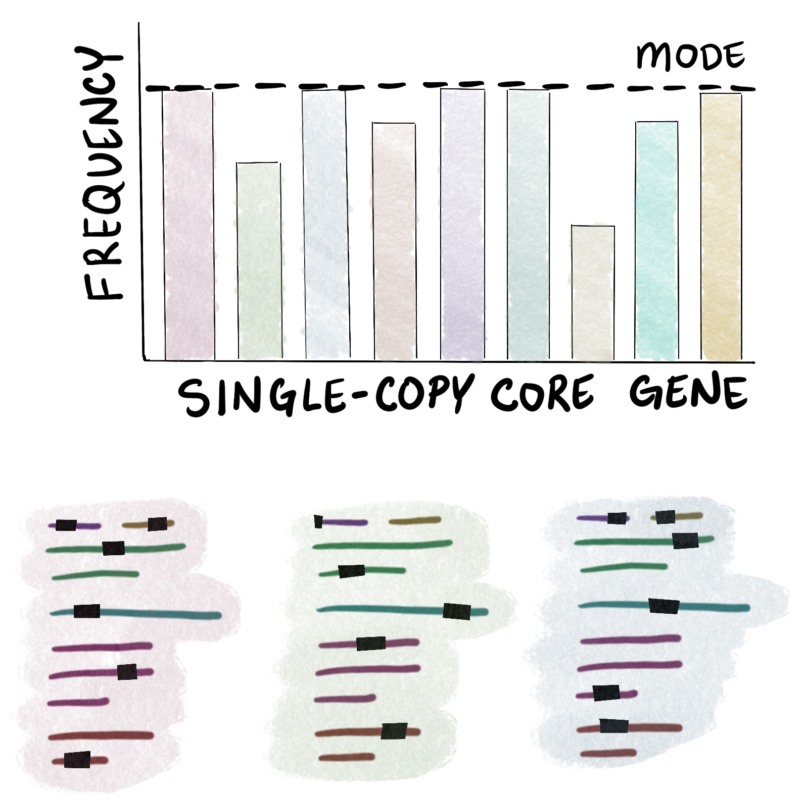
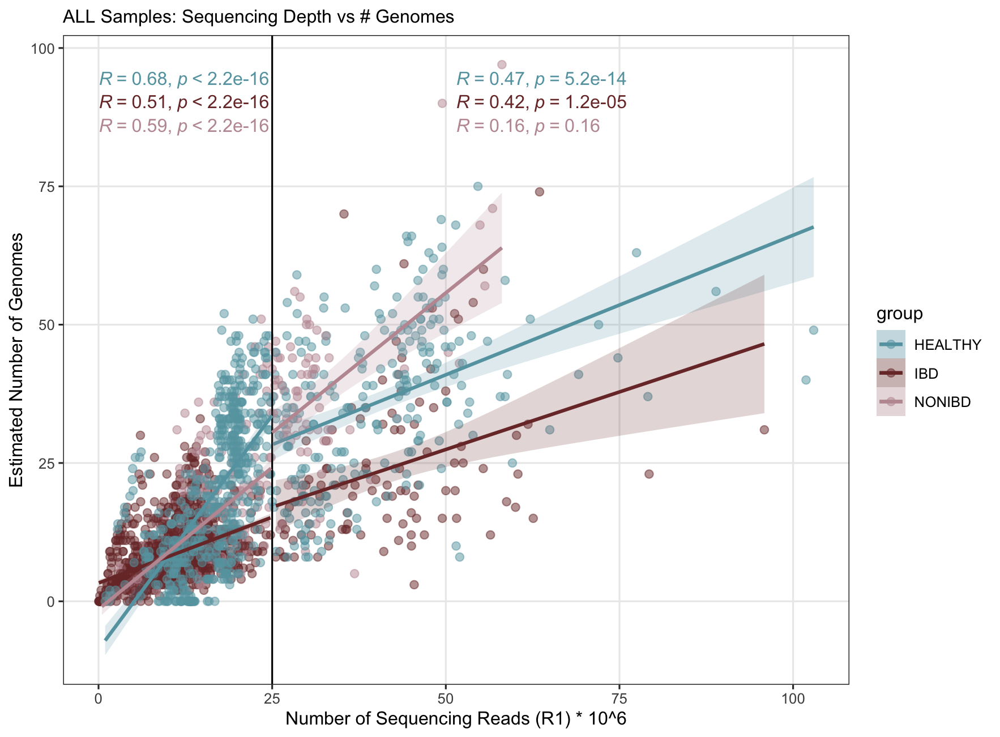
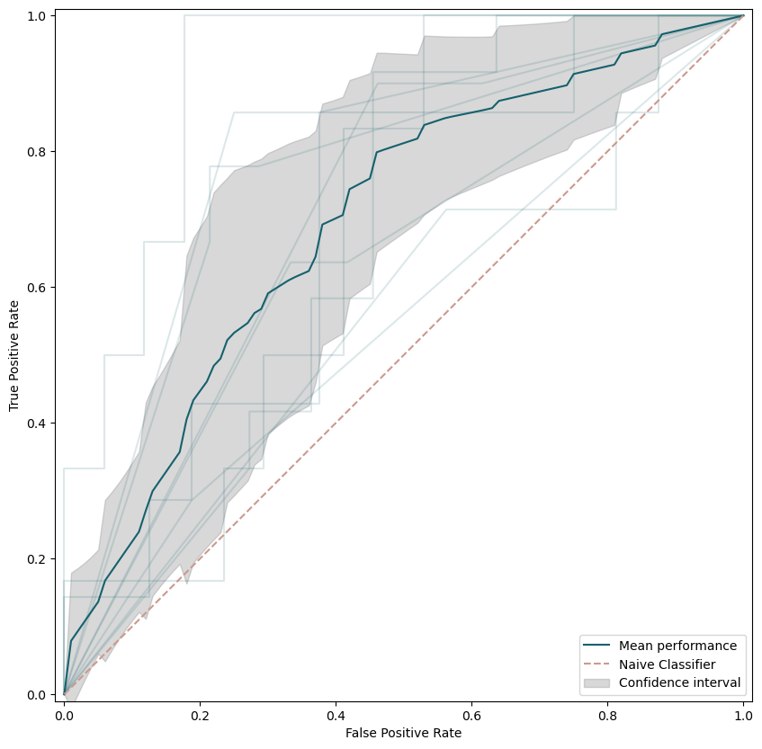

<div class="extra-info" markdown="1">

<span class="extra-info-header">Summary</span>

**The purpose of this page** is to provide access to reproducible data products and analyses for the study "**Microbes with higher metabolic independence are enriched in human gut microbiomes under stress**" by Veseli et al:

<div class="pub_float">
<div class="altmetric-embed" data-badge-type="donut" data-doi="10.7554/eLife.89862"></div>
<div class="__dimensions_badge_embed__" data-doi="10.7554/eLife.89862" data-hide-zero-citations="true" data-legend="hover-bottom" data-style="small_circle"></div>
    <span class="pub-title"><a href="https://doi.org/10.7554/eLife.89862" target="_new">Microbes with higher metabolic independence are enriched in human gut microbiomes under stress</a></span>
    <span class="pub-authors"><span class="pub-member-author" title="An official member of the lab at the time of publication">Veseli I</span>, Chen YT, <span class="pub-member-author" title="An official member of the lab at the time of publication">Schechter MS</span>, Vanni C, <span class="pub-member-author" title="An official member of the lab at the time of publication">Fogarty EC</span>, <span class="pub-member-author" title="An official member of the lab at the time of publication">Watson AR</span>, Jabri B, Blekhman R, <span class="pub-collaborator-author" title="A key collaborator of the lab at the time of publication">Willis AD</span>, <span class="pub-collaborator-author" title="A key collaborator of the lab at the time of publication">Yu MK</span>, Fernàndez-Guerra A, <span class="pub-collaborator-author" title="A key collaborator of the lab at the time of publication">Füssel J</span>, <span class="pub-member-author" title="An official member of the lab at the time of publication">Eren AM</span></span>
    <div class="pub-info">
    <div class="pub-featured-image">
    <a href="/images/pubs/veseli_et_al_ibd_metabolism.png"></a>
    </div>
    <div class="pub-highlights">
    <span style="display: inline-block; padding-bottom: 5px;">- A study of microbial metabolic enrichment in human gut metagenomes that shows high metabolic independence (HMI) is a distinguishing characteristic of microbial communities associated with individuals diagnosed with IBD.</span><br /><span style="display: inline-block; padding-bottom: 5px;">- Furthermore, it shows that the enrichment of metabolic features that are predictive of HMI and that were enriched in IBD were also enriched in gut microbiome following antibiotic treatment, suggesting that HMI is a hallmark of microbial communities in stressed gut environments.</span><br /><span style="display: inline-block; padding-bottom: 5px;">- An insight article written by Vanessa Rossetto Marcelino, <a href="https://elifesciences.org/articles/92319">Gut Health&#58; The value of connections</a>, accompanies this work with additional perspectives.</span><br /><span style="display: inline-block; padding-bottom: 5px;">- <a href="https://elifesciences.org/reviewed-preprints/89862/reviews">Peer reviews</a>. <a href="https://merenlab.org/data/ibd-gut-metabolism/">Reproducible bioinformatics workflow</a>.</span>
    </div>
    </div>
    <span class="pub-journal"> 📚 <b>eLife</b>, 12(RP89862) | 🔍 <a href="http://scholar.google.com/scholar?hl=en&amp;q=Microbes+with+higher+metabolic+independence+are+enriched+in+human+gut+microbiomes+under+stress" target="_blank">Google Scholar</a> | 🔗 <a href="https://doi.org/10.7554/eLife.89862" target="_blank">doi:10.7554/eLife.89862</a></span>
</div>

Here is a list of links for quick access to the data described in our manuscript and on this page:

* [doi:10.6084/m9.figshare.22679080](https://doi.org/10.6084/m9.figshare.22679080): Supplementary Tables and Supplementary Files.
* [doi:10.6084/m9.figshare.22776701](https://doi.org/10.6084/m9.figshare.22776701): Datapack for this reproducible workflow.
* [doi:10.5281/zenodo.7872967](https://doi.org/10.5281/zenodo.7872967): Contigs databases for our assemblies of 408 deeply-sequenced gut metagenomes.
* [doi:10.5281/zenodo.7883421](https://doi.org/10.5281/zenodo.7883421): Contigs databases for 338 GTDB genomes.
* [doi:10.5281/zenodo.7897987](https://doi.org/10.5281/zenodo.7897987): Contigs databases for our assemblies of the gut metagenomes from [Palleja et al. 2018](https://doi.org/10.1038/s41564-018-0257-9).
* [doi:10.6084/m9.figshare.24042288](https://doi.org/10.6084/m9.figshare.24042288): AGNOSTOS gene clustering and classification data for genes from our assemblies of 330 deeply-sequenced healthy and IBD gut metagenomes.
* [doi:10.6084/m9.figshare.26038018](https://doi.org/10.6084/m9.figshare.26038018): Datapack for reproducible workflow for validation of our methodology (see [Addendum 2](#addendum-2-using-synthetic-metagenomes-to-validate-our-method-of-computing-per-population-copy-numbers)).


</div>

{:.notice}
If you have any questions, notice an issue, and/or are unable to find an important piece of information here, please feel free to leave a comment down below, send an e-mail to [us](/people/), or get in touch with us through Discord:




## Study description

This study (which is now published in eLife [here](https://doi.org/10.7554/eLife.89862.1)) is a follow-up to our [previous study](https://doi.org/10.1186/s13059-023-02924-x) on microbial colonization of the gut following fecal microbiota transplant, in which we introduced the concept of high metabolic independence as a determinant of microbial resilience for populations colonizing new individuals or living in individuals with inflammatory bowel disease (IBD). In the current work, we sought to (1) confirm our prior observations in a high-throughput comparative analysis of the gut microbiomes of healthy individuals and individuals with IBD, and (2) demonstrate that high metabolic independence is a robust marker of general stress experienced by the gut microbiome. To do this, we

* Created single assemblies of a large dataset of **publicly-available fecal metagenomes**
* Computed the **community-level** copy numbers of metabolic pathways in each sample, and **normalized these copy numbers** with the estimated number of populations in each sample to obtain **per-population copy numbers (PPCNs)**
* Determined which **metabolic pathways are enriched** in the IBD sample group
* Identified **bacterial reference genomes** associated with the human gut environment
* Characterized which reference genomes have **high metabolic independence (HMI)** based upon completeness scores of the IBD-enriched metabolic pathways in each genome
* Analyzed the **distribution of each group of genomes** within the healthy fecal metagenomes and those from individuals with IBD
* **Trained a machine learning classifier** with the IBD-enriched pathway PPCN data to differentiate between metagenome samples from individuals with IBD and those from healthy individuals
* Tested the classifier on an independent time-series dataset **tracking decline and recovery of the gut microbiome following antibiotic treatment** (it worked quite well!)

This webpage offers access to the details of our computational methods (occasionally with helpful context not given in the methods section of the manuscript) for the steps outlined above as well as to the datasets needed to reproduce our work. The workflow is organized into several large sections, each of which covers a set of related steps.

## Downloading the data for this reproducible workflow

We've pre-packaged a lot of the data and scripts that you need for this workflow into a [datapack](https://doi.org/10.6084/m9.figshare.22776701). To download it, run the following in your terminal:

```bash
# download the datapack
wget https://figshare.com/ndownloader/files/49589250 -O VESELI_2023_DATAPACK.tar.gz

# extract it
tar -xvzf VESELI_2023_DATAPACK.tar.gz

# move inside the datapack
cd VESELI_2023_DATAPACK/
```

We suggest working from within this datapack. To keep things organized, we'll have you generate a folder to work in for each major section of this workflow, and we'll tell you when and how to move between folders. To reference files in the datapack, we try to stick to the following conventions:

* In code blocks, we give the path to the file relative to your current working directory (so that the command should work in the terminal without modification of the path)
* In the text of the workflow, we give the path to the file relative to the top-level directory of the datapack; that is, `VESELI_2023_DATAPACK/`.

The following two subsections describe how to download the  that we generated for the metagenomes and genomes analyzed in the paper. They are pretty big, so keep their storage requirements in mind before you download them. You can still follow along with some parts of the workflow even if you don't download them, since the datapack includes much of the data that we generated from these (meta)genomes.

### Downloading our contigs databases for metagenome assemblies

We provide access to the main set of metagenome assemblies that we analyzed in the paper [here](https://doi.org/10.5281/zenodo.7872967). This is a rather large dataset, so we separated it from the rest of the datapack to avoid overburdening your storage system unnecessarily. If you want to access these assemblies, you can download them into your datapack by running the following commands:

{:.warning}
The size of this metagenome dataset is **96 GB** (the archive alone is ~33 GB). Please make sure you have enough space to download it!

```bash
# download the metagenome data archive
wget https://zenodo.org/record/7872967/files/VESELI_ET_AL_METAGENOME_CONTIGS_DBS.tar.gz 
# extract the metagenome data
tar -xvzf VESELI_ET_AL_METAGENOME_CONTIGS_DBS.tar.gz && mv SUBSET_CONTIGS_DBS/ VESELI_ET_AL_METAGENOME_CONTIGS_DBS

# generate a table of sample names and paths
echo -e "name\tcontigs_db_path" > METAGENOME_EXTERNAL_GENOMES.txt
while read db; do \
  sample=$(echo $db | sed 's/-contigs.db//'); \
  path=$(ls -d $PWD/VESELI_ET_AL_METAGENOME_CONTIGS_DBS/${db}); \
  echo -e "$sample\t$path" >> METAGENOME_EXTERNAL_GENOMES.txt; \
done < <(ls VESELI_ET_AL_METAGENOME_CONTIGS_DBS/)
```

Once you run the above code, you should see in the datapack a folder called `VESELI_ET_AL_METAGENOME_CONTIGS_DBS` that contains 408 database files, and a file called `METAGENOME_EXTERNAL_GENOMES.txt` that describes the name and absolute path to each sample on your computer. If everything looks good, you can delete the archive to get back some storage space:

```
# clean up the archive
rm VESELI_ET_AL_METAGENOME_CONTIGS_DBS.tar.gz
```

### Downloading our contigs databases for GTDB genomes

Likewise, there is [yet another link](https://doi.org/10.5281/zenodo.7883421) to download the set of GTDB genomes that we analyzed in the paper. It takes up only **2 GB** of space. You can download it by running the following:

```bash
# download the genome data archive
wget https://zenodo.org/record/7883421/files/VESELI_ET_AL_GENOME_CONTIGS_DBS.tar.gz

# extract the genome data
tar -xvzf VESELI_ET_AL_GENOME_CONTIGS_DBS.tar.gz

# generate a table of genome names and paths
echo -e "name\tcontigs_db_path" > GTDB_EXTERNAL_GENOMES.txt
while read db; do \
  acc=$(echo $db | cut -d '.' -f 1); \
  ver=$(echo $db | sed 's/-contigs.db//' | cut -d '.' -f 2); \
  genome="${acc}_${ver}"; \
  path=$(ls -d $PWD/SUBSET_GTDB_CONTIGS_DBS/${db}); \
  echo -e "$genome\t$path" >> GTDB_EXTERNAL_GENOMES.txt; \
done < <(ls SUBSET_GTDB_CONTIGS_DBS/)
```

Once you run the above code, you should see in the datapack a folder called `SUBSET_GTDB_CONTIGS_DBS` that contains 338  files, and a file called `GTDB_EXTERNAL_GENOMES.txt`, which is an anvi'o  file that describes the name and absolute path to each genome's database on your computer. If everything looks good, you can delete the archive:

```
# clean up the archive
rm VESELI_ET_AL_GENOME_CONTIGS_DBS.tar.gz
```

### Datapack description

Here is a quick overview of the datapack structure (assuming you downloaded the additional datapacks in the previous two subsections):

``` bash
VESELI_2023_DATAPACK/
  |
  |- TABLES/                               # important data tables
  |- SCRIPTS/                              # scripts that you can run to reproduce some of the work described below
  |- MISC/                                 # miscellanous data
  |- VESELI_ET_AL_METAGENOME_CONTIGS_DBS/  # contigs databases we generated for the subset of samples we analyzed
  |- METAGENOME_EXTERNAL_GENOMES.txt       # paths to metagenome contigs databases
  |- SUBSET_GTDB_CONTIGS_DBS/              # contigs databases we generated for the subset of GTDB genomes we analyzed
  |- GTDB_EXTERNAL_GENOMES.txt             # paths to genome contigs databasess
```

As you go through this webpage, you will be creating new folders and working within them to reproduce the computational analyses in our manuscript. We recommend going through the workflow in order, as some later analyses depend on the output of earlier analyses. That said, we tried to make it possible for you to skip sections (particularly the ones requiring a lot of computational resources) by pointing out where you can find the requisite data (either in the datapack or as part of our [Supplementary Tables](https://doi.org/10.6084/m9.figshare.22679080)).

## Computational environment details

The bulk of analyses in this study were done using anvi'o version `7.1-dev` (that is, the development version of anvi'o following the stable release `v7.1`). You can use anvi'o version `8.0` (once it is released) to reproduce our results, as all of the relevant code has been included as part of that stable release.

The only relevant difference between `v7.1-dev` and `v8.0` (with respect to reproducing our results) is the default KEGG snapshot, which is newer in `v8.0` than the version we used for the analyses in this paper. The choice of KEGG version affects the results of  and . In order to use the same version we did, you should run the following code to download the appropriate snapshot onto your computer into the directory `KEGG_2020-12-23/` (you can change that path if you want):

{:.warning}
The below command works in anvi'o v7.1, but if you are using a later version of anvi'o, you will need to use the program `anvi-setup-kegg-data` instead (we renamed it). The same parameters should work (we tested it as of anvi'o v8-dev).

```bash
anvi-setup-kegg-kofams --kegg-snapshot v2020-12-23 \
                       --kegg-data-dir KEGG_2020-12-23
```

Whenever KEGG-related programs are used, you can make them use the appropriate KEGG version by adding `--kegg-data-dir KEGG_2020-12-23` (replacing that path with wherever you decided to store the KEGG data on your computer). In the code on this page (as well as in the scripts and files of the datapack), we'll assume you followed the setup command exactly as written and add the directory name `KEGG_2020-12-23`.


## Obtaining our initial dataset of public fecal metagenomes

This section covers the steps for acquiring and processing our initial set of publicly-available gut metagenomes. We downloaded, assembled and annotated 2,893 samples from 13 different studies. We wanted a large number of samples from various sources in order to evaluate our metabolic competency hypothesis across a wide diversity of cohorts from different geographical locations, age groups, hospital systems, and degress of healthiness. Note that this extensive dataset was later filtered to remove samples with low-sequencing depth (as described in the next section), and as a result, not all of these samples were utilized for the main analyses in our study. However, you can access the full list of the 2,893 samples that we considered in sheet (c) of [Supplementary Table 1](https://doi.org/10.6084/m9.figshare.22679080).

{:.warning}
This section is computationally intensive and requires a lot of storage resources. If you want to reproduce this section, you should make sure that your high-performance computing system is prepared to shoulder the burden. Note that the large dataset covered here is only relevant to a few of the analyses described later, so there may not even be a need for you to go through this section at all. If you are only interested in reproducing the main analyses of the paper, the datapack at [https://doi.org/10.5281/zenodo.7872967](https://doi.org/10.5281/zenodo.7872967) provides the final  files for the relevant subset of samples, so you can skip this part :)

### Criteria for sample selection and sample groups
We sought to obtain a large number of fecal metagenomes from healthy individuals and from individuals with IBD. We used the following criteria to search for studies offering such samples:

1) The study provided publicly-available shotgun metagenomes of fecal matter. These were usually stool metagenomes, but we also accepted luminal aspirate samples from the ileal pouch of patients that have undergone a colectomy with an ileal pouch anal anastomosis (from [Vineis et al. 2016](https://doi.org/10.1128/mBio.01713-16)), since these samples also represent fecal matter.
2) The study sampled from people living in industrialized countries. These countries have a higher incidence of IBD and share dietary and lifestyle tendencies that result in a similar gut microbiome composition when compared to developing countries. We found one study that sampled from both industrialized and developing countries ([Rampelli et al. 2015](https://doi.org/10.1016/j.cub.2015.04.055)), and from this study we used only those samples from industrialized areas.
3) The study included samples from people with IBD and/or they included samples from people without gastrointestinal (GI) disease or inflammation. The latter were often healthy controls from studies of diseases besides IBD, or from studies of treatments such as dietary interventions and antibiotics, and in these cases we included only the control samples in our dataset.
4) The study provided clear metadata for differentiating between case and control samples, so that we could accurately assign samples to the appropriate group.

These criteria led us to 13 studies of the human gut microbiome, which are summarized in sheet (a) of [Supplementary Table 1](https://doi.org/10.6084/m9.figshare.22679080). We almost certainly did not find all possible studies that fit our requirements, but we were sufficiently satisfied with the large number of samples and the breadth of human diversity encompassed by these studies, so we stopped there.

Each of the samples had to be assigned to a group based upon the general health status of the sample donor. In order to do this, we had to make some decisions about what to include (or not) in our characterization of "healthy" people. Not being clinical GI experts, we did our best with the metadata and cohort descriptions that were provided by each study (though there is room for disagreement here). We decided upon three groups: **a healthy group** of samples from people without gastrointestinal disease or inflammation, which contained the control samples from most of the studies; **an IBD group** of samples from people with a confirmed diagnosis of ulcerative colitis (UC), Crohn's disease (CD), or unclassified IBD; and **an intermediate 'non-IBD' group** of samples from people without a definite IBD diagnosis but who nevertheless may be presenting symptoms of GI distress or inflammation. [Lloyd-Price et al. 2019](https://doi.org/10.1038/s41586-019-1237-9) describes the criteria and justification for this last group quite eloquently:

<blockquote>
Subjects not diagnosed with IBD based on endoscopic and histopathologic findings were classified as ‘non-IBD’ controls, including the aforementioned healthy individuals presenting for routine screening, and those with more benign or non-specific symptoms. This creates a control group that, while not completely ‘healthy’, differs from the IBD cohorts specifically by clinical IBD status.

<div class="blockquote-author">Lloyd-Price et al. 2019</div>
</blockquote>

For the studies characterizing their controls as 'non-IBD' samples (there were 3), we applied the same grouping of their samples within our dataset in order to be consistent. We also decided to include samples from people with colorectal cancer (CRC) (from [Feng et al. 2015](https://doi.org/10.1038/ncomms7528)) in the 'non-IBD' group, since inflmmation in the GI tract (including from IBD) can promote the development of CRC ([Kraus and Arber 2009](https://doi.org/10.1016/j.coph.2009.06.006)), though no IBD diagnoses were described for the individuals in the CRC study.

We note that we did not exclude samples from individuals with high BMI from the healthy group, because the study that included such samples ([Le Chatelier et al. 2013](https://doi.org/10.1038/nature12506)) had already excluded individuals with GI disease, diabetes, and other such conditions.

### Downloading the public metagenomes used in this study

The SRA accession number of each sample is listed in [Supplementary Table 1c](https://doi.org/10.6084/m9.figshare.22679080). We downloaded the samples from each contributing study individually, over time, using the [NCBI SRA toolkit](https://github.com/ncbi/sra-tools) and particularly the [`fasterq-dump` program](https://github.com/ncbi/sra-tools/wiki/08.-prefetch-and-fasterq-dump) that will download the FASTQ files for each given SRA accession. We then gzipped each read file to save on space (and you will see us refer to these gzipped FASTQ files later in the workflow).

If you want to download all of the samples we used in this work (keeping in mind that the storage requirements for almost 3,000 metagenomes will be huge), here we show you how to download all of the samples with one script, into the same folder (for better organization and easier compatibility with the later sections of this workflow). But it truly doesn't matter how you decide to organize the samples as long as you can keep track of the paths to each sample on your computer. So if you want to do it differently, go for it (and feel free to reach out to us for help if you need it).

For convenience, we've provided a plain-text version of Table 1c in our [datapack](https://doi.org/10.6084/m9.figshare.22776701), which can be accessed at the path `TABLES/00_ALL_SAMPLES_INFO.txt`. The last column of that file provides the SRA accessions that can be used for downloading each sample.

There is one exception to this strategy, and that is the study by [Quince et al. 2015](https://doi.org/10.1038/ajg.2015.357). There are no deposited sequences under [the NCBI BioProject for this study](https://www.ncbi.nlm.nih.gov/bioproject/270985). The SRA accession column for these samples in `TABLES/00_ALL_SAMPLES_INFO.txt` contains NaN values, and these rows should be skipped when using `fasterq-dump` to download samples. We accessed these metagenomes directly from the study authors.

Let's make a folder to work in for this section of the workflow:

```bash
mkdir 01_METAGENOME_DOWNLOAD
cd 01_METAGENOME_DOWNLOAD/
```

And, let's make a folder in which you can download the samples:

```bash
mkdir 00_FASTQ_FILES
```

Now, we'll extract a list of the SRA accessions (for all except the Quince et al. samples) from the provided table.

```bash
grep -v Quince_2015 ../TABLES/00_ALL_SAMPLES_INFO.txt | cut -f 9 | tr ',' '\n' | tail -n+2 > sra_accessions_to_download.txt
```

There should be 3,160 accessions in that file (some of the samples have their sequences split across multiple accessions). In the `SCRIPTS` folder of your datapack, there is a script called `download_sra.sh` that will download each sample with `prefetch`, unpack it with `fasterq-dump` into the `00_FASTQ_FILES` folder that you just created, gzip the resulting FASTQ files, and then delete the intermediate files. You can run it using the following command (we recommend running this on an HPC cluster, with plenty of threads):

```bash
../SCRIPTS/download_sra.sh sra_accessions_to_download.txt
```

Note that the script has no error-checking built in, so if any of the samples fail to download, you will have to manage those yourself. But once it is done, you should have the FASTQ files for all 2,824 samples in the `00_FASTQ_FILES` directory. You can add in the remaining Quince et al. samples however you acquire those (we'd be happy to pass them along).

Once you have all the samples ready, you can generate a file at `01_METAGENOME_DOWNLOAD/METAGENOME_SAMPLES.txt` describing the path to each sample like this:

```bash
echo -e "sample\tr1\tr2" > METAGENOME_SAMPLES.txt
while read sample diag study doi grp num1 num2 nump sra; do \
  r1="";\
  r2="";\
  if [[ $study == "Quince_2015" ]]; then \
    r1=""; # change this to obtain paths to Quince et al samples \
    r2=""; # since these don't have individual SRA acc \
  else
    if [[ $sra =~ "," ]]; then \
      for i in ${sra//,/ }; do \
        x1=$(ls -d $PWD/00_FASTQ_FILES/${i}_1.fastq.gz) ;\
        x2=$(ls -d $PWD/00_FASTQ_FILES/${i}_2.fastq.gz) ;\
        r1+="$x1,";\
        r2+="$x2,";\
      done; \
      r1=${r1%,} ;\
      r2=${r2%,} ;\
    else \
      r1=$(ls -d $PWD/00_FASTQ_FILES/${sra}_1.fastq.gz) ;\
      r2=$(ls -d $PWD/00_FASTQ_FILES/${sra}_2.fastq.gz) ;\
    fi;\
  fi; \
  echo -e "$sample\t$r1\t$r2" >> METAGENOME_SAMPLES.txt ;\
done < <(tail -n+2 ../TABLES/00_ALL_SAMPLES_INFO.txt | grep -v Vineis)

# add Vineis et al. samples
while read sample diag study doi grp num1 num2 nump sra; do \
  r1=$(ls -d $PWD/00_FASTQ_FILES/${sra}.fastq.gz) ;\
  r2="NaN" ;\
  echo -e "$sample\t$r1\t$r2" >> METAGENOME_SAMPLES.txt ;\
done < <(grep Vineis ../TABLES/00_ALL_SAMPLES_INFO.txt)
```

We will use this file later to make input files for our workflows. Note that the paths to the sequences files for Quince et al. samples are left empty, since those don't have SRA accessions and won't be automatically downloaded. You can either modify the loop above to generate those paths, or change the `METAGENOME_SAMPLES.txt` file afterwards to hold the correct paths.

Now that all the sequences are downloaded, let's go back to the top-level datapack directory in preparation for the next section.

```bash
cd ..
```

{:.notice}
If you are paying close attention, you might notice that not all of the samples from each contributing study are included in our dataset. A few samples here and there were dropped due to errors during processing (i.e., failed assembly) or missing metadata.

### Metagenome processing: single assemblies and annotations

We used the [anvi'o metagenomic workflow](https://merenlab.org/2018/07/09/anvio-snakemake-workflows/#metagenomics-workflow), which makes use of the workflow management tool [snakemake](https://snakemake.readthedocs.io/en/stable/), for high-throughput assembly and annotation of our large dataset. Here are the most important steps in the workflow that directly impact the downstream analyses:

* Quality filtering of sequencing reads using the [Minoche et al. 2011](https://genomebiology.biomedcentral.com/articles/10.1186/gb-2011-12-11-r112) guidelines via the [`illumina-utils` package](https://journals.plos.org/plosone/article?id=10.1371/journal.pone.0066643), specifically the program `iu-filter-quality-minoche`
* Single assembly with [IDBA-UD](https://academic.oup.com/bioinformatics/article/28/11/1420/266973). We used all default parameters except that we set the minimum contig length (`--min_contig`) to be 1000
* Generation of an anvi'o  (and gene-calling) for each assembly with 
* Annotation of single-copy core genes with 
* Annotation of KEGG KOfams with 

(the workflow has other steps, namely read recruitment of each sample against its assembly and the consolidation of the resulting read mapping data into anvi'o profile databases, but these are not crucial for our downstream analyses in this paper.)

Let's run this workflow in a new folder:

```bash
mkdir 02_METAGENOME_PROCESSING
cd 02_METAGENOME_PROCESSING/
```

We provide an example configuration file (`MISC/metagenomes_config.json`) in the [datapack](https://doi.org/10.6084/m9.figshare.22776701) that can be used for reproducing our assemblies. Copy that file over to your current working directory:

```bash
cp ../MISC/metagenomes_config.json .
```

To run the workflow, you simply create a 3-column `samples.txt` file containing the sample name, path to the R1 file, and path to the R2 file for each sample that you downloaded. An example file is described in our [workflow tutorial](https://merenlab.org/2018/07/09/anvio-snakemake-workflows/#samplestxt). In fact, you can derive this file from `TABLES/00_ALL_SAMPLES_INFO.txt` (assuming you have either followed our file naming/organization recommendations or updated those paths to reflect the names/organization you decided upon):

```bash
grep -v NaN ../01_METAGENOME_DOWNLOAD/METAGENOME_SAMPLES.txt > samples.txt
```

Then, you can start the workflow with the following command (hopefully adapted for use on a high-performance computing cluster):

```bash
anvi-run-workflow -w metagenomics \
                  -c metagenomes_config.json
```

A few notes:

* We renamed the samples from each study to incorporate information such as country of origin (for healthy samples) or host diagnosis (for IBD samples) for better readability and downstream sorting. To match our sample names, your `samples.txt` file should use the same sample names that are described in [Supplementary Table 1c](https://doi.org/10.6084/m9.figshare.22679080) (or the first column of `TABLES/00_ALL_SAMPLES_INFO.txt` in the [datapack](https://doi.org/10.6084/m9.figshare.22776701)). If you generated the `samples.txt` using the code above, this should already be the case.
* We used the default snapshot of KEGG data associated with anvi'o `v7.1-dev`, which can be downloaded onto your computer by running the following command as described earlier:

  ```
  anvi-setup-kegg-kofams --kegg-snapshot v2020-12-23
  ```

  To exactly replicate the results of this study, the metagenome samples need to be annotated with this KEGG version by setting the `--kegg-data-dir` parameter (in the `anvi_run_kegg_kofams` rule of the config file) to point to this snapshot wherever it located on your computer. We already set this parameter to point to the `KEGG_2020-12-23` directory, but if you stored that data in a different location, you will have to change it in the config file.

* The number of threads used for each rule is set in the config file. We conservatively set this number to be 1 for all rules, but you will certainly want to adjust these to take advantage of the resources of your particular system.

The steps in the workflow described above apply to all of the metagenome samples except for those from [Vineis et al. 2016](https://doi.org/10.1128/mBio.01713-16), which had to be processed differently since the downloaded samples contain merged reads (rather than paired-end reads described in R1 and R2 files, as in the other samples). Since the metagenomics workflow currently works only on paired-end reads, we had to run the assemblies manually. Aside from the lack of workflow, there are only two major differences in the processing of the 96 Vineis et al. samples:

* No additional quality-filtering was run on the downloaded samples, because the merging of the sequencing reads as described in the paper's methods section already included a quality-filtering step
* Single assembly of the merged reads was done with [MEGAHIT](https://academic.oup.com/bioinformatics/article/31/10/1674/177884) (since this assembler can work with merged reads), using all default parameters except for a minimum contig length of 1000

We wrote a loop to run an individual assembly on each sample from [Vineis et al. 2016](https://doi.org/10.1128/mBio.01713-16). This loop makes use of the sample names and paths as established in the `01_METAGENOME_DOWNLOAD/METAGENOME_SAMPLES.txt` file. Please feel free to increase the number of threads (`-t` parameter) if your system can handle it:

```bash
while read name path; do \
  megahit -r $path  \
      --min-contig-len 1000 \
      -t 3 \
      -o ${name}_TMP; \
done < <(grep NaN ../01_METAGENOME_DOWNLOAD/METAGENOME_SAMPLES.txt | cut -f 1-2)
```

Once the assemblies were done, we extracted the final assembly files from each output directory, renamed them with the sample name, and put them all in one folder:

```bash
mkdir -p VINEIS_ASSEMBLIES
while read name path; do \
  mv ${name}_TMP/final.contigs.fa VINEIS_ASSEMBLIES/${name}.fasta ;\
done < <(grep NaN ../01_METAGENOME_DOWNLOAD/METAGENOME_SAMPLES.txt | cut -f 1-2)
rm -r *TMP/
```

Then, we were able to leverage the [anvi'o contigs workflow](https://anvio.org/help/main/workflows/contigs/) to generate the  files for each assembly and run the annotation steps. We've provided the relevant  file for this workflow (`MISC/vineis_config.json`) as well as the input file that lists the path to each assembly (`MISC/vineis_fasta.txt`) in the [datapack](https://doi.org/10.6084/m9.figshare.22776701), and this is how you could run it for yourself:

```bash
cp ../MISC/vineis_* .
anvi-run-workflow -w contigs -c vineis_config.json
```

The notes about setting the KEGG data version and the number of threads apply to this workflow as well.

### A final note on data organization

If you've elected to reproduce the metagenome download and processing described in this section, you will have ended up with a lot of samples, assemblies, and  files on your computer system. You will need to access the databases several times later in the workflow, so you should generate an  file containing the paths to each database:

```bash
# generate a table of sample names and paths
echo -e "name\tcontigs_db_path" > ALL_METAGENOME_DBS.txt
while read db; do \
  sample=$(echo $db | sed 's/-contigs.db//'); \
  path=$(ls -d $PWD/03_CONTIGS/${db}); \
  echo -e "$sample\t$path" >> ALL_METAGENOME_DBS.txt; \
done < <(ls 03_CONTIGS/)
```

Since both workflows should have deposited  files in the folder at `02_METAGENOME_PROCESSING/03_CONTIGS/` (unless you changed the output directory in the config files), the above loop simply lists a path for every database in that folder. Ultimately, the  file at `02_METAGENOME_PROCESSING/ALL_METAGENOME_DBS.txt` should have a line for all 2,893 samples in it (plus a line for the header), if everything went well (i.e., no unresolved errors in the workflows).

If you decided to follow a different file naming and organization strategy than the one used above, that is fine. Where the files are on your computer does not matter for following the remainder of this workflow, as long as you prepare a file for yourself that describes the correct paths to each sample's read files and contigs database.

We'll stay in this directory for the next section.

## Selecting our final dataset of metagenomes

{:.notice}
You should be inside the `02_METAGENOME_PROCESSING/` directory for this section of the workflow.

Before we began analyzing metabolism within the large dataset we compiled, we discovered that we had to reduce our sample set to ensure accurate calculations. One of the critical steps in comparing community-level copy numbers of metabolic pathways between microbial communities of differing richness is **normalization of these data by the size of the community**. Pathway copy numbers will naturally tend to be higher in metagenome assemblies that describe larger communities, so comparing these values is not very meaningful when community sizes are vastly different. The gut microbiomes of people with IBD tend to harbor much less diversity than healthy gut microbiomes, so this is certainly a problem in our case. We therefore came up with a strategy of normalizing the pathway copy numbers calculated for a given sample with the number of microbial populations represented within that metagenome assembly.

However, this normalization only works if we can accurately estimate that number of populations in each sample. Yet this is not the case for samples of low sequencing depth, as you will see later in this section - to a certain extent, the estimated number of populations is correlated with sample sequencing depth. We interpreted this to mean that low-depth samples fail to capture enough sequences from low-abundance populations, thereby skewing the population estimates in these assemblies. Therefore, we tried to mitigate the issue by filtering out low-depth samples and keeping only samples with high enough sequencing depth for our downstream analyses.

This section will cover how we estimate the number of populations in each metagenome assembly using single-copy core genes, our analysis of its relationship with sequencing depth, and the removal of low-depth samples to establish our final set of samples for analysis.

### Estimating number of populations per sample

To estimate how many microbial populations are represented in a metagenome assembly, we can rely on the fact that all microbial genomes (with few exceptions) contain exactly one copy of each gene in a special set of essential genes called single-copy core genes (SCGs). These include ribosomal proteins and other housekeeping genes. Anvi'o ships with a few generic sets of SCGs that is each specific to a domain of microbial life (Bacteria, Archaea, and Protista) and these genes are annotated using the program  (which, you might recall, we ran earlier as part of our metagenome processing workflows).

Since we expect to find one copy of each SCG in each microbial population, we can count the total number of copies of an SCG in a metagenome assembly and use that as the number of populations. However, using just one SCG for estimation would be error-prone due to missing SCG annotations in incomplete data (or the occasional duplication within a genome). Instead, we can use all of the SCGs for a given domain to make the estimate more robust to noise. The **mode of the number of SCGs** in the assembly gives us our estimate of the number of populations, in this case. The sketch below illustrates this process - each SCG is annotated in the metagenome assembly as indicated by the black boxes on the highlighted sequences on the bottom (shown for the first 3 SCGs only), these annotations are tallied (top histogram), and then the mode of the counts is computed:

[](images/estimate_pops_with_SCGs.png){:.center-img .width-50}

The anvi'o codebase includes a `NumGenomesEstimator` class that does exactly this: takes the mode of the number of copies of the SCGs for a particular domain, giving you an estimate of the number of bacteria, archaea, and protists in a given metagenome assembly. Those values can be added together to obtain the total number of microbial populations in the sample (for gut metagenomes, usually only bacterial species are found).

We wrote a script that runs this estimation on each of our 2,893 samples. You can run it using the following command, and it will produce a table called (`NUM_POPULATIONS.txt`). Provide the file indicating the location of all databases to the script:

```bash
python ../SCRIPTS/estimate_num_genomes.py ALL_METAGENOME_DBS.txt
```

If you didn't download all the metagenome samples, or you don't feel like running this part, you can access the estimates in the `num_populations` column of the `TABLES/00_ALL_SAMPLES_INFO.txt` file.

### Determining sequencing depth

We used a BASH loop to count the number of reads in each metagenome sample. It counts the number of lines in each (gzipped) FASTQ file and divides by 4 (the number of lines per read) to get the number of reads, which is then stored in a tab-delimited file. R1 files and R2 are counted separately. For the Vineis et al. samples, the count of merged reads per sample is stored in the R1 column, and the R2 column is 0 (because there is only one FASTQ file for each of these samples).

```bash
echo -e "name\tnum_reads_r1\tnum_reads_r2" > METAGENOME_NUM_READS.txt
while read name r1 r2; do \
  numr1=$(echo $(zcat $r1 | wc -l) / 4 | bc); \
  if [ "$r2" = "NaN" ]; then \
    numr2=0; \
  else numr2=$(echo $(zcat $r2 | wc -l) / 4 | bc); \
  fi;
  echo -e "$name\t$numr1\t$numr2" >> METAGENOME_NUM_READS.txt; \
done < <(tail -n+2 ../01_METAGENOME_DOWNLOAD/METAGENOME_SAMPLES.txt)
```

Since the number of files to process is so large, this will take quite a while to run. We've already stored the resulting read counts in the `TABLES/00_ALL_SAMPLES_INFO.txt` file in case you don't want to wait.

### Generating Supplementary Figure 1
Supplementary Figure 1 is a scatterplot demonstrating the correlation betwen sequencing depth and the estimated number of populations in a metagenome assembly. The code to plot this figure can be found in the R script at `SCRIPTS/plot_figures.R` in the [datapack](https://doi.org/10.6084/m9.figshare.22776701). Here is the relevant code taken from the script (note: this code snippet does not include some required setup, like loading packages and setting some global variables, and will not run on its own).

```r
#### SUPP FIG 1 - SEQUENCING DEPTH SCATTERPLOT ####
all_metagenomes = read.table(file=paste(data_dir, "00_ALL_SAMPLES_INFO.txt", sep=""),
                             header = TRUE, sep = "\t")
gplt = all_metagenomes %>%
  ggplot(aes(r1_num_reads/1e6, num_populations, color=group)) +
  geom_point(alpha=0.5, size=2) +
  labs(y="Estimated Number of Genomes", x="Number of Sequencing Reads (R1) * 10^6", subtitle="ALL Samples: Sequencing Depth vs # Genomes") +
  geom_vline(xintercept = 25) +
  scale_color_manual(values = c(HEALTHY_color, IBD_color, NONIBD_color)) +
  scale_fill_manual(values = c(HEALTHY_color, IBD_color, NONIBD_color)) +
  theme_bw() +
  theme(panel.grid.minor = element_blank()) +
  stat_cor(data=subset(all_metagenomes, r1_num_reads < 25000000), method='spearman', label.x.npc = 'left', show.legend = FALSE) +
  geom_smooth(data=subset(all_metagenomes, r1_num_reads < 25000000), method='lm', aes(fill=group), alpha=.2) +
  stat_cor(data=subset(all_metagenomes, r1_num_reads >= 25000000), method='spearman', label.x.npc = 'center', show.legend = FALSE) +
  geom_smooth(data=subset(all_metagenomes, r1_num_reads >= 25000000), method='lm', aes(fill=group), alpha=.2)
gplt
```

This produces the following plot (which we cleaned up in [Inkscape](https://inkscape.org/) to produce the final polished figure for the manuscript):

[](images/supp_fig_1.png){:.center-img .width-50}

As you can see, the correlation between a sample's sequencing depth and the estimated number of microbial populations it contains is fairly strong, particularly for lower depth samples. That correlation starts to weaken at higher sequencing depths. We selected our sequencing depth threshold to be 25 million reads as a compromise between the need for accurate estimates of microbiome richness and the need for enough samples for a robust and powerful analysis.

The script at `SCRIPTS/plot_figures.R` contains code for most of the other figures in the manuscript (those that were generated from data). Not all of the code and figures will be highlighted in this workflow, but you can always find them in that file. Note that the working directory while running that script should be set to the `SCRIPTS/` folder in order for the relative paths to input files to be correct.

### Removal of samples with low sequencing depth

Running the following script will subset the samples with >= 25 million sequencing reads. It will generate a table at `02_METAGENOME_PROCESSING/00_SUBSET_SAMPLES_INFO.txt` containing the subset of 408 samples. This table is equivalent to the `TABLES/00_SUBSET_SAMPLES_INFO.txt` file, except that the one at `02_METAGENOME_PROCESSING/00_SUBSET_SAMPLES_INFO.txt` also includes the `r1` and `r2` columns of sample paths. You'll see some information about the resulting sample groups (and which studies contributed to them) in the output of the program.

```bash
# first, go back to the parent directory
cd ..

python SCRIPTS/subset_metagenome_samples.py
```

### Final set of samples and their contigs DBs

In the remainder of the analyses described in our manuscript, we utilized the subset of 408 samples with high sequencing depth described in `TABLES/00_SUBSET_SAMPLES_INFO.txt`. Since 408 is a much more reasonable number than 2,893 we have provided the contigs databases for our metagenome assemblies of these samples in [this datapack](https://doi.org/10.5281/zenodo.7872967). If you elected to download this datapack via the instructions at the start of this workflow, you will find the assemblies in the directory called `VESELI_ET_AL_METAGENOME_CONTIGS_DBS/`, and the table `METAGENOME_EXTERNAL_GENOMES.txt` contains the paths to these files. So, even if you didn't download and process all of the metagenome samples as described in the first section of this workflow, you can still continue with the subsequent sections.


## Metabolism analyses (for metagenomes)

In this section, we will cover the analyses used to determine the set of metabolic pathways that are enriched in the IBD sample group. First, we calculated the copy numbers of all pathways in the KEGG modules database, in each metagenome assembly. Those numbers are made from the combined genes from all microbial populations represented in a given metagenome and thus quantify the community-level metabolic potential. To make them comparable across different gut communities of varying diversity, we normalized each copy number by the estimated number of populations in the same sample to obtain a 'per-population copy number', or PPCN. We then ran a statistical test on each module to determine which pathways were **the most different between the sample groups**, specifically looking for the ones that had **higher PPCN in IBD**.

In this section, we will work from the top-level directory of the datapack, but we'll make a folder in which we can generate some output:

```bash
mkdir 03_METABOLISM_OUTPUT
```

### Metabolism estimation

We used the program  to compute copy numbers of KEGG modules in each sample. You can find details about that program and its calculation strategies on [this page](https://anvio.org/help/main/programs/anvi-estimate-metabolism/). To ensure that all annotated KOfams in the metagenome contributed to the calculations, we ran the program in 'genome mode' on each sample, and to do this in a high-throughput manner, we provided the program with an  file containing the paths to all the samples' contigs databases at once. The external genomes file was generated above when you downloaded the metagenome datapack. Here is how to run the metabolism estimation code.

```bash
# run metabolism estimation
anvi-estimate-metabolism -e METAGENOME_EXTERNAL_GENOMES.txt \
                         -O 03_METABOLISM_OUTPUT/METAGENOME_METABOLISM \
                         --kegg-data-dir KEGG_2020-12-23 \
                         --add-copy-number \
                         --matrix-format
```

{:.notice}
The use of `--kegg-data-dir KEGG_2020-12-23` points the program to the version of KEGG data that we used for our analysis (which you should have downloaded when going through the 'Computational environment details' section). If the path to this data on your computer is different, you will have to change that in the command before you run it.

Since we used the `--matrix-format` flag, the output of  will be a set of matrices, each containing a different statistic summarized across all of the metagenomes and all of the pathways. The one that we want for downstream analysis is the one containing stepwise copy numbers, which can be found at the path,

```
03_METABOLISM_OUTPUT/METAGENOME_METABOLISM-module_stepwise_copy_number-MATRIX.txt
```

We've included our version of this output file in the [datapack](https://doi.org/10.6084/m9.figshare.22776701) just to ensure that if you haven't run this step, the scripts below that depend on this output will continue to run regardless. You can find it at,

```
TABLES/METAGENOME_METABOLISM-module_stepwise_copy_number-MATRIX.txt
```

### Normalization of pathway copy numbers to PPCN

We just calculated the pathway copy numbers, and we estimated the number of microbial populations in each metagenome assembly in the previous section. To normalize the former, we divide by the latter. It is that simple :)

The R script at `SCRIPTS/module_stats_and_medians.R` contains the code for computing PPCN values. It gets the module copy numbers and per-sample population estimates from the tables in the `TABLES/` folder, and generates a long-format data table at `03_METABOLISM_OUTPUT/ALL_MODULES_NORMALIZED_DATA.txt` that includes the PPCN values in the `PPCN` column. When you run the script, make sure the working directory is set to the `SCRIPTS/` folder so that the relative paths to the input files will be correct.

You can see the full code in the script, but here are the most relevent lines for your quick perusal:

```r
## NORMALIZING FUNCTION
normalize_values = function(matrix, normalizing_matrix, normalize_by_col){
  # function that normalizes the 'value' column
  # matrix: long-form dataframe containing the 'value' column and 'sample' column
  # normalizing_matrix: dataframe containing the data with which to normalize. 'sample' column must match samples in matrix
  # normalize_by_col: which column to normalize 'value' with. Must be passed in form normalizing_matrix$colname
  matrix$normalize_with = normalize_by_col[match(matrix$sample, normalizing_matrix$sample)]
  matrix$normalized_value = matrix$value / matrix$normalize_with
  return(matrix)
}

#### COMPUTING PPCN VALUES (COPY NUMBER NORMALIZATION) ####
## LOAD DATA
metagenomes = read.table(file=paste(data_dir, "00_SUBSET_SAMPLES_INFO.txt", sep=""),
                         header = TRUE, sep = "\t")
module_info = read.table(paste(data_dir, "ALL_MODULES_INFO.txt", sep=""), header = TRUE, sep="\t")

## LOAD COPY NUMBER MATRIX AND NORMALIZE AND GROUP SAMPLES
table_from_file = read.table(file=paste(data_dir, "METAGENOME_METABOLISM-module_stepwise_copy_number-MATRIX.txt", sep=""),
                             header = TRUE, sep = "\t")
stepwise_matrix = melt(table_from_file)
colnames(stepwise_matrix) = c('module', 'sample', 'value')
normalized_df = normalize_values(stepwise_matrix, normalizing_matrix = metagenomes, normalize_by_col = metagenomes$num_populations)
normalized_df$sample_group = metagenomes$group[match(normalized_df$sample, metagenomes$sample)]
```

Later on, we will also make use of the median per-population copy number for each module in each sample group (for visualizing the data as boxplots). The script also generates these median values into the file `03_METABOLISM_OUTPUT/ALL_MODULES_MEDIAN_PPCN.txt`. If you plan to reproduce our figures, you should run that section of code, too (it is clearly marked in the comments).

### Enrichment analysis for IBD-enriched pathways

For each module, we used a one-sided Wilcoxon Rank-Sum test on its PPCN values to determine whether the module had significantly higher copy number in the IBD sample group compared to the healthy group. Here is the code we used to do that, which is coming from the script at `SCRIPTS/module_stats_and_medians.R`:

```r
#### PER-MODULE ENRICHMENT TEST ####
## SELECT GROUPS OF INTEREST (HEALTHY, IBD)
ibd_and_healthy = median_copy_num %>% filter(sample_group %in% c('HEALTHY', 'IBD'))

## PER-MODULE STAT TEST (IBD vs HEALTHY)
median_per_module = spread(ibd_and_healthy, key = sample_group, value = normalized_value)
median_per_module[, "p_value"] = NA
median_per_module[, "W_stat"] = NA
for (mod in levels(normalized_df$module)){
  ibd_norm_values = normalized_df %>% filter(sample_group == "IBD" & module == mod)
  healthy_norm_values = normalized_df %>% filter(sample_group == "HEALTHY" & module == mod)
  w2 = wilcox.test(ibd_norm_values$normalized_value, healthy_norm_values$normalized_value, alternative = 'greater')
  median_per_module$p_value[median_per_module$module == mod] = w2$p.value
  median_per_module$W_stat[median_per_module$module == mod] = w2$statistic
}

## FDR adjustment of p-value
median_per_module$fdr_adjusted_p_value = p.adjust(median_per_module$p_value, method = "fdr")
```

The resulting p-values were used to filter the pathways for those that were most enriched in the IBD gut microbiome. To be even more conservative in what we considered to be 'enriched' in IBD, we also required the module to have a minimum difference in PPCN values between the two sample groups ('effect size'). We calculated this difference by taking the median of the pathway's PPCN values in each sample group, and subtracting the healthy median from the IBD median.

```r
## DETERMINE SET OF IBD-ENRICHED MODULES
median_per_module$diff = median_per_module$IBD  - median_per_module$HEALTHY
adj_p_value_threshold = 2e-10

# check distribution of effect sizes after p-value filter
over_adj_p = median_per_module %>% filter(fdr_adjusted_p_value <= adj_p_value_threshold)
stripchart(over_adj_p$diff)
mean(over_adj_p$diff)

# set effect size threshold as mean of IBD-HEALTHY medians for modules over the p-value threshold
diff_threshold = mean(over_adj_p$diff)
over_adj_threshold = median_per_module %>% filter(fdr_adjusted_p_value <= adj_p_value_threshold & diff >= diff_threshold)
```

If you keep following the code in the script, you will see that it will generate a file with the statistical test results and a variety of other data for each module, including the enrichment status, at `03_METABOLISM_OUTPUT/ALL_MODULES_MEDIANS_AND_STATS.txt`. It also prints a subset of this information for the IBD-enriched modules to the file at `03_METABOLISM_OUTPUT/IBD_ENRICHED_MODULES.txt`.

One more note - you may notice that we exclude one module from the automatically-generated IBD-enriched set:

```r
## FINAL LIST OF IBD-ENRICHED MODULES
# exclude M00006 because it is the first part of M00004
ibd_enriched = ordered_modules %>% filter(module != "M00006")
```

This is because the module in question, [M00006](https://www.genome.jp/entry/M00006), is the oxidative phase of the pentose phosphate cycle and overlaps completely with the module describing the entirety of the pentose phosphate cycle, [M00004](https://www.genome.jp/entry/M00004). We also considered removing module [M00007](https://www.genome.jp/entry/M00007) because it is the non-oxidative phase of this cycle; however, it has some enzymatic differences with module M00004, so we left it in.

We repeated the above enrichment analyis on the unnormalized (raw) copy number data as well, in order to obtain p-values and an effect size threshold for the plot in Figure 2a. These results are not reported anywhere since it's difficult to interpret differences in the unnormalized data. However, the code for generating them can be found in the same script at `SCRIPTS/module_stats_and_medians.R`.

### Computing proportion of shared enzymes in IBD-enriched pathways

You may have noticed a few statements in our paper about how closely intertwined the IBD-enriched metabolic pathways are. They share a high proportion of enzymes and compounds. To get the data backing up that statement (which can be found in [Supplementary Table 2](https://doi.org/10.6084/m9.figshare.22679080) as well), you can run the following script:

```bash
python SCRIPTS/get_num_shared_enzymes_compounds.py KEGG_2020-12-23/MODULES.db
```

Note that it expects as input the path to the modules database (here `KEGG_2020-12-23/MODULES.db`). If you set up that data elsewhere, you'll need to change the path. The script will output a table at `03_METABOLISM_OUTPUT/IBD_ENRICHED_SHARED_ENZYMES_COMPOUNDS.txt`.

### Generating Figure 2

Figure 2 includes several plots of both unnormalized copy numbers and PPCN values. We won't copy the code to generate these plots here, but just wanted to remind you that you can find it in the script `SCRIPTS/plot_figures.R`. The section of code for each plot was designed to be an independent as possible from the other sections of code, so that you need only run that section to get what you want. Most of them do require the packages, paths, and color variables set up at the top of the script, however (and your working directory should be the `SCRIPTS/` folder while running it).

We used Inkscape to polish up the resulting plots into a publication-ready figure. In particular, we adjusted the background color opacity for the heatmaps in panels B and E to make the signal more visible, which is why you may notice a difference between the generated plots and the plots in the manuscript.

### Summary of metagenome results

So far, we've analyzed gut metagenomes, using per-population copy number as our metric for the typical metabolic capacity of a microbial population in the community described by each metagenome. We obtained a list of metabolic pathways that are enriched in the IBD sample group, that largely overlap with the modules associated with metabolic independence from [our previous study](https://doi.org/10.1186/s13059-023-02924-x), and that are mostly biosynthesis pathways for important cellular metabolites. These 33 IBD-enriched pathways could be important to microbial survival in the depleted communities of the IBD gut environment, and represent a refined list of modules associated with high metabolic independence in this environment.

We've essentially confirmed our previous observations, but with a much more extensive dataset of publicly-available gut metagenomes than was used in that study. However, will these observations hold up at the genome level? That is going to be the topic of the next section.


## Obtaining a dataset of gut microbial genomes from the GTDB

We wanted to confirm our results at the genome level. The ideal way to do this would be to carefully bin metagenome-assembled genomes (MAGs) from each metagenome and individually analyze their metabolic capacity. However, binning those MAGs would take a really long time, and even if we automated the process, [automatic binning is difficult and not always conclusive](https://merenlab.org/2020/01/02/visualizing-metagenomic-bins/). Instead, we decided to leverage a high-quality set of reference genomes from the [Genome Taxonomy Database (GTDB)](https://gtdb.ecogenomic.org/) ([Parks et al. 2021](https://doi.org/10.1093/nar/gkab776)).

In this section, we show how we determined which genomes represent typical gut microbes by running read recruitment and analyzing the resulting coverage information. Those genomes will be the subject of the analyses described in the subsequent section. The datapack at [https://doi.org/10.5281/zenodo.7883421](https://doi.org/10.5281/zenodo.7883421) provides the contigs databases for the final set of gut genomes selected in this section.

This section includes several workflows, so we will start a new folder to keep everything organized:

```bash
mkdir 04_GTDB_PROCESSING
cd 04_GTDB_PROCESSING/
```

### Genome processing: the anvi'o contigs workflow

You might remember the [contigs workflow](https://anvio.org/help/main/workflows/contigs/) from the metagenome processing section above. This workflow, implemented using [snakemake](https://snakemake.readthedocs.io/en/stable/), can take a large number of genome sequences and convert each one into a contigs database. It can also run gene annotation from a variety of functional databases on these genomes.

We used the contigs workflow on all of the representative genomes for species clusters in GTDB release 95.0. The two most critical steps for our downstream analyses were:

* The identification of single-copy core genes (SCGs) in each genome using 
* Annotation of KEGG KOfams using  (with our `v2020-12-23` KEGG snapshot)

If you want to see what other programs we ran, you can check the workflow configuration file at `MISC/GTDB_contigs_config.json`.

And if you want to run this for yourself, then you need to 1) download all representative genome sequences for GTDB release 95, 2) make a  file that includes the path to each genome, 3) update the config file for your computer system (i.e., changing the number of threads for each rule and possibly adding the path to the right version of KEGG data with `--kegg-data-dir`), and 4) running the following (hopefully, you will modify the workflow command to work with your HPC's scheduler):

```bash
# first make a folder in which to run the workflow
mkdir GTDB_CONTIGS_WORKFLOW
cd GTDB_CONTIGS_WORKFLOW/

# copy over the config file
cp ../../MISC/GTDB_contigs_config.json .

# workflow command
anvi-run-workflow -w contigs -c GTDB_contigs_config.json
```

Just please keep in mind that you will need a large amount of computational resources. The workflow took about 2 months to finish on our HPC (using 80 cores). Just the zipped fasta files for each of the ~31k representative genomes takes up about 33 GB of storage space, and that does not even consider the storage required for auxiliary files and for the files generated during processing.

We'll start the next subsection from the parent directory (`04_GTDB_PROCESSING`):

```bash
cd ..
```

### Using the EcoPhylo workflow for quick identification of relevant gut microbes

Once we had all of the GTDB representative genomes annotated, we had to figure out which of those species were relevant to the gut environment. We started by restricting the dataset to genomes assigned to the 3 most common phyla found in the human gut: Firmicutes, Proteobacteria, and Bacteroidetes (`Bacteroidota` in GTDB taxonomy). We simply read the metadata file describing the taxonomy of each representative genome and filtered for those 3 phyla:

```bash
for phylum in Firmicutes Proteobacteria Bacteroidota; do \
  grep p__${phylum} bac120_taxonomy_r95.tsv | cut -f 1 | cut -d '_' -f 2,3 >> GTDB_ACCESSIONS_GUT_PHYLA.txt
done
```

In the above loop, the `bac120_taxonomy_r95.tsv` file is a metadata file that can be downloaded from [the GTDB FTP site here](https://data.gtdb.ecogenomic.org/releases/release95/95.0/). The `grep` command finds the lines with matching phyla, and the `cut` commands extract the genome accession from the line.

From the accessions listed in `GTDB_ACCESSIONS_GUT_PHYLA.txt`, we had to extract only those that were species cluster representative genomes. You can find that smaller set of accessions as part of the `MISC/GTDB_genomes_and_metagenomes.txt` file (which also contains some metagenomes, which we are about to mention).

That gave us 19,226 genomes to work with, which is a lot. We wanted to identify the gut microbes within this set by mapping sequencing reads from healthy human gut metagenomes - not the ones used in our study, but an external dataset of 150 gut metagenomes from the [Human Microbiome Project (HMP)](https://doi.org/10.1038/nature11209). However, with so many genomes to map against, a read recruitment workflow to the full genome sequences would have taken years to finish (even on our fancy HPC cluster). So instead we leveraged [Matt Schechter's](https://anvio.org/people/mschecht/) [EcoPhylo workflow](https://anvio.org/help/main/artifacts/ecophylo-workflow/) to do a much faster and less computationally-intensive analysis of the distribution of these genomes in the HMP samples. This workflow takes one gene of interest from each genome and each metagenome, clusters them and picks representative sequences with `mmseqs2` ([Steinegger and Söding 2017](https://doi.org/10.1038/nbt.3988)), and uses the representative sequences to rapidly summarize the distribution of each cluster across the metagenomic samples.

#### Downloading the HMP gut metagenomes

We used 150 gut metagenome samples from healthy people that were published in [this paper for the HMP](https://doi.org/10.1038/nature11209). We downloaded these samples from [the HMP data website](https://www.hmpdacc.org/hmp/resources/data_browser.php). The file at `MISC/HMP_metagenomes.txt` gives the accession numbers of the samples that we used (in the 3rd column), in case you want to download them for yourself (which you can do by re-using the `download_sra.sh` script).

Before using them for analysis, we ran quality filtering on these samples using the illumina-utils program `iu-filter-quality-minoche ` and made single assemblies out of 100 of the samples (one per individual, since some people provided multiple stool samples in the HMP study). We used the anvi'o metagenomics workflow for this, as described in the 'Metagenome Processing' section above.

#### Picking a gene to use for EcoPhylo

We wanted to use a single-copy core gene, and specifically a ribosomal protein, for the EcoPhylo workflow because every genome should have one copy of the gene and because clustering ribosomal protein sequences can often roughly resolve species-level differences (they are often used for phylogenomics for this reason). To select our gene of interest, we picked the SCG that was most frequently found across all 19,226 of the GTDB genomes and all 100 of the HMP metagenome assemblies.

First, we obtained a matrix of SCG frequencies:
```bash
anvi-estimate-scg-taxonomy --metagenomes ../MISC/GTDB_genomes_and_metagenomes.txt \
                           --report-scg-frequencies GTDB_SCG_MATRIX.txt \
                           -O GTDB_SCG
```

In the command above, the `GTDB_genomes_and_metagenomes.txt` is a [file describing the paths](https://anvio.org/help/main/artifacts/metagenomes/) to each of the GTDB genomes and HMP assemblies. You will find it in the `MISC` directory of the datapack. This file assumes that the GTDB genome databases are located in the output directory of the contigs workflow you ran in the folder `GTDB_CONTIGS_WORKFLOW`, and that the databases for the HMP samples are located in the current directory (so you'll have to change those paths to wherever those assemblies are located on your own computer).

Then, we used the following R code to list the total number of hits to each SCG within this dataset:

```r
library(tidyverse)

SCG_frequencies <- read_tsv("GTDB_SCG_MATRIX.txt")

# look in all metagenomes and genomes
SCG_frequencies %>%
  pivot_longer(cols = starts_with("Ribosomal")) %>%
  dplyr::rename(SCG = "name") %>%
  group_by(SCG) %>%
  summarize(total = sum(value)) %>%
  arrange(desc(total))

# look in only the genomes
SCG_frequencies %>%
filter(!grepl("USA", genome)) %>%
pivot_longer(cols = starts_with("Ribosomal")) %>%
dplyr::rename(SCG = "name") %>%
group_by(SCG) %>%
summarize(total = sum(value)) %>%
arrange(desc(total))
```

The one that was most frequently identified across all the data (genomes and metagenome assemblies) was Ribosomal Protein S2, but the one that was most frequently present in the GTDB genomes was Ribosomal Protein S6 (`Ribosomal_S6`). We decided to use `Ribosomal_S6` for the EcoPhylo workflow so that we could include as many genomes as possible in our analysis.

#### Running the EcoPhylo workflow

To run the workflow, you need a file describing which gene to use, a file describing the paths to all of the GTDB genomes, a file describing the paths to all of the metagenome assemblies, and a file describing the paths to all of the HMP samples (quality-filtered sequencing reads) to be used for read recruitment. We show how to generate the first three files:

```bash
echo -e "name\tsource\tpath" > hmm_list.txt
echo -e "Ribosomal_S6\tBacteria_71\tINTERNAL" >> hmm_list.txt

grep -v USA ../MISC/GTDB_genomes_and_metagenomes.txt > GTDB_external-genomes.txt

echo -e "name\tcontigs_db_path" > HMP_metagenome_assemblies.txt
grep USA ../MISC/GTDB_genomes_and_metagenomes.txt >> HMP_metagenome_assemblies.txt
```

To generate the last file, make a  file with the paths to the HMP samples, wherever they are on your computer (we called this file `GTDB_HMP_samples.txt`). You will probably also have to change the paths to the HMP assemblies in `GTDB_genomes_and_metagenomes.txt` and all derivative files (if these are not in your current working directory).

The configuration file for the workflow can be found at `MISC/ecophylo_config.json`. It contains the names of each of the input files from the `MISC/` folder. You can run the workflow using the following commands:

```bash
cp ../MISC/ecophylo_config.json .
anvi-run-workflow -w ecophylo -c ecophylo_config.json
```

As always, please remember to change the thread counts appropriately for your system (we made sure the config files in the datapack doesn't assign more than 5 threads to any rule so it doesn't inadvertently overwhelm your computer, but you definitely want to increase those if you can). On our system, the workflow took a few months to finish (with some stops and restarts for troubleshooting), which is still much faster than read recruitment to the full genome sequences would have taken. :)

### Subsetting gut genomes by Ribosomal Protein S6 detection in the HMP metagenomes

Once the EcoPhylo workflow finished (producing output within the `04_GTDB_PROCESSING/ECOPHYLO_WORKFLOW` directory), we had access to the following data:

* clusters of similar Ribosomal Protein S6 sequences (>94% nucleotide identity) from the GTDB genomes and HMP metagenome assemblies
* read recruitment information from the HMP metagenome samples to each cluster's representative sequence

We considered a genome to be a gut microbe if its `Ribosomal_S6` sequence belonged to a cluster for which the representative had at least 50% 'detection' in at least 10% of the HMP metagenomes. Detection is the proportion of nucleotide positions in the sequence that are covered by at least one sequencing read, and its a value that anvi'o calculates automatically from read mapping data. We extracted a table of detection values (from each sample) for each cluster's representative from the profile database produced by the workflow:

```bash
anvi-export-table ECOPHYLO_WORKFLOW/METAGENOMICS_WORKFLOW/06_MERGED/Ribosomal_S6/PROFILE.db \
                  --table detection_splits \
                  -o Ribosomal_S6_detection.txt
```

The profile database is not in the datapack (so you cannot run the code above unless you ran the EcoPhylo workflow), but the resulting detection table is, and you can find it at `TABLES/Ribosomal_S6_detection.txt`.

In the datapack, you will also find a file at `TABLES/Ribosomal_S6-mmseqs_NR_cluster.tsv` which describes the clusters generated by `mmseqs2` during the workflow. The first column in that file includes the representative sequences, and the second column includes each genome belonging to the cluster with the corresponding representative.

To extract a list of the genomes that fit our detection criteria in the HMP metagenomes, we used a Python script, which can be found in the datapack at `SCRIPTS/extract_ecophylo_gut_genomes.py`. It uses the two files just mentioned to find all the representative sequences with sufficient detection and extract all relevant genome accessions from the sequence names in their corresponding clusters. You can run it like so:

```bash
python ../SCRIPTS/extract_ecophylo_gut_genomes.py
```

It will produce a list of 836 genomes at `04_GTDB_PROCESSING/gut_genome_list.txt`.

### Read recruitment from our dataset of gut metagenomes to gut microbes

Our next task was to recruit reads from our dataset of 408 deeply-sequenced gut metagenomes to the 836 GTDB genomes. To do this efficiently, we concatenated all of the genome sequences into the same FASTA file and used the anvi'o [metagenomics workflow in 'References Mode'](https://merenlab.org/2018/07/09/anvio-snakemake-workflows/#references-mode) to run the read mapping.

Let's make a new folder for the read recruitment workflow.

```bash
mkdir GTDB_MAPPING_WORKFLOW
cd GTDB_MAPPING_WORKFLOW/
```

#### Reformatting the genome FASTAs

When making a FASTA file containing multple genomes, you need each contig sequence to be uniquely labeled, and you want to be able to easily identify which genome each contig sequence belongs to (in case you need to backtrack later). The easiest way to do that is to include the genome accession in each contig header. We acheived this by first running  on each of the individual GTDB genome FASTA files to get a version of the file with the genome accession prefixing each contig header.

The loop below creates an [external genomes file](https://anvio.org/help/main/artifacts/external-genomes/) containing the name and path of each genome in our set of 836. To run this yourself, you will likely need to change the paths and/or filenames to the genome FASTA files, depending on where you stored them on your computer. Note that we used the naming convention of `${acc}.${ver}_genomic.fna.gz` (where `${acc}` is the genome accession and `${ver}` is its version number), and that we keep these files gzipped to reduce the storage requirement.

```bash
echo -e "name\tpath" > GTDB_genomes_for_read_recruitment.txt
while read g; do \
  ver=$(echo $g | cut -d '_' -f 3); \
  acc=$(echo $g |cut -d '_' -f 1,2); \
  echo -e "${g}\t${acc}.${ver}_genomic.fna.gz" >> GTDB_genomes_for_read_recruitment.txt; #may need to change path in this line \
done < ../gut_genome_list.txt
```

Then, to reformat the contig headers for each genome, we ran the following loop, which unzips the original genome FASTA file and runs the reformatting on it to produce a new file with the appropriate headers:

```bash
mkdir -p 01_GTDB_FASTA_REFORMAT
while read genome path; do \
  gunzip $path; \
  newpath="${path%.*}"; # remove .gz extension \
  outpath="01_GTDB_FASTA_REFORMAT/${genome}.fasta"; \
  reportpath="01_GTDB_FASTA_REFORMAT/${genome}_reformat_report.txt"; \
  anvi-script-reformat-fasta $newpath -o $outpath --simplify-names --prefix $genome --seq-type NT -r $reportpath; \
done < <(tail -n+2 GTDB_genomes_for_read_recruitment.txt)
```

Finally, we concatenated all of the reformatted sequences into one big FASTA file:

```bash
cat 01_GTDB_FASTA_REFORMAT/*.fasta >> GTDB_GENOMES.fasta

# make sure the number of contigs match
grep ">" 01_GTDB_FASTA_REFORMAT/*.fasta | wc -l
grep -c ">" GTDB_GENOMES.fasta
# 64280 in both cases

# remove the reformatted genomes to save space
rm -r 01_GTDB_FASTA_REFORMAT/
```

The resulting file, `GTDB_GENOMES.fasta` will be our reference for the mapping workflow.

#### Running the read recruitment workflow

The metagenomics workflow in 'References Mode' is slightly different from the previous workflows that we have discussed. It takes a [fasta.txt file](https://merenlab.org/2018/07/09/anvio-snakemake-workflows/#fastatxt) describing the reference(s) to map against, turns each reference into a contigs database, does read recruitment from each of the samples in the [samples.txt file](https://merenlab.org/2018/07/09/anvio-snakemake-workflows/#samplestxt) with [Bowtie2](https://bowtie-bio.sourceforge.net/bowtie2/index.shtml), and summarizes the read-mapping results into individual profile databases.

Unfortunately, once again we have to treat the [Vineis et al.](https://doi.org/10.1128/mBio.01713-16) samples differently, because the workflow only works with paired-end reads and not with merged reads. So, when generating the input files for the workflow (in the `MISC/` folder), we leave out these samples:

```bash
# fasta txt
echo -e "name\tpath" > GTDB_GENOMES_fasta.txt
echo -e "GTDB_GENOMES\tGTDB_GENOMES.fasta" >> GTDB_GENOMES_fasta.txt

# samples txt
echo -e "sample\tr1\tr2" > GTDB_GENOMES_samples.txt
while read samp; do \
  grep $samp ../../01_METAGENOME_DOWNLOAD/METAGENOME_SAMPLES.txt >> GTDB_GENOMES_samples.txt; \
done < <(grep -v Vineis_2016 ../../TABLES/00_SUBSET_SAMPLES_INFO.txt | cut -f 1 | tail -n+2)
```

You'll find the configuration file for this workflow at `MISC/GTDB_GENOMES_mapping_config.json`. If you take a look, you will notice that most of the optional rules (i.e., gene annotation) are turned off (`"run": false`), and that references mode is turned on (`references_mode": true`). Here is how you can run the mapping workflow (after adjusting the config for your system, of course):

```bash
cp ../../MISC/GTDB_GENOMES_mapping_config.json .
anvi-run-workflow -w metagenomics  -c GTDB_GENOMES_mapping_config.json
```

For us, it took a few days to run. We stopped the workflow just before it ran  (because, as you will see, we run that later to incorporate all the samples, including the Vineis et al. ones). If you let it run that step, it is fine - you simply may have to overwrite the resulting merged profile database later when you run .

#### Mapping the Vineis et al. samples separately

To map the merged reads from the 64 [Vineis et al.](https://doi.org/10.1128/mBio.01713-16) samples, we created a script that replicates the steps of the snakemake workflow for one sample with single-read input. You can find it at `SCRIPTS/map_single_reads_to_GTDB.sh`. The script should be run after the previous workflow finishes because it makes use of the `bowtie` index and output directories generated by the previous workflow (so that all the results are stored in one location). If you changed the output directories before you ran that workflow, you should update the paths in this script before you run it.

Here is the code to run the script (note that it uses 4 threads):

```bash
# get a file of sample paths
while read samp; do \
  grep $samp ../../01_METAGENOME_DOWNLOAD/METAGENOME_SAMPLES.txt | cut -f 2 >> vineis_samples.txt; \
done < <(grep Vineis_2016 ../../TABLES/00_SUBSET_SAMPLES_INFO.txt | cut -f 1 )

while read samp; do \
  name=$(basename $samp | sed 's/.fastq.gz//'); \
  ../../SCRIPTS/map_single_reads_to_GTDB.sh $samp; \
done < vineis_samples.txt
```

Once those mapping jobs are done, you can summarize the read mapping results into a profile database for each sample. You can multithread the  step by adding the `-T` parameter, if you wish. Note that these paths also make use of the output directories from the previous workflow:

```bash
while read samp; do \
  name=$(basename $samp | sed 's/.fastq.gz//'); \
  anvi-profile -c 03_CONTIGS/GTDB_GENOMES-contigs.db -i 04_MAPPING/GTDB_GENOMES/${name}.bam -o 05_ANVIO_PROFILE/GTDB_GENOMES/${name} -S $name; \
done < vineis_samples.txt
```

#### Putting it all together with `anvi-merge`

Once all samples have been mapped and profiled, you can merge all of the mapping results into one big profile database containing all samples:

```bash
anvi-merge -c 03_CONTIGS/GTDB_GENOMES-contigs.db -o 06_MERGED 05_ANVIO_PROFILE/GTDB_GENOMES/*/PROFILE.db
```

The resulting database will hold all of the coverage and detection statistics for these genomes across the gut metagenome dataset.

#### Summarizing the read mapping data

Once the coverage and detection data has been nicely calculated and stored in the merged profile database, we extracted the data into tabular text files for downstream processing. First, we created a collection matching each contig in the big FASTA file (which contains all 836 genomes) to its original GTDB genome. We imported that collection into the database, and then used the program  to summarize the coverage information across all contigs in a given genome.  Here is the code to do that:

```bash
# extract all contig headers
grep "^>" GTDB_GENOMES.fasta | sed 's/^>//g' > contigs.txt

# extract genome name from contig headers
while read contig; do echo $contig | cut -d '_' -f 1-2 >> bins.txt; done < contigs.txt

# combine them together in a single file
paste contigs.txt bins.txt > GTDB_GENOMES_collection.txt

# remove temporary files
rm contigs.txt bins.txt

# import it as a collection
anvi-import-collection -c 03_CONTIGS/GTDB_GENOMES-contigs.db \
                       -p 06_MERGED/PROFILE.db \
                       -C GTDB_GENOMES \
                       --contigs-mode GTDB_GENOMES_collection.txt

# run summarize
anvi-summarize -c 03_CONTIGS/GTDB_GENOMES-contigs.db \
               -p 06_MERGED/PROFILE.db \
               -C GTDB_GENOMES"
```

The program produces a folder of various data tables, one of which is a matrix of detection of each genome in each gut metagenome. You will find this table in the [datapack](https://doi.org/10.6084/m9.figshare.22776701) at `TABLES/GTDB_GENOMES_detection.txt`.

### Subsetting gut genomes by detection in our sample groups

One issue with filtering for gut microbes using read recruitment to just one gene is that some non-gut microbes can slip into the set. For some groups of microbes, the Ribosomal Protein S6 gene is similar enough across different populations that they all end up in the same gene cluster, and if the cluster representative has high-enough detection in the HMP metagenomes, all of those genomes will be included in our list even if only a few of them are actually gut microbes. We noticed this problem when we started to look at the read recruitment data produced in the previous subsection - a lot of the genomes were undetected in the healthy and IBD gut metagenomes. When we investigated further, we saw that many of the undetected genomes were coming from two very large `Ribosomal_S6` gene clusters: one cluster of 180 `Enterobacteriaceae` genomes and one cluster of 163 `Streptococcus` genomes.

To mitigate this issue, we decided to take one more filtering step and remove any genomes that were irrelevant to our metagenome dataset based upon their low detection across those samples. We required the genomes to have at least 50% detection (of the entire genome sequence) in at least 2% of the healthy and IBD samples (which translates to at least 7 out of the 331 samples in those two groups).

You can find the script we used to subset the genomes at `SCRIPTS/subset_gut_genomes_by_detection.py`. It uses the detection matrix we provide at `TABLES/GTDB_GENOMES_detection.txt`. Here is how you run it:

```bash
# first, go back to the parent directory 04_GTDB_PROCESSING/
cd ..

python ../SCRIPTS/subset_gut_genomes_by_detection.py
```

It will generate 2 files: a shortened list of GTDB genomes that pass the filter (`genomes_detected_0.02_of_samples.txt`), and a subset of the detection matrix for just this set of genomes (`genomes_detected_0.02_of_samples-detection.txt`).

### Final set of GTDB genomes and their contigs dbs

Ultimately, we ended up with a relatively small group of 338 gut microbial genomes from the GTDB that we used for downstream analyses. If you elected to download these genomes from [https://doi.org/10.5281/zenodo.7883421](https://doi.org/10.5281/zenodo.7883421) via the instructions at the top of this page, you will find their contigs databases in the `SUBSET_GTDB_CONTIGS_DBS` folder of the datapack. The file at `TABLES/01_GTDB_GENOMES_INFO.txt` describes each genome's taxonomy and also includes much of the data that we will generate in the next section.

Go back to the top-level datapack directory before you start the next section.

```bash
cd ..
```


## Metabolism and distribution analyses (for genomes)

This section covers the genome-level analyses that we ran on the set of 338 gut microbes that was just established. We analyzed the metabolic potential of each genome by calculating the stepwise completeness of each KEGG module. We then used the completeness scores of our 33 IBD-enriched pathways to determine whether each genome represented a microbe with high metabolic independence (HMI) - that is, high average completenesss of all these pathways - or not. Finally, we used our read recruitment results from the gut metagenome dataset to analyze the distribution of each group of genomes across healthy individuals and individuals with IBD. These investigations culminated in Figure 3 of the manuscript.

Just like in the metagenome metabolism section, we will work from the top-level directory of the datapack, but we'll make a folder in which we can generate some output:

```bash
mkdir 05_GTDB_ANALYSES
```

### Metabolism estimation in gut genomes

The file `GTDB_EXTERNAL_GENOMES.txt` holds all the paths to the genome databases in the `SUBSET_GTDB_CONTIGS_DBS` folder (if you downloaded it at the start of the workflow). To estimate metabolism on all of these genomes and produce matrix-formatted output, run the following:

```bash
anvi-estimate-metabolism -e GTDB_EXTERNAL_GENOMES.txt \
                         --matrix-format \
                         -O 05_GTDB_ANALYSES/GTDB_METABOLISM \
                         --kegg-data-dir KEGG_2020-12-23
```

The output file that you want to look at is the matrix of stepwise completeness scores, which you will find here:

```
05_GTDB_ANALYSES/GTDB_METABOLISM-module_stepwise_completeness-MATRIX.txt
```

This file contains the completeness score for each KEGG module in each genome (completeness for an individual genome is analogous to PPCN for a metagenome). Later, we will use these data to make the completeness heatmap in Figure 3. Note that you can find this matrix in [Supplementary Table 3b](https://doi.org/10.6084/m9.figshare.22679080).

### The 'HMI score': labeling genomes by level of metabolic independence

In order to ask questions like "how many metabolically-independent genomes are there in IBD metagenomes?", we needed a way to determine whether a genome encodes high metabolic independence (HMI) or not. There is more than one way to be metabolically-independent, of course. In our [previous study of colonization after FMT](https://doi.org/10.1186/s13059-023-02924-x), we described one way. But in the current study, we care about the pathways that matter to microbial survival in the IBD gut environment. Therefore, our HMI genomes should have high completeness scores for the 33 IBD-enriched modules that we determined in a previous section.

How high should those scores be? That's a good question, and it doesn't have an obvious 'correct' answer. We looked at the distribution of completeness scores from these 33 modules, and didn't see an obvious threshold separating genomes into clear 'high' and 'low' groups. But we had to draw the line somewhere, and we settled on the requirement that the 33 IBD-enriched pathways should be, **on average, 80% complete** in order for a genome to be labeled as 'HMI'. We calculated an 'HMI score' for each genome by adding up the completeness scores of each of these modules. Since there are 33 IBD-enriched pathways each with a theoretical maximum completeness of 1.0, the maximum possible HMI score is 33. Applying our criteria leads to a threshold HMI score of 0.8 * 33 = 26.4, so **any genome with a score above 26.4 was considered to be an 'HMI' genome**, and all the others were labeled as 'non-HMI'.

We used the program  to score each genome using the stepwise completeness scores of the 33 IBD-enriched pathways. In the code below, we run that program on each genome and parse the resulting output files to produce a table of scores and labels for each genome at `05_GTDB_ANALYSES/HMI_scores.txt`.

```bash
# get just the module accession numbers as input to the program
tail -n+2 03_METABOLISM_OUTPUT/IBD_ENRICHED_MODULES.txt | cut -f 1 > 05_GTDB_ANALYSES/IBD_MODULE_ACC.txt

# compute the HMI score for each genome
mkdir 05_GTDB_ANALYSES/ESTIMATE_HMI
while read g path; do \
  anvi-script-estimate-metabolic-independence -c $path \
      --use-stepwise-completeness \
      --threshold 26.4 \
      --module-list 05_GTDB_ANALYSES/IBD_MODULE_ACC.txt \
      --kegg-data-dir KEGG_2020-12-23 > 05_GTDB_ANALYSES/ESTIMATE_HMI/${g}.txt 2>&1; \
done < <(tail -n+2 GTDB_EXTERNAL_GENOMES.txt)

# clean up the modules files that were generated
rm G*_modules.txt

# parse the output files into a table
echo -e "genome\tHMI_score\tclassification" > 05_GTDB_ANALYSES/HMI_scores.txt
while read g path; do \
  score=$(grep "Genome score" 05_GTDB_ANALYSES/ESTIMATE_HMI/${g}.txt | cut -d ' ' -f 4) ;\
  label=$(grep "Metabolic independence" 05_GTDB_ANALYSES/ESTIMATE_HMI/${g}.txt | cut -d ' ' -f 4) ;\
  if [[ "$label" = "High" ]]; then \
    class="HMI"; \
  else class="non-HMI"; \
  fi; \
  echo -e "${g}\t${score}\t${class}" >> 05_GTDB_ANALYSES/HMI_scores.txt; \
done < <(tail -n+2 GTDB_EXTERNAL_GENOMES.txt)
```

You can also find the scores and classifications in the `TABLES/01_GTDB_GENOMES_INFO.txt` file.

### Detection calculations

We wanted to quantify the distribution of each genome (and each class of genomes) across the healthy and IBD sample groups. To do this, we summarized the detection data from the mapping workflow by calculating the following proportions:

* A per-genome ratio of detection in the _healthy_ sample group, calculated by dividing the number of healthy samples in which the genome was reliably (> 0.5x) detected by the total number of healthy samples (n = 229)
* A per-genome ratio of detection in the _IBD_ sample group, calculated by dividing the number of IBD samples in which the genome was reliably (> 0.5x) detected by the total number of IBD samples (n = 101)
* A _per-sample_ ratio of HMI genome detection, calculated by dividing the number of HMI genomes reliably (> 0.5x) detected in the sample by the total number of genomes (of any class) reliably (> 0.5x) detected in that sample

The script at `SCRIPTS/summarize_GTDB_detection.py` calculates these proportions, using the detection matrix for the subset of 338 GTDB genomes that was generated earlier (at `04_GTDB_PROCESSING/genomes_detected_0.02_of_samples-detection.txt`). If you don't have that input file, you should go back to the previous section and generate it. Here is how to run the script for computing the proportions:

```
python SCRIPTS/summarize_GTDB_detection.py
```

It will generate two output files in the `05_GTDB_ANALYSES/` folder: `genome_proportions.txt`, which contains the two per-genome proportions, and `sample_proportions.txt` which contains the per-sample proportions. Note that you can also find these data in [Supplementary Table 3e and 3f](https://doi.org/10.6084/m9.figshare.22679080).

### Percent abundance calculations

To calculate the percent abundance of each genome in each sample, we used the following equation:

```
% abundance = sum(num reads mapping to contigs in genome) / total reads in sample
```

The total number of reads in each sample was already calculated above (and can be found in the `r1_num_reads` and `r2_num_reads` columns of `TABLES/00_SUBSET_SAMPLES_INFO.txt`). To calculate the number of reads mapping to each contig in each genome, we ran `samtools idxstats` on the indexed BAM files from the mapping workflow that we ran in the `04_GTDB_PROCESSING/GTDB_MAPPING_WORKFLOW/` folder. To replicate that (if you ran the mapping workflow), you can run the following code:

```bash
# go to the place where the workflow output lives
cd 04_GTDB_PROCESSING/GTDB_MAPPING_WORKFLOW
# make a folder to store the idxstats output
mkdir 04_MAPPING/IDXSTATS

# this is for the 344 non-pouchitis samples
while read samp r1 r2; do \
  samtools idxstats 04_MAPPING/GTDB_GENOMES/${samp}.bam > 04_MAPPING/IDXSTATS/${samp}.idxstats; \
done < <(tail -n+2 GTDB_GENOMES_samples.txt)
# this is for the 64 pouchitis samples
while read samp; do \
  name=$(basename $samp | sed 's/.fastq.gz//'); \
  samtools idxstats 04_MAPPING/GTDB_GENOMES/${samp}.bam > 04_MAPPING/IDXSTATS/${samp}.idxstats; \
done < vineis_samples.txt
```

This will generate a table for each sample in the `04_GTDB_PROCESSING/GTDB_MAPPING_WORKFLOW/04_MAPPING/IDXSTATS/` folder that describes each contig from the `GTDB_GENOMES.fasta` file, the contig length, the number of reads mapping to it, and the number of unmapped reads (which is always 0 because the mapping workflow parameters ignore any unmapped reads).

Once that is done, you can run the following script to generate the percent abundance values, including the percent abundance ratio that we plot in Figure 3. The output files will be `percent_abundances.txt` and `percent_abundance_averages.txt`. Note that [Supplementary Table 3d](https://doi.org/10.6084/m9.figshare.22679080) stores the percent abundances, and if you elected not to run the mapping workflow, you can also find this data in the [datapack](https://doi.org/10.6084/m9.figshare.22776701) at `TABLES/GTDB_percent_abundance_averages.txt`.

```
python ../../SCRIPTS/get_percent_abundance.py
```

After this, you should go back to the top-level directory.

```bash
cd ../..
```

### Generating the genome phylogeny

To generate the phylogenetic tree that organizes the genomes in Figure 3, we used a set of 10 ribosomal proteins that were annotated in at least 90% (n = 304) of the 338 GTDB genomes. We aligned each set of gene sequences, concatenated the alignments, removed any positions with too many gaps using [`trimal`](http://trimal.cgenomics.org/trimal), and built the tree with [IQ-Tree](http://www.iqtree.org/). Here is the code to do that:

```bash
# get aligned and concatenated ribo protein seqs
anvi-get-sequences-for-hmm-hits -e GTDB_EXTERNAL_GENOMES.txt \
                                --return-best-hit \
                                --concatenate-genes \
                                --get-aa-sequences \
                                --hmm-sources Bacteria_71 \
                                -o 05_GTDB_ANALYSES/genomes_hmm_hits_aligned_concatenated.txt \
                                --gene-names Ribosomal_S6,Ribosomal_S16,Ribosomal_L19,Ribosomal_L27,Ribosomal_S15,Ribosomal_S20p,Ribosomal_L13,Ribosomal_L21p,Ribosomal_L20,Ribosomal_L9_C

# remove positions with too many gaps
trimal -in 05_GTDB_ANALYSES/genomes_hmm_hits_aligned_concatenated.txt \
       -out 05_GTDB_ANALYSES/genomes_hmm_hits_aligned_concatenated_GAPS_REMOVED.fa \
       -gt 0.50

# make tree
iqtree -s 05_GTDB_ANALYSES/genomes_hmm_hits_aligned_concatenated_GAPS_REMOVED.fa \
       -nt 10 \
       -m WAG \
       -B 1000 \
       --prefix 05_GTDB_ANALYSES/GTDB_tree
```

This will produce a tree file at `05_GTDB_ANALYSES/GTDB_tree.contree`, which you can use in the next subsection to visualize all the data that we have generated in this section so far. You can also find our tree file at `MISC/GTDB_tree.contree`.

### A few more genome statistics

To get the average genome length, number of genes, and metabolic independence score of HMI genomes and non-HMI genomes, we ran the following Python code:

```python
import pandas as pd
import scipy.stats as stats
df = pd.read_csv("TABLES/01_GTDB_GENOMES_INFO.txt", sep="\t", index_col=0)

df.groupby('classification').mean()

df.groupby('classification')['HMI score'].quantile([0,.25,.5,.75])

# across all genomes
df['HMI score'].quantile([.25,.5,.75])

# what's the percentile of the threshold score?
stats.percentileofscore(df['HMI score'], 26.4)
```

And to count the number of genomes in each family (and count the number of genomes with temporary code names in place of taxonomy), we ran the following BASH code:

```bash
echo -e "family\tcount" > 05_GTDB_ANALYSES/family_counts.txt;
while read family; do \
  count=$(grep -c $family TABLES/01_GTDB_GENOMES_INFO.txt); \
  echo -e "$family\t$count" >> 05_GTDB_ANALYSES/family_counts.txt; \
done < <(cut -f 6 TABLES/01_GTDB_GENOMES_INFO.txt | sort -u)

# count number of GTDB code name clades
grep -E "CAG|UBA|QAN" 05_GTDB_ANALYSES/family_counts.txt | cut -f 2 | awk '{s+=$1} END {print s}'
```

Finally, to quantify the differences in metabolic capacity between HMI genomes and non-HMI genomes, we ran the following R code to compute the per-module mean difference in PPCN between genome groups. This allowed us to see which pathways were most different between the two types of genomes. Note that the code uses the top-level directory of the datapack as the working directory.

```r
library(dplyr)
library(tidyr)
library(tidyverse)

gtdb_info = read.table(file="TABLES/01_GTDB_GENOMES_INFO.txt",
                                   header = TRUE, sep = "\t")
completeness_matrix_all = read.table(file="05_GTDB_ANALYSES/GTDB_METABOLISM-module_stepwise_completeness-MATRIX.txt",
                                     sep="", header = TRUE)
# subset modules
ibd_enriched_modules = read.table(file="03_METABOLISM_OUTPUT/IBD_ENRICHED_MODULES.txt",
                                  header = TRUE, sep="\t")
completeness_ibd_enriched = completeness_matrix_all %>% filter(module %in% ibd_enriched_modules$module)
rownames(completeness_ibd_enriched) = completeness_ibd_enriched$module
completeness_ibd_enriched$module = NULL
completeness_ibd_enriched = as.data.frame(t(completeness_ibd_enriched))

# subset genomes
completeness_subset = completeness_ibd_enriched %>% filter(rownames(completeness_ibd_enriched) %in% gtdb_info$genome)

# add label info
completeness_subset$label = gtdb_info$classification[match(rownames(completeness_subset), gtdb_info$genome)]

# compute avg completeness in each group
group_means = as.data.frame(completeness_subset %>% group_by(label) %>% summarise(across(everything(), mean)))
rownames(group_means) = group_means$label
group_means$label = NULL
group_means = as.data.frame(t(group_means))
group_means$diff = group_means$HMI - group_means$`non-HMI`

# get modules with avg completeness difference above 40%
group_means[group_means$diff > .40,]
```

### Generating Figure 3

Now comes the time to put all the data we just generated together into Figure 3.

#### Panel A

Panel A of this figure was drawn using the anvi'o interactive interface. It includes the phylogenetic tree, taxonomy information, per-genome detection ratios, percent abundances, HMI score and class, and heatmap of completeness scores for each of the IBD-enriched pathways.

To replicate this figure, you'll first draw the top of the panel, which contains all the data listed above except for the heatmap of module completeness. Combine the taxonomy information (taken from GTDB) with the HMI score and HMI/non-HMI genome label (taken from the output you generated earlier, or alternatively `TABLES/01_GTDB_GENOMES_INFO.txt`) into one file, and then run the program  with the inclusion of genome phylogeny to bring everything together in the anvi'o intearctive interface:

```bash
# combine taxonomy with HMI data into one file
cut -f 1-8 TABLES/01_GTDB_GENOMES_INFO.txt > taxa.txt # genome accession, domain thru species taxonomy
cut -f 2,3 05_GTDB_ANALYSES/HMI_scores.txt > hmi.txt # HMI data
paste taxa.txt hmi.txt > 05_GTDB_ANALYSES/tree_additional_data.txt # combine
rm taxa.txt hmi.txt

# note that this only works if the genomes are in the same order in both files (which should be the case,
# due to alphabetical ordering of the accessions). But if not, you need to use a smarter way to combine
# the data for each genome

# load w/ interactive to create a profile db
anvi-interactive -A 05_GTDB_ANALYSES/tree_additional_data.txt \
                 -t MISC/GTDB_tree.contree \
                 --title "Gut GTDB genomes classified as HMI" \
                 -p 05_GTDB_ANALYSES/tree.db \
                 --manual \
                 --dry-run # remove the --dry-run flag if you want to see the visualization
```

In this command, the tree we generated (provided in the `MISC` folder) is used, but you can replace it with your tree file at `05_GTDB_ANALYSES/GTDB_tree.contree` if you wish. A profile database at `05_GTDB_ANALYSES/tree.db` will be created and can be used for saving visualization settings and storing additional data. Speaking of which, the next step is to import the per-genome detection ratios and percent abundance data:

```bash
# import detection ratios
anvi-import-misc-data 05_GTDB_ANALYSES/genome_proportions.txt \
                -p 05_GTDB_ANALYSES/tree.db \
                -t items

# import percent abundance
anvi-import-misc-data TABLES/GTDB_percent_abundance_averages.txt \
                -p 05_GTDB_ANALYSES/tree.db \
                -t items
```

The command above uses our table of percent abundances, just in case you didn't run the mapping workflow yourself (but if you did, you can change the input file to yours, which should be at `04_GTDB_PROCESSING/GTDB_MAPPING_WORKFLOW/percent_abundance_averages.txt`). Here is the visualization command:

```bash
# visualize
anvi-interactive -A 05_GTDB_ANALYSES/tree_additional_data.txt \
                 -t MISC/GTDB_tree.contree \
                 --title "Gut GTDB genomes classified as HMI" \
                 -p 05_GTDB_ANALYSES/tree.db \
                 --manual
```

Now all the data is imported, but if you ran the above command, the drawing in the interface would not look like the figure panel because we modified a lot of the visualization settings: changing colors, hiding unimportant data layers, putting layers in order, adding margin space, etc. We also re-rooted the phylogeny, so the tree that you supplied is a bit different from the one in the figure. However, we've provided the re-rooted phylogeny and a state file describing our visualization settings in the `MISC` folder of the datapack. To exactly replicate our figure, you can load this information into the database, and _then_ visualize:

```bash
# import our re-rooted phylogeny
anvi-import-items-order -i MISC/fig_3a_rerooted_tree.txt -p 05_GTDB_ANALYSES/tree.db \
                --name REROOTEDv2

# import our visualization settings
anvi-import-state -s MISC/fig_3a_tree_state.json \
                -p 05_GTDB_ANALYSES/tree.db \
                -n default

anvi-interactive -A 05_GTDB_ANALYSES/tree_additional_data.txt \
                 -t MISC/GTDB_tree.contree \
                 --title "Gut GTDB genomes classified as HMI" \
                 -p 05_GTDB_ANALYSES/tree.db \
                 --manual
```

And now it will look like the top of Figure 3a. Since the command above still includes the tree file `-t MISC/GTDB_tree.contree`, you can also organize the data using that tree to see how it looked before re-rooting.

To get the module completeness heatmap, you should first extract the completeness scores for just the 33 IBD-enriched modules from the matrix of all completeness scores that you generated earlier. Then, flip that matrix so that the genomes are in the rows and the modules are in the columns. Finally, you can load the resulting matrix in the interactive interface. Just like before, you'll initially use the phylogeny to organize the data for each genome, and later import the re-rooted tree:

```bash
# extract IBD-enriched modules' completeness scores
head -n 1 05_GTDB_ANALYSES/GTDB_METABOLISM-module_stepwise_completeness-MATRIX.txt > 05_GTDB_ANALYSES/modules_additional_data.txt
while read mod; do \
  grep $mod 05_GTDB_ANALYSES/GTDB_METABOLISM-module_stepwise_completeness-MATRIX.txt >> 05_GTDB_ANALYSES/modules_additional_data.txt
done < 05_GTDB_ANALYSES/IBD_MODULE_ACC.txt

# flip the matrix
anvi-script-transpose-matrix 05_GTDB_ANALYSES/modules_additional_data.txt -o 05_GTDB_ANALYSES/modules_additional_data-TRANSPOSED.txt

# generate a profile database to store the settings and organization
anvi-interactive --manual \
                 -d 05_GTDB_ANALYSES/modules_additional_data-TRANSPOSED.txt \
                 -t MISC/GTDB_tree.contree \
                 -p 05_GTDB_ANALYSES/modules_heatmap.db \
                 --dry-run

# import our re-rooted phylogeny
anvi-import-items-order -i MISC/fig_3a_rerooted_tree.txt -p 05_GTDB_ANALYSES/modules_heatmap.db \
                --name REROOTEDv2
```

The re-rooted phylogeny you just imported will be used to organize the genomes in the same way as in the upper part of the panel, but you also need to organize the modules. You can do this by clustering the matrix to create a dendrogram organizing the modules so that those with more a similar set of completeness scores are closer together in the heatmap. That dendrogram can be imported into the profile database via the ['layer-orders' additional data table](https://merenlab.org/2017/12/11/additional-data-tables/#layer-orders-additional-data-table):

```bash
# generate a dendrogram to organize the modules
anvi-matrix-to-newick 05_GTDB_ANALYSES/modules_additional_data.txt

# import the resulting dendrogram into the profile db
tree=$(<05_GTDB_ANALYSES/modules_additional_data.txt.newick)
echo -e "item_name\tdata_type\tdata_value\nmodules_tree\tnewick\t$tree" > 05_GTDB_ANALYSES/module_layer_order.txt
anvi-import-misc-data 05_GTDB_ANALYSES/module_layer_order.txt \
                      -p 05_GTDB_ANALYSES/modules_heatmap.db \
                      --target-data-table layer_orders

# visualize
anvi-interactive --manual \
                 -d 05_GTDB_ANALYSES/modules_additional_data-TRANSPOSED.txt \
                 -t MISC/GTDB_tree.contree \
                 -p 05_GTDB_ANALYSES/modules_heatmap.db
```

Once again, we changed a lot of the visualization settings, so the visualization from the last command won't look like the figure. You can import our changes using the files we provided in the `MISC` folder, just like you did before. This includes 1) importing a new version of the modules dendrogram in which we rotated some of the branches, and 2) importing the visualization settings that turn the drawing into a heatmap:

```bash
# import our rotated dendrogram
anvi-import-misc-data MISC/fig_3a_heatmap_dendrogram.txt \
                      -p 05_GTDB_ANALYSES/modules_heatmap.db \
                      -t layer_orders

# import our visualization settings
anvi-import-state -s MISC/fig_3a_heatmap_state.json \
                  -p 05_GTDB_ANALYSES/modules_heatmap.db \
                  -n default

# visualize
anvi-interactive --manual \
                 -d 05_GTDB_ANALYSES/modules_additional_data-TRANSPOSED.txt \
                 -t MISC/GTDB_tree.contree \
                 -p 05_GTDB_ANALYSES/modules_heatmap.db
```

And now you are done with replicating panel A.

#### Remaining panels

The other panels of Figure 3 (and the accompanying Supplementary Figure 8 of the EcoPhylo/read recruitment data) can all be generated using the R script at `SCRIPTS/plot_figures.R`. Each one has its own section of the code that can be run independently (after loading the packages and variables at the top of the script). For panels B and C, the associated statistical tests referenced in the manuscript are also included (after the figure code). The script relies on the data files generated in this section, namely `05_GTDB_ANALYSES/genome_proportions.txt` and `05_GTDB_ANALYSES/sample_proportions.txt`, as well as on the data files from the mapping workflow which are provided in the `TABLES` directory. Note that the working directory should be set to the `SCRIPTS/` folder for the relative paths to these files to be correct.

### Addendum 1: Testing different HMI score thresholds

One of the things we were asked during the review process was, "What happens to the results if you use a different threshold for classifying genomes as HMI vs non-HMI?" That's a good question. So we tested a small range of different HMI score thresholds (75% to 85% average completeness of the 33 IBD-enriched modules) by re-computing the HMI vs non-HMI statistics at each threshold. The long story short is that the overall conclusions of this section of our paper stay largely the same regardless of which HMI score threshold is used. If you're interested in this analysis, you can read the new section of Supplementary File 1 and see the results reported in Supplementary Table 3h. And if you want to replicate this analysis, you can follow the steps in this section.

First, we make a new working directory for ourselves and go there:

```
mkdir 05_HMI_THRESHOLDS && cd 05_HMI_THRESHOLDS/
```

And we will run a script that will use the HMI scores in the genome data table (`TABLES/01_GTDB_GENOMES_INFO.txt`) to re-classify HMI vs non-HMI genomes using each threshold:

```
python ../SCRIPTS/test_HMI_thresholds.py
```

For each threshold, this script will produce a new table of genomes and their classifications (the `threshold_*_data.txt` files). It will also generate an overall summary table of statistics for each threshold in the output file `THRESHOLD_RESULTS.txt`, which contains information like the number of genomes classified as HMI, mean genome size and mean number of gene calls for HMI vs non-HMI genomes, etc.

After this, we have to redo the statistical tests about the distribution of each group of genomes across the metagenome samples. We already have the per-genome proportions of IBD vs healthy samples in the `05_GTDB_ANALYSES/genome_proportions.txt` file that we generated above (if you don't have it, you can get it from Supplementary Table 3e). 

However, we need to re-generate the per-metagenome proportions of detected HMI vs non-HMI genomes for each classification threshold. To do this, we have yet another script, that uses the `threshold_*_data.txt` files generated by the previous script and creates a corresponding table of sample proportions for each one. It requires the following table of detection values that was generated in a previous section: `04_GTDB_PROCESSING/genomes_detected_0.02_of_samples-detection.txt`. If you don't have that table, go back above and generate it (in the `04_GTDB_PROCESSING` directory) before you run this script.

```
python ../SCRIPTS/sample_proportions_for_diff_thresholds.py
```

Once that is done, we have everything we need to run the R script `SCRIPTS/stats_for_diff_thresholds.R`. It will re-do the statistical tests for each HMI score threshold and store the results in the output file `statistical_results.txt`.

Okay. Now that we are done with this little side-story, let's go back to the main working directory.

```
cd ..
```

## Machine learning analyses

Thus far, our analyses have shown that there is a clear difference in microbial metabolic capacity between the healthy gut environment and the IBD gut environment. We next wanted to determine if the PPCN data for IBD-enriched modules in a given metagenome sample is predictive of the sample's origin; that is, can we identify samples that come from people with IBD based on predicted metabolic capacity? We created a machine learning pipeline for classifying metagenomes using PPCN data and tested its performance in several cross-validation scenarios. Once we were confident that it performed well based on our compiled dataset of healthy and IBD gut metagenomes, we trained a final classifier using all of that data, and tested it on a completely different dataset: gut metagenomes from a time-series experiment in which a 4-day antibiotic treatment was given to healthy individuals and the response of the gut microbiome was tracked over time. Despite our classifier being trained to specifically identify IBD samples, its classifications of the antibiotic samples mirrored the decline and recovery of the gut communities in those samples over time!

The Python Jupyter notebook at `SCRIPTS/metagenome_classifier.ipynb` contains all of the code for these analyses, as well as some code for generating figures. We'll explain the most important sections in this notebook below.

### Cross-validation of metagenome classifier

Our machine learning pipeline was designed to independently select IBD-enriched modules within a provided training dataset and train a new logistic regression classifier using the PPCNs of those modules (rather than always using the exact 33 modules that we identified previously as enriched in IBD). Therefore, the  tests of its performance evaluate 1) whether there is consistently a difference in metabolic capacity between the two sample groups (healthy and IBD) and 2) whether that difference is systematic enough to be used for classifying these samples. In each fold of cross-validation, we run the following steps:

1. We split the samples into a training set and a testing set (we tried multple ways of splitting the data, as will be discussed below)
2. We use the PPCN data _from the training samples only_ to run a Wilcoxon Rank-Sum test, calculate effect size, and identify a set of IBD-enriched modules
3. We take the PPCN data for the set of IBD-enriched modules as features, and train a logistic regression classifier to predict the class ('healthy' or 'IBD') of a sample using those features
4. We test the classifier on the testing set of samples and record its performance (with metrics like accuracy, area under the receiving operator characteristic curve, etc)

In the notebook, we defined several functions to carry out these steps. For instance, here are the functions for step 2. You might notice the similarity with the code we used earlier to determine the overall set of IBD-enriched modules:

```python
def compute_group_medians_and_stats(train_data_x, train_data_y):
    """Returns a dataframe of the group medians, group median differences, and Wilcoxon p-value
    for IBD PPCN > Healthy PPCN, for each KEGG module, in the training data.
    """

    data = train_data_x
    data['label'] = train_data_y

    # group medians
    df = pd.melt(data, id_vars=['label'], ignore_index=False)
    grouped_df = df.groupby(['module', 'label']).median().unstack()

    # median differences
    grouped_df['DIFF'] = grouped_df['value']['IBD'] - grouped_df['value']['HEALTHY']

    # per-module Wilcoxon test for IBD PPCN > Healthy PPCN
    grouped_df['P_VALUE'] = ""
    for mod in grouped_df.index:
        mod_data_ibd_samples = df[(df['module'] == mod) & (df['label'] == 'IBD')]['value']
        mod_data_healthy_samples = df[(df['module'] == mod) & (df['label'] == 'HEALTHY')]['value']
        stat, p_value = ranksums(mod_data_ibd_samples, mod_data_healthy_samples,
                         alternative='greater')
        grouped_df.loc[mod, 'P_VALUE'] = p_value

    grouped_df.sort_values(by = ['P_VALUE', 'DIFF'], axis=0, ascending=[True, False], inplace=True)

    return grouped_df

def get_ibd_enriched_modules(module_stats, pval_threshold = 1e-10, min_median_diff = 0):
    """Uses per-module statistics obtained from compute_group_medians_and_stats() to compute
    IBD-enriched modules and return these as a list.

    Criteria for module selection:
    - p-value from Wilcoxon rank-sums test <= pval_threshold
    - group median difference (IBD - Healthy) >= mean(median differences) or min_median_diff, whichever is larger
    """

    mean_median_diff = module_stats['DIFF'].mean()
    diff_threshold = max(mean_median_diff, min_median_diff)

    ibd_enriched_mods = module_stats[(module_stats['DIFF'] >= diff_threshold) &
                                     (module_stats['P_VALUE'] <= pval_threshold)].index

    if not len(ibd_enriched_mods):
        print(f"WARNING: no IBD-enriched modules in this dataset using p-value threshold of  <= {pval_threshold} "
              f"and group median difference threshold of >= {diff_threshold}.")

    return ibd_enriched_mods, diff_threshold
```

And here is the function for steps 3 and 4, training and testing the classifier:

```python
def train_test_LR_model(train_x, train_y, test_x, test_y, model_name=0, random_state=323):
    """Returns a trained model and its performance on the test set."""

    train_y_int = get_labels_as_integer(train_y)
    test_y_int = get_labels_as_integer(test_y)

    model = LogisticRegression(penalty='none', max_iter=20000, random_state=random_state)
    trained_model = model.fit(train_x, train_y_int)

    pred = trained_model.predict(test_x)
    y_score = trained_model.predict_proba(test_x)

    # SCORE
    accuracy = metrics.accuracy_score(test_y_int, pred)
    roc_auc = metrics.roc_auc_score(test_y_int, pred)
    f1 = metrics.f1_score(test_y_int, pred)
    cm = metrics.confusion_matrix(test_y_int, pred)
    fpr, tpr, thresholds = roc_curve(test_y_int, y_score[:, 1])

    results = {}
    results["Accuracy"] = accuracy
    results["ROC_AUC"] = roc_auc
    results["F1_score"] = f1
    results["True_Healthy"] = cm[0][0]
    results["False_IBD"] = cm[0][1]
    results["False_Healthy"] = cm[1][0]
    results["True_IBD"] = cm[1][1]
    results["FPR_ROC_curve_vals"] = fpr
    results["TPR_ROC_curve_vals"] = tpr

    results_df = pd.DataFrame.from_dict(results, orient='index', columns=[model_name])

    return trained_model, results_df
```

Steps 2-4 in the pipeline were the same across all of the cross-validation tests that we did, but step 1 (how the data was split) differed. The `SCRIPTS/metagenome_classifier.ipynb` notebook starts with a Leave-Two-Studies-Out cross-validation, in which each fold of the cross-validation uses two cohorts from different studies (one providing healthy samples and one providing IBD samples) as test data, and the rest of the samples from the other studies provide the training data. This is actually an analysis that we only discuss in the Supplementary Information file for our manuscript. It was used to evaluate how robust our classification strategy was to differences across cohorts.

The cross-validation analysis discussed in the main manuscript is the second one in the script. In each fold, the data was split randomly between the training set (80% of samples) and testing set (20%). Here is the function for splitting the data randomly:

```python
def split_data_random(samples_info, feature_data, target_data, num_splits=10, percent_test=0.2, random_seed=1452):
    """Returns num_splits random train-test splits of the data.

    Returned as a dictionary of dictionaries, where the outer dictionary is keyed by integer (split number)
    and the inner dictionary contains the following:
    - train_x: features of training set
    - train_y: labels of training set
    - test_x: features of test set
    - test_y: labels of test set

    We also return split_info, a DataFrame containing for each split
        - num_test_samples: size of test set (set by percent_test)
        - num_test_healthy: number of healthy samples in test set
        - num_test_IBD: number of IBD samples in test set
        - num_train_samples: size of training set
        - num_train_healthy: number of healthy samples in training set
        - num_train_IBD: number of IBD samples in training set
    """

    split_info_rows = ["num_test_samples", "num_test_healthy", "num_test_IBD",
                       "num_train_samples", "num_train_healthy", "num_train_IBD"]
    split_info = pd.DataFrame(index=split_info_rows, columns=[x for x in range(num_splits)])

    cv_split = {}
    for split_num in range(num_splits):
        test_samples = target_data.sample(frac=percent_test, replace=False, random_state=random_seed * split_num).index
        test_x = feature_data.loc[test_samples]
        test_labels = target_data.loc[test_samples]

        split_info.loc["num_test_samples", split_num] = len(test_samples)
        split_info.loc["num_test_healthy", split_num] = len(test_labels[test_labels == 'HEALTHY'])
        split_info.loc["num_test_IBD", split_num] = len(test_labels[test_labels == 'IBD'])

        train_x = feature_data.drop(test_samples)
        train_labels = target_data.drop(test_samples)

        split_info.loc["num_train_samples", split_num] = train_x.shape[0]
        split_info.loc["num_train_healthy", split_num] = len(train_labels[train_labels == "HEALTHY"])
        split_info.loc["num_train_IBD", split_num] = len(train_labels[train_labels == "IBD"])

        # ensure features are in matching order as labels
        train_x = train_x.loc[train_labels.index]
        test_x = test_x.loc[test_labels.index]

        cv_split[split_num] = {}
        cv_split[split_num]["train_x"] = train_x
        cv_split[split_num]["train_y"] = train_labels
        cv_split[split_num]["test_x"] = test_x
        cv_split[split_num]["test_y"] = test_labels

        split_num += 1

    return cv_split, split_info
```

Once we defined all of these functions, we used them in series to run the cross-validation analyses. In each case, we created multple train-test splits of the data and wrote a loop to iterate over each split and call the functions for identifying features, training, and testing a model. Here is that code for the random cross-validation as an example:

```python
## from 2.2 Load Data section
# labels
samples = pd.read_csv(data_dir + "00_SUBSET_SAMPLES_INFO.txt", sep='\t', index_col=0)
subset_samples = samples[samples['group'].isin(['HEALTHY', 'IBD'])]
subset_target = subset_samples['group']

# raw data
## number of estimated populations
num_pops_subset = subset_samples['num_populations']

## stepwise copy number
copy_num_matrix = pd.read_csv(data_dir + "METAGENOME_METABOLISM-module_stepwise_copy_number-MATRIX.txt", \
                                     sep='\t', index_col=0)
subset_copy_num_matrix = copy_num_matrix[subset_samples.index]

# PPCN features
subset_normalized = subset_copy_num_matrix / num_pops_subset
subset_ppcn = subset_normalized.T
# put samples in feature matrix in same order as target matrix
subset_ppcn = subset_ppcn.loc[subset_target.index]

## from 3.2  Run Random CV section
split_data_dict, split_info_df = split_data_random(subset_samples, subset_ppcn, subset_target,
                                                   num_splits=25, percent_test=0.2, random_seed=15)
performance_df_list = []
for split_num, split in split_data_dict.items():
    print(f"Training on split {split_num}")
    train_features = split['train_x']
    train_labels = split['train_y']
    test_features = split['test_x']
    test_labels = split['test_y']

    medians = compute_group_medians_and_stats(train_features, train_labels)
    ibd_enriched_modules, median_threshold = get_ibd_enriched_modules(medians)
    split_info_df.loc["median_diff_threshold", split_num] = median_threshold
    split_info_df.loc["num_IBD_enriched_mods", split_num] = len(ibd_enriched_modules)
    if len(ibd_enriched_modules) == 0:
        print(f"WARNING: no enriched modules found for split {split_num} of the data, skipping model training.")
        continue

    train_mods, test_mods = subset_mods(ibd_enriched_modules, train_features, test_features)
    # below, we use the same random state for each fold to ensure changes in performance only come from changes
    # in the data used for training and not from model initialization
    LR_model, single_performance_df = train_test_LR_model(train_mods, train_labels, test_mods, test_labels,
                                                   model_name=split_num, random_state=711)
    performance_df_list.append(single_performance_df)
```

Afterwards, we could take a look at the performance metrics, and use those to generate a plot of the Area under the Receiving Operator Characteristic Curve (AUROCC).

Those are the important parts, but you can find (and run) the rest of the classification code in the Jupyter notebook. The code utilizes the data provided in the `TABLES` folder of the [datapack](https://doi.org/10.6084/m9.figshare.22776701), as well as the list of IBD-enriched modules you generated at `03_METABOLISM_OUTPUT/IBD_ENRICHED_MODULES.txt`. It will produce output (AUROCC plots) in the `06_CLASSIFIER/` directory. In addition, we set a random seed wherever necessary to ensure reproducibility of the results, so the output should be the same every time you run the code.

### Generating Figure 4

Figure 4a shows the results of our random cross-validation as an AUROCC plot. It includes an ROC curve for each fold, the mean ROC curve, and the confidence interval of that mean curve. We generated the plot using the matplotlib package, with some helpful [code that we found online](https://stats.stackexchange.com/questions/186337/average-roc-for-repeated-10-fold-cross-validation-with-probability-estimates) that is attributed to one Alexey Grigorev (thanks, Alexey, wherever you are). We put that code into the following function:

```python
def plot_ROC_curve_for_CV(all_FPRs_list, all_TPRs_list, path_to_save):
    """Plots an ROC curve for each fold and an interpolated 'mean' curve"""
    all_interpolated_tprs = []
    base_fpr = np.linspace(0, 1, 101)

    plt.figure(figsize=(10, 10))
    plt.axes().set_aspect('equal', 'datalim')

    for fpr,tpr in zip(all_FPRs_list, all_TPRs_list):
        if not (isinstance(fpr, np.ndarray)) and np.isnan(fpr):
            print("FPR list is NaN, skipping...")
            continue

        plt.plot(fpr, tpr, '#15616d', alpha=0.15)
        interpolated_tpr = np.interp(base_fpr, fpr, tpr)
        interpolated_tpr[0] = 0.0
        all_interpolated_tprs.append(interpolated_tpr)

    all_interpolated_tprs = np.array(all_interpolated_tprs)
    mean_tprs = all_interpolated_tprs.mean(axis=0)
    std = all_interpolated_tprs.std(axis=0)

    tprs_upper = np.minimum(mean_tprs + std, 1)
    tprs_lower = mean_tprs - std


    plt.plot(base_fpr, mean_tprs, '#15616d', label="Mean performance")
    plt.fill_between(base_fpr, tprs_lower, tprs_upper, color='grey', alpha=0.3, label="Confidence interval")

    plt.plot([0, 1], [0, 1],'#cc998d',linestyle='dashed', label="Naive Classifier")
    plt.xlim([-0.01, 1.01])
    plt.ylim([-0.01, 1.01])
    plt.ylabel('True Positive Rate')
    plt.xlabel('False Positive Rate')
    plt.legend(loc="lower right")
    plt.savefig(path_to_save)

    plt.show()
```

And we ran that function on the true positive rate (TPR) and false positive rate (FPR) data that we obtained for each fold of the CV, like so:

```python
# extract info for ROC curve
all_FPRs = RCV_results.loc["FPR_ROC_curve_vals"].to_list()
all_TPRs = RCV_results.loc["TPR_ROC_curve_vals"].to_list()

# make ROC curve
plot_ROC_curve_for_CV(all_FPRs, all_TPRs, output_dir + "RANDOM_CV_ROC_curve.svg")
```

It will generate the plot in the `06_CLASSIFIER/` directory. If you ran the entire Jupyter notebook, you will see that we reuse this function several times to generate an AUROCC plot for each of our cross-validation analyses.

Note that the confusion matrix in panel B of Figure 4 was drawn manually in Inkscape, using the per-fold performance data generated during the random cross-validation. See the `RCV_results` dataframe in the Jupyter notebook for this data.

### Training the final classifier

After we finished evaluating the classifier performance with cross-validation, we generated our final classifier model. We trained it on the PPCN data for the 33 IBD-enriched modules we initially obtained (i.e., those described in `03_METABOLISM_OUTPUT/IBD_ENRICHED_MODULES.txt`), from all 330 healthy and IBD gut metagenomes (no splitting the data this time). Here is the relevant section of code from the Jupyter notebook:

```python
final_target = subset_target
final_features = ibd_ppcn.loc[final_target.index]

final_y_int = get_labels_as_integer(final_target)

final_model = LogisticRegression(penalty='none', max_iter=20000, random_state=1511)
final_trained_model = final_model.fit(final_features, final_y_int)
```

This was the model we used to classify the antibiotic time-series metagenomes, as described in the next subsection.

### Classifying antibiotic time-series metagenomes from Palleja et al.

We tested our final classifier on an external dataset that was not related to IBD at all. In [Palleja et al. 2018](https://doi.org/10.1038/s41564-018-0257-9), a 4-day broad-spectrum antibiotic treatment was given to healthy adults, and their gut microbiome was sampled (via fecal metagenomes) in a time-series spanning from Day 0 (before the treatment) to Day 180 (6 months after the treatment). Since antibiotic treatment represents a stress to the gut microbiome, we hypothesized that these communities would respond similarly to how they do in the IBD gut environment: the metabolically dependent microbes would decline while the self-sufficient (i.e., HMI) populations would survive. If this is true, then our model should classify the samples from time points just after antibiotic treatment (that is, days 4 and 8) as "IBD" samples - though in this case, you can think of the 'IBD' label as representing a state of gut stress, and the 'healthy' label as representing gut homeostasis. As discussed in the manuscript, the classification results indeed showed that most of the samples at these time points were classified as 'IBD' ('stress'). In fact, the classifications mirrored the recovery of the gut community after the antibiotic treatment ended, since the proportion of samples classified as 'healthy' increased over time. That was cool. And here you will learn how we did that.

#### Downloading the time-series metagenomes

We'll work with these metagenomes in the `06_CLASSIFIER` folder that was generated by the Jupyter notebook with the classifier code. Make yourself a directory in which to download the samples:

```bash
cd 06_CLASSIFIER/
mkdir PALLEJA_SAMPLES
cd PALLEJA_SAMPLES/
```

The SRA accession numbers for the Palleja et al. samples can be found in [Supplementary Table 1e](https://doi.org/10.6084/m9.figshare.22679080), and also in the datapack at `TABLES/02_PALLEJA_SAMPLES_INFO.txt`. You can use the same script to download these as you did for the other public metagenomes; simply extract the column of SRA accession numbers into a file, and pass that to the script:

```bash
tail -n+2 ../../TABLES/02_PALLEJA_SAMPLES_INFO.txt | cut -f 2 > palleja_accessions.txt
../../SCRIPTS/download_sra.sh palleja_accessions.txt
```

Then, you can make yourself a file called `PALLEJA_SAMPLES.txt` containing the paths to each sample's R1 and R2 files:

```bash
echo -e "sample\tr1\tr2" > PALLEJA_SAMPLES.txt
while read sample sra remainder; do \
  r1=$(ls -d $PWD/00_FASTQ_FILES/${sra}_1.fastq.gz) ;\
  r2=$(ls -d $PWD/00_FASTQ_FILES/${sra}_2.fastq.gz) ;\
  echo -e "$sample\t$r1\t$r2" >> PALLEJA_SAMPLES.txt ;\
done < <(tail -n+2 ../../TABLES/02_PALLEJA_SAMPLES_INFO.txt)
```

#### Processing the time-series metagenomes

We processed these samples in the same was as we did the other metagenomes. That is, we 1) assembled and annotated the samples using the anvi'o metagenomics workflow; 2) estimated the number of microbial populations represented within each sample using single-copy core genes annotations; 3) estimated stepwise copy number of each KEGG module with ; and 4) normalized the copy numbers into PPCNs. We also 5) determined the sequencing depth of each sample so that we could ignore any samples with insufficient depth for accurate estimations.

Since everything is the same as before, we won't explain in detail the instructions for each step. Basically, you will adapt the code shared in the previous sections to work on these samples:

1) You can copy the config file for the other paired-end metagenomes and replace the input samples.txt file with `PALLEJA_SAMPLES.txt` so that the workflow runs on these samples:

```bash
cp ../../MISC/metagenomes_config.json .
sed -i '' 's/samples\.txt/PALLEJA_SAMPLES.txt/' metagenomes_config.json
anvi-run-workflow -w metagenomics -c metagenomes_config.json
```

After the workflow is done, make yourself an external genomes file describing the path to each database. There were several examples of how to do this in the workflow already.

If you don't have the computational resources or the time to run this workflow yourself, you can also just download [our assemblies of these samples](https://doi.org/10.5281/zenodo.7897987). Here is how you would do that, and afterwards make the external genomes file with paths specific to the downloaded databases:

{:.warning}
This set of contigs databases is **9.2 GB** in size (and the archive is 3.1 GB).

```bash
# download the metagenome data archive
wget https://zenodo.org/record/7897987/files/VESELI_ET_AL_PALLEJA_CONTIGS_DBS.tar.gz
# extract the metagenome data
tar -xvzf VESELI_ET_AL_PALLEJA_CONTIGS_DBS.tar.gz

# generate a table of sample names and paths
echo -e "name\tcontigs_db_path" > PALLEJA_EXTERNAL_GENOMES.txt
while read db; do \
  sample=$(echo $db | sed 's/-contigs.db//'); \
  path=$(ls -d $PWD/VESELI_ET_AL_PALLEJA_CONTIGS_DBS/${db}); \
  echo -e "$sample\t$path" >> PALLEJA_EXTERNAL_GENOMES.txt; \
done < <(ls VESELI_ET_AL_PALLEJA_CONTIGS_DBS/)
```

The remaining steps will assume that the external genomes file is called `PALLEJA_EXTERNAL_GENOMES.txt`.

2) You can run the script for estimating number of populations on these samples, and it will generate a file called `NUM_POPULATIONS.txt` in the current directory. You can also find our estimates in the `TABLES/02_PALLEJA_SAMPLES_INFO.txt` file.

```bash
python ../../SCRIPTS/estimate_num_genomes.py PALLEJA_EXTERNAL_GENOMES.txt
```

3) Here is the code to estimate metabolism on these samples:

```bash
anvi-estimate-metabolism -e PALLEJA_EXTERNAL_GENOMES.txt \
                    -O antibiotics \
                    --kegg-data-dir KEGG_2020-12-23 \
                    --add-copy-number \
                    --matrix-format
```

The resulting matrix of stepwise copy numbers will be called `antibiotics-module_stepwise_copy_number-MATRIX.txt`. Note that we put our version of this file into the datapack, and you can find it at `TABLES/antibiotics-module_stepwise_copy_number-MATRIX.txt` (the classifier Jupyter notebook will use that file later).

4) The R script at `SCRIPTS/module_stats_and_medians.R` contains a section of code for normalizing the copy numbers of the Palleja et al. samples. It will look for the matrix you just generated, using a path relative to the script's location (so set the working directory to be the `SCRIPTS` folder before you run it). It will generate a file at `06_CLASSIFIER/PALLEJA_SAMPLES/ANTIBIOTICS_PPCN.txt` containing the PPCN values.

5) To determine the sequencing depth in each sample, use the following loop:

```bash
echo -e "name\tnum_reads_r1\tnum_reads_r2" > PALLEJA_NUM_READS.txt
while read name r1 r2; do \
  numr1=$(echo $(zcat $r1 | wc -l) / 4 | bc); \
  if [ "$r2" = "NaN" ]; then \
    numr2=0; \
  else numr2=$(echo $(zcat $r2 | wc -l) / 4 | bc); \
  fi;
  echo -e "$name\t$numr1\t$numr2" >> PALLEJA_NUM_READS.txt; \
done < <(tail -n+2 PALLEJA_SAMPLES.txt)
```

You can also find this data in the `TABLES/02_PALLEJA_SAMPLES_INFO.txt` file.

#### Classifying the time-series metagenomes

Once you have the data for these samples, you can go back to the Jupyter notebook at `SCRIPTS/metagenome_classifier.ipynb`, which has a section called "Test on Antibiotic Time-series Samples" for classifying them. It uses the metabolism estimation matrix that we generated at `TABLES/antibiotics-module_stepwise_copy_number-MATRIX.txt`. Here is the relevant code:

```python
antibiotics_data_dir = "../06_CLASSIFIER/"
antibiotics_module_matrix = pd.read_csv(data_dir + "antibiotics-module_stepwise_copy_number-MATRIX.txt", \
                                        sep="\t", index_col=0)
antibiotics_samples = pd.read_csv(data_dir + "02_PALLEJA_SAMPLES_INFO.txt", \
                                        sep="\t", index_col=0)

## number of estimated populations
antibiotics_num_pops = antibiotics_samples['num_populations']

# keep only IBD-enriched modules as features
antibiotics_ibd = antibiotics_module_matrix.loc[ibd_enriched_modules]
# compute PPCN
antibiotics_normalized = antibiotics_ibd / antibiotics_num_pops
antibiotics_ppcn = antibiotics_normalized.T

# get number of reads per sample
num_reads_matrix = antibiotics_samples[['r1_num_reads','r2_num_reads']]

# classify
pred = final_model.predict(antibiotics_ppcn)
antibiotics_predictions = pd.DataFrame(pred, index=antibiotics_ppcn.index, columns=["class"])
antibiotics_predictions[['Subject','Day']] = antibiotics_predictions.index.str.split("_").to_list()

# identify samples with low sequencing depth
antibiotics_predictions['Low_Seq_Depth'] = (num_reads_matrix['r1_num_reads'] < 25000000) | (num_reads_matrix['r2_num_reads'] < 25000000)

# make labels readable
antibiotics_predictions.loc[antibiotics_predictions['class'] == 1, 'class'] = 'IBD'
antibiotics_predictions.loc[antibiotics_predictions['class'] == 0, 'class'] = 'HEALTHY'
```

If you continue to run the code after that section, you will see that the sample classifications get written to the file `06_CLASSIFIER/CLASSIFIER_PREDICTIONS.txt`.

### Generating Figure 5

In the R script at `SCRIPTS/plot_figures.R`, you will find the code for generating panels B, C, and D of Figure 5. The code for panels C and D makes use of the data table of sample classifications that you just generated using the Jupyter notebook, `CLASSIFIER_PREDICTIONS.txt`. For panel C, we generated only a basic per-subject sample classification grid, which we then used to re-create a prettier grid in Inkscape (that grid was then re-used for panel A).

Panel B is a bit unusual because it doesn't use any of our own data, since it is a recreation of [Figure 1a (microbial richness boxplots) from the Palleja et al. paper](https://www-nature-com.proxy.uchicago.edu/articles/s41564-018-0257-9/figures/1). Producing this figure requires you to download their [Supplementary Data](http://arumugamlab.sund.ku.dk/SuppData/Palleja_et_al_2017_ABX/), because the script will make use of their mOTU abundance table:

```bash
wget http://arumugamlab.sund.ku.dk/SuppData/Palleja_et_al_2017_ABX/Supplementary_data.tar.gz
tar -xvzf Supplementary_data.tar.gz
```

Make sure you run this download in the `06_CLASSIFIER/PALLEJA_SAMPLES/` directory, because the R script will expect to find the abundance table at the following path: `06_CLASSIFIER/PALLEJA_SAMPLES/Supplementary_data/annotated.mOTU.rel_abund.tsv`. And as always, if you're running this script for the first time, make sure to run the setup code at the start of the script to load all required packages and initialize important variables.

Afterwards, go back to the main directory.

```bash
cd ../../
```

## Supplementary Analyses

Now we have covered all of the analyses in the main manuscript, but there are still a few supplementary analyses to mention. You can make a new folder in which to run any code for these:

```bash
mkdir 07_SUPPLEMENTARY
cd 07_SUPPLEMENTARY/
```

### Exploring annotation bias (Supplementary Figure 4)

One concern we had was that the observed trend of less metabolic independence in healthy samples could be due to technical artifacts rather than biological signal - that is, perhaps we are estimating lower copy numbers in these samples because we are systematically less able to annotate enzymes in these samples. This could happen if, for instance, our KOfam models do not appropriately capture the diversity of enzyme sequences in these samples. And indeed, we noticed that our (deeply-sequenced) healthy samples have a smaller proportion of genes annotated with KOfams than the IBD samples do. So we realized we needed to comprehensively characterize any potential annotation bias in our dataset.

We already annotated our samples with KEGG KOfams, but to fully explore annotation bias, we had to check if the same trends exist with other annotation sources. So we also annotated all of the metagenomes with NCBI Clusters of Orthologous Groups (COGs), and with Pfams. If you want to replicate this analysis, you can add those annotations by going back to your metagenomics workflow config files, turning on the rules to run  and , and re-starting the workflows (with the same command used previously). If snakemake is working correctly, it should run only those additional annotation jobs rather than redoing the whole workflow. Note that the contigs databases of our assemblies that we shared should already be annotated with these additional function databases.

Once we had all our samples annotated, we ran a script to count the number of annotations from each functional source as well as the total number of gene calls in each metagenome assembly. You will find this script at `SCRIPTS/get_num_genes.py`, and here is how you can run it on all the metagenome assemblies, using the external genomes file containing the paths to all their databases (at `02_METAGENOME_PROCESSING/ALL_METAGENOME_DBS.txt`):

```bash
python ../SCRIPTS/get_num_genes.py ../02_METAGENOME_PROCESSING/ALL_METAGENOME_DBS.txt
```

(If you don't have all the samples, you can also test this script on the set of assemblies you downloaded, i.e. `VESELI_ET_AL_METAGENOME_CONTIGS_DBS/`. Just change the input file to `../METAGENOME_EXTERNAL_GENOMES.txt`). The script will produce an output file at `07_SUPPLEMENTARY/NUM_GENES_AND_ANNOTATIONS.txt`. This data is also available in [Supplementary Table 1d](https://doi.org/10.6084/m9.figshare.22679080), and we've provided a tab-delimited version of that table at `TABLES/NUM_GENES_AND_ANNOTATIONS.txt` which will be used by the R script for plotting Supplementary Figure 4.

Speaking of which, you will find the code for making Supplementary Figure 4 in the usual script, `SCRIPTS/plot_figures.R`.

You can find our hypothesis about the annotation bias in the Supplementary Information file of our paper. Long story short, one possibility is that we cannot effectively annotate the genomes of LMI microbes due to our inability to effectively culture microbes of reduced metabolic capacity and incorporate their genes into annotation models. If this is true, the reduced metabolic independence we noticed would actually be contributing to the technical annotation issues, so 1) the annotation bias does not disqualify our interpretation of our data, and 2) it is very difficult to quantify the exact contribution of technical artifacts vs biological signal.

To get at that last question, we asked our co-authors [Chiara Vanni](https://www.marum.de/en/Dr.-chiara-vanni.html) and [Antonio Fernandez-Guerra](https://anvio.org/people/genomewalker/) to run [AGNOSTOS](https://doi.org/10.7554/eLife.67667) to quantify the proportion of 'known unknown' genes and 'unknown unknown' genes in our metagenome assemblies for the 330 deeply-sequenced samples from healthy people and those with IBD. To see the resulting gene clustering and classification data, you can download it by running the following code (WARNING: you will need 3.5 GB of space on your computer for these additional files):

```bash
wget https://figshare.com/ndownloader/files/42157545 -O AGNOSTOS_DATA.tar.gz
tar -xvzf AGNOSTOS_DATA.tar.gz
```

And you can then summarize and plot this data in R using the following code (which is also a section in the `SCRIPTS/plot_figures.R` file):

```r
#### SUPP FIG 4g - AGNOSTOS BARPLOT ####
# to run this section, you need to have downloaded and unzipped the data from
# https://doi.org/10.6084/m9.figshare.24042288
agnostos_data_dir = "../07_SUPPLEMENTARY/AGNOSTOS_DATA/"
genes_in_clusters = read.table(file=paste(agnostos_data_dir,"GUT_gene_clustering_summary_info.tsv", sep=""), 
                               header = TRUE, sep = "\t")
genes_in_samples = read.table(file=paste(agnostos_data_dir,"GUT_gene_categories_sample_info.tsv", sep=""), 
                              header = TRUE, sep = "\t")

# filter out genes from discarded gene clusters (ie, spurious or shadow sequences)
genes_in_samples$cluster_class = genes_in_clusters$class[match(genes_in_samples$gene, genes_in_clusters$gene)]
filtered = genes_in_samples %>% filter(cluster_class != "DISCARD")

group_counts = filtered %>% group_by(group, cat) %>% summarize(count=n()) %>% mutate(proportion = count / sum(count) * 100)

# rename and set order of categories
group_counts$cat = recode_factor(group_counts$cat, known = "Known", 
                                 known_unknown = "Genomic Unknown",
                                 unknown_unknown = "Environmental Unknown")
KNOWN_COLOR = "#478D76"
GU_COLOR = "#AA7D39"
EU_COLOR = "#320913"
category_colors = c(KNOWN_COLOR, GU_COLOR, EU_COLOR)

gplt = ggplot(group_counts, aes(fill=cat, y=proportion, x=group)) + 
  geom_bar(width=0.75, position=position_dodge(0.8), stat="identity") +
  geom_text(aes(label = sprintf("%1.2f%%", proportion)), vjust = -0.3, position=position_dodge(0.8), size=2.5) +
  scale_fill_manual(values = category_colors, name = "Group") +
  theme_bw() +
  theme(panel.grid.minor = element_blank())
gplt
```

If you run the above, you will see that even AGNOSTOS, which has very sophisticated methodology for clustering distant homologs, identifies more unknown genes in the healthy samples than in the IBD samples. It goes one step farther and classifies most of these as 'known unknown' genes - hypothetical proteins that are present in reference genomes - which suggests that the unannotated genes in the healthy samples are not missing annotations due to technical artifacts, but rather because those genes have not been biochemically characterized yet (which made us all breathe a big sigh of relief).

Wondering how the AGNOSTOS classification data compares to simply counting the proportion of genes with and without any sort of functional annotation? The annotation ratio data from earlier is not exactly comparable to the AGNOSTOS proportions, so we obtained the data to do this comparison by running yet another script, `SCRIPTS/get_num_annotated_genes.sh`. 

```bash
../SCRIPTS/get_num_annotated_genes.sh
```

In case you don't want to run it for yourself, the resulting data is available at `TABLES/NUM_ANNOTATED_GENES_SUBSET_SAMPLES.txt`. You can run the subsequent section of code in `SCRIPTS/plot_figures.R` to replicate Supplementary Figure 4h using that data, and you will see that the difference in proportion of unknown/unannotated genes between the healthy and IBD sample groups is the same using both methods. However, AGNOSTOS provides the additional (and very helpful) context of categorizing the unknowns, which is what really convinced us that we are not dealing with a technical annotation bias.

### Additional comparisons of metabolic pathways (Supplementary Figure 5)

We created a bunch of boxplots comparing different sets of metabolic pathways across different sets of samples (you will find these in Supplementary Figure 5). Our favorite script, `SCRIPTS/plot_figures.R`, contains various sections of code for plotting these, using the data generated during metabolism estimation (in the `03_METABOLISM_OUTPUT/` folder).

In addition, we ran various statistical tests on the per-population copy number data; for instance, to characterize the proportion of biosynthesis pathways in our set of IBD-enriched modules, to evaluate the overlap between our IBD-enriched modules and the HMI-enriched pathways from [Watson et al.](https://doi.org/10.1186/s13059-023-02924-x), and to compute per-module Wilcoxon Rank Sum test p-values not just between the IBD and healthy samples, but also between the IBD and non-IBD groups and between the non-IBD and healthy groups. Some of these are described in our study, and some only live in this reproducible workflow (for now, at least). You can find and run these tests using the R script at `SCRIPTS/stats_tests_for_modules.R`. 

{.warning}
Please note that the R script `SCRIPTS/stats_tests_for_modules.R` requires R version >4.1.

### Examining cohort-specific signal (Supplementary Figure 6)

We have a lot of boxplots in the manuscript, and most of those show median PPCN values for each module across a given sample group. However, since our metagenome dataset is sourced from a variety of different studies, we wanted to also show the PPCN data summarized on a per-study basis. We do this in Supplementary Figure 6a and b. In Supplementary Figure 6a, we take the median PPCN of all 33 IBD-enriched modules within every sample and plot those medians to demonstrate the overall trend in metabolic capacity across individuals in each cohort. And in Supplementary Figure 6b, we plot the median PPCN of each module across all samples from a given study, to demonstrate whether there is a study-specific bias in module copy numbers (but the PPCNs mostly appear to be similarly distributed across studies). You will find the code to plot these figures in `SCRIPTS/plot_figures.R`.

In both of those figures, we ordered the studies according to relative cohort healthiness, with cohorts of 'more healthy' people on the left and 'less healthy' people on the right. To determine that order, we carefully read the cohort descriptions in each paper and did our best to interpret and organize based on that (sometimes limited) information. We discuss this process (and our justifications for the order we chose) in the Supplementary Information file, so please read that if you are curious.

### Testing classifier generalizability

In the machine learning section above, we briefly mentioned one of our efforts to test if our classification strategy was generalizable across all of the studies in our meta-anlysis: our Leave-Two-Studies-Out cross-validation, which analyzes the performance of our model on every possible pair of studies (with one of the pair contributing healthy samples and the other contributing IBD samples). It is the first section of code in the `SCRIPTS/metagenome_classifier.ipynb` notebook. In the Leave-Two-Studies-Out analysis, we were able to evaluate performance on each study pair except for one. When the two dominant studies (i.e., the studies providing the largest number of samples to our deeply-sequenced subset) [Le Chatelier et al. 2013](https://doi.org/10.1038/nature12506) and [Vineis et al. 2016](https://doi.org/10.1128/mBio.01713-16) were left out, no modules had a low enough p-value to be considered enriched in the IBD sample group according to our thresholds. We think this is because these two studies 1) provide the majority of samples, so taking them out drastically reduces the power of the analyses; and 2) represent individuals at the extremes of the health gradient - the healthiest of the healthy group and the most unhealthy of the IBD group - so naturally the difference between the sample groups is much less.

Since we found no IBD-enriched modules in that fold, a classifier could not be trained. Which is fine, because we already know the classifier would do well on these two studies (if we could train one using our usual set of 33 IBD-enriched modules computed from the full dataset), since they make up such a large proportion of the dataset. But this raised another question - if we didn't have any samples from these two studies, would our classification strategy still work?

To test this, we ran yet another cross-validation test. This time, we removed all the samples from [Le Chatelier et al. 2013](https://doi.org/10.1038/nature12506) and [Vineis et al. 2016](https://doi.org/10.1128/mBio.01713-16) to leave 115 samples (37 IBD, 78 healthy) from the other studies. We ran 10-fold cross validation on those 115 samples, in each fold using 80% of the data (randomly selected) for training and the other 20% for testing. All folds were successful in finding IBD-enriched modules and training classifiers. When we plotted the performance, it was not as good as our initial performance using the full dataset, but it was better than a random guess:

[](images/random_cv_supplementary.png){:.center-img .width-50}

If you want to see the code for that cross-validation, check out `SCRIPTS/metagenome_classifier.ipynb`. And we have one extra boxplot (Supplementary Figure 6c) showing the differences in per-module median PPCN in this reduced dataset of 115 samples, which you can find code for in `SCRIPTS/plot_figures.R`.

### Testing sensitivity of the IBD-enrichment analysis

 To verify that our IBD-enrichment analysis captures generic signals across all studies despite the dominance of two studies ([Le Chatelier et al. 2013](https://doi.org/10.1038/nature12506) and [Vineis et al. 2016](https://doi.org/10.1128/mBio.01713-16)) in our dataset, we repeated our IBD-enrichment analysis using (1) only samples from those two dominating studies and (2) the 115 samples excluding the two dominating studies. You will find the code for this analysis, as well as the code to plot Supplementary Figure 7, in the R script at `SCRIPTS/stats_tests_for_modules.R`. The relevant section is titled 'TEST SENSITIVITY OF ANALYSIS TO STUDY'.

## Addendum 2: Using synthetic metagenomes to validate our method of computing per-population copy numbers

We validated our methodology for computing metagenomic PPCN values using synthetic metagenomic data. To summarize, we created synthetic metagenomic communities by combining individual bacterial and archaeal genomes from the GTDB. We then were able to compare the PPCN values computed for these metagenomes to the metabolism estimation data from the component genomes to assess PPCN accuracy, and its relationship to various metagenomic parameters like sample diversity, community size, and distribution of genome sizes in the synthetic community. We also evaluated the accuracy of estimating the number of populations using single-copy core gene annotations. The validation results are detailed in Supplementary File 2, and below you will find our reproducible workflow for generating the synthetic metagenomes and doing the validation analysis.

The datapack for this section is available [here](https://doi.org/10.6084/m9.figshare.26038018). It contains most of the scripts and input/output files mentioned below (if you find that something is missing, please let us know). You can download it as follows:

```bash
wget https://figshare.com/ndownloader/files/49589430 -O SUPPLEMENTARY_REPRODUCIBLE_SCRIPTS_VESELI_ET_AL.tar.gz
tar -xvf SUPPLEMENTARY_REPRODUCIBLE_SCRIPTS_VESELI_ET_AL.tar.gz
cd SUPPLEMENTARY_REPRODUCIBLE_SCRIPTS_VESELI_ET_AL
```

### Grouping GTDB genomes into size categories

The following Python code shows how we divided genomes from GTDB v95 into size groups. It utilizes metadata files that were downloaded from the GTDB and slightly modified to split the original taxonomy string into individual columns.

```python
import pandas as pd
import numpy as np

# INPUT: our modified versions of the GTDB metadata files that have split taxonomy columns
bact = pd.read_csv("bac120_metadata_r95_ed.tsv", sep="\t", index_col=2)
arc = pd.read_csv("ar122_metadata_r95_ed.tsv", sep="\t", index_col=2)

columns_of_interest = ['genome_size', 'domain', 'phylum', 'class', 'order', 'family', 'genus', 'species']
rep_genomes =  list(bact.loc[bact.gtdb_representative].index) + list(arc.loc[arc.gtdb_representative].index)
meta = pd.concat([bact,arc]);
subset = meta.loc[rep_genomes, columns_of_interest]

small = subset.loc[subset.genome_size < 2000000]
medium = subset.loc[(subset.genome_size >= 2000000) & (subset.genome_size < 5000000)]
large = subset.loc[(subset.genome_size >= 5000000) & (subset.genome_size < 20000000)]
huge = subset.loc[subset.genome_size >= 20000000]

# OUTPUT: tables of species cluster representative genomes and their taxonomy, in each size category
small.to_csv("GTDB_small_genomes.txt", sep="\t")
medium.to_csv("GTDB_medium_genomes.txt", sep="\t")
large.to_csv("GTDB_large_genomes.txt", sep="\t")
huge.to_csv("GTDB_huge_genomes.txt", sep="\t")
```

The output tables describing genomes of each size category are included in the datapack.

### Generating synthetic communities

We randomly combined the GTDB genomes into synthetic communities using our custom scripts, which generated metagenomes along gradients of sample parameters (genome size proportions, community sizes, and diversity). Here are the commands to run these scripts:

```bash
python generate_diff_genome_size_synthetic_metagenomes.py
python generate_diff_community_size_synthetic_metagenomes.py 40
python generate_diff_phyla_synthetic_metagenomes.py
```

The argument for `generate_diff_community_size_synthetic_metagenomes` specifies how many synthetic communities for each genome size category (small, medium, and large) to generate (in this case, we chose to create 40 per category for a total of 120 samples). The output of each script is a folder containing tab-delimited text files, one per synthetic community, that indicates which genomes from the GTDB are included in the community.

### Generating and annotating synthetic metagenomes from each community for the 'ideal' test cases

For each test case, we had a set of synthetic communities that we had to convert into synthetic metagenomes. For the 'ideal' test cases (which don't include metagenomic assembly, but simply assume that each component genome was assembled into the set of contigs downloaded from the GTDB), we simply concatenated the FASTA files of each individual genome in the community. We then created contigs databases from the combined sequences, and annotated these with both KEGG KOfams and single-copy core genes.

Within each output folder from the scripts in the previous section, we ran the following loop to process each synthetic community:

```bash
for file in *-genomes.txt; do
  ../make_dbs_for_synth_metagenomes.sh $file
done
```

The loop runs a custom script (included in the datapack) that does the concatenation, creates the contigs database, and annotates genes in the synthetic metagenome with KEGG KOfams. Note that the script includes some variables for system-specific paths to gzipped genome FASTA files that were downloaded from GTDB v95, and it will fail if those variables are not updated to match the paths to these files on your system.

After this step, we generated an external genomes file describing the name and path to each synthetic metagenome's contigs database:

```bash
anvi-script-gen-genomes-file -o synth_metagenomes.txt --input-dir 02_CONTIGS/
```

And then we ran the following code to annotate each synthetic metagenome with single-copy core genes.

```bash
while read name path; do \
  anvi-run-hmms -c $path -T 5 > 00_LOGS/anvi_run_hmms_${name}.log \
done < <(tail -n+2 synth_metagenomes.txt)
```

### Computing a 'typical' relative abundance curve for healthy human gut metagenomes

We downloaded Supplementary File 5 from [Beghini et al. 2021](https://doi.org/10.7554/eLife.65088), and saved it as a tab-delimited file called `supp5.txt`. Then we extracted only the species-level relative abundance values:

```bash
cut -f 1 supp5.txt | grep 's__' > species_rows_supp5.txt
head -n 1 supp5.txt > supp5_species_level.txt
grep -F -f species_rows_supp5.txt supp5.txt >> supp5_species_level.txt
```

We then downloaded Supplementary File 10 from [the same paper](https://doi.org/10.7554/eLife.65088), saved it as a tab-delimited file called `supp10.txt`, and used it to identify the sample IDs for all healthy controls:

```bash
grep 'control' supp10.txt | cut -f 2 > healthy_samples.txt
```

Then we filtered the matrix of species-level relative abundance values to keep only the relative abundance values from healthy controls.

```bash
# transpose into one row per sample
anvi-script-transpose-matrix supp5_species_level.txt -o supp5_transposed.txt

# delete top two rows (taxonomic labels) to keep only the sample ID and relative abundance values
tail -n+3 supp5_transposed.txt > new; mv new supp5_transposed.txt

# keep only healthy controls
grep -f healthy_samples.txt supp5_transposed.txt > supp5_healthy.txt

# transpose back into one column per sample
anvi-script-transpose-matrix supp5_healthy.txt -o supp5_healthy_transposed.txt
```

Finally, we used Python to compute the average relative abundance for the top 20 most abundant populations in a given sample:

```python
import pandas as pd
df = pd.read_csv("supp5_healthy_transposed.txt", sep="\t")

# independent column sorting strategy from https://stackoverflow.com/questions/24171511/pandas-sort-each-column-individually
for col in df:
     df[col] = df[col].sort_values(ignore_index=True, ascending=False)

df_subset = df.head(20) # keep only top 20 values in each curve
df_subset.loc[:, df_subset.min() == 0] # there are three samples with 0 vals in the top 20 abundances, get rid of these
cols_to_drop = df_subset.loc[:, df_subset.min() == 0].columns
df_subset.drop(cols_to_drop, axis=1, inplace=True)

# scale to same maximum
maximum_value = max(df_subset.max())
for col in df_subset:
  scale_value = maximum_value / max(df_subset[col])
  df_subset[col] = df_subset[col] * scale_value

df_subset['average_abundance'] = df_subset.mean(axis=1) # get the average curve
df_subset['average_abundance_scaled'] = df_subset['average_abundance'] * 1 / min(df_subset['average_abundance']) # set min abundance to 1x coverage
df_subset['coverage_values'] = df_subset['average_abundance_scaled'].astype('int') * 20 # get integer coverage values

df_subset.to_csv("typical_rank_abundance_data.txt", sep="\t", index=False)
df_subset['coverage_values'].to_csv("coverages.txt", sep="\t", index=False, header=False)
```

The two output files generated in this section are included in the datapack. The coverage values that follow the typical relative abundance curve will be used in the next section for generating 'realistic' synthetic metagenomes.

### Generating and annotating synthetic metagenomes from each community for the 'realistic' test cases

We only generated 'realistic' synthetic metagenomes for the genome size test case, because the results of our analysis were very similar to what we observed in the corresponding ideal case. We took the 189 synthetic communities for this test case and randomly assigned a coverage value from the list computed in the previous section to each genome using the following script, which also creates configuration files for the short read simulation program `gen-paired-end-reads` from [this Github repository](https://github.com/merenlab/reads-for-assembly):

```bash
python generate_configs_for_short_reads.py FIXED_SIZE_SYNTHETIC_METAGENOMES
```

Note that this script also includes variables for system-specific paths to individual compressed genome FASTA files from GTDB v95, and will not work unless updated to match your system. It generates an output folder containing the configuration files for `gen-paired-end-reads`.

We then reformatted each input genome's FASTA file to keep only the contigs of at least 1000 bp:

```bash
for fasta in REALISTIC_CASE_SYNTHETIC_METAGENOMES/GTDB_FASTA/*.fa; do \
  anvi-script-reformat-fasta --min-len 1000 --overwrite-input $fasta
done
```

After which we ran the following script, which is a simple loop that calls the `gen-paired-end-reads` program on each synthetic community to generate the short reads from its input genomes:

```bash
./run_gen_PE_reads.sh
```

We ran the metagenomics workflow in anvi'o to assemble the synthetic metagenomes with MEGAHIT.

```bash
anvi-run-workflow -w metagenomics -c metagenomics_config.json  --additional-params \
            --until anvi_script_reformat_fasta
```

We then ran the contigs workflow to generate the contigs databases and run the annotation (both KOfams and single-copy core genes) for each assembly. 

```bash
anvi-run-workflow -w contigs -c contigs_config.json
```

The config files for both workflows are included in the datapack.

Finally, we counted the number of reads in each synthetic metagenome so that we could later plot their sequencing depth. We used the following Python code to do the counting:

```python
import pandas as pd
import os

info_file = "samples.txt"
info_df = pd.read_csv(info_file, sep="\t", index_col=0)

info_df['r1_num_reads'] = 0
info_df['r2_num_reads'] = 0
for sample in info_df.index:
    r1 = info_df.loc[sample]['r1']
    r2 = info_df.loc[sample]['r2']
    # get count of R1 reads
    command = f"echo $(cat {r1} | wc -l) / 4 | bc"
    stream = os.popen(command)
    num_reads_r1 = int(stream.read().strip())
    # get count of R2 reads
    command = f"echo $(cat {r2} | wc -l) / 4 | bc"
    stream = os.popen(command)
    num_reads_r2 = int(stream.read().strip())
    info_df.loc[sample, 'r1_num_reads'] = num_reads_r1
    info_df.loc[sample, 'r2_num_reads'] = num_reads_r2

new_path = "samples_num_reads.txt"
info_df.to_csv(new_path, sep="\t")
```

The code above relies on an input 3-column text file, `samples.txt`, that contains the sample name, path to the R1 FASTQ file, and path to the R2 FASTQ file on our server for each synthetic metagenome.

### Computing PPCN values for metabolic pathways in each test case

To compute per-population copy numbers in the synthetic metagenomes (in all test cases), we followed almost exactly the same approach as described in the above reproducible workflow for our main analysis. We [estimated the number of populations](https://merenlab.org/data/ibd-gut-metabolism/#estimating-number-of-populations-per-sample) present in each sample based on annotations of single-copy core genes, we [estimated copy numbers](https://merenlab.org/data/ibd-gut-metabolism/#metabolism-estimation) of metabolic pathways in the KEGG database, and we [normalized the copy numbers](https://merenlab.org/data/ibd-gut-metabolism/#normalization-of-pathway-copy-numbers-to-ppcn) by the number of estimated populations to get PPCN values.

The only difference in our commands compared to the previous workflow was the inclusion of the `--include-zeros` parameter when running `anvi-estimate-metabolism`, which ensured that pathways with 0% completeness were included in the output table.

You can find the relevant output files in the *_SYNTHETIC_METAGENOMES.tar.gz archives in the datapack.

### Estimating metabolism for component genomes

We ran `anvi-estimate-metabolism` on each genome used to create the synthetic communities. Within the directory for each test case, we generated an external genomes file describing the name and path to the contigs database for every genome involved in the synthetic metagenomes for that test case, and then we obtained matrices of pathway prediction values with `anvi-estimate-metabolism`:

```bash
anvi-script-gen-genomes-file -o external_genomes_GTDB.txt --input-dir GTDB_FASTA/
anvi-estimate-metabolism -e external_genomes_GTDB.txt -O GENOMES --include-zeros --matrix-format --add-copy-number
```

The metabolism output files can be found in the *_SYNTHETIC_METAGENOMES.tar.gz archives in the datapack. 

### Comparison of metagenomic PPCN to average genomic completeness and copy number

We used a custom script to compare the PPCN values in the synthetic metagenomes to either 1) the average completeness score of the corresponding pathway in the genomes used to create the synthetic metagenome, or 2) the average copy number of the corresponding pathway in the genomes used to create the synthetic metagenome. We ran this script for each test case. The input argument to the script is the directory containing the synthetic metagenomes, component genomes, a file describing the estimated number of populations in each synthetic metagenome, and the output files from `anvi-estimate-metabolism` for both the genomes and metagenomes.

```bash
# genome size test cases, ideal and realistic
python analyze_synthetic_metagenomes_metabolism.py FIXED_SIZE_SYNTHETIC_METAGENOMES/
python analyze_synthetic_metagenomes_metabolism.py REALISTIC_CASE_SYNTHETIC_METAGENOMES/

# population size test case
python analyze_synthetic_metagenomes_metabolism.py DIFF_COMMUNITY_SIZES_SYNTHETIC_METAGENOMES/

# diversity test case
python analyze_synthetic_metagenomes_metabolism.py DIFF_PHYLA_SYNTHETIC_METAGENOMES/
```

The script produces three output files (per test case) that summarize the metagenomic/genomic results and their comparisons: `synth_metagenomes_comparison_table.txt`, `synth_metagenomes_comparison_table-no_zeros.txt`, and `population_differences.txt`. You can find these files in the *_SYNTHETIC_METAGENOMES.tar.gz archives in the datapack.

### Analysis of PPCN estimation accuracy and robustness to sample parameters

We used a custom R script (`plot_simulation_results.R`) to analyze the accuracy and robustness of our PPCN approach. This script includes the code to plot the figures in our Supplementary File 2, run Spearman's correlations with sample parameters, and compute statistics. It relies upon the output files produced in the previous section for each test case (which can be found in the *_SYNTHETIC_METAGENOMES.tar.gz archives in the datapack). 

{.warning}
We're sorry if any of the figure numbering in this R script is off relative to the numbering of Supplementary File 2. Figures inevitably got reshuffled during the review process. We did our best to renumber the figures in the script to match, but we might have missed something.

To plot the size gradients for the genome size test case, we had to quantify the number of genomes in each genome size category within each synthetic metagenome. We did this with yet another custom script:

```bash
python categorize_genome_sizes_in_metagenomes.py FIXED_SIZE_SYNTHETIC_METAGENOMES/
```
