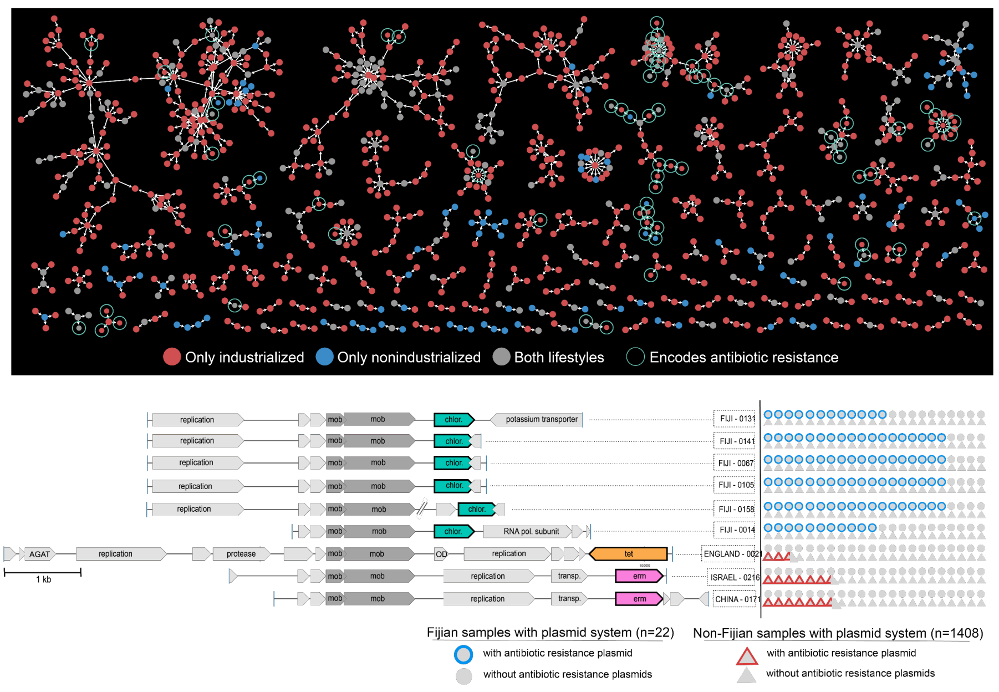

This page serves **public (and often reproducible) data items that underlie key findings in our publications**.

If you would like to interactively explore any of the data items, you may need to install [anvi'o](https://merenlab.org/software/anvio/) or use it via our [Docker containers](https://hub.docker.com/r/meren/anvio/tags?page=1&ordering=last_updated) without installation. See [anvi'o programs and artifacts](/software/anvio/help/main/) that can be used to further explore reproducible data items below.

Please do not hesitate to get in touch if something is missing. You can send [us](/people/) an e-mail, or find us on Slack:




{:.notice}
Bonus blog post: [Fantastic Data and How to Share Them: A Plea to Journal Editors and Reviewers](/sharing-data/).

## Studying hypervariability in genomes through metagenomes

<div class="pub_float">
<div class="altmetric-embed" data-badge-type="donut" data-doi="10.1186/s13100-022-00262-6" data-uuid="36f28780-8674-c2ed-e790-8b8750eca598"><a target="_self" href="https://www.altmetric.com/details.php?domain=merenlab.org&amp;citation_id=123594737" style="display:inline-block;">
        
</a></div>
<div class="__dimensions_badge_embed__" data-doi="10.1186/s13100-022-00262-6" data-hide-zero-citations="true" data-legend="hover-bottom" data-style="small_circle"></div>
    <span class="pub-title"><a href="https://doi.org/10.1186/s13100-022-00262-6" target="_new">Eco-evolutionary significance of domesticated retroelements in microbial genomes</a></span>
    <span class="pub-authors">Paul BG, <span class="pub-member-author">Eren AM</span></span>
    <div class="pub-info">
    <div class="pub-featured-image">
    <a href="/images/pubs/dgrs-in-metagenomes.png" class="image-popup"></a>
    </div>
    <div class="pub-highlights">
    <span style="display: inline-block; padding-bottom: 5px;">- A short review on retrons and diversity-generating retro elements, some of the most beautiful and mysterious ways for life to beat the boring means of evolution and skip ahead.</span><br><span style="display: inline-block; padding-bottom: 5px;">- Demonstrates a workflow that gives access to the extent intra-population hypervariability of DGRs and their ecology through the analysis of metagenomes.</span><br><span style="display: inline-block; padding-bottom: 5px;">- A complete bioinformatics workflow that uses anvi'o and oligotyping to study DGR activity in metageomes is <a href="https://merenlab.org/tutorials/dgrs-in-metagenomes/" target="_blank">available here</a>.</span>
    </div>
    </div>
    <span class="pub-journal"> 📚 <b>Mobile DNA</b>, 13(6) | 🔍 <a href="http://scholar.google.com/scholar?hl=en&amp;q=Eco-evolutionary+significance+of+domesticated+retroelements+in+microbial+genomes" target="_blank">Google Scholar</a> | 🔗 <a href="https://doi.org/10.1186/s13100-022-00262-6" target="_blank">doi:10.1186/s13100-022-00262-6</a></span>
</div>

### Reproducible bioinformatics workflow

[https://merenlab.org/tutorials/dgrs-in-metagenomes/](/tutorials/dgrs-in-metagenomes) gives access to our **bioinformatics workflow**.


## High molecular weight DNA extraction protocols

<div class="pub_float">
<div class="altmetric-embed" data-badge-type="donut" data-doi="10.1111/1755-0998.13588"></div>
<div class="__dimensions_badge_embed__" data-doi="10.1111/1755-0998.13588" data-hide-zero-citations="true" data-legend="hover-bottom" data-style="small_circle"></div>
    <span class="pub-title"><a href="https://doi.org/10.1111/1755-0998.13588" target="_new">High molecular weight DNA extraction strategies for long-read sequencing of complex metagenomes</a></span>
    <span class="pub-authors"><span class="pub-member-author">Trigodet F</span>, <span class="pub-member-author">Lolans K</span>, Fogarty E, <span class="pub-member-author">Shaiber A</span>, Morrison HG, Barreiro L, Jabri B, <span class="pub-member-author">Eren AM</span></span>
    <div class="pub-info">
    <div class="pub-featured-image">
    <a href="/images/pubs/Trigodet_and_Lolans_et_al_HMW.png"></a>
    </div>
    <div class="pub-highlights">
    <span style="display: inline-block; padding-bottom: 5px;">- A study that <b>benchmarks six high molecular weight DNA extraction strategies</b> (commercially available kits, phenol-chloroform extraction, and agarose encasement followed by agarase digestion) <b>for long-read sequencing of metagenomes</b> with MinION.</span><br /><span style="display: inline-block; padding-bottom: 5px;">- It turns out the protocol that works best for sequencing DNA from microbial isolates may not be the most effetive method for long-read sequencing of metagenomes ¯\_(ツ)_/¯</span><br /><span style="display: inline-block; padding-bottom: 5px;">- A reproducible <b>bioinformatics workflow</b> is available <a href="https://merenlab.org/data/hmw-dna-extraction-strategies/" target="_blank">here</a>. Detailed <b>lab protocols</b> for HMW DNA extraction methods mentioned in the study are <a href="https://merenlab.org/data/hmw-dna-extraction-strategies/protocol/" target="_blank">here</a>.</span>
    </div>
    </div>
    <span class="pub-journal"> 📚 <b>Molecular Ecology Resources</b>, 22(5):1786-1802 | 🔍 <a href="http://scholar.google.com/scholar?hl=en&amp;q=High+molecular+weight+DNA+extraction+strategies+for+long-read+sequencing+of+complex+metagenomes" target="_blank">Google Scholar</a> | 🔗 <a href="https://doi.org/10.1111/1755-0998.13588" target="_blank">doi:10.1111/1755-0998.13588</a></span>
</div>

### Reproducible bioinformatics workflow

[https://merenlab.org/data/hmw-dna-extraction-strategies/](hmw-dna-extraction-strategies) gives access to our **bioinformatics workflow**.


### Detailed lab protocol

[https://merenlab.org/data/hmw-dna-extraction-strategies/protocol/](hmw-dna-extraction-strategies/protocol) gives access to detailed **lab protocols**.

### Raw and/or reproducible data items

* [PRJNA703035](https://www.ncbi.nlm.nih.gov/bioproject/?term=PRJNA703035): The **raw sequencing data**.
* [doi:10.6084/m9.figshare.14141228](https://figshare.com/articles/dataset/Assembled_minION_long-reads/14141228): Data products that give reproducible access to **anvi’o contigs databases for assembled long-read sequences**.
* [doi:10.6084/m9.figshare.14141414](https://figshare.com/articles/dataset/Unassembled_minION_long-reads/14141414): Data products that give reproducible access to **anvi’o contigs databases for unassembled long-read sequences**.
* [doi:10.6084/m9.figshare.14141819](https://figshare.com/articles/dataset/Assembled_Illumina_Short_Reads/14141819): Data products that give reproducible access to **anvi’o contigs databases for assembled shotgun metagenomes**.
* [doi:10.6084/m9.figshare.14141918](https://figshare.com/articles/dataset/Supplementary_Tables_and_Figures/14141918): Supplementary Tables and Figures


## The genetic and ecological landscape of plasmids in the human gut

<div class="pub_float">
<div class="altmetric-embed" data-badge-type="donut" data-doi="10.1101/2020.11.01.361691"></div>
<div class="__dimensions_badge_embed__" data-doi="10.1101/2020.11.01.361691" data-hide-zero-citations="true" data-legend="hover-bottom" data-style="small_circle"></div>
    <span class="pub-title"><a href=" https://doi.org/10.1101/2020.11.01.361691" target="_new">The genetic and ecological landscape of plasmids in the human gut</a></span>
    <span class="pub-authors"><span class="pub-member-author">Yu MK<sup>☯</sup></span>, <span class="pub-member-author">Fogarty EC<sup>☯</sup></span>, <span class="pub-member-author">Eren AM</span></span>
    <span class="pub-co-first-authors"><sup>☯</sup>Co-first authors</span>
    <div class="pub-info">
    <div class="pub-featured-image">
    <a href="../images/pubs/plasmid_systems.png"></a>
    </div>
    <div class="pub-highlights">
    <span style="display: inline-block; padding-bottom: 5px;">- A study that aims to shed light on <b>the ecology and evolution of one of the most critical yet poorly studied aspects of microbial life: naturally occurring plasmids</b>.</span><br /><span style="display: inline-block; padding-bottom: 5px;">- Uses state-of-the-art machine learning strategies to identify <b>over 60,000 plasmids</b> from human gut metagenomes, which represents a <b>200-fold increase</b> in the number of known plasmids to date that were detectable in healthy humans.</span><br /><span style="display: inline-block; padding-bottom: 5px;">-  Defines hundreds of '<b>plasmid systems</b>', and demonstrates that naturally occurring plasmids are not static entities, but <b>their evolution is driven by the need to respond to the environment, and their ecology cannot be simply explained by bacterial taxonomy and distribution patterns of their putative hosts</b>.</span>
    </div>
    </div>
    <span class="pub-journal"><b>bioRxiv</b> <a href="https://doi.org/10.1101/2020.11.01.361691" target="_blank">🔗</a></span>
</div>

### Raw and/or reproducible data items

* [doi:10.5281/zenodo.5732024](https://doi.org/10.5281/zenodo.5732024) gives access to reference plasmids and chromosomes used for training as well as the annotations of genes that are identified in them.
* [doi:10.5281/zenodo.5732447](https://doi.org/10.5281/zenodo.5732447) gives access to the PlasX model, data for known as well as predicted plasmids, plasmid systems, and other key intermediate data files such as plasmid pairwise alignments and MMSeqs clusters.
* [doi:10.5281/zenodo.5730607](https://doi.org/10.5281/zenodo.5730607) serves information on all metagenomes used in our study to predict plasmids, including assembled contigs per metagenome as well as estimated abundances of taxa in them.
* [doi:10.5281/zenodo.5730987](https://doi.org/10.5281/zenodo.5730987) serves every gene call in contigs from publicly available gut metagenomes we used. Annotations of these genes based on COGs, PFAM domains, and MMseqs clusters are also available at [doi:10.5281/zenodo.5731658](https://doi.org/10.5281/zenodo.5731658).
* We deposited the long- and short-read sequencing data from __Bacteroides fragilis__ isolates under the NCBI BioProject [PRJNA782184](https://www.ncbi.nlm.nih.gov/bioproject/?term=PRJNA782184).
* The source code for PlasX, the machine learning algorithm to perform plasmid prediction is available through its GitHub repository [here](https://github.com/michaelkyu/plasx), and the source code for MobMess, the software tool for mobile element seqeuence dereplication is availble through its GitHub repository [here](https://github.com/michaelkyu/mobmess).


## Metabolic competency of gut microbes in health and disease

<div class="pub_float">
<div class="altmetric-embed" data-badge-type="donut" data-doi="10.1101/2021.03.02.433653"></div>
<div class="__dimensions_badge_embed__" data-doi="10.1101/2021.03.02.433653" data-hide-zero-citations="true" data-legend="hover-bottom" data-style="small_circle"></div>
    <span class="pub-title"><a href=" https://doi.org/10.1101/2021.03.02.433653" target="_new">Adaptive ecological processes and metabolic independence drive microbial colonization and resilience in the human gut</a></span>
    <span class="pub-authors"><span class="pub-member-author">Watson AR</span>, Füssel J, <span class="pub-member-author">Veseli I</span>, DeLongchamp JZ, Silva M, <span class="pub-member-author">Trigodet F</span>, <span class="pub-member-author">Lolans K</span>, <span class="pub-member-author">Shaiber A</span>, <span class="pub-member-author">Fogarty EC</span>, Quince C, Yu MK, Söylev A, Morrison HG, Lee ST, Rubin DT, Jabri B, Louie T, <span class="pub-member-author">Eren AM</span></span>
    <div class="pub-info">
    <div class="pub-featured-image">
    <a href="/images/pubs/watson_et_al_fmt.jpeg"></a>
    </div>
    <div class="pub-highlights">
    <span style="display: inline-block; padding-bottom: 5px;">- A Fecal Microbiota Transplantation (FMT) study that reveals unexpected parallels between the <b>adaptive ecological processes</b> that shape the recipient gut <b>microbial composition after FMT</b> and those that influence <b>microbial diversity in patients with Inflammatory Bowel Disease (IBD)</b>.</span><br /><span style="display: inline-block; padding-bottom: 5px;">- Includes an observation that links <b>the presence of superior metabolic competence in bacterial populations to their expansion in IBD</b>.</span><br /><span style="display: inline-block; padding-bottom: 5px;">-  Here is a <a href="https://twitter.com/merenbey/status/1369016402896695298" target="_blank">Twitter thread</a> that explains <b>key points</b> of the study.</span>
    </div>
    </div>
    <span class="pub-journal"><b>bioRxiv</b> <a href="https://doi.org/10.1101/2021.03.02.433653" target="_blank">🔗</a></span>
</div>

### Reproducible bioinformatics workflow

[https://merenlab.org/data/fmt-gut-colonization](fmt-gut-colonization) gives access to our **bioinformatics workflow**.

### Raw and/or reproducible data items

* We deposited the **raw sequencing data for donor and recipient metagenomes** under the NCBI BioProject [PRJNA701961](https://www.ncbi.nlm.nih.gov/bioproject/?term=prjna701961) (see Supplementary Table 1 for accession numbers and the details of each sample).
* [doi:10.6084/m9.figshare.14331236](https://doi.org/10.6084/m9.figshare.14331236): Data products that give reproducible access to **donor and recipient metagenomes, metagenome-assembled genomes, and read recruitment results**.
* [doi:10.6084/m9.figshare.14225840](https://doi.org/10.6084/m9.figshare.14225840): Data products that give reproducible access to **genomes and their metabolic potential** we have used to investigatie metabolic competence among microbes from healthy individuals and individuals with IBD.
* [doi:10.6084/m9.figshare.14138405](https://doi.org/10.6084/m9.figshare.14138405): Supplementary Tables.


## Niche partitioning in the human oral cavity

<div class="pub_float">
<div class="altmetric-embed" data-badge-type="donut" data-doi="10.1186/s13059-020-02195-w"></div>
<div class="__dimensions_badge_embed__" data-doi="10.1186/s13059-020-02195-w" data-hide-zero-citations="true" data-legend="hover-bottom" data-style="small_circle"></div>
    <span class="pub-title"><a href=" https://doi.org/10.1186/s13059-020-02195-w" target="_new">Functional and genetic markers of niche partitioning among enigmatic members of the human oral microbiome</a></span>
    <span class="pub-authors"><span class="pub-member-author">Shaiber A</span>, Willis AD, <span class="pub-member-author">Delmont TO</span>, Roux S, Chen L, <span class="pub-member-author">Schmid AC</span>, <span class="pub-member-author">Yousef M</span>, <span class="pub-member-author">Watson AR</span>, <span class="pub-member-author">Lolans K</span>, <span class="pub-member-author">Esen ÖC</span>, <span class="pub-member-author">Lee STM</span>, Downey N, Morrison HG, Dewhirst FE, Mark Welch JL<sup>‡</sup>, <span class="pub-member-author">Eren AM<sup>‡</sup></span></span>
    <span class="pub-co-first-authors"><sup>‡</sup>Co-senior authors</span>
    <div class="pub-info">
    <div class="pub-featured-image">
    <a href="/images/pubs/shaiber_et_al_tm7_phylogenomics.png"></a>
    </div>
    <div class="pub-highlights">
    <span style="display: inline-block; padding-bottom: 5px;">- A multi-omics study that combines <b>genome-resolved metagenomics</b>, <b>pangenomics</b>, <b>phylogenomics</b>, and <b>microbial population genetics</b> to investigate the ecology and evolution of Saccharibacteria (TM7) in the human oral cavity, and offers a formal description of '<b>functional enrichment</b>' statistic for phylogenomics and pangenomics.</span><br /><span style="display: inline-block; padding-bottom: 5px;">-  Demonstrates that TM7s split into tongue specialists and plaque specialists, and plaque TM7s group with environmental TM7s, leading to an hypothesis that <b>the dental plaque may have served as a stepping stone for environmental microbes to adapt to host environments</b> at least for some clades of microbes</span><br /><span style="display: inline-block; padding-bottom: 5px;">-  "<a href="https://www.eurekalert.org/pub_releases/2020-12/uocm-mid121420.php" target="_blank">Microbes in dental plaque look more like relatives in soil than those on the tongue</a>", EurekAlert.</span><br /><span style="display: inline-block; padding-bottom: 5px;">-  <a href="https://static-content.springer.com/esm/art%3A10.1186%2Fs13059-020-02195-w/MediaObjects/13059_2020_2195_MOESM13_ESM.docx" target="_blank">Anonymous reviewer comments and responses</a>.</span>
    </div>
    </div>
    <span class="pub-journal"><b>Genome Biology</b>, 21:292.</span>
</div>

### Raw and/or reproducible data items

* We deposited the short-read **sequencing data for amplicons and shotgun metagenomes** as well as **key MAGs** that emerged from our study under the NCBI BioProject [PRJNA625082](https://www.ncbi.nlm.nih.gov/bioproject/?term=prjna625082). The Supplementary Table 1 of our study lists accession numbers for each sample individually.
* We deposited the **long-read sequencing data** in the NCBI’s SRA database for individuals C-F ([SRR11547007](https://www.ncbi.nlm.nih.gov/sra/?term=SRR11547007)), C-M ([SRR11547005](https://www.ncbi.nlm.nih.gov/sra/?term=SRR11547005), [SRR11547006](https://www.ncbi.nlm.nih.gov/sra/?term=SRR11547006)), and L ([SRR11547004](https://www.ncbi.nlm.nih.gov/sra/?term=SRR11547004)).
* [doi:10.6084/m9.figshare.12217799](https://doi.org/10.6084/m9.figshare.12217799): FASTA files for **co-assembled metagenomes** per individial.
* [doi:10.6084/m9.figshare.12217805](https://doi.org/10.6084/m9.figshare.12217805): Anvi’o **split profiles** for each of the 790 MAGs.
* [doi:10.6084/m9.figshare.12217811](https://doi.org/10.6084/m9.figshare.12217811): The **TM7 pangenome**.
* [doi:10.6084/m9.figshare.11634321](https://doi.org/10.6084/m9.figshare.11634321): Supplementary Tables, Supplementary Figures, and the Supplementary Information file.


## Accurate and complete genomes from metagenomes

<div class="pub_float">
<div class="altmetric-embed" data-badge-type="donut" data-doi="10.1101/gr.258640.119"></div>
<div class="__dimensions_badge_embed__" data-doi="10.1101/gr.258640.119" data-hide-zero-citations="true" data-legend="hover-bottom" data-style="small_circle"></div>
    <span class="pub-title"><a href=" https://doi.org/10.1101/gr.258640.119" target="_new">Accurate and complete genomes from metagenomes</a></span>
    <span class="pub-authors">Chen L, Anantharaman K, <span class="pub-member-author">Shaiber A</span>, <span class="pub-member-author">Eren AM</span>, Banfield JF</span>
    <div class="pub-info">
    <div class="pub-featured-image">
    <a href="../images/pubs/chen_accurate_genomes.png"></a>
    </div>
    <div class="pub-highlights">
    <span style="display: inline-block; padding-bottom: 5px;">- A <b>review on genome-resolved metagenomics</b> that discusses the importance of using assembly and careful binning strategies to study metagenomes.</span><br /><span style="display: inline-block; padding-bottom: 5px;">-  Case studies include a demonstration of how <b>single-copy core genes can fail to predict the quality of metagenome-assembled genomes</b>, and <b>automated strategies that yield tens of thousands of metagenome-assembled genomes will include extensive contamination</b>.</span><br /><span style="display: inline-block; padding-bottom: 5px;">-  Promotes approaches to reconstruct <b>'complete' genomes from metagenomes</b> and the use of <b>GC skew as a metric for checking genome correctness</b>.</span><br /><span style="display: inline-block; padding-bottom: 5px;">-  Tutorial on <a href="https://ggkbase-help.berkeley.edu/genome_curation/scaffold-extension-and-gap-closing/" target="_blank">scaffold extension and gap closing</a>, reproducible workflow for <a href="http://merenlab.org/data/parcubacterium-in-hbcfdna/" target="_blank">binning and phylogenomics of a Parcubacterium genome from human blood metagenomes</a>.</span>
    </div>
    </div>
    <span class="pub-journal"><b>Genome Research</b>, 30(3):315-333.</span>
</div>

### Reproducible bioinformatics workflow

[http://merenlab.org/data/parcubacterium-in-hbcfdna/](parcubacterium-in-hbcfdna) gives access to the bioinformatics workflow that details the reconstruction of a CPR genome from human blood cell-free DNA metagenomes, and it phylogenomic placement.

[https://ggkbase-help.berkeley.edu/genome_curation/scaffold-extension-and-gap-closing/](https://ggkbase-help.berkeley.edu/genome_curation/scaffold-extension-and-gap-closing/) gives access to a step-by-step procedure for scaffold extension and gap closing to dramatically improve the quality of metagenome-assembled genomes (MAGs).

## Population Genetics of SAR11 through SAAVs

<div class="pub_float">
<div class="altmetric-embed" data-badge-type="donut" data-doi="10.7554/eLife.46497"></div>
<div class="__dimensions_badge_embed__" data-doi="10.7554/eLife.46497" data-hide-zero-citations="true" data-legend="hover-bottom" data-style="small_circle"></div>
    <span class="pub-title"><a href=" https://doi.org/10.7554/eLife.46497" target="_new">Single-amino acid variants reveal evolutionary processes that shape the biogeography of a global SAR11 subclade.</a></span>
    <span class="pub-authors"><span class="pub-member-author">Delmont, T. O.</span>, <span class="pub-member-author">Kiefl, E.</span>, Kilinc, O., <span class="pub-member-author">Esen, Ö. C.</span>, Uysal, I., Rappé, M. S., Giovannoni, S., and <span class="pub-member-author">Eren, A. M</span>.</span>
    <div class="pub-info">
    <div class="pub-featured-image">
    <a href="http://i.imgur.com/HrlXPOF.jpg"></a>
    </div>
    <div class="pub-highlights">
    <span style="display: inline-block; padding-bottom: 5px;">- A study that introduces <a href="http://merenlab.org/2015/07/20/analyzing-variability/#an-intro-to-single-nucleotidecodonamino-acid-variation" target="_blank">'single-amino acid variants'</a> (SAAVs) and demonstrates <b>the use of SAAVs to tease apart evolutionary processes that shape the biogeography and genomic heterogeneity within a SAR11 population</b> through metagenomics.</span><br /><span style="display: inline-block; padding-bottom: 5px;">-  A first attempt to link population genetics and the predicted protein structures to explore <i>in silico</i> <b>the intersection beetween protein biochemistry and evolutionary processes</b> acting on an environmental microbe.</span><br /><span style="display: inline-block; padding-bottom: 5px;">-  An application of <a href="https://peerj.com/articles/4320/" target="_blank">metapangenomics</a> to define <b>subclades of SAR11 based on gene content and ecology</b>.</span><br /><span style="display: inline-block; padding-bottom: 5px;">-  Reproducible bioinformatics workflow is <a href="http://merenlab.org/data/sar11-saavs/" target="_blank">here</a>. <a href="https://doi.org/10.7554/eLife.46497.040" target="_blank">Reviewer criticism</a> and <a href="https://doi.org/10.7554/eLife.46497.041" target="_blank">our responses</a> are also available.</span>
    </div>
    </div>
    <span class="pub-journal"><i>eLife</i>. <b>8:e46497</b></span>
</div>

### Reproducible bioinformatics workflow

[http://merenlab.org/data/sar11-saavs](sar11-saavs) gives access to our **complete bioinformatics workflow**.

### Raw and/or reproducible data items

* [doi:10.5281/zenodo.835218](https://doi.org/10.5281/zenodo.835218) Reproducible data items that quantify read recruitment of SAR11 isolates across surface ocean metagenomes.
* [doi:10.6084/m9.figshare.5248453](https://doi.org/10.6084/m9.figshare.5248453): Static HTML output that shows the distribution of SAR11 isolates across surface ocean metagenomes.
* [doi:10.6084/m9.figshare.5248459](https://doi.org/10.6084/m9.figshare.5248459): The reproducible SAR11 metapangenome.
* [doi:10.6084/m9.figshare.5248435](https://doi.org/10.6084/m9.figshare.5248435): Self-contained anvi’o profile for HIMB83 across all metagenomes.
* [doi:10.6084/m9.figshare.5248447](https://doi.org/10.6084/m9.figshare.5248447): Single-nucleotide variants of HIMB83 across metagenomes.
* [doi:10.5281/zenodo.835218](https://doi.org/10.5281/zenodo.835218): SAR11 single-amino acid variants on predicted protein structures.


## Refining Metagenome-Assembled Genomes

<div class="pub_float">
<div class='altmetric-embed' data-badge-type='donut' data-doi="10.1128/mBio.00725-19"></div>
<div class="__dimensions_badge_embed__" data-doi="10.1128/mBio.00725-19" data-hide-zero-citations="true" data-legend="hover-bottom" data-style="small_circle"></div>
    <span class="pub-title"><a href=" https://doi.org/10.1128/mBio.00725-19" target="_new">Composite metagenome-assembled genomes reduce the quality of public genome repositories.</a></span>
    <span class="pub-authors"><span class="pub-member-author">Shaiber, A.</span>, and <span class="pub-member-author">Eren, A. M</span>.</span>
    <div class="pub-info">
    <div class="pub-featured-image">
    <a href="../images/pubs/shaiber_eren_MAG_refinement.png"></a>
    </div>
    <div class="pub-highlights">
    <span style="display: inline-block; padding-bottom: 5px;">- A letter that stresses that the composite metagenome-assembled genomes influence phylogenomic, pangenomic, and ecological insights (<a href="../files/Shaiber_Eren_2019_reviewer_response.pdf" target="_blank">peer reviews and responses</a>).</span><br><span style="display: inline-block; padding-bottom: 5px;">-  <a href="http://merenlab.org/data/refining-mags/" target="_blank">A reproducible workflow</a> to detail the steps of genome refinement and make available the refined versions of some key genomes.</span>
    </div>
    </div>
    <span class="pub-journal"><i>mBio</i>. <b>10(3) e00725-19</b></span>
</div>

### Reproducible bioinformatics workflow

[http://merenlab.org/data/refining-espinoza-mags](refining-espinoza-mags) gives access to our **complete bioinformatics workflow**.

## A multi'omics <i>Spiroplasma</i> analysis

<div class="pub_float">
<div class="altmetric-embed" data-badge-type="donut" data-doi="10.7717/peerj.7548"></div>
<div class="__dimensions_badge_embed__" data-doi="10.7717/peerj.7548" data-hide-zero-citations="true" data-legend="hover-bottom" data-style="small_circle"></div>
    <span class="pub-title"><a href=" https://doi.org/10.7717/peerj.7548" target="_new">Genome-resolved insights into a novel Spiroplasma symbiont of the Wheat Stem Sawfly.</a></span>
    <span class="pub-authors">Yeoman, C. J., Brutscher, L. M., <span class="pub-member-author">Esen, Ö. C.</span>, Ibaoglu, F., Fowler, C., <span class="pub-member-author">Eren, A. M</span>., Wanner, K., and Weaver, D. K.</span>
    <div class="pub-info">
    <div class="pub-featured-image">
    <a href="../images/pubs/spiroplasma-pangenome.png"></a>
    </div>
    <div class="pub-highlights">
    <span style="display: inline-block; padding-bottom: 5px;">- A study that uses (1) <b>genome-resolved metagenomics</b> to reconstruct a population genome from fly metagenomes that resolves to the genus <a href="https://en.wikipedia.org/wiki/Spiroplasma" target="_blank"><i>Spiroplasma</i></a>, (2) <b>pangenomics</b> to put this genome in the context of other <i>Spiroplasma</i> genomes, (3) <b>phylogenomics</b> to infer ancestral relationships between <i>Spiroplasma</i> genomes, and (4) includes an ANI-based distance estimation between all genomes for comprehensive reporting.</span><br /><span style="display: inline-block; padding-bottom: 5px;">-  It is a particularly good example that demonstrates how pangenomics can reveal appropriate targets for high-resolution phylogenomics.</span><br /><span style="display: inline-block; padding-bottom: 5px;">-  A fully reproducible bioinformatics workflow for this multi'omics analysis is <a href="http://merenlab.org/data/spiroplasma-pangenome/" target="_blank">here</a>. Anvi'o databases to interactively reproduce and explore the Spiroplasma pangenome is also <a href="http://doi.org/10.6084/m9.figshare.8201852" target="_blank">available</a>.</span>
    </div>
    </div>
    <span class="pub-journal"><i>PeerJ</i>. <b>7:e7548</b></span>
</div>

### Reproducible bioinformatics workflow

[http://merenlab.org/data/spiroplasma-pangenome/](spiroplasma-pangenome) gives access to the **complete bioinformatics workflow** we used in this study.


## A <i>Wolbachia</i> Plasmid

<div class="pub_float">
<div class="altmetric-embed" data-badge-type="donut" data-doi="10.1038/s41467-019-08973-w"></div>
<div class="__dimensions_badge_embed__" data-doi="10.1038/s41467-019-08973-w" data-hide-zero-citations="true" data-legend="hover-bottom" data-style="small_circle"></div>
    <span class="pub-title"><a href=" https://doi.org/10.1038/s41467-019-08973-w" target="_new">The <i>Wolbachia</i> mobilome in <i>Culex pipiens</i> includes a putative plasmid.</a></span>
    <span class="pub-authors">Reveillaud, R., Bordenstein, S. R., Cruaud, C., <span class="pub-member-author">Shaiber, A.</span>, <span class="pub-member-author">Esen, Ö. C.</span>, O. C., Weill, M., Makoundou, P., <span class="pub-member-author">Lolans, K.</span>, <span class="pub-member-author">Watson, A. R.</span>, Rakotoarivony, I., Bordenstein, S. R., and <span class="pub-member-author">Eren, A. M</span>.</span>
    <div class="pub-info">
    <div class="pub-featured-image">
    <a href="../images/miscellaneous/2019-03-05-wolbachia-plasmid/minion-metagenomics.png"></a>
    </div>
    <div class="pub-highlights">
    <span style="display: inline-block; padding-bottom: 5px;">- The first report of a <i>Wolbachia</i> plasmid through genome-resolved metagenomics on microsurgically removed individual mosquito ovary samples (<a href="https://static-content.springer.com/esm/art%3A10.1038%2Fs41467-019-08973-w/MediaObjects/41467_2019_8973_MOESM2_ESM.pdf">peer reviews and responses</a>).</span><br /><span style="display: inline-block; padding-bottom: 5px;">-  Yet another application of <a href="https://doi.org/10.7717/peerj.4320">metapangenomics</a> and an applicatoin of minION long-read sequencing on extremely low-biomass samples.</span><br /><span style="display: inline-block; padding-bottom: 5px;">-  <a href="http://merenlab.org/data/wolbachia-plasmid">Reproducible bioinformatics workflow</a> with all data items, and a 'behind the paper' <a href="http://merenlab.org/2019/03/05/wolbachia-plasmid/">blog post</a> by <a href="https://twitter.com/JulieReve">Julie Reveillaud</a>.</span>
    </div>
    </div>
    <span class="pub-journal"><i>Nature Communications</i>. <b>10:1051</b></span>
</div>

### Reproducible bioinformatics workflow

[http://merenlab.org/data/wolbachia-plasmid](wolbachia-plasmid) gives access to our **complete bioinformatics workflow**.

### Raw and/or reproducible data items

* The raw sequencing data for shotgun metagenomes are available in the European Nucleotide Archive via accession code [PRJEB26028](https://www.ebi.ac.uk/ena/data/search?query=PRJEB26028).
* [doi:10.6084/m9.figshare.7306784](https://doi.org/10.6084/m9.figshare.7306784): Raw sequencing data for the MinION run for *Wolbachia* ovary samples.
* [doi:10.6084/m9.figshare.6263867](https://doi.org/10.6084/m9.figshare.6263867): FASTA files for individual assemblies of each ovary metagenome.
* [doi:10.6084/m9.figshare.6292040](https://doi.org/10.6084/m9.figshare.6292040): The four metagenome-assembled *Wolbachia* genomes.
* [doi:10.6084/m9.figshare.6380015](https://doi.org/10.6084/m9.figshare.6380015): Artificially circularized individual sequences for the plasmid *p*WCP.
* [doi:10.6084/m9.figshare.6263876](https://doi.org/10.6084/m9.figshare.6263876): The anvi’o merged profile databases for each *Culex pipiens* metagenome.
* [doi:10.6084/m9.figshare.6291650](https://doi.org/10.6084/m9.figshare.6291650): The anvi'o pan database and the genomes storage for the *Wolbachia* metapangenome. 


## The <i>Prochlorococcus</i> Metapangenome

<div class="pub_float">
<div class='altmetric-embed' data-badge-type='donut' data-doi="10.7717/peerj.4320"></div>
<div class="__dimensions_badge_embed__" data-doi="10.7717/peerj.4320" data-hide-zero-citations="true" data-legend="hover-bottom" data-style="small_circle"></div>
    <span class="pub-title"><a href=" https://doi.org/10.7717/peerj.4320" target="_new">Linking pangenomes and metagenomes: the <i>Prochlorococcus</i> metapangenome.</a></span>
    <span class="pub-authors"><span class="pub-member-author">Delmont, T. O.</span>, and <span class="pub-member-author">Eren, A. M</span>.</span>
    <div class="pub-info">
    <div class="pub-featured-image">
    <a href="https://i.imgur.com/gzDpEU5.jpg"></a>
    </div>
    <div class="pub-highlights">
    <span style="display: inline-block; padding-bottom: 5px;">- A big-data study in which a pangenome of 31 <i>Prochlorococcus</i> isolates meets 31 billion Tara Oceans metagenomic sequences (<a href="https://peerj.com/articles/4320/reviews/">Peer-review history</a>).</span><br><span style="display: inline-block; padding-bottom: 5px;">-  Metapangenomes reveal to what extent genes that may be linked to the ecology and fitness of microbes are conserved within a phylogenetic clade.</span><br><span style="display: inline-block; padding-bottom: 5px;">-  <a href="http://merenlab.org/data/2018_Delmont_and_Eren_Metapangenomics/" target="_blank">Reproducible bioinformatics workflow</a>.</span>
    </div>
    </div>
    <span class="pub-journal"><i>PeerJ</i>. <b>6:e4320</b></span>
</div>

### Reproducible bioinformatics workflow

[http://merenlab.org/data/prochlorococcus-metapangenome](prochlorococcus-metapangenome) gives access to our **complete bioinformatics workflow**.

### Raw and/or reproducible data items

* The original **TARA Oceans metagenomes** are available through the European Bioinformatics Institute ([ERP001736](https://www.ebi.ac.uk/metagenomics/projects/ERP001736)) and NCBI ([PRJEB1787](https://www.ncbi.nlm.nih.gov/sra/?term=PRJEB1787)).
* [doi:10.6084/m9.figshare.5447221](https://doi.org/10.6084/m9.figshare.5447221): 31 isolate genomes and 74 single-amplified genomes for *Prochlorococcus* we used in this study.
* [doi:10.6084/m9.figshare.5447224](https://doi.org/10.6084/m9.figshare.5447224): The anvi’o merged profile database and the static HTML summary output for *Prochlorococcus* isolate genomes across 93 TARA Oceans Project surface ocean metagenomes.
* [doi:10.6084/m9.figshare.5447227](https://doi.org/10.6084/m9.figshare.5447227): The metapangenome of *Prochlorococcus* isolates.
* [doi:10.6084/m9.figshare.5447233](https://doi.org/10.6084/m9.figshare.5447233): The metapangenome of *Prochlorococcus* single-amplified genomes.
* [doi:10.6084/m9.figshare.5447233](https://doi.org/10.6084/m9.figshare.5447233): Extended pangenome of *Prochlorococcus* isolate and single-amplified genomes.


## Genomes from Tara Oceans Metagenomes

<div class="pub_float">
<div class='altmetric-embed' data-badge-type='donut' data-doi="10.1038/s41564-018-0176-9"></div>
<div class="__dimensions_badge_embed__" data-doi="10.1038/s41564-018-0176-9" data-hide-zero-citations="true" data-legend="hover-bottom" data-style="small_circle"></div>
    <span class="pub-title"><a href=" https://doi.org/10.1038/s41564-018-0176-9" target="_new">Nitrogen-fixing populations of Planctomycetes and Proteobacteria are abundant in the surface ocean metagenomes.</a></span>
    <span class="pub-authors"><span class="pub-member-author">Delmont, T. O.</span>, Quince, C., <span class="pub-member-author">Shaiber, A.</span>, <span class="pub-member-author">Esen, Ö. C.</span>, <span class="pub-member-author">Lee, S. T. M.</span>, Rappé, M. S., McLellan, S. L., Lücker, S., and <span class="pub-member-author">Eren, A. M</span>.</span>
    <div class="pub-info">
    <div class="pub-featured-image">
    <a href="http://i.imgur.com/oFRefc4.jpg"></a>
    </div>
    <div class="pub-highlights">
    <span style="display: inline-block; padding-bottom: 5px;">- First genomic evidence for abundant and widespread non-cyanobacterial nitrogen-fixing populations in the surface ocean.</span><br><span style="display: inline-block; padding-bottom: 5px;">-  Nearly 1,000 non-redundant, high-quality bacterial, archaeal, and eukaryotic population genomes from TARA Oceans metagenomes.</span><br><span style="display: inline-block; padding-bottom: 5px;">-  A "behind the paper" <a href="https://naturemicrobiologycommunity.nature.com/users/113363-a-murat-eren-meren/posts/34040-microbiologists-vs-shotgun-metagenomes-surface-ocean" target="_blank">blog post</a> by Meren, a <a href="http://www.mbl.edu/blog/large-scale-study-indicates-novel-and-abundant-nitrogen-fixing-microbes-in-the-surface-ocean/" target="_blank">press release</a> by the MBL, and an extensive description of <a href="http://merenlab.org/data/tara-oceans-mags/" target="_blank">the bioinformatics workflow</a>.</span>
    </div>
    </div>
    <span class="pub-journal"><i>Nature Microbiology</i>. <b>3:804–813</b></span>
</div>

### Reproducible bioinformatics workflow

[http://merenlab.org/data/tara-oceans-mags](tara-oceans-mags/) gives access to our **complete bioinformatics workflow**.

### Raw and/or reproducible data items

* The original **TARA Oceans metagenomes** are available through the European Bioinformatics Institute ([ERP001736](https://www.ebi.ac.uk/metagenomics/projects/ERP001736)) and NCBI ([PRJEB1787](https://www.ncbi.nlm.nih.gov/sra/?term=PRJEB1787)).
* [doi:10.6084/m9.figshare.4902920](https://doi.org/10.6084/m9.figshare.4902920): Our **raw assembly** outputs per region.
* [doi:10.6084/m9.figshare.4902917](https://doi.org/10.6084/m9.figshare.4902917): All **amino acid sequences** in our raw assemblies.
* [doi:10.6084/m9.figshare.4902923](https://doi.org/10.6084/m9.figshare.4902923): **FASTA files** for 957 non-redundant metagenome-assembled genomes.
* [doi:10.6084/m9.figshare.4902941](https://doi.org/10.6084/m9.figshare.4902941): **Self contained anvi'o profiles** for each non-redundant MAG (each of which can be visualized interactively through the program `anvi-interactive` offline).
* [doi:10.6084/m9.figshare.4902926](https://doi.org/10.6084/m9.figshare.4902926): A **static HTML output** for the anvi'o merged profile database for non-redundant MAGs (double-click the index.html file after download).
* [doi:10.6084/m9.figshare.4902938](https://doi.org/10.6084/m9.figshare.4902938): Main and Supplementary Tables and Figures. Which includes **Figure 1** (geographically bounded metagenomic co-assemblies), **Figure 2** (the nexus between phylogeny and function of HBDs), **Figure 3** (Phylogeny of nitrogen fixation genes), **Figure 4** (the abundance of nitrogen-fixing populations of Planctomycetes and Proteobacteria across oceans), **Supplementary Figure 1** (phylogenetic analysis of nifH genes), **Supplementary Table 1** (the summary of the 93 metagenomes from TARA Oceans, and the twelve geographic regions they represent), **Supplementary Table 2** (the summary of the co-assembly and binning outputs for each metagenomic set), **Supplementary Table 3** (genomic features of 957 MAGs from the non-redundant genomic database including the taxonomy for each MAG, the mean coverage, relative distribution, detection and number of recruited reads for each MAG across the 93 metagenomes, etc), **Supplementary Table 4** (the 16S rRNA gene sequence identified in HBD-09), **Supplementary Table 5** (genomic features, Pearson correlation (based on the relative distribution in 93 metagenomes), **Supplementary Table 6** (RAST subsystems and KEGG modules for the nine HBDs), **Supplementary Table 7** (nifH gene sequences in MAGs, orphan scaffolds, as well as the reference sequence γ-24774A11, along with their mean coverage across the 93 metagenomes), **Supplementary Table 8** (Genomic features of 30,244 bins manually characterized from the 12 metagenomic sets. Completion and redundancy estimates are based on the average of four bacterial single-copy gene collections), **Supplementary Table 9** (KEGG annotation for 1,077 MAGs), and **Supplementary Table 10** (Relative distribution of 1,077 MAGs across the 93 metagenomes).
* An interactive visualization for the phylogenomic analysis of 432 Proteobacteria and 43 Planctomycetes metagenome-assembled genomes from our database of 957 non-redundant MAGs is also available: [here](https://anvi-server.org/merenlab/tara_hbds).


## Genome-resolved Fecal Microbiota Transplantation

<div class="pub_float">
<div class='altmetric-embed' data-badge-type='donut' data-doi="10.1186/s40168-017-0270-x"></div>
<div class="__dimensions_badge_embed__" data-doi="10.1186/s40168-017-0270-x" data-hide-zero-citations="true" data-legend="hover-bottom" data-style="small_circle"></div>
    <span class="pub-title"><a href=" https://doi.org/10.1186/s40168-017-0270-x" target="_new">Tracking microbial colonization in fecal microbiota transplantation experiments via genome-resolved metagenomics.</a></span>
    <span class="pub-authors"><span class="pub-member-author">Lee, S. T. M.</span>, Kahn, S. A., <span class="pub-member-author">Delmont, T. O.</span>, <span class="pub-member-author">Shaiber, A.</span>, <span class="pub-member-author">Esen, Ö. C.</span>, Hubert, N. A., Morrison, H. G., Antonopoulos, D. A., Rubin, D. T., and <span class="pub-member-author">Eren, A. M</span>.</span>
    <div class="pub-info">
    <div class="pub-featured-image">
    <a href="http://i.imgur.com/4e4Ic4u.jpg"></a>
    </div>
    <div class="pub-highlights">
    <span style="display: inline-block; padding-bottom: 5px;">- An FMT study with metagenome-assembled genomes (see <a href="http://merenlab.org/data/#lee-et-al-2017--fecal-transplants" target="_blank">public data</a>).</span><br><span style="display: inline-block; padding-bottom: 5px;">- Bacteroidales: high-colonization rate. Clostridiales: low colonization rate. Colonization success is negatively correlated with the number of genes related to sporulation.</span><br><span style="display: inline-block; padding-bottom: 5px;">-  MAGs with the same taxonomy showed different colonization properties, highlighting the importance of high-resolution analyses.</span><br><span style="display: inline-block; padding-bottom: 5px;">-  Populations colonized both recipients were also prevalent in the HMP cohort (and the ones that did not, distribute sporadically across the HMP cohort).</span>
    </div>
    </div>
    <span class="pub-journal"><i>Microbiome</i>. <b>5:50</b></span>
</div>

### Raw and/or reproducible data items

* While the accession ID [**SRP093449**](https://www.ncbi.nlm.nih.gov/sra/?term=SRP093449){:target="_blank"} serves serves the raw shotgun metagenomic data through NCBI's Short Read Archive, [this FigShare collection](https://figshare.com/projects/Data_for_the_FMT_study_by_Lee_and_Khan_et_al_2017_/17516){:target="_blank"} gives access to all public data items detailed below.
* [doi:10.6084/m9.figshare.4792633](https://doi.org/10.6084/m9.figshare.4792633){:target="_blank"}: Files for anvi'o manual interactive for a quick visualization of the distribution of 92 donor MAGs from Lee and Khan et al study (**panel a** in the figure above). Follow these steps for a quick interactive visualization:

<div style="margin-left:50px;" markdown="1">
``` bash
# download the file
wget https://ndownloader.figshare.com/files/7879036 -O ANVIO-FMT-D-R01-R02-QUICK-VISUALIZATION.tar.gz

# unpack
tar -zxvf ANVIO-FMT-D-R01-R02-QUICK-VISUALIZATION.tar.gz

# go into the directory
cd ANVIO-FMT-D-R01-R02-QUICK-VISUALIZATION

# run anvi-interacive
anvi-interactive -p profile.db \
                 -s samples.db \
                 -t tree.txt \
                 -d data.txt \
                 --manual \
                 --title "The distribution of 92 donor MAGs"
```
</div>


* [doi:10.6084/m9.figshare.4792627](https://doi.org/10.6084/m9.figshare.4792627){:target="_blank"}: A static HTML output for the anvi'o merged profile database for the 92 donor MAGs. This static web site contains FASTA files for MAGs, coverage and detection values, functional annotations, and other essential information.
* [doi:10.6084/m9.figshare.4792621](https://doi.org/10.6084/m9.figshare.4792621){:target="_blank"}: The full anvi'o merged profile and contigs databases for the 92 donor MAGs (for each MAG gives access to the detailed information shown in **panel b** and **panel c** in the figure above). Among many other things you can do with these anvi'o files, you can use the program `anvi-refine` to study any MAG in the study in detail. MAGs are described in a collection named `MAGs`. Here is a quick example:

<div style="margin-left:50px;" markdown="1">
```bash
# download the merged anvi'o profile for the study
wget https://ndownloader.figshare.com/files/7879024 -O ANVIO-FMT-D-R01-R02-MERGED-PROFILE.tar.gz

# unpack the archive, and get into the directory
tar -zxvf ANVIO-FMT-D-R01-R02-MERGED-PROFILE.tar.gz && cd ANVIO-FMT-D-R01-R02-MERGED-PROFILE

# take a look at the MAGs stored in the profile
anvi-script-get-collection-info -p PROFILE.db -c CONTIGS.db -C MAGs
Auxiliary Data ...............................: Found: CONTIGS.h5 (v. 1)
Contigs DB ...................................: Initialized: CONTIGS.db (v. 8)

Bins in collection "MAGs"
===============================================
FMT-Donor_MAG_00027 :: PC: 95.98%, PR: 3.30%, N: 129, S: 1,914,574, D: bacteria (0.99)
FMT-Donor_MAG_00069 :: PC: 82.93%, PR: 7.68%, N: 154, S: 1,168,783, D: bacteria (0.91)
FMT-Donor_MAG_00025 :: PC: 96.34%, PR: 3.99%, N: 139, S: 2,740,980, D: bacteria (1.00)
FMT-Donor_MAG_00068 :: PC: 76.07%, PR: 0.72%, N: 109, S: 1,012,764, D: bacteria (0.77)
FMT-Donor_MAG_00041 :: PC: 89.80%, PR: 3.63%, N: 282, S: 2,471,626, D: bacteria (0.93)
FMT-Donor_MAG_00010 :: PC: 100.00%, PR: 4.38%, N: 224, S: 3,125,246, D: bacteria (1.04)
(...)

# pick one, and visualize it interactively
anvi-refine -p PROFILE.db -c CONTIGS.db -C MAGs -b FMT-Donor_MAG_00054

# which should play out just like in the following video
```
</div>

<div style="margin-left:50px;" markdown="1">

This is what you should see after entering the last command in your terminal:

<div style="position:relative;height:0;padding-bottom:75.0%"><iframe src="https://www.youtube.com/embed/DCQIIPjT8Bo?ecver=2" width="480" height="360" frameborder="0" style="position:absolute;width:100%;height:100%;left:0" allowfullscreen></iframe></div>
</div>

* [doi:10.6084/m9.figshare.4793761](https://doi.org/10.6084/m9.figshare.4793761){:target="_blank"}: Individual anvi'o profiles for the occurrence of each the FMT donor MAG across 151 HMP gut metagenomes (for each MAG gives access to the information shown in **panel d** in the figure above).
* [doi:10.6084/m9.figshare.4792645](https://doi.org/10.6084/m9.figshare.4792645){:target="_blank"}: Individual figures that show the detection of 92 donor MAGs in 151 HMP gut metagenomes.


## Bacteroides in Pouchitis

<div class="pub_float">
<div class='altmetric-embed' data-badge-type='donut' data-doi="10.1128/mBio.01713-16"></div>
<div class="__dimensions_badge_embed__" data-doi="10.1128/mBio.01713-16" data-hide-zero-citations="true" data-legend="hover-bottom" data-style="small_circle"></div>
    <span class="pub-title"><a href=" https://doi.org/10.1128/mBio.01713-16" target="_new">Patient-specific <i>Bacteroides</i> genome variants in pouchitis.</a></span>
    <span class="pub-authors">Vineis, J. H., Ringus, D. L., Morrison, H. G., <span class="pub-member-author">Delmont, T. O.</span>, Dalal, S., Raffals, L. H., Antonopoulos, D. A., Rubin, D. T., <span class="pub-member-author">Eren, A. M</span>., Chang, E. B., and Sogin, M. L</span>
    <span class="pub-journal"><i>mBio</i>. <b>7(6):e01713-16</b></span>
</div>

### Raw and/or reproducible data items

* Anvi'o profiles: [https://doi.org/10.6084/m9.figshare.3851364](https://doi.org/10.6084/m9.figshare.3851364){:target="_blank"}
* Primary and supplementary figures: [https://doi.org/10.6084/m9.figshare.3851481.v2](https://doi.org/10.6084/m9.figshare.3851481.v2){:target="_blank"}
* Supplementary tables: [https://doi.org/10.6084/m9.figshare.3851478.v2](https://doi.org/10.6084/m9.figshare.3851478.v2){:target="_blank"}


### A blog post on data reproducibility

A blog post on how (and why) to reproduce these data: [*Bacteroides* Genome Variants, and a reproducible science exercise with anvi'o]().

For an example on how to re-analyze these anvi'o profiles, please [click here](/#displaying-a-patient-metagenome-from-vineis-et-al){:target="_blank"}.


## Tardigrade Assembly Re-analysis

<div class="pub_float">
<div class='altmetric-embed' data-badge-type='donut' data-doi="10.7717/peerj.1839"></div>
<div class="__dimensions_badge_embed__" data-doi="10.7717/peerj.1839" data-hide-zero-citations="true" data-legend="hover-bottom" data-style="small_circle"></div>
    <span class="pub-title"><a href=" https://doi.org/10.7717/peerj.1839" target="_new">Identifying contamination with advanced visualization and analysis practices: metagenomic approaches for eukaryotic genome assemblies.</a></span>
    <span class="pub-authors"><span class="pub-member-author">Delmont, T. O.</span>, and <span class="pub-member-author">Eren, A. M</span>.</span>
    <div class="pub-info">
    <div class="pub-featured-image">
    <a href="../images/pubs/delmont_tardigrade.png"></a>
    </div>
    <div class="pub-highlights">
    <span style="display: inline-block; padding-bottom: 5px;">- A holistic approach to visualize and curate genomic and metagenomic assemblies.</span><br><span style="display: inline-block; padding-bottom: 5px;">- A re-analysis of the first released Tardigrade genome reveals a likely symbiont among other contaminants.</span><br><span style="display: inline-block; padding-bottom: 5px;">-  A practical approach to estimate the number bacterial genomes in an assembly.</span>
    </div>
    </div>
    <span class="pub-journal"><i>PeerJ</i>. <b>4:e1839</b></span>
</div>

### Raw and/or reproducible data items

* [This link](https://ndownloader.figshare.com/files/3677700) will download the archive file for anvi'o profile for merged datasets (221 Mb). The run script in this archive will automatically start the anvi'o interactive interface, and draw **Figure 1** (compatible with anvi'o v1.2.2, for which a [docker container]() is available).
* Visit [this adress](http://anvio.org/data/Delmont_et_al-2016-Tardigrade-Summary/) to view the anvi'o summary for genomic selections in Figure 1. Alternatively, you can use [this address](https://ndownloader.figshare.com/files/3677703) to download this static HTML output to view on your own computer.
* Following links give access to the individual genome files:

  - [Draft genome for *H. dujardini*](http://anvio.org/data/Delmont_et_al-2016-Tardigrade-Summary/bin_by_bin/Tardigrade_draft_genome_01/Tardigrade_draft_genome_01-contigs.fa)
  - [Bacterial draft genome 01](http://anvio.org/data/Delmont_et_al-2016-Tardigrade-Summary/bin_by_bin/Bacterial_draft_genome_01/Bacterial_draft_genome_01-contigs.fa)
  - [Bacterial draft genome 02](http://anvio.org/data/Delmont_et_al-2016-Tardigrade-Summary/bin_by_bin/Bacterial_draft_genome_02/Bacterial_draft_genome_02-contigs.fa)
  - [Bacterial draft genome 03](http://anvio.org/data/Delmont_et_al-2016-Tardigrade-Summary/bin_by_bin/Bacterial_draft_genome_03/Bacterial_draft_genome_03-contigs.fa)

* [This link](https://ndownloader.figshare.com/files/3677706) will download everything necessary to recreate -an unpolished version of- **Figure 2** appears in the manuscript, including the run script that will run the process automatically (compatible both with v1 and v2 branches of anvi'o).
* Following links give access to media files and supplementary tables:
  - [**Figure 1**](https://ndownloader.figshare.com/files/3677709). *Holistic assessment of the tardigrade genome release from Boothby et al. (2015). Dendrogram in the center organizes scaffolds based on sequence composition and coverage values in data from 11 DNA libraries. Scaffolds larger than 40 kbp were split into sections of 20 kbp for visualization purposes. Splits are displayed in the first inner circle and GC-content (0-71%) in the second circle. In the following 11 layers, each bar represents the portion of scaffolds covered by short reads in a given sample. The next layer shows the same information for RNA-Seq data. Scaffolds harboring genes used by Boothby et al. to support the expended HGT hypothesis is shown in the next layer. Finally, the most outer layer shows our selections of scaffolds as draft genome bins: the curated tardigrade genome (selection number 1), as well as three near-complete bacterial genomes originating from various contamination sources (selection number 2, 3, and 4).*
  - [**Figure 2**](https://ndownloader.figshare.com/files/3677715). *Occurrence of the 139 bacterial single-copy genes reported by Campbell et al. (2013) across scaffold collections. The top two plots display the frequency and distribution of single-copy genes in the raw tardigrade genomic assembly generated by Boothby et al. (2015), and Koutsovoulos et al. (2015), respectively. The bottom two plots display the same information for each of the curated tardigrade genomes. Each bar represents the squared-root normalized number of significant hits per single-copy gene. The same information is visualized as box-plots on the left side of each plot.*
  - [**Supplementary Figire 1**](https://ndownloader.figshare.com/files/3677712). *Visualization and curation of the raw tardigrade genome assembly from Koutsovoulos et al. (2015). In the left panel (curation step I), 24,841 scaffolds that were longer than 1 kbp from the raw assembly were clustered based on sequence composition and coverage values in data from the two Illumina sequencing libraries (the inner dendrogram). Scaffolds longer than 40 kbp were split into sections of 20 kbp for visualization purposes. The second layer shows the GC-content for each scaffold. Next two view layers represent the log-normalized mean coverage values for scaffolds in the two sequencing datasets. Finally, our scaffold selections (tardigrade draft 01 and six bacterial draft genomes) are displayed in the outer layer. In the right panel (curation step II), the 15,839 scaffolds from the tardigrade selection from step I were clustered based on sequence composition only for a more precise curation. Additional scaffold selections (tardigrade draft 02 and two bacterial draft genomes) are displayed in the outer layer.*
  - [**Supplementary Table 1**](https://ndownloader.figshare.com/files/3677718). *Summary of H. dujardini and bacterial genomes identified from the raw assembly results of Boothby et al. (2015) and Koutsovoulos et al. (2015). * Inferred from Boothby et al. (2015) and Koutsovoulos et al. (2015) publications. ** Scores were calculated using bacterial single copy genes from Campbell et al. (2013) and are only used to assess bacterial contamination levels in the eukaryotic assembly results.
  - [**Supplementary Table 2**](https://ndownloader.figshare.com/files/3677721). *Summary of functions identified by RAST in the bacterial draft genome #2 (selection #3 in Fig. 1).*
  - [**Supplementary Table 3**](https://ndownloader.figshare.com/files/3677724). *Summary of HMM hits for each bacterial single-copy gene (collection of 139 from Campbell et al. (2013)) identified in 1) the raw assembly by Boothby et al. (2015), 2) the raw assembly by Koutsovoulos et al. (2015), 3) the curated draft genome of Hypsibius dujardini  from Boothby et al. assembly in this study, and 4) the curated draft genome of H. dujardini from Koutsovoulos et al. (2015).*

{:.notice}
Everything mentioned on this page can be cited using doi [10.6084/m9.figshare.2067057](https://doi.org/10.6084/m9.figshare.2067057).

## Anvi'o Methods Paper

<div class="pub_float">
<div class='altmetric-embed' data-badge-type='donut' data-doi="10.7717/peerj.1319"></div>
<div class="__dimensions_badge_embed__" data-doi="10.7717/peerj.1319" data-hide-zero-citations="true" data-legend="hover-bottom" data-style="small_circle"></div>
    <span class="pub-title"><a href=" https://doi.org/10.7717/peerj.1319" target="_new">Anvi’o: An advanced analysis and visualization platform for ‘omics data.</a></span>
    <span class="pub-authors"><span class="pub-member-author">Eren, A. M</span>., <span class="pub-member-author">Esen, Ö. C.</span>, Quince, C., Vineis, J. H., Morrison, H. G., Sogin, M. L., and <span class="pub-member-author">Delmont, T. O.</span></span>
    <div class="pub-info">
    <div class="pub-featured-image">
    <a href="http://i.imgur.com/d1c7bUY.png"></a>
    </div>
    <div class="pub-highlights">
    <span style="display: inline-block; padding-bottom: 5px;">- The methods paper for <a href="http://merenlab.org/software/anvio/" target="_blank">anvi'o</a>.</span><br><span style="display: inline-block; padding-bottom: 5px;">-  Binning, and single-nucleotide variant analysis of a human gut time series metagenome.</span><br><span style="display: inline-block; padding-bottom: 5px;">-  Re-analysis of cultivar genomes, metagenomes, and metatranscriptomes associated with the Deepwater Horizon oil spill.</span>
    </div>
    </div>
    <span class="pub-journal"><i>PeerJ</i>. <b>6:358</b></span>
</div>

### Raw and/or reproducible data items

{:.notice}
The anvi'o profiles here will run with a much earlier version of anvi'o. If you would like to work with them, please checkout your anvi'o codebase to [this commit](https://github.com/meren/anvio/commit/265318856301ab4f7a71911aeaefb524339efbb3). Please don't hesitate to write us if you need assistance.


#### Daily Infant Gut Samples by Sharon _et al._

Raw data and anvi'o results for the section on supervised binning and the analysis of the variability in genome bins.

* Visit [this address](http://umkk2268fc06.merenbey.koding.io:8080) to **try the anvi'o interactive interface** on the infant gut data, which provides the basis for **Figure 2**.
* You can [view the summary of the 13 bins](http://anvio.org/data/INFANT-CLC-SUMMARY-SUPERVISED), or you can [download the browsable output](http://anvio.org/data/INFANT-CLC-SUMMARY-SUPERVISED.tar.gz).
* [This Github repository](https://github.com/meren/anvio-methods-paper-analyses) gives access to the code that generates **Figure 3** (see the [relevant](https://github.com/meren/anvio-methods-paper-analyses/tree/master/SHARON_et_al/VARIABILITY_REPORTS) directory).
* You can download the output of `anvi-merge` (the merged profile db, and the annotation db) for the infant gut metagenomes [from here](https://doi.org/10.6084/m9.figshare.1499236).


#### Pensacola Beach Samples by Overholt _et al._ and Rodriguez-R _et al._

Raw data and anvi'o results for the section on linking cultivar genomes with metagenomes.

* While [this address](http://anvio.org/data/OVERHOLT-CULTIVARS-SUMMARY) gives access to the anvi'o summary of the ten cultivar genomes ([download](http://anvio.org/data/OVERHOLT-CULTIVARS-SUMMARY.tar.gz)), [this one](http://anvio.org/data/RODRIGUEZ-R-MG-SUMMARY) serves the 56 metagenomic bins ([download](http://anvio.org/data/RODRIGUEZ-R-MG-SUMMARY.tar.gz)) shown in **Figure 4**.
* You can download the output of `anvi-merge` for the mapping of metagenomes to Overholt cultivars [from here](https://doi.org/10.6084/m9.figshare.1499234), and the output for `anvi-merge` for metagenomic bins is available [here](https://doi.org/10.6084/m9.figshare.1499248).


#### Gulf of Mexico Samples by Mason _et al._, and Yergeau _et al._

Results for the section on linking metagenomes, metatranscriptomes, and single-cell genomes.

* You can downlad the three main bins shown in **Figure 5 panel B**) here: [DWH Unknown](/data/dwh-bins/DWH_Unknown-contigs.fa.gz), [DWH Cryptic](/data/dwh-bins/DWH_Cryptic-contigs.fa.gz), [DWH O. desum](/data/dwh-bins/DWH_O_desum-contigs.fa.gz).
* You can [view the summary of the three bins](http://anvio.org/data/MASON-YERGEAU-MG-SUMMARY-SUPERVISED) identified in the metagenomic assembly ([download](http://anvio.org/data/MASON-YERGEAU-MG-SUMMARY-SUPERVISED.tar.gz)) (**Figure 5 panel B**).
* [This Github repository](https://github.com/meren/anvio-methods-paper-analyses) also gives access to the code that generates **Figure 5 panel C** (see the [relevant](https://github.com/meren/anvio-methods-paper-analyses/tree/master/MASON_et_al/SCATTER_PLOTS) directory).
* You can download the output of `anvi-merge` for the mapping of all samples against the assembly of SAGs [from here](https://doi.org/10.6084/m9.figshare.1499235), and the output for `anvi-merge` for mapping to metagenomic contigs is available [here](https://doi.org/10.6084/m9.figshare.1499246).

#### Media and Supplementary files

* Tables: [Additional file 1](https://doi.org/10.6084/m9.figshare.1499237), [Additional file 2](https://doi.org/10.6084/m9.figshare.1499238), [Additional file 3](https://doi.org/10.6084/m9.figshare.1499239).
* Figures: [Figure 1](https://doi.org/10.6084/m9.figshare.1499240), [Figure 2](https://doi.org/10.6084/m9.figshare.1499241), [Figure 3](https://doi.org/10.6084/m9.figshare.1499242), [Figure 4](https://doi.org/10.6084/m9.figshare.1499243), [Figure 5](https://doi.org/10.6084/m9.figshare.1499244), [Supplementary Figure 1](https://doi.org/10.6084/m9.figshare.1499245), [Supplementary Figure 2](https://doi.org/10.6084/m9.figshare.1499247).

<div style="height:100px;">&nbsp;</div>
