<div class="extra-info" markdown="1">

<span class="extra-info-header">Summary</span>

The purpose of this document is to demonstrate various critical steps of the recovery of the Parcubacterium population genome from the assemblies of cell-free DNA human blood metagenomes. If you are only here for the FASTA file for the Parcubacterium genome, you can find it here: [Parcubacterium_HBCFDNA.fa](files/Parcubacterium_HBCFDNA.fa) (a citable version of which is served through [doi:10.6084/m9.figshare.8188451](https://doi.org/10.6084/m9.figshare.8188451)).

{:.notice}
The acronym **HBCFDNA** serves as a reminder that this one is coming from **h**uman **b**lood **c**ell-**f**ree **DNA**.
</div>


If you have any questions, please feel free to leave a comment down below, send an e-mail to [us]({{ site.url }}/people/), or get in touch with other anvians through Slack:



Findings on this page are now published in the following peer-reviewed study:

<div class="pub_float">
<div class="altmetric-embed" data-badge-type="donut" data-doi="10.1101/gr.258640.119"></div>
<div class="__dimensions_badge_embed__" data-doi="10.1101/gr.258640.119" data-hide-zero-citations="true" data-legend="hover-bottom" data-style="small_circle"></div>
    <h3><a href=" https://doi.org/10.1101/gr.258640.119" target="_new">Accurate and complete genomes from metagenomes</a></h3>
    <span class="pub-authors">Chen L, Anantharaman K, <span class="pub-member-author">Shaiber A</span>, <span class="pub-member-author">Eren AM</span>, Banfield JF</span>
    <div class="pub-info">
    <div class="pub-featured-image">
    <a href="../images/pubs/chen_accurate_genomes.png">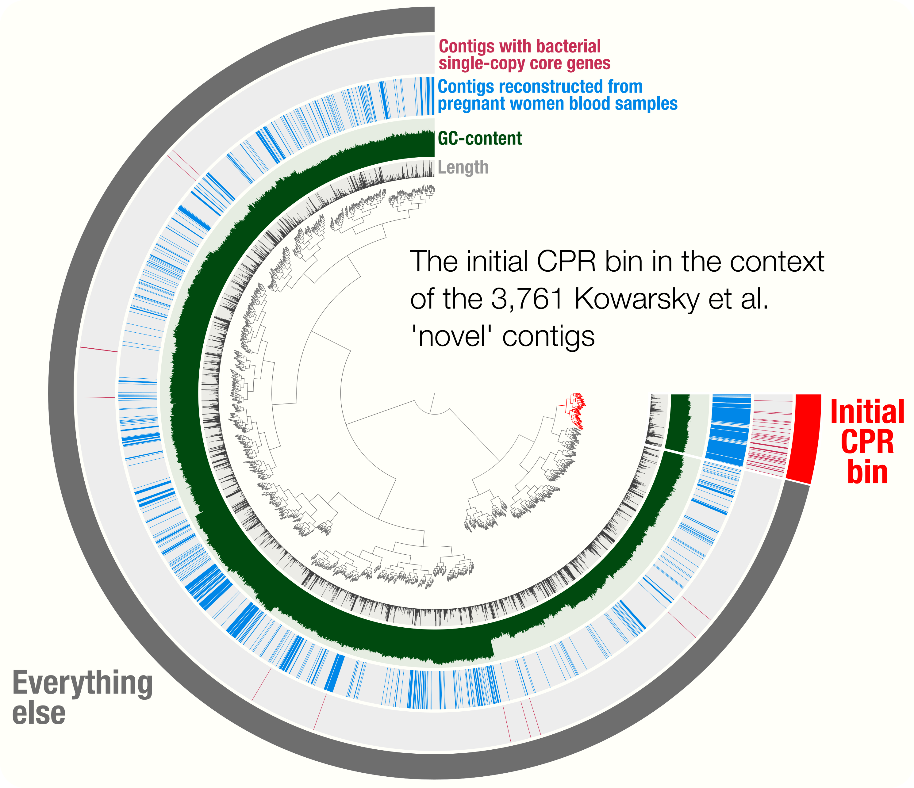</a>
    </div>
    <div class="pub-highlights">
    <span style="display: inline-block; padding-bottom: 5px;">- A <b>review on genome-resolved metagenomics</b> that discusses the importance of using assembly and careful binning strategies to study metagenomes.</span><br /><span style="display: inline-block; padding-bottom: 5px;">-  Case studies include a demonstration of how <b>single-copy core genes can fail to predict the quality of metagenome-assembled genomes</b>, and <b>automated strategies that yield tens of thousands of metagenome-assembled genomes will include extensive contamination</b>.</span><br /><span style="display: inline-block; padding-bottom: 5px;">-  Promotes approaches to reconstruct <b>'complete' genomes from metagenomes</b> and the use of <b>GC skew as a metric for checking genome correctness</b>.</span><br /><span style="display: inline-block; padding-bottom: 5px;">-  Tutorial on <a href="https://ggkbase-help.berkeley.edu/genome_curation/scaffold-extension-and-gap-closing/" target="_blank">scaffold extension and gap closing</a>, reproducible workflow for <a href="http://merenlab.org/data/parcubacterium-in-hbcfdna/" target="_blank">binning and phylogenomics of a Parcubacterium genome from human blood metagenomes</a>.</span>
    </div>
    </div>
    <span class="pub-journal"><b>Genome Research</b>, 30(3):315-333.</span>
</div>

## Introduction

[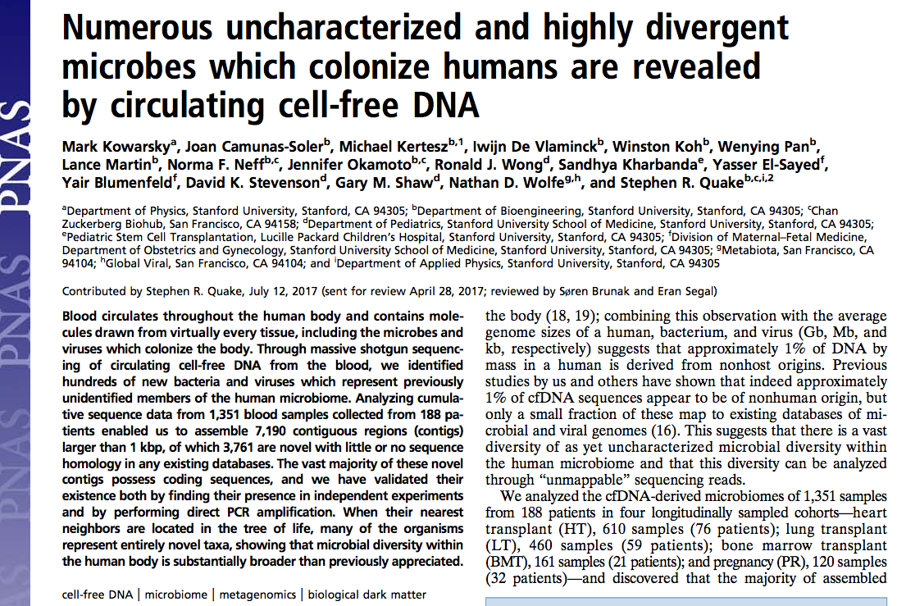](images/Kowarsky_et_al.png){:.center-img .width-60}

Our current study re-analyzes the invaluable metagenomic datasets and assemblies the study above made available. As briefly described previously on [this blog post](http://merenlab.org/2017/08/23/CPR-in-blood/), Kowarsky et al. take hundreds of blood samples collected from tens of patients, and use shotgun seqeuncing and assembly strategies to recover contigs from cell-free DNA. They remove sequences that match to the human genome, and investigate what is there in the remaining contigs. The authors also validate some of their findings by performing independent bench experiments, which is very nice to see since unfortunately ‘omics findings are rarely validated by additional experiments.

While the original blog post have identified an initial genome bin that resembled genomes characterized as Candidate Phyla Radiation, it had two major limitations. The first limitation was the use of only the novel contigs from the Kowarsky et al. study, as contigs that were considered 'non-novel' could still represent fragments that belong to this population: Kowarsky et al. had determined whether a given contig in their assembly was novel or not based on BLAST searches against known sequences in the NCBI's databases, but NCBI contains thousands of CPR genomes. Hence, partial matches may have removed contigs from the 'novel' bin. The second limitation of the initial survey of the assembly in that blog post was the fact that the analysis made no use of differential coverage information to make sure the bin was not contaminated.

Our current study addresses both of these limitations by (1) including [non-novel contigs](files/non-novel-contigs.fa.zip) (obtained from Kowarsky et al. through personal communication) in our analysis together with [novel contigs](files/novel-contigs.fa.zip) that were published before, and (2) employing metagenomic short reads made available in the origial study for read recruitment analyses. Together, these additions allowed us to determine a more complete genome bin for this CPR genome in this extremely challenging dataset, and perform a phylogenomic analyses to shed light on its place on the Tree of Life.


## Metagenomic read recruitment

For brevity, this section only describes the read recruitment analysis we performed to map reads from pregnant women blood metagenomes on to the combined set of contigs that includes both novel and non-novel contigs. However, we performed all read recruitment analyses similarly, which means changing the contents of the `samples.txt` and `references.txt` files, which we will describe shortly, will be sufficient to perform all others.

The mapping procedure implements the anvi'o metagenomics workflow [described here](http://merenlab.org/2018/07/09/anvio-snakemake-workflows/) in great detail. Briefly, the two main inputs of this workflow are a list of metagenomes, and a reference context for read recruitment, and its main output is an anvi'o contigs database and a merged profile database for visualization and/or binning. Metagenomes from which the reads will be recruited are described in a file called `samples.txt`, which looked like this for this analysis (you can see the enitre file [here](samples.txt)):

|sample|r1|r2|
|:--|:--:|:--:|
|SRR5496807|PR/SRR5496807_1.fastq|PR/SRR5496807_2.fastq|
|SRR5496808|PR/SRR5496808_1.fastq|PR/SRR5496808_2.fastq|
|SRR5496809|PR/SRR5496809_1.fastq|PR/SRR5496809_2.fastq|
|SRR5496810|PR/SRR5496810_1.fastq|PR/SRR5496810_2.fastq|
|SRR5496811|PR/SRR5496811_1.fastq|PR/SRR5496811_2.fastq|
|SRR5496813|PR/SRR5496813_1.fastq|PR/SRR5496813_2.fastq|
|SRR5496812|PR/SRR5496812_1.fastq|PR/SRR5496812_2.fastq|
|SRR5496814|PR/SRR5496814_1.fastq|PR/SRR5496814_2.fastq|
|SRR5496815|PR/SRR5496815_1.fastq|PR/SRR5496815_2.fastq|
|(...)|(...)|(...)|

Each line in this file corresponds to a metagenome that was generated from the cell-free DNA found in blood samples collected from a pregnant women cohort. To recruit reads using the entire set of contigs, we first merge the novel and non-novel contigs:

``` bash
wget http://merenlab.org/data/parcubacterium-in-hbcfdna/files/non-novel-contigs.fa.zip
wget http://merenlab.org/data/parcubacterium-in-hbcfdna/files/novel-contigs.fa.zip

unzip non-novel-contigs.fa.zip
unzip novel-contigs.fa.zip

cat novel-contigs.fa non-novel-contigs.fa > Kowarsky_et_al_ALL_CONTIGS.fa
```

Then, we generate a `reference.txt` file (which is also available [here](files/references.txt)):

|reference|path|
|:--|:--|
|Kowarsky_et_al_ALL_contigs|Kowarsky_et_al_ALL_CONTIGS.fa|

Finally we generate a configuration file for anvi'o workflows ([link](files/config.json)):

``` json
{
    "samples_txt": "samples.txt",
    "references_txt": "references.txt",
    "all_against_all": false,

    "remove_human_contamination": {
        "run": false
    },

    "qc": {
        "run": false
    },

    "reformat_fasta": {
        "run": false
    },

    "centrifuge":{
        "run": false
    },

    "anvi_profile": {
        "min_contig_length": 1000,
        "profile_AA": false,
        "report_variability_full": true,
        "threads": 4
    },

    "anvi_merge": {
        "skip_concoct_binning": true
    },

    "bowtie": {
       "threads": 4
    }
}
```

And run it the following way (for instance :

``` bash
anvi-run-workflow -w metagenomics \
                  -c config.json \
                       --additional-params \
                           --jobs 6 \
                           --resources nodes=6
```

This analysis results in an anvi'o merged profile database that describes the read recruitment statistics of each contig in `Kowarsky_et_al_ALL_CONTIGS.fa` across all metagenomes.

{:.warning}
[doi:10.6084/m9.figshare.8188613](https://doi.org/10.6084/m9.figshare.8188613) gives access to anvi'o files that were used in the downstream analysis.

## Manual genome refinement

By default, anvi'o organizes contigs in a given merged profile database based on tetranucleotide-frequency and differential coverage. While this strategy is quite effective and also has been used in many commonly used binning algorithms to identify population genomes, the differential coverage signal can be extremely noisy if all microbial populations are extremely rare in a metagenome (i.e., a large fraction of sequencing describes the eukaryotic contamination) since in those situations non-specific read recruitment determines most of the coverage signal, and there can be many ways to reach to the same mean coverage when there is enough chaos at the coverage level. This was such a dataset where the coverage of microbial contigs were extremely low, and our empirical analyses with this challenging dataset suggested that differential detection, instead of differential coverage, may serve better to identify population genomes, contigs of which detected similarly across samples.

To utilize differential detection along with tetranucleotide frequency, we first created an anvi'o clustering recipe that uses `detection_contigs` information stored in anvi'o databases rather than `mean_coverage_contigs` as it is the case in the default approach:

``` ini
[general]

[TNF !CONTIGS.db::kmer_contigs]

[Coverage_N PROFILE.db::detection_contigs]
normalize = False
log = False

[GC_content !CONTIGS.db::splits_basic_info]
columns_to_use = gc_content_parent,gc_content_parent,gc_content_parent
normalize = False
```

We stored this configuration in a file called `detection.ini` and placed it in the directory where the anvi'o merged profile database was stored (the one that is linked at the end of the previous section), and run the following command:


```
anvi-experimental-organization detection.ini \
                               -p PROFILE.db \
                               -c CONTIGS.db \
                               -i . \
                               -N TNF_DETECTION
```

This command computes a new hierarchical tree for contigs and stores it in the profile database so one can switch the order of contigs to tetra-nucleotide frequency and differential detection from the interface.

Our purpose here was to refine the initial CPR bin using all the data available. Hence, before visualizing the coverage of all Kowarsky et al contigs in the context of pregnant women blood metagenomes, we added two more additional data into the profile database. The first one was to clearly mark contigs that belong to the initial CPR bin, for which we imported [this collection](files/CONTIGS_FROM_INITIAL_CPR_BIN.txt) that described contig names affiliated with our initial bin:

```
anvi-import-collection CONTIGS_FROM_INITIAL_CPR_BIN.txt \
                       -C CPR_BIN_W_TNF_BEFORE_REFINEMENT \
                       -p PROFILE.db \
                       -c CONTIGS.db
```

This is the list of collections looked like after this:

```
$ anvi-show-collections-and-bins -p PROFILE.db

Collection: "INITIAL_CPR_BIN_FROM_TNF"
===============================================
Collection ID ................................: INITIAL_CPR_BIN_FROM_TNF
Number of bins ...............................: 2
Number of splits described ...................: 175
Bin names ....................................: CPR_bin, Parcu_16S
```

Then, we added an additional data layer to identify contigs that carried one or more bacterial single-copy core genes which was explained in [this file](files/contigs_with_BSCGs.txt):

```
anvi-import-misc-data files/contigs_with_BSCGs.txt \
                      -p PROFILE.db \
                      -t items \
                      -D BSCGs
```

We then made sure the new layer was added to the database by listing the misc data layers for items:

```
anvi-show-misc-data -p PROFILE.db \
                    -t items

DATA KEYS FOR "ITEMS" in 1 DATA GROUP(S)
===============================================

* DATA GROUP "default" WITH 1 KEYS
    - BSCGs (str, describes 150 items)
```

We finally visualized the merged profile to start binning:


```
anvi-interactive -p PROFILE.db \
                 -c CONTIGS.db
```

Which gave us this display:

[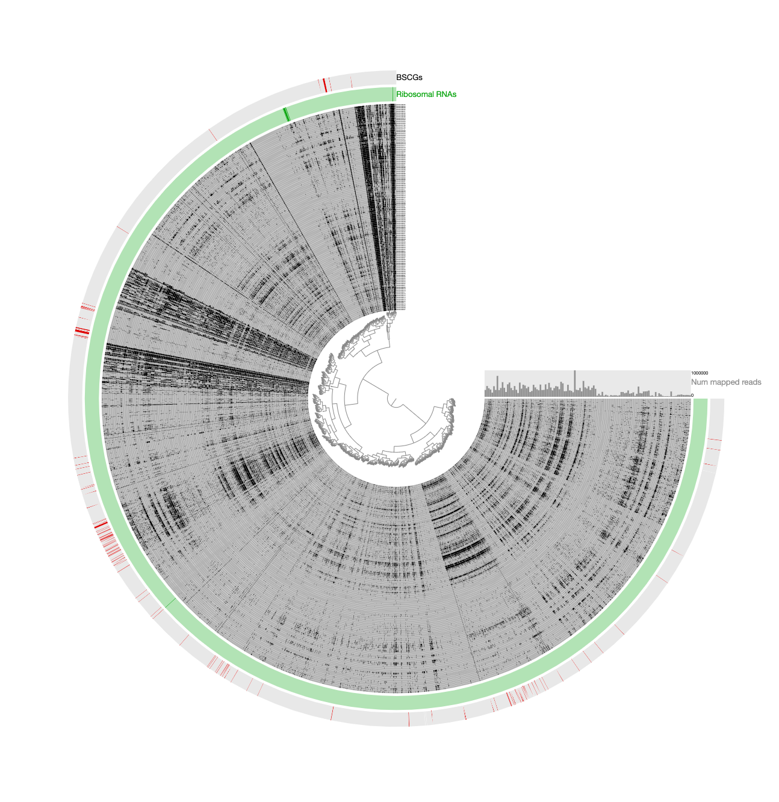](images/refinement-00.png){:.center-img .width-60}

Here is a reminder for how the initial binning of the CPR genome through tetranucleotide-frequency signal found in novel contigs looked like:

[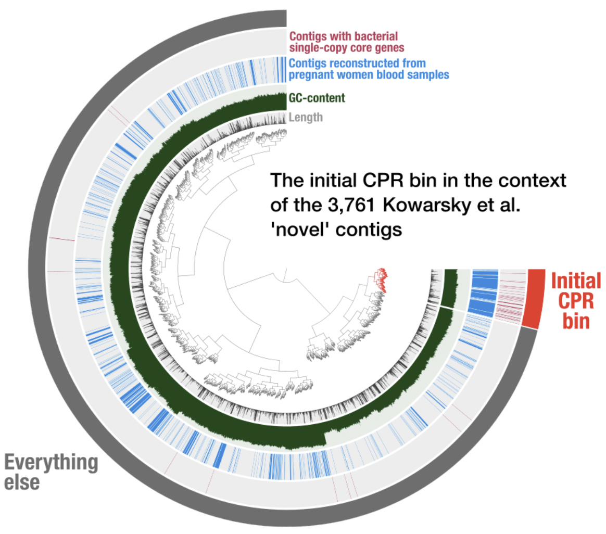](images/initial-CPR.png){:.center-img .width-60}

In contrast to this limited view, this new display includes both novel and non-novel contigs as well as the coverage values of them across pregnant women blood metagenomes, giving an opportunity for a more careful refinement effort. The selection that describes the initial CPR bin among novel contigs correspond to the blue contigs in this new display with all contigs:

[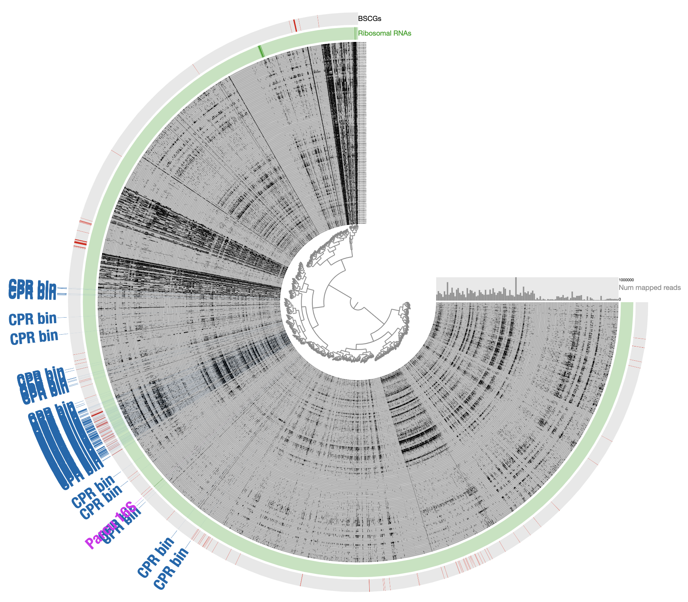](images/inital-CPR-in-all-contigs.png){:.center-img .width-60}

Our conservative effort to identify the set of contigs for a final refined bin included the following steps:

- The default display shows the organization of contigs based on tetranucleotide frequency --switch to `TNF DETECTION` order (in the Main panel under the 'Item order" combo box) and re-draw the display.

- Load the collection `INITIAL CPR BIN FROM TNF` to identify contigs that match to the initial CPR bin identified from novel contigs (in the Bins panel under Load Collection dialogue). This gives us this:

[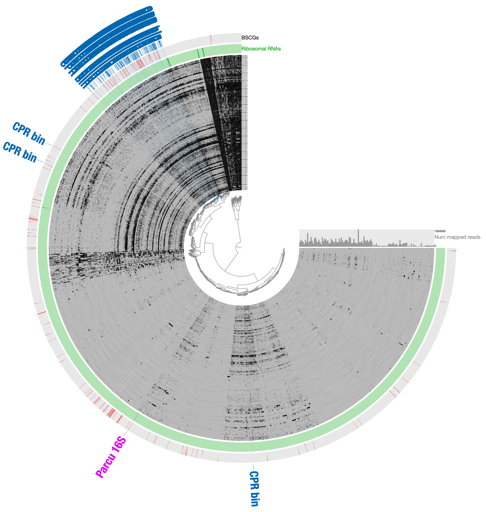](images/refinement-01.png){:.center-img .width-60}

- Remove contigs that appear to be too far from the main cloud of CPR contigs, and select all contigs that appear to be within the main cloud of CPR contigs:

[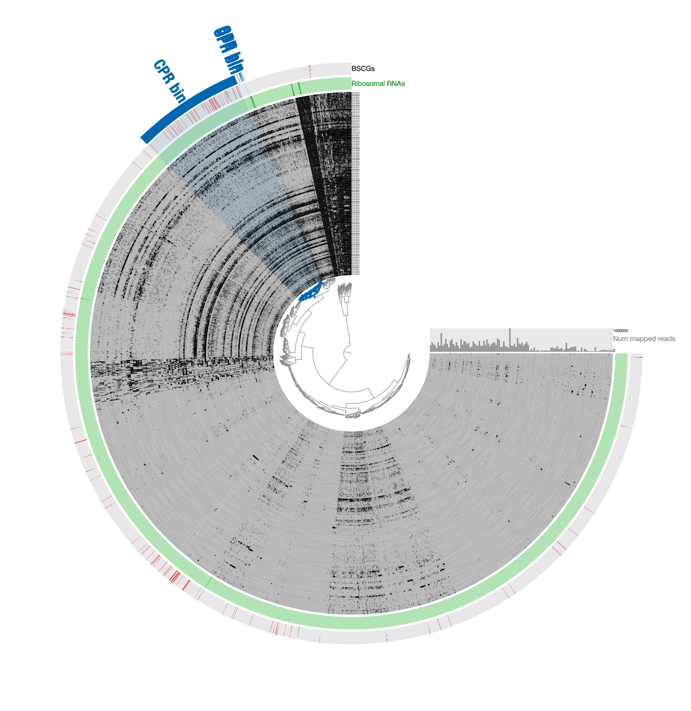](images/refinement-02.png){:.center-img .width-60}

Note that selecting all contigs in that cluster does not change the completion or redundancy, but increases the size of this bin to 1.2 Mbp, which is quite unlikely given the size of Parcubacterium genomes and the low completion of this bin, so it is likely this selection includes contaminants.

- Next, organize contigs only based on tetranucleotide-frequency.

[](images/refinement-03.png){:.center-img .width-60}

Note that the entire selection scatters around based on sequence signatures.

- To minimize the likely influence of noise, remove contigs that are most likely contaminants due to their divergence from the CPR cloud that is enriched with bacterial single-copy core genes.

[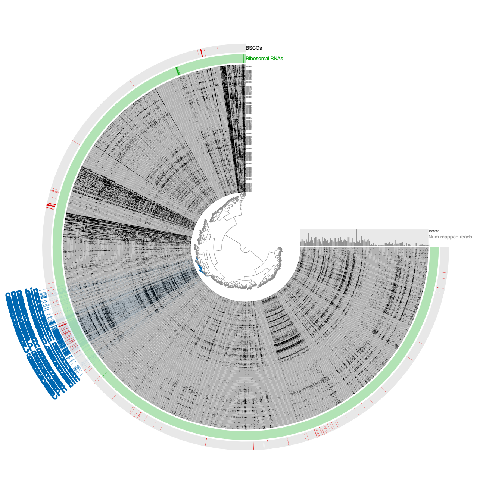](images/refinement-04.png){:.center-img .width-60}

- The removal of divergent contigs result in 294 contigs. But we can scrutinize a bit further: while the signal for the Parcubacterium genome was mostly in pregnant women blood metagenomes, a very small number of contigs in the assembly were coming from blood samples collected from organ transplant patients. While it is very likely these contigs also belong to the same population or a very closely related one, we chose to manually remove those that are in this final selection to be extra extra conservative with our selection. Clicking the button underneath the 'Splits column in the 'Bins' panel gives the names of all contigs in a given bin. For our final selection, this list included 'LT_node_809_split_00001',  'LT_node_786_split_00001', 'LT_node_928_split_00001', 'BMT_node_106_split_00001', and 'BMT_node_138_split_00001'. Removal of these contigs manually results in the final selection of 289 contigs that are 52.5% complete and 2.2% redundant.

We stored the final selection as `REFINED CPR BIN`, and used `anvi-summarize` to get a [FASTA file for the final CPR genome](files/Parcubacterium_HBCFDNA.fa). We used this FASTA file for all downstream read-recruitment and functional annotation analyses.

Please note that these extremely conservative steps likely removed contigs that did belong to Parcucbacteria from our final bin, and despite our best efforts, this bin may still contain contigs that shouldn't have been in there.

{:.warning}
[doi:10.6084/m9.figshare.8188451](https://doi.org/10.6084/m9.figshare.8188451) gives access to the final CPR bin in a citable fashion. [An anvi'o contigs database for this genome](files/Parcubacterium_HBCFDNA.db) is also available.

<div class="extra-info" markdown="1">

<span class="extra-info-header">Meren's 2 cents on why differential detection and not coverage</span>

For those of you who are curious, this is how the very final selection of the CPR bin looked like when contigs are organized based on differential coverage rather than detection:

[](images/refinement-05.png){:.center-img .width-60}

The inadequacy of this approach is clear from the contigs that appear to be in every sample: those are contigs coming from the human genome, however, they are also split into multiple distant branches of the clustering dendrogram. The reason behind this is the extremely low and patchy coverage of the data. Perhaps the data points shown in this display is confusing. Each data point shows the detection statistic of a given contig in a given metagenome where maximum value is set to 0.1 (so if the detection of a given contig is more than 10% it will be shown as a full bar). Just to switch to what we are used to working with, here is the same data shown in log-normalized mean-coverage with no normalization:

[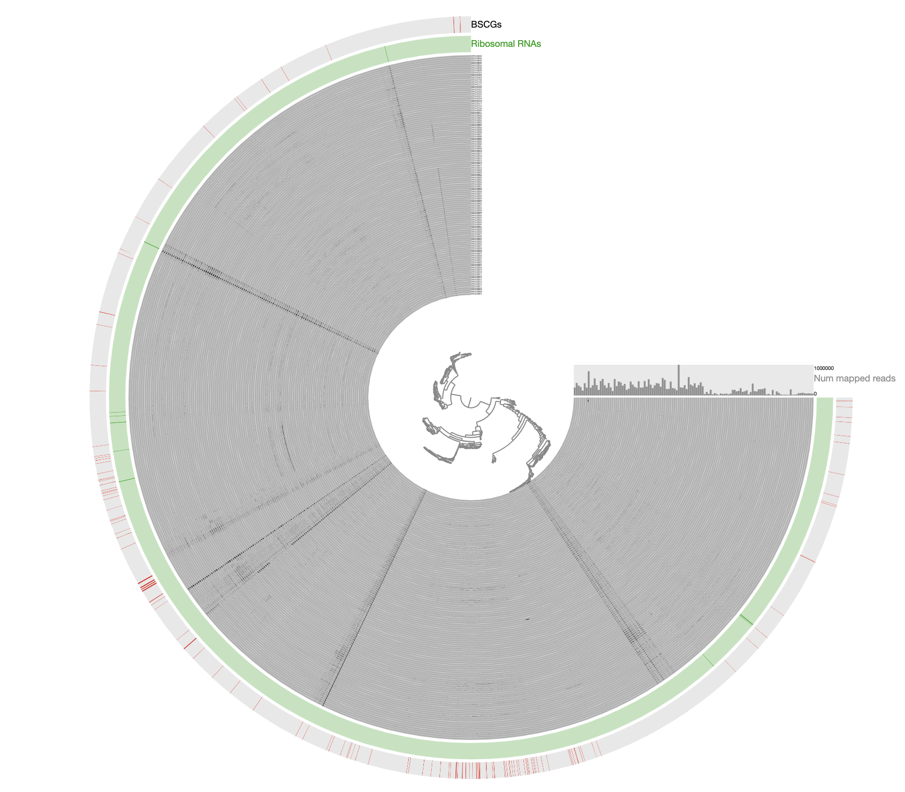](images/refinement-06.png){:.center-img .width-60}

Just to be crystal clear, this is the level of signal we have been working with:

[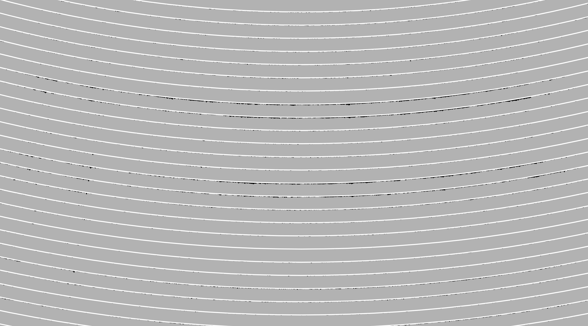](images/refinement-07.png){:.center-img .width-90}

Perhaps this has been one of the most challenging datasets I have worked with to reconstruct a genome bin. The resulting bin is certainly not perfect and likely even contains errors. However, getting a reasonably complete population genome from this chaos that gives continuous signal of detection in other metagenomes after read recruitment analyses and that lends itself to downstream phylogenomic analyses demonstrate the power of manual curation when necessary, in my opinion. This doesn't look too bad and it is far from the reach of any automatic binning approach:

```
anvi-estimate-genome-completeness -c Parcubacterium_HBCFDNA.db

Contigs DB ...............: Initialized: Parcubacterium_HBCFDNA.db (v. 12)

Genome in "Parcubacterium_HBCFDNA.db"
===============================================
╒════════════════════════╤══════════╤══════════╤═══════════╤════════════╤══════════════╕
│ bin name               │ domain   │ % compl. │ % redund. │ num_splits │ total length │
╞════════════════════════╪══════════╪══════════╪═══════════╪════════════╪══════════════╡
│ Parcubacterium_HBCFDNA │ BACTERIA │    52.52 │      2.16 │        289 │       613492 │
╘════════════════════════╧══════════╧══════════╧═══════════╧════════════╧══════════════╛
```

</div>


## Phylogenomic analysis

We next put this genome bin in the context of some of the available CPR genomes. For that, we first learned the Ribosomal proteins available in this contigs database:

``` bash
anvi-script-gen_stats_for_single_copy_genes.py Parcubacterium_HBCFDNA.db

grep Ribo Parcubacterium_HBCFDNA.db.hits | grep Campbell | awk '{print $3}' | sort | uniq -c
   1 Ribosomal_L10
   1 Ribosomal_L11
   1 Ribosomal_L11_N
   1 Ribosomal_L13
   1 Ribosomal_L14
   1 Ribosomal_L17
   1 Ribosomal_L20
   1 Ribosomal_L21p
   1 Ribosomal_L27
   1 Ribosomal_L32p
   1 Ribosomal_L5_C
   1 Ribosomal_L9_C
   1 Ribosomal_L9_N
   1 Ribosomal_S11
   1 Ribosomal_S13
   1 Ribosomal_S16
   1 Ribosomal_S2
   1 Ribosomal_S20p
   1 Ribosomal_S4
   1 Ribosomal_S7
   1 Ribosomal_S9
```

We put all these names into a shell variable for easy access:

```
RIBO_GENES=$(grep Ribo Parcubacterium_HBCFDNA.db.hits | grep Campbell | awk '{printf t $3} {t=","}')
```

You can see the content of this variable this way:

``` bash
echo $RIBO_GENES
Ribosomal_L27,Ribosomal_L14,Ribosomal_S2,Ribosomal_L11_N,Ribosomal_S11,Ribosomal_L9_N,Ribosomal_L13,Ribosomal_L10,Ribosomal_L20,Ribosomal_L32p,Ribosomal_L17,Ribosomal_L9_C,Ribosomal_S7,Ribosomal_S20p,Ribosomal_S13,Ribosomal_L21p,Ribosomal_S4,Ribosomal_S16,Ribosomal_L11,Ribosomal_S9,Ribosomal_L5_C
```

We then downloaded anvi'o contigs databases for all CPR genomes published in the [Brown et al.](http://www.nature.com/nature/journal/v523/n7559/abs/nature14486.html) paper:

``` bash
# downlaod the archive
wget https://ndownloader.figshare.com/files/9337477 \
     -O ANVIO_CONTIG_DBs_for_BROWN_et_al_CPRs.tar.gz

# unpack it
tar -zxvf ANVIO_CONTIG_DBs_for_BROWN_et_al_CPRs.tar.gz
```

We then created an external genomes file:

``` bash
# start a new external genomes file:
echo -e "name\tcontigs_db_path" > EXTERNAL-GENOMES.txt

# add the CPR bin into it:
echo -e "CPR_bin\tParcubacterium_HBCFDNA.db" >> EXTERNAL-GENOMES.txt

# then add all Brown et al. CPR genomes:
while read entry name x y z
do
    echo -e "$entry"_"$name\tANVIO_CONTIG_DBs_for_BROWN_et_al_CPRs/$entry-$name.db"
done < ANVIO_CONTIG_DBs_for_BROWN_et_al_CPRs/00_INFO.txt >> EXTERNAL-GENOMES.txt

# on the side downloaded the following genomes, and created anvi'o contigs
# databases for them as a Firmuctes outgroup:
#
#   - Streptococcus_pneumoniae_36532 (ASM14709v1)
#   - Staphylococcus_aureus_30717 (ASM21031v1)
#   - Veillonella_parvula_37780 (ASM2494v1)
#   - Eubacterium_rectale_9544 (ASM2060v1)
#   - Acidaminococcus_intestini_99 (ASM23027v1)
#
# and added them to the external genomes file as well
for i in Streptococcus_pneumoniae_36532 Staphylococcus_aureus_30717 Veillonella_parvula_37780 Eubacterium_rectale_9544 Acidaminococcus_intestini_99
do
    echo -e "$i\t$i.db"
done >> EXTERNAL-GENOMES.txt
```

At the end of this step we had all the genomes of interest (1 CPR bin, 797 CPR genomes from Brown et al, and 5 Firmicutes genomes from NCBI) listed in our external genomes file. While in theory we are ready for a phylogenomic analysis, in practice there is one more step we need to go through: selecting which set of genes to work with. As you recall, we do have a variable name `$RIBO_GENES` that describes the Ribosomal proteins we should use to place our genome in a tree in the best way. However, since most of the genomes we now have for a phylogenomic analysis are MAGs, they can be incomplete and some of them missing many of the genes we are interested in. For this reason, here we ask anvi'o to remove any genome from the analysis if they are missing more than three of the genes we are interested in:

``` bash
anvi-get-sequences-for-hmm-hits --external-genomes EXTERNAL-GENOMES.txt \
                                --hmm-source Campbell_et_al \
                                --get-aa-sequences \
                                --align-with famsa \
                                -o Ribosomal_proteins.fa \
                                --concat \
                                --return-best-hit \
                                --gene-names $RIBO_GENES \
                                --max-num-genes-missing-from-bin 3
```

This program gives us a FASTA file that contains individually aligned and concatenated 21 ribosomal protein coming from 371 final number of genomes. We then use [trimAl](https://github.com/scapella/trimal) to remove nucleotide positions in the alignment that have gap characters in more than 50% of the sequences:

``` bash
trimal -in Ribosomal_proteins.fa \
       -out Ribosomal_proteins_GAPS_REMOVED.fa \
       -gt 0.50
```

And run the phylogenomic analysis using [IQ-TREE](http://www.iqtree.org/) with the 'WAG' general matrix model to infer a maximum likelihood tree:

``` bash
iqtree-omp -s Ribosomal_proteins_GAPS_REMOVED.fa \
           -nt 8 \
           -m WAG \
           -bb 1000 \
           -o Eubacterium_rectale_9544
```

We finally created a TAB delimited file to annotate phylum names,

``` bash
echo -e "name\tgroup" > ADDITIONAL-DATA.txt
grep '>' Ribosomal_proteins_GAPS_REMOVED.fa | awk '{if(substr($0, 1, 3)==">c0") \
                                                        printf("%s\t%s\n", substr($0, 2), substr($0, 8)); \
                                                    else if (substr($0, 1, 4)==">Kow") \
                                                        printf("%s\tCPR_bin\n", substr($0, 2));
                                                    else \
                                                        printf("%s\tFirmicutes\n", substr($0, 2))}' >> ADDITIONAL-DATA.txt

```

And used anvio' to visualize the tree:

``` bash
anvi-interactive -p phylogenomics.db \
                 --manual \
                 -A ADDITIONAL-DATA.txt \
                 -t Ribosomal_proteins_GAPS_REMOVED.fa.contree \
                 --title "CPR bin + Brown et al CPR Genomes + Five Firmicutes Genomes"
```

After some polishing, this was the result that allowed us to suggest the CPR bin was a member of the superphylum Parcubacteria:

[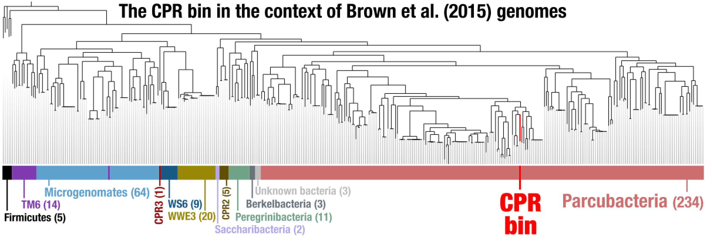](images/phylogenomic-tree.png){:.center-img .width-90}


<div style="display: block; height: 200px;">&nbsp;</div>
