


<div class="extra-info" markdown="1">

<span class="extra-info-header">Summary</span>

**The purpose of this tutorial is to discuss key aspects of the refinement of meatgenome-assembled genomes (MAGs)**. We will use anvi'o to demonstrate each step, however, these principles are independent of anvi'o and can be investigated through other means.

The tutorial includes **recommendations to streamline your examination of MAGs**, and provides a practical workflow with examples that clarify details of the anvi'o interactive interface. The tutorial broadly covers the following topics:

1. Using **sequence composition** and **differential coverage** to investigate MAGs in detail to identify contamination (including some tips on using the anvi'o interactive interface effectively).
2. Using **phylogenomics** to investigate refinement efforts in an evolutionary context.
3. Using **pangenomics** to study differences between refined and original MAGs.

While these approaches are independent of any particular dataset or study, to demonstrate their efficacy using a real-world dataset, we will use some of the key MAGs published by [Espinoza et al.](https://mbio.asm.org/content/9/6/e01631-18) using the public data the authors kindly provided. At the end of this document you will find a full description of the commands we run to reproduce all steps we run on Esponoza et al. data.

</div>


<div class="extra-info" markdown="1">

<span class="extra-info-header">Refined MAGs</span>

In addition to demonstrate a step-by-step MAG refinement, we wish to contribute to Espinoza et al.'s study by reporting **cleaned verisons of some of their key MAGs that will likely be of great interest to the oral microbiome community due to their originality**. The following list reports the FASTA files for the refined Espinoza et al. MAGs that belong to candidate phyla radiation:

* **Gracilibacteria (formerly GN02)**: [GN02 MAG.IV.B.1](/data/refining-espinoza-mags/files/GN02_MAG_IV_B_1-contigs.fa) and [GN02 MAG.IV.B.2](/data/refining-espinoza-mags/files/GN02_MAG_IV_B_2-contigs.fa) (*refined from Espinoza et al. MAG IV.B*).
* **Saccharibacteria (formerly TM7)**: [TM7 MAG.III.A.1](/data/refining-espinoza-mags/files/TM7_MAG_III_A_1-contigs.fa) and [TM7 MAG.III.A.2](/data/refining-espinoza-mags/files/TM7_MAG_III_A_2-contigs.fa) (*refined from Espinoza et al. MAG III.A*); [TM7 MAG III.B.1](/data/refining-espinoza-mags/files/TM7_MAG_III_B_1-contigs.fa) (*refined from Espinoza et al. MAG III.B*). [TM7 MAG.III.C.1](/data/refining-espinoza-mags/files/TM7_MAG_III_C_1-contigs.fa) (*refined from Espinoza et al. MAG III.C*). 
* **Absconditabacteria (formerly SR1)**: [SR1 MAG.IV.A.1](/data/refining-espinoza-mags/files/SR1_MAG_IV_A_1-contigs.fa) and [SR1 MAG.IV.A.2](/data/refining-espinoza-mags/files/SR1_MAG_IV_A_2-contigs.fa) (*refined from Espinoza et al. MAG IV.A; **Note:** MAG IV.A was annotated as GN2 although a phylogenomic analysis using ribosomal proteins affiliates it with SR1*).

</div>


If you have any questions, please feel free to leave a comment down below, send an e-mail to [us]({{ site.url }}/people/), or get in touch with other anvians through Slack:




## Introduction

So you’ve constructed MAGs, and would like to see if there are opportunities for refinement. Great. This tutorial will walk you through an example. We will demonstrate steps that we commonly take to manually refine MAGs we report. Even if refinement of *every* MAG is not possible, as you will see this is a labor-intensive process, refining critical MAGs may help you and others to prevent misleading insights. 

We will walk through this analysis using a specific set of **genomes** and **metagenomes**, but you can simply replace these data with yours and follow the same workflow. All you need is this: one or more FASTA files and one or more metagenomes.

If you don't have your own data to analyze, but still wish to follow the step by step instructions, you can find [detailed instructions](#setting-the-stage) below to simply download the data we used in this tutorial.

## Taking a first look at your MAG

{:.notice}
At this point in the tutorial, we assume that you have an anvi'o profile database and a contigs database for each MAG you wish to analyze. These are standard file formats anvi'o use to store and read data after processing your FASTA files and your read recruitment results. Generating these files are fairly straightforward and they immediately lend themselves to a [myriad of other types of analyses](/software/anvio/network/) beyond refining your MAGs. You can refer to the instructions at the bottom of this post if you wish to get to this point with FASTA files for your own MAGs and metagenomes from which you recovered them.

The first step is to take a look at the MAG in the interactive interface using the anvi'o profile and contigs databases. Here we used anvi'o *split profiles* to manually refine each MAG (generation of which is explained at the end of this post). Here is an example way to initiate the interactive interface for one of those:

```bash
anvi-interactive -p 07_SPLIT/GN02_MAG_IV_B/PROFILE.db \
                 -c 07_SPLIT/GN02_MAG_IV_B/CONTIGS.db
```

Which should give you something that looks like this:

[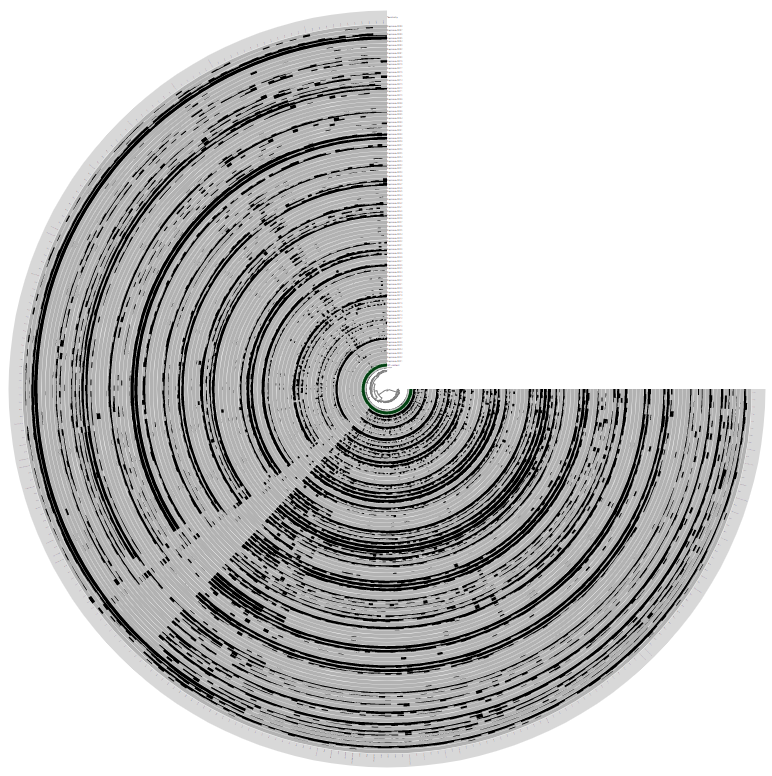](images/GN02_MAG_IV_B_initial.png){:.center-img .width-60}

{:.notice}
If this is the first time you are seeing an anvi'o interactive interface, we have a separate tutorial [here](/tutorials/interactive-interface/) that describes visualization capabilites of anvi'o intearctive interface that may help you orient yourself a little. In addition to that, [here](/tutorials/infant-gut/) we have an extensive tutorial on metagenomic binning that may help you get familiar with some of the anvi'o vocabulary.

Briefly, every layer in this display is one of the metagenomes, and each item shown here is one of the contigs in this MAG. Data points by default show the mean coverage of a given contig in a given metagenome, but that view can be changed to [other things]().

There are 88 metagenomes in Espinoza et al. study, hence there are 88 layers in theis display. Because we have many metagenomes, the dendrogram in the middle appears too small to make accurate selections of branches. So the first thing we will do is make it bigger. First click on the "Show Additional Settings" button:

[](images/additional_settings.png){:.center-img .width-60}

And now we can set the radius (here we chose 15,000):

[](images/change_radius.png){:.center-img .width-60}

And once we hit "Draw" (or use "d" as a keyboard shortcut), we get this:

[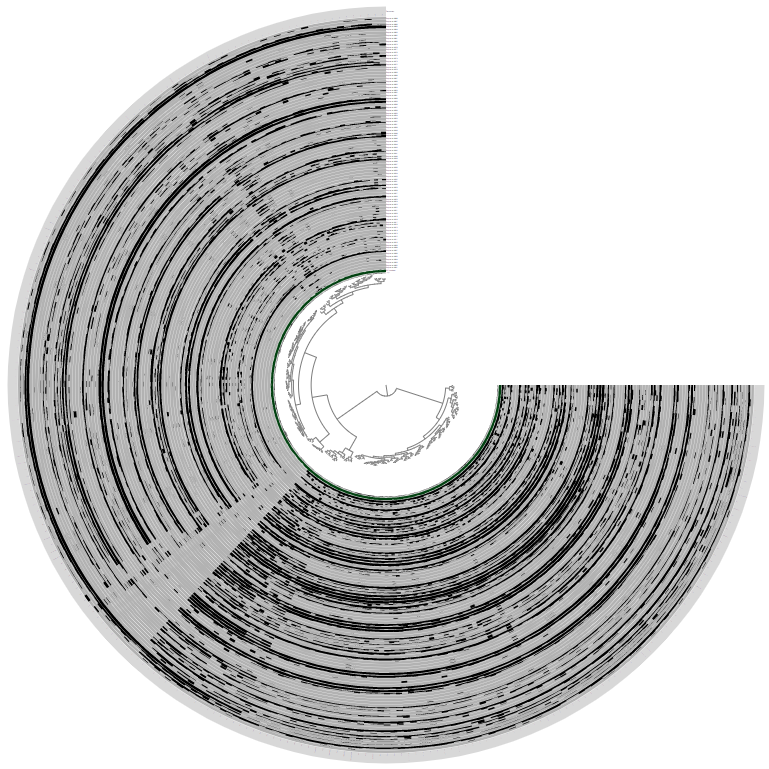](images/bigger_radius.png){:.center-img .width-60}

Looks much better. We can already see some interesting patterns, but before we dig into those, let's choose all the splits in this MAG. When you click with the left click on any of the branches in the center dendrogram, it will choose all the items under that part of the tree and add them into a 'bin'.

You can then move to the "Bins" tab (top left), you can see some real-time stats regarding your MAG:

[](images/tab_bins.png){:.center-img .width-60}

Once you click the "Bins" tab and you choose all the splits (just choosing the two branches that come out of the root should do it), your interface should look like this:

[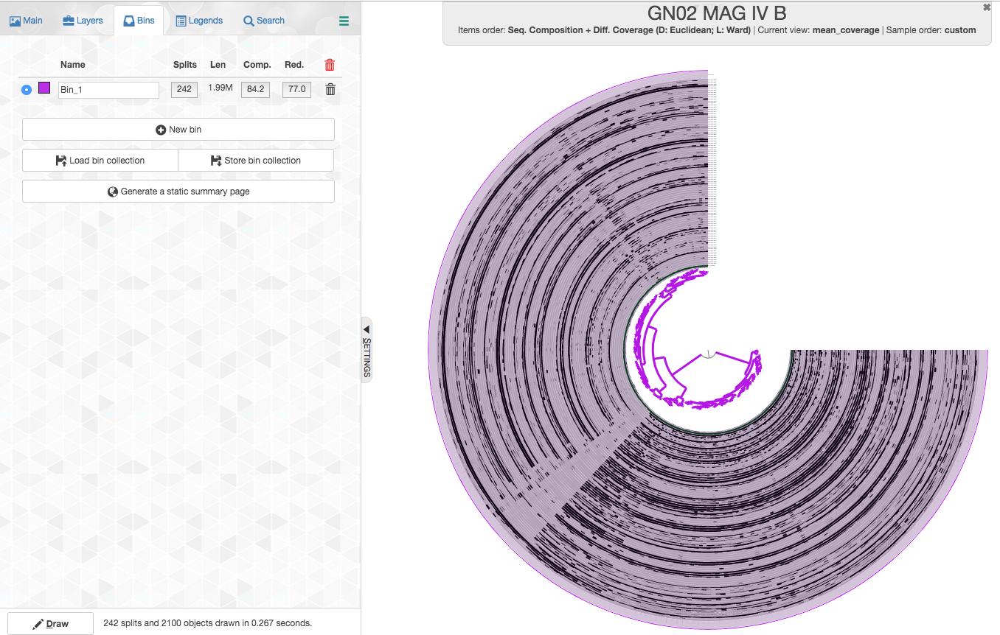](images/bins_tab_all_splits.png){:.center-img .width-60}

Let's review what we see:

 - **Splits**: anvi'o splits long contigs into splits of a maximum of 20,000 nucleotides (this is the default, but the number could be modified in `anvi-gen-contigs-database`). Here we have 313 splits.
 - **Len**: the total length of all the splits (contigs) in your MAG.
 - **Comp.**: completion based on a collection of single-copy core genes. anvi'o has a certain heuristic to determine the domain (bacteria/archea/eukaryota) of the MAG and it would use a dedicated collection of single-copy core genes accordingly.
 - **Red.**: redundancy of single-copy core genes.

We can see that this bin has very high redundancy of single-copy core genes. This is a very strong indication that this bin is highly contaminated. In fact, recent [guidelines set 10% as the highest redundancy that is appropriate to report for a MAG](https://www.nature.com/articles/nbt.3893), with which [we agree]().

{:.warning}
While high redundancy of single-copy core genes is a good predictor of contamination, **the lack of redundancy is not an absolute predictor of the lack of contamination**. Read Veronika Klevenson's "[Notes on genome refinement with anvi'o]()".

We can click on the redundancy number and see which specific genes are redundant:

[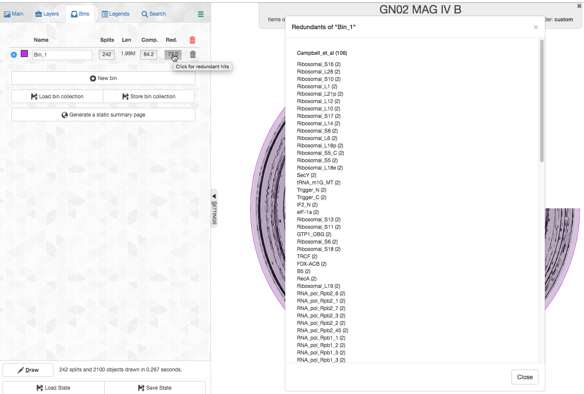](images/redundancy_click.png){:.center-img .width-60}

Moreover, if we click on a specific gene name, anvi'o will highlight with a red mark the splits in which the gene occurs. Let's click on the first one (Ribosomal_S16):

In order to see the highlights better, let's first go back to the "Main" tab (top right of screen), and set some parameters for "Selections". It will make our selections and highlights much more visible:

[](images/selections.png){:.center-img .width-60}

And now the interactive interface should look like this:

[](images/redundant_ribosomal.png){:.center-img .width-60}

In order to get an idea of what taxa these copies of Ribosomal protein S16 represent, we can BLAST the splits in which these genes are found against the NCBI's nr database. This could be done from the interactive interface easily. We simply right click on one of these splits, and then a menu such as in the screenshot below will appear:

[](images/rightclick.png){:.center-img .width-60}

Now, we can either choose one of the "blast" options from below, but I like to choose "Get split sequence". Choosing this option will prompt the following screen:

[](images/split_sequence.png){:.center-img .width-60}

If we click on the sequence inside this window, then the sequence will be highlighted and we can copy and paste it into [balstx](https://blast.ncbi.nlm.nih.gov/Blast.cgi?PROGRAM=blastx&PAGE_TYPE=BlastSearch&LINK_LOC=blasthome) and run the blastx search (blastx accepts nucleotide sequences as input, translates open reading frames to amino acid sequences and searches NCBI's protein sequences database). Depending on the length and content of a split this could be very fast or very slow. In this case it took about 10 minutes to get a result and here is a screenshot of the top two hits:

[](images/blast_split1.png){:.center-img .width-90}

The top hit is to the original MAG published by Espinoza et al. so that is of no interest.
The second hit is to a Gracilibacteria genome [HOT-871](https://www.ncbi.nlm.nih.gov/genome/?term=txid1540872[Organism:noexp]) from a study by [Jouline et al.](http://grantome.com/grant/NIH/R01-DE024463-04).

We repeat this process for the other split that contains a copy of Ribosomal protein S16, and here is the top hit.

[](images/blast_split2.png){:.center-img .width-90}

Again the top hit is to the original genome from Espinoza et al., but the second hit is to a different Gracilibacteria genome [HOT-872](https://www.ncbi.nlm.nih.gov/genome/?term=txid1912928[Organism:noexp]) which is also from the study by [Jouline et al.](http://grantome.com/grant/NIH/R01-DE024463-04).

So the two copies of the genes likely both represent populations from the candidate phylum Gracilibacteria (formerly GN02), but blast tells us that they hit different genomes.
In addition, we can see that these copies of Ribosomal protein S16 occur in two sides of the figure that represent very distinct sections of the organizing dendrogram in the middle. This is a good sign that tells us refinement is going to be easy and effective.

Ok, so now it is time to talk about that dendrogram in the middle.

## Refining using sequence composition and differential coverage

The dendrogram in the middle organizes the items of the interactive interface. In this case the items represent splits.

If you click on the "Items order", you can choose from multiple options of items orders:

[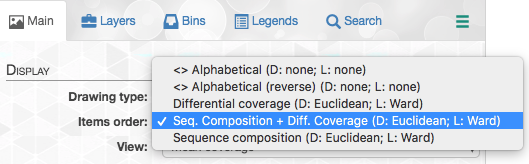](images/items_order.png){:.center-img .width-60}

You can read more about each of these options in the ["Infant Gut Tutorial"](/tutorials/infant-gut/#chapter-i-genome-resolved-metagenomics). By default items are organized by a metric that uses both sequence composition and differential coverage. We can see that the dendrogram separates into two major clusters that appear to have distinct differential coverages. Let's make two bins with these distinct clusters:

{:.warning}
**Pro tip**. On Mac, you can use ⌘ + mouse click on a branch to store it in a new bin.

[](images/refine1.png){:.center-img .width-60}

{:.warning}
**Pro tip**. Right click on a branch removes it from whatever bin it was in.

{:.warning}
**Sad tip**. The anvi'o interactive interface does not have a CTRL-Z.

We can see that these two clusters correspond to two genomes with very high completion and very low redundancy. As we show below, these genomes belong to the candidate phylum Gracilibacteria (formerly GN02), a member of the Candidate Phyla Radiation (CPR), and hence [this completion estimation is an underestimation](http://merenlab.org/2016/04/17/predicting-CPR-Genomes/#distribution-of-bacterial-single-copy-genes-in-cpr).

So here we are, we took just a few fairly easy steps and we have already improved these genomes A LOT!

But what about those splits that now belong to no bin? We will start with the cluster shown below:

[](images/orphan_cluster1.png){:.center-img .width-60}

The coverage pattern tell us that these splits are covered in samples in which either of these populations occur, so these are likely largely "shared" sequences of these populations, i.e. sequences that recruit short reads from both of these populations.
So let's check what happens when we add these splits to each of the bins

This is what happens if we add it to bin1:

[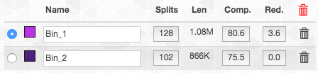](images/orphan2.png){:.center-img .width-60}

In contrast, this is what happens if we add it to bin2:

[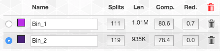](images/orphan3.png){:.center-img .width-60}

So the completion and redundancy estimates tell us that these splits fit better in bin2 than in bin1. Hence that is where we decided to put them. These type of choices are common to manual refinement and are never easy to make. The best course of action is to continue to scrutinize the MAGs, as we will discuss below. But it is also important to remember that getting a "perfect" MAG could be very difficult, and in some cases may be impossible. It is important to go down the road, but also to remember to not get lost.

What about the remaining splits? When we add these splits to either of the bins, they don't contribute to completion nor to redundancy. The coverage shows that these are sequences that are largely missing from both of these populations, and hence we decided to not add these to either of the bins.

So here are the final bins (now with nicer names too. You can change the names of a bin by clicking on it in the "Bins" tab):

[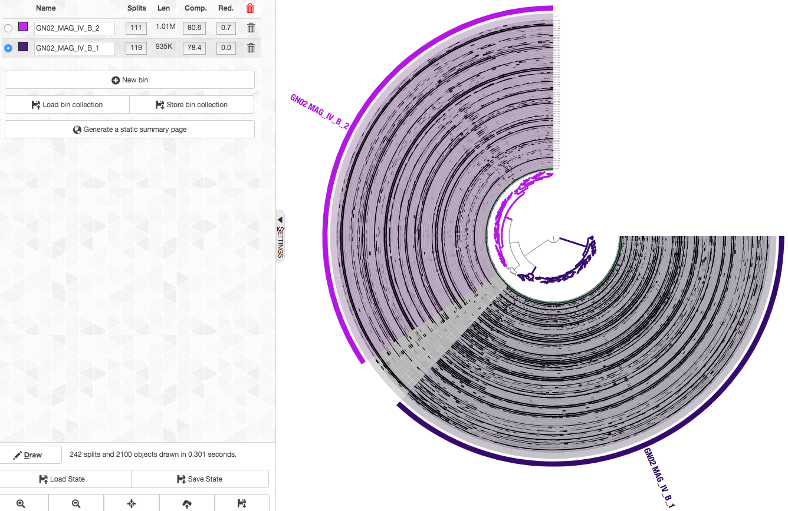](images/refine_final.png){:.center-img .width-60}


We repeated this refinement process for the rest of the Espinoza et al. CPR bins (GN02 MAG IV.A TM7 MAG III.A TM7 MAG III.B TM7 MAG III.C), to get refined MAGs (to get these refinement results go to [the section below](http://localhost:4000/data/refining-espinoza-mags/#getting-finalized-views-and-statistics-for-the-genomes-we-refined)).

But we don't stop here. Next, we will discuss the various ways in which we scrutinize our MAGs.

## Scrutinizing MAGs with various methods

<blockquote markdown="1">
_Even though metagenome-assembled genomes (MAGs) are key to discover unusual things, usually, when you see a MAG that is unusual, your first assumption should be that it is due to contamination._

<div class="blockquote-author">Alon Shaiber</div>
</blockquote>

In this section we discuss how we use various methods, such as phylogenomics, pangenomics, average nucleotide identity (ANI), taxonomy of genes and genomes, and anything else we can put our hands on to try to identify contamination in MAGs.

### Blasting HMM hits of single-copy core genes

One step we often take when working on MAGs is to export the amino-acid sequences of all the Campbell et al. HMM hits and blast these on the NCBI nr database.

In this case, we already blasted a split from each of the refined MAGs (see above), and so we skipped this step, but I still wanted to put this note here in case you want to do it.

To export these sequenes for our case we run:

```bash
anvi-get-sequences-for-hmm-hits -c 07_SPLIT/GN02_MAG_IV_B/CONTIGS.db \
                                -p 07_SPLIT/GN02_MAG_IV_B/PROFILE.db \
                                -C default \
                                -b GN02_MAG_IV_B_1 \
                                -o GN02_MAG_IV_B_1-campbell-et-al.fa
```

We can use the output FASTA file to blast on NCBI (which we didn't, but _you_ can).

### Phylogeny with some genomes from NCBI

Earlier we blasted sequences from each of the refined MAGs, which gave us the idea that these MAGs belong to Candidatus Gracilibacteria.
To gain more confidence in this taxonomic assignment we will compute a phylogenetic tree.
In addition, a phylogenetic analysis is a good way to see things that seem out of the ordinary.
For example, if your MAG branches far away from other genomes, it could be that there is nothing closely related to it on NCBI (yay for you!),
but often it could mean that the sequences you used for phylogeny originate from various populations, namely, your MAG is contaminated (boo!).

We downloaded some genomes that belong to each of the phyla that these CPR MAGs belong to (we included the two Gracilibateria genomes from Jouline et al. that we mentioned before).

{:.warning}
To read about how we usually go about getting genomes for such phylogenomic and pangenomic analyses, you can refer to [this blogpost](http://merenlab.org/2019/03/14/ncbi-genome-download-magic/)

To see the details of how we generated this phylogeny you can refer to the [section below](#computing-phylogeny).

Let's take a look at the phylogeny:

```bash
anvi-interactive --manual \
                 -p 09_PHYLOGENOMICS_WITH_FIRMICUTES/PHYLOGENY-MANUAL-PROFILE.db \
                 -t 09_PHYLOGENOMICS_WITH_FIRMICUTES/ESPINOZA_CPR_MAGS-proteins_GAPS_REMOVED.fa.contree
```

We first change the "Drawing type" to "Phylogram":

[](images/drawing_type.png){:.center-img .width-60}

We also made some manual selections to highlight the MAGs we refined and we get:

[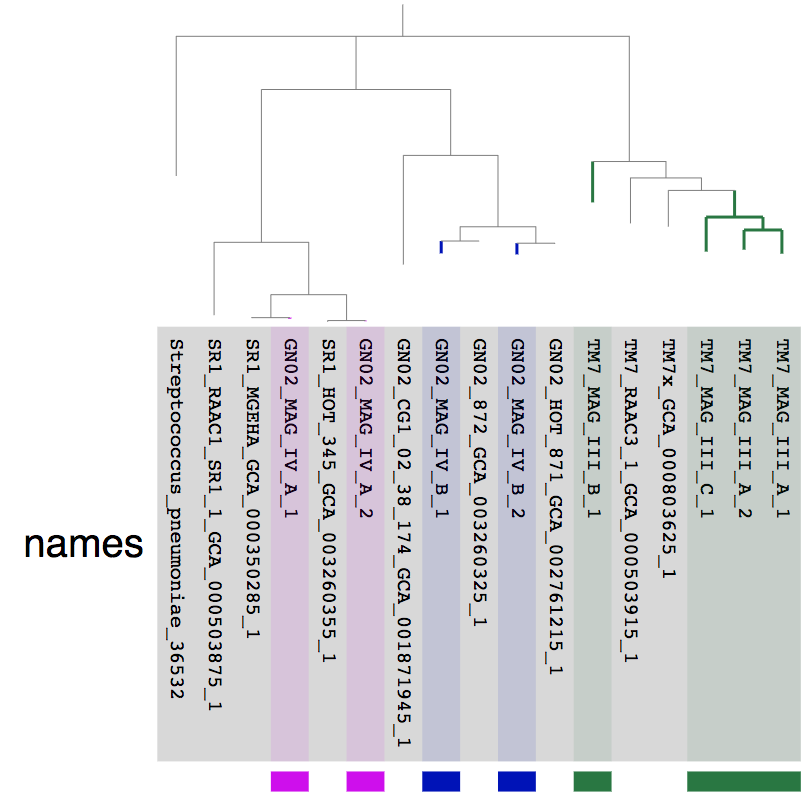](images/phylogeny.png){:.center-img .width-60}

The fact that the MAGs we refined from the Espinoza et al. MAG IV.A and MAG IV.B each have a very closely related genome from an independent study is a good sign that these are good quality genomes.
On the other hand, lack of closely related genomes for the TM7 genomes doesn't necessarily mean anything.

### Comparing pagenomes using refined and unrefined MAGs

To highlight some of the differences between the refined and unrefined MAGs, we computed a pangenome using the [anvi'o pangenomic workflow](http://merenlab.org/2016/11/08/pangenomics-v2/)
for each of the three phyla (TM7, GN02, and SR1) using the genomes we used for the phylogeny above.

Here we will only present and discuss the results for MAG IV.B that we discussed in detail above.

Let's take a look at the pangenome:

```bash
anvi-display-pan -p 10_PAN/GN02_UNREFINED/GN02_UNREFINED-PAN.db \
                 -g 10_PAN/GN02-UNREFINED-GENOMES.db
```

[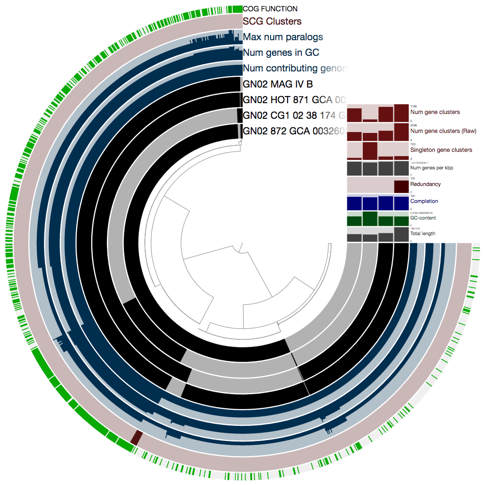](images/pangenome1_raw.png){:.center-img .width-60}

Ok, there is a lot here, and if you want to learn about all the wonderful information that is presented here, you should refer to the anvi'o [pangenomics tutorial](http://merenlab.org/2016/11/08/pangenomics-v2/).
We really recommend that you take a look, because there are a lot of things you can learn from a pangenome.

In our case we will focus on just one thing: the single-copy core gene clusters.
So we can first play with the interface to only show things that we are interested in.
The figure above contains concentric circular section to represent each of the four genomes we used for computing the pangenomes.
In addition there are 5 additional concentric layers, but we are only interested in the one that is labeled "SCG Clusters".
So we will remove the rest of the layers from the iterface. To do that, we go to the "Main" tab and set the "Height" to zero for each layer we don't want:

[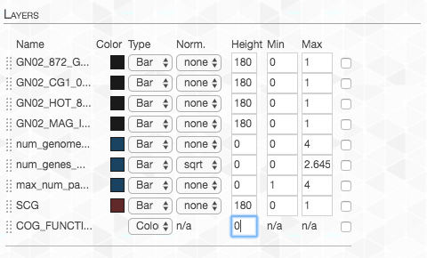](images/height_to_zero.png){:.center-img .width-60}

On the right top corner of the figure above we also have some additional statistics for each of the four genomes.
We can change what is presented by navigating to the "Layers" tab.
The first thing we do, is to change the "Order by" in order to organize the genomes according to "gene_cluster frequencies":

[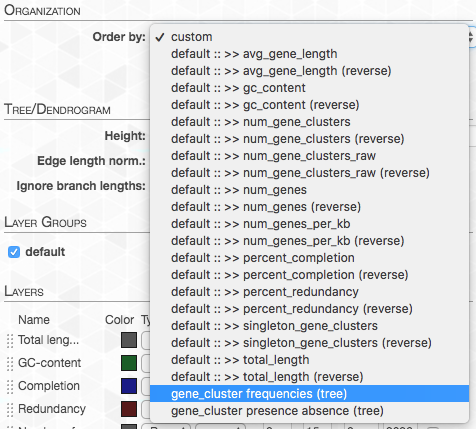](images/gc_freq.png){:.center-img .width-60}

This will change the order of layers so that genomes that contain similar gene clusters will be closer together (it will also add a tree that describes this clustering).

We can also change which information is shown. I changed the values to these:

[](images/layer_height.png){:.center-img .width-60}

In addition, in the "Main" tab, we can change the organization of the gene-clusters (namely the organizing dendrogram at the middle of the figure):

[](images/pan_items_order.png){:.center-img .width-60}

By default, the data is shown as presence/absence of each gene cluster in each genome,
but in this case we want to see how many copies of each gene cluster are in each genome.
So we change the "View":

[](images/pan_view.png){:.center-img .width-60}

We want the maximum value to be the same for each layer, so we adjust the "Max":

[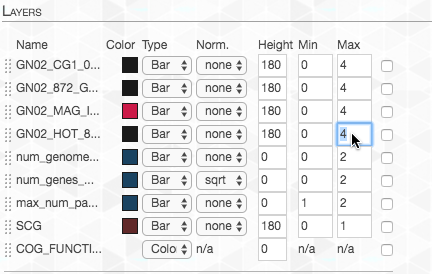](images/pan_max_value.png){:.center-img .width-60}

Lastly, I changed the color of the layer representing our genome-of-interest to highlight it:

[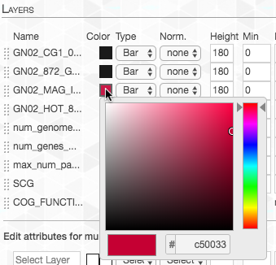](images/layer_color.png){:.center-img .width-60}

And now we can take another look:

[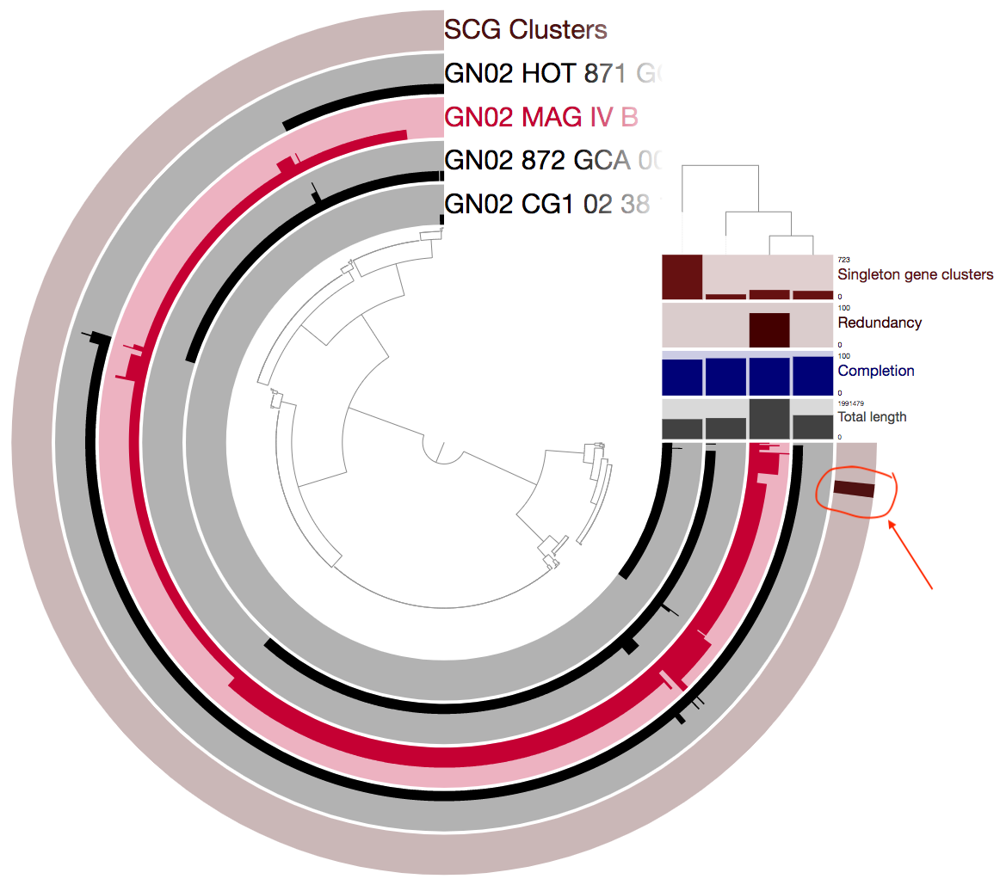](images/pangenome1.png){:.center-img .width-60}

I encircled and added an arrow above to emphesize the single-copy core gene clusters (SCGCs).
The SCGCs are important because we can use these for many things.
For example, these could be great to use for [phylogeny](http://merenlab.org/2016/11/08/pangenomics-v2/#scrutinizing-phylogenomics).
But in our case the fact that there are only 8 such gene clusters is a pretty alarming sign that something is wrong.
A closer examination of the figure above reveals that there are many gene clusters that appear as single-copy in the other three genomes, but as multi-copy in MAG IV.B.

Let's now take a look at the pangenome using the refined genomes:

[](images/pangenome2.png){:.center-img .width-60}

We can see that there are now many more SCGCs (there are 128 such gene clusters, a 1,600% increase compared to earlier).

## Summary

Here we presented steps you can take if you want to examine some genomes using metagenomes.

There are many more things that could be done, and we will try to extend this tutorial in the future.

The bottom line is that we strongly encourage to explore MAGs in various ways.

## Reproducible workflow

Here you will find all the computational steps that are required to get the results we discussed above.

### Setting the stage

This section explains how to download the metagenomes and MAGs from the original study by Espinoza _et al.
Downloading this data would allow you to follow this post step by step and get the final results we got.
Alternatively, you can skip this part, and apply the approach we describe to your own data._

#### Downloading the Espinoza et al. metagenomes

You can download raw Illumina paired-end seqeuncing data files for the 88 supragingival plaque samples into your work directory the following way:

``` bash
wget http://merenlab.org/data/refining-espinoza-mags/files/SRR_list.txt 

for SRR_accession in `cat SRR_list.txt`; do
    fastq-dump --outdir 01_RAW_FASTQ \
               --gzip \
               --skip-technical  \
               --readids \
               --read-filter pass \
               --dumpbase \
               --split-3 \
               --clip \
               $SRR_accesion
```

Once the download is finished, you should have 196 FASTQ files in your `01_RAW_FASTQ` directory, representing the paired-end reads of 88 metagenomes.

#### Downloading key MAGs from Espinoza et al.

In our reanalysis we only focused on some of the key MAGs that represented understudied lineages in the oral cavity. You can download these FASTA files from the NCBI GenBank in the following way:


```bash
mkdir -p 01_FASTA

# TM7_MAG_III_A (bin_8)
wget ftp://ftp.ncbi.nlm.nih.gov/genomes/all/GCA/003/638/965/GCA_003638965.1_ASM363896v1/GCA_003638965.1_ASM363896v1_genomic.fna.gz \
    -O 01_FASTA/TM7_MAG_III_A.fa.gz

# TM7_MAG_III_B (bin_9)
wget ftp://ftp.ncbi.nlm.nih.gov/genomes/all/GCA/003/638/935/GCA_003638935.1_ASM363893v1/GCA_003638935.1_ASM363893v1_genomic.fna.gz \
    -O 01_FASTA/TM7_MAG_III_B.fa.gz

# TM7_MAG_III_C (bin_10)
wget ftp://ftp.ncbi.nlm.nih.gov/genomes/all/GCA/003/638/915/GCA_003638915.1_ASM363891v1/GCA_003638915.1_ASM363891v1_genomic.fna.gz \
    -O 01_FASTA/TM7_MAG_III_C.fa.gz

# Alloprevotella_MAG_II_A (bin_3)
wget ftp://ftp.ncbi.nlm.nih.gov/genomes/all/GCA/003/639/005/GCA_003639005.1_ASM363900v1/GCA_003639005.1_ASM363900v1_genomic.fna.gz \
    -O 01_FASTA/Alloprevotella_MAG_II_A.fa.gz

# Alloprevotella_MAG_II_B (bin_4)
wget ftp://ftp.ncbi.nlm.nih.gov/genomes/all/GCA/003/639/155/GCA_003639155.1_ASM363915v1/GCA_003639155.1_ASM363915v1_genomic.fna.gz \
    -O 01_FASTA/Alloprevotella_MAG_II_B.fa.gz

# GN02_MAG_IV_A (bin_15)
wget ftp://ftp.ncbi.nlm.nih.gov/genomes/all/GCA/003/638/815/GCA_003638815.1_ASM363881v1/GCA_003638815.1_ASM363881v1_genomic.fna.gz \
     -O 01_FASTA/GN02_MAG_IV_A.fa.gz

# GN02_MAG_IV_B (bin_16)
wget ftp://ftp.ncbi.nlm.nih.gov/genomes/all/GCA/003/638/805/GCA_003638805.1_ASM363880v1/GCA_003638805.1_ASM363880v1_genomic.fna.gz \
     -O 01_FASTA/GN02_MAG_IV_B.fa.gz
```

{:.notice}
Initially we wanted to take a look at the Alloprevotella MAGs from Espinoza et al. but later we decided to focus on the CPR genomes that Espinoca et al. reported (GN02 and TM7). Hence, while we did not refine the Alloprevotella MAGs, they were included in our workflow, and accordingly, we include them in the following steps so that repeating these steps would give the exact data the we used.

--- 

Before we go into refining we wish to take a look at the individual fasta files. To do that we use the contigs database, which allows us to annotate each fasta file and compute some basic statistics such as redundancy and completion based on single-copy core genes.

{:.notice}
**To sreamline the contigs database creation and annotation**, we used `anvi-run-workflow`. This is a tool that is meant to help streamline the analysis steps and make things fully reproducible. For more details regarding `anvi-run-workflow` and other anvi'o worfklows please read [this tutorial]()).

### Generating a merged FASTA file for the MAGs

You can skip this section if you are working with your own FASTA file(s) and you do not wish to merge them.

{:.notice}
When working with multiple FASTA files you can choose between analysing each separately or concatinating them into a single FASTA file. The main advantage of working with a single FASTA file in our case is that mapping short reads to a single large FASTA file is much faster than mapping reads to multiple smaller files. Depending on your specific data you should decide what's better for your case.
In this case we chose to a single merged FASTA file since the MAGs that we examined originated from an assembly that was done with the exact metagenomes that we use here. all the steps that are done here could be done with multiple fasta files (and hence multiple contigs databases) in the same manner.
To make things go a little faster, we combined all MAGs into a single FASTA file (so the mapping and profiling steps could be streamlined).

In order to create a merged FASTA file, we first wish to rename the headers in each FASTA file to have names that are meaningful (so that we know for each contig, what genome it originated from) and also names that are acceptable for anvi'o (i.e. ASCII and '_'). For that, we used the following text file, `ESPINOZA-MAGS-FASTA.txt`, which is in the format of a `fasta_txt` file as accepted by [`anvi-run-workflow`](http://merenlab.org/2018/07/09/anvio-snakemake-workflows/#fastatxt).

You can download this file by running the following command:

```bash
wget http://merenlab.org/data/refining-espinoza-mags/files/ESPINOZA-MAGS-FASTA.txt
```

Here is a look into this file:

```bash
$ column -t ESPINOZA-MAGS-FASTA.txt
name                     path
TM7_MAG_III_A            01_FASTA/TM7_MAG_III_A.fa.gz
TM7_MAG_III_B            01_FASTA/TM7_MAG_III_B.fa.gz
TM7_MAG_III_C            01_FASTA/TM7_MAG_III_C.fa.gz
Alloprevotella_MAG_II_A  01_FASTA/Alloprevotella_MAG_II_A.fa.gz
Alloprevotella_MAG_II_B  01_FASTA/Alloprevotella_MAG_II_B.fa.gz
GN02_MAG_IV_A            01_FASTA/GN02_MAG_IV_A.fa.gz
GN02_MAG_IV_B            01_FASTA/GN02_MAG_IV_B.fa.gz
```

In addition, we used the following config file CONTIGS-CONFIG.json:

```json
{
    "anvi_run_ncbi_cogs": {
        "run": false
    },
    "fasta_txt": "ESPINOZA-MAGS-FASTA.txt"
}
```

You can download this file by running the following command:

```bash
wget http://merenlab.org/data/refining-espinoza-mags/files/CONTIGS-CONFIG.json
```

We used the contigs workflow to just re-format these FASTA files:

```bash
anvi-run-workflow -w contigs \
                  -c CONTIGS-CONFIG.json \
                  --additional-params \
                    --until anvi_script_reformat_fasta_prefix_only
```

This command will extract the raw FASTA files into temporary FASTA files, reformat these, and delete the extracted temporary fasta files.

At his point we can merge the fasta files into one file:

```bash
cat 01_FASTA/*/*-contigs-prefix-formatted-only.fa \
					               > 01_FASTA/ESPINOZA-MAGS-MERGED.fa
```

And we create a new `fasta_txt` file that we named `ESPINOZA-MERGED-FASTA.txt`:

```bash
echo -e "name\tpath" > ESPINOZA-MERGED-FASTA.txt
echo -e "ESPINOZA\t01_FASTA/ESPINOZA-MAGS-MERGED.fa" >> ESPINOZA-MERGED-FASTA.txt
```

It should look like this:

```bash
$ column -t ESPINOZA-MERGED-FASTA.txt
name      path
ESPINOZA  01_FASTA/ESPINOZA-MAGS-MERGED.fa
```

### Generating a collection file for the merged FASTA file

This step is also necessary only if you are working with a merged FASTA file. A collection is what anvi'o uses to know which contig is associated with which genome.

We generated a collection file that we could later use to import into the anvi'o merged profile database.
In order to generate this file, we used the following python script: `gen-collection-for-merged-fasta.py`, which you can download in the following way:

```bash
wget https://gist.githubusercontent.com/ShaiberAlon/23fc13ed56e02854bee42773672832a5/raw/3322cf23effe3325b9f8d97615f0b5af212b2fc2/gen-collection-for-merged-fasta.py
```

This script takes a `fasta_txt` file as input and generates a collection file where the name of each entry in the `fasta_txt` file is associated with the names of contigs in the respective FASTA file.

So first we had to generate a `fasta_txt` for the newly generated reformated FASTA files, which we did by running the following commands:

```bash
echo name > MAG-NAMES.txt
cut -f 1 ESPINOZA-MAGS-FASTA.txt | tail -n +2 | sort >> MAG-NAMES.txt

echo path > REFORMATTED-FASTAS.txt
ls 01_FASTA/*/*fa | sort >> REFORMATTED-FASTAS.txt

paste MAG-NAMES.txt REFORMATTED-FASTAS.txt > ESPINOZA-MAGS-REFORMATTED-FASTA.txt
rm MAG-NAMES.txt REFORMATTED-FASTAS.txt
```

This is what ESPINOZA-MAGS-REFORMATTED-FASTA.txt looks like:

```bash
column -t ESPINOZA-MAGS-REFORMATTED-FASTA.txt
name	path
Alloprevotella_MAG_II_A	01_FASTA/Alloprevotella_MAG_II_A/Alloprevotella_MAG_II_A-contigs-prefix-formatted-only.fa
Alloprevotella_MAG_II_B	01_FASTA/Alloprevotella_MAG_II_B/Alloprevotella_MAG_II_B-contigs-prefix-formatted-only.fa
GN02_MAG_IV_A	01_FASTA/GN02_MAG_IV_A/GN02_MAG_IV_A-contigs-prefix-formatted-only.fa
GN02_MAG_IV_B	01_FASTA/GN02_MAG_IV_B/GN02_MAG_IV_B-contigs-prefix-formatted-only.fa
TM7_MAG_III_A	01_FASTA/TM7_MAG_III_A/TM7_MAG_III_A-contigs-prefix-formatted-only.fa
TM7_MAG_III_B	01_FASTA/TM7_MAG_III_B/TM7_MAG_III_B-contigs-prefix-formatted-only.fa
TM7_MAG_III_C	01_FASTA/TM7_MAG_III_C/TM7_MAG_III_C-contigs-prefix-formatted-only.fa
```

Now we can generate the collection file:

```bash
python gen-collection-for-merged-fasta.py -f ESPINOZA-MAGS-REFORMATTED-FASTA.txt \
                                       -o ESPINOZA-MAGS-COLLECTION.txt
```

Here is a glimpse to the resulting `ESPINOZA-MAGS-COLLECTION.txt`:

```
column -t  ESPINOZA-MAGS-COLLECTION.txt | head -n 5
Alloprevotella_MAG_II_A_000000000001  Alloprevotella_MAG_II_A
Alloprevotella_MAG_II_A_000000000002  Alloprevotella_MAG_II_A
Alloprevotella_MAG_II_A_000000000003  Alloprevotella_MAG_II_A
Alloprevotella_MAG_II_A_000000000004  Alloprevotella_MAG_II_A
Alloprevotella_MAG_II_A_000000000005  Alloprevotella_MAG_II_A
```

In order to have the snakemake workflow use this collection automatically, and generate a summary and split databases, we need a `collections_txt` (as is explained in the `anvi-run-workflow` [tutorial](http://merenlab.org/2018/07/09/anvio-snakemake-workflows/#generating-summary-and-split-profiles)).

We named our `collections_txt` ESPINOZA-COLLECTIONS-FILE.txt.

You can download this file to your work directory:

```bash
wget http://merenlab.org/data/refining-espinoza-mags/files/ESPINOZA-COLLECTIONS-FILE.txt
```

```bash
 $ column -t ESPINOZA-COLLECTIONS-FILE.txt
name       collection_name   collection_file                contigs_mode
ESPINOZA   ORIGINAL_MAGS     ESPINOZA-MAGS-COLLECTION.txt   1
```

Notice that we set the value in the `contigs_mode` column to `1`, because our collection file `ESPINOZA-MAGS-COLLECTION.txt` contains names of contigs and not names of splits.

### Running the anvi'o metagenomic workflow

The analysis described here utilizes the anvi'o [contigs](http://merenlab.org/2016/06/22/anvio-tutorial-v2/#creating-an-anvio-contigs-database) and [profile](http://merenlab.org/2016/06/22/anvio-tutorial-v2/#anvi-profile) databases. You can refer to the anvi'o [metagenomic tutorial](http://merenlab.org/2016/06/22/anvio-tutorial-v2/) to learn more about these databases in a general manner or to [this tutorial](http://merenlab.org/tutorials/infant-gut/) to see many of the things that you could do using anvi'o. In this post we will assume a basic familiarity of anvi'o.
In order to streamline the process of generating and annotating a contigs database and a merged profile database we used We used the [snakemake-based metagenomics workflow](http://merenlab.org/2018/07/09/anvio-snakemake-workflows/#metagenomics-workflow).
You can either follow the steps here or follow the step-by-step process in the [anvi'o metagenomic tutorial](http://merenlab.org/2016/06/22/anvio-tutorial-v2/).

First we will describe all the necesary files for the workflow.

One of the key input files to start the run is the `samples.txt`. You can downlaod our `samples.txt` file into your work directory:

``` bash
wget http://merenlab.org/data/refining-espinoza-mags/files/samples.txt
```

Here is a glimpse at its contents:

``` bash
$ column -t samples.txt | head -n 5
sample         r1                                       r2
Espinoza_0001  01_RAW_FASTQ/SRR6865436_pass_1.fastq.gz  01_RAW_FASTQ/SRR6865436_pass_2.fastq.gz
Espinoza_0002  01_RAW_FASTQ/SRR6865437_pass_1.fastq.gz  01_RAW_FASTQ/SRR6865437_pass_2.fastq.gz
Espinoza_0003  01_RAW_FASTQ/SRR6865438_pass_1.fastq.gz  01_RAW_FASTQ/SRR6865438_pass_2.fastq.gz
Espinoza_0004  01_RAW_FASTQ/SRR6865439_pass_1.fastq.gz  01_RAW_FASTQ/SRR6865439_pass_2.fastq.gz
```

We used the following command to generate a 'default' config file for the metagenomics workflow,

``` bash
anvi-run-workflow -w metagenomics \
                  --get-default-config config.json
```

And edited it to instruct the workflow manager to,

- Generate a contigs database.
- Run anvi-run-hmms.
- Annotate genes with taxonomy using centrifuge.
- Annotate genes with functions using anvi-run-ncbi-cogs.
- Quality filter short reads using [illumina-utils](https://github.com/merenlab/illumina-utils).
- Recruit reads from all samples using the merged FASTA file with [Bowtie2](http://bowtie-bio.sourceforge.net/bowtie2/manual.shtml).
- Profile and merge resulting files using [anvi'o](https://github.com/merenlab/anvio).
- Import the collection into the anvi'o merged profile database.
- Summarize the profile database using `anvi-summarize`.
- Split each bin into an individual contigs and merged profile database using `anvi-split`.

You can download our config file `ESPINOZA-METAGENOMICS-CONFIG.json` into your work directory:

``` bash
wget http://merenlab.org/data/refining-espinoza-mags/files/ESPINOZA-METAGENOMICS-CONFIG.json
```

The content of which should look like this:

``` json
{
    "fasta_txt": "ESPINOZA_MERGED_FASTA.txt",
    "centrifuge": {
        "threads": 2,
        "run": true,
        "db": "/groups/merenlab/00_RESOURCES/Centrifuge-NR/nt/nt"
    },
    "anvi_run_hmms": {
        "run": true,
        "threads": 5
    },
    "anvi_run_ncbi_cogs": {
        "run": true,
        "threads": 5
    },
    "anvi_script_reformat_fasta": {
        "run": false
    },
    "samples_txt": "samples.txt",
    "iu_filter_quality_minoche": {
        "run": true,
        "--ignore-deflines": true
    },
    "gzip_fastqs": {
        "run": true
    },
    "bowtie": {
        "additional_params": "--no-unal",
        "threads": 3
    },
    "samtools_view": {
        "additional_params": "-F 4"
    },
    "anvi_profile": {
        "threads": 3,
        "--sample-name": "{sample}",
        "--overwrite-output-destinations": true,
        "--profile-SCVs": true,
        "--min-contig-length": 0
    },
    "import_percent_of_reads_mapped": {
        "run": true
    },
    "references_mode": true,
    "all_against_all": true,
    "collections_txt": "ESPINOZA_ET_AL_COLLECTIONS_FILE.txt",
    "output_dirs": {
        "QC_DIR": "02_QC",
        "CONTIGS_DIR": "03_CONTIGS",
        "MAPPING_DIR": "04_MAPPING",
        "PROFILE_DIR": "05_ANVIO_PROFILE",
        "MERGE_DIR": "06_MERGED",
        "LOGS_DIR": "00_LOGS"
    }
}
```

{:.notice}
Note that in order for this config file to work for you, the path to the centrifuge database must be fixed to match the path on your machine (or simply set centrifuge not to run by setting the "run" parameter to `false`).

We will also need the collections file ESPINOZA_ET_AL_COLLECTIONS_FILE.txt:

```bash
wget http://merenlab.org/data/refining-espinoza-mags/files/ESPINOZA_ET_AL_COLLECTIONS_FILE.txt
```

This file specifies the details that are required in order to import the collection that was generated above. This is what the file looks like:

```bash
$ cat ESPINOZA_ET_AL_COLLECTIONS_FILE.txt
name    collection_name collection_file contigs_mode
ESPINOZA        ORIGINAL_MAGS   ESPINOZA-MAGS-COLLECTION.txt    1
```

Just to make sure things look alright, we run the following command to generate a visual summary of the workflow:

``` bash
anvi-run-workflow -w metagenomics \
                  -c ESPINOZA-METAGENOMICS-CONFIG.json \
                  --save-workflow-graph
```

This original graph with all samples is way too big, but here is a subset of it with only three samples for demonstration purposes:

[](images/workflow-metagenomics){:.center-img .width-90}

We finally run this configuration the following way (the `--cluster` parameters are specific to our server, and will require you to remove that paramter, or format depending on your own server setup):

``` bash
anvi-run-workflow -w metagenomics \
                  -c ESPINOZA-METAGENOMICS-CONFIG.json \
                  --additional-params \
                      --cluster 'clusterize -log {log} -n {threads}' \
                      --resources nodes=40 \
                      --jobs 10 \
                      --rerun-incomplete
```

### Taking a look at the output files

Successful completion of the anvi'o metagenomic workflow in our case results in `00_LOGS`, `02_QC`, `03_CONTIGS`, `04_MAPPING`, `05_ANVIO_PROFILE`, `06_MERGED`, `07_SPLIT`, and `08_SUMMARY` folders. The following is the brief summary of the contents of these directories:

* `00_LOGS`: Log files for every operation done by the workflow.

* `02_QC`: Quality-filtered short metagenomic reads and final statistics file (`02_QC/qc-report.txt`).

* `03_CONTIGS`: Anvi'o contigs database with COG annotations, centrifuge taxonomy for genes, and HMM hits for single-copy core genes.

``` bash
$ ls 03_CONTIGS/*db
03_CONTIGS/ESPINOZA-contigs.db
```

* `04_MAPPING`: Bowtie2 read recruitment results for assembly outputs from quality-filtered short metagenomic reads in the form of BAM files.

* `05_ANVIO_PROFILE`: Anvi'o single profiles for each sample.

* `06_MERGED`: Anvi'o merged profile databae.

``` bash
 $ ls -R 06_MERGED
ESPINOZA

06_MERGED/ESPINOZA:
AUXILIARY-DATA.db	PROFILE.db		RUNLOG.txt		collection-import.done
```
* `07_SPLIT`: Anvi'o split merged profile databases and contigs databases for each bin in the collection.

```bash
# For each bin a folder is generated inside 07_SPLIT
ls 07_SPLIT/
Alloprevotella_MAG_II_A		GN02_MAG_IV_B			TM7_MAG_III_C
Alloprevotella_MAG_II_B		TM7_MAG_III_A			GN02_MAG_IV_A
TM7_MAG_III_B

# Here is an example for one of the split bins:
ls 07_SPLIT/Alloprevotella_MAG_II_A/
AUXILIARY-DATA.db		PROFILE.db			CONTIGS.db
```

 * `08_SUMMARY`: Anvi'o summary for the merged profile database.

## Getting finalized views and statistics for the genomes we refined

In this section we describe the process of reproducing our final results from refining the Espinoza et al. MAGs, including the final collections, and a state for the interactive view to show the results in a prettier format.

### Importing default collections

You can get the collection files in the following way:

```bash
for g in GN02_MAG_IV_A GN02_MAG_IV_B TM7_MAG_III_A TM7_MAG_III_B TM7_MAG_III_C; do
    wget http://merenlab.org/data/refining-espinoza-mags/files/$g-default-collection.txt
    wget http://merenlab.org/data/refining-espinoza-mags/files/$g-default-collection-info.txt
done
```

Now we can import these collections:

```bash
for g in GN02_MAG_IV_A GN02_MAG_IV_B TM7_MAG_III_A TM7_MAG_III_B TM7_MAG_III_C; do
    anvi-import-collection -c 07_SPLIT/$g/CONTIGS.db \
                           -p 07_SPLIT/$g/PROFILE.db \
                           $g-default-collection.txt \
                           -C default \
                           --bins-info $g-default-collection-info.txt
done
```

### Import default states

You can download the default states in the following way:

```bash
for g in GN02_MAG_IV_A GN02_MAG_IV_B TM7_MAG_III_A TM7_MAG_III_B TM7_MAG_III_C; do
    wget http://merenlab.org/data/refining-espinoza-mags/files/$g-default-state.json
done
```

And now we can import these as default states to each profile database:
```bash
for g in GN02_MAG_IV_A GN02_MAG_IV_B TM7_MAG_III_A TM7_MAG_III_B TM7_MAG_III_C; do
    anvi-import-state -p 07_SPLIT/$g/PROFILE.db \
                      -n default \
                      -s $g-default-state.json
done
```

We can run the interactive interface again for the same MAG as earlier:

```bash
anvi-interactive -p 07_SPLIT/GN02_MAG_IV_B/PROFILE.db \
                 -c 07_SPLIT/GN02_MAG_IV_B/CONTIGS.db
```

This is what it should look like now:

[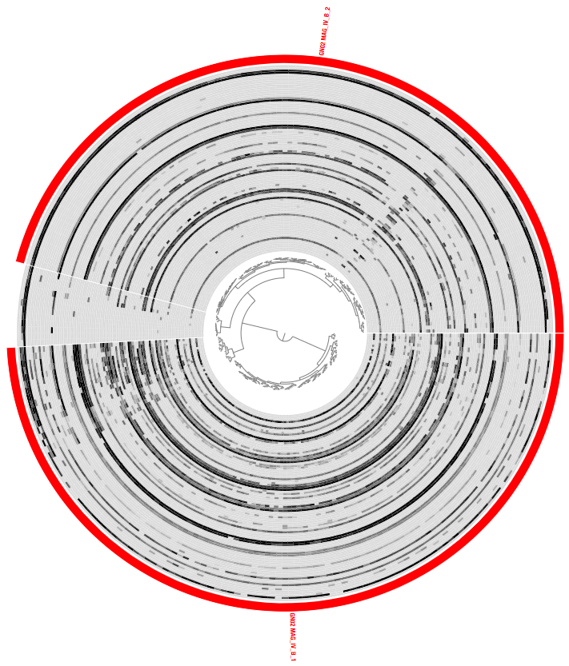](images/GN02_MAG_IV_B_final.png){:.center-img .width-60}

Much better :-)

### Generating summaries for the refined MAGs

After we finished the refine process, we generated a summary for the collections that we made in each profile database. The purpose of the summary is to have various statistics available for each MAG. In addition, during the summary process FASTA files for each of the refined MAGs are generated.

To generate a summary directory for each profile database we run the following command:

```bash
for g in GN02_MAG_IV_A GN02_MAG_IV_B TM7_MAG_III_A TM7_MAG_III_B TM7_MAG_III_C; do
    anvi-summarize -p 07_SPLIT/$g/PROFILE.db \
                      -c 07_SPLIT/$g/CONTIGS.db \
                      -C default \
                      -o 07_SPLIT/$g/SUMMARY
done
```

### Getting the completion and redundancy statistics


In order to compare between the MAGs from the original Espinoza et al publication and our refined MAGs,
we examined the completion and redundancy values that were generated using the collection of single-copy
core genes from [Campbell et al.](https://www.pnas.org/content/110/14/5540). These values are included in the bins_summary.txt
file inside each SUMMARY folder that was created by anvi-summarize.

The following file includes the completion and redundancy for the original MAGs from Espinoza et al.:

```bash
08_SUMMARY/bins_summary.txt
```

Since TM7 MAG III.A had a particularly high ammount of redundancy, anvi'o wasn't generating any completion nor redundancy values for it.
To bypass this issue, we used the another file that is available in the summary folder:

```bash
08_SUMMARY/bin_by_bin/TM7_MAG_III_A/TM7_MAG_III_A-Campbell_et_al-hmm-sequences.txt
```

This file includes the sequences for all the genes that matched the single-copy core genes from [Campbell et al.](https://www.pnas.org/content/110/14/5540).
We will use the headers of this FASTA file (yes, even though it has a ".txt" suffix, it is a FASTA file), to learn which genes are
present in TM7_MAG_III_A and with what copy number:

```bash
grep ">" 08_SUMMARY/bin_by_bin/TM7_MAG_III_A/TM7_MAG_III_A-Campbell_et_al-hmm-sequences.txt | \
        sed 's/___/#/' |\
        cut -f 1 -d \# |\
        sed 's/>//' |\
        sort |\
        uniq -c |\
        sed 's/ /\t/g' |\
        rev |\
        cut -f 1,2 |\
        rev > TM7_MAG_III_A-Campbell_et_al-hmm-occurrence.txt
```

We used the resulting file `TM7_MAG_III_A-Campbell_et_al-hmm-occurrence.txt` to calculate the completion and redundancy,
which are 84% and 138% respectively.

To generate a table with the details for our refined MAGs, we ran the following command:

```bash
head -n 1 07_SPLIT/GN02_MAG_IV_A/SUMMARY/bins_summary.txt > bins_summary_combined.txt

for g in GN02_MAG_IV_A GN02_MAG_IV_B TM7_MAG_III_A TM7_MAG_III_B TM7_MAG_III_C; do
    tail -n +2 07_SPLIT/$g/SUMMARY/bins_summary.txt >> bins_summary_combined.txt
done
```

Here is what it looks like:

```bash
$ column -t bins_summary_combined.txt
bins             taxon       total_length  num_contigs  N50    GC_content          percent_completion  percent_redundancy
GN02_MAG_IV_A_1  None        656014        130          5758   35.675872849368126  52.51798561151079   1.4388489208633093
GN02_MAG_IV_A_2  None        840154        133          7956   38.33379540838725   66.90647482014388   4.316546762589928
GN02_MAG_IV_B_1  None        934609        119          10886  25.10850812472708   78.41726618705036   0.0
GN02_MAG_IV_B_2  None        1012757       109          12715  24.99647116647001   80.57553956834532   0.7194244604316546
TM7_MAG_III_A_1   None        910899        90           14382  47.36125683516097   79.85611510791367   0.0
TM7_MAG_III_A_2   None        445398        99           5809   48.98771936204964   57.55395683453237   0.0
TM7_MAG_III_A_3   None        223971        64           3436   47.962761305917525  22.302158273381295  0.0
TM7_MAG_III_A_4   None        156413        59           2858   46.00378865630705   13.66906474820144   0.7194244604316546
TM7_MAG_III_A_5   None        150222        68           2250   47.400770761670294  15.107913669064748  0.0
TM7_MAG_III_A_6   Candidatus  138985        48           3031   44.220410307583954  10.79136690647482   0.7194244604316546
TM7_MAG_III_B_1   None        534277        233          2931   35.16218616929297   77.6978417266187    5.755395683453237
TM7_MAG_III_C_1   None        772299        440          2432   53.056877029321505  67.62589928057554   4.316546762589928
```

## Computing phylogeny

We downloaded some genomes from the NCBI in order to compute a phylogeny.
Below is a table of these genomes (we also include some metadata for each genome).

name | accession | assembly | reference | title | source | sample_type | study | HOT_designation_according_to_16S_rRNA
-- | -- | -- | -- | -- | -- | -- | -- | --
SR1_RAAC1_SR1_1_GCA_000503875_1 | GCA_000503875.1 | ftp://ftp.ncbi.nlm.nih.gov/genomes/all/GCA/000/503/875/GCA_000503875.1_ASM50387v1/GCA_000503875.1_ASM50387v1_genomic.fna.gz | https://mbio.asm.org/content/4/5/e00708-13.short | Small Genomes and Sparse Metabolisms of Sediment-Associated Bacteria   from Four Candidate Phyla | Environmental | Environmental | Kantor et al. 2013
SR1_MGEHA_GCA_000350285_1 | GCA_000350285.1 | ftp://ftp.ncbi.nlm.nih.gov/genomes/all/GCA/000/350/285/GCA_000350285.1_OR1/GCA_000350285.1_OR1_genomic.fna.gz | http://www.pnas.org/cgi/pmidlookup?view=long&pmid=23509275 | UGA is an additional glycine codon in uncultured SR1 bacteria from the   human microbiota | Human oral | subgingival_plaque | Campbell et al. 2013 | 874
SR1_HOT_345_GCA_003260355_1 | GCA_003260355.1 | ftp://ftp.ncbi.nlm.nih.gov/genomes/all/GCA/003/260/355/GCA_003260355.1_ASM326035v1/GCA_003260355.1_ASM326035v1_genomic.fna.gz | http://grantome.com/grant/NIH/R01-DE024463-04 | Culturing of the uncultured: reverse genomics and multispecies consortia   in oral | Human oral | saliva | Jouline et al | 345
GN02_HOT_871_GCA_002761215_1 | GCA_002761215.1 | ftp://ftp.ncbi.nlm.nih.gov/genomes/all/GCF/002/761/215/GCF_002761215.1_ASM276121v1/GCF_002761215.1_ASM276121v1_genomic.fna.gz | http://grantome.com/grant/NIH/R01-DE024463-04 | Culturing of the uncultured: reverse genomics and multispecies consortia   in oral | Human oral | saliva | Jouline et al | HOT-871
GN02_872_GCA_003260325_1 | GCA_003260325.1 | ftp://ftp.ncbi.nlm.nih.gov/genomes/all/GCA/003/260/325/GCA_003260325.1_ASM326032v1/GCA_003260325.1_ASM326032v1_genomic.fna.gz | http://grantome.com/grant/NIH/R01-DE024463-04 | Culturing of the uncultured: reverse genomics and multispecies consortia   in oral | Human oral | saliva | Jouline et al | HOT-872
GN02_CG1_02_38_174_GCA_001871945_1 | GCA_001871945.1 | ftp://ftp.ncbi.nlm.nih.gov/genomes/all/GCA/001/871/945/GCA_001871945.1_ASM187194v1/GCA_001871945.1_ASM187194v1_genomic.fna.gz | https://onlinelibrary.wiley.com/doi/abs/10.1111/1462-2920.13362 | Genomic resolution of a cold subsurface aquifer community provides   metabolic insights for novel microbes adapted to high CO2 concentrations | Environmental | Probst et al. 2016
TM7_RAAC3_1_GCA_000503915_1 | GCA_000503915.1 | ftp://ftp.ncbi.nlm.nih.gov/genomes/all/GCA/000/503/915/GCA_000503915.1_ASM50391v1/GCA_000503915.1_ASM50391v1_genomic.fna.gz | https://mbio.asm.org/content/4/5/e00708-13.short | Small Genomes and Sparse Metabolisms of Sediment-Associated Bacteria   from Four Candidate Phyla | Environmental | Environmental | Kantor et al. 2013
TM7x_GCA_000803625_1 | GCA_000803625.1 | ftp://ftp.ncbi.nlm.nih.gov/genomes/all/GCA/000/803/625/GCA_000803625.1_ASM80362v1/GCA_000803625.1_ASM80362v1_genomic.fna.gz | https://www.pnas.org/content/112/1/244 | Cultivation of a human-associated TM7 phylotype reveals a reduced genome and   epibiotic parasitic lifestyle | Human oral | saliva | He et al. 2015 | 952

You can downloade this table:

```bash
wget http://merenlab.org/data/refining-espinoza-mags/files/ref-genomes.txt
```

And then to download the genomes simply run:

```bash
mkdir -p 01_FASTA

while read name accession assembly reference title source sample_type study HOT_designation_according_to_16S_rRNA; do
    wget $f -O 01_FASTA/$name.fa.gz
done < ref-genomes.txt
```

In addition, we included a _Streptococcus pneumoniae_ genomes as an outlier. To download this genome run:

```bash
wget ftp://ftp.ncbi.nlm.nih.gov/genomes/all/GCF/000/147/095/GCF_000147095.1_ASM14709v1/GCF_000147095.1_ASM14709v1_genomic.fna.gz -O Streptococcus_pneumoniae_36532.fa.gz
```

In order to compute the phylogeny we used the [snakemake](https://snakemake.readthedocs.io/en/stable/index.html)-based anvi'o [phylogenomics workflow](http://merenlab.org/2018/07/09/anvio-snakemake-workflows/#phylogenomics-workflow).

This workflow includes the following steps:
1. Exporting aligned amino-acid sequences of genes that were selected by the user. Here we used a collection of ribosomal proteins.
2. Trimming the sequences with trimal.
3. Copmuting the phylogeny with iqtree.

We used the following config file PHYLOGENY-CONFIG.json:

```json
{
    "project_name": "ESPINOZA_CPR_MAGS",
    "internal_genomes": "INTERNAL-GENOMES-PHYLOGENOMICS.txt",
    "external_genomes": "EXTERNAL-GENOMES-PHYLOGENOMICS.txt",
    "anvi_get_sequences_for_hmm_hits": {
        "--return-best-hit": true,
        "--align-with": "famsa",
        "--concatenate-genes": true,
        "--get-aa-sequences": true,
        "--hmm-sources": "Campbell_et_al",
        "--gene-names": "Ribosom_S12_S23,Ribosomal_L1,Ribosomal_L10,Ribosomal_L11,Ribosomal_L11_N,Ribosomal_L13,Ribosomal_L14,Ribosomal_L16,Ribosomal_L18e,Ribosomal_L18p,Ribosomal_L19,Ribosomal_L2,Ribosomal_L21p,Ribosomal_L22,Ribosomal_L23,Ribosomal_L29,Ribosomal_L2_C,Ribosomal_L3,Ribosomal_L32p,Ribosomal_L4,Ribosomal_L5,Ribosomal_L5_C,Ribosomal_L6,Ribosomal_S11,Ribosomal_S13,Ribosomal_S15,Ribosomal_S17,Ribosomal_S19,Ribosomal_S2,Ribosomal_S3_C,Ribosomal_S4,Ribosomal_S5,Ribosomal_S5_C,Ribosomal_S6,Ribosomal_S7,Ribosomal_S8,Ribosomal_S9"
    },
    "iqtree": {
        "additional_params": "-o Streptococcus_pneumoniae_36532",
        "threads": 3
    },
    "output_dirs": {
        "PHYLO_DIR": "09_PHYLOGENOMICS_WITH_FIRMICUTES",
        "LOGS_DIR": "00_LOGS"
    }
}
```

You can download it:

```bash
wget
```

The external and internal genomes files are used for anvi-get-sequences-for-hmms-hits.

You can download these files:

```bash
wget
wget
```

And this is what they look like:

```
cat EXTERNAL-GENOMES-PHYLOGENOMICS.txt

cat INTERNAL-GENOMES-PHYLOGENOMICS.txt

```

To run the workflow we ran:

```bash
anvi-run-workflow -w phylogenomics -c PHYLOGENY-CONFIG.json
```

## Computing the pangenomes

The purpose of this section is to provide the steps to generate the pangenomes that we generated for comparing the refined and unrefined MAGs.

To download the internal and external genomes files that we used:

```bash
wget 
```
In order to generate the pangenomes we ran the following commands

```bash
mkdir -p 10_PAN

anvi-gen-genomes-storage --external-genomes SR1-EXTERNAL-GENOMES.txt \
                         --internal-genomes SR1_UNREFINED-GENOMES.txt \
                         -o 10_PAN/SR1-UNREFINED-GENOMES.db

anvi-gen-genomes-storage --external-genomes SR1-EXTERNAL-GENOMES.txt \
                         --internal-genomes SR1_REFINED-GENOMES.txt \
                         -o 10_PAN/SR1-REFINED-GENOMES.db

anvi-pan-genome -g 10_PAN/SR1-UNREFINED-GENOMES.db \
            -o 10_PAN/SR1_UNREFINED \
            --project-name SR1_UNREFINED \
            --skip-homogeneity \
            --num-threads 2 \
            --min-occurrence 2

anvi-pan-genome -g 10_PAN/SR1-REFINED-GENOMES.db \
            -o 10_PAN/SR1_REFINED \
            --project-name SR1_REFINED \
            --skip-homogeneity \
            --num-threads 2 \
            --min-occurrence 2

anvi-gen-genomes-storage --external-genomes GN02-EXTERNAL-GENOMES.txt \
                         --internal-genomes GN02_UNREFINED-GENOMES.txt \
                         -o 10_PAN/GN02-UNREFINED-GENOMES.db

anvi-gen-genomes-storage --external-genomes GN02-EXTERNAL-GENOMES.txt \
                         --internal-genomes GN02_REFINED-GENOMES.txt \
                         -o 10_PAN/GN02-REFINED-GENOMES.db

anvi-pan-genome -g 10_PAN/GN02-UNREFINED-GENOMES.db \
            -o 10_PAN/GN02_UNREFINED \
            --project-name GN02_UNREFINED \
            --skip-homogeneity \
            --num-threads 2 \
            --min-occurrence 2

anvi-pan-genome -g 10_PAN/GN02-REFINED-GENOMES.db \
            -o 10_PAN/GN02_REFINED \
            --project-name GN02_REFINED \
            --skip-homogeneity \
            --num-threads 2 \
            --min-occurrence 2

anvi-gen-genomes-storage --external-genomes TM7-EXTERNAL-GENOMES.txt \
                         --internal-genomes TM7_UNREFINED-GENOMES.txt \
                         -o 10_PAN/TM7-UNREFINED-GENOMES.db

anvi-gen-genomes-storage --external-genomes TM7-EXTERNAL-GENOMES.txt \
                         --internal-genomes TM7_REFINED-GENOMES.txt \
                         -o 10_PAN/TM7-REFINED-GENOMES.db

anvi-pan-genome -g 10_PAN/TM7-UNREFINED-GENOMES.db \
            -o 10_PAN/TM7_UNREFINED \
            --project-name TM7_UNREFINED \
            --skip-homogeneity \
            --num-threads 2 \
            --min-occurrence 2

anvi-pan-genome -g 10_PAN/TM7-REFINED-GENOMES.db \
            -o 10_PAN/TM7_REFINED \
            --project-name TM7_REFINED \
            --skip-homogeneity \
            --num-threads 2 \
            --min-occurrence 2
```

We can now take a look at one of these for example:

```bash
anvi-display-pan -p 10_PAN/TM7_REFINED/TM7_REFINED-PAN.db \
                 -g 10_PAN/TM7-REFINED-GENOMES.db
```


<div style="display: block; height: 200px;">&nbsp;</div>

