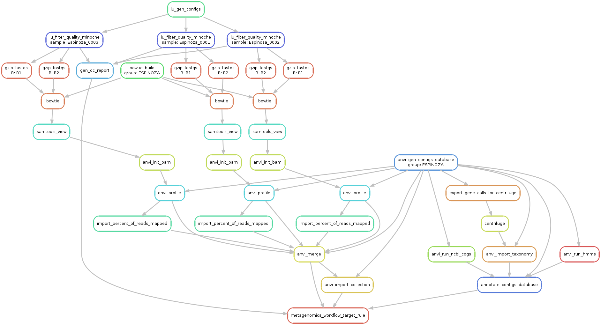
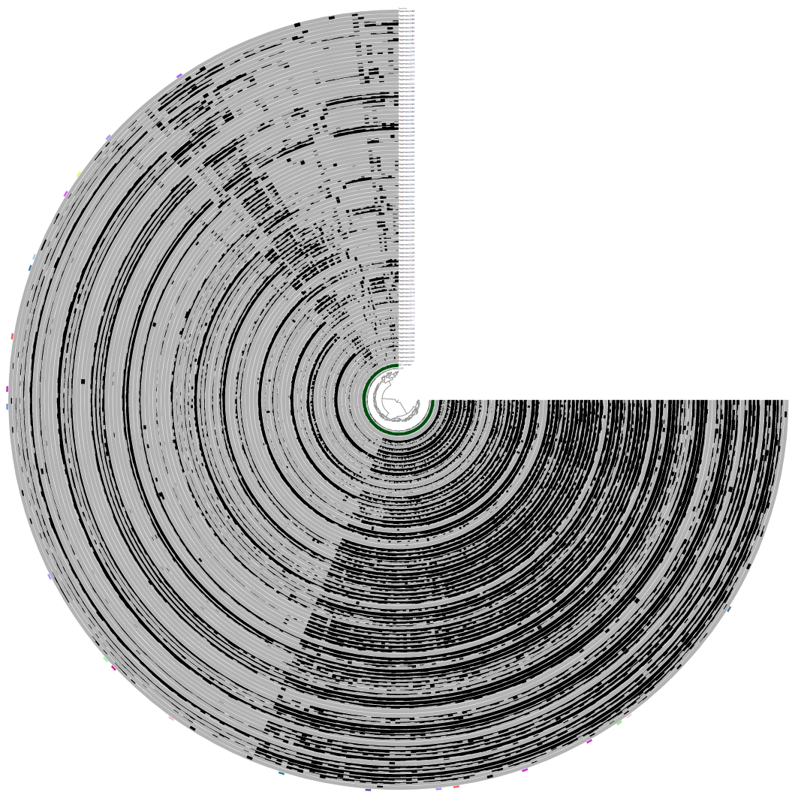
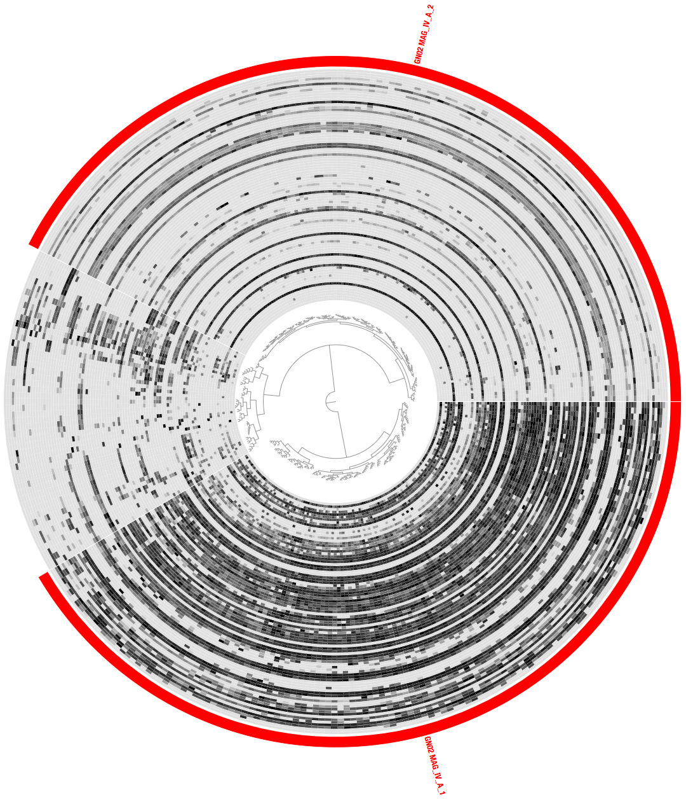




<div class="extra-info" markdown="1">

<span class="extra-info-header">Summary</span>

The purpose of this document is to demonstrate the process of refining MAGs using anvi'o.
We demonstrate how the pre-processing steps that are required prior to refinement could
be streamlined using the snakemake-based anvi'o workflows,
and provide a reproducible workflow for the refinement of key MAGs from the recent [Espinoza et al](https://mbio.asm.org/content/9/6/e01631-18) publication.
FASTA files for refined bins are listed at the very end of this document.

</div>


Please feel free to leave a comment, or send an e-mail to [us]({{ site.url }}/people/) if you have any questions.


## Setting the stage

This section explains how to download the metagenomes and MAGs from the original study by Espinoza _et al_

### Downloading the Espinoza _et al_ metagenomes

You can download raw Illumina paired-end seqeuncing data files for the 88 supragingival plaque samples into your work directory the following way:

``` bash
wget http://merenlab.org/data/refining-espinoza-mags/files/SRR_list.txt 

for SRR_accession in `cat SRR_list.txt`; do
    fastq-dump --outdir 01_RAW_FASTQ \
               --gzip \
               --skip-technical  \
               --readids \
               --read-filter pass \
               --dumpbase \
               --split-3 \
               --clip \
               $SRR_accesion
```

Once the download is finished, you should have 196 FASTQ files in your `01_RAW_FASTQ` directory, representing the paired-end reads of 88 metagenomes.

### Downloading key MAGs from Espinoza _et al_

In our reanalysis we only focused on some of the key MAGs that represented understudied lineages in the oral cavity. You can download these FASTA files from the NCBI GenBank in the following way:


```bash
mkdir -p 01_FASTA

# TM7_MAG_III_A (bin_8)
wget ftp://ftp.ncbi.nlm.nih.gov/genomes/all/GCA/003/638/965/GCA_003638965.1_ASM363896v1/GCA_003638965.1_ASM363896v1_genomic.fna.gz \
    -O 01_FASTA/TM7_MAG_III_A.fa.gz

# TM7_MAG_III_B (bin_9)
wget ftp://ftp.ncbi.nlm.nih.gov/genomes/all/GCA/003/638/935/GCA_003638935.1_ASM363893v1/GCA_003638935.1_ASM363893v1_genomic.fna.gz \
    -O 01_FASTA/TM7_MAG_III_B.fa.gz

# TM7_MAG_III_C (bin_10)
wget ftp://ftp.ncbi.nlm.nih.gov/genomes/all/GCA/003/638/915/GCA_003638915.1_ASM363891v1/GCA_003638915.1_ASM363891v1_genomic.fna.gz \
    -O 01_FASTA/TM7_MAG_III_C.fa.gz

# Alloprevotella_MAG_II_A (bin_3)
wget ftp://ftp.ncbi.nlm.nih.gov/genomes/all/GCA/003/639/005/GCA_003639005.1_ASM363900v1/GCA_003639005.1_ASM363900v1_genomic.fna.gz \
    -O 01_FASTA/Alloprevotella_MAG_II_A.fa.gz

# Alloprevotella_MAG_II_B (bin_4)
wget ftp://ftp.ncbi.nlm.nih.gov/genomes/all/GCA/003/639/155/GCA_003639155.1_ASM363915v1/GCA_003639155.1_ASM363915v1_genomic.fna.gz \
    -O 01_FASTA/Alloprevotella_MAG_II_B.fa.gz

# GN02_MAG_IV_A (bin_15)
wget ftp://ftp.ncbi.nlm.nih.gov/genomes/all/GCA/003/638/815/GCA_003638815.1_ASM363881v1/GCA_003638815.1_ASM363881v1_genomic.fna.gz \
     -O 01_FASTA/GN02_MAG_IV_A.fa.gz

# GN02_MAG_IV_B (bin_16)
wget ftp://ftp.ncbi.nlm.nih.gov/genomes/all/GCA/003/638/805/GCA_003638805.1_ASM363880v1/GCA_003638805.1_ASM363880v1_genomic.fna.gz \
     -O 01_FASTA/GN02_MAG_IV_B.fa.gz
```

{:.notice}
Initially we wanted to take a look at the Alloprevotella MAGs from Espinoza _et al_ But later we decided to focus on the CPR genomes (GN02 and TM7). Hence, while we did not refined the Alloprevotella MAGs, they were included in our workflow, and accordingly, we include them in the following steps so that repeating these steps would give the exact data the we used.


### Generating a merged FASTA file for the MAGs

We used the `anvi-run-workflow` for the next few steps (for the details of the anvi'o worfklows please read [this tutorial](http://merenlab.org/2018/07/09/anvio-snakemake-workflows/)).

To make things go a little faster, we combined all MAGs into a single FASTA file (so the mapping and profiling steps could be streamlined).

Although, in order to create a merged FASTA file, we first need to rename the headers in each FASTA file to have names that are meaningful and also acceptable for anvi'o. For that, we used the following text file, `ESPINOZA-MAGS-FASTA.txt`, which is in the format of a `fasta_txt` file as accepted by `anvi-run-workflow`.

You can download this file by running the following command:

```bash
wget http://merenlab.org/data/refining-espinoza-mags/files/ESPINOZA-MAGS-FASTA.txt
```

Here is a look into this file:

```bash
$ column -t ESPINOZA-MAGS-FASTA.txt
name                     path
TM7_MAG_III_A            01_FASTA/TM7_MAG_III_A.fa.gz
TM7_MAG_III_B            01_FASTA/TM7_MAG_III_B.fa.gz
TM7_MAG_III_C            01_FASTA/TM7_MAG_III_C.fa.gz
Alloprevotella_MAG_II_A  01_FASTA/Alloprevotella_MAG_II_A.fa.gz
Alloprevotella_MAG_II_B  01_FASTA/Alloprevotella_MAG_II_B.fa.gz
GN02_MAG_IV_A            01_FASTA/GN02_MAG_IV_A.fa.gz
GN02_MAG_IV_B            01_FASTA/GN02_MAG_IV_B.fa.gz
```

In addition, we used the following config file CONTIGS-CONFIG.json:

```json
{
    "anvi_run_ncbi_cogs": {
        "run": false
    },
    "fasta_txt": "ESPINOZA-MAGS-FASTA.txt"
}
```

You can download this file by running the following command:

```bash
wget http://merenlab.org/data/refining-espinoza-mags/files/CONTIGS-CONFIG.json
```

We used the contigs workflow to just re-format these FASTA files:

```bash
anvi-run-workflow -w contigs \
                  -c CONTIGS-CONFIG.json \
                  --additional-params \
                    --until anvi_script_reformat_fasta_prefix_only
```

This command will extract the raw FASTA files into temporary FASTA files, reformat these, and delete the extracted temporary fasta files.

At his point we can merge the fasta files into one file:

```bash
cat 01_FASTA/*/*-contigs-prefix-formatted-only.fa \
					               > 01_FASTA/ESPINOZA-MAGS-MERGED.fa
```

And we create a new `fasta_txt` file that we named `ESPINOZA-MERGED-FASTA.txt`:

```bash
echo -e "name\tpath" > ESPINOZA-MERGED-FASTA.txt
echo -e "ESPINOZA\t01_FASTA/ESPINOZA-MAGS-MERGED.fa" >> ESPINOZA-MERGED-FASTA.txt
```

It should look like this:

```bash
$ column -t ESPINOZA-MERGED-FASTA.txt
name      path
ESPINOZA  01_FASTA/ESPINOZA-MAGS-MERGED.fa
```

### Generating a collection file for the merged FASTA file

We generated a collection file that we could later use to import into the anvi'o merged profile database.
In order to generate this file, we used the following python script: `gen-collection-for-merged-fasta.py`, which you can download in the following way:

```bash
wget https://gist.githubusercontent.com/ShaiberAlon/23fc13ed56e02854bee42773672832a5/raw/3322cf23effe3325b9f8d97615f0b5af212b2fc2/gen-collection-for-merged-fasta.py
```

This script takes a `fasta_txt` file as input and generates a collection file where the name of each entry in the `fasta_txt` file is associated with the names of contigs in the respective FASTA file.

So first we had to generate a `fasta_txt` for the newly generated reformated FASTA files, which we did by running the following commands:

```bash
echo name > MAG-NAMES.txt
cut -f 1 ESPINOZA-MAGS-FASTA.txt | tail -n +2 | sort >> MAG-NAMES.txt

echo path > REFORMATTED-FASTAS.txt
ls 01_FASTA/*/*fa | sort >> REFORMATTED-FASTAS.txt

paste MAG-NAMES.txt REFORMATTED-FASTAS.txt > ESPINOZA-MAGS-REFORMATTED-FASTA.txt
rm MAG-NAMES.txt REFORMATTED-FASTAS.txt
```

This is what ESPINOZA-MAGS-REFORMATTED-FASTA.txt looks like:

```bash
column -t ESPINOZA-MAGS-REFORMATTED-FASTA.txt
name	path
Alloprevotella_MAG_II_A	01_FASTA/Alloprevotella_MAG_II_A/Alloprevotella_MAG_II_A-contigs-prefix-formatted-only.fa
Alloprevotella_MAG_II_B	01_FASTA/Alloprevotella_MAG_II_B/Alloprevotella_MAG_II_B-contigs-prefix-formatted-only.fa
GN02_MAG_IV_A	01_FASTA/GN02_MAG_IV_A/GN02_MAG_IV_A-contigs-prefix-formatted-only.fa
GN02_MAG_IV_B	01_FASTA/GN02_MAG_IV_B/GN02_MAG_IV_B-contigs-prefix-formatted-only.fa
TM7_MAG_III_A	01_FASTA/TM7_MAG_III_A/TM7_MAG_III_A-contigs-prefix-formatted-only.fa
TM7_MAG_III_B	01_FASTA/TM7_MAG_III_B/TM7_MAG_III_B-contigs-prefix-formatted-only.fa
TM7_MAG_III_C	01_FASTA/TM7_MAG_III_C/TM7_MAG_III_C-contigs-prefix-formatted-only.fa
```

Now we can generate the collection file:

```bash
python gen-collection-for-merged-fasta.py -f ESPINOZA-MAGS-REFORMATTED-FASTA.txt \
                                       -o ESPINOZA-MAGS-COLLECTION.txt
```

Here is a glimpse to the resulting `ESPINOZA-MAGS-COLLECTION.txt`:

```
column -t  ESPINOZA-MAGS-COLLECTION.txt | head -n 5
Alloprevotella_MAG_II_A_000000000001  Alloprevotella_MAG_II_A
Alloprevotella_MAG_II_A_000000000002  Alloprevotella_MAG_II_A
Alloprevotella_MAG_II_A_000000000003  Alloprevotella_MAG_II_A
Alloprevotella_MAG_II_A_000000000004  Alloprevotella_MAG_II_A
Alloprevotella_MAG_II_A_000000000005  Alloprevotella_MAG_II_A
```

In order to have the snakemake workflow use this collection automatically, and generate a summary and split databases, we need a `collections_txt` (as is explained in the `anvi-run-workflow` [tutorial](http://merenlab.org/2018/07/09/anvio-snakemake-workflows/#generating-summary-and-split-profiles)).

We named our `collections_txt` ESPINOZA-COLLECTIONS-FILE.txt.

You can download this file to your work directory:

```bash
wget http://merenlab.org/data/refining-espinoza-mags/files/ESPINOZA-COLLECTIONS-FILE.txt
```

```bash
 $ column -t ESPINOZA-COLLECTIONS-FILE.txt
name       collection_name   collection_file                contigs_mode
ESPINOZA   ORIGINAL_MAGS     ESPINOZA-MAGS-COLLECTION.txt   1
```

Notice that we set the value in the `contigs_mode` column to `1`, because our collection file `ESPINOZA-MAGS-COLLECTION.txt` contains names of contigs and not names of splits.

### Running the anvi'o metagenomic workflow

We used the snakemake-based metagenomics workflow to map the metagenomes to the merged FASTA file, and to then profile the BAM files. First we will describe all the necesary files for the workflow.

One of the key input files to start the run is the `samples.txt`. You can downlaod our `samples.txt` file into your work directory:

``` bash
wget http://merenlab.org/data/refining-espinoza-mags/files/samples.txt
```

Here is a glimpse at its contents:

``` bash
$ column -t samples.txt | head -n 5
sample         r1                                       r2
Espinoza_0001  01_RAW_FASTQ/SRR6865436_pass_1.fastq.gz  01_RAW_FASTQ/SRR6865436_pass_2.fastq.gz
Espinoza_0002  01_RAW_FASTQ/SRR6865437_pass_1.fastq.gz  01_RAW_FASTQ/SRR6865437_pass_2.fastq.gz
Espinoza_0003  01_RAW_FASTQ/SRR6865438_pass_1.fastq.gz  01_RAW_FASTQ/SRR6865438_pass_2.fastq.gz
Espinoza_0004  01_RAW_FASTQ/SRR6865439_pass_1.fastq.gz  01_RAW_FASTQ/SRR6865439_pass_2.fastq.gz
```

We used the following command to generate a 'default' config file for the metagenomics workflow,

``` bash
anvi-run-workflow -w metagenomics \
                  --get-default-config config.json
```

And edited it to instruct the workflow manager to,

- Quality filter short reads using [illumina-utils](https://github.com/merenlab/illumina-utils),
- Recruit reads from all samples using the merged FASTA file with [Bowtie2](http://bowtie-bio.sourceforge.net/bowtie2/manual.shtml),
- Profile and merge resulting files using [anvi'o](https://github.com/merenlab/anvio).
- Import the collection into the anvi'o merged profile database.
- Summarize the profile database using `anvi-summarize`.
- Split each bin into an individual contigs and merged profile database using `anvi-split`.

You can download our config file `ESPINOZA-METAGENOMICS-CONFIG.json` into your work directory:

``` bash
wget http://merenlab.org/data/refining-espinoza-mags/files/ESPINOZA-METAGENOMICS-CONFIG.json
```

The content of which should look like this:

``` json
{
    "fasta_txt": "ESPINOZA_MERGED_FASTA.txt",
    "centrifuge": {
        "threads": 2,
        "run": true,
        "db": "/groups/merenlab/00_RESOURCES/Centrifuge-NR/nt/nt"
    },
    "anvi_run_hmms": {
        "run": true,
        "threads": 5
    },
    "anvi_run_ncbi_cogs": {
        "run": true,
        "threads": 5
    },
    "anvi_script_reformat_fasta": {
        "run": false
    },
    "samples_txt": "samples.txt",
    "iu_filter_quality_minoche": {
        "run": true,
        "--ignore-deflines": true
    },
    "gzip_fastqs": {
        "run": true
    },
    "bowtie": {
        "additional_params": "--no-unal",
        "threads": 3
    },
    "samtools_view": {
        "additional_params": "-F 4"
    },
    "anvi_profile": {
        "threads": 3,
        "--sample-name": "{sample}",
        "--overwrite-output-destinations": true,
        "--profile-SCVs": true,
        "--min-contig-length": 0
    },
    "import_percent_of_reads_mapped": {
        "run": true
    },
    "references_mode": true,
    "all_against_all": true,
    "collections_txt": "ESPINOZA_ET_AL_COLLECTIONS_FILE.txt",
    "output_dirs": {
        "QC_DIR": "02_QC",
        "CONTIGS_DIR": "03_CONTIGS",
        "MAPPING_DIR": "04_MAPPING",
        "PROFILE_DIR": "05_ANVIO_PROFILE",
        "MERGE_DIR": "06_MERGED",
        "LOGS_DIR": "00_LOGS"
    }
}
```

Note that in order for this config file to work for you, the path to the centrifuge database must be fixed to match the path on your machine (or simply set centrifuge not to run by setting the "run" parameter to `false`).

We will also need the collections file ESPINOZA_ET_AL_COLLECTIONS_FILE.txt:

```bash
wget http://merenlab.org/data/refining-espinoza-mags/files/ESPINOZA_ET_AL_COLLECTIONS_FILE.txt
```

This file specifies the details that are required in order to import the collection that was generated above. This is what the file looks like:

```bash
$ cat ESPINOZA_ET_AL_COLLECTIONS_FILE.txt
name    collection_name collection_file contigs_mode
ESPINOZA        ORIGINAL_MAGS   ESPINOZA-MAGS-COLLECTION.txt    1
```

Just to make sure things look alright, we run the following command to generate a visual summary of the workflow:

``` bash
anvi-run-workflow -w metagenomics \
                  -c ESPINOZA-METAGENOMICS-CONFIG.json \
                  --save-workflow-graph
```

This original graph with all samples is way too big, but here is a subset of it with only three samples for demonstration purposes:

[](images/workflow-metagenomics){:.center-img .width-90}

We finally run this configuration the following way (the `--cluster` parameters are specific to our server, and will require you to remove that paramter, or format depending on your own server setup):

``` bash
anvi-run-workflow -w metagenomics \
                  -c ESPINOZA-METAGENOMICS-CONFIG.json \
                  --additional-params \
                      --cluster 'clusterize -log {log} -n {threads}' \
                      --resources nodes=40 \
                      --jobs 10 \
                      --rerun-incomplete
```

### Taking a look at the output files

Successful completion of the anvi'o metagenomic workflow in our case results in `00_LOGS`, `02_QC`, `03_CONTIGS`, `04_MAPPING`, `05_ANVIO_PROFILE`, `06_MERGED`, `07_SPLIT`, and `08_SUMMARY` folders. The following is the brief summary of the contents of these directories:

* `00_LOGS`: Log files for every operation done by the workflow.

* `02_QC`: Quality-filtered short metagenomic reads and final statistics file (`02_QC/qc-report.txt`).

* `03_CONTIGS`: Anvi'o contigs database with COG annotations, centrifuge taxonomy for genes, and HMM hits for single-copy core genes.

``` bash
$ ls 03_CONTIGS/*db
03_CONTIGS/ESPINOZA-contigs.db
```

* `04_MAPPING`: Bowtie2 read recruitment results for assembly outputs from quality-filtered short metagenomic reads in the form of BAM files.

* `05_ANVIO_PROFILE`: Anvi'o single profiles for each sample.

* `06_MERGED`: Anvi'o merged profile databae.

``` bash
 $ ls -R 06_MERGED
ESPINOZA

06_MERGED/ESPINOZA:
AUXILIARY-DATA.db	PROFILE.db		RUNLOG.txt		collection-import.done
```
* `07_SPLIT`: Anvi'o split merged profile databases and contigs databases for each bin in the collection.

```bash
# For each bin a folder is generated inside 07_SPLIT
ls 07_SPLIT/
Alloprevotella_MAG_II_A		GN02_MAG_IV_B			TM7_MAG_III_C
Alloprevotella_MAG_II_B		TM7_MAG_III_A			GN02_MAG_IV_A
TM7_MAG_III_B

# Here is an example for one of the split bins:
ls 07_SPLIT/Alloprevotella_MAG_II_A/
AUXILIARY-DATA.db		PROFILE.db			CONTIGS.db
```

 * `08_SUMMARY`: Anvi'o summary for the merged profile database.

## Refining the Espinoza _et al_ MAGs

We used the split profile and contigs databases to manually refine each MAG.

Here is an example way to initiate the interactive interface for one of those:

```bash
anvi-interactive -p 07_SPLIT/GN02_MAG_IV_A/PROFILE.db \
                 -c 07_SPLIT/GN02_MAG_IV_A/CONTIGS.db
```

Which should give you something that looks like this:

[](images/GN02_MAG_IV_A_initial.png){:.center-img .width-60}

In the following steps we will import a collection and a state to each of the split profile databases. The collection that we import shows our refinement for each of these MAGs. The state is just for cosmetics to make the visualization of these profile 
databases prettier.

### Importing default collections

You can get the collection files in the following way:

```bash
for g in GN02_MAG_IV_A GN02_MAG_IV_B TM7_MAG_III_A TM7_MAG_III_B TM7_MAG_III_C; do
    wget http://merenlab.org/data/refining-espinoza-mags/files/$g-default-collection.txt
    wget http://merenlab.org/data/refining-espinoza-mags/files/$g-default-collection-info.txt
done
```

Now we can import these collections:

```bash
for g in GN02_MAG_IV_A GN02_MAG_IV_B TM7_MAG_III_A TM7_MAG_III_B TM7_MAG_III_C; do
    anvi-import-collection -c 07_SPLIT/$g/CONTIGS.db \
                           -p 07_SPLIT/$g/PROFILE.db \
                           $g-default-collection.txt \
                           -C default \
                           --bins-info $g-default-collection-info.txt
done
```

### Import default states

You can download the default states in the following way:

```bash
for g in GN02_MAG_IV_A GN02_MAG_IV_B TM7_MAG_III_A TM7_MAG_III_B TM7_MAG_III_C; do
    wget http://merenlab.org/data/refining-espinoza-mags/files/$g-default-state.json
done
```

And now we can import these as default states to each profile database:
```bash
for g in GN02_MAG_IV_A GN02_MAG_IV_B TM7_MAG_III_A TM7_MAG_III_B TM7_MAG_III_C; do
    anvi-import-state -p 07_SPLIT/$g/PROFILE.db \
                      -n default \
                      -s $g-default-state.json
done
```

We can run the interactive interface again for the same MAG as earlier:

```bash
anvi-interactive -p 07_SPLIT/GN02_MAG_IV_A/PROFILE.db \
                 -c 07_SPLIT/GN02_MAG_IV_A/CONTIGS.db
```

This is what it should look like now:

[](images/GN02_MAG_IV_A_final.png){:.center-img .width-60}

Much better :-)

## Generating summaries for the refined MAGs

After we finished the refine process, we generated a summary for the collections that we made in each profile database. The purpose of the summary is to have various statistics available for each MAG. In addition, during the summary process FASTA files for each of the refined MAGs are generated.

To generate a summary directory for each profile database we run the following command:

```bash
for g in GN02_MAG_IV_A GN02_MAG_IV_B TM7_MAG_III_A TM7_MAG_III_B TM7_MAG_III_C; do
    anvi-summarize -p 07_SPLIT/$g/PROFILE.db \
                      -c 07_SPLIT/$g/CONTIGS.db \
                      -C default \
                      -o 07_SPLIT/$g/SUMMARY
done
```

## Getting the completion and redundancy statistics


In order to compare between the MAGs from the original Espinoza et al publication and our refined MAGs,
we examined the completion and redundancy values that were generated using the collection of single copy
core genes from [Campbell _et al_](https://www.pnas.org/content/110/14/5540). These values are included in the bins_summary.txt
file inside each SUMMARY folder that was created by anvi-summarize.

The following file includes the completion and redundancy for the original MAGs from Espinoza _et al_:

```bash
08_SUMMARY/bins_summary.txt
```

Since TM7 MAG III.A had a particularly high ammount of redundancy, anvi'o wasn't generating any completion nor redundancy values for it.
To bypass this issue, we used the another file that is available in the summary folder:

```bash
08_SUMMARY/bin_by_bin/TM7_MAG_III_A/TM7_MAG_III_A-Campbell_et_al-hmm-sequences.txt
```

This file includes the sequences for all the genes that matched the single copy core genes from [Campbell _et al_](https://www.pnas.org/content/110/14/5540).
We will use the headers of this FASTA file (yes, even though it has a ".txt" suffix, it is a FASTA file), to learn which genes are
present in TM7_MAG_III_A and with what copy number:

```bash
grep ">" 08_SUMMARY/bin_by_bin/TM7_MAG_III_A/TM7_MAG_III_A-Campbell_et_al-hmm-sequences.txt | \
        sed 's/___/#/' |\
        cut -f 1 -d \# |\
        sed 's/>//' |\
        sort |\
        uniq -c |\
        sed 's/ /\t/g' |\
        rev |\
        cut -f 1,2 |\
        rev > TM7_MAG_III_A-Campbell_et_al-hmm-occurrence.txt
```

We used the resulting file `TM7_MAG_III_A-Campbell_et_al-hmm-occurrence.txt` to calculate the completion and redundancy,
which are 84% and 138% respectively.

To generate a table with the details for our refined MAGs, we ran the following command:

```bash
head -n 1 07_SPLIT/GN02_MAG_IV_A/SUMMARY/bins_summary.txt > bins_summary_combined.txt

for g in GN02_MAG_IV_A GN02_MAG_IV_B TM7_MAG_III_A TM7_MAG_III_B TM7_MAG_III_C; do
    tail -n +2 07_SPLIT/$g/SUMMARY/bins_summary.txt >> bins_summary_combined.txt
done
```

Here is what it looks like:

```bash
$ column -t bins_summary_combined.txt
bins             taxon       total_length  num_contigs  N50    GC_content          percent_completion  percent_redundancy
GN02_MAG_IV_A_1  None        656014        130          5758   35.675872849368126  52.51798561151079   1.4388489208633093
GN02_MAG_IV_A_2  None        840154        133          7956   38.33379540838725   66.90647482014388   4.316546762589928
GN02_MAG_IV_B_1  None        934609        119          10886  25.10850812472708   78.41726618705036   0.0
GN02_MAG_IV_B_2  None        1012757       109          12715  24.99647116647001   80.57553956834532   0.7194244604316546
TM7_MAG_III_A_1   None        910899        90           14382  47.36125683516097   79.85611510791367   0.0
TM7_MAG_III_A_2   None        445398        99           5809   48.98771936204964   57.55395683453237   0.0
TM7_MAG_III_A_3   None        223971        64           3436   47.962761305917525  22.302158273381295  0.0
TM7_MAG_III_A_4   None        156413        59           2858   46.00378865630705   13.66906474820144   0.7194244604316546
TM7_MAG_III_A_5   None        150222        68           2250   47.400770761670294  15.107913669064748  0.0
TM7_MAG_III_A_6   Candidatus  138985        48           3031   44.220410307583954  10.79136690647482   0.7194244604316546
TM7_MAG_III_B_1   None        534277        233          2931   35.16218616929297   77.6978417266187    5.755395683453237
TM7_MAG_III_C_1   None        772299        440          2432   53.056877029321505  67.62589928057554   4.316546762589928
```

## FASTA files for refined MAGs

* [GN02_MAG_IV_A_1](http://merenlab.org/data/refining-espinoza-mags/files/GN02_MAG_IV_A_1-contigs.fa); GN02 _MAG IV.A in the original study.

* [GN02_MAG_IV_A_2](http://merenlab.org/data/refining-espinoza-mags/files/GN02_MAG_IV_A_2-contigs.fa); GN02 _MAG IV.A in the original study.

* [GN02_MAG_IV_B_1](http://merenlab.org/data/refining-espinoza-mags/files/GN02_MAG_IV_B_1-contigs.fa); GN02 _MAG IV.B in the original study.

* [GN02_MAG_IV_B_2](http://merenlab.org/data/refining-espinoza-mags/files/GN02_MAG_IV_B_2-contigs.fa); GN02 _MAG IV.B in the original study.

* [TM7_MAG_III_A_1](http://merenlab.org/data/refining-espinoza-mags/files/TM7_MAG_III_A_1-contigs.fa); TM7 MAG III.A in the original study.

* [TM7_MAG_III_A_2](http://merenlab.org/data/refining-espinoza-mags/files/TM7_MAG_III_A_2-contigs.fa); TM7 MAG III.A in the original study.

* [TM7_MAG_III_B_1](http://merenlab.org/data/refining-espinoza-mags/files/TM7_MAG_III_B_1-contigs.fa); TM7 MAG III.B in the original study.

* [TM7_MAG_III_C_1](http://merenlab.org/data/refining-espinoza-mags/files/TM7_MAG_III_C_1-contigs.fa); TM7 MAG III.C in the original study.

<div style="display: block; height: 200px;">&nbsp;</div>

