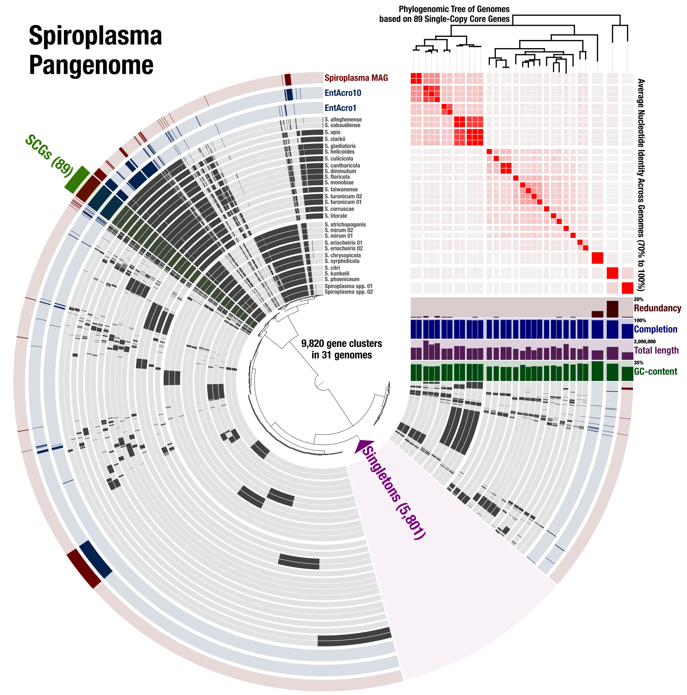
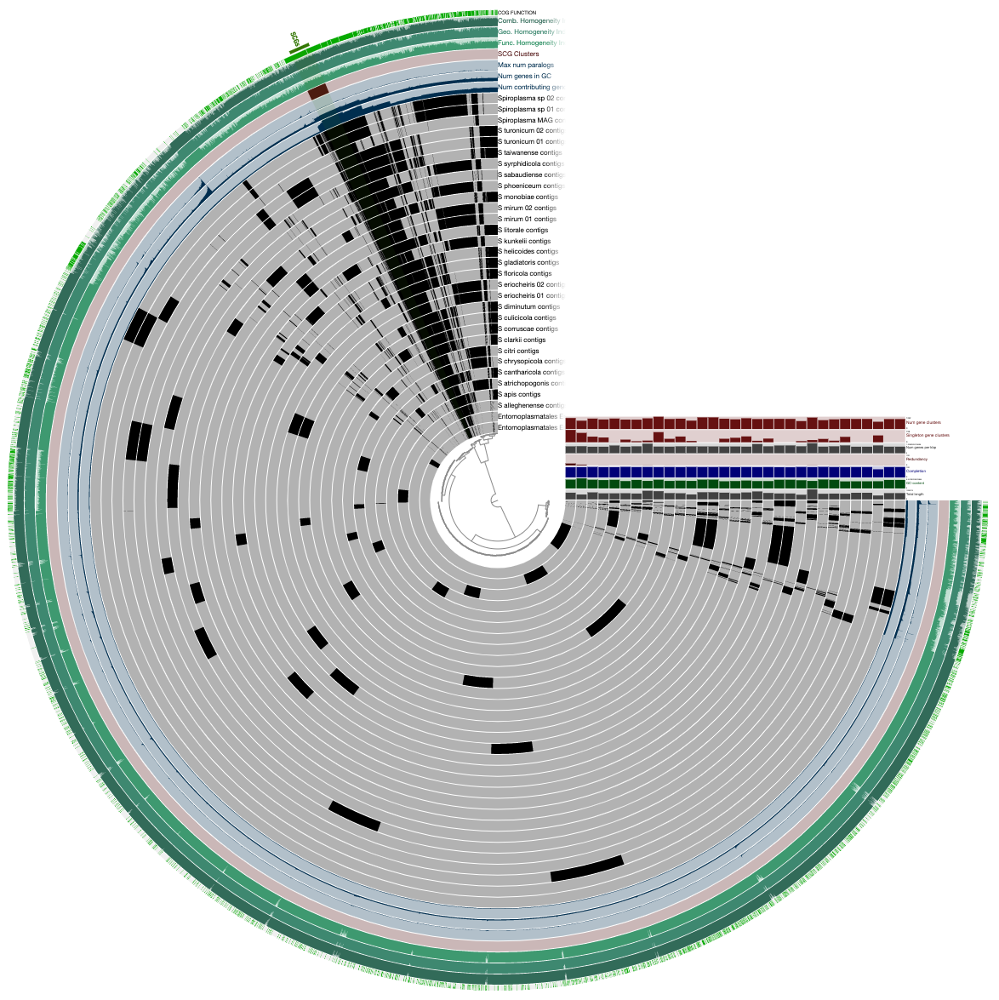
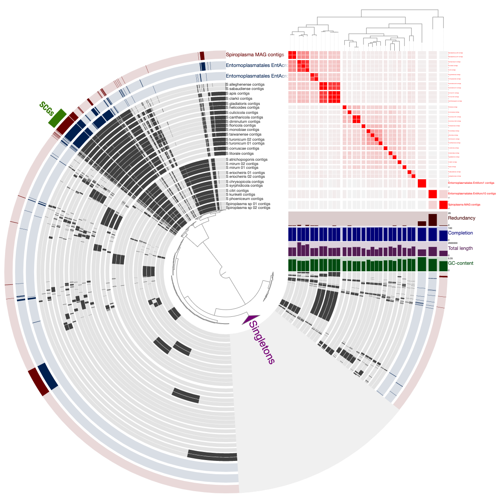



<div class="extra-info" markdown="1">

<span class="extra-info-header">Summary</span>

The purpose of this document is to provide a reproducible workflow for the pangenomics, phylogenomics, and ANI of 31 *Spiroplasma* genomes. It also includes the detailed description of how we linked all these analyses together into the following figure using anvi'o:

[](images/spiroplasma-pangenome.png){:.center-img .width-60}

{:.warning}
[doi:10.6084/m9.figshare.8201852](https://doi.org/10.6084/m9.figshare.8201852) gives access to anvi'o files to visualize, update, and edit the *Spiroplasma* pangenome.

</div>


If you have any questions, please feel free to leave a comment down below, send an e-mail to [us]({{ site.url }}/people/), or get in touch with other anvians through Slack:




## Introduction

This is a part of the collaboration we had with [Carl Yeoman](https://yeomanlab.com/) and his colleagues.

Our team here at the [Meren Lab](http://merenlab.org/) processed the raw metagenomic sequences Yeoman et al generated from [Wheat Stem Sawfly](https://en.wikipedia.org/wiki/Wheat_fly), reconsutrcuted and manually curating a novel population genome that resolved to the genus *Spiroplasma* genus, and put this genome into the context of other *Spiroplasma* genomes that are available in public databases.
12
The *Spiroplasma* genome had a GC% content of 24.56%, 754 open reading frames, components of a single ribosomal RNA operon, and 23 tRNA encoding genes. Full annotation and the genome is available through [PATRIC](https://www.patricbrc.org/view/Genome/2132.146) and the NCBI Bioproject [PRJNA540284](https://www.ncbi.nlm.nih.gov/assembly/GCA_005795965.1/).

To put this genome into the context of other *Spiroplasma* genomes we used genomes available through the NCBI and included recently published genomes from the Ixodetes clade of mollicutes by [Sapountzis et al](https://elifesciences.org/articles/39209) (named *EntAcro1* and *EntAcro10*).

{:.notice}
We tested this workflow on [anvi'o](http://merenlab.org/software/anvio/) `v5.5` and should work with anvi'o releases `v5` or later. To see the installation instructions of anvi'o please visit [here](http://merenlab.org/2016/06/26/installation-v2/).

## Metagenome assembled genomes

If you wish to fully reproduce the workflow down below, you can download the genomes we have used for this study the following way:

``` bash
# create a directory for MAGs
mkdir MAGs && cd MAGs

# download Yeoman et al. Spiroplasma genome
wget http://merenlab.org/data/spiroplasma-pangenome/files/Spiroplasma_MAG.fa.gz

# download Sapountzis et al. genomes
wget http://merenlab.org/data/spiroplasma-pangenome/files/Entomoplasmatales_EntAcro1.fa.gz
wget http://merenlab.org/data/spiroplasma-pangenome/files/Entomoplasmatales_EntAcro10.fa.gz

# unpack all and go to the upper directory
gzip -d * && cd ..
```


## Pangenomics, Phylogenomics, and ANI

To determine the relationship of the *Spiroplasma* MAG to previously published *Spiroplasma* genomes we first downloaded all genomes from the NCBI that resolve to genus *Spiroplasma* (following the protocol described in the blog post "[Accessing and including NCBI genomes in 'omics analyses in anvi'o](http://merenlab.org/2019/03/14/ncbi-genome-download-magic/)":


``` bash
ncbi-genome-download --assembly-level complete \
                     bacteria \
                     --genus Spiroplasma \
                     --metadata metadata.txt
```

Then we processed the resulting GenBank files to prepare them for an anvi'o analysis:

```
anvi-script-process-genbank-metadata -m metadata.txt \
                                     -o Spiroplasma \
                                     --output-fasta-txt Spiroplasma-fasta.txt \
                                     --exclude-gene-calls-from-fasta-txt
```

We then removed contigs that are shorter than 1,000 nucleotides from the two genomes *EntAcro1* and *EntAcro10*,

```
anvi-script-reformat-fasta ./MAGs/Entomoplasmatales_EntAcro1.fa \
                           -l 1000 \
                           -o ./MAGs/Entomoplasmatales_EntAcro1-min1K.fa

anvi-script-reformat-fasta ./MAGs/Entomoplasmatales_EntAcro10.fa \
                           -l 1000 \
                           -o ./MAGs/Entomoplasmatales_EntAcro10-min1K.fa
```

And created a `fasta.txt` (the format of which is [described here](http://merenlab.org/2018/07/09/anvio-snakemake-workflows/#fastatxt)) to run the anvi'o pangenomic workflow:

```
echo -e "Spiroplasma_MAG.fa\t`pwd`/MAGs/Spiroplasma_MAG.fa" \
                          >> Spiroplasma-fasta.txt

echo -e "Entomoplasmatales_EntAcro10\t`pwd`/MAGs/Entomoplasmatales_EntAcro10-min1K.fa" \
                          >> Spiroplasma-fasta.txt

echo -e "Entomoplasmatales_EntAcro1\t`pwd`/MAGs/Entomoplasmatales_EntAcro1-min1K.fa" \
                          >> Spiroplasma-fasta.txt
```

After editing this file to make sure names look human-readable (a copy of the final input file is [here](files/Spiroplasma-fasta.txt)), we generated a configuration that looked like this (a copy of it is [here](files/pan-config.json)), 

``` json
{
    "fasta_txt": "Spiroplasma-fasta.txt",
    "project_name": "Spiroplasma",
    "external_genomes": "external-genomes.txt"
}
```

{:.notice}
Note that the external-genomes.txt file will be generated automatically by the pangenomic workflow.

Adn finally run the [anvi'o pangenomic workflow](http://merenlab.org/2018/07/09/anvio-snakemake-workflows/#pangenomics-workflow) (with 6 cores) to get the pangenome computed:

``` bash
anvi-run-workflow -w pangenomics \
                  -c pan-config.json \
                      --additional-params \
                          --jobs 6 \
                          --resources nodes=6
```

This took about 15 minutes on a laptop computer. This workflow generated a new directory in our working space called `03_PAN`, which included the pan database and genomes storage files.

To add a heatmap that shows the average nucleotide identity estimates across genomes, we run the following command, which uses PyANI program in the background and adds the ANI information into the pan database automatically:

```
anvi-compute-ani -e external-genomes.txt \
                 -o ANI \
                 -p 03_PAN/Spiroplasma-PAN.db \
                 -T 6
```

To infer evolutionary associations between 31 geomes in our pangenome, we used single-copy core genes (SCGs) across all genomoes for a phylogenomic analysis. To recover a FASTA file for individually aligned and concatenated SCGs specific to the pangenome, we run the following command:

```
anvi-get-sequences-for-gene-clusters -p 03_PAN/Spiroplasma-PAN.db \
                                     -g 03_PAN/Spiroplasma-GENOMES.db \
                                     --min-num-genomes-gene-cluster-occurs 31 \
                                     --max-num-genes-from-each-genome 1 \
                                     --concatenate-gene-clusters \
                                     --output-file 03_PAN/Spiroplasma-SCGs.fa
```

This resulted in a FASTA file, which we first cleaned up by removing nucleotdie positions that were gap characters in more than 50% of the seqeunces using [trimAl](https://github.com/scapella/trimal),

```
trimal -in 03_PAN/Spiroplasma-SCGs.fa \
       -out 03_PAN/Spiroplasma-SCGs-clean.fa \
       -gt 0.50
```

And run the phylogenomic analysis using [IQ-TREE](http://www.iqtree.org/) with the 'WAG' general matrix model to infer a maximum likelihood tree:

```
iqtree -s 03_PAN/Spiroplasma-SCGs-clean.fa \
       -nt 8 \
       -m WAG \
       -bb 1000
```

In order to organize genomes in the pangenome during the visualization step, we generated a 'layers order' file (the format of which is explained here), and imported it into the pan database:

``` bash
# generate the file
echo -e "item_name\tdata_type\tdata_value" \
         > 03_PAN/Spiroplasma-phylogenomic-layer-order.txt

# add the newick tree as an order
echo -e "SCGs_Bayesian_Tree\tnewick\t`cat 03_PAN/Spiroplasma-SCGs-clean.fa.contree`" \
        >> 03_PAN/Spiroplasma-phylogenomic-layer-order.txt

# import the layers order file
anvi-import-misc-data -p 03_PAN/Spiroplasma-PAN.db \
                      -t layer_orders 03_PAN/Spiroplasma-phylogenomic-layer-order.txt
```

At this point all the information was in the database, so we visualized it using the following command.

```
anvi-display-pan -p 03_PAN/Spiroplasma-PAN.db \
                 -g 03_PAN/Spiroplasma-GENOMES.db
```

Which opened an interactive interface with the pangenome.


## Polishing the pangenome

We find it critical to properly visualize complex data, and often put the extra effor to prepare and polish our visualizations for publication. 

This figure shows the initial/raw display of the pangenome:

[](images/spiroplasma-pangenome-raw.png){:.center-img .width-70}

We polished this display by (1) displaying teh phylogenomic tree and (2) the ANI estimates we computed and stored in the pan database prevoiusly through the following steps:

- Click **Draw** after the interface first opens.
- Click **Settings > Layers > Layer Groups > ANI_percentage_identity** to display the ANI heatmap.
- Select all ANI layers by selecting ANI_percentage_identity from **Settings > Layers > Select all layers in a group**.
- Increase the minimum values for each ANI layer all at once by entering 0.7 in **Settings > Layers > Edit attributes for multiple layers > Min**.
- Click **Settings > Layers > Redraw layer data** to see changes.
- Select 'SCG_Phylogeny from **Settings > Layers > Order** by combo box to order genomes by the phylogenomic tree
- Incrase the radius of the dendrogram in the center by entering 6000 in **Settings > Main > Show Additional Settings > Dendrogram > Radius**
- Incrase the height of the phylogenomic tree on the right-top by entering 2000 in **Settings > Layers > Tree/Dendrogram > Height**
- Incrase the size and selections layer by entering 400 in **Settings > Main > Additional Settings > Selections > Height**
- Click **Settings > Main > Show Additional Settings > Custom margins** to enable custom margins
- Use **Settings > Main > Layers** to incrase genome / group distances using the margin column
- Command-right-click to the branch of singletons and click Collapse from the menu
- Reduce the opacity of layer bacgrounds by setting 0.15 to  **Settings > Main > Show Additional Settings > Layers > Background opacity**
- Increase the maximum font size by entering 240 in  **Settings > Main > Show Additional Settings > Layer Labels > Max. Font Size**
- Click **Draw** to see changes

Which gave gave us this display:

[](images/spiroplasma-pangenome-polished.png){:.center-img .width-70}


We then used the Save SVG button that is located in Settings panel bottom-right to download the SVG file, and urther polished labels in Inkscape to acquire this final figure:

[](images/spiroplasma-pangenome.png){:.center-img .width-70}

{:.warning}
[doi:10.6084/m9.figshare.8201852](https://doi.org/10.6084/m9.figshare.8201852) gives access to anvi'o files to visualize, update, and edit the *Spiroplasma* pangenome.

If you have any questions, please feel free to leave a comment down below, send an e-mail to [us]({{ site.url }}/people/), or get in touch with other anvians through Slack:



<div style="display: block; height: 200px;">&nbsp;</div>

