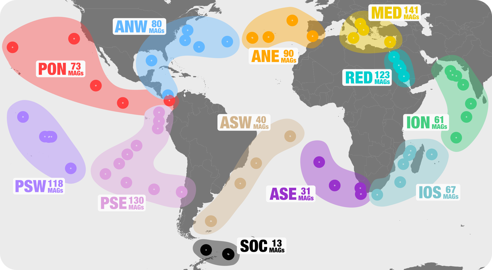
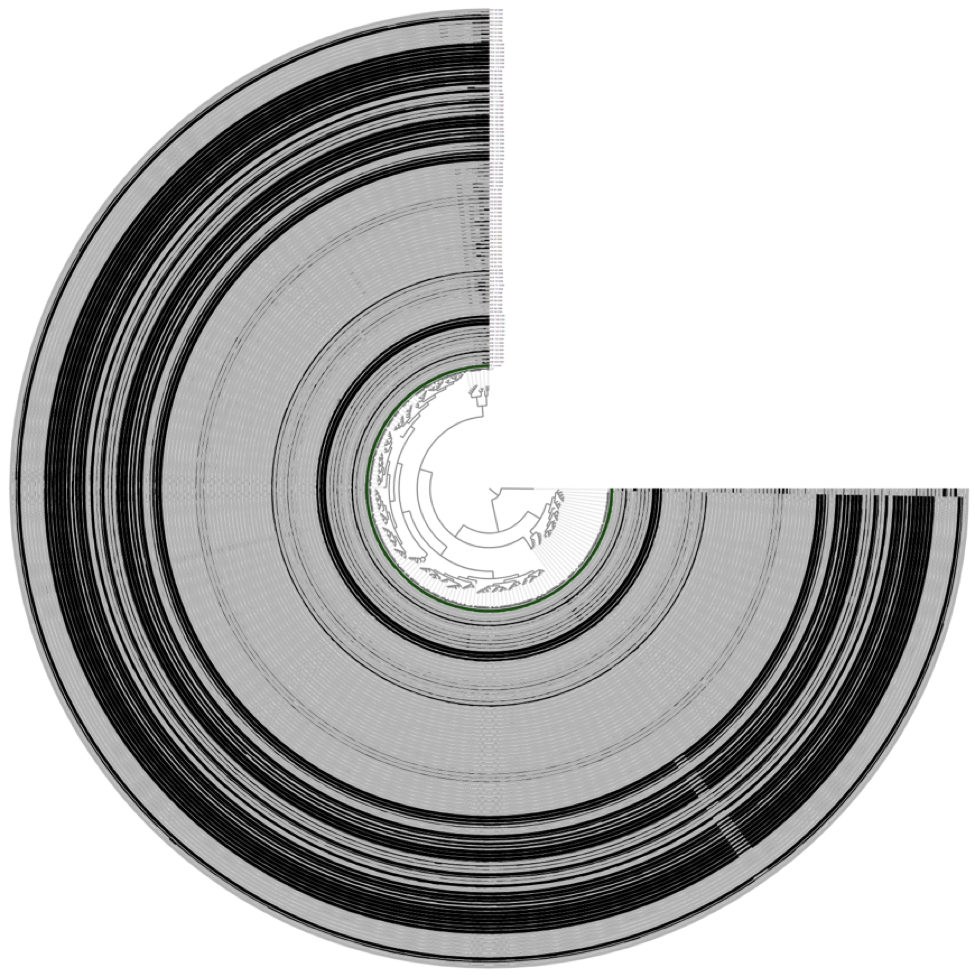

This document describes the reproducible bioinformatics workflow we used to recover and characterize metagenome-assembled genomes (MAGs) from the TARA Oceans metagenomic co-assemblies, some of which are described in the following study:

<div class="pub_float">
<div class='altmetric-embed' data-badge-type='donut' data-doi="10.1038/s41564-018-0176-9"></div>
<div class="__dimensions_badge_embed__" data-doi="10.1038/s41564-018-0176-9" data-hide-zero-citations="true" data-legend="hover-bottom" data-style="small_circle"></div>
    <h3><a href=" https://doi.org/10.1038/s41564-018-0176-9" target="_new">Nitrogen-fixing populations of Planctomycetes and Proteobacteria are abundant in the surface ocean metagenomes.</a></h3>
    <span class="pub-authors"><span class="pub-member-author">Delmont, T. O.</span>, Quince, C., <span class="pub-member-author">Shaiber, A.</span>, <span class="pub-member-author">Esen, Ö. C.</span>, <span class="pub-member-author">Lee, S. T. M.</span>, Rappé, M. S., McLellan, S. L., Lücker, S., and <span class="pub-member-author">Eren, A. M</span>.</span>
    <div class="pub-info">
    <div class="pub-featured-image">
    <a href="http://i.imgur.com/oFRefc4.jpg"></a>
    </div>
    <div class="pub-highlights">
    <span style="display: inline-block; padding-bottom: 5px;">- First genomic evidence for abundant and widespread non-cyanobacterial nitrogen-fixing populations in the surface ocean.</span><br><span style="display: inline-block; padding-bottom: 5px;">-  Nearly 1,000 non-redundant, high-quality bacterial, archaeal, and eukaryotic population genomes from TARA Oceans metagenomes.</span><br><span style="display: inline-block; padding-bottom: 5px;">-  A "behind the paper" <a href="https://naturemicrobiologycommunity.nature.com/users/113363-a-murat-eren-meren/posts/34040-microbiologists-vs-shotgun-metagenomes-surface-ocean" target="_blank">blog post</a> by Meren, a <a href="http://www.mbl.edu/blog/large-scale-study-indicates-novel-and-abundant-nitrogen-fixing-microbes-in-the-surface-ocean/" target="_blank">press release</a> by the MBL, and an extensive description of <a href="http://merenlab.org/data/tara-oceans-mags/" target="_blank">the bioinformatics workflow</a>.</span>
    </div>
    </div>
    <span class="pub-journal"><i>Nature Microbiology</i>. <b>3:804–813</b></span>
</div>

{:.notice}
The URL [http://merenlab.org/data/#genomes-from-tara-oceans-metagenomes](http://merenlab.org/data/#genomes-from-tara-oceans-metagenomes) serves all public data items our study used or produced.

{:.notice}
The URL [http://merenlab.org/data/tara-oceans-mags/](http://merenlab.org/data/tara-oceans-mags/) serves the most up-to-date version of this document.

The document contains final and intermediate data products, as well as program names and exact parameters used throughout every step of the analysis of the TARA Oceans metagenomes, which relied predominantly on the open-source analysis platform, [anvi’o](http://merenlab.org/software/anvio) (Eren et al., 2015).

<div class="extra-info" markdown="1">

<span class="extra-info-header">Intermediate and Final Public Data Products</span>

<div style="width: 200px; float: right; padding-left: 20px;">
<a href="https://anvi-server.org/merenlab/tara_hbds" target="_blank"></a>
</div>

* The original **TARA Oceans metagenomes** are available through the European Bioinformatics Institute ([ERP001736](https://www.ebi.ac.uk/metagenomics/projects/ERP001736)) and NCBI ([PRJEB1787](https://www.ncbi.nlm.nih.gov/sra/?term=PRJEB1787)).

* [doi:10.6084/m9.figshare.4902920](https://doi.org/10.6084/m9.figshare.4902920): Our **raw assembly** outputs per region.

* [doi:10.6084/m9.figshare.4902917](https://doi.org/10.6084/m9.figshare.4902917): All **amino acid sequences** in our raw assemblies.

* [doi:10.6084/m9.figshare.4902923](https://doi.org/10.6084/m9.figshare.4902923): **FASTA files** for 957 non-redundant metagenome-assembled genomes.

* [doi:10.6084/m9.figshare.4902941](https://doi.org/10.6084/m9.figshare.4902941): **Self contained anvi'o profiles** for each non-redundant MAG (each of which can be visualized interactively through the program `anvi-interactive` offline).

* [doi:10.6084/m9.figshare.4902926](https://doi.org/10.6084/m9.figshare.4902926): A **static HTML output** for the anvi'o merged profile database for non-redundant MAGs (double-click the index.html file after download).

* [doi:10.6084/m9.figshare.4902938](https://doi.org/10.6084/m9.figshare.4902938): Main and Supplementary Tables and Figures. Which includes **Figure 1** (geographically bounded metagenomic co-assemblies), **Figure 2** (the nexus between phylogeny and function of HBDs), **Figure 3** (Phylogeny of nitrogen fixation genes), **Figure 4** (the abundance of nitrogen-fixing populations of Planctomycetes and Proteobacteria across oceans), **Supplementary Figure 1** (phylogenetic analysis of nifH genes), **Supplementary Table 1** (the summary of the 93 metagenomes from TARA Oceans, and the twelve geographic regions they represent), **Supplementary Table 2** (the summary of the co-assembly and binning outputs for each metagenomic set), **Supplementary Table 3** (genomic features of 957 MAGs from the non-redundant genomic database including the taxonomy for each MAG, the mean coverage, relative distribution, detection and number of recruited reads for each MAG across the 93 metagenomes, etc), **Supplementary Table 4** (the 16S rRNA gene sequence identified in HBD-09), **Supplementary Table 5** (genomic features, Pearson correlation (based on the relative distribution in 93 metagenomes), **Supplementary Table 6** (RAST subsystems and KEGG modules for the nine HBDs), **Supplementary Table 7** (nifH gene sequences in MAGs, orphan scaffolds, as well as the reference sequence γ-24774A11, along with their mean coverage across the 93 metagenomes), **Supplementary Table 8** (Genomic features of 30,244 bins manually characterized from the 12 metagenomic sets. Completion and redundancy estimates are based on the average of four bacterial single-copy gene collections), **Supplementary Table 9** (KEGG annotation for 1,077 MAGs), and **Supplementary Table 10** (Relative distribution of 1,077 MAGs across the 93 metagenomes).

* An interactive visualization for the phylogenomic analysis of 432 Proteobacteria and 43 Planctomycetes metagenome-assembled genomes from our database of 957 non-redundant MAGs is also available: [here](https://anvi-server.org/merenlab/tara_hbds).
</div>


{:.notice}
All anvi'o analyses in this document are performed using the anvi'o version `v2.3.0`. Please see [the installation notes]() to acquire the appropriate version through PyPI, Docker, or GitHub. Most anvi'o commands should continue to work in most up-to-date anvi'o versions, but some adjustments may be necessary. Please feel free to get in touch with us if you need help.

The following sections describe steps to download, quality-filter, and co-assemble the raw metagenomic data, followed by the recovery and characterization of a non-redundant database of metagenome-assembled genomes through binning and curation steps.

## Setting the stage

This section explains how to download short metagenomic reads from the TARA Oceans project (Sunagawa et al., 2015), quality-filtering the raw data, defining metagenomic sets, and generating co-assemblies for each set.

{:.notice}
The TARA Oceans metagenomes we analyzed are publicly available through the __European Bioinformatics Institute__ (EBI) repository and __NCBI__ under project IDs `ERP001736` and `PRJEB1787`, respectively.

### Downloading the TARA Oceans metagenomes

The following file contains FTP URLs for each raw data file for 93 samples:

{:.notice}
[http://merenlab.org/data/tara-oceans-mags/files/ftp-links-for-raw-data-files.txt](http://merenlab.org/data/tara-oceans-mags/files/ftp-links-for-raw-data-files.txt)

You can get a copy of this file into your work directory,

``` bash
wget http://merenlab.org/data/tara-oceans-mags/files/ftp-links-for-raw-data-files.txt
```


and download each of the raw sequencing data file from the EMBL servers:

``` bash
for url in `cat ftp-links-for-raw-data-files.txt`
do
    wget $url
done
```

### Defining metagenomic sets, setting sample names, and linking those with the raw data

We defined 12 'metagenomic sets' for geographically bound locations TARA Oceans samples originated from. These metagenomic sets are described in Figure 1:

{:.center-img .width-70}

We tailored our sample naming schema for convenience and reproducibility. The following address contains a file with three-letter identifiers for each of the 12 metagenomic set, which will become prefixes for each sample name for direct access to all samples from a given metagenomic set:

{:.notice}
[http://merenlab.org/data/tara-oceans-mags/files/sets.txt](http://merenlab.org/data/tara-oceans-mags/files/sets.txt)

This file will be referred to as `sets.txt` throughout the document, and you can get a copy of this file into your work directory:

``` bash
wget http://merenlab.org/data/tara-oceans-mags/files/sets.txt
```

The contents of the TARA sets file should look like this:

``` bash
$ cat sets.txt
ANE
ANW
ASE
ASW
ION
IOS
MED
PON
PSE
PSW
RED
SOC
```

We used these three-letter prefixes to name each of the 93 samples, and to associate them with metagenomic sets with which they were affiliated. Sample names, and which raw data files are associated with each sample is explained in the following TAB-delimited file:

{:.notice}
[http://merenlab.org/data/tara-oceans-mags/files/samples.txt](http://merenlab.org/data/tara-oceans-mags/files/samples.txt)

This file will be referred to as `samples.txt` throughout the document, and you can get a copy of this file into your work directory:

``` bash
wget http://merenlab.org/data/tara-oceans-mags/files/samples.txt
```

TARA samples file should look like this:

``` bash
$ wc -l samples.txt
      94 samples.txt
$ head samples.txt
sample     r1                            r2
MED_18_05M ERR599140_1.gz,ERR598993_1.gz ERR599140_2.gz,ERR598993_2.gz
MED_23_05M ERR315858_1.gz,ERR315861_1.gz ERR315858_2.gz,ERR315861_2.gz
MED_25_05M ERR599043_1.gz,ERR598951_1.gz ERR599043_2.gz,ERR598951_2.gz
MED_30_05M ERR315862_1.gz,ERR315863_1.gz ERR315862_2.gz,ERR315863_2.gz
RED_31_05M ERR599106_1.gz,ERR598969_1.gz ERR599106_2.gz,ERR598969_2.gz
RED_32_05M ERR599041_1.gz,ERR599116_1.gz ERR599041_2.gz,ERR599116_2.gz
RED_33_05M ERR599049_1.gz,ERR599134_1.gz ERR599049_2.gz,ERR599134_2.gz
RED_34_05M ERR598959_1.gz,ERR598991_1.gz ERR598959_2.gz,ERR598991_2.gz
ION_36_05M ERR599143_1.gz,ERR598966_1.gz ERR599143_2.gz,ERR598966_2.gz
```

This file above also represents the standard input for illumina-utils library for processing the raw metagenomic data for each sample.


### Quality-filtering of raw reads

We used the [illumina-utils library](https://github.com/meren/illumina-utils) v1.4.1 (Eren et al., 2013)  to remove noise from raw reads prior to assembly.

To produce the configuration files [illumina utils requires](https://github.com/merenlab/illumina-utils#config-file-format), we first run the program `iu-gen-configs` on the file `samples.txt`:

``` bash
iu-gen-configs samples.txt
```

This step should generate 93 config files with the extension of '.ini' in the working directory.

To perform the quality filtering on samples ini files describe, we used the program `iu-filter-quality-minoche` with default parameters, which implements the approach detailed in Minoche et al. (Minoche et al., 2011):

``` bash
for sample in `awk '{print $1}' samples.txt`
do
    if [ "$sample" == "sample" ]; then continue; fi
    iu-filter-quality-minoche $sample.ini --ignore-deflines
done
```

This step generated files that summarize the quality filtering results for each sample,

``` bash
$ cat ASW_82_40M-STATS.txt
number of pairs analyzed      : 222110286
total pairs passed            : 204045433 (%91.87 of all pairs)
total pairs failed            : 18064853 (%8.13 of all pairs)
  pairs failed due to pair_1  : 3237955 (%17.92 of all failed pairs)
  pairs failed due to pair_2  : 8714230 (%48.24 of all failed pairs)
  pairs failed due to both    : 6112668 (%33.84 of all failed pairs)
  FAILED_REASON_N             : 302725 (%1.68 of all failed pairs)
  FAILED_REASON_C33           : 17762128 (%98.32 of all failed pairs)
```

as well as the FASTQ files for each sample that contain quality-filtered reads for downstream analyses.

The resulting `*-QUALITY_PASSED_R*.fastq.gz` files in the work directory represent the main inputs for all co-assembly and mapping steps.


### Co-assembling metagenomic sets

We used the program MEGAHIT v1.0.3 (Li et al., 2014) to perform 12 metagenomic co-assemblies for each geographically bound metagenomic sets.

<div class="extra-info" markdown="1">

<span class="extra-info-header">The rationale for co-assemblies</span>
The rationale of doing this was that metagenomes originating from adjacent geographic regions (e.g., the Mediterranean Sea) were more likely to overlap in the sequence space, increasing the mean coverage (and hence the extent of reconstruction) of microbial genomes during the co-assembly.
</div>

We used MEGAHIT the following way to individually co-assemble each metagenomic set:

``` bash
for SET in `cat sets.txt`
do
    megahit -1 $SET*-QUALITY_PASSED_R1.fastq.gz \
            -2 $SET*-QUALITY_PASSED_R2.fastq.gz \
            --min-contig-len 1000 \
            -o $SET-RAW.fa \
            --num-cpu-threads 80
done
```

{:.notice}
Assembly of large metagenomic data is a very memory-intensive process, and we used a computer with 2 TB memory and 80 cores to co-assemble each metagenomic set in a serial manner.

### Simplifying deflines of FASTA files

After completion of the co-assemblies, we used the program `anvi-script-reformat-fasta` the following way to __simplify the header names of all scaffolds__. This step insured that all characters used in the scaffold names were compatible with the downstream anvi’o analyses:

``` bash
for SET in `cat sets.txt`
do
    anvi-script-reformat-fasta $SET-RAW.fa \
                               --simplify-names \
                               -o $SET-RAW-FIXED.fa \
                               --prefix $SET
    mv $SET-RAW-FIXED.fa $SET-RAW.fa
done
```

{:.notice}
We made publicly available ([doi:10.6084/m9.figshare.4902920](https://doi.org/10.6084/m9.figshare.4902920)) the resulting FASTA files as `RAW-ASSEMBLIES-1000nt`.

<iframe src="https://widgets.figshare.com/articles/4902920/embed?show_title=1" width="100%" height="400" frameborder="0"></iframe>


## Binning MAGs

### Generating anvi'o contigs databases for each metagenomic set

Both the tetra-nucleotide frequency and differential mean coverage of scaffolds across metagenomes are instrumental to accurate binning of scaffolds into metagenomic bins. To prepare for the binning step, we first __removed scaffolds too short to produce a reliable tetra-nucleotide frequency__ using the program `anvi-script-reformat-fasta `, and then used the program `anvi-gen-contigs-database` with default parameters to __profile all scaffolds and generate an [anvi'o contigs database](http://merenlab.org/2016/06/22/anvio-tutorial-v2/#creating-an-anvio-contigs-database)__ that stores the nucleic acid sequence, tetra-nucleotide frequency, GC-content, and the coordinates of genes Prodigal v2.6.3 (Hyatt et al., 2010) identified:

``` bash
for SET in `cat sets.txt`
do
    # skip the Southern Ocean set
    if [ "$SET" == "SOC" ]; then continue; fi

    anvi-script-reformat-fasta $SET-RAW.fa –-min-len 2500 --simplify-names -o $SET.fa
    anvi-gen-contigs-database -f $SET.fa -o $SET-CONTIGS.db
done
```

An exception to the `>2.5 kbp` selection was the Southern Ocean metagenomic set (SOC), for which we generated a file containing scaffolds `>5 kbp` to increase the accuracy of tetra-nucleotide frequency signal to recover from the smaller contribution of differential coverage due to the limited number of samples collected from this region:

``` bash
anvi-script-reformat-fasta SOC-RAW.fa –-min-len 5000 --simplify-names -o SOC.fa
anvi-gen-contigs-database -f SOC.fa -o SOC-CONTIGS.db
```

{:.notice}
The 12 FASTA files corresponding to the selected scaffolds for each co-assembly are also available under the NCBI BioProject ID `PRJNA326480` ([direct link](https://www.ncbi.nlm.nih.gov/bioproject/?term=PRJNA326480)).

### Identifying single-copy core genes

We used the program `anvi-run-hmms` to identify genes in the CONTIGS databases matching to archaeal and bacterial single-copy core gene collections using HMMER v3.1b2 (Eddy, 2011):

``` bash
for SET in `cat sets.txt`
do
    anvi-run-hmms -c $SET-CONTIGS.db --num-threads 20
done
```


This step stores single-copy core gene hits per scaffold in the corresponding anvi'o contigs database, which becomes instrumental to assess the completion and redundancy of bins in real time during the manual binning and refinement steps in the anvi’o interactive interface.

### Taxonomical annotations of genes

Aside from the tetra-nucleotide frequency and differential mean coverage of scaffolds across metagenomes, the taxonomy of scaffolds can in some cases be used to improve the metagenomic binning.

We assigned taxonomy to genes in scaffolds for each metagenomic set in three steps. First, we used the program `anvi-get-dna-sequences-for-gene-calls` to export nucleic acid sequences corresponding to the gene calls from each anvi'o contigs database. Then we used Centrifuge (Kim et al., 2016) and an index of NCBI's nr database to assess the taxonomy of genes, and finally used the program `anvi-import-taxonomy` to import this information back into the 12 anvi'o contigs databases.

The URL [http://merenlab.org/2016/06/18/importing-taxonomy](http://merenlab.org/2016/06/18/importing-taxonomy) serves a detailed description of these steps.

### Recruitment of metagenomic reads.

The recruitment of metagenomic reads is commonly used to assess the coverage of scaffolds across metagenomes, which provides the essential differential coverage information that is employed by anvi'o and other binning approaches to improve metagenomic binning.

For each metagenomic set, we mapped short reads from the corresponding metagenomes (e.g., 6 for the  Atlantic Ocean northwest) onto the scaffolds using Bowtie2 v2.0.5 (Langmead and Salzberg, 2012). We stored the recruited reads as BAM files using samtools (Li et al., 2009).

First we built Bowtie2 databases for each metagenomic set:

``` bash
for SET in `cat sets.txt`
do
    bowtie2-build $SET.fa $SET
done
```

We then mapped each sample against the scaffolds recovered from the corresponding metagenomic set:

``` bash
for sample in `awk '{print $1}' samples.txt`
do
    if [ "$sample" == "sample" ]; then continue; fi

    # determine which metagenomic set the $sample belongs to:
    SET=`echo $sample | awk 'BEGIN {FS="_"}{print $1}'`

    # do the bowtie mapping to get the SAM file:
    bowtie2 --threads 20 \
            -x $SET \
            -1 $sample-QUALITY_PASSED_R1.fastq.gz \
            -2 $sample-QUALITY_PASSED_R2.fastq.gz \
            --no-unal \
            -S $sample.sam

    # covert the resulting SAM file to a BAM file:
    samtools view -F 4 -bS $sample.sam > $sample-RAW.bam

    # sort and index the BAM file:
    samtools sort $sample-RAW.bam -o $sample.bam
    samtools index $sample.bam

    # remove temporary files:
    rm $sample.sam $sample-RAW.bam

done
```

This process resulted in sorted and indexed BAM files for each sample that describe the mapping of short reads to scaffolds in their corresponding metagenomic sets.

### Profiling the mapping results with anvi'o

After recruiting metagenomic short reads using scaffolds stored in anvi'o contigs databases, we used the program `anvi-profile` to process the BAM files and __generate anvi'o profile databases that contain the coverage and detection statistics of each scaffold__ in a given metagenome:

``` bash
for sample in `awk '{print $1}' samples.txt`
do
    if [ "$sample" == "sample" ]; then continue; fi

    # determine which metagenomic set the $sample bleongs to:
    SET=`echo $sample | awk 'BEGIN {FS="_"}{print $1}'`

    anvi-profile -c $SET-CONTIGS.db \
                 -i $sample.bam \
                 --skip-SNV-profiling \
                 --num-threads 16 \
                 -o $sample

done
```

{:.notice}
We skipped the profiling of single-nucleotide variants (SNVs) for this particular project to minimize the computing time and the volume of resulting anvi'o files, but we generally suggest the inclusion of this step.

{:.notice}
Please read the following article for parallelization of anvi'o profiling (details of which can be important to consider especially if you are planning to clusterize it): [The new anvi'o BAM profiler]().

### Generating merged anvi'o profiles

Once the profiles were generated, we used the program `anvi-merge` to generate a merged anvi'o profile for each metagenomic set. An anvi'o merged profile database contains the coverage and detection statistics for each scaffold across multiple metagenomes.

We generated merged anvi'o profiles for each metagenomic set the following way:

``` bash
for SET in `cat sets.txt`
do
    anvi-merge $SET*/PROFILE.db -o $SET-MERGED -c $SET-CONTIGS.db
done
```

### Initial automated binning with CONCOCT

Although merging anvi'o profile databases make available the differential coverage values which are
essential for binning, the number of scaffolds anvi’o can simultaneously process during the merging
step is limited due to the costly step of hierarchical clustering. In order to cope with the large
co-assemblies generated in this study, we first used the program `anvi-cluster-with-concoct` **to
organize scaffolds into a defined number of clusters** with the automatic binning algorithm CONCOCT
(Alneberg et al., 2014):

``` bash
for SET in `cat sets.txt`
do
    anvi-cluster-with-concoct -c $SET-CONTIGS.db \
                              -p $SET-MERGED/PROFILE.db \
                              --num-clusters 100 \
                              -C CONCOCT
done
```

{:.notice}
anvi-cluster-with-concoct has been superseded with anvi-cluster-contigs

This step generates a collection of 100 clusters called `CONCOCT` in each of the anvi'o merged profile database for each metagenomic set.

Two exceptions were the Southern Ocean (SOC) and Pacific Ocean southeast (PSE) metagenomic sets, for which we generated 25 and 150 CONCOCT clusters due to their differences in size from other sets. We overwrote the existing CONCOCT clusters in these profiles the following way:

``` bash
anvi-cluster-with-concoct -c SOC-CONTIGS.db -p SOC-MERGED/PROFILE.db --num-clusters 25 -C CONCOCT
anvi-cluster-with-concoct -c PSE-CONTIGS.db -p PSE-MERGED/PROFILE.db --num-clusters 150 -C CONCOCT
```

{:.notice}
anvi-cluster-with-concoct has been superseded with anvi-cluster-contigs

<div class="extra-info" markdown="1">

<span class="extra-info-header">The rationale for constraining the number of clusters</span>
Constraining the number of clusters to be automatically identified to a smaller number than the expected number of genomes, and then refining the resulting clusters to resolve population genomes is a heuristic we have been using to bin large metagenomic assemblies and discussed in Eren et al. (2015). Please see this article for a more detailed discussion of reasons behind it: [http://merenlab.org/tutorials/infant-gut/#binning](http://merenlab.org/tutorials/infant-gut/#binning).
</div>

### The summary of initial CONCOCT clusters

We then summarized the CONCOCT clusters using the program `anvi-summarize`, in order to access to the summary of each CONCOCT cluster in each metagenomic set, including number of scaffolds, total length, N50, taxonomy, completion, and redundancy:

``` bash
for SET in `cat sets.txt`
do
    anvi-summarize -c $SET-CONTIGS.db \
                   -p $SET-MERGED/PROFILE.db \
                   -C CONCOCT \
                   -o $SET-SUMMARY-CONCOCT
done
```


### Manual binning and refinement of CONCOCT clusters

We used the program `anvi-refine` to __manually refine each CONCOCT cluster using the anvi’o interactive interface__. Available information relevant to the binning decision-making included (1) the GC-content and taxonomy of scaffolds, (2) the mean coverage and detection (i.e., ratio of nucleotide positions covered by at least one read) of scaffolds across multiple metagenomes, (3) the real-time completion and redundancy assessment of bins based on the occurrence of archaeal and bacterial single-copy core genes, and (4) three independent scaffolds clustering algorithms (differential coverage; tetra-nucleotide frequency; differential coverage and tetra-nucleotide frequency).

For instance, the following command line would invoke an anvi'o refinement process for a CONCOCT cluster named `Bin_1` stored in the anvi'o merged profile database for `ANW`:

``` bash
anvi-refine -c ANW-CONTIGS.db \
            -p ANW-MERGED/PROFILE.db \
            -C CONCOCT \
            -b Bin_1
```


<div class="extra-info" markdown="1">

<span class="extra-info-header">A note on metagenomic bin refinement</span>
While it is a labor-intensive step, we find it to be critical for the accuracy of metagenomic bins. We encourage careful curation of each automatically identified cluster in large metagenomic assembly and binning projects. In the case of our study, we manually refined a total of 1,175 CONCOCT clusters (2,624,194 scaffolds), and generated 30,244 bins with less than 10% of redundancy based on the average estimations from four bacterial single-copy gene collections (except for the bins we identified as eukaryotic genome bins).


This article describes why less than 10% redundancy is critical:

{:.notice}
[http://merenlab.org/2016/06/09/assessing-completion-and-contamination-of-MAGs/](http://merenlab.org/2016/06/09/assessing-completion-and-contamination-of-MAGs/)

This article demonstrates the importance of refinement:

{:.notice}
[http://merenlab.org/2017/01/03/loki-the-link-archaea-eukaryota/](http://merenlab.org/2017/01/03/loki-the-link-archaea-eukaryota/)

And this video demonstrates the key capabilities of the anvi'o interactive interface for refinement tasks:

<iframe width="560" height="315" src="https://www.youtube.com/embed/vXPKP5vKiBM?rel=0&amp;showinfo=0" frameborder="0" allow="autoplay; encrypted-media" allowfullscreen></iframe>
</div>


### Identification and curation of MAGs

After completion of the metagenomic binning, we used the program `anvi-rename-bins` to, (1) define metagenomic bins with >70% completion or >2 Mbp in length as metagenome-assembled genomes (MAGs), and (2) rename the MAGs and all the remaining bins based on their single-copy gene completion and redundancy values:

``` bash
for SET in `cat sets.txt`
do
    anvi-rename-bins -c $SET-CONTIGS.db \
                     -p $SET-MERGED/PROFILE.db \
                     --collection-to-read CONCOCT \
                     --collection-to-write FINAL \
                     --use-SCG-averages \
                     --call-MAGs \
                     --size-for-MAG 2 \
                     --min-completion-for-MAG 70 \
                     --max-redundancy-for-MAG 10 \
                     --prefix TARA-$SET \
                     --report-file $SET_renaming_bins.txt
done
```

{:notice}
For the TARA Oceans project we used the parameter `--max-redundancy-for-MAG 100` instead of what makes more sense, `--max-redundancy-for-MAG 10`, in order to not miss eukaryotic bins that are larger than 2 Mbp.

This process renamed all bins in the collection `CONCOCT`, and stored them in the new collection `FINAL`, which resulted in 1,077 MAGs among all bins.

We then used `anvi-refine` one more time to individually inspect and further refine each MAG by removing spurious scaffolds using the anvi'o interactive interface.

One could invoke anvi'o interactive refinement tasks for each MAG in all metagenomic sets the following way:

``` bash
for SET in `cat sets.txt`
do
    # get each MAG name in the set:
    MAGs=`anvi-script-get-collection-info -c $SET-CONTIGS.db \
                                          -p $SET-MERGED/PROFILE.db \
                                          -C FINAL | \
          grep MAG | \
          awk '{print $1}'`

    # go through each MAG, and invoke anvi-refine tasks
    for MAG in MAGs
    do
        anvi-refine -c $SET-CONTIGS.db \
                    -p $SET-MERGED/PROFILE.db \
                    -C FINAL \
                    -b $MAG
    done
done
```


### Binning summary for each metagenomic set.

After curation of all 1,077 MAGs, we used the program `anvi-summarize` to __summarize the metagenomic binning results__. The folder this program generates contained for each MAG and bin (1) a FASTA file, (2) genomic features including completion and redundancy estimates, and (3) the mean coverage and detection across metagenomes:

``` bash
for SET in `cat sets.txt`
do
    anvi-summarize -c $SET-CONTIGS.db \
                   -p $SET-MERGED/PROFILE.db \
                   -C FINAL \
                   -o $SET-SUMMARY

done
```

### Combining MAGs from the 12 metagenomic sets and renaming scaffolds

Previous steps in our workflow were performed at the level of individual metagenomic sets, which in the context of our study allowed us to characterize and curate MAGs from various geographic regions. The next step is to combine these MAGs into a single database, which can then be used to infer the occurrence and distribution of each MAG across all 93 metagenomes in 12 metagenomic sets. Because MAGs corresponding to the same microbial population might have been identified from multiple metagenomic sets, we refer to them as 'redundant MAGs'.

First, we used the program `anvi-script-reformat-fasta` to __rename scaffolds contained in each MAG accordingly to their MAG ID__, and store their FASTA files in a separate directory called `REDUNDANT-MAGs` for downstream analyses.

``` bash
mkdir REDUNDANT-MAGs
```

``` bash
for SET in `cat sets.txt`
do
    # get each MAG name in the set:
    MAGs=`anvi-script-get-collection-info -c $SET-CONTIGS.db \
                                          -p $SET-MERGED/PROFILE.db \
                                          -C FINAL | \
          grep MAG | \
          awk '{print $1}'`

    # go through each MAG, in each SUMMARY directory, and store a
    # copy of the FASTA file with proper deflines in the REDUNDANT-MAGs
    # directory:
    for MAG in MAGs
    do
        anvi-script-reformat-fasta $SET-SUMMARY/bin_by_bin/$MAG/$MAG-contigs.fa \
                                   --simplify-names \
                                   --prefix $MAG \
                                   -o REDUNDANT-MAGs/$MAG.fa
    done
done
```


This step provides a convenient naming schema for all scaffolds. For instance, a scaffold name in the MAG `00001` recovered from the `ANW` set followed the convention `ANW_MAG_00001_000000000001`.


### Taxonomical inference of the redundant MAGs using CheckM.

{:.notice}
You have a bunch of MAGs, SAGs, and/or reference genomes, and you are interested in inferring their relationships to one another using phylogenomics? See [this anvi'o workflow for phylogenomics](http://merenlab.org/2017/06/07/phylogenomics/) instead.

We used CheckM (Parks et al., 2015) to infer the taxonomy of the 1,077 redundant MAGs based on the proximity of 43 single-copy gene markers within a reference genomic tree.

In the folder `REDUNDANT-MAGs` we used the command,

``` bash
checkm tree REDUNDANT-MAGs -x .fa -t 40 `pwd`/REDUNDANT-MAGs-CHECKM-TREE
```

Followed by the command,

``` bash
checkm tree_qa `pwd`/REDUNDANT-MAGs-CHECKM-TREE -f REDUNDANT-MAGs-CHECKM.txt
```

to store CheckM annotations in the file `REDUNDANT-MAGs-CHECKM.txt` for future use.


## Profiling the database of redundant MAGs


After completion of the metagenomic binning, curation of the MAGs, and renaming of scaffolds in them, here, we finally start focusing on the distribution and detection of each MAG across all metagenomes regardless of from which metagenomic set they were recovered. As previously explained, we call these MAGs "redundant MAGs" since we assume that some of them correspond to the same population identified from multiple metagenomic sets.

In later sections, we will identify and collapse that redundancy to generate a final collection of non-redundant MAGs. This profiling step is necessary to generate information that will be required for those steps.

First we concatenated scaffolds from all the redundant MAGs into a single FASTA file for mapping and processing:

``` bash
cat REDUNDANT-MAGs/*.fa > REDUNDANT-MAGs.fa
```


and used the program `anvi-gen-contigs-database` with default parameters to generate a CONTIGS database, and run HMMs:

``` bash
anvi-gen-contigs-database -f REDUNDANT-MAGs.fa -o REDUNDANT-MAGs-CONTIGS.db
anvi-run-hmms -c REDUNDANT-MAGs-CONTIGS.db --num-threads 20
```

We then used these scaffolds to recruit short reads from all the 93 metagenomes, used the program `anvi-profile` to profile the BAM files, and `anvi-merge` to generate a merged anvi'o profile database as previously described:

``` bash
# building the Botwie2 database
bowtie2-build REDUNDANT-MAGs.fa REDUNDANT-MAGs

# going through each metagenomic sample, and mapping short reads
# against the 1,077 redundant MAGs
for sample in `awk '{print $1}' samples.txt`
do
    if [ "$sample" == "sample" ]; then continue; fi

    bowtie2 --threads 20 \
            -x REDUNDANT-MAGs\
            -1 $sample-QUALITY_PASSED_R1.fastq.gz \
            -2 $sample-QUALITY_PASSED_R2.fastq.gz \
            --no-unal \
            -S $sample-in-RMAGs.sam

    # covert the resulting SAM file to a BAM file:
    samtools view -F 4 -bS $sample-in-RMAGs.sam > $sample-in-RMAGs-RAW.bam

    # sort and index the BAM file:
    samtools sort $sample-in-RMAGs-RAW.bam -o $sample-in-RMAGs.bam
    samtools index $sample-in-RMAGs.bam

    # remove temporary files:
    rm $sample-in-RMAGs.sam $sample-in-RMAGs-RAW.bam

done

# profile each BAM file
for sample in `awk '{print $1}' samples.txt`
do
    if [ "$sample" == "sample" ]; then continue; fi
    
    anvi-profile -c REDUNDANT-MAGs-CONTIGS.db \
                 -i $sample-in-RMAGs.bam \
                 --skip-SNV-profiling \
                 --num-threads 16 \
                 -o $sample-in-RMAGs

done

# merge resulting profiles into a single anvi'o merged profile
anvi-merge *-in-RMAGs/PROFILE.db \
           -c REDUNDANT-MAGs-CONTIGS.db \
           --skip-concoct-binning \
           -o REDUNDANT-MAGs-MERGED
```

Although the anvi'o profile database in `REDUNDANT-MAGs-MERGED` describes the distribution and detection statistics of all scaffolds in all MAGs, it does not contain a collection that describes the scaffold-bin affiliations. Thanks to our previous naming consistency, here we can implement a simple workaround to generate a text file that describes these connections:

``` bash
for split_name in `sqlite3 REDUNDANT-MAGs-CONTIGS.db 'select split from splits_basic_info'`
do
    # in this loop $split_name goes through names like this: ANW_MAG_00001_000000000001,
    # ANW_MAG_00001_000000000002, ANW_MAG_00001_000000000003, ...; so we can extract
    # the MAG name it belongs to:
    MAG=`echo $split_name | awk 'BEGIN{FS="_"}{print $1"_"$2"_"$3"_"$4}'`

    # print it out with a TAB character
    echo -e "$split_name\t$MAG"
done > REDUNDANT-MAGs-COLLECTION.txt
```

We then used the program `anvi-import-collection` to import this collection into the anvi'o profile database:

``` bash
anvi-import-collection REDUNDANT-MAGs-COLLECTION.txt \
                       -c REDUNDANT-MAGs-CONTIGS.db \
                       -p REDUNDANT-MAGs-MERGED/PROFILE.db \
                       -C REDUNDANT-MAGs
```

and finally used the following command to summarize this collection to report the mean coverage and detection statistics of each redundant MAG across the 93 metagenomes:

``` bash
anvi-summarize -c REDUNDANT-MAGs-CONTIGS.db \
               -p REDUNDANT-MAGs-MERGED/PROFILE.db \
               -C REDUNDANT-MAGs \
               -o REDUNDANT-MAGs-SUMMARY
```

## Identification and removal of redundant MAGs

One issue to consider when combining MAGs from multiple co-assemblies into a single database is the likely presence of redundancy. If multiple MAGs correspond to the same microbial population, their environmental signal when recruiting metagenomic reads will be diluted. Thus, we developed a protocol to identify and remove redundant MAGs prior to performing the final surveys of MAGs across metagenomes.

Briefly, we used both the Average Nucleotide Identity (ANI), and Pearson correlation values to identify MAGs with high sequence similarity, and distribute similarly across metagenomes.

### Generating input files

This section describes the input files we generated which later used by ad hoc Python scripts to estimate and collapse redundancy.


#### Generating correlations input

We first determined the Pearson correlation coefficient of each pair of MAGs based on their relative distribution across the 93 metagenomes in R:

``` R
#!/usr/bin/env Rscript

library(reshape2)

options(max.print=1000000000)

mean_coverage <- t(read.delim(file="REDUNDANT-MAGs-SUMMARY/bins_across_samples/mean_coverage.txt",
                              header = TRUE,
                              stringsAsFactors = FALSE,check.names = F, row.names = 1))

correlations <- melt(data = cor(mean_coverage, use="complete.obs", method="pearson"))

names(correlations) <- c('MAG_1', 'MAG_2', 'correlation')

write.table(correlations, "REDUNDANT-MAGs-PEARSON.txt", sep="\t", quote=FALSE,  col.names=NA)
```

The resulting TAB-delimited file `REDUNDANT-MAGs-PEARSON.txt` contained four columns: (1) a unique number of each entry, (2) `MAG_1` (the first MAG), (3) `MAG_2` (the second MAG), and (4) `correlation` (the correlation between the two MAGs).

The following output provides a glimpse from the file `REDUNDANT-MAGs-PEARSON.txt`:


``` R
head REDUNDANT-MAGs-PEARSON.txt
	MAG_1	MAG_2	correlation
1	TARA_ANE_MAG_00100	TARA_ANE_MAG_00100	1
2	TARA_ASE_MAG_00034	TARA_ANE_MAG_00100	-0.0365504813801264
3	TARA_ASW_MAG_00048	TARA_ANE_MAG_00100	-0.0269000918790998
4	TARA_ASW_MAG_00049	TARA_ANE_MAG_00100	-0.0699740876820359
5	TARA_ASW_MAG_00050	TARA_ANE_MAG_00100	0.0523666251766757
6	TARA_MED_MAG_00144	TARA_ANE_MAG_00100	0.816445902311676
7	TARA_PON_MAG_00089	TARA_ANE_MAG_00100	-0.0588480193473581
8	TARA_PON_MAG_00090	TARA_ANE_MAG_00100	-0.0480963479362033
9	TARA_PON_MAG_00091	TARA_ANE_MAG_00100	-0.0163576627063678
10	TARA_PON_MAG_00092	TARA_ANE_MAG_00100	-0.0563507978838984
```

#### Generating affiliations input


To avoid a large number of comparisons of unrelated MAGs in later steps to compute the Average Nucleotide Identity (ANI) between them, we generated a two-columns TAB-delimited file that describes the affiliations for each MAG, utilizing phylum-level taxonomy of MAGs from CheckM results (we used class-level taxonomy for MAGs that belonged to Proteobacteria to further split them into smaller groups). Our scripts in later steps used this file to make sure MAGs were compared to estimate the ANI only if they were affiliated with the same taxon (i.e., we did not attempt to compute the ANI between two MAGs if they belonged to different phyla).

The following output provides a glimpse from the file `REDUNDANT-MAGs-AFFILIATIONS.txt`:

``` bash
head REDUNDANT-MAGs-AFFILIATIONS.txt
TARA_PON_MAG_00024	Acidobacteria
TARA_PON_MAG_00066	Acidobacteria
TARA_PON_MAG_00072	Acidobacteria
TARA_RED_MAG_00008	Acidobacteria
TARA_RED_MAG_00030	Acidobacteria
TARA_RED_MAG_00081	Acidobacteria
TARA_ANE_MAG_00007	Actinobacteria
TARA_ANE_MAG_00045	Actinobacteria
TARA_ANE_MAG_00059	Actinobacteria
TARA_ANE_MAG_00074	Actinobacteria
TARA_ANE_MAG_00076	Actinobacteria
TARA_ANW_MAG_00037	Actinobacteria
TARA_ANW_MAG_00052	Actinobacteria
TARA_ANW_MAG_00054	Actinobacteria
TARA_ANW_MAG_00060	Actinobacteria
```

#### Generating lengths input


We also generated a file, `REDUNDANT-MAGs-LENGTH.txt`, that described the length of each MAG, to accurately compute the aligned fractions of MAGs for ANI:

``` bash
awk '{print $1"\t"$3}' REDUNDANT-MAGs-SUMMARY/general_bins_summary.txt > REDUNDANT-MAGs-LENGTH.txt
```

The following output provides a glimpse from the file `REDUNDANT-MAGs-LENGTH.txt`:


``` bash
head REDUNDANT-MAGs-LENGTH.txt
bins	total_length
TARA_ANE_MAG_00001	1826698
TARA_ANE_MAG_00002	3133556
TARA_ANE_MAG_00003	1602643
TARA_ANE_MAG_00004	2301261
TARA_ANE_MAG_00005	2402163
TARA_ANE_MAG_00006	1424655
TARA_ANE_MAG_00007	2448482
TARA_ANE_MAG_00008	1713062
TARA_ANE_MAG_00009	5226535
```

#### Generating basic MAG stats input

Later steps will also require us to provide the completion and redundancy estimates for MAGs for a proper selection of MAGs from a list of redundant ones. So here we generate that final input file from the summary output:

``` bash
B="REDUNDANT-MAGs-SUMMARY/bin_by_bin/"
echo -e "MAG\tlength\tcompletion\tredundancy" > REDUNDANT-MAGs-STATS.txt
for MAG in `ls $B | grep MAG`
do
    length=`cat $B/$MAG/$MAG-total_length.txt`
    completion=`cat $B/$MAG/$MAG-percent_complete.txt`
    redundancy=`cat $B/$MAG/$MAG-percent_redundancy.txt`
    echo -e "$MAG\t$length\t$completion\t$redundancy"
done >> REDUNDANT-MAGs-STATS.txt
```

Following output displays first few lines of the output file`REDUNDANT-MAGs-STATS.txt`:

``` bash
head    REDUNDANT-MAGs-STATS.txt
MAG    length    completion    redundancy
TARA_ANE_MAG_00019    1848764    87.04    0.62
TARA_ANE_MAG_00024    1885787    84.57    1.23
TARA_ANE_MAG_00027    1919013    84.57    1.85
TARA_ANE_MAG_00030    1649495    83.95    2.47
TARA_ANE_MAG_00042    1899402    80.25    2.47
TARA_ANE_MAG_00052    1252467    75.93    0.62
TARA_ANE_MAG_00055    1540581    75.31    0.62
TARA_ANE_MAG_00063    1138287    70.37    0
TARA_ANE_MAG_00065    1552464    72.22    3.09
TARA_ANW_MAG_00024    1809221    85.8    1.85
TARA_ANW_MAG_00033    1323836    79.01    0.62
TARA_ANW_MAG_00043    1179335    75.93    1.85
TARA_ANW_MAG_00045    1634296    75.93    2.47
TARA_ANW_MAG_00046    1302485    74.69    1.85
```


We added an additional column, `domain`, to the resulting output file, `REDUNDANT-MAGs-STATS.txt` which described the domain-level affiliation of each MAG (Bacteria, Archaea, or Eukaryota).

### Generating raw ANI estimates

Files we generated so far represent inputs for our Python scripts that we will run in a serial manner to generate the file `REDUNDANT-MAGs-ANI.txt` which will be processed further.

#### Generating the list of NUCmer jobs

We elected to use NUCmer (Delcher et al., 2002) to generate raw alignment and sequence similarity scores between scaffolds of MAGs to finally determine the average nucleotide identity (ANI) between each pair of MAG.


We used the first one to generate the list of comparison jobs to run on a cluster:

``` bash
wget https://goo.gl/1KlGUH -O 01-gen-nucmer-jobs.py
python 01-gen-nucmer-jobs.py REDUNDANT-MAGs-AFFILIATIONS.txt REDUNDANT-MAGs/ > NUCMER_JOBS_TO_RUN.sh
```

This script results in all the command lines that must be run to produce the necessary output for the next steps of the analysis. Since high-performance compute environments differ from institution to institution, we elected to let the user decide how to run each of these processes. The most straightforward yet time consuming way to run them would have been this, but we strongly encourage you to take a look at the contents of this file first:

``` bash
bash NUCMER_JOBS_TO_RUN.sh
```

#### Processing the NUCmer outputs

After running each job in the previous step, we run the second script to generate the `REDUNDANT-MAGs-ANI.txt` file:

``` bash
wget http://goo.gl/QYLzpE -O 02-estimate-similarity.py
python 02-estimate-similarity.py REDUNDANT-MAGs-LENGTH.txt REDUNDANT-MAGs-ANI.txt
```

The following output represents the first few lines of the file `REDUNDANT-MAGs-ANI.txt`, which provides raw associations between each MAG that are taxonomically affiliated:

|query_genome_name|query_genome_length|target_genome_name|target_genome_length|matching_nucleotides|average_identity|
|:--|:--:|:--|:--:|:--:|:--:|
|TARA_PON_MAG_00001|3583974|TARA_ION_MAG_00032|3679393|2376803|98.725325|
|TARA_IOS_MAG_00050|1469026|TARA_RED_MAG_00058|2210067|1223112|99.613934|
|TARA_IOS_MAG_00050|1469026|TARA_ASW_MAG_00005|1992647|1075083|99.589960|
|TARA_IOS_MAG_00050|1469026|TARA_ANW_MAG_00012|2187424|1225823|99.575093|
|TARA_IOS_MAG_00050|1469026|TARA_MED_MAG_00021|2315206|14358|98.371665|
|TARA_PSW_MAG_00005|3628000|TARA_PON_MAG_00021|3638235|3526133|99.969765|
|TARA_PSW_MAG_00005|3628000|TARA_ANW_MAG_00001|3686209|3603131|99.986695|
|TARA_PSW_MAG_00005|3628000|TARA_PSE_MAG_00008|3594348|3589904|99.975569|
|TARA_ASW_MAG_00006|3084735|TARA_ANE_MAG_00002|3133556|3031188|99.986508|
|TARA_ASW_MAG_00006|3084735|TARA_IOS_MAG_00008|3359870|1697|99.940000|
|(...)|(...)|(...)|(...)|(...)|(...)|

The full output is also available here:

{:.notice}
[http://merenlab.org/data/tara-oceans-mags/files/REDUNDANT-MAGs-ANI.txt](http://merenlab.org/data/tara-oceans-mags/files/REDUNDANT-MAGs-ANI.txt)

### Determining and collapsing redundancy

At this point we have everything necessary to generate final redundancy estimates, and the following sections will describe our workflow to collapse redundancy.

We determined that a given pair of MAGs were 'redundant' if (1) their ANI reached to `98%` (with a minimum alignment of `75%` of the smaller genome in each comparison), and (2) the Pearson correlation coefficient for their distribution across datasets was above `0.9`. After identifying group of MAGs that were redundant, we selected a single MAG to represent the group either based on the largest `substantive_q` value for single-copy core genes for Archaea and Bacteria, or the one longer genomic length for Eukaryota. This analysis provided a non-redundant genomic database of 957 MAGs.

We used the scripts `03-gen-table-for-redundancy-analysis.py` and `04-export-non-redundant-genomes.py`. Following commands will download these two scripts, as well as the library they rely on, into the working directory:

``` bash
wget https://goo.gl/m2IuMz -O 03-gen-table-for-redundancy-analysis.py
wget https://goo.gl/JLPPkq -O 04-identify-redundant-groups.py
wget https://goo.gl/2FgGjU -O redundancy.py
```

Then we first generated a table that describes the pairwise relationships between MAGs using previous output files:

``` bash
python 03-gen-table-for-redundancy-analysis.py -m REDUNDANT-MAGs-STATS.txt \
                                               -C REDUNDANT-MAGs-PEARSON.txt \
                                               -i REDUNDANT-MAGs-ANI.txt \
                                               -o MAGs-PAIRWISE-DATA.txt
```

The following table shows the beginning of the output `MAGs-PAIRWISE-DATA.txt`:

|key|ani|cor|domain|A|A_len|A_sq|B|B_len|B_sq|matching_nts|pct_align|
|:--|:--:|:--:|:--:|:--:|:--:|:--:|:--:|:--:|:--:|:--:|:--:|
|0|98.72|0.37|Bacteria|TARA_ION_MAG_00032|3679393|79.22|TARA_PON_MAG_00001|3583974|93.50|2376736|66.31|
|1|99.61|0.97|Bacteria|TARA_RED_MAG_00058|2210067|80.4|TARA_IOS_MAG_00050|1469026|69.75|1223036|83.25|
|2|99.59|0.97|Bacteria|TARA_ASW_MAG_00005|1992647|88.95|TARA_IOS_MAG_00050|1469026|69.75|1075038|73.18|
|3|99.57|0.98|Bacteria|TARA_ANW_MAG_00012|2187424|90.77|TARA_IOS_MAG_00050|1469026|69.75|1225775|83.44|
|4|98.37|-0.05|Bacteria|TARA_IOS_MAG_00050|1469026|69.75|TARA_MED_MAG_00021|2315206|91.34|14358|0.97|
|5|99.97|1.0|Bacteria|TARA_PON_MAG_00021|3638235|84.41|TARA_PSW_MAG_00005|3628000|94.31|3525778|97.18|
|6|99.98|1.0|Bacteria|TARA_PSW_MAG_00005|3628000|94.31|TARA_ANW_MAG_00001|3686209|94.49|3603131|99.31|
|7|99.97|1.0|Bacteria|TARA_PSE_MAG_00008|3594348|94.04|TARA_PSW_MAG_00005|3628000|94.31|3589740|99.87|
|8|99.98|1.0|Bacteria|TARA_ASW_MAG_00006|3084735|88.94|TARA_ANE_MAG_00002|3133556|92.84|3031188|98.26|
|9|99.94|0.07|Bacteria|TARA_ASW_MAG_00006|3084735|88.94|TARA_IOS_MAG_00008|3359870|92.74|1697|0.05|
|(...)|(...)|(...)|(...)|(...)|(...)|(...)|(...)|(...)|(...)|(...)|(...)|

Then, from these relations we resolved the redundant groups the following way:

```bash
python 04-identify-redundant-groups.py -d MAGs-PAIRWISE-DATA.txt \
                                       -m REDUNDANT-MAGs-STATS.txt \
                                       -o REDUNDANT-MAGs-GROUPs.txt
```


Which generates the file `REDUNDANT-MAGs-GROUPs.txt`:

|item|redundancy_group_name|is_representative|num_replicates|
|:--|:--:|:--:|:--:|
|TARA_ANE_MAG_00002|group_0003|1|5|
|TARA_ANE_MAG_00005|group_0051|1|2|
|TARA_ANE_MAG_00007|group_0031|1|5|
|TARA_ANE_MAG_00021|group_0008|0|3|
|TARA_ANE_MAG_00039|group_0039|1|2|
|TARA_ANE_MAG_00045|group_0035|0|2|
|TARA_ANE_MAG_00047|group_0020|0|3|
|TARA_ANE_MAG_00067|group_0037|0|2|
|TARA_ANE_MAG_00072|group_0027|0|2|
|(...)|(...)|(...)|(...)|


Using the output file `REDUNDANT-MAGs-GROUPs.txt`, identified 120 redundant MAGs, removal of which resulted in 957 non-redundant MAGs, and we stored the FASTA files for the non-redundant list of MAGs in the directory `NON-REDUNDANT-MAGs`.

{:.notice}
We made publicly available ([doi:10.6084/m9.figshare.4902923](https://doi.org/10.6084/m9.figshare.4902923)) the FASTA files for our final collection of non-redundant MAGs in `NON-REDUNDANT-MAGs`.

<iframe src="https://widgets.figshare.com/articles/4902923/embed?show_title=1" width="100%" height="400" frameborder="0"></iframe>


## Profiling 957 non-redundant MAGs

To better estimate the abundance of each non-redundant MAG, we profiled once again all 957 MAGs in this final collection (i.e., without the genomic replicates) to avoid underestimating their abundance and detection across 93 metagenomes due to the competing reference contexts redundant MAGs provided. The following batch is identical to the one used to profile the 1,077 redundant MAGs in the entire metagenomic dataset.

The following list of batch operations is conceptually identical to the ones we used for the profiling of the 1,077 redundant MAGs, yet we elected to spell them out here again for clarity:


``` bash
# create a single FASTA file for NON-REDUNDANT-MAGs
cat NON-REDUNDANT-MAGs/*.fa > NON-REDUNDANT-MAGs.fa


# generate an anvi'o contigs database:
anvi-gen-contigs-database -f NON-REDUNDANT-MAGs.fa -o NON-REDUNDANT-MAGs-CONTIGS.db
anvi-run-hmms -c NON-REDUNDANT-MAGs-CONTIGS.db --num-threads 20

# building the Botwie2 database
bowtie2-build NON-REDUNDANT-MAGs.fa NON-REDUNDANT-MAGs

# going through each metagenomic sample, and mapping short reads
# against the 957 non-redundant MAGs
for sample in `awk '{print $1}' samples.txt`
do
    if [ "$sample" == "sample" ]; then continue; fi

    bowtie2 --threads 20 \
            -x NON-REDUNDANT-MAGs \
            -1 $sample-QUALITY_PASSED_R1.fastq.gz \
            -2 $sample-QUALITY_PASSED_R2.fastq.gz \
            --no-unal \
            -S $sample-in-NRMAGs.sam

    # covert the resulting SAM file to a BAM file:
    samtools view -F 4 -bS $sample-in-NRMAGs.sam > $sample-in-NRMAGs-RAW.bam

    # sort and index the BAM file:
    samtools sort $sample-in-NRMAGs-RAW.bam -o $sample-in-NRMAGs.bam
    samtools index $sample-in-NRMAGs.bam

    # remove temporary files:
    rm $sample-in-NRMAGs.sam $sample-in-NRMAGs-RAW.bam

done

# profile each BAM file
for sample in `awk '{print $1}' samples.txt`
do
    if [ "$sample" == "sample" ]; then continue; fi
    
    anvi-profile -c NON-REDUNDANT-MAGs-CONTIGS.db \
                 -i $sample-in-NRMAGs.bam \
                 --skip-SNV-profiling \
                 --num-threads 16 \
                 -o $sample-in-NRMAGs

done

# merge resulting profiles into a single anvi'o merged profile
anvi-merge *-in-NRMAGs/PROFILE.db \
           -c NON-REDUNDANT-MAGs-CONTIGS.db \
           --skip-concoct-binning \
           -o NON-REDUNDANT-MAGs-MERGED

# create an anvi'o collection file for non-redundant MAGs:
for split_name in `sqlite3 NON-REDUNDANT-MAGs-CONTIGS.db 'select split from splits_basic_info'`
do
    # in this loop $split_name goes through names like this: ANW_MAG_00001_000000000001,
    # ANW_MAG_00001_000000000002, ANW_MAG_00001_000000000003, ...; so we can extract
    # the MAG name it belongs to:
    MAG=`echo $split_name | awk 'BEGIN{FS="_"}{print $1"_"$2"_"$3"_"$4}'`

    # print out the collections line
    echo -e "$split_name\t$MAG"
done > NON-REDUNDANT-MAGs-COLLECTION.txt

# import the collection into the anvi'o merged profile database
# for non-redundant MAGs:
anvi-import-collection NON-REDUNDANT-MAGs-COLLECTION.txt \
                       -c NON-REDUNDANT-MAGs-CONTIGS.db \
                       -p NON-REDUNDANT-MAGs-MERGED/PROFILE.db \
                       -C NON-REDUNDANT-MAGs

# summarize the non-redundant MAGs collection:
anvi-summarize -c NON-REDUNDANT-MAGs-CONTIGS.db \
               -p NON-REDUNDANT-MAGs-MERGED/PROFILE.db \
               -C NON-REDUNDANT-MAGs \
               -o NON-REDUNDANT-MAGs-SUMMARY
```

This collection represents the final 957 non-redundant MAGs in our study.


{:.notice}
We made publicly available ([doi:10.6084/m9.figshare.4902926](https://doi.org/10.6084/m9.figshare.4902926)) the summary output of non-redundant MAGs in `NON-REDUNDANT-MAGs-SUMMARY`.

<iframe src="https://widgets.figshare.com/articles/4902926/embed?show_title=1" width="100%" height="300" frameborder="0"></iframe>


## Creating self-contained profiles for MAGs

We used `anvi-split` to create individual, self-contained anvi'o profile and contig databases for each non-redundant MAG. The program `anvi-split` creates a comprehensive subset of the merged profile database so MAGs can be downloaded independently, and visualized interactively:

``` bash
anvi-split -c NON-REDUNDANT-MAGs-CONTIGS.db \
           -p NON-REDUNDANT-MAGs-MERGED/PROFILE.db \
           -C NON-REDUNDANT-MAGs \
           -o NON-REDUNDANT-MAGs-SPLIT
```

The resulting directory `NON-REDUNDANT-MAGs-SPLIT` contains a subdirectory for each MAG:

``` bash
$ ls NON-REDUNDANT-MAGs-SPLIT | head
TARA_ANE_MAG_00001
TARA_ANE_MAG_00002
TARA_ANE_MAG_00003
TARA_ANE_MAG_00004
TARA_ANE_MAG_00005
TARA_ANE_MAG_00006
TARA_ANE_MAG_00007
TARA_ANE_MAG_00008
TARA_ANE_MAG_00009
TARA_ANE_MAG_00010
$ ls NON-REDUNDANT-MAGs-SPLIT/TARA_ANE_MAG_00001
AUXILIARY-DATA.h5.gz  CONTIGS.db  CONTIGS.h5  PROFILE.db
```

{:.notice}
We made publicly available ([doi:10.6084/m9.figshare.4902941](https://doi.org/10.6084/m9.figshare.4902941)) the individual non-redundant MAGs in `NON-REDUNDANT-MAGs-SPLIT`.

<iframe src="https://widgets.figshare.com/articles/4902941/embed?show_title=1" width="100%" height="400" frameborder="0"></iframe>

<div class="extra-info" markdown="1">

<span class="extra-info-header">Interactively visualize our genomic bins</span>

You can use the self-contained databases above to visualize the coverage of all contigs in any of our population genomes. The following example shows how to do it for `TARA_ANW_MAG_00006`, which happens to be the **HBD-06** in our study:

``` bash
# download the self contained profile
wget https://ndownloader.figshare.com/files/8248433 \
     -O TARA_ANW_MAG_00006.tar.gz

# unpack
tar -zxvf TARA_ANW_MAG_00006.tar.gz

# migrate databases in case you have a newer version of
# anvi'o
ANVIO_SAMPLES_DB=SKIP anvi-migrate-db TARA_ANW_MAG_00006/PROFILE.db
anvi-migrate-db TARA_ANW_MAG_00006/CONTIGS.db

# run the interactive interface
anvi-interactive -p TARA_ANW_MAG_00006/PROFILE.db \
                 -c TARA_ANW_MAG_00006/CONTIGS.db
```

This should give you an interactive interface in your browser that shows the coverage of each contig across all Tara Oceans surface ocean samples:

{:.center-img .width-70}

Now you can use [any of the anvi'o programs](http://merenlab.org/software/anvio/vignette/) on these self-contained merged profile and contigs database.

</div>


## Identification of Candidate Phyla Radiation MAGs

To finally identify MAGs that likely belonged to the Candidate Phyla Radiation in our collection of non-redundant MAGs, first we generated a classifier object,

``` bash
wget https://goo.gl/KXp3iQ -O Brown_et_al-CPR-Campbell_et_al_BSCG.txt
anvi-script-gen-CPR-classifier Brown_et_al-CPR-Campbell_et_al_BSCG.txt \
                               -o cpr-bscg.classifier
```

and then used the program `anvi-script-predict-CPR-genomes`:

``` bash
anvi-script-predict-CPR-genomes --min-class-probability 75 \
                                --report-only-cpr \
                                -c NON-REDUNDANT-MAGs-CONTIGS.db \
                                -p NON-REDUNDANT-MAGs-MERGED/PROFILE.db\
                                -C NON-REDUNDANT-MAGs\
                                cpr-bscg.classifier
```

Please visit [http://merenlab.org/2016/04/17/predicting-CPR-Genomes/](http://merenlab.org/2016/04/17/predicting-CPR-Genomes/) for the details of the Random Forest-based classification of CPR genomes.


## Generating a database of amino acid sequences

As an additional step for the analysis of the TARA Oceans data, we recovered all amino acid sequences occurring in all scaffolds >1,000 (which included a much larger number of scaffolds we did not utilize for binning), to search for orphan *nifH* genes.

One immediate advantage of metagenomic assemblies is the recovery of entire genes in scaffolds, compared to the use of short reads alone, which in most cases cover only a small fraction of a gene. Genes in scaffolds can then be used to screen for functions of interest with more precision and accuracy. For instance, in the context of our study we identified genes from the assembly of each metagenomic set, translated amino acid sequences, and then searched for sequences corresponding to the nitrogenase nifH needed for nitrogen fixation.

For each metagenomic co-assembly, we used the program `anvi-gen-contigs-database` with default parameters to profile all scaffolds longer than 1 kbp in our original assemblies of each metagenomic set, and the program `anvi-get-aa-sequences-for-gene-calls` to export amino acid sequences translated from the genes stored in anvi'o contigs databases:


``` bash
for SET in `cat sets.txt`
do
    anvi-script-reformat-fasta $SET-RAW.fa –-min-len 1000 --simplify-names -o $SET-1000nt.fa
    anvi-gen-contigs-database -f $SET-1000nt.fa -o $SET-CONTIGS.db
    anvi-get-aa-sequences-for-gene-calls -c $SET-CONTIGS.db -o $SET-AA_sequences.fa
done
```

{:.notice}
We made publicly available ([doi:10.6084/m9.figshare.4902917](https://doi.org/10.6084/m9.figshare.4902917)) the amino acid sequences in **AA-SEQUENCE-DATABASE**.

<iframe src="https://widgets.figshare.com/articles/4902917/embed?show_title=1" width="100%" height="400" frameborder="0"></iframe>


## References

* Alneberg J, Bjarnason BS, de Bruijn I, Schirmer M, Quick J, Ijaz UZ, et al. (2014). **Binning metagenomic contigs by coverage and composition**. Nat Methods 11: 1144–1146.

* Delcher AL, Phillippy A, Carlton J, Salzberg SL. (2002). **Fast algorithms for large-scale genome alignment and comparison**. Nucleic Acids Res 30: 2478–2483.

* Eddy SR. (2011). **Accelerated Profile HMM Searches**. PLoS Comput Biol 7: e1002195.

* Eren AM, Esen ÖC, Quince C, Vineis JH, Morrison HG, Sogin ML, et al. (2015). **Anvi’o: an advanced analysis and visualization platform for ‘omics data**. PeerJ 3: e1319.

* Eren AM, Vineis JH, Morrison HG, Sogin ML. (2013). **A Filtering Method to Generate High Quality Short Reads Using Illumina Paired-End Technology**. PLoS One 8: e66643.

* Hyatt D, Chen G-L, Locascio PF, Land ML, Larimer FW, Hauser LJ. (2010). **Prodigal: prokaryotic gene recognition and translation initiation site identification**. BMC Bioinformatics 11: 119.

* Kim D, Song L, Breitwieser FP, Salzberg SL. (2016). **Centrifuge: rapid and sensitive classification of metagenomic sequences**. bioRxiv 54965.

* Langmead B, Salzberg SL. (2012). **Fast gapped-read alignment with Bowtie 2**. Nat Methods 9: 357–359.

* Li D, Liu CM, Luo R, Sadakane K, Lam TW. (2014). **MEGAHIT: An ultra-fast single-node solution for large and complex metagenomics assembly via succinct de Bruijn graph**. Bioinformatics 31: 1674–1676.

* Li H, Handsaker B, Wysoker A, Fennell T, Ruan J, Homer N, et al. (2009). **The Sequence Alignment/Map format and SAMtools.** Bioinformatics 25: 2078–2079.

* Minoche AE, Dohm JC, Himmelbauer H. (2011).** Evaluation of genomic high-throughput sequencing data generated on Illumina HiSeq and genome analyzer systems**. Genome Biol 12: R112.

* Parks DH, Imelfort M, Skennerton CT, Hugenholtz P, Tyson GW. (2015). **CheckM: assessing the quality of microbial genomes recovered from isolates, single cells, and metagenomes**. Genome Res 25: 1043–1055.

* Sunagawa S, Coelho LP, Chaffron S, Kultima JR, Labadie K, Salazar G, et al. (2015). **Ocean plankton. Structure and function of the global ocean microbiome**. Science 348: 1261359.

<div style="display: block; height: 200px;">&nbsp;</div>
