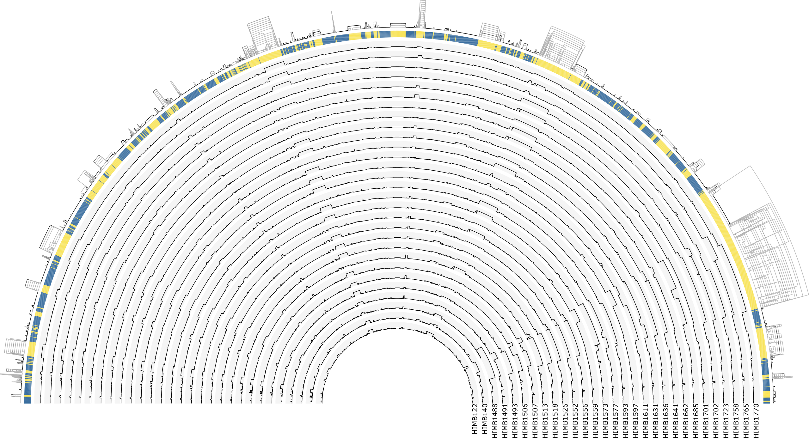
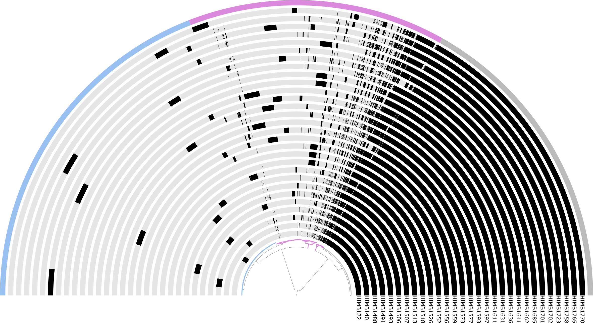
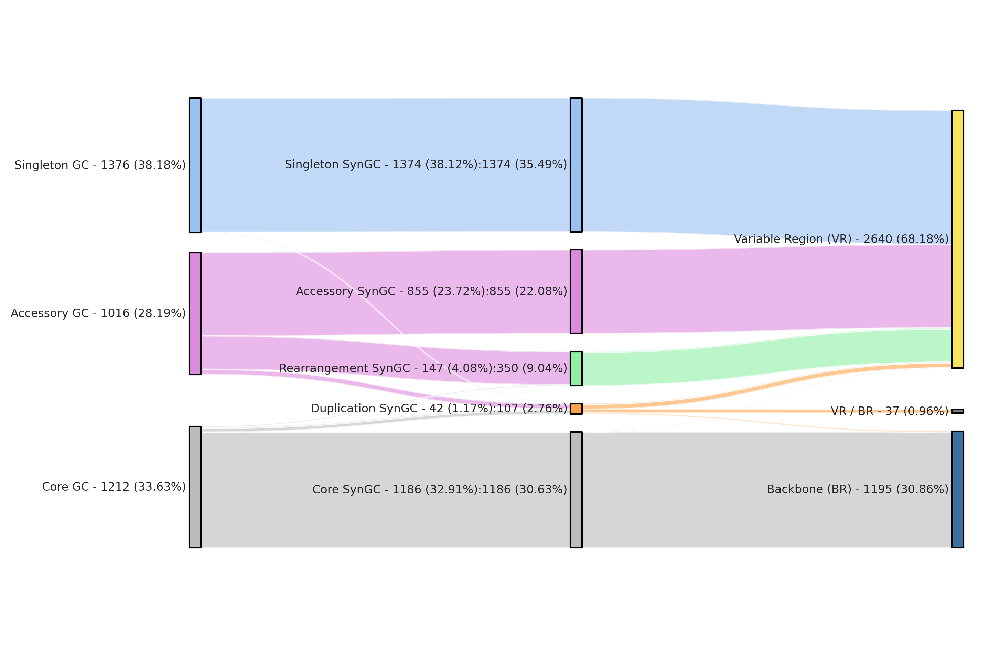
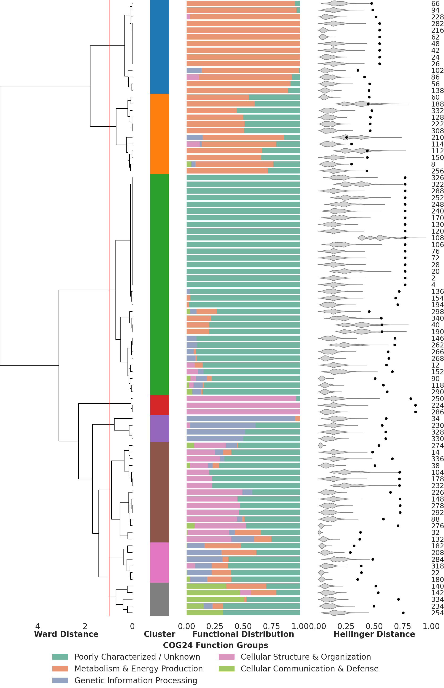
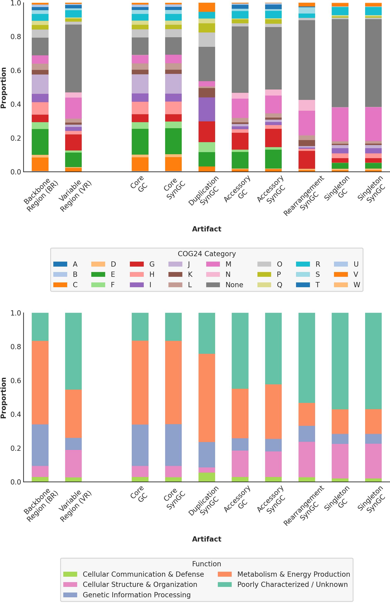
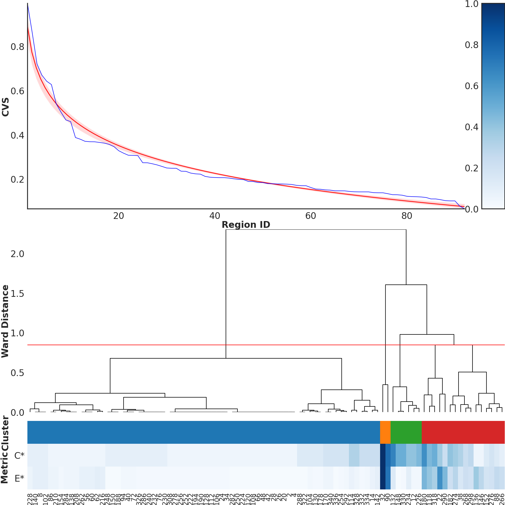
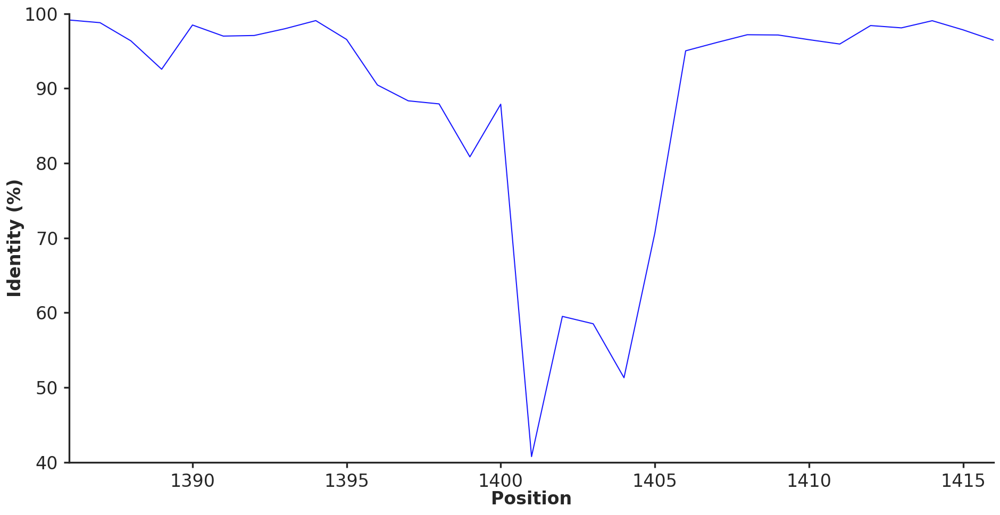

<div class="extra-info" markdown="1">

<span class="extra-info-header">Summary</span>

**The purpose of this page** is to provide access to our bioinformatics workflow that generated the results for our study titled "**Synteny-aware microbial pangenomes reveal blueprints of genomic variation**" by Henoch et al.

</div>

{:.notice}
If you have any questions, notice an issue, and/or are unable to find an important piece of information here, please feel free to leave a comment down below, send an e-mail to [us](/people/), or get in touch with us through Discord:



## Abstract

The increasing availability of genomes across the tree of life enables increasingly precise insights into the genetic determinants of fitness. Pangenomics has emerged as a powerful approach to characterize the gene repertoire across a set of genomes and to quantify conserved and variable gene sets among closely related members of a taxon. However, popular computational approaches to compute pangenomes ignore gene synteny and define gene clusters solely by sequence homology. Graph-based approaches can incorporate both homology and synteny, but they often become difficult to interpret as graph complexity rapidly increases due to transposons, gene duplications, and other sources of genomic rearrangement. Here, we present an open-source software framework featuring a novel network-pruning strategy and graph-layout algorithm that enables interactive exploration of pangenome graphs that supports synteny-aware quantification and visualization of gene conservation and variability. We applied this framework to a pangenome graph of 29 isolates from the genus _Undatipelagibacter_ (formerly SAR11 subclade Ia.3.VI) and identified numerous hotspots of genomic variation, sometimes as short as a single gene. We further show that variable regions differ significantly in their functional composition from genomic backbones and that recurrent variable region (VR) organization patterns cluster into distinguishable evolutionary mechanisms. Together, these results show that microbial genomic variability is not partitioned into hypervariable islands and a static backbone but forms a structured continuum, in which variable regions differ from one another in scale, topology, function, and evolutionary character. 

## Study description

We used 29 circular isolates from _Undatipelagibacter_ to create a pangenome graph in anvi'o. At a high level, our pipeline does the following:

1. reoriented the genomes to all start with the DnaA gene, using 
2. built one  per isolate with 
3. annotated each  with various functions using , , ,  and 
4. combined every  into a  with 
5. ran a pangenomics analysis using the  to create a  using 
6. calculated the ANI with 
7. created a  with 
8. summarized the  using  to create the files `GENESxSYNGCs.txt`, `SYNGCs.txt` and `REGIONS.txt`
9. used the summary output tables for various downstream analyses that will be described in detail in the following sections

For detailed information on how to generate the mentioned input anvi'o artifacts necessary for creating the _Undatipelagibacter_ pangenome graph (steps 1 to 8), see [this](https://merenlab.org/tutorials/undatipelagibacter-pangenome-graph/) tutorial. Steps 2 to 7 can be automated with , additional information can be found [here](https://merenlab.org/2018/07/09/anvio-snakemake-workflows/).

The downstream sections below produce the analyses behind each main figure of the paper. The visualization section reproduces the top of __Figure 1__; the combining and summary-statistics sections produce the Sankey diagram at the bottom of __Figure 1__; the functional distributions section produces __Figure 2__ and the associated supplementary panel; the metrics section produces __Figure 4__; and the position-wise comparisons section produces __Figure 5__.

## Downloading the data for this reproducible workflow

Assuming you want to reproduce a part or all of this study, choose your favorite working directory and store it as a variable `$WD`:

```bash
cd /where/you/want/to/work
WD=$PWD
```

The rest of the document will make use of the terminal variable `$WD`. This reproducible workflow describes the downstream analysis of the _Undatipelagibacter_ pangenome graph we have generated and will expect you to have the following files available:

 - _Undatipelagibacter_ 
 - _Undatipelagibacter_ 
 - the summary files `GENESxSYNGCs.txt`, `SYNGCs.txt` and `REGIONS.txt`
 - the five python scripts `create_all_combined.py`, `functional_distribution_clustering.py`, `metrics_clustering.py`, `similarity_per_position.py` and `summary_statistics.py` used to generate the figures

You can download all these files via:

```bash
mkdir $WD/03_PAN
mkdir $WD/04_RESULTS

curl -L xxxxxxxx -o $WD/00_SCRIPTS.tar.gz
tar -xzf $WD/00_SCRIPTS.tar.gz -C $WD/ && rm $WD/00_SCRIPTS.tar.gz

curl -L https://cloud.uol.de/public.php/dav/files/TN2bxBCbAS5DRDJ -o $WD/03_PAN/UNDATIPELAGIBACTER-GENOMES.db
curl -L https://cloud.uol.de/public.php/dav/files/ctRp8xRWwaPSnp5 -o $WD/03_PAN/UNDATIPELAGIBACTER-PAN.db
curl -L https://cloud.uol.de/public.php/dav/files/8eZZYqNrAdXF4TA -o $WD/UNDATIPELAGIBACTER-PAN-GRAPH.db

curl -L https://cloud.uol.de/public.php/dav/files/8snz92oDqJeARDK -o $WD/UNDATIPELAGIBACTER-PAN-GRAPH-SUMMARY.tar.gz
tar -xzf $WD/UNDATIPELAGIBACTER-PAN-GRAPH-SUMMARY.tar.gz -C $WD/ && rm $WD/UNDATIPELAGIBACTER-PAN-GRAPH-SUMMARY.tar.gz
```

## Details of the computational environment

While we used the anvi'o version `9-dev`, which is the development version following the `v9` stable release for the _Undatipelagibacter_ pangenome graph creation, this reproducible workflow requires a second conda environment as `holoviews` is not present in the anvio environment. We keep the two environments separated so that the anvi'o stack stays intact and isolated from the analysis stack that is only used for downstream plotting and statistics. Switching between them is handled explicitly in every code block below with `conda activate` / `conda deactivate`, so you can copy commands one block at a time without worrying about which environment you are currently in.

```bash
conda create -n anvio-analysis -c conda-forge -c bioconda \
        python=3.10 \
        holoviews matplotlib seaborn pandas numpy scipy biopython scikit-learn tqdm
```

Here is how the `$WD` should look like at this stage:

```bash
.
├── 00_SCRIPTS
    ├── create_all_combined.py
    ├── functional_distribution_clustering.py
    ├── metrics_clustering.py
    ├── similarity_per_position.py
    └── summary_statistics.py
├── 03_PAN
    ├── UNDATIPELAGIBACTER-GENOMES.db
    ├── UNDATIPELAGIBACTER-PAN.db
    └── ...
├── 04_RESULTS
├── UNDATIPELAGIBACTER-PAN-GRAPH.db
├── UNDATIPELAGIBACTER-PAN-GRAPH-SUMMARY
    ├── GENESxSYNGCs.txt
    ├── REGIONS.txt
    ├── SYNGCs.txt
    └── ...

└── ...
```

## Visualizing the _Undatipelagibacter_ pangenome graph

Instructions on how to visualize the _Undatipelagibacter_ pangenome graph and pangenome can also be found in the tutorial [here](https://merenlab.org/tutorials/undatipelagibacter-pangenome-graph/). The  and  files already include states to generate the left-upper and right-upper figures of the paper's __Figure 1__.

The interactive graph display is the recommended starting point for exploring the data. It lays out the graph linearly from left to right so that you can scroll along the genomic context, zoom into any variable region, and inspect individual SynGCs together with their functional annotations, COG24 categories, KEGG modules, and the genomes that contribute to them. Backbone SynGCs are colored in blue and variable regions in yellow by default, while the different SynGC types (core, duplication, rearrangement, accessory, singleton, and tRNA/rRNA) carry their own node colors that you can change through the interface. All regions are labeled and enable you to jump directly to specific variable regions of interest (e.g. VR #32, #90, #22, or #180, the four highest-CVS regions in the paper), and the stored states reproduce the exact view used in the figures. From any node, you can pull up the underlying genes, their amino acid sequences, and the functional annotations across all contributing genomes, which is how we drilled into individual VRs throughout the paper.

[](images/undatipelagibacter_pangenome_graph.png){:.center-img .width-90}
[](images/undatipelagibacter_pangenome.png){:.center-img .width-90}

Similarly the tutorial can be used to generate pangenome graphs from the other _Pelagibacterales_ datasets, that build __Figure 3__.

## Combining the pangenome graph tables into one

For easier downstream analysis we first need to combine two of the pangenome graph tables them together. These tables are not combined from that get go to keep the data as atomary as possible and joining them will create a lot of repetetive information, but this is harmless and makes the analysis a lot easier. The `GENESxSYNGCs.txt` includes information at the gene level and `SYNGCs.txt` at the synteny gene cluster level. By joining them together we get access to all the synteny gene cluster information per gene. The following command generates the joined `all_combined.txt` file.

```bash
conda activate anvio-analysis
python3 $WD/00_SCRIPTS/create_all_combined.py \
    -g $WD/UNDATIPELAGIBACTER-PAN-GRAPH-SUMMARY/GENESxSYNGCs.txt \
    -s $WD/UNDATIPELAGIBACTER-PAN-GRAPH-SUMMARY/SYNGCs.txt \
    -d $WD/04_RESULTS/
conda deactivate
```

At the same step we also join our definition of simplified COG24 groups to the dataset. In case you want to review our definitions, there is a `cog_functional_groups.txt` that includes the same information as the following table.

|    | __COG24_CATEGORY_ACC__   | __definition__                                                    | __functional_group__                  |
|  0 | A                    | RNA processing and modification                               | Genetic Information Processing    |
|  1 | B                    | Chromatin structure and dynamics                              | Genetic Information Processing    |
|  2 | J                    | Translation, ribosomal structure and biogenesis               | Genetic Information Processing    |
|  3 | K                    | Transcription                                                 | Genetic Information Processing    |
|  4 | L                    | Replication, recombination and repair                         | Genetic Information Processing    |
|  5 | D                    | Cell cycle control, cell division, chromosome partitioning    | Genetic Information Processing    |
|  6 | O                    | Posttranslational modification, protein turnover, chaperones  | Genetic Information Processing    |
|  7 | M                    | Cell wall/membrane/envelope biogenesis                        | Cellular Structure & Organization |
|  8 | N                    | Cell motility                                                 | Cellular Structure & Organization |
|  9 | Z                    | Cytoskeleton                                                  | Cellular Structure & Organization |
| 10 | W                    | Extracellular structures                                      | Cellular Structure & Organization |
| 11 | U                    | Intracellular trafficking, secretion, and vesicular transport | Cellular Structure & Organization |
| 12 | Y                    | Nuclear structure                                             | Cellular Structure & Organization |
| 13 | C                    | Energy production and conversion                              | Metabolism & Energy Production    |
| 14 | E                    | Amino acid transport and metabolism                           | Metabolism & Energy Production    |
| 15 | F                    | Nucleotide transport and metabolism                           | Metabolism & Energy Production    |
| 16 | G                    | Carbohydrate transport and metabolism                         | Metabolism & Energy Production    |
| 17 | H                    | Coenzyme transport and metabolism                             | Metabolism & Energy Production    |
| 18 | I                    | Lipid transport and metabolism                                | Metabolism & Energy Production    |
| 19 | P                    | Inorganic ion transport and metabolism                        | Metabolism & Energy Production    |
| 20 | Q                    | Secondary metabolites biosynthesis, transport and catabolism  | Metabolism & Energy Production    |
| 21 | T                    | Signal transduction mechanisms                                | Cellular Communication & Defense  |
| 22 | V                    | Defense mechanisms                                            | Cellular Communication & Defense  |
| 23 | X                    | Mobilome: prophages, transposons                              | Cellular Communication & Defense  |
| 24 | R                    | General function prediction only                              | Poorly Characterized / Unknown    |
| 25 | S                    | Function unknown                                              | Poorly Characterized / Unknown    |
| 26 | None                 | Function unknown                                              | Poorly Characterized / Unknown    |

The resulting `all_combined.txt` contains the merged information from two of the three summary files together with some extra columns, including the type of the original gene cluster that became a synteny gene cluster and the COG24 group definition, both of which we use later. A snippet of the table looks something like this:

|    | __genome_name__ | __gene_caller_id__ | __source_gene_cluster_id__ | __node_id__ | __region_id__ | __region_type__ | __KEGG_Class_ACC__ | __KEGG_BRITE_ACC__ | __KEGG_Module_ACC__ | __KOfam_ACC__ | __COG24_PATHWAY_ACC__ | __COG24_FUNCTION_ACC__ | __COG24_CATEGORY_ACC__ | __COG24_FUNCTION__ | __node_type__ | __node_x__ | __node_y__ | __genome_count__ | __gene_cluster_type__ | __definition__ | __functional_group__ |
|  0 | HIMB122       |              363 | GC_00000001              | GC_00000001_1 |          65 | backbone      | None             | ko00001          | None              | K03704      | None                | COG1278              | K                    | Cold shock protein, CspA family (CspC) (PDB:1C9O) | duplication |      723 |        0 |             29 | core                | Transcription | Genetic Information Processing |
|  1 | HIMB140       |              355 | GC_00000001              | GC_00000001_1 |          65 | backbone      | None             | ko00001          | None              | K03704      | None                | COG1278              | K                    | Cold shock protein, CspA family (CspC) (PDB:1C9O) | duplication |      723 |        0 |             29 | core                | Transcription | Genetic Information Processing |
|  2 | HIMB1488      |              386 | GC_00000001              | GC_00000001_1 |          65 | backbone      | None             | ko00001          | None              | K03704      | None                | COG1278              | K                    | Cold shock protein, CspA family (CspC) (PDB:1C9O) | duplication |      723 |        0 |             29 | core                | Transcription | Genetic Information Processing |
|  3 | HIMB1491      |              353 | GC_00000001              | GC_00000001_1 |          65 | backbone      | None             | ko00001          | None              | K03704      | None                | COG1278              | K                    | Cold shock protein, CspA family (CspC) (PDB:1C9O) | duplication |      723 |        0 |             29 | core                | Transcription | Genetic Information Processing |
|  4 | HIMB1493      |              332 | GC_00000001              | GC_00000001_1 |          65 | backbone      | None             | ko00001          | None              | K03704      | None                | COG1278              | K                    | Cold shock protein, CspA family (CspC) (PDB:1C9O) | duplication |      723 |        0 |             29 | core                | Transcription | Genetic Information Processing |
| (...) | (...) | (...) | (...) | (...) | (...) | (...) | (...) | (...) | (...) | (...) | (...) | (...) | (...) | (...) | (...) | (...) | (...) | (...) | (...) | (...) | (...) |

### Calculating summary statistics on the combined table

With the `all_combined.txt` file in place we can now generate the summary statistics for the pangenome graph. A dedicated script handles this, and you can run it with the following command once the files are in the right places.

```bash
conda activate anvio-analysis
python3 $WD/00_SCRIPTS/summary_statistics.py \
    -c $WD/04_RESULTS/all_combined.txt \
    -d $WD/04_RESULTS/ \
    -pw 9.69 \
    -ph 6.27
conda deactivate
```

This will generate four summary tables for you. First the `synteny_gene_clusters_summary.txt` file includes information about the different synteny gene cluster types (`node_type`). We want to make sure to see a nice 100% in the last two columns to make sure that no gene call was left out.

|       | __node_type__     |   __num_syn_cluster__ |   __num_gene_calls__ |   __percent_syn_cluster__ |   __percent_gene_calls__ |
| 0     | accessory     |               855 |             6330 |               22.0816 |              14.3991 |
| 1     | core          |              1186 |            34394 |               30.6302 |              78.2375 |
| 2     | duplication   |               107 |             1065 |               2.76343 |               2.4226 |
| 3     | rearrangement |               350 |              798 |               9.03926 |              1.81525 |
| 4     | singleton     |              1374 |             1374 |               35.4855 |               3.1255 |
| Total |               |              3872 |            43961 |                   100 |                  100 |

Similar to the `synteny_gene_clusters_summary.txt` file we have the second summary table the `gene_clusters_summary.txt` that includes information about the different gene cluster types (`gene_cluster_type`) that created the synteny gene clusters. And again we check for 100% in the last two columns to make sure everything is in place.

|       | __gene_cluster_type__   |   __num_gene_cluster__ |   __num_gene_calls__ |   __percent_gene_cluster__ |   __percent_gene_calls__ |
| 0     | accessory           |               1016 |             7182 |                28.1909 |              16.3372 |
| 1     | core                |               1212 |            35401 |                33.6293 |              80.5282 |
| 2     | singleton           |               1376 |             1378 |                38.1798 |               3.1346 |
| Total |                     |               3604 |            43961 |                    100 |                  100 |

And you probably guessed it, we have a third similar table `regions_summary.txt` that includes the same information but based on the pangenome graphs regions.

|       | __region_type__   |   __num_gene_calls__ |   __num_regions__ |   __num_syn_cluster__ |   __percent_syn_cluster__ |   __percent_gene_calls__ |   __percent_regions__ |
| 0     | backbone      |            35090 |           163 |              1210 |                 31.25 |              79.8208 |           48.9489 |
| 1     | variable      |             8871 |           170 |              2662 |                 68.75 |              20.1792 |           51.0511 |
| Total |               |            43961 |           333 |              3872 |                   100 |                  100 |               100 |

The final summary table `conversion_summary` combines the information of all three other files and shows the conversion from gene cluster to synteny gene cluster to region and the number of gene calls per these conversion. 

|       | __gene_cluster_type__   | __node_type__     | __region_type__   |   __num_syn_cluster__ |   __num_gene_cluster__ |   __num_gene_calls__ |   __percent_gene_cluster__ |   __percent_syn_cluster__ |   __percent_gene_calls__ |   __conversion_factor__ |
| 0     | accessory           | accessory     | variable      |               855 |                855 |             6330 |                23.7236 |               22.0816 |              14.3991 |                   1 |
| 1     | accessory           | duplication   | variable      |                52 |                 18 |              170 |               0.499445 |               1.34298 |             0.386706 |             2.88889 |
| 2     | accessory           | rearrangement | variable      |               342 |                143 |              682 |                3.96781 |               8.83264 |              1.55138 |             2.39161 |
| 3     | core                | core          | backbone      |              1183 |               1183 |            34307 |                32.8246 |               30.5527 |              78.0396 |                   1 |
| 4     | core                | core          | variable      |                 3 |                  3 |               87 |              0.0832408 |             0.0774793 |             0.197903 |                   1 |
| 5     | core                | duplication   | Both          |                37 |                 15 |              506 |               0.416204 |              0.955579 |              1.15102 |             2.46667 |
| 6     | core                | duplication   | backbone      |                12 |                  6 |              348 |               0.166482 |              0.309917 |             0.791611 |                   2 |
| 7     | core                | duplication   | variable      |                 2 |                  1 |               37 |              0.0277469 |             0.0516529 |            0.0841655 |                   2 |
| 8     | core                | rearrangement | variable      |                 8 |                  4 |              116 |               0.110988 |              0.206612 |              0.26387 |                   2 |
| 9     | singleton           | duplication   | variable      |                 4 |                  2 |                4 |              0.0554939 |              0.103306 |           0.00909897 |                   2 |
| 10    | singleton           | singleton     | variable      |              1374 |               1374 |             1374 |                38.1243 |               35.4855 |               3.1255 |                   1 |
| Total |                     |               |               |              3872 |               3604 |            43961 |                    100 |                   100 |                  100 |             1.07436 |

The script also generated a figure `conversion_summary_sankey.png` to visualize this exact information as a nice sankey diagram. This figure is the second part of the paper's __Figure 1__.

[](images/conversion_summary_sankey.png){:.center-img .width-90}

## Functional distributions plots and VR/BR comparisons

The __Figure 2__ of the paper shows the functional distributions patterns of the pangenome graph's variable regions. The following script generates these patterns, creates a dendrogram based on the patterns and calculates the Hellinger distance violin plots based on 10,000 subsampling runs.

Under the hood, the script does three things in sequence. (1) for every variable region it counts the genes that fall into each of the five simplified COG24 functional groups defined earlier and normalizes them into a proportion vector, which is what you see as the stacked bar plot in the middle column of __Figure 2__. (2) it clusters these per-region proportion vectors with Ward linkage on Euclidean distances and draws the dendrogram on the left; cutting that dendrogram at the height shown in the figure creates the eight functional clusters that we discussed in the paper. (3) for each VR the script computes the Hellinger distance between its functional proportion vector and the proportion vector of the full backbone, which gives the black dot on the right-hand side of the figure. To assess whether that observed distance is unusual, the script draws 10,000 random samples of backbone genes matched in size to the VR and computes the Hellinger distance between those. The resulting null distribution is plotted as the gray violin behind the dot, and a dot falling outside its own violin indicates a VR whose functional composition differs significantly from what you would expect by simply subsampling the backbone.

```bash
conda activate anvio-analysis
python3 $WD/00_SCRIPTS/functional_distribution_clustering.py \
    -c $WD/04_RESULTS/all_combined.txt \
    -d $WD/04_RESULTS/ \
    -pw 6.27 \
    -ph 9.69 \
    -r $WD/UNDATIPELAGIBACTER-PAN-GRAPH-SUMMARY/REGIONS.txt 
conda deactivate
```

[](images/functional_distribution_clustering.png){:.center-img .width-70}

At the same time the script generates the related supplementary figure, showing the difference in distribution patterns between the backbone and variable regions, as well as the different pangenome graph artifacts. This is a useful sanity check that confirms the broad functional divergence between backbone and variable regions.

[](images/functional_distribution_by_artifact.png){:.center-img .width-70}

## Metrics of the pangenome graph

The following command generates the results we used in the third chapter and especially all figures related to the pangenome graph metrics.  

The script reads the per-region Complexity, Expansion, Diversity, Weight and Composite Variability Score values directly from the `REGIONS.txt` summary table. These values are computed inside `anvi-pan-genome-graph` according to the mathematical definitions given in the next subsection. From this table the script produces two complementary outputs. (1) it sorts all variable regions by their CVS and plots the ranked curve shown in the upper-right of __Figure 4__, together with a log curve to see whether the CVS values follow a log like decrease. (2) it clusters variable regions by Complexity and Expansion using Ward linkage and cuts the resulting dendrogram into four groups, which correspond to the four topological categories shown at the bottom of __Figure 4__ ('high complexity / high expansion', 'high complexity / low expansion', 'medium / medium', and 'low / low').

```bash
conda activate anvio-analysis
python3 $WD/00_SCRIPTS/metrics_clustering.py \
    -c $WD/04_RESULTS/all_combined.txt \
    -d $WD/04_RESULTS/ \
    -pw 6.27 \
    -ph 6.27 \
    -r $WD/UNDATIPELAGIBACTER-PAN-GRAPH-SUMMARY/REGIONS.txt 
conda deactivate
```

The script includes, among other calculations, the calculation of the Pearson Correlation Coefficient (r), that we used to test a linear relationship between Complexity and Expansion. The test output will be directly printed in the terminal you used to run the script and will look like this.

```bash
n(VR) = 170

Descriptive stats (VR only):
        complexity_mm_scaled  expansion_mm_scaled
mean                0.090374             0.068984
median              0.045455             0.022727
std                 0.158464             0.132202
min                 0.000000             0.011364
max                 1.000000             1.000000

Spearman rho = +0.527  (p = 1.6e-13)
Pearson  r   = +0.679  (p = 2.61e-24)
Bootstrap 95% CI for rho: [+0.386, +0.644]

--- OLS regression (VR only) ---
========================================================================================
                           coef    std err          t      P>|t|      [0.025      0.975]
----------------------------------------------------------------------------------------
Intercept                0.0178      0.009      2.069      0.040       0.001       0.035
complexity_mm_scaled     0.5664      0.047     11.984      0.000       0.473       0.660
========================================================================================
R-squared = 0.461
```

The script will print the upper part of the paper's __Figure 4__. The lower part was generated from the visualized pangenome graph.

[](images/metrics_clustering.png){:.center-img .width-70}

### Complexity, expansion, weight, and diversity

This subsection gives the formal definitions of the four metrics we use, along with the supporting notation. You can safely skip ahead if you only want to run the pipeline; the math is here so that anyone who wants to reimplement them can do so directly from the equations.

- Let $\mathbb{G} = \{g_1, g_2, \ldots, g_G\}$ be the set of genomes in the dataset and $G = \|\mathbb{G}\|$ its cardinality.

- Let $\mathbb{H} = \{h_1, h_2, \ldots, h_H\}$ be the set of genomes in which the VR is present and $H = \|\mathbb{H}\|$ its cardinality.

- Let $\mathbb{K} = \{k_1, k_2, \ldots, k_K\}$ be the set of distinct synteny gene clusters in the VR and $K = \|\mathbb{K}\|$ its cardinality.

- Let $\mathbb{P} = \{p_1, p_2, \ldots, p_P\}$ be the set of unique synteny pathways in the VR, ordered such that $\|f(p_1)\| \leq \|f(p_2)\| \leq \cdots \leq \|f(p_P)\|$, where $f(p_i) \subseteq \mathbb{G}$ is the set of genomes in which pathway $p_i$ occurs.

- Let $e_i = \|h(g_i)\|$ be the number of genes contributed by genome $g_i \in \mathbb{G}$.

- Let $n_i = \|t(k_i)\|$ be the number of supporting genomes $t(k_i) \subseteq \mathbb{G}$ containing gene cluster $k_i \in \mathbb{K}$.

**Complexity (C)**: “How many distinct structural realizations (“paths”) occur from the supporting genome?” Answered by estimating the number of events leading to the degree of variation visible in the region. Unique pathways inside the VR are visited in order by the amount of genomes backing it, starting with the ones that are less well represented within the dataset. Every visit of a pathway that includes at least one genome not already seen before with this method, counts as one additional degree of complexity, until the breadth of genomic contribution includes every genome of the dataset. Afterwards we subtract one from the result to set e.g. backbone regions with just a single straight pathway to zero.

$$
\begin{align}
    &X_0 = \emptyset,\quad Y = 0\\
    &\text{for } i = 1, 2, \ldots, P:\\
    &\quad \text{if}\ f(p_i) \not\subseteq X_{i-1}:\\
    &\qquad Y \leftarrow Y + 1,\quad X_i = X_{i-1} \cup f(p_i)\\
    &\quad \text{else}:\\
    &\qquad X_i = X_{i-1}
\end{align}
$$

The result $Y$ is decreased by one to compensate for the fact that a single pathway is always present and then divided by the datasets number of genomes, to weight how high the region can score. Less genomes are less possible pathways.

$$
\begin{align}
    C = \frac{(Y - 1)}{G}
\end{align}
$$

**Expansion (E)**: “How much gene content can be inserted in this variable region?” Answered by calculating the maximum number of newly introduced genes by a single genome in the region. 


$$
\begin{align}
    E = \max(e_1, e_2, \ldots, e_G)
\end{align}
$$

**Diversity (D)**: “How heterogeneous is the gene content across supporting genomes?” Answered by describing the overall unevenness of synteny gene cluster prevalence. It first calculates the prevalence proportion mi of every synteny gene cluster in the region and then the reversed population variance, therefore VRs splitting in equal SynGC sizes, in terms of genome contributions, score higher. Reverse population variance is calculated by calculating the maximum possible variance first and subtracting the actual VRs population variance from it.

$$
\begin{align}
    m_i = \frac{n_i}{G}, \quad \bar{m} = \frac{1}{K} \sum_{i=1}^{K} m_i, \quad \bar{v} = \frac{1}{2} \left( \frac{1}{G} + \frac{G}{G} \right)
\end{align}
$$

$$
\begin{align}
    D = \frac{1}{2} \left( \left( \frac{1}{G} - \bar{v} \right)^2 + \left( \frac{G}{G} - \bar{v} \right)^2 \right) - \frac{1}{K} \sum_{i=1}^{K} (m_i - \bar{m})^2
\end{align}
$$

**Weight (W)**: “How high is the variable region's impact?” Answered by describing the potential significance of a given VR within the genomic landscape through the fraction of $H$ and $G$.

$$
\begin{align}
    W = \frac{H}{G}
\end{align}
$$    

**Composite Variability Score (CVS)** “How _special_ is the variable region?” Answered by calculating the degree of genomic variation inside a given VR. We use the geometric mean to balance four different terms, requiring higher scores in all metrics to reach a high CVS score.

$$
\begin{align}
    CVS = (C' D' E' W')^{\frac{1}{4}}
\end{align}
$$    

For the calculation of the CVS, all terms are normalized according to min-max normalization.

$$
\begin{align}
    Z_{\min} = \min(Z), \quad Z_{\max} = \max(Z)
\end{align}
$$ 

$$
\begin{align}
    Z' = \frac{(Z - Z_{\min})}{(Z_{\max} - Z_{\min})}
\end{align}
$$ 

## Position-wise sequence comparisons

The volcano-shaped sequence similarity profile around region #148 in __Figure 5__ is one of the most interesting findings of our paper because it shows that what looks like a single highly variable gene at the pangenome graph level (the _Skp_ gene, which split into twelve distinct SynGCs) is actually the middle of a sequence similarity gradient. To regenerate the data for this we need to drop down to the underlying amino acid sequences and align them column-by-column across all 29 genomes.

We split this analysis into two runs of the same script because of an intermediate step that needs anvi'o programs. The first execution with the `--preprocess` flag scans `all_combined.txt` for the user-supplied region IDs (here `147 148 149 150 151`, which covers the envelope biogenesis operon and a few extra SynGCs on either side) and writes out a list of the conventional gene cluster IDs that those regions correspond to. Anvi'o's gene cluster export program expects GC IDs rather than SynGC or region IDs, so this preprocessing step is what bridges the pangenome graph world back into the conventional pangenome world.

```bash
conda activate anvio-analysis
python3 $WD/00_SCRIPTS/similarity_per_position.py \
    -c $WD/04_RESULTS/all_combined.txt \
    -d $WD/04_RESULTS/ \
    -f 147 148 149 150 151 \
    --preprocess
conda deactivate
```

Running `anvi-get-sequences-for-gene-clusters` we can then export these gene clusters from the  and . The `--split-output-per-gene-cluster` flag produces one FASTA file per gene cluster, each containing the amino acid sequences of every contributing genome aligned within that cluster.

```bash
conda activate anvio-dev
anvi-get-sequences-for-gene-clusters \
    -p $WD/03_PAN/UNDATIPELAGIBACTER-PAN.db \
    -g $WD/03_PAN/UNDATIPELAGIBACTER-GENOMES.db \
    --gene-cluster-ids-file $WD/04_RESULTS/gene_clusters.txt \
    --split-output-per-gene-cluster \
    -O $WD/04_RESULTS/
conda deactivate
```

A second execution of the script without the `--preprocess` flag reads these per-cluster FASTA files back in and computes the average pairwise amino acid identity (AAI) at each column of the alignment, using BioPython's pairwise comparison routines. The script then orders the SynGCs along the genomic axis and concatenates their per-position AAI values into the single curve plotted in __Figure 5__. Positions in conserved SynGCs end up at the high end of the curve (~97% on average for the flanking operons), positions in the _Skp_ gene drop to the floor (~40%), and positions in the genes neighboring _Skp_ within the same operon take intermediate values, producing the characteristic volcano pattern.

```bash
conda activate anvio-analysis
python3 $WD/00_SCRIPTS/similarity_per_position.py \
    -c $WD/04_RESULTS/all_combined.txt \
    -d $WD/04_RESULTS/ \
    -pw 6.27 \
    -ph 3.23 \
     -f 147 148 149 150 151
conda deactivate
```

[](images/similarity_per_position.png){:.center-img .width-60}

The same procedure can in principle be applied to any other variable region of interest by simply changing the `-f` argument to the desired region IDs, which makes this a generic recipe for inspecting fine-grained sequence variation within and around any region the pangenome graph flags as variable.

The prediction of the protein structures in the upper-part of __Figure 5__ was carried out on an high performance computing cluster with Colabfold and are not part of this reproducible workflow. In case you want to still reproduce these structures, all amino acid sequences for the genes in region #148 are included in `position_1401_aa.fa` and instructions on how to run Colabfold can be found [here](https://github.com/sokrypton/colabfold). A ready to use online version of Colabfold is also available [here](https://colab.research.google.com/github/sokrypton/ColabFold/blob/main/AlphaFold2.ipynb).

## Closing notes

I really hope you found this reproducible workflow useful. If you ran into something that did not behave as described, please open an issue on the [anvi'o GitHub repository](https://github.com/merenlab/anvio/issues) or leave a comment below; both are read regularly and concrete bug reports help us improve the tooling for everyone.

If you would like to **build a pangenome graph from your own genomes** rather than only analyzing the _Undatipelagibacter_ one described here, the [pangenome graph tutorial](https://merenlab.org/tutorials/undatipelagibacter-pangenome-graph/) walks through the same steps starting from raw FASTA files.

If our work is useful to your own, please cite the paper:

> Henoch et al. (2026). _Synteny-aware microbial pangenomes reveal blueprints of genomic variation._

Thanks for reading, and feel free to reach out through the channels above with questions, suggestions, or just to share what you discovered in your own pangenome graphs.