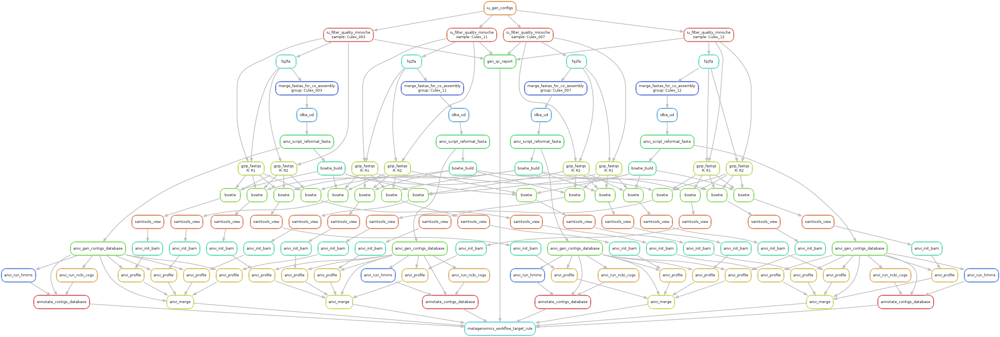
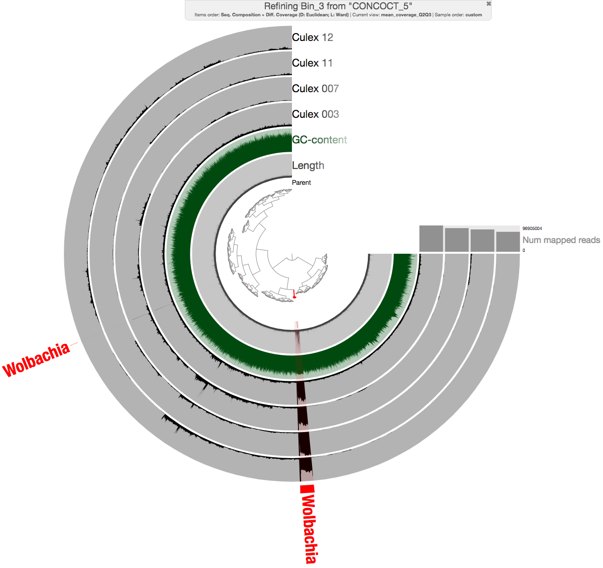
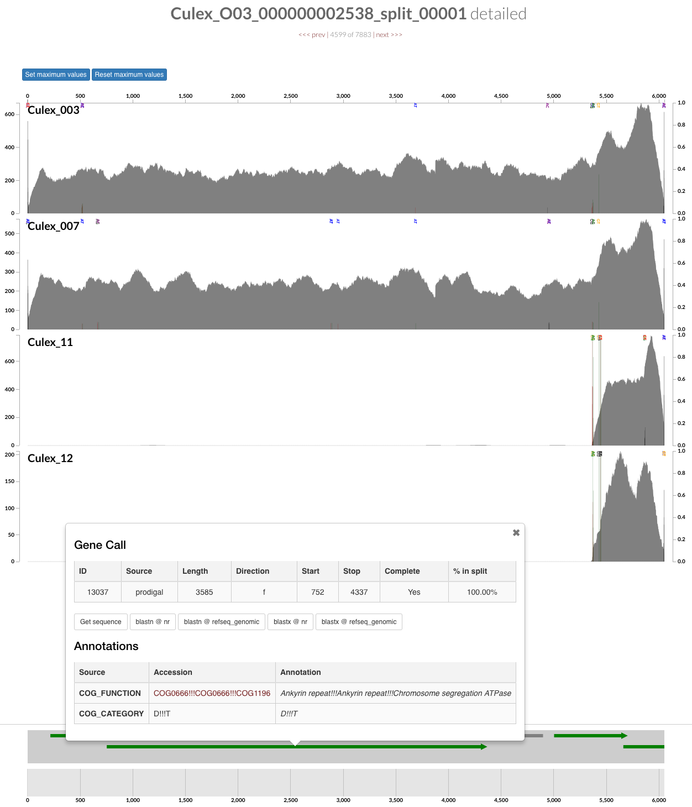
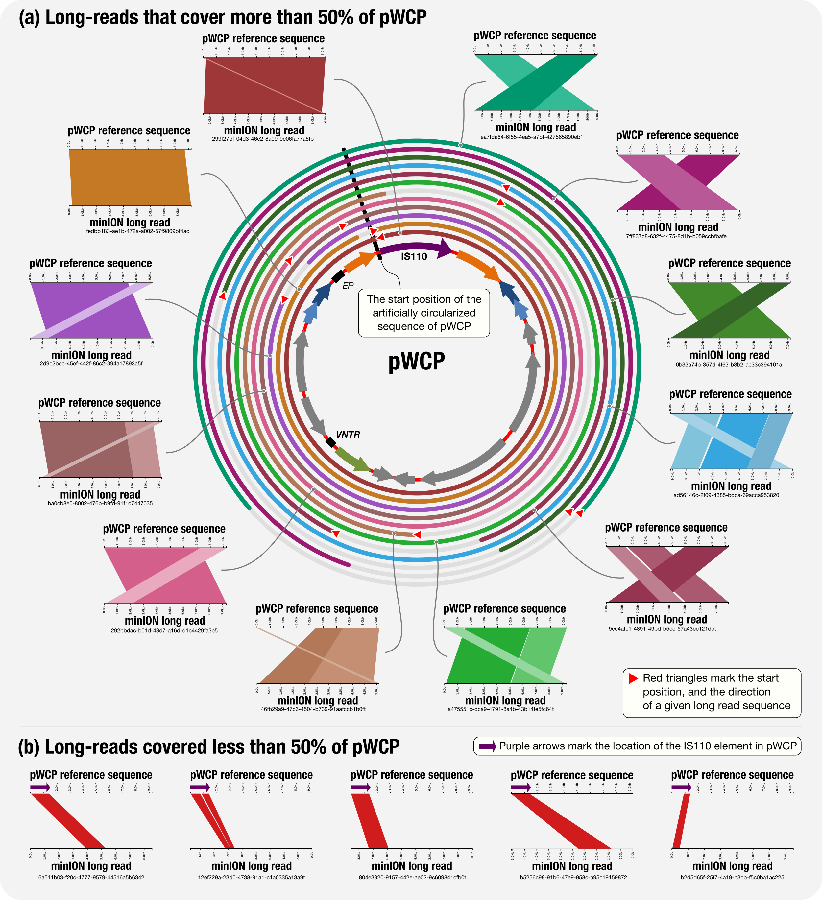
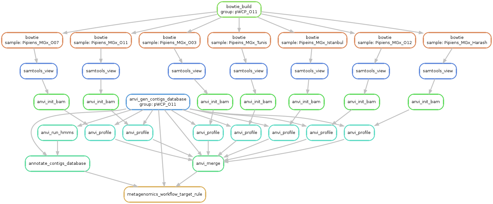
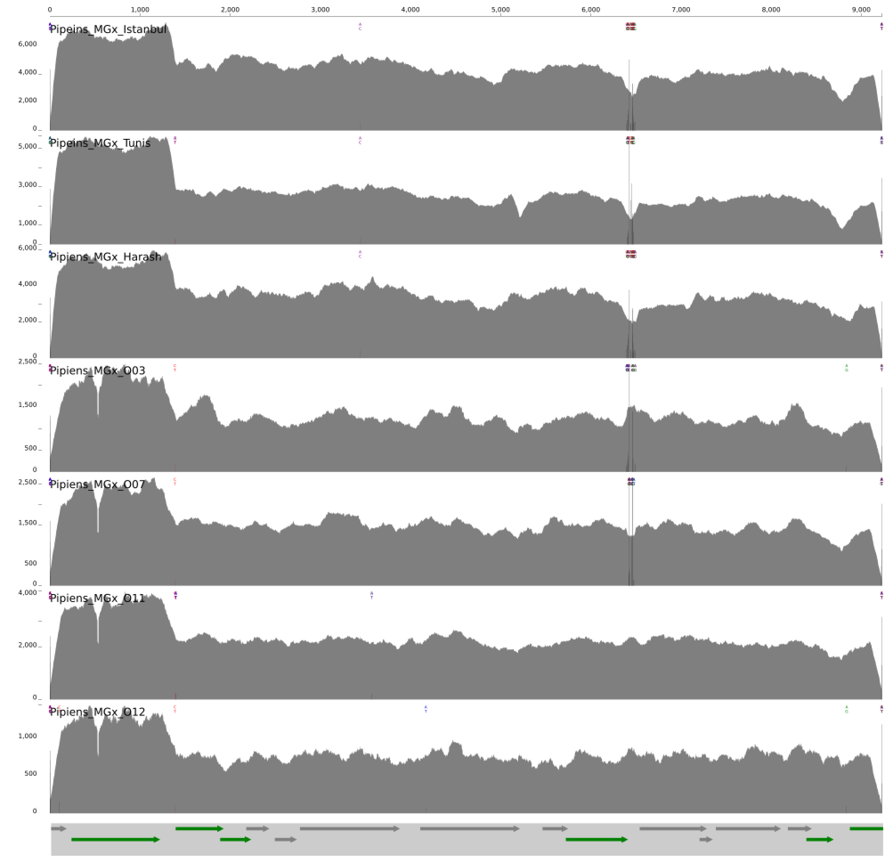
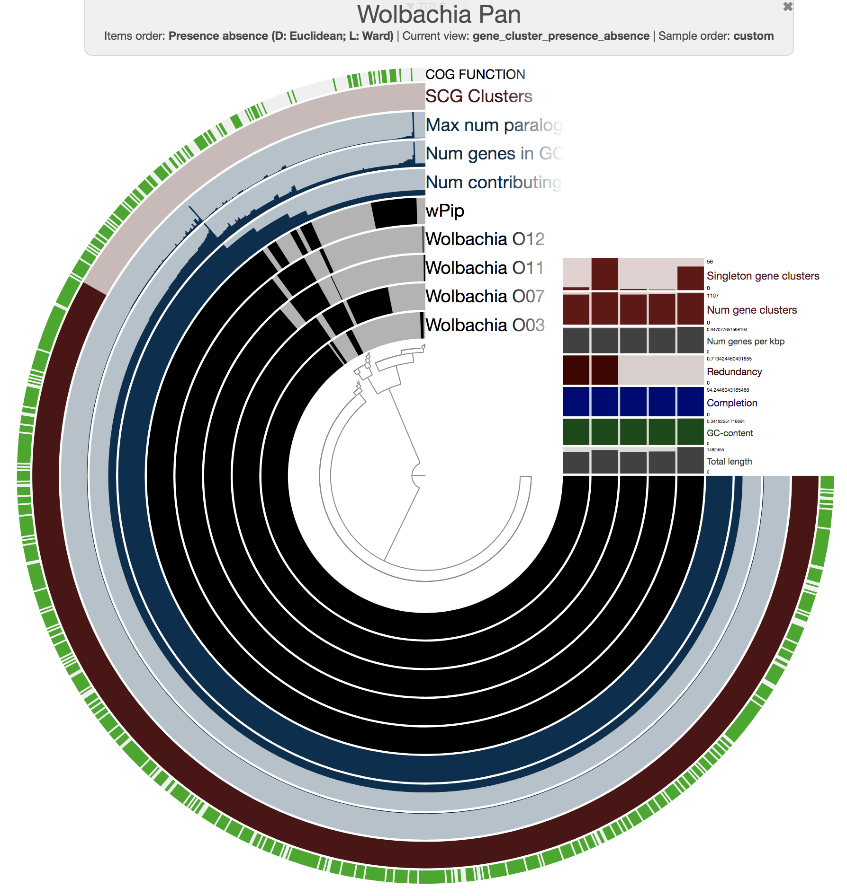
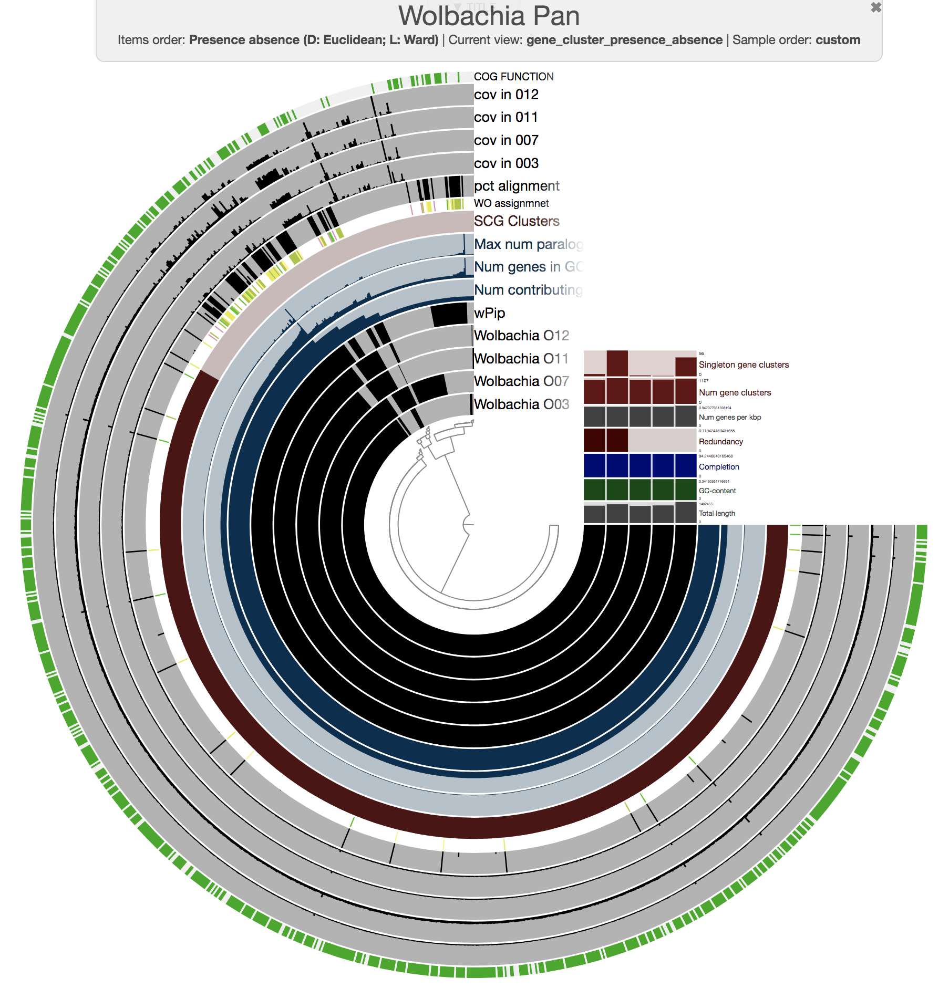
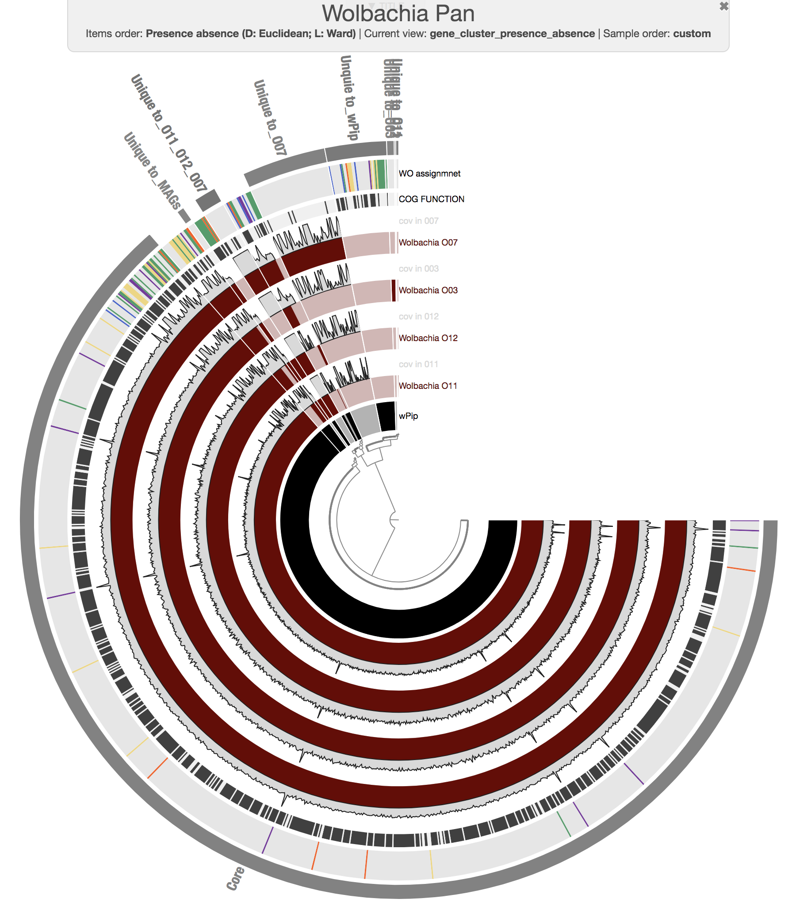
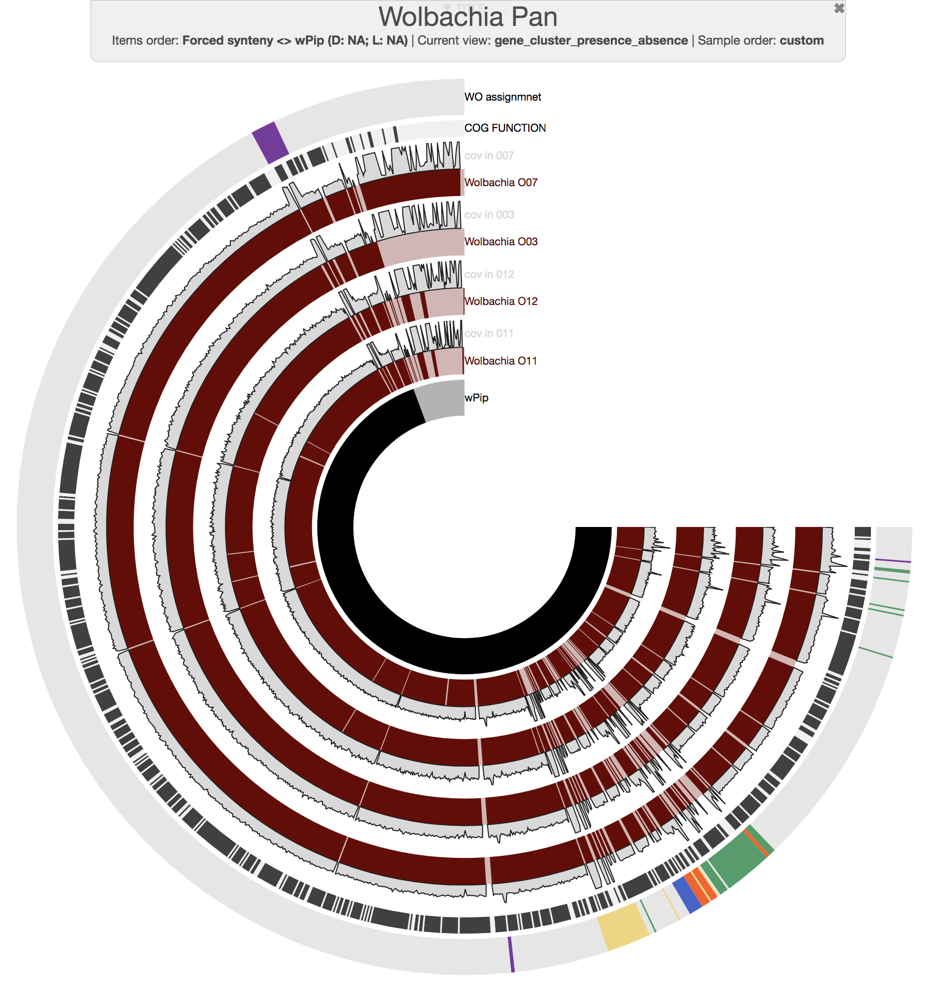



This document describes the reproducible bioinformatics workflow for our study titled "*The Wolbachia mobilome in Culex pipiens includes a putative plasmid*".

{:.notice}
The [doi:10.1038/s41467-019-08973-w](https://doi.org/10.1038/s41467-019-08973-w){:target="_blank"} serves the open-access peer-reviewed study described in this document.

Here you will find program names and exact parameters we used throughout every step of the analysis of metagenomes we generated from the ovaries of four *C. pipiens* individual mosquitoes. Our computational investigations predominantly relied on the open-source analysis platform [anvi’o](http://merenlab.org/software/anvio), and utilized the following strategis in general:

* Reconstructing high-quality microbial genomes from metagenomes (i.e., *metagenome-assembled genomes*, or *MAGs*),

* Characterizing microdiversity within environmental populations our MAGs represented through single-nucleotide variants,

* Using metapangenomics to investigate gene content of metagenome-assembled and reference genomes and its association with metagenomes,

* Applying a long-read sequencing and analysis strategy to very low-biomass samples for hypothesis testing,

* Employing [anvi'o snakemake workflows]() to study complex datasets with many steps of analyses in a reproducible manner.

{:.notice}
All anvi'o analyses in this document are performed using the anvi'o version `v5`. Please see [the installation notes]() to download the appropriate version through PyPI, Docker, or GitHub.

<div class="extra-info" markdown="1">

<span class="extra-info-header">Summary</span>

The purpose of this doucument is to focus on the methodological aspects of our workflow, hence, we refer you to the [peer-reviewed study](https://doi.org/10.1038/s41467-019-08973-w) for more extensive insights into its scientific context. Nonetheless, here is a brief summary of our study:

* We captured four wild mosquitoes in Southern France, and performed microsurgery to extract their ovaries (ouch),

* After shotgun sequencing, we reconstructed *de novo* population genomes for *Wolbachia*, the endosymbiotic alphaproteobacterial genus of many arthropod and nematode species worldwide,

* Identified a circular, extra-chromosomal element with hallmarks of a plasmid in the mobilome, and confirmed its occurrence and circular nature using PCR, Sanger sequencing, and long-read sequencing experiments,

* Used publicly available mosquito metagenomes to show the occurrence and conservancy of the plasmid, and the diversity and richness of phages in individual mosquitoes.

Sections in this document will detail all the steps of downloading and processing the raw metagenomes, mapping metagenomic reads onto the reference genomes as well as metagenome-assembled genomes.

</div>


Please feel free to leave a comment, or send an e-mail to [us]({{ site.url }}/people/) if you have any questions.


## Setting the stage

This section explains how to download and process the metagenomes we have generated from the for the *C. pipiens* ovary samples used in this study.

{:.warning}
We made available the metagenomes through the European Bioinformatics Institute (EBI) repository and NCBI under the project accession number `PRJEB26028`.

### Downloading individual C. pipiens ovary metagenomes

The raw Illumina paired-end seqeuncing files for shotgun metagenomes are stored in European Nucleotide Archive under the accession number [PRJEB26028](https://www.ebi.ac.uk/ena/data/view/PRJEB26028), and the following table lists the individual accession numbers for each sample:

|Accession Number on ENA|Sample Name In our Study|
|:--:|:--:|
|[ERS2407346](https://www.ebi.ac.uk/ena/data/view/ERS2407346)|*Culex pipiens* O03|
|[ERS2407347](https://www.ebi.ac.uk/ena/data/view/ERS2407347)|*Culex pipiens* O07|
|[ERS2407348](https://www.ebi.ac.uk/ena/data/view/ERS2407348)|*Culex pipiens* O11|
|[ERS2407349](https://www.ebi.ac.uk/ena/data/view/ERS2407349)|*Culex pipiens* O12|

If you wish to follow this workflow, you can download raw Illumina paired-end seqeuncing data file for 4 ovary samples into your work directory the following way:

``` bash
wget ftp://ftp.sra.ebi.ac.uk/vol1/fastq/ERR252/000/ERR2523110/ERR2523110_1.fastq.gz \
     -O Culex_O03_RAW_R1.fastq.gz
wget ftp://ftp.sra.ebi.ac.uk/vol1/fastq/ERR252/000/ERR2523110/ERR2523110_2.fastq.gz \
     -O Culex_O03_RAW_R2.fastq.gz

wget ftp://ftp.sra.ebi.ac.uk/vol1/fastq/ERR252/001/ERR2523111/ERR2523111_1.fastq.gz \
     -O Culex_O07_RAW_R1.fastq.gz
wget ftp://ftp.sra.ebi.ac.uk/vol1/fastq/ERR252/001/ERR2523111/ERR2523111_2.fastq.gz \
     -O Culex_O07_RAW_R2.fastq.gz

wget ftp://ftp.sra.ebi.ac.uk/vol1/fastq/ERR252/002/ERR2523112/ERR2523112_1.fastq.gz \
     -O Culex_O11_RAW_R1.fastq.gz
wget ftp://ftp.sra.ebi.ac.uk/vol1/fastq/ERR252/002/ERR2523112/ERR2523112_2.fastq.gz \
     -O Culex_O11_RAW_R2.fastq.gz

wget ftp://ftp.sra.ebi.ac.uk/vol1/fastq/ERR252/003/ERR2523113/ERR2523113_1.fastq.gz \
     -O Culex_O12_RAW_R1.fastq.gz
wget ftp://ftp.sra.ebi.ac.uk/vol1/fastq/ERR252/003/ERR2523113/ERR2523113_2.fastq.gz \
     -O Culex_O12_RAW_R2.fastq.gz
```

Once your downloads are finished, you must have the following files in your work directory for each of the four sample:

``` bash
- Culex_O03_RAW_R1.fastq.gz, Culex_O03_RAW_R2.fastq.gz
- Culex_O07_RAW_R1.fastq.gz, Culex_O07_RAW_R2.fastq.gz
- Culex_O11_RAW_R1.fastq.gz, Culex_O11_RAW_R2.fastq.gz
- Culex_O12_RAW_R1.fastq.gz, Culex_O12_RAW_R2.fastq.gz
```

### Running the anvi'o metagenomic workflow

While we extensively listed our command lines and parameters in our previous reproducible workflows (an [example](http://merenlab.org/data/2018_Delmont_and_Eren_Metapangenomics/), and [another one](http://merenlab.org/data/2017_Delmont_et_al_HBDs/)), anvi'o `v5` comes with a snakemake-based workflow management program, which makes our workflows significantly simpler (here is [an extensive tutorial]() that describes its functions). Starting from raw metagenomic reads, this workflow will run everything necessary.

One of the key input files to start the run is the `samples.txt`, and you can downlaod the version used in our study into your work directory this way:

``` bash
wget http://merenlab.org/data/wolbachia-plasmid/files/samples.txt
```

Here is a quick look at its contents:

``` bash
$ column -t samples.txt
sample     r1                      r2
Culex_O03  Culex_O03_RAW_R1.fastq.gz  Culex_O03_RAW_R2.fastq.gz
Culex_O07  Culex_O07_RAW_R1.fastq.gz  Culex_O07_RAW_R2.fastq.gz
Culex_O11  Culex_O11_RAW_R1.fastq.gz  Culex_O11_RAW_R2.fastq.gz
Culex_O12  Culex_O12_RAW_R1.fastq.gz  Culex_O12_RAW_R2.fastq.gz
```

The other key input file is the `config.json`, which dictates exactly how the input desribde in `samples.txt` should be processed. We used the following command to generate a 'default' config file for the metagenomics workflow,

``` bash
anvi-run-workflow -w metagenomics \
                  --get-default-config config.json
```

And edited it slighlty before running the workflow. You can download our `config.json` file into your work directory:

``` bash
wget http://merenlab.org/data/wolbachia-plasmid/files/config.json
```

The content of which should look like this:

``` json
{
    "samples_txt": "samples.txt",

    "all_against_all": true,

    "anvi_gen_contigs_database": {
        "--project-name": "{group}",
        "threads": 5
    },

    "centrifuge": {
        "run": "false"
    },

    "anvi_run_hmms": {
        "run": true,
        "threads": 20
    },

    "anvi_run_ncbi_cogs": {
        "run": true,
        "threads": 5
    },

    "anvi_script_reformat_fasta": {
        "run": true,
        "--simplify-names": true
    },

    "idba_ud": {
        "run": true,
        "--min_contig": 1000,
        "threads": 11
    },

    "iu_filter_quality_minoche": {
        "run": true,
        "--ignore-deflines": true,
        "threads": 2
    },

    "gzip_fastqs": {
        "run": true
    },

    "bowtie_build": {
        "threads": 10
    },

    "bowtie": {
        "additional_params": "--no-unal",
        "threads": 10
    },

    "samtools_view": {
        "additional_params": "-F 4",
        "threads": 4
    },

    "anvi_init_bam": {
        "threads": 4
    },

    "anvi_profile": {
        "threads": 5,
        "--sample-name": "{sample}",
        "--overwrite-output-destinations": true
    },

    "anvi_merge": {
        "--sample-name": "{group}",
        "--overwrite-output-destinations": true,
        "--skip-hierarchical-clustering": true,
        "--skip-concoct-binning": true,
        "threads": 6
    }
}
```

And it basically instructs the workflow manager to,

- Quality filter short reads using [**illumina-utils**](https://github.com/merenlab/illumina-utils),
- Assemble each sample independently using **IDBA_UD**,
- Recruit reads from all samples using each independent assembly with **Bowtie2**,
- Profile and merge resulting files using **anvi'o**.

{:.notice}
The parameter `all_against_all: true` will result in individual assemblies of each sample, but reads will be recruited from every metagenome to each assembly. Please refer to [the anvi'o snakemake tutorial]() for the details of the available modes of assembly and mapping.

Just to make sure things look alright, we run the following command to generate a visual summary of the workflow:

``` bash
anvi-run-workflow -w metagenomics \
                  -c config.json \
                  --save-workflow-graph
```

[](images/workflow-initial.png){:.center-img .width-90}

We finally run it the following way:

``` bash
anvi-run-workflow -w metagenomics \
                  -c config.json \
                  --additional-params \
                      --cluster 'clusterize -log {log} -n {threads}' \
                      --resources nodes=40 \
                      --jobs 10 \
                      --rerun-incomplete
```

{:.notice}
Please note that the `--cluster` parameters are specific to our server, and will require you to remove that paramter, or format it depending on your own server setup if you wish to reproduce this workflow.


### Taking look at the output files

Successful completion of the anvi'o metagenomic workflow results in various standard output directories, including `00_LOGS`, `01_QC`, `02_FASTA`, `03_CONTIGS`, `04_MAPPING`, `05_ANVIO_PROFILE`, and `06_MERGED`. The following is the brief summary of the contents of these directories:

* `00_LOGS`: Log files for every operation seen in the graph above.

* `01_QC`: Quality-filtered short metagenomic reads and final statistics.

* `02_FASTA`: IDBA-UD assembly of each sample independently in the form of FASTA files.

* `03_CONTIGS`: Anvi'o contigs databases for each assembly with COG annotations and HMM hits for single-copy core genes.

``` bash
$ ls 03_CONTIGS/*db
03_CONTIGS/Culex_O03-contigs.db  03_CONTIGS/Culex_O07-contigs.db
03_CONTIGS/Culex_O11-contigs.db  03_CONTIGS/Culex_O12-contigs.db
```

* `04_MAPPING`: Bowtie2 read recruitment results for assembly outputs from quality-filtered short metagenomic reads in the form of BAM files.

``` bash
 $ ls -R 04_MAPPING/
04_MAPPING/:
Culex_O03  Culex_O07  Culex_O11  Culex_O12

04_MAPPING/Culex_O03:
Culex_O03.bam  Culex_O03.bam.bai  Culex_O07.bam  Culex_O07.bam.bai
Culex_O11.bam  Culex_O11.bam.bai  Culex_O12.bam  Culex_O12.bam.bai

04_MAPPING/Culex_O07:
Culex_O03.bam  Culex_O03.bam.bai  Culex_O07.bam  Culex_O07.bam.bai  
Culex_O11.bam  Culex_O11.bam.bai  Culex_O12.bam  Culex_O12.bam.bai

04_MAPPING/Culex_O11:
Culex_O03.bam  Culex_O03.bam.bai  Culex_O07.bam  Culex_O07.bam.bai  
Culex_O11.bam  Culex_O11.bam.bai  Culex_O12.bam  Culex_O12.bam.bai

04_MAPPING/Culex_O12:
Culex_O03.bam  Culex_O03.bam.bai  Culex_O07.bam  Culex_O07.bam.bai  
Culex_O11.bam  Culex_O11.bam.bai  Culex_O12.bam  Culex_O12.bam.bai
```

* `05_ANVIO_PROFILE`: Anvi'o single profiles for each sample.

``` bash
 $ ls 05_ANVIO_PROFILE
Culex_O03  Culex_O07  Culex_O11  Culex_O12

 $ ls 05_ANVIO_PROFILE/Culex_O03/
Culex_O03  Culex_O07  Culex_O11  Culex_O12

 $ ls 05_ANVIO_PROFILE/Culex_O03/Culex_O03/
AUXILIARY-DATA.db  PROFILE.db  RUNLOG.txt

 $ find 05_ANVIO_PROFILE -name PROFILE.db
05_ANVIO_PROFILE/Culex_O11/Culex_O07/PROFILE.db
05_ANVIO_PROFILE/Culex_O11/Culex_O03/PROFILE.db
05_ANVIO_PROFILE/Culex_O11/Culex_O12/PROFILE.db
05_ANVIO_PROFILE/Culex_O11/Culex_O11/PROFILE.db

05_ANVIO_PROFILE/Culex_O12/Culex_O12/PROFILE.db
05_ANVIO_PROFILE/Culex_O12/Culex_O11/PROFILE.db
05_ANVIO_PROFILE/Culex_O12/Culex_O07/PROFILE.db
05_ANVIO_PROFILE/Culex_O12/Culex_O03/PROFILE.db

05_ANVIO_PROFILE/Culex_O03/Culex_O11/PROFILE.db
05_ANVIO_PROFILE/Culex_O03/Culex_O12/PROFILE.db
05_ANVIO_PROFILE/Culex_O03/Culex_O03/PROFILE.db
05_ANVIO_PROFILE/Culex_O03/Culex_O07/PROFILE.db

05_ANVIO_PROFILE/Culex_O07/Culex_O03/PROFILE.db
05_ANVIO_PROFILE/Culex_O07/Culex_O07/PROFILE.db
05_ANVIO_PROFILE/Culex_O07/Culex_O11/PROFILE.db
05_ANVIO_PROFILE/Culex_O07/Culex_O12/PROFILE.db
```

* `06_MERGED`: Anvi'o merged profile databaes for each sample.

``` bash
 $ ls -R 06_MERGED
06_MERGED:
Culex_O03  Culex_O07  Culex_O11  Culex_O12

06_MERGED/Culex_O03:
AUXILIARY-DATA.db  PROFILE.db  RUNLOG.txt

06_MERGED/Culex_O07:
AUXILIARY-DATA.db  PROFILE.db  RUNLOG.txt

06_MERGED/Culex_O11:
AUXILIARY-DATA.db  PROFILE.db  RUNLOG.txt

06_MERGED/Culex_O12:
AUXILIARY-DATA.db  PROFILE.db  RUNLOG.txt
```

{:.warning}
**DATA** [doi:10.6084/m9.figshare.6263867](https://doi.org/10.6084/m9.figshare.6263867) serves the raw assembly output for contigs longer than 1 kbp.

{:.warning}
**DATA** [doi:10.6084/m9.figshare.6263876](https://doi.org/10.6084/m9.figshare.6263876) serves the anvi'o merged profiles for each mosquito.

## Reconstructing Wolbachia population genomes

To reconstruct population genomes we first automatically divided all contigs into five bins. Our expectation was to find bacterial contigs of the endosymbiont to only occur in one of the resulting bins, so we could manually refine the population genome minimizing artifacts from automatic characterization of tremendous amount of contigs. This is a strategy our group used before [to curate high-quality genome bins from complex environments](http://merenlab.org/data/2017_Delmont_et_al_HBDs/).

We run the following command in our work directory to run CONCOCT to generate five bins in our merged profile databases:

``` bash
for s in Culex_O03 Culex_O07 Culex_O11 Culex_O12
do
    anvi-cluster-with-concoct -p 06_MERGED/$s/PROFILE.db \
                              -c 03_CONTIGS/$s-contigs.db \
                              -C CONCOCT_5 \
                              --num-clusters 5
done
```

Conclusion of this step added a collection, `CONCOCT_5`, to each of our merged anvi'o profile databases with five bins in them. We then surveyed each mosquito with the following command to find out which bin likely contained the population genome (this example shows the output for `O03`):

``` bash
 $ anvi-script-get-collection-info -p 06_MERGED/Culex_O03/PROFILE.db \
                                   -C CONCOCT_5 \
                                   -c 03_CONTIGS/Culex_O03-contigs.db


* Completion and redundancy estimates. PC: Percent completion; PR: Percent
redundancy; N: Number of splits; L: Length (total number of nucleotides); D:
Domain for single-copy core genes; C: Domain confidence.


Bins in collection "CONCOCT_5"
===============================================
Bin_3 :: PC: 94.24%, PR: 0.72%,  N: 7,883,  L: 25,685,408, D: bacteria (C: 0.94)
Bin_2 :: PC: 41.36%, PR: 20.37%, N: 8,398,  L: 35,763,497, D: archaea  (C: 0.21)
Bin_1 :: PC: 5.04%,  PR: 0.00%,  N: 24,122, L: 91,074,451, D: bacteria (C: 0.05)
Bin_4 :: PC: 9.35%,  PR: 2.16%,  N: 4,243,  L: 14,285,067, D: bacteria (C: 0.07)
Bin_5 :: PC: 0.00%,  PR: 0.00%,  N: 1,806,  L: 5,889,258,  D: bacteria (C: 0.00)
```

For the case of `O03`, it was clear based on percent completion (`PC`) and percent redundancy (`PR`) estimates that `Bin_3` contained the population genome (bin names differed for other individuals). We then used `anvi-refine` to manually identify the poplation genome and curate it. Running the following command,

``` bash
anvi-refine -p 06_MERGED/Culex_O03/PROFILE.db \
            -c 03_CONTIGS/Culex_O03-contigs.db \
            -C CONCOCT_5 \
            -b Bin_3
```

gave us an anvi'o interactive interface, from which we could select the bin, and additional contigs after manual inspection and BLAST searches: 

[](images/refine-O03.png){:.center-img .width-90}

For instance, the additional contig in the figure above is an The additional piece for instance is a contig carrying an ankyrin repeat domain, [a known component of Wolbachia](http://journals.plos.org/plosone/article?id=10.1371/journal.pone.0055390), that only occurs in two of the insects in our dataset, hence would have been missed by automatic binning: 

[](images/ankyrin-repeat.png){:.center-img .width-90}

Once we were satisfied with our population genomes, we stored them in a bin called `Wolbachia`. We then did the following to have a new collection in these profile databases called `FINAL` which described a single bin called `Wolbachia`:

``` bash
# export the CONCOCT_5 collection with Wolbachia bin
anvi-export-collection -p 06_MERGED_2500nts/Culex_O03/PROFILE.db \
                       -C CONCOCT_5

# create a file with only Wolbachia splits:
grep Wolbachia collection-CONCOCT_5.txt  > FINAL.txt

# import FINAL into the profile database:
anvi-import-collection FINAL.txt \
                       -p 06_MERGED/Culex_O03/PROFILE.db \
                       -c 03_CONTIGS/Culex_O03-contigs.db \
                       -C FINAL

# remove temporary files
rm FINAL.txt collection-CONCOCT_5*
```

This way, every merged profile database contained a bin called `Wolbachia` in the collection `FINAL` for downstream analyses. Here is how it looked for `O03`:

``` bash
anvi-script-get-collection-info -p 06_MERGED/Culex_O03/PROFILE.db \
                                -c 03_CONTIGS/Culex_O03-contigs.db \
                                -C FINAL

* Completion and redundancy estimates. PC: Percent completion; PR: Percent
redundancy; N: Number of splits; L: Length (total number of nucleotides); D:
Domain for single-copy core genes; C: Domain confidence.


Bins in collection "FINAL"
===============================================
Wolbachia :: PC: 94.24%, PR: 0.72%, N: 101, L: 1,218,385, D: bacteria (C: 0.94)
```

Once we stored a `Wolbachia` bin in every anvi'o merged profile database, we summarized these collections so we later have access to gene coverages, gene functions:

``` bash
for s in Culex_O03 Culex_O07 Culex_O11 Culex_O12
do
    anvi-summarize -p 06_MERGED/$s/PROFILE.db \
                   -c 03_CONTIGS/$s-contigs.db \
                   -o 06_MERGED/$s/SUMMARY \
                   -C FINAL \
                   --init-gene-coverages
done
```

{:.warning}
**DATA** [doi:10.6084/m9.figshare.6292040](https://doi.org/10.6084/m9.figshare.6292040) serves FASTA files for Wolbachia population genomes.

{:.warning}
**DATA** [doi:10.6084/m9.figshare.6263876](https://doi.org/10.6084/m9.figshare.6263876) serves the anvi'o merged profiles for each mosquito that includes a collection `FINAL` with a `Wolbachia` bin.


## A putative Wolbachia plasmid: pWCP

Our manual investigations of the four Wolbachia population genomes, coverages of their genes and contigs across metageomes, as well as closer inspections of gene functions and BLAST searches revealed a putative plasmid, which we tentatively named pWCP. Our study describes pWCP in more detail.

The following sequence is an artifially circularized version of pWCP from a single mosquito O11:

```
>pWCP
AATATTGTAAGTCAAAAATATGATATAAAGGAAATAAGAGGGAAAGATAACCCTACTCACTATAGGAATAGGGTTATCAC
GGGCGTGTGCGACCGGCAGAATATTGGTATTACAACCGTGTCCATCAAGGTACACTAGCCCATCTCTCGATACGTTTGAA
TAGTTGTGTGGGACATGTATATGCACCCGTTTACAATCTTAAATTAATTAAACTATCGAGGTTATAATGATTACATCTTA
TCAAAATTTTATTGGCATTGATATCGGGAAATTTAAAAATGTTGTTGCAGTTCACGAACAGAAGAATACTGTAGGATTTG
ACAATAATACTTCTGGCTGGCAACAATTGTTTCAAAAGTTTTCAGATATCCTACCTAATTCTTTAGTAACTTTAGAAAAT
ACAGGAAAGTATGAGCTTGGTTTATTACATTTTCTTGTTGACAAAAATATTGCCACACATCGAGCTAATACCCGTAAAGT
AAAAAGCTTTATCTTGTCTCACGGAACTTTAGCAAAGTCTGATAAATCAGATGCAAGAGCTCTTGCTCAATATGGATTTG
AACGCCACAGCACTATCTCTCTATTTGTACCCACTTTTGAAAATCAATCAACCTTGGTTGCACTTTGTCAACGTCGTGAT
GACATTACGCAAATGAGAGCTCAGGAAAAATGTAGACTGGCAGCACCTGAAAATGACCATATAAAAGAAAGTTGTCAAAA
AACTATCGAATTCTTTAATATTCAAATAGATGAACTCAATAATACTATACAAAAAATTATTGATGAAAGCCGTGAGTTAC
AACAACGTCAAAAAATCCTAAAAACAGTTCCTGGAATAGGTCCAAAGTTATCTCAAGATTTTCTCTGTTTAATGCCAGAG
CTTGGTTACTTAAGCAGGAGAGAAGTTGCAAGCCTTGCTGGGGTTGCACCTTATCCAAAAGAAAGTGGTAAAACTATTGG
ATACCGAAGAATAACAGGTGGTAGAAGCAATGTTCGTGCAAAACTTTTTACATCTGCCATGGCTGCTGCAAAGTCCAAAT
CTGTACTTGGTGCCTTTTATTCTAAGCTTGTTGAAAGTGGTAAGAAGAAGATGGTAGCTATAACAGCTCTAATGCGTAAA
ATTATAGTAATTGCTAACGCAAGGCTTAAAGAAGCAATTAATTTGAATATTTAAAATTTACATAGCAGTAATTGAAATGA
ATATTGTGAATAAGCACGTCCGCACAAACTTAAAGTGCTTATTCACAATAGCTTAAACGGAAATTGTTGCAGCAGCTGTT
TGATATAGAATTCTGTTTCTATGACAAACGGGTTTTTATTATCTATATGGTTGGGTAAAGTTGCAAAATTATACAAATAA
AAAATTTAAAAAACATAGTTGATGGAGCTTCTCTACCAAGGATTAAATGAATTAGCCTTTTTAAATCTCCTTGTCGATAG
TTCAGGAAGTATGGATTTAAATGTGCTGAGAAGAAAGATTGCATCAATCTGTGAAAAACACAGCATCAAATGCATCTACA
TTGACTATCTGCAGCTACTCAGAGGATCAGGAAGAACAGAGAACAGAACGCTTGAAGTGACAGAAATCAGCAGAACATTA
AAGAACATCGCTAAAGACTTTGCAGTTCCTGTTGTCGCGCTATCACAAATTAGTCGCAGAGTGGAAGAAAGGCAAAACAA
AAGACCGCAACTAGCAGACCTGCGAGAGTCAGGGAGCATCGAACAAGACGCTGATATAGTTTTACTACTCTACAGAGACA
GCTACTATAAGATAGGCTCTAATAACGAACTAGAGATAAATGTCGCAAAGAATAGAAGTGGCTCAACCGGTAAAGTTACA
GTGCGCTATCAAGTTAATACTGGAAGAATATTGATTTAACGTTTTAGTAAGTCTAATATTGCCTGATTGTAAATGTTATC
TCTATGTCCTATTGAGACAACAGTTACTATACGTTTTGCAGTATCTACACGGTAGACGATACGATAATCACCCACTCGTA
TTCTGCGATATCCCTTTAATCTATTGCGTAATGATACACCGCTAGCAATAGGATCAGTCTCAAGATATTCTTTTATTGCT
TCTTTAATACTTGGTTTAATGTCTTCTGGTAAGGAAGGTATATTCCTCTTAATAACATGTTTGAGATATTTGATAGTATA
ACGTTTATTTCCAGATGTCTTCACTATCTTCTATTTCTTCCGCATCATCATCACTTAATTCTCTAATAATTTTAGAAAAC
GCAATGTCTTCTGCTTCAAGCTCAATTGCTTCTTTGACTAACTTTCCTGCTAATTTTTGAACAGACTGCTTGGTAGCTTT
AGCTAGTTCAATAAGGTGCTGTGAAGTTTCTGTATCGAAGGTTACATTAATCCTTGAATCTGCCATAAGTTTTACCAAAG
TTTATCAGTAATTATATAATATTTTCCTGAATTTTTCAATAAAGATCTCTCCTAAACTTAGAAGAGATCTTTATGGTTAA
ACTACTTTGATTTGCTCGAAGTCTGTAAAGCAAAGTATGTGCTTGAATTCACGAACGAAGAAGGTAATGAACCCCCTAAC
TGTTCTAGCTCTCTCAGAGAAAGCTTCCCTTCCATAACACACCTTGCGTTTTTCTCTTCTTGTGTCTCAGAAATTTTTTG
ATTATACTTTGAACACGAGGCACTCTCATCATTTCTTTTAAAATCTTTCATAATTAATCCCTTAAAGCTATAAAAAATAC
TAAACTAGTATACAGTAAAACATAATACTTTAGCAAGTTACTATCCCAGTTGATTTAGTGTTTTCTCAGATATTAAACCT
TTTTTTAGTAATAATGTATTTTTCACTTCTCTTAAATCTGTAGAAGGACCTCCAAGTTGATCCACAACTTCTGAAATATC
CCATTTAGTCGGATCTGGCATATGCGGTAAAAGCCTTCCCCATGAACCTCCTAATTGCTCTAACTCTTTTTCAGGATATT
TTTCCTGCTGCACCTGTGAGCCCAATTCTTTAAGTGCAAACCTTGCCTCTGGACTTTTTGCTATAAAATCCTCTACTTTA
TTAGCTCCTTCAGATAAAAGCTTTACCTCCTCAGAACTTTCTTGTTGCAATTGTGACGCTAACGCTTCATACAAAGGCTT
TGCTTTACCTTGAGGACCTAATATTACCTCTGTATTTGCTTGCAACTGTTCTTCAGTAATACCATTTCTTTCAATAAACT
CGACAGGCTTGTCAGAATGAATAAGAACTTTGATCTTACATTCTTTTCCTTCAACTTCCCAATTAATAGTCATTTCATAT
GAATCATGAGCTACCTCATATATTCTTGTTCCATCCTCACAAAGGGACAAACGTATTCCTCTCGTTTTATTATCGTCAGG
AGAGCAAAGAGTAATTGTTGTAATACCTAGTTCATTGCATGATTTACCACTCAAAAAGTCTAGCAAGTTGATTTCTTTTT
TACCTTCAAGCCACTCAAGCCTTATGGAAGGAAAAGCAACTCCATCTTCATCTACATGTTTTTCAAGACATAAAAATTTT
AGTTTTAAACCGCTATCTTTTATTTTTCTTAATACTTCTTTTTTCGTTTCATCTGTAACAAATCCTGTAATTATAGGTCG
TTCACGATAATTCATATCATACAATTTGCCATTGCCCAGCATATCAGCATGAAAATAATCAGAAGAAAATTTCTCCCACG
AATCCTTATCTGAAAAGTGATGGCCATGTGTATTACCAGGAATAAAATCACTTACAGAATTTCTACTAAAACCCTTATCA
AGAAAAAGTGGAACTAAAGTTTCCCCAAACTTCTTTTTACTTGACCAAATCGATTTTCTTAAAGCATTTAACATACTAAC
CCCCATATTAATGCCATAATAAATTTATTATGACATTACGGAATATGCTAAGTCAAGTTTATAACTTTAAATTTTTATGA
AAATTAACAAAAAAATCATACTTTACATGGCATGAAAAACGCCGTATTATACCACCTCTAGTAGAAATCAAGCTTAAAAT
TTAAGGGAATTTGCGTAAAGGGCATTTCTGCCCTTTACACGCATTTAAATTTTTAGTAGATTCGAGCTGCAAACAAAAAA
TCTTACTAAGACACATGAGGCACAAAAACAACAGAACGTATCGCACCAGAACGTATCAAAAAAAATTGTACAGAAACGAA
AAAAAGAGTCAAGCAAAAAAAAGCTTGACTTCCCATTATCGCGTCTATCACAACTTCAGCATAAGAGGAAGCCTTCATAT
AGTTAACGTAAACGGTAAATATGTGCAGGCGCAAATAGGCTCTAGAAGGCGAATAAAGGCGCGAGAAAAGTCAATTGAGC
TTAAGCGTCCGATAAGAACTTTCGACACGCGTCTTACTGGCAGTGAACTACTACAAGTTTTAAAAAACAAGGAAGTAAGA
TGGTTTAAAAACGGCACTGCTGTTCCTCCGGAACATAGTACTTATCTTTTAGAGGCTTTTAATCCACACAAAGCAAAGAA
AATCTTTTCCAGTTCAGCGCAAAAAGCGGCGGAAAAATACTTTGTCAGAGTAGTAAAAGAAAAATTTCGCGATTTAAAAA
CAGCGAAAGCACCGGATGTGCTCGCAATTAGAGAGAAAGCAGTAGAAAAAGTTCTCGAAAAGTTCAAGAATCACTGTGAA
TTTATATCAATAGAGGTATACATTAAGAACTTATGGATAACTTTCGACGAACATCTCTATAGCAAGATGAGCATGAAAGA
AAAAGTGGACCACCACATCGATTTGATCATACAAAACACTAGTCAGGAGAGAGAGGAAGAACTGCTTGCTGCAGGAGAAA
CGCCGGAGGAAGTATACCACACTTTCAGAACGGTCCAGGGATCGAATCTGTATCGCATCAGGCTGCTGAGCGAGCGAGGA
GGAGCTGCGCTTGAGATATACATCAGGAAAGAGCTGCAGCGGCGGCTAAAACTCCTTTTCAACCACTTTAAAGATAGAAT
GATCAGAATTGGTGTCGACACGGAGAAAGACTTTTTCTCGATTGCCCGCCGGCATTTTTCGTTTTTATTCACGAAGAAAT
ACGTCAAAAACAGAAAGAAAGTGATGAGGGAGGTACGTCATATCCTTGCTCTCATCAGAGAAAACCCGTTTGATGTTCTG
AAGGATTACGACAATTTATGCAAATTTGATCCACCACCTCTCTAGAGAAAGCAAAAATGTTACCCGAAAGTGACCCCCAT
CATGCTTAATTGAAAAAAACAATAAAAAGTGCGACGATTATATTAGTTTTAGTATTAGGAAATTGCTCTTACTTAAAAAA
TAATAAGGTAAAATCCTTTCATTTTTCTTTCTATTTAAAAAAGTTATACACAATACAATATATAAAAGTATATATTATAG
TTTTTATAGTATATTCTTATTATAAAAGTCGAAAGTACCCCTATATTATCACTATAAAGGAAGAAAGAGTTATAGAGAGG
TTATTCACAGTTATTTCTTCAAAGTTTTAATGTATTCAGTTAAAGCCCTGAATCCAATGTTAGAGACCGTATCTTGAGTT
TTAAAGGCTATTTCTTTCACTTCTCTACAAAGATCAGGTGAAAGCCTTAATGTTAATCGTTGTTTTTGTTCCCGTTCTTT
AATAAAAGCATGTCTCTGTTGATCCTCTTTTTTATAACCCACATCAGAGATTCTATGTAATCTATGTTCCTTCGATCTAT
GTTCTGAAATTACAGGCATTATTATTTTCTTAGTGTCCACTAAAAACCTCCTTGTAAATAGATTTAATTTCCTCAATTGC
CTTTGAATCGGCTGATTCAACAATCGTCAAACCTTCAAGAGAGGAGTCTTCAACTACAGCCCGCTGACTCAAAAAACTAT
CGAGCCTTGTTAAATTATCAAAATGACTTAGAAAACTATCACATTTTGTGATTATTTTTTTAGCTCTAGTTGGATTAGTA
TTAACTCGATTAAGTAGGATTCTTGCTTTAAAGATTTTATTACAACTCCGAGCACCGGCAATTAAATTGTTAAGAACTTT
GAATGTCCACACATCAATTCCAGATGGAACAATCGGAAAGATCACTATATCAGCTAGTAATAAAGCAGCTCTTAATGCTT
CATTATTACCACCACCTACATCAACAACAATGTCTTGATATTCAGAATGCAAAGCTGTTAGTTCATTTTTGATTGCTATG
CCATCTCGTGGCCCTTGACTACTGCTAATCACCGGTAAGTTTATGTCCTGATCTCGTTGAGATGCCCACAAGCTGGCCAT
CTCTTGATGATCAATATCATAGAGGTGAACGTTTCTACCTTCTAGAGTACGCATTAATGCTATGTTTGTGGCTATGGTTG
TTTTACCACAACCACCTTTCTGACCACCGACTAATATTATCATGCCTACCTTAGTTATAAAACAACATCTTAGTGACACG
TCACCATGTCGTCAAGTCAACGTGTCACCATGTCAACGTGTCACCATGTCACCATGTCACCATGTCACCATGTCGCAAAC
AAGGCTTATTCACTGAATAATCAACAATTCTGTTAATAACTACAAACACTCAAGCAAGAAAAAGGAGCTTTTGCTCGCAC
AGAAACATCGTTTTTAGCGTCGTTCTTCAAAATCGTATAATTATACACGTTATCGGGGCAAGGTATCCCTAGACGGTTTC
TTTCAGGAAACCACATGATGAACTCACTGAGGACATCGGCGATATCATCGGTGAACTCAGTTTCAGTATGAATCTTTTCA
AACTCATCAAATATCAAATAATGAAAATCTCTTTCCGCTTTCTCAAGAAAGATATGACCTTGCTCAACAAACTGACTGCA
AGACTGAAACACTTCCATCTTTGACCTCGTTCTTCTTGAGCCTAAAATCAGTGTGTCTGGCAATAGCATTCGAAGATCTG
CGATCACCTTAAAGCCAATACCGTGTTCTTCCACGACTACTGCGTGCAGCCTATGCTCATATTTACTGAGAAACTCATGA
ATATCGTGTTCAACTGAACTCGGGTCAAGCTTTCTTGCCAATAAATCCACCCATACTCCACATCTTTTTGGCTGATGGGC
AAAATCACTCTTCGTAAAGAACGGCTGAAACACTCCTACCGCTGTTCTATCAAGTGTTTTCAGCGAACCACTGTTGAGAT
CGATAAATGCTACCAGATCTTTTTCTCCTATTTTCTCATAAGGAAAATCAATATTCCTAATAATGTCTTGCAATACTATA
CTTAGTATTAACTTCTGTGTCATTTCTCCCGAGCATCAGCAAAAGCCAATGACTCTGTATACTCAACCTACCATAATCTG
TCAACATAATTCTTTATTGAAAATTTATTAACACAGGTTGAGTATTTTTCAATTATATCTATAATAAAAAGATGGATATG
AAATACCGTTATTGGGACTCTCCAGAAACAGAAGAGATTGTTCGCAAAACTTACGATGCTCAATTAAAGATTATAGATGA
TATAAAAAATGATAAAGAACTTGGGAAATTAGCATTAGAAATATTATATACCGTTACTTACTGTAATTTACGGGATCTTC
CCTTATTAACTTTTTATAGTTCAGCTACCACACATCATAATAATCTTTATGGTGGTGTGGATCTTCATACACTTTATGAA
CTTTATGATGAACCTTTTGAAGATGCTGAAGATTTACTAATGGCTTCTTTTGATTTATTAGTAAAATATCAATTGGTTGA
TTGTTATAAAAATGGAGTGATACAAGTGTTATCCATGCATCAAGTCACTCGAAGCAATATACAGCTTATGTTAAAAGAAC
AAGGTATAGAAGAAGAAGTTTTAAAAAAAGCCATAAGTGTATTATCGAGATTTCTGAGTGAGCTCAAATATTCATTAGAT
GACAAGGATGAAGGAGCGGGTTTTTTTTCTTTCATAGAAGGAATAATTCCGTATGCGTGCTCTAATGCACAACACGTTTT
ATATCATGCAGAGGAATACAAAGAATTAAATAAGTATTGCGAAAAAGAAAAATTAGAACTTTTAATTGATTATTTCGTAG
CAGCAAGACTTTATCAAAAACATAGTATTACTATACATCACTAAATATTAAATATATTTTATACAGCCCTCCTTCCTCTT
CACCTTAACAATTCTTTATTGAAAATTTCATGAAAATGTTGTATAATTGTAGAGTAGTAGAACTCGGTAAAACTCATGGC
AAACGCTAATTTAGCTTTCAGTAAAGAAACTTTACAGCATCTTGCTGAATTATCTGAACTTACTAAGCAACCTGCTCAAG
CATTAGCAGAAAAACTACTTAAAGAAGCAATCGAGCTTGAAATCGAAGATTTTTTAGTTTCTAAAATTTCTGATGAGCGT
GATGTCGAAGGTGCAGAAATGATTAAAAGTGAGGATGTAGATTGGGATACACTATTATCTTCGTAGGAAAGGTTATTAGA
AAAGACCTTCCTGACCTTCCAAAAACAATAAGATTGAGGGTCGTAAATGCGATAAATGAAAGACTTACAGTTGATCCAAT
GAACCTCGGTGAACCATTGCACCACAGCTTAAAAGGACGTAGAAGGTTAAGAGTTGGTGAGTACCGTGTGATTTACAGAG
TAAATCAATTAGAACAAATAGTGACCATCACAGAGATAGGACATAGATGTGATATTTATAAAAAATAAATATAAACATTA
AATATACATTATACAGCCCTTCTTCCTGATCCATTCTTCACCTTAGGCGGCTTTGCTCAGCTCAAAAATAACTATTTTTT
TGGGTACCCCCCACTATAAGTTATATTATATTATATTATTTATATATAATATAATATAACTCATTGGGAGAGGCGACGAA
AACAAGATCTTGAGTTTGAGGAGCCTCCGGTTTTAGGTGAAGAATGGATCAGGAAGAAGGGCTCAGGGTCGATGAGGACG
TAAGGCCAATATTTGATTATCTCAAAGACTACAGAGACTACATCGATAAACGGCTAGCAAATCCCGACGAAATAGAAGGA
ATAACCACAGGAATAAAGGAGCTTGACACAATAACAGGTGGCTTCAAGGAAGGAGAGCTCTCTGTGCTTGCAGCACGCAC
CTCAATTGGCAAGACTTCAATAGCACTACACATGGCTCTAGAGGCCGCAAAGCTCTTAAATGACCACGAGTATGTCTGCT
TCTTCTCCCTTGAAATGTCAGCCAATCAACTCATCAACAGAATAATCAGCATCAAAGTCAATGAGACAGTCAACACTATC
ATTAAAAACAAG
```

We stored this sequence in our work directory as `pWCP.fa` for convenience.


{:.warning}
**DATA** [doi:10.6084/m9.figshare.6380015](https://doi.org/10.6084/m9.figshare.6380015) gives access to four FASTA files that contain sequences for the plasmid sequence recovered from each individual mosquito metagenomes in our study.


## Investigating the circular and extrachromosomal nature of pWCP with long reads

While the assembly and metagenomic read recruitment results suggested that pWCP was likely an extrachromosomal circular element, these observations could not rule out an alternative hypothesis that was brough up by one of our reviewers: the potential occurrence of pWCP in the Wolbachia genome as tandem copies.

To investigate the extrachromosomal nature of pWCP independent of strategies that rely on PCR and short-read assembly, we embarked on a journey to generate long reads from our mosquito samples using a minION sequencer.

We hypothesized that if pWCP was indeed an extrachromosomal element, it should never occur in long reads where pWCP is flanked by recgions that match to the Wolbacha chromosome. This hypothesis could be tested rather confidently with minION reads since the sequencing strategy behind this technology relies on the interpretation of blockade signals as single molecules go through nanopores.

{:.notice}
Please see our study for molecular protocols for sample preparation and seqeuncing. 

Once the minION run was completed, we moved the output directory with raw sequences into our work directory, and called bases the following way using Albacore, Oxford Nanopore's bascalling software suite (please note that we only focused on the reads that were reported in the `pass` directory):

``` bash
# process the minION raw output for passed reads 
read_fast5_basecaller.py --input fast5/pass \
                         --recursive \
                         --barcoding \
                         --worker_threads 7 \
                         --save_path Culex_pipiens_minION
```


{:.warning}
**DATA** [doi:10.6084/m9.figshare.7306784](https://doi.org/10.6084/m9.figshare.7306784) gives access to the de-multiplexed minION raw reads.

Then we created a single FASTQ file for all reads associated with all barcodes (we had multiplexed multiple samples that were coming from different mosquitoes):


``` bash
cat Culex_pipiens_minION/workspace/pass/*/*.fastq > minion_passed.fastq
```

We then converted the resulting FASTQ file into a FASTA file, and retained only reads that were longer than 5,000 nucleoties:

```bash
iu-fastq-to-fasta minion_passed.fastq \
                  -o minion_passed.fa

anvi-script-reformat-fasta minion_passed.fa \
                  --min-len 5000 \
                  -o minion_passed_5K.fa

Input ........................................: minion_passed.fa
Output .......................................: minion_passed_5K.fa
Minimum length ...............................: 5,000
Total num reads.. ............................: 76,450
Total num nucleotides ........................: 228,869,370
Reads removed ................................: 61,642 (80.63% of all)
Nucleotides removed ..........................: 76515830 (33.43% of all)
Deflines simplified ..........................: False
```

This gave us a total of 14,808 high-quality reads (whatever that means in the context of minION reads) that were 5,000 nts or longer.

To search for pWCP in this collection of reads, we created a BLAST database from the minION passed reads:

``` bash
makeblastdb -in minion_passed_5K.fa -dbtype nucl
```

And finally BLAST searched one of the pWCP sequences (in fact the one against the long-read database:

``` bash
blastn -query pWCP.fa \
       -db minion_passed_5K.fa \
       -evalue 1e-20 \
       -outfmt 5 \
       -out pWCP_vs_minION_reads.xml
```

The `pWCP_vs_minION_reads.xml`, [a copy of which is here](files/pWCP_vs_minION_reads.xml), contained BLAST hits for each match to any part of the pWCP among minION long reads. We then visualized this output using [Kablammo](http://kablammo.wasmuthlab.org/). The summary figure that shows how the long reads align to the pWCP artifically circularized genome suggested that pWCP, which carried the functinal hallmarks of a plasmid, was an extrachromosomal and circular element:

[](images/pWCP_vs_minION_reads.png){:.center-img .width-90}

The resulting hits also contained multiple matches between the IS element (which was the first gene in our artificailly circularized sequence for pWCP) and long reads that match to the Wolbachia genome such as this one:


## Read recruitment experiments with pWCP

We searched pWCP across our and other publicly available metagenomes to investigate its occurrence and manifestations.

In addition to our metagenomes, we downloaded the following publicly available metagenomes:

|Accession ID|Description|
|:--|:--|
|SRR5810516|wPipIV_Istanbul Wolbachia strain endosymbiont of ***Culex pipiens***|
|SRR5810517|wPipIV_Harash Wolbachia strain endosymbiont of ***Culex pipiens***|
|SRR5810518|wPipI_Tunis Wolbachia strain endosymbiont of ***Culex pipiens***|
|SRR5179421|Wolbachia endosymbiont of ***Laodelphax striatella***|
|SRR018517|***Drosophila melanogaster*** DGRP-313 Mate-Pair|
|SRR1238105|Environmental/Metagenome sample from ***Anopheles gambiae***|
|SRR1238106|Environmental/Metagenome sample from ***Anopheles gambiae***|

The plasmid did not recruit even a single read from anything but C. pipiens metagenomes, hence, we only included the first three metagenomes for downstream analyses for brevity.

We first acquired the data:

```bash
for ACC in SRR5810516 SRR5810517 SRR5810518
do
    # download the interleaved FASTQ file from the NCBI
    fastq-dump $ACC

    # de-interleave the file: 
    ./deinterleave_fastq.sh < $ACC.fastq "$ACC"_R1.fastq "$ACC"_R2.fastq

    # remove the interleaved file
    rm $ACC.fastq
done
```

We later realized that the Istanbul, Harash, and Tunis samples were extremely efficiently sequenced, hence there were tremendous amount of Wolbachia reads in these files, reaching to the limits of samtools.

After inspecting the coverage of single-copy core genes of the Wolbachia population genome of `O11` in these samples, we subsampled these reads by manually ajusting the number reads to be kept from each metagenome so the coverage of Wolbachia between all metagenomes are comparable:

``` bash
for RX in R1 R2
do
    head -n $((4455562 * 8)) SRR5810516_"$RX".fastq > SRR5810516_SUBSAMPLED_"$RX".fastq
    head -n $((5164154 * 6)) SRR5810518_"$RX".fastq > SRR5810518_SUBSAMPLED_"$RX".fastq
    head -n $((4296013 * 8)) SRR5810517_"$RX".fastq > SRR5810517_SUBSAMPLED_"$RX".fastq
done
```

We then prepared the following [samples.txt](files/samples-for-plasmid-recruitment.txt):

```
sample                r1                                          r2
Pipeins_MGx_Istanbul  SRR5810516_SUBSAMPLED_R1.fastq              SRR5810516_SUBSAMPLED_R2.fastq
Pipeins_MGx_Tunis     SRR5810518_SUBSAMPLED_R1.fastq              SRR5810518_SUBSAMPLED_R2.fastq
Pipiens_MGx_Harash    SRR5810517_SUBSAMPLED_R1.fastq              SRR5810517_SUBSAMPLED_R2.fastq
Pipiens_MGx_O03       01_QC/Culex_O03-QUALITY_PASSED_R1.fastq     01_QC/Culex_O03-QUALITY_PASSED_R2.fastq
Pipiens_MGx_O07       01_QC/Culex_O07-QUALITY_PASSED_R1.fastq     01_QC/Culex_O07-QUALITY_PASSED_R2.fastq
Pipiens_MGx_O11       01_QC/Culex_O11-QUALITY_PASSED_R1.fastq     01_QC/Culex_O11-QUALITY_PASSED_R2.fastq
Pipiens_MGx_O12       01_QC/Culex_O12-QUALITY_PASSED_R1.fastq     01_QC/Culex_O12-QUALITY_PASSED_R2.fastq
```

[fasta.txt](fasta-txt-for-plasmid-recruitment.txt):

```
reference path
pWCP	pWCP.fa
```

and the [config.json](config-for-plasmid-recruitment.txt):

``` json
{
    "samples_txt": "samples-for-plasmid-recruitment.txt",
    "fasta_txt": "fasta-txt-for-plasmid-recruitment.txt",
    "references_mode": true,
    "anvi_gen_contigs_database": {
        "--project-name": "{group}",
        "threads": 5
    },
    "centrifuge": {
        "run": false
    },
    "anvi_script_reformat_fasta": {
        "run": false
    },
    "iu_filter_quality_minoche": {
        "run": false
    },
    "anvi_profile": {
        "threads": 5,
        "--sample-name": "{sample}",
        "--skip-hierarchical-clustering": true,
        "--min-contig-length": "0"
    },
    "anvi_merge": {
        "--sample-name": "{group}",
        "--skip-concoct-binning": true
    },
    "import_percent_of_reads_mapped": {
        "run": false,
        "threads": ""
    },
    "references_mode": true,
    "output_dirs": {
        "CONTIGS_DIR": "03_CONTIGS"
    }
}
```

We finally run the the anvi'o metagenomics workflow for reference-based read recruitment, which looked like this:

[](images/workflow-pWCP.png){:.center-img .width-90}

``` bash
anvi-run-workflow -w metagenomics \
                  -c config.json \
                  --additional-params \
                      --cluster 'clusterize -log {log} -n {threads}' \
                      --resources nodes=40 \
                      --jobs 10 \
                      --rerun-incomplete
```

When this process was complete, we run anvi'o on the merged profile database:

``` bash
anvi-interactive -p 06_MERGED/pWCP/PROFILE.db \
                 -c 03_CONTIGS/pWCP-contigs.db
```

And visualized the coverage of the plasmid across metagenomes:

[](images/plasmid-across-MGs.png){:.center-img .width-40}

{:.notice}
**Meren's note for the curious and attentive**: Where are those single-nucleotide variants are coming from? Why does O11 and O12 are lacking any? Why is there a slight bump in coverage in O03 and a slight drop in O07? If you can answer all these questions and send us an e-mail Meren will print your name, put a crown on top of it, display it on his office door for one month, and tell anyone who asks about its meaning how awesome you are.

{:.warning}
**DATA** [doi:10.6084/m9.figshare.6380615](https://doi.org/10.6084/m9.figshare.6380615) serves the anvi'o merged profiles to reproduce the display above and access to the coverage of pWCP across metagenomes.

## Computing the Wolbachia metapangenome

In order to put our four *Wolbachia* genomes in the context of the wPip reference Wolbachia genome from *C. pipiens*, we computed a pangeome.

### Downloading wPip reference genome

For this, we first downloaded the wPip reference genome from the NCBI by [visiting this address](https://www.ncbi.nlm.nih.gov/nuccore/NC_010981.1?report=fasta), and generated an anvi'o contigs database for it:

``` bash
# simplify deflines in reference FASTA
anvi-script-reformat-fasta NC_010981.1.fa \
                           --simplify-names \
                           -o wPip.fa

# generate a contigs database
anvi-gen-contigs-database -f wPip.fa \
                          -o wPip.db

# run HMMs
anvi-run-hmms -c wPip.db
```

### Computing the initial pangeome

We then generated anvi'o [genomes storage](http://merenlab.org/2016/11/08/pangenomics-v2/#generating-an-anvio-genomes-storage) by accessing our Wolbachia metagenome-assembled genomes through an '[internal genomes.txt](files/internal-genomes.txt)' file:

|name|bin_id|collection_id|profile_db_path|contigs_db_path|
|:--|:--:|:--|:--|:--|
|Wolbachia_O03|Wolbachia|FINAL|06_MERGED/Culex_O03/PROFILE.db|03_CONTIGS/Culex_O03-contigs.db|
|Wolbachia_O07|Wolbachia|FINAL|06_MERGED/Culex_O07/PROFILE.db|03_CONTIGS/Culex_O07-contigs.db|
|Wolbachia_O11|Wolbachia|FINAL|06_MERGED/Culex_O11/PROFILE.db|03_CONTIGS/Culex_O11-contigs.db|
|Wolbachia_O12|Wolbachia|FINAL|06_MERGED/Culex_O12/PROFILE.db|03_CONTIGS/Culex_O12-contigs.db|

And the external genome, `wPip`, through an '[external-genomes.txt](files/external-genomes.txt)' file:

|name|contigs_db_path|
|:--|:--|
|wPip|wPip.db|


``` bash
# creata an anvi'o genomes storage
anvi-gen-genomes-storage --internal internal-genomes.txt \
                         --external external-genomes.txt \
                         -o WOLBACHIA-GENOMES.db

# compute the pan genome
anvi-pan-genome -g WOLBACHIA-GENOMES.db \
                -o Wolbachia-Pan

# add a default collection that includes all gene clusters, so there is
# a collection called 'DEFAULT' with a bin called 'EVERYTHING' that
# describes all gene clusters
anvi-script-add-default-collection -p Wolbachia-Pan/Wolbachia-Pan-PAN.db

# Summarize the DEFAULT collection
anvi-summarize -p Wolbachia-Pan/Wolbachia-Pan-PAN.db \
               -g WOLBACHIA-GENOMES.db \
               -C DEFAULT \
               -o Wolbachia-Pan/SUMMARY

# unzip the summary output for downstream analyses
gzip -d Wolbachia-Pan/SUMMARY/Wolbachia-Pan_gene_clusters_summary.txt.gz
```

This process resulted in a basic pan genome that we could visualize the following way:

``` bash
anvi-display-pan -p Wolbachia-Pan/Wolbachia-Pan-PAN.db \
                 -g WOLBACHIA-GENOMES.db
```

[](images/pan-raw.png){:.center-img .width-90}

We set to improve this pangenome with additional data layers, including a data layer that marks gene clusters that carry genes that resolve to prophages identified in wPip reference genome, and layers that show the coverage of each gene cluster across metagenomes.

Following chapters describe the details of these steps.


### Identifying genes that correspond to WO prophages

To identify gene clusters in the pangenome that correspond to prophages identified in wPip reference genome, we first identified gene caller ids in wPip contigs dataase that match to WO prophages.

We first exported all gene calls from the wPip reference genome:
```
anvi-get-dna-sequences-for-gene-calls -c wPip.db \
                                      -o Wpip_genes.fa
```

We acquired the five WO prophage genomes from [Klasson et al, 2018](https://www.ncbi.nlm.nih.gov/pubmed/18550617/), named it '[WO_Klasson_et_al_2008.fa](files/WO_Klasson_et_al_2008.fa)', and created a BLAST database for it:

```
makeblastdb -in WO_Klasson_et_al_2008.fa -dbtype nucl
```

We then identified wPip genes that match to WO prophages, and kept only the best hits:


``` bash
# blast serach (note the extended outfmt that is necessary to compute
# the percent query alignment later)
blastn -query Wpip_genes.fa \
       -db WO_Klasson_et_al_2008.fa \
       -outfmt '6 qseqid sseqid pident length mismatch gapopen qstart qend sstart send evalue bitscore qlen slen' \
       -out WO_in_wPip_hits.txt

# add percent alignment of the query as a new column 
awk '{print $0 "\t" (($8 - $7) * 100.0) / $13}' WO_in_wPip_hits.txt > temp.txt
mv temp.txt WO_in_wPip_hits.txt

# generate an empty output file with the correct header:
echo -e "gene_callers_id\tWO_assignment\tpident\tlength\tmismatch\tgapopen\tqstart\tqend\tsstart\tsend\tevalue\tbitscore\tqlen\tslen\tpct_alignment" \
    > WO_in_wPip_best_hit.txt


# sort the BLAST output to get the best hit for each gene call
# NOTE: the following command works on linux systems but fails on
# Mac systems
sort -k1,1 -k12,12gr -k11,11g -k3,3gr WO_in_wPip_hits.txt |\
    sort -u -k1,1 --merge >> WO_in_wPip_best_hit.txt
```

We kept the resulting file, [WO_in_wPip_best_hit.txt](files/WO_in_wPip_best_hit.txt), to merge it later with the rest of the information with which we wished to decorate the final pangenome (namely the coverage stuff, but you already knew that since you are following very carefully).

### Recovering coverage values for gene clusters of the *Wolbachia* pangenome in *C. pipiens* metagenomes

The pangenome reveals the relationship between genes across genomes by identifying gene clusters, so one can learn which gene is specific to one genome and which ones are shared across genomes. However, it deos not communicate the coverage of genes found in a gene cluster in corresponding metagneomes from which the genomes that carry them originate. Fortunately, [linking pangenomes and metagenomes](https://peerj.com/articles/4320/) can offer such critical insights, and here we decided to extend our pangenome using a strategy to show average coverages of genes in gene clusters across metagenomes.

The following R script, [gen-additional-gene-cluster-data.R](files/gen-additiona-gene-cluster-data.R), recovers the coverage values per gene of interest using the summary of anvi'o profile databases, combines this information with WO annotations, and creates a final file that could be imported into the anvi'o pan database for visalization:

``` R
#!/usr/bin/env Rscript

library("dplyr")

# read the gene clusters summary table which is the output of
# anvi-summarize command run prior:
gene_clusters_df <- read.table(file = 'Wolbachia-Pan/SUMMARY/Wolbachia-Pan_gene_clusters_summary.txt',
                               header = TRUE,
                               sep = "\t",
                               quote = "")

# remove singleton gene clusters unique to wPip since they have no coverage values
gene_clusters_df_of_wPip <- gene_clusters_df[gene_clusters_df$genome_name == "wPip", ]

# read the blast output for best WO hits among wPip genes
WO_in_wPip_df <- read.table(file = 'WO_in_wPip_best_hit.txt',
                            header = TRUE, sep = "\t", quote = "")

# learn which gene cluster ids corrpespond to wPip gene calls
gene_clusters_df_of_wPip_phages=left_join(gene_clusters_df_of_wPip,
                                          WO_in_wPip_df,
                                          by="gene_callers_id")

# keep only columns of interest
gene_clusters_df_of_wPip_phages_short <- gene_clusters_df_of_wPip_phages[, colnames(gene_clusters_df_of_wPip_phages) %in% c('WO_assignment', 'pct_alignment', 'gene_cluster_id')]

# now we need to generate coverage values for each gene cluster.
# O07 had the most number of gene clusters, presenting a meaningful
# target to have coverage values for as many gene clusters as possible.
# here, we first get the gene clusters for O07
gene_clusters_df_of_O07 <- gene_clusters_df[gene_clusters_df$genome_name == "Wolbachia_O07", ]

# then remove all columns but two
gene_clusters_df_of_O07 <- gene_clusters_df_of_O07[, colnames(gene_clusters_df_of_O07) %in% c('gene_cluster_id', 'gene_callers_id')]

# learn gene coverages for all four Wolbachia genomes in the O07 metagenome using
# the summary of the merged profile database for O07:
gene_coverages_df_of_O07 <- read.table(file='06_MERGED/Culex_O07/SUMMARY/bin_by_bin/Wolbachia/Wolbachia-gene_coverages.txt',
                                       header=TRUE, sep="\t", quote="")

# anvi'o adds ribosomal RNA genes ad hoc after HMM runs, so they appear among gene calls but not in the
# pangenome which only uses ORFs identified through prodigal. we will remove them bofore continuing:
missing_genes <- setdiff(gene_coverages_df_of_O07$gene_callers_id,
                         gene_clusters_df_of_O07$gene_callers_id)
gene_coverages_df_of_O07 <- gene_coverages_df_of_O07[!(gene_coverages_df_of_O07$gene_callers_id %in% missing_genes), ]

# now we can merge the two;
gene_clusters_df_of_O07_with_covs=full_join(gene_clusters_df_of_O07,
                                            gene_coverages_df_of_O07,
                                            by="gene_callers_id")

# the following takes the mean coverage of genes per gene cluster
Mean_coverage_gene_clusters_df_of_O07 <- gene_clusters_df_of_O07_with_covs %>%
                                         group_by(gene_cluster_id) %>%
                                         summarize(mean(Wolbachia_O03),
                                                   mean(Wolbachia_O07),
                                                   mean(Wolbachia_O11),
                                                   mean(Wolbachia_O12))

# Join WO assignment and Coverage so that we get GC common to wPip and
# O07 with 4 additional layers
gene_clusters_df <- full_join(gene_clusters_df_of_wPip_phages_short,
                              Mean_coverage_gene_clusters_df_of_O07,
                              by="gene_cluster_id")

# give better names for each column
names(gene_clusters_df) <- c('gene_cluster_id',
                             'WO_assignment',
                             'pct_alignment',
                             'cov_in_003',
                             'cov_in_007',
                             'cov_in_011',
                             'cov_in_012')

# Here we have a data frame that lists for each gene cluster (1) the mean coverage values
# per gene per genome, (2) WO assignments if genes match to wPip prophages, and (3) the percent
# alignment of the query gene seqeunce so we can filter out weak hits. the following
# section of the code works on this data frame to produce a final additional item
# data file to be incorporated into the pan genome.

# a better max function that the default max function. just ignore:
better_max <- function(x) ifelse( !all(is.na(x)), max(x, na.rm=T), NA)

output_df <- data.frame(gene_cluster_id=character(),
                        WO_assignmnet=character(),
                        pct_alignment=numeric(),
                        cov_in_003=numeric(),
                        cov_in_007=numeric(),
                        cov_in_011=numeric(),
                        cov_in_012=numeric(),
                        stringsAsFactors=FALSE)

# here we go through every gene cluster, pick the most frequent WO assignment if there are any,
# and then discard the ones resulted from hits where less than 90% of the query sequence
# were aligned
N = 1
for (gene_cluster in levels(gene_clusters_df$gene_cluster_id)){
  # gene_cluster <- "GC_00001082"
  df <- gene_clusters_df[gene_clusters_df$gene_cluster_id == gene_cluster, ]
  freqs <- as.data.frame(table(df$WO_assignment))
  freqs <- freqs[freqs$Freq > 0, ]
  most_frequent_assignment <- as.character(freqs[order(c(-freqs$Freq)), ]$Var1[1])

  best_pct_alignment_score <- better_max(df$pct_alignment)

  # remove weak WO assignments
  if (!is.na(df$pct_alignment[1])){
    if (df$pct_alignment[1] < 90){
      most_frequent_assignment <- NA;
    }
  }

  output_df[N, ] <- c(gene_cluster,
                      most_frequent_assignment,
                      df$pct_alignment[1],
                      df$cov_in_003[1],
                      df$cov_in_007[1],
                      df$cov_in_011[1],
                      df$cov_in_012[1])

  N = N + 1
}

# store the output data frame as a TAB delimited file so we can import it back
# into the anvi'o additional item data table
write.table(output_df, "gene_clusters_additional_data.txt", quote=FALSE, sep="\t", na="", row.names=FALSE)
```

Running this R script generates a new file, [gene_clusters_additional_data.txt](files/gene_clusters_additional_data.txt), which has this format that is compatible with the [anvi'o framework for additional data tables](http://merenlab.org/2017/12/11/additional-data-tables/):

|gene_cluster_id|WO_assignmnet|pct_alignment|cov_in_003|cov_in_007|cov_in_011|cov_in_012|
|:--|:--:|:--:|:--:|:--:|:--:|:--:|
|GC_00000001|WOPip1|99.8308|292.142949713|278.8739736035|438.057412722333|141.646721645067|
|GC_00000002|WOPip1|99.8855|||||
|GC_00000003|WOPip1|99.8761|709.72681333425|628.11843941625|1261.49866029432|463.770814102825|
|GC_00000004|WOPip2|99.9831|293.0934284405|292.01863000825|590.103568904|206.31974780075|
|GC_00000005|WOPip1||395.405748663|355.5891902215|745.3106378915|248.0930258465|
|GC_00000006|||258.4480680715|210.105256783|468.9943071705|150.1461058625|
|GC_00000007||38.5289|177.700485876275|179.2137872846|368.3048043785|129.04068234665|
|GC_00000008|||96.469323213275|90.5922675522|193.55186590775|84.19663187855|
|GC_00000009|WOPip1|99.9295|424.62004662|398.405594406|908.107226107|282.895104895|
|GC_00000010||22.2944|159.644804793775|176.11177187325|273.500273464|112.942770477667|
|GC_00000011|||225.752690422|244.848198573|471.335971987667|162.687675610667|
|GC_00000012|WOPip1|95.977|1039.549962921|862.496477567|1775.790507975|814.773359288|
|GC_00000013|WOPip1|99.8904|507.575734139667|482.993741871667|1040.484991505|398.882894950333|
|GC_00000014|WOPip4|99.9328|124.619265233|143.4063620075|285.439516129|109.7536738349|
|GC_00000015|WOPip1|99.8788|714.0546127935|648.0166105485|1600.50512907|609.646700337|
|GC_00000016|WOPip5|99.7268|442.734972678|426.12568306|802.721311475|310.756830601|
|GC_00000017|WOPip4|99.8978|268.2677769445|264.7108147735|641.819649656|207.1309664715|
|GC_00000018|WOPip4|99.8538|505.152685391967|638.537152008667|1442.48465139133|553.198915989333|
|GC_00000019|||||||
|GC_00000020|WOPip1|99.8004|684.9813806125|627.415566457|1579.113447805|598.094786331|
|GC_00000021|WOPip1|99.7849|307.589886039667|283.638817663667|619.110042735|239.1747863247|
|GC_00000022|WOPip1|99.8505|284.871449925|256.569506726|894.059790732|406.463378176|
|GC_00000023|||245.821474616|224.2942178115|528.8888686175|182.1940896965|
|GC_00000024|||272.153092006|234.3304282645|509.272853421|179.73128845|
|(...)|(...)|(...)|(...)|(...)|(...)|(...)|

### Importing additional data into the pangenome and finalizing it

We the newly generated additional data into our pangenome:

``` bash
anvi-import-misc-data gene_clusters_additional_datax.txt \
                      -p Wolbachia-Pan/Wolbachia-Pan-PAN.db \
                      --target-data-table items
```

And visualized the pangenome again with all the new additional data layers we just imported:

``` bash
anvi-display-pan -p Wolbachia-Pan/Wolbachia-Pan-PAN.db \
                 -g WOLBACHIA-GENOMES.db
```

[](images/pan-default.png){:.center-img .width-90}

We then manually organized the order of layers, changed their colors (since we believe it is important to polish complex visualizations to help the viewer), and made selections of gene clusters based on their distribution patterns across our five genomes to achieve this display:

[](images/pan-edited.png){:.center-img .width-90}

{:.warning}
We stored our visual language as an [anvi'o state file](files/pan-state.json), and selections as an anvi'o [collection](files/pan-collection-default.txt) and [collection info](files/pan-collection-default-info.txt) files. These files can be imported into a blank pan profile database with programs `anvi-import-state` and `anvi-import-collection`.

As our main figure, we used the "forced synteny" order for our gene clusters to show them in the context of the wPip reference genome (by selecting `Forced synteny <> wPip:NA:NA` from the "Items Order" combo box in the main tab of the interactive interface):

[](images/pan-edited-synteny.png){:.center-img .width-90}


{:.warning}
**DATA** [doi:10.6084/m9.figshare.6291650](https://doi.org/10.6084/m9.figshare.6291650) serves the anvi'o databases to reprduce the figure above and to investigate the pangenome.

<div class="extra-info" markdown="1">

<span class="extra-info-header">A note on reproducibility</span>

If you were to download the pangenome from the archive above, you could use the program `anvi-display-pan` on a computer with anvi'o `v5` installation, to acquire an interactive display and inspect the pangnome interactively.

Here is a very quick demonstration you can watch in full-screen:

<div style="margin-bottom:30px;"><iframe width="560" height="315" src="https://www.youtube.com/embed/ggoNjKvEHx8?rel=0&amp;showinfo=0" frameborder="0" allow="autoplay; encrypted-media" allowfullscreen></iframe></div>

The archive file also includes an additional directory that contains the static summary of the pangenome along with the gene cluster membership information so you can access every amino acid sequence for every gene.

Yes. We also are very happy that it is now 2018 and we have all these tools to share our science.

</div>

## Computing the average nucleotide identity between Wolbachia genomes

For this, we first generated anvi'o contigs databases for each of our Wolbachia MAG using the previously generated summary outputs:

``` bash
for s in O03 O07 O11 O12
do
    anvi-gen-congtigs-database -f 06_MERGED/Culex_"$s"/SUMMARY/bin_by_bin/Wolbachia/Wolbachia-contigs.fa \
                               -o Wolbachia_"$s".db
done
```

Created an [external genomes file](files/genomes-for-ani.txt):

|name|contigs_db_path|
|:--|:--|
|Wolbachia_O03|Wolbachia_O03.db|
|Wolbachia_O07|Wolbachia_O07.db|
|Wolbachia_O11|Wolbachia_O11.db|
|Wolbachia_O12|Wolbachia_O12.db|
|wPip|wPip.db|

And run `anvi-compute-ani`, which uses [PyANI by Pritchard et al](https://doi.org/10.1039/C5AY02550H):

``` bash
anvi-compute-ani --external-genomes genomes-for-ani.txt \
                 --output-dir ANI \
                 --num-threads 8
```

{:.notice}
If you are using anvio v6 or later, `anvi-compute-ani` has been replaced by `anvi-compute-genome-similarity`. The above command remains the same otherwise.

Which returned the following results for percent identity:

||Wolbachia_O03|Wolbachia_O07|Wolbachia_O11|Wolbachia_O12|wPip|
|:--|:--:|:--:|:--:|:--:|:--:|
|Wolbachia_O03|100.00%|99.95%|99.85%|99.90%|99.79%|
|Wolbachia_O07|99.97%|100.00%|99.89%|99.92%|99.78%|
|Wolbachia_O11|99.93%|99.94%|100.00%|99.98%|99.85%|
|Wolbachia_O12|99.85%|99.82%|99.86%|100.00%|99.72%|
|wPip|99.26%|99.30%|99.27%|99.10%|100.00%|

And alignment coverage:

||Wolbachia_O03|Wolbachia_O07|Wolbachia_O11|Wolbachia_O12|wPip|
|:--|:--:|:--:|:--:|:--:|:--:|
|Wolbachia_O03|100.00%|99.46%|96.62%|98.10%|99.04%|
|Wolbachia_O07|91.56%|100.00%|89.62%|90.95%|91.73%|
|Wolbachia_O11|97.04%|97.71%|100.00%|98.90%|98.48%|
|Wolbachia_O12|96.30%|96.96%|96.54%|100.00%|98.49%|
|wPip|81.39%|81.71%|80.50%|83.40%|100.00%|


## Computing the density of single-nucleotide variants for Wolbachia populations

To what extent the Wolbachia genomes we recovered represents mono-clonal populations? Or is there a great deal of diversity of Wolbachia populations in these metagenomes? To address these questions we generated [single-nucleotide variant profiles](http://merenlab.org/2015/07/20/analyzing-variability/) for Wolbachia genomes using metagenomes from which they were reconstructed:

``` bash
# generate variability profiles for each Wolbachia genome
for s in O03 O07 O11 O12
do
    echo Culex_"$s" > sample-of-interest.txt
    anvi-gen-variability-profile -p 06_MERGED/Culex_"$s"/PROFILE.db \
                                 -c 03_CONTIGS/Culex_"$s"-contigs.db \
                                 -C FINAL \
                                 -b Wolbachia \
                                 --samples-of-interest sample-of-interest.txt \
                                 -o variability_"$s".txt
done

# combine all variability information into a single file:
head -n 1 variability_003.txt  > variability-all.txt
cat variability_0* | grep -v entry_id >> variability-all.txt

# generate a text file with genome lenghts of Wolbachia and samples
# from which they were generated:
echo -e "metagenome\tgenome_length" > genome-lengths.txt
for s in O03 O07 O11 O12
do
    len=`sqlite3 Wolbachia_"$s".db 'select value from self where key=="total_length";'`
    echo -e "Culex_$s\t$len" >> genome-lengths.txt
done
```

The following R script, [variability-analysis.R](files/variability-analysis.R), calculated the percentage of SNVs per Wolbachia genome using the [variability-all.txt](files/variability-all.txt.gz) and [genome-lengths.txt](files/genome-lengths.txt) files:

``` R
#!/usr/bin/env Rscript

suppressMessages(library("dplyr"))

# read in the genome lenghts per Wolbachia genome
genome_lengths <- read.table(file = 'genome-lengths.txt',
                             header = TRUE,
                             sep = "\t",
                             quote = "")

# read in the concatenated variability profiles for each
# of the four metagenomes generated by the anvi'o program
# anvi-gen-variability-profile
variability <- read.table(file = 'variability-all.txt',
                          header = TRUE,
                          sep = "\t",
                          quote = "")

# keep only single-nucleotide variants that fall into the
# context of complete gene calls to avoid dubious contig
# ends where variants often emerge due to mappig artifacts
df <- variability[variability$in_complete_gene_call == "1" &
                  variability$departure_from_consensus > 0.1, ]

# count how many SNVs you have per metagenome
num_snvs <- as.data.frame(table(df$sample_id))
names(num_snvs) <- c('metagenome', 'num_snvs')

# merge it with genome lengths
snvs=full_join(num_snvs, genome_lengths, by="metagenome")

# calculate the percent SNVs per metagenome
snvs$percent_snvs <- snvs$num_snvs / snvs$genome_length * 100

# add position info
snvs$in_first <- 0
snvs$in_second <- 0
snvs$in_third <- 0

for(mg in snvs$metagenome){
  arr <- df[df$sample_id == mg, ]$base_pos_in_codon
  snvs[snvs$metagenome == mg, ]$in_first <- length(arr[arr == 1]) * 100 / length(arr)
  snvs[snvs$metagenome == mg, ]$in_second <- length(arr[arr == 2]) * 100 / length(arr)
  snvs[snvs$metagenome == mg, ]$in_third <- length(arr[arr == 3]) * 100 / length(arr)
}

# print it nicely
cat(sprintf("
=======================================================================
Percent SNV density for each Wolbachia genome in metagenomes from which
they were recovered, the average coverage of nucleotide positions at which
SNVs were observed, and the distribution of SNVs across codon positions
=======================================================================\n"))
for(mg in snvs$metagenome){
  cat(sprintf("Wolbachia in %s: %.2f%% (%d SNVs with an avg. cov. of %dX;
                                      %.1f%% in 1st,
                                      %.1f%% in 2nd,
                                      %.1f%% in 3rd nt pos).\n\n",
              mg,
              snvs[snvs$metagenome == mg, ]$percent_snvs,
              snvs[snvs$metagenome == mg, ]$num_snvs,
              round(mean(df[df$sample_id == mg, ]$coverage)),
              snvs[snvs$metagenome == mg, ]$in_first,
              snvs[snvs$metagenome == mg, ]$in_second,
              snvs[snvs$metagenome == mg, ]$in_third))
}
```

Which offers this output when run:

``` bash
 $ ./variability-analysis.R

=======================================================================
Percent SNV density for each Wolbachia genome in metagenomes from which
they were recovered, the average coverage of nucleotide positions at which
SNVs were observed, and the distribution of SNVs across codon positions
=======================================================================
Wolbachia in Culex_O03: 0.01% (168 SNVs with an avg. cov. of 419X;
                                      31.0% in 1st,
                                      23.8% in 2nd,
                                      45.2% in 3rd nt pos).

Wolbachia in Culex_O07: 0.05% (612 SNVs with an avg. cov. of 519X;
                                      31.7% in 1st,
                                      25.5% in 2nd,
                                      42.8% in 3rd nt pos).

Wolbachia in Culex_O11: 0.02% (203 SNVs with an avg. cov. of 835X;
                                      31.0% in 1st,
                                      22.7% in 2nd,
                                      46.3% in 3rd nt pos).

Wolbachia in Culex_O12: 0.02% (257 SNVs with an avg. cov. of 303X;
                                      28.4% in 1st,
                                      20.6% in 2nd,
                                      51.0% in 3rd nt pos).
```


{:.notice}
Please feel free to get in touch with us if you have any questions or need help resolve poorly explained parts via julie.reveillaud [at] cirad.fr or meren [at] uchicago.edu.

<div style="display: block; height: 200px;">&nbsp;</div>

