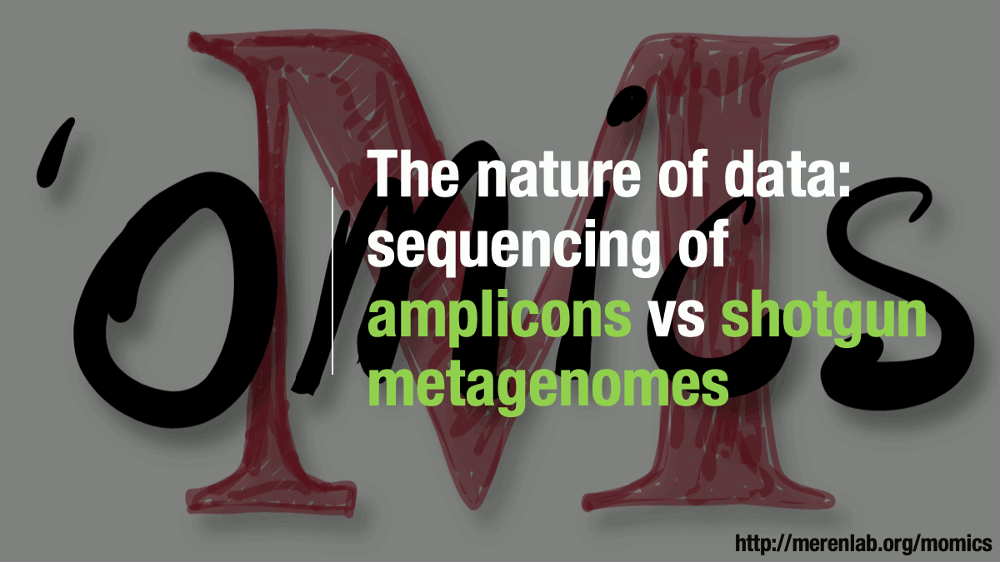
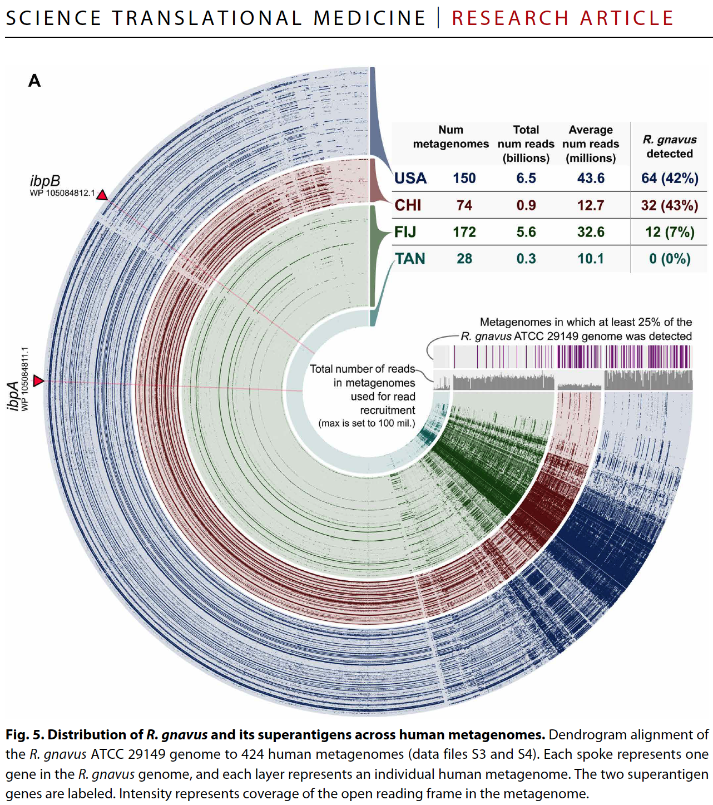
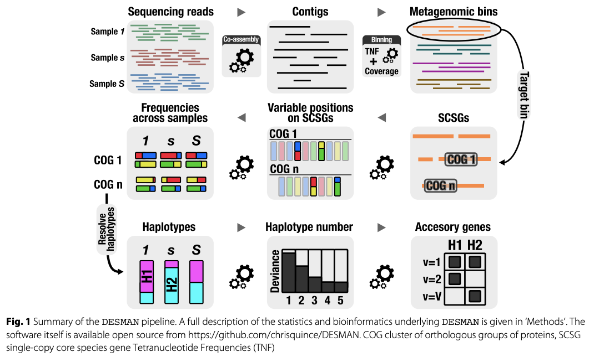
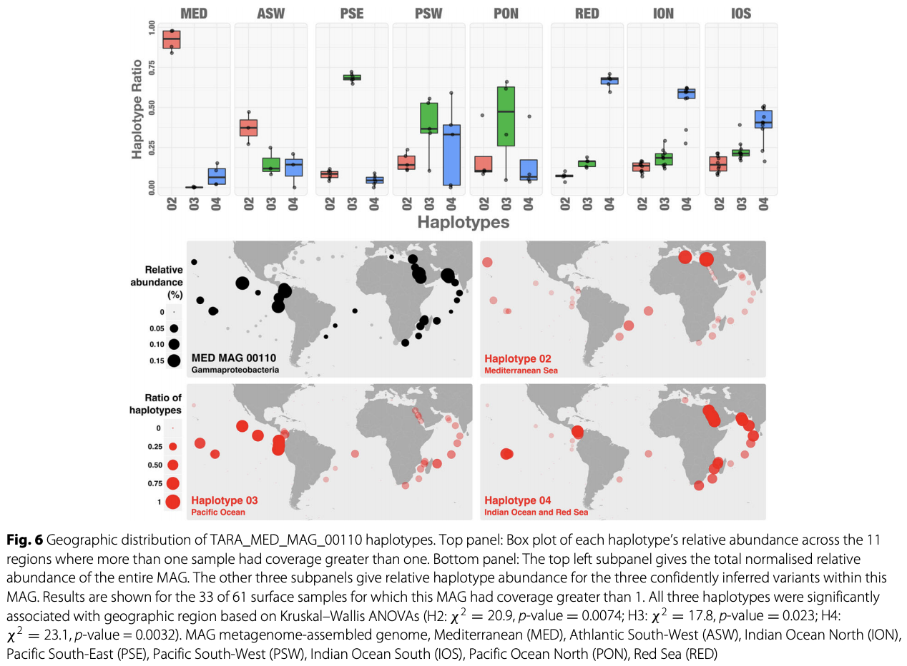



On this page you will find some of the reusable material [Meren Lab](http://merenlab.org) has developed to communicate key concepts in microbial 'omics.



## Motivation

I am teaching an undergraduate course at the University of Chicago on Microbial 'Omics with the following description (the rest of the syllabus is [here](syllabus.pdf)):

<i>Every ecological niche our planet has to offer, including the human body itself, is home to an astonishing number of microbial cells that form complex communities. The last several years witnessed tremendous advances in molecular and computational approaches which now offer unprecedented access to these communities through new 'omics strategies. Developing an overall understanding of these strategies -including the ability to identify their appropriate applications and shortcomings- has quietly become a de facto necessity in the journey of an independent life scientist. The primary aim of this course is to empower its participants and enable them to study the ecology, evolution, and functioning of naturally occurring microbial populations. Through equal proportions of theory and practice, the participants will use state-of-the-art computational methods to work with real-world microbial data and recognize the current conceptual framework that helps us wrap our collective mind around the most diverse form of life on our planet.</i>

I believe an undergraduate training in microbial 'omics is critical for two reasons. The first reason is the need for an *early exposure* to the key 'omics concepts. An early understanding of the caveats and strengths of individual strategies can help form and address more complex questions later. The second reason is the need for *better preparedness* to the reality of the field. Classical undergraduate training in life sciences does not include adequate exposure to the basic principles of computational strategies commonly used in data-enabled microbiology, even though most microbiology-related endeavors expect some level of mastery in them.

This page contains two key resources that emerged from this course: **[animations of key concepts](#concept-animations)**, and **[student questions](#student-questions)**.

{:.warning}
Please note that this is an evolving resource, and do not hesitate to get in touch with us if you have any questions or suggestions.

<blockquote class="twitter-tweet">
Some of the material we have developed to teach Microbial &#39;Omics at the University of Chicago is now public:    <a href="https://t.co/3xEaeRgAXs">https://t.co/3xEaeRgAXs</a>  It is indeed a start rather than a final product, and I hope it will evolve with your feedback to become a useful community resource.
&mdash; A. Murat Eren (Meren) (@merenbey) <a href="https://twitter.com/merenbey/status/1156954062593638400?ref_src=twsrc%5Etfw">August 1, 2019</a></blockquote> 

## Concept animations

With the realization that some concepts in microbial 'omics are difficult to communicate without extensive visual aid, I started creating animations on my tablet computer and used them during the course. In my experience, advancing through these animations slide-by-slide creates enough room for questions and discussions to elucidate ecological and evolutionary interpretations of primary forms of data.

**My motivation to make these animations publicly available is to ensure that they are accessible to others who may be interested in using them to teach these concepts in a similar fashion** (PowerPoint slides for each animation is also available underneath every animation).

The following sections describe each concept with a short summary of how I used them during the course. Please feel free to use any of the PowerPoint files in your own presentations, or let me know if you would like to chat about their interpretations.

{:.notice}
**How do you create these animations?** My strategy is embarrassingly simple and probably not optimal since I am not a graphics designer. But since I heard this question multiple times, I decided to put my pride aside and offer a public response for this in case others may also want to use a similar strategy to create new material. My workflow has three main steps and the trick here is to think backwards. First, I draw the entire concept on my tablet computer manually (I use a graphics editor called ProtoSketch, but any editor that can export SVG files will do just fine). Then, I step by step remove parts from the final SVG and export individual PNG images of identical size (I use [Inkscape](https://inkscape.org/) for this, and you should, too! Inkscape is an open-source vector graphics editor that needs your support and will serve you very well in the long run). Finally, I import the resulting PNG images into slides in reverse order so I can advance them one by one to introduce the entire concept from scratch.

### Amplicons vs shotgun metagenomes

Amplicon sequencing and shotgun sequencing represent the most popular ways to  generate sequencing data to study microbial life. Both strategies come with their unique advantages and disadvantages. The purpose of the animation below is the communicate the key difference between the data they yield and to discuss their appliations. 

{:.warning}
[Download as PowerPoint slides](00-amplicons-vs-shotgun-metagenomes.pptx).

### Metagenomic read recruitment: how it is done

Metagenomic [read recruitment](../vocabulary/#read-recruitment) is one of the most commonly used strategies in microbial 'omics. The purpose of this animation is to communicate how it is done in simplest terms possible.

{:.warning}
[Download as PowerPoint slides](01-metagenomic-read-recruitment-simple.pptx).

### Metagenomic read recruitment: how it is used

The animation below aims to support a discussion on non-specific read recruitment, [coverage](../vocabulary/#coverage) versus [detection](../vocabulary/#detection), and the association between read recruitment statistics and their ability to enable us study genomic variation in environmental populations (i.e., microbial population genetics).

{:.warning}
[Download as PowerPoint slides](01-metagenomic-read-recruitment.pptx).

### Genome-resolved metagenomics

We use the term 'genome-resolved metagenomics' to describe a family of strategies that generate genome-level insights from metagenomes, rather than focusing solely on short reads for broad taxonomic or functional summaries of samples. The purpose of the animation is to support a discussion about the advantages and disadvantages of using reference genomes or metagenome-assembled genomes to recruit reads from metagenomes. It also provides an opportunity to discuss limitations of assembly and binning.

{:.warning}
[Download as PowerPoint slides](02-genome-resolved-metagenomics.pptx).

### Reconstructing genomes from metagenomes

The aim of this animation is to discuss the general steps of reconstructing genomes from metagenomes. It shows that it is often not perfect, even when abundances of individual populations are relatively even. Often, population sizes dramatically differ between different taxa, which makes it quite difficult to reconstruct genomes of rare taxa.

{:.warning}
[Download as PowerPoint slides](03-reconstructing-genomes-from-metagenomes.pptx).

#### Computing k-mer frquencies

We often use the fact that tetranucleotide frequencies of nucleotides are relatively conserved throughout genomes to identify [contig](../vocabulary/#contig)s that belong to the same [population](../vocabulary/#population) genome, however, what it even means to compute k-mer frequencies is not something covered in great detail. The purpose of this animation is to demonstrate how it is done step-by-step, and how this information could lead to the identification of sequences that are compositionally similar without any a priori knowledge about their origins.

{:.warning}
[Download as PowerPoint slides](04-computing-kmer-frequencies.pptx).

#### Differential coverage

The assumption that [contigs](../vocabulary/#contig) belonging to the same population genome will have similar coverages within a given metagenome enables the use of differential coverage to reconstruct genomes. The purpose of this animation to discuss this principle step-by-step.

{:.warning}
[Download as PowerPoint slides](05-computing-differential-coverage.pptx).

#### From metagenomic reads to anvi'o merged profiles

This animation demonstrates the essential steps of going from short reads to metagenomes in anvi'o.

{:.warning}
[Download as PowerPoint slides](06-anvio-merged-profile-db.pptx).

### Pangenomics

Pangenomes are critical tools to understand how a given set of genomes relate to one another with respect to their entire gene content. The purpose of this animation is to describe common steps most computational strategies rely on to compute pangenomes.

{:.warning}
[Download as PowerPoint slides](07-concept-of-pangenomics.pptx).

### Metapangenomics

We define a ‘metapangenome’ as the outcome of the analysis of pangenomes in conjunction with the environment, where the abundance and prevalence of gene clusters and genomes are recovered through shotgun metagenomes. The purpose of the following animation is to build on the previous description of pangenomics and show how it can integrate with environmental metagenomes.

{:.warning}
[Download as PowerPoint slides](08-concept-of-metapangenomics.pptx).

### Phylogenomics

{:.notice}
Slides for this section will be available at some point :/

### Phylogenetics vs Phylogenomics vs Pangenomics

A discussion on how these three commonly used strategies compare.

{:.warning}
[Download as PowerPoint slides](09-approaches-for-comparative-genomics.pptx).

## Student questions

After each lecture, I ask students to send me an e-mail with their take from it and ask me about concepts that were left unanswered or remained confusing. I shared my responses with the entire class after anonymizing questions and collapsing similar questions into a single one. This section contains some of the questions and responses I sent back back to the entire class after each lecture.

I decided to share them publicly for three reasons:

* They may serve as some insights into what comes across as confusing to those who are exposed to microbial 'omics for the first time. This could not only help newcomers to find answers to their own questions, but also help educators to better plan their training to put emphasis on topics they cover (although I also assume that these questions may be better reflecting my shortcomings, but I will let you be the judge of it :)). 
* Some of the questions may serve as inspiration for those who are looking for new directions to explore through the eyes of those who are just learning about these topics.
* This page can evolve over time, the best answers I could come up with could be scrutinized and/or corrected through the community input, more questions from others can be added, and this content can turn into a general community resource to learn microbial 'omics.

{:.warning}
Please remember that some of these answers may be incomplete, or even incorrect in some cases. If you have any suggestions (or new questions) please feel free to reach out to me through the comments section at the end of the page, or through GitHub. The source code of this page is [here](https://github.com/merenlab/web/blob/master/momics/index.md), and your edits or pull requests would be most welcome.

### Week 1

**Questions & answers:**

> How do you use the command line? Is it similar to R?

The [command line](https://en.wikipedia.org/wiki/Command-line_interface) interface, which is also known as the terminal environment (some people also call it 'BASH' because that is the default *shell* most terminal environments use), is a text-based interactive system to make computers do things for us.

Through this interface you can run programs, work with large numbers of files all at once, and do basic data manipulation through [shell scripting](https://linuxconfig.org/bash-scripting-tutorial-for-beginners), basic shell commands that are almost universally available ([such as cat, grep, sort, find, and others](http://xahlee.info/linux/linux_common_commands.html)), and text-processing languages such as [AWK](https://likegeeks.com/awk-command/). Knowing how to do things in the command line environment and learning BASH are extremely useful skills for EVERYONE, but they often are missing in the curricula of especially biological sciences. Fortunately, among the resources I linked above, there are scientists who try to help biologists address this gap in their learning. If you have never been exposed to command line environment before, I would recommend you to take a look [at this resource by Mike Lee](https://astrobiomike.github.io/bash/bash_intro). If things still don't make sense after reading that resource, please feel free to send a message to Anvi'o Slack channel. I think anyone can learn these skills and the best time to invest into learning the command line environment is the first time one has to use it.

If you are familiar with R, you may find it easier to learn how to do things in the command line environment. However, your R knowledge will not directly translate to your experience in the command line.

> What are the advantages of using Ribosomal proteins rather than using the 16S ribosomal RNA genes to study the diversity of life by building phylogenetic/phylogenomic trees?

Every part of the universal protein synthesis machinery is under tremendous amount of selective pressure, and most of its components are conserved throughout the tree of life. Hence components of the protein synthesis machinery can and have been used to infer ancestral relationships between organisms and their diversity. But indeed, different components of it enjoy (or suffer from?) different kinds of pressure. These are extremely deep discussions that are not yet fully resolved in microbiology. What I mean by that is that the fundamental question "what is it we should use to infer the evolutionary relationships between meaningful units of life" is quite a a debated one. So I will try not to make grand claims here (and you shouldn't believe any grand claims from anyone as truth on this topic). 

Ribosomal RNAs have played a historical role in identifying the major branches of life initially. However, ribosomal proteins are more commonly used as of today to infer the tree of life. There are theoretical as well as practical reasons behind this transition. Ribosomal RNAs have unique advantages that are mostly relevant for environmental amplicon studies. The ribosome is partially formed by the small and large subunits of ribosomal RNA genes, secondary structures of which enable them to find each other and give a [pretty tight hug](https://en.wikipedia.org/wiki/Prokaryotic_small_ribosomal_subunit) in the cytoplasm. The structural requirements for a powerful association between these two molecules create severe constraints on certain parts of these molecules, making them evolve much much more slowly. We have been using these conserved parts to design 'universal' primers to amplify the information between targeted conserved regions (the '16S/18S' workflows use this principle). Meanwhile, the parts of these genes that evolve much more rapidly in comparison (due to their diminished importance in forming the conformation between the two units which results in diminished constraints in their sequence) contains enough information for their phylogenetic placement to infer taxonomy (so you can amplify from an environment, and talk about the diversity of microbes that live there). But we can't get the full picture of diversity by using 'primers', since the procedures to access the full-length ribosomal RNA gene sequences to 'design' these primers are not unbiased (such as cultivation). In addition, since there is no evolutionary pressure on these hyper-variable parts of the RNA coding genes, some scientists claim that these genes can't accurately delineate phylogenetic relationships between distantly related organisms and accurately infer major lineages in domains of life. But you may find many published studies that do exactly that. Let's say there are disagreements among the great names of our field.

Despite their differences, trees built with ribosomal proteins and ribosomal RNAs often agree to quite a meaningful degree. But there is also a practical advantage on the side of the use of ribosomal proteins, and it is a less obvious one: when you reconstruct genomes directly from the environment, assembling full-length ribosomal RNA genes is a very challenging task as they have these highly conserved regions that cause computational bottlenecks with short read lengths we use for high-throughput sequencing. For instance, [the only reason this was possible](https://www.nature.com/articles/nmicrobiol201648) is because people have used ribosomal proteins they found in genomes that were missing in cultivated organisms but could be reconstructed directly from the environment (and some people were very upset with this approach (but that's OK because even chocolate does not make everyone happy, and what to use to infer diversity is far from chocolate)). 

> You said that the quantification of biology through high-throughput sequencing is difficult. What questions should we be asking to these data and how do we find the answers, then?

Thank you, great question: How should we form our questions to avoid biases in quantification is an excellent way of thinking about how to approach to this problem. In an ideal world, a well-designed experiment will give us a binary resolution for a given hypothesis, and it is not impossible to do it with high-throughput sequencing, either (or getting really close to that). The field of microbiome is extremely young, so we haven't yet reached to a level of understanding we can expect hypothesis-driven research (which brings you closer to binary answers) to compete with exploratory research (which gives you numbers to play with). We will most likely get there, but until then the take home message is don't rely on numbers you get from high-throughput sequencing results to make very strong biological statements. I hope we will talk much more about this throughout the class.

> Why bacteria look like they are so much more diverse than archaea?

The feeling that bacteria are *much more* diverse than archaea may be a misleading by-product of our biased cultivation strategies, our disproportional focus on a subset of environments we commonly study, and biases associated with the sequencing strategies we use to characterize environmental samples. That said, personally I wouldn't be surprised if archaea are inherently less diverse compared to bacteria, because they are more associated with the eukaryotic life (no offense). But I am not sure if microbiology is at a state to make a final statement on this topic one way or another. I'd be more than happy to be proven wrong.

> Is genetic diversity among microbes can be translated to metabolic diversity among them? Or the increased variation between microbial genomes is a product of their longer presence on Earth?

The answer to the first question I can confidently offer is "*largely, yes*" (only *largely* since there are always exceptions --I'm sure we could find microbes that are so far from each other in the sequence space and genetics but they are so close to each other metabolically). The second question is a fundamental one. If I had to translate that question into a hypothesis I'd say: *The more ancient the fork between any given two branches in the tree of life, the more variation there would be between the extant members that belong to either of these branches*. This makes sense to me, and would likely to be the case for most organisms we have been able to characterize in most up-to-date trees of life. But regardless of what I think, this is quite a testable hypothesis and would make a great project for the next year (or for anyone). 

> There are genes that encode conserved functions (such as heat shock proteins) but their sequence is much more diverse than for instance ribosomal proteins. Couldn't they be useful for something?

Yes, that is true. And such genes (functionally conserved within a clade, yet are not so conserved at the sequence space) can be used to investigate more finer levels of associations between genomes. However, horizontal gene transfer events often cause lots of headaches to resolve accurate ancestral relationships between genomes through such genes.

> Has anyone tried to define the hypermatrix of all ecological parameters present on Earth? It would be cool to try and visualize the sliver that eukaryotic life occupies versus the portion that microbes occupy.

Excellent idea. I did some Google searches, and run into [this paper](https://onlinelibrary.wiley.com/doi/epdf/10.1111/ecog.01961) .. which is not absolutely relevant to this suggestion, but it gives some glimpses of how this idea could look like. Very doable, in fact. But I will resist to urge to start trying to implement it (meanwhile you should not stop yourself if you have the same urge because I think someone should do it).

> What features should microbiologists use to classify bacterial species? If percent sequence divergence is the metric used, how do we determine a non-arbitrary cut-off of percent divergence?

This is an excellent question. There are operational definitions (we will talk more about them in the class during later weeks). But to answer this question besides operational needs and in a theoretically sound manner, we should first define what is a species. So here is a question for everyone: What is a microbial species? Do they exist? Should they exist? And perhaps most importantly, to what extent our desire to partition the chaotic and intermixed complexity of life into some categorical units will actually serve us to make better sense of life?

### Week 2

On shotgun metagenomics and metagenomic read recruitment.

**Questions & answers:**

> How does shotgun sequencing work? What primers are used?

This is the beauty of shotgun metagenomics: we don't use any primers to amplify specific parts of genomes ([except when we have to do it due to biomass limitations](https://microbiomejournal.biomedcentral.com/articles/10.1186/2049-2618-2-3)). Shotgun metagenomics is the sequencing of the entire DNA content of an environment. No amplicons. This primer-free approach enables to gather genetic information from even most novel microbes that our primers from known microbes can not identify.

> Why short reads are so short?

On the one hand this is a very tough question to answer (such as why our bones have no color, or how microwaving grapes yields plasma (yeah, it is a thing: [exhibition A](https://www.youtube.com/watch?v=RwTjsRt0Fzo), [exhibition B](https://www.youtube.com/watch?v=wCrtk-pyP0I))). On the other hand it is very simple to answer: it is the best our current sequencing chemistry can do. One of the best articles I run into on this topic is this one if you are truly interested in understanding the chemical limitations of sequencing by synthesis (what is used by Illumina): [https://www.nature.com/articles/nbt.1585](https://www.nature.com/articles/nbt.1585). Even though they are not yet competing well with the accuracy and throughput of short-read sequencing, things are slowly changing thanks to the emergence of long-read sequencing platforms.

> What are the basic principles of the *de novo* assembly of short reads?

In fact, the computational underpinnings of most efficient *de novo* assembly algorithms rely on a relatively simple principle: building and resolving de Burijn graphs. Here is a video by [Rob Edwards of the San Diego State University](https://edwards.sdsu.edu/research/) in which he [explains](https://www.youtube.com/watch?v=OY9Q_rUCGDw) the basic principles of this strategy using a simple example:

<iframe width="560" height="315" src="https://www.youtube.com/embed/OY9Q_rUCGDw" frameborder="0" allow="accelerometer; autoplay; encrypted-media; gyroscope; picture-in-picture" allowfullscreen></iframe>

> What are the basic principles of the mapping short reads to a reference context?

Basic principles of mapping requires familiarity with concepts in computer science. Most of us will not need to understand all these details, but if any of you would like to learn more, I would suggest them to start reading about [Burrows-Wheeler transform](https://en.wikipedia.org/wiki/Burrows%E2%80%93Wheeler_transform), a very elegant algorithm the vast majority of modern mapping algorithms use to be able to align reads to reference context *even when they don't match perfectly*. Here is a paper from one of the leaders of these sorts of algorithms, [Heng Li](https://scholar.google.com/citations?user=HQv0p0kAAAAJ&hl=en), on the application of Burrows-Wheeler transform to sequencing data: [https://www.ncbi.nlm.nih.gov/pmc/articles/PMC2705234/](https://www.ncbi.nlm.nih.gov/pmc/articles/PMC2705234/).

> What guarantees the accuracy of the resulting genomes in the *de novo* assembly and genome binning workflow? How do we know contigs we put together belong to the same populations? In other words, how is it possible to determine which contig belongs to which bacteria (when the colors in your presentation are absent)?

Great question. Given the (1) biological complexity of most microbial habitats, (2) the read lengths of short sequencing, and (3) the computational complexity of *de novo* assembly, there are many pitfalls to the assembly process itself, and the downstream approaches to ensure the quality and accuracy of metagenome-assembled genomes. While it is still possible to a large degree to find out which contigs go together through binning strategies (which I will explain in detail next week), it is not always straightforward, and absolute certainty is quite rare.

In addition, even when we bin independent 'contigs' that belong to the same population genome accurately into metagenome-assembled genomes, we often do not know their actual physical order in the genomic context, hence we don't get to determine their arrangement. However, we learn about the order of genes in a given contig rather confidently, which still is very helpful especially if we can recover long enough contigs.

There are two relatively easy-to-follow papers I would suggest anyone to take a look to see the [problems composite genomes lead to](https://doi.org/10.1128/mBio.00725-19), and [ways to generate better genomes](https://genome.cshlp.org/lookup/doi/10.1101/gr.258640.119) despite all the limitations.

> Do we always get fewer short reads that don't map to anything when mapping to metagenome-assembled genomes versus isolates?

It depends! Say, you have a *Bifidobacterium longum* population in a metagenome. If you were able to assemble its contigs and bin this genome almost entirely, you would be able to recruit nearly all *B. longum* reads in that metagenome using that MAG. But if your efforts only give back half of the genome, then 50% of the reads from that population would remain in the metagenome after read recruitment, uncharacterized. On the other hand, using a random *B. longum* isolate genome may have recruited, lets say, 70% of the reads that belong to the original *B. longum* population in the metagenome if they are not a very good match. There will be some cases where a given isolate genome will do much better than the best MAG you can reconstruct, or a poorly done MAG will do much better than any isolate genome available. There will be all combinations of all potential outcomes of all likely events in reasonably complex environments. Schrödinger's metagenomes: you did both great and so miserably at the same time until you open the box.

> What is the main limitation of generating metagenome-assembled genomes instead of using reference genomes for read recruitment?

Two folds: One, we may not be able to assemble some populations effectively if they are too complex, hence we would get no contigs from them that are longer than our minimum length cutoff. Two, not all contigs in an assembly that passed the minimum length cutoff can be effectively organized into metagenome-assembled genomes.

> Can we identify reads that are coming from other populations when we use genomes for metagenomic read recruitment from complex environments?

Yes and no :) By relying on coverage statistics and single-nucleotide variants throughout a given genome, we can identify those genes that seem to be recruiting reads from multiple populations in an environment (a phenomenon which we often call '*non-specific read recruitment*'). But we can never be sure if this is a multi-copy gene in the same population with variation, or if it is truly coming from other populations. What we can do, though, we can find those genes that are truly unique to a given population. That is exactly what happens when one runs `anvi-interactive` on a genome with `--gene-mode` flag. Here is a figure from a [recent publication](https://stm.sciencemag.org/content/11/507/eaau9356) that shows the distribution of genes in a single genome across metagenomes:

By looking at this figure one can tell which genes are uniquely represented by the genome in a single-copy fashion, and which genes are more likely to be multi-copy or recruiting reads from other populations in environments.

> How are non-mapping reads usually handled in a real-world scenario?

In some cases they are ignored, because there are always too many stories to tell even with the fraction of the reads that did map to metagenome-assembled genomes. Perhaps one of the most extreme examples of this I witnessed was in one of our recent studies: Tom Delmont reconstructed about 1,000 genomes from surface ocean metagenomes (here is [his journey](http://merenlab.org/2017/05/21/thousand-genomes-from-tara/) through this). Yet when we used these genomes to recruit reads back, we learned that these genomes could describe only 6% of the sequences in these ocean metagenomes (ouch). But we had an [interesting story to tell](https://doi.org/10.1038/s41564-018-0176-9) anyway, so we did not put much effort to the remaining 94% of the reads (a totally irrelevant note about that study, [there is a blog post](https://naturemicrobiologycommunity.nature.com/users/113363-a-murat-eren-meren/posts/34040-microbiologists-vs-shotgun-metagenomes-surface-ocean) that explains my other learnings from that experience).

In other cases researchers try to characterize short reads by attempting to assign taxonomy to them and see whether they are missing a significant fraction of something important, which is a good practice.

> How to decide when to use isolates or *de novo* reconstructed genomes from the environment?

This really depends on the question. Most groups use both strategies in different contexts. I am hoping that you will be able to answer this question natively when we are done with genome-resolved metagenomics and pangenomics.

> Does NCBI allow for submissions of metagenome-assembled genomes that are not from a known organism?

Yes and no. NCBI requires each genome to be associated with some taxonomy. But it hasn't stopped progressive scientists from submitting genomes of unknown origin. [Figure 2](https://www.nature.com/articles/nmicrobiol201648) in this article includes a list of new candidate 'phylum' names (i.e., Momurabacteria, Giovannonibacteria, Wolfebacteria, etc) [the Banfield group](http://nanogeoscience.berkeley.edu/) proposed for genomes we have not been able to cultivate, but were able to reconstruct from metagenomes. They are on NCBI.

> Is there a metric to verify how 'complete' or 'real' a metagenome-assembled genome?

Yes! And it will be a lot of fun to talk about these metrics next week! But briefly, we typically use 'single-copy core genes' (SCGs) to estimate the completion of a MAG. If you would like to get more insights into the use of SCGs, please feel free to take a look at this blog post: [http://merenlab.org/2016/06/09/assessing-completion-and-contamination-of-MAGs/](http://merenlab.org/2016/06/09/assessing-completion-and-contamination-of-MAGs/)

> Does single-cell sequencing have sampling biases?

Indeed. That is one of the limitations of the process. Here is a [paper that mentions some of the limitations of single-cell sequencing](https://www.nature.com/articles/nmeth.4469), including the sampling bias:

"*(...) Despite the surge in the number of studies that use environmental single-cell sequencing and the numerous milestones achieved through these studies, this field has been inhibited from full acceleration by inherent methodological limitations. Not every cell can be sorted, as some cells may be attached to soil particles and become background noise, and no universal lysis method exists, which impedes access to the genomes of certain taxa. For genomes with high GC content, whole-genome amplification leads to biases ([Spetanauskas et al](https://www.nature.com/articles/s41467-017-00128-z)). **All these technicalities can hamper the recovery of SAGs from even the most abundant populations in a given environment** ([Eren et al](https://peerj.com/articles/1319/)). The Eren et al. paper, for example, showed that SAGs known to be abundant from marker-based taxonomic profiling may be poorly represented in shotgun metagenome data from their respective environments. Additional pitfalls include the sensitivity of single-cell genomics to contamination and artifacts such as uneven amplification, which yields partial draft genomes.*"

When targeting a population that is very low abundance, indeed one would need to survey many cells in order to find the ones that we could not characterize through metagenomics. But despite all limitations, single-cell genomics is still a very powerful strategy for certain questions. Here is an amazing application of it if you had extra time in your hands to read some very well written science: [https://science.sciencemag.org/content/344/6182/416](https://science.sciencemag.org/content/344/6182/416). And here is another poster-child for single-cell genomics coming from some of the leaders of the field: [https://www.cell.com/cell/pdf/S0092-8674(19)31273-5.pdf](https://www.cell.com/cell/pdf/S0092-8674(19)31273-5.pdf)

> Why are we mapping short reads to the entire genome when we are using only certain genes to differentiate taxa?

Perhaps the quickest answer is that we aren't only interested in taxonomic make up of an environment as taxonomy does not always predict the functioning of microbial populations. A genome-wide understanding of read recruitment enables us to understand the ecology of a given population along with its genes.

> Are there known SNPs in reference genomes the way we have with humans?

Great question. Quick answer: No, not really. But why it is the case would make a good discussion, in my opinion.

Things we see in the human genome, such as the association between a small number of SNPs and remarkable disease phenotypes, such as ALS, do not have significant representations in microbial life for the vast majority of cases. What I mean by that is that we don't have a bunch of reference genomes for, say, *Bacteroides fragilis* populations that are unable to synthesize capsular polysaccharides, which would be as detrimental to these populations as ALS to humans. So I ask you, why don't we have them? :) Any speculation into this would be a great way to fall into the rabbit hole that would lead to some fundamental philosophical drivers of science.

### Week 3

*On metagenomic assembly, genome-resolved metagenomics, and metagenomic binning.*

**Questions & answers:**

> Do closely related taxa have tetra-nucleotide frequencies that show small deviations from each other as compared to distantly related taxa?

Indeed. Which causes lots of headaches. Closely related taxa often have tetra-nucleotide frequencies that are rather similar, hence sequence signatures often bring them together, making it very hard to distinguish them from each other unless other aspects of data are also utilized.

> What is next once we recover genomes? Where do we go from there?

Depends on the question indeed, but one thanks to the availability of more or new genomes one can build improved metabolic models to understand ecosystem functioning, construct more highly resolved phylogenomic trees to infer evolutionary relationships, construct larger pangenomes to identify gene clusters that may be critical for fitness, or track populations across environments through metagenomic recruit read recruitment. Genomes from novel organisms also make it possible to study how to create a better medium to cultivate them depending on metabolic pathways they're lacking, and finally bring them to the lab environment to ask them more difficult questions. From human diseases to environmental processes, genomes we reconstruct serve as our best chances to answer "how" and "why" questions regarding phenomena mediated by microbes.

> About how much information does differential coverage add to the binning process, relative to sequence composition?

A lot. In fact, the majority of signal that helps us to effectively distinguish microbial populations from each other comes from differential coverage. Indeed sequence composition does play an important role and it is a team effort. It is like Batman and Robin .. Robin being the sequence composition ;) [This review](https://genome.cshlp.org/content/30/3/315.full) covers a case study that demonstrates what happens when differential coverage is *not* used.

> Are there other sources of information that we can add to further improve binning accuracy?

In fact I keep thinking a lot about this, probably just like many others, but I haven't found anything extremely useful to be honest. Perhaps differential bias of synonymous codons (i.e., the differential frequency of codons that decode the same amino acid) could be one, however, sequence composition indirectly captures this information, so I am not sure about its actual power.

> Is there a minimum contig length to use sequence composition signal confidently?

Great question. Yes. For instance if every contig was one nucleotide long, then even some contigs that certainly belong to the same population would have had very distinct frequencies (and vice versa, many contigs that certainly belong to different populations would have identical frequencies). So short contigs are not necessarily helping us to reach to a plateau with respect to the statistical signal we recover from sequence composition. Usually the longer the better. There is not necessarily a golden 'minimum length' cut-off, but we often throw away contigs that are shorter than 1,000 bases. This is not only because sequence composition signal will way less reliable at those lengths, but also anything that is shorter than the average gene length (which is conveniently about 1,000 nucleotides for bacteria) will have very little use in any analysis.

> Is there a minimum contig length to make good use of differential coverage information?

Differential coverage does not have anything to do contig length in theory. But in practice, short contigs are short *for a reason*. For instance one of the most common reasons is that they represent parts of genomes that are conserved across multiple populations. When it is the case, you can imagine that the reads they recruit from multiple populations make them harder to assign to a single population. So the coverage values of short contigs often reflect a mixed signal across multiple populations, making us unable to make good use of them.

> How do we deal with palindromes in k-mer frequencies?

Great question! Since they don't change between strands, we count them only once while we count the occurrence of both complementary versions of non-palindromic sequences.

> How do we bring together both differential coverage and k-mer frequencies for binning?

We often concatenate the two matrices. One matrix is 'contigs *x* k-mers' (where each cell represents frequency of a k-mer in a given contig) and the other one is 'contigs *x* samples' (where each cell represents the coverage value of a contig in a given sample). Since contigs match in both, we can merge these matrices. Binning algorithms often use the resulting super-matrix to analyze.

> Can you go through the steps of the full procedure of reconstructing genomes from the environment de novo?

Sure. (1) Generate short metagenomic reads, (2) assemble them into contigs, (3) recruit reads from each sample using the assembled contigs to learn about their coverage values of each contig in each sample, (4) use differential coverage information, along with the sequence composition of contigs from k-mer frequencies to identify contigs that likely come from the same population, (5) estimate the completion of these population genomes, (6) refine those that need to be refined, (7) do science with those genomes.

> If sequencing technology improves such that we can get longer contigs (because of longer reads), could the ideal k-mer become longer, like `k=5` instead of `k=4`?

The improved sequencing technologies will give us longer and longer reads. But since we can already work with assembled contigs, i.e., orders of magnitude longer sequences compared to our raw short reads, advances in sequencing strategies will not have a direct influence on our ability to utilize larger `k`s to analyze sequence composition for binning. They will make things easier for us, but it will not because they will allow us to use `k=5`.

Making `k=5` will cause more problems, though. For instance, the dimensionality of the data will increase a lot (i.e., the number of columns of the matrix due to increased number of combinations of 5-mers) with likely negligible improvement in signal this change brings. But I think it would make a good project to benchmark the improvement in resolving power of `k=5` vs `k=4` versus the performance loss due to increased complexity of the data.

> If you sample from an environment in which bacteria are infected by phages, will you also end up picking up some of the phage DNA? Does this complicate the genome assembly process at all?

Yes, you will certainly find phage DNA in your sequencing results, and in fact you will get to assemble and reconstruct many phage genomes as well. Here is a great story about this very fact:

[https://www.nature.com/articles/ncomms5498](https://www.nature.com/articles/ncomms5498)

If a 'prophage' (i.e., a virus the genome of which is embedded in the bacterial chromosome) is in its [lytic life cycle](https://en.wikipedia.org/wiki/Lytic_cycle), then the coverage of the phage in the genome will much higher than the coverage of the upstream and downstream bacterial chromosome (I hope at this point we all can see why it would be the case). This can confuse some assemblers, and they may further fragment the bacterial chromosome by reporting a single contig of "downstream chromosome + phage + upstream chromosome" in three contigs :)

> Is there any way to learn/estimate what fraction of genomes we were able to recover from an assembly and how many we missed after binning?

Great question! In fact by only looking at an entire assembly we can find out how many genomes should we expect to get from that sample if everything goes alright. In fact `anvi-display-contigs-stats` program reports that number for a given assembly, too! You can learn more about it in this blog post: http://merenlab.org/2015/12/07/predicting-number-of-genomes/

> What sort of statistical measures are used to determine whether a contig can be included in a given genome with confidence or not?

Unfortunately clustering algorithms do not offer confidence scores for their assignments. Inclusion criteria are often defined by a combination of intrinsic heuristics in addition to theoretical considerations binning algorithms rely upon. I think it would have been great to have such a statistical measure so one could set their level of stringency with their genome bins.

> Is it true that there is no *de novo* assembly algorithm that is optimal, and the performance can vary greatly on the same dataset? If yes, why is are the assembly algorithms so variable in their performance?

It is true that every assembler will likely do better than all other assemblers for some dataset out there. The sad thing is that you often will not know which assembler will perform best with your dataset unless you try all. The reason they are so variable with their performance is because all modern assemblers rely on similar principles and differ from each other by a large number of heuristics they use (i.e., developer decisions and workarounds that were made to improve the efficiency and accuracy of the algorithm based on a limited set of problems captured/identified).

> Are there clustering algorithms that work better on the matrices with differential coverage and sequence composition than others?

Yes. Just like assemblers, binning algorithms can behave so differently. If you are interested in this discussion, you can read my 2 cents on binning [here](http://merenlab.org/tutorials/infant-gut/#comparing-multiple-binning-approaches). Also, here is a more comprehensive blog post that visualizes [the fate of contigs across binning algorithms](http://merenlab.org/2020/01/02/visualizing-metagenomic-bins/).

> It's incredible that any of this works and that we can learn anything at all .... especially since there are so many things that break these approaches.

I agree! :) The more I know about all the steps that take place between collecting a sample from the environment and looking at a visualization of the data on a computer, the more I am confused why any of these things work at all. But there is a message in that: biology finds a way to emerge even when we do things in not-quite-optimal ways.

### Week 4

*On pangenomics.*

**Questions & answers:**

> Why do we use sequence similarities to build our association network rather than 3D protein topology?

We wish we could use predicted 3D structures of proteins for pangenomics! :) But it impractical since we have predicted structures for only a very small number of proteins compared to the diversity of protein coding sequences in microbial genomes.

> In your example there were connections between gene clusters due to very low sequence similarities. How confident are we that these similarities are due to relatedness rather than just chance?

We are not confident at all! The beauty is that we do not need to be confident about those likely spurious connections. Because the clustering algorithm will focus only on those entities that are strongly linked to each other. Formally speaking, MCL algorithm simulates random walks on a graph structure similar to the one I showed in the animation and determines 'transition probabilities' among nodes to classify relationships between genes in the graph using the similarity space the BLAST hits generate. In such a walk, spurious signal will not amount to a significant influence to determine those associations. This way you may have singleton gene clusters in a pangenome even when every gene can contain short regions that can be somewhat similar to many other genes.

I know this is a bit complicated. Those of you who have the right background should start with this paper, and read references within depending on how deep they wish to follow this rabbit hole:

[https://genome.cshlp.org/content/13/9/2178.full.pdf](https://genome.cshlp.org/content/13/9/2178.full.pdf)

PS: What they call "ortholog groups" in this paper is what we called "gene clusters" in our discussion.

> What does the inflation parameter do in MCL?

A formal definition of 'inflation' in the context of MCL is discussed here:

[https://www.micans.org/mcl/intro.html](https://www.micans.org/mcl/intro.html)

But an informal description of this in the context of our discussion is this: inflation regulates cluster granularity. Larger values of inflation will increase the cluster granularity, and it will start *splitting* clusters into finer ones. Decreasing it will lump more things together. As you can imagine, biological interpretations of resulting clusters given an inflation parameter or their relevance to the question at hand will depend on the nature of the data. In my personal experience, inflation mostly effects rather dubious clusters, where it is not so obvious whether certain genes should be together or not, and does not change overall patterns of associations between genomes in a pangenome. This is largely because there are no heterogeneity continuums in amino acid sequence space (because life is not that random) and distinct genes resemble distinct planets that have so much empty space them.

> How is the inflation parameter chosen? Is it different for each gene cluster? Are different values used, and then the optimal value(s) are chosen?

Inflation parameter defines the behavior of the entire algorithm, so it is chosen per run. There is no optimal value as it depends on the dataset, which requires anyone who uses these strategies to survey the parameter space. But then to determine which one is best you need a ground truth .. which we often lack. We can simulate all and look at the regimes of sudden change as a function of inflation to find an appropriate value. But it is not common practice.

> A question about the network part of the pangenome creation: are the relationships built specifically off of the percent similarities found during the BLAST search? Is there another way we can characterize the relationships between genes and create the network from it?

Yes, associations between genes are solely depend on their sequence similarities we learn from their local alignments via BLAST. Another way of doing this could be using functional annotations, for instance. What else do you think we could use? (not a trick question, I really don't know and am curious what you would think).

> Could you do a pangenome for intergenic regions instead of genes and would it tell you anything interesting?

This is an excellent question!

There is a limitation though: intergenic regions will not resolve to amino acid sequences (since they are not translated), but one could envision doing it with DNA sequences. I think that would be very interesting, and I don't think anyone did that. I would like to call it "reverse pangenomics" :) I think this is certainly worth trying.

> If you have two (or more) gene clusters you suspect have the same function, couldn't you resolve that question by comparing to a database of known protein structures (with the same caveats as other database based techniques) and checking if those gene clusters resolve to the same protein structure?

Indeed you could! But only if you had a rich database sequences and corresponding structures. Unfortunately our insights into structure is very limited, and predicting the structure of proteins given the amino acid sequence is one of the most fundamental endeavors of structural biology. Here is a nice Wikipedia article for basics:

[https://en.wikipedia.org/wiki/Protein_structure_prediction](https://en.wikipedia.org/wiki/Protein_structure_prediction)

And here is an article on challenges:

[https://www.ncbi.nlm.nih.gov/pmc/articles/PMC2680823/](https://www.ncbi.nlm.nih.gov/pmc/articles/PMC2680823/)

> Is it possible that genes with very similar functions in different genomes end up in different clusters due to sequence dissimilarity?

Indeed. In fact it happens all the time :) We are going to talk about this a bit more on Thursday, but just to example, this is a pangenome for a bunch of genomes using gene clusters:

And here we are looking at the same genes and genomes but this time we are comparing them not based on whether they are similar at the sequence level, but whether they are annotated with the same 'function':

Please think about why they look different and what does it mean.

> Even if you find a gene cluster that seems interesting/essential, what happens when you don't know the function of any gene within that cluster. Are there pathways besides wet lab work to figure out what that cluster does, or do you need to go to the lab and start making knockout/over-expression mutants to see if you can get a phenotype? What happens when none of the genes in your cluster have a notable phenotype, but they appear to be important?

Great question. What are the next steps? I feel like things we do bioinformatically rarely lead to final answers, and instead we do everything we do to come up with better questions to finally address them at the bench.

If a gene cluster with unknown genes seem to be very interesting, one could take a look at upstream and downstream of those genes in each genome to see whether there are conserved pathways in which they occur systematically. Or as you suggested, one could plan to get rid of them, or try to inhibit their function *in vivo* through strategies like CRISPR editing, or try to over-express them in a model system to see if they are really doing the things we hypothesize them to do. What is next is often depends on the question, but there *always* is a next. I like this from Richard Feynman: "*the thing that doesn't fit is the thing that's the most interesting*". I think the power of bioinformatics lies its ability to show quickly things that don't fit. Gene clusters that show weird distribution patterns. Functions appear in contexts we don't expect. Genomes show abundance profiles in environments that are known to be unwelcoming. Then we always have to find out 'why' it is the case, and final answers almost always come from a scientist somewhere who actually had to get their hands on a pipette.

> All single-copy core genes are assumed to be conserved for some purpose –but what is the range of levels of sequence dissimilarities in these genes? Do those differences reflect lesser or higher selective pressures?

The sequence similarity between genes within single-copy core gene clusters will differ depending on their function. For instance, for a given set of closely related genomes, sequences could be 100% identical to each other within single-copy gene clusters that resolve to ribosomal proteins. Which may not be the case for most other gene clusters. In fact, thanks to Mahmoud Yousef's efforts, anvi'o can answer the question "*to what extent '[functional homogeneity](http://merenlab.org/2016/11/08/pangenomics-v2/#functional-homogeneity-index)' changes across core gene clusters in within a single pangenome?*".

> Why look at amino acid sequences rather than nucleotides when there is more variability in the DNA sequence? Would it not be a better way to distinguish genes in a pangenome?

Yes, we would have had much more signal for differentiation if we were to look at DNA sequences. But since DNA sequences of low similarity could encode identical amino acid sequences, this approach would hamper our ability to group genes that likely perform the same function in a given pangenome. Our purpose with pangenomics is two folds: (1) group together genes that are likely doing the same thing (without over-splitting so we can identify a core genome to appreciate the actual accessory genome) and (2) don't group together genes that are likely doing different things while trying to accomplish (1) (without lumping together too many things and potentially miss differentially occurring functions across genomes). Amino acid sequences help us draw these lines a bit more accurately as the diversity in the sequence space and its association with function becomes more saturated as we go from DNA to amino acid sequences.

> Why do we represent BLAST hits through a network to resolve gene clusters in pangenomes rather than phylogenetic methods such as neighbor-joining?

Mostly because we do not have a phylogenetic organization of genes to work with. One could envision ways to rely on phylogenetic trees to identify gene clusters based on where each gene is inserted from each genome, but to do it properly we would need a universal tree of all genes. But this hypothetical tree would be impossible to reconstruct since inter-gene similarities that represent different functions are often zero, hence there is no signal to present them on the same common phylogeny. One could implement independent trees for each gene, but it would limit us to work with things we have extensively characterized and sampled many times to have stable, highly-resolved phylogenies. By simply not relying on any *a priori* information about genes themselves beyond sequence similarity, the pangenomic strategy we discussed allows us to make sense of every gene in every genome.

### Week 5

*On metapangenomics.*

**According to students:**

> This week we discussed metapangenomes and how looking at the intersection of metagenomics and pangenomics can give us more information about the ecology and evolution of specific organisms in the environment than either strategy alone.

> Today we learned about using metapangenomics to connect ecology of microbes to their evolutionary history by investigating genomic and environmental core genes and how they may contribute to fitness in different environments.

> A genome reflects a single member of a large population of cells, and does not immediately tell to what extent its genes are relevant to the population in the environment. Environmental core genes of a population can be defined as the genes that are systematically detected in metagenomes in which the population is found (i.e., its niche). In contrast, genes that are found in the genome but not systematically in the environment, can be considered as the environmental accessory genes.

> Pangenomics gives us information about the gene clusters and allows us to make associations between microbial genomes. Metagenomics gives us information about the environment and elucidates what genes are essential for populations we access through metagenomic read recruitment. A combined analysis of pangenomes and metagenomes offers insights into genes are likely essential for microbes to thrive in a given environment.

> Not all accessory genes of the environment will be present in every genome recovered from a given environment due to biases associated with cultivating microbes or reconstructing genomes from metagenomes. Hence, the use of the reference genomes limit our understanding of all accessory genes associated with a population in the metagenome. Yet, if a gene is systemically present when a population is present across several metagenomes, then it is more likely it is a part of the environmental core.

**Questions & answers:**

> We had a pangenome, and then recruited reads from different metagenomes to each of the genomes in the pangenome. Could we do it the other way around?

Indeed. The order of metagenomic read recruitment and pangenomic analysis can be reversed since neither of these analyses require the other to be done. The nexus between the two requires both of them to be done.

> *(continuing from the previous question)* meaning, could we start with a metagenome, do assembly and binning to get MAGs, and then for each MAG we make a pangenome with related population genomes (for instance, by assigning taxonomy to the MAG and doing a pangenome of the taxonomic group)?

Absolutely. This would be the most ideal way to do it. What goes into this analysis does not have to be limited to the MAGs that are recovered from a metagenome, but one could also include into this mixture available isolate genomes, single-cell genomes, or MAGs that are reported previously.

> Can competitive read recruitment lead to incorrect recruitment across genomes --I.e., a read should really be in one genome but actually gets recruited to another genome because it has a gene in the same gene cluster?

If a read is confidently mapped to a reference context, we can't assume that this is happening 'incorrectly'. A myriad of ecological and biological phenomena could explain why it is the case, but if a read is perfectly matching to a reference context, it is matching to that context. That said, having too many genomes in a database for competitive read recruitment can lead to misleading observations. For instance, let's assume you have a genome `A` that is a member of an environmental population, `A'`. The coverage of every gene in genome `A` is `X` in a metagenome in which population `A'` does occur. Assume you include one more genome in your competitive read recruitment analysis, `B`. Let's imagine that `A` and `B` are very different from each other, but there is one gene that is identical between the two. Even if the population `B'` does not occur in the environment, the coverage of the gene in `A` will be `X/2`. So, can one say that those reads that were mapped to the gene in `B` shouldn't have mapped there? I don't think so. Because we did include `B` in our read recruitment analysis, and it does have a gene that matches to something that occur in the metagenome. So all checks out here. But we *did* create a bias in our observation of the coverages of genes in *A* :)

> Are there ways to improve/update reference genomes to be more inclusive?

As we previously discussed, we can use MAGs to better represent genomic contexts in various environments, rely on single-cell genomics, and so on. But I think it is likely that our ability to fully characterize microbial habitats with the presence of all genes and genomes will take longer than my lifetime (fortunately you people are young and stand a much better chance to see that happening).

> What are ways in which you can deal with the dilution effect of competitive read recruitment when similar genomes are present in the reference?

Great question. One can place their reads into multiple places. For instance, you can allow your mapping software to map multiple copies of the same read to multiple reference contexts. But how does this influence our estimates of relative abundance of genes and genomes is another question.

> How do you deal with the fact that you not all genomes in a given environment will represent organisms that are fit? For instance, environmental conditions may have rapidly change so much that some organisms will no longer fit to the new environment, but their genomes will still end up in sequencing results.

Great question. I think we can assume that the turnover rate of microbes are rather rapid in high-productivity environments. For instance, when we use antibiotics, those who are susceptible to this treatment gets almost completely eradicated from the environment relatively rapidly. But this will indeed depend on the habitat we are looking at. For instance, it is well established that genomes of microbes that are dormant, or even dead, can stay in soil for a long time, and our sequencing data may include those are active as well as those that have not been active for a long time. For instance, here is a good title: "*[Relic DNA is abundant in soil and obscures estimates of soil microbial diversity](https://www.nature.com/articles/nmicrobiol2016242)*" to start thinking about its implications. But I think it is safe to assume that microbes that have no power to compete with others will be replaced by others in much shorter timescales in most habitats such as the human gut, oral cavity, or surface ocean, where competition for resources is fierce and there are no physical barriers that limit dispersal like in soil (so all those sweet molecules you have in you will be feasted upon by other microbes).

> Could horizontal gene transfer affect the way we understand environments? I suppose it would be possible that these events can impact whether we determine a gene is accessory or core in a set of genomes.

Absolutely. Horizontal gene transfer events will influence our understanding dramatically. That is partially why pangenomes are never clear-cut, and there are always genes that co-occur in a small number of distantly related genomes. Whichever pangenome you look at, you will see genes that rebel against every emerging pattern. Horizontally transferred genes complicate our lives and make it more meaningful. *Sobs*.

> Given that you need to have known genomic and metagenomic data present in order to study metapangenomics, isn't there a limit on the taxa that we can study? How do we advance this?

This is true, but we are not limited to those taxa that we 'know about' neither for pangenomics nor metagenomics. You can also study genomes you reconstructed from a metagenome without knowing which taxon they belong, and find those that are similar to that genome through sequence identities alone.

> Can you go over competitive read recruitment again?

This is not any different than the read recruitment we have been discussing. It only indicates that instead of a single genome in our mapping reference, we have multiple of them, and they must compete to recruit reads. For instance a read is matching with 99.6% identity to one genome and 99.2% identity to another genome, it will map to the former (although it would have easily mapped to the latter if the former was not in the database, hence the 'competition').

> You said we cannot relate read coverage to the number of cells in a population. How can we relate coverage of different genomes to the number of organisms when determining the ecology of the different organisms? How does this work? Is it looking at relative abundance and not making conclusions about exact numbers?

Great question. What we are doing is to rely on changes in relative rather than absolute quantities for any inference. For instance, if in one metagenome a genome recruits ten times more reads than another one, and in the next metagenome it recruits ten times less reads than the other, then we can talk about environmental change that these populations respond differently in different metagenomes. This still wouldn't translate to number of cells in those environments represented by these genomes, but can be useful to infer the ecology of populations to which these genomes belong.

> We can tell what gene clusters are present in the environment and predict the necessity of certain gene clusters. What's next? Is there a way we can potentially recreate a phylogenetic tree of gene cluster similarity based on what we see in the metapangenome?

I think this is a great suggestion. We could certainly use metagenomic read recruitment results infer environmental core or accessory nature of gene clusters across habitats to link them to each other in a similar fashion we use phylogenetic distances between genes to link genomes to each other. I like it, and I think someone should try this at some point :)

> How do we decide if a genome is represented in a metagenome? If coverage is low, the genome could still be present in low abundance, but do we ignore these cases for when we want to distinguish core genes from accessory genes?

Average coverage is not the best predictor of whether a population is present in a given metagenome. Instead, we often rely on [detection](http://merenlab.org/2017/05/08/anvio-views/#detection) to make such conclusions. For instance, if the detection of a genome is more than a particular value (say, 0.5, which would indicate that more than half of the genome is covered by at least one short read) we can assume that genome represents a population that is present at a detectable level in that metagenome. Although, when the coverage is so low, our ability to infer gene distribution patterns confidently diminishes dramatically. So most of the things we discuss apply to those that are well covered in environments we study. This is one of the major limitations of everything we do with environmental sequencing since we inadvertently associate numerical dominance of organisms to their functional significance in environments.

> When we are trying to paint an accurate portrait of the landscape of a particular environment, when we recruit samples for a particular region, how do we know that we are not sampling aliens of a particular community versus sampling at a metropole where many communities congregate if we don't have nice compilations like stool to sample from?

The short answer is that we can never exclude the potential influence of sampling bias in our observations. When microbial populations can change dramatically even with scales of microns, we can never be certain that we did measure a given environment accurately with one sample. However, this is an intense area of research with many who try to approach to these questions from different angles for different environments. Some environments are more 'mixed' than others, and some questions require more attention to that than others. Deciding a resolution for sampling, collecting multiple biological replicates, and proper physical and chemical characterizations of the environment is essential to address questions regarding sampling (all of which are done so rarely as a whole in a single study due to resource limitations). But overall it all depends on what we are after.

> Is there a point where there is no more any meaningful gain in resolution by going one leveling up our 'meta' insights?

This is more of a philosophical question than one that can be answered with data :) Yes, I am sure there is a point where holistic approaches that help us understand environments we study from multiple angles will give too little to justify their complexity. I hope that it will be so clear when we reach to that point that it will not require any second guessing.

> We said that dereplicating very closely related genomes before read recruitment would be an option to not dilute metagenomic reads, but what do we do if we want to try and go back and resolve those lumped groups?

If we really are interested in best characterization of those genomes regardless of how similar they are, we can avoid collapsing them into a single non-redundant genome at the first place. We often create non-redundant genomic collections to make sure that the read recruitment will not be so heavily biased by the presence of multiple near identical genomes. The assumption behind this strategy is that they if they are so similar to each other, they should also be ecologically homologous, hence no one should be interested in them individually. Of course this is a very bold assumption and one can imagine many ways where it will be violated. I think this blog post from Jacob Evans and Vincent Denef is a good start to think deeper about the implications of dereplication: [http://merenlab.org/2019/12/12/dereplicate-or-not/](http://merenlab.org/2019/12/12/dereplicate-or-not/)

> How do we deal with the fact that there could be essential genes that simply have not been cultivated and sequenced? Are there techniques that we can do to fix that?

It is not quite likely to find 'essential' genes for survival that have never been found in isolated microbial genomes before. It is more likely to have 'accessory' genes in the environment that we somehow miss every time we apply the bottleneck of cultivation to naturally occurring microbes. Single-cell genomics and genome-resolved metagenomics should help us avoid those biases, but I'm sure there are many surprises for us to discover as we continue to survey environmental microbes with our methods that never cease to advance.

### Week 6

*On phylogenomics.*

**According to students:**

> Today I learned phylogenomics typically is used to construct trees by concatenating the alignment of multiple universal markers. This is in contrast to, phylogenetics, which often uses only a few, and typically just one gene.

> There is somewhat of a trade-off between how many genes (and which genes) you use in a phylogenomic tree and how distant taxa you can relate to one another in the same phylogenomic tree. One to a few core genes (as in phylogenetics) can resolve distant evolutionary relationships, while using more accessory genes can better resolve relationships within a small group of closely related organisms.

> But even a few conserved markers that are chosen to include or exclude from an analysis can drastically alter the resulting phylogenomic tree, rendering it difficult to infer deep branching of taxa.

> A composite approach (co-investigating phylogenomic, phylogenetic, and pangenomic features of a set of genomes) can offer a high-resolution understanding of microbial genomes and their origins.

> I am thankful for the the existential crisis on whether I am an archaea or not.

**Questions & answers:**

> What is the point of making phylogenetic trees?

Here are some key points from an article on Khan Academy that quite accurately addresses this question:

* A phylogenetic tree is a diagram that represents evolutionary relationships among organisms. Phylogenetic trees are hypotheses, not definitive facts.
* The pattern of branching in a phylogenetic tree reflects how species or other groups evolved from a series of common ancestors.
* In trees, two species are more related if they have a more recent common ancestor and less related if they have a less recent common ancestor.
* Phylogenetic trees can be drawn in various equivalent styles. Rotating a tree about its branch points doesn't change the information it carries.

> How do you know if your phylogenetic tree is correct?

Phylogenetic or phylogenomic trees reconstruct ancestral relationships between genomes given the sequencing data, even though most hypothetical ancestors in these trees are already extinct. Hence, in theory, there is no way to truly know if a phylogenomic tree is correct (even for those that happen to be 100% correct). So an evolutionary tree is more of an hypothesis rather than the truth itself since its shape can dramatically change based on the genes or genomes it considers, and the selection of the algorithm and its parameters to infer relationships between them. That said, there are statistical means to make sure one does not completely fool themselves. These approaches often answer the question "how likely is this tree given these data". But essentially, you do not know if you phylogenetic or phylogenomic tree is correct.

> What algorithms are used to determine relatedness of DNA sequences and construct phylogenetic trees?

There are four main categories of algorithms to infer relationships between organisms based on sequencing data: those that rely on edit distance (i.e., a distance matrix of similarity scores between sequences used to cluster them), maximum parsimony, maximum likelihood, or bayesian inference. Molecular and computational phylogenetics is an ancient field, and it is quite deep. I think this article is a good starting point if you are interested in diving deeper into this topic.

> How many genes do you need to use in your analysis before phylogenetics turns into phylogenomics?

My way of seeing it is this: if you are using a larger context of genomic information rather than single marker genes for historically used for phylogenetic analyses, you are doing phylogenomics. For instance, if you are using an intergenic region between two functionally homologous genes across many genomes and organize contributing genomes based on that information, that is a phylogenomic tree.

> Do you think that marker genes more specific than 16S ribosomal RNA genes are likely to emerge, or already exist?

We already know of marker genes that are much more specific than 16S rRNA gene when it comes to resolving closely related but distinct taxa. What makes 16S rRNA gene so famous is the existence of very conserved regions in it for which we can design primers to generate phylogenetically meaningful information directly from environmental samples. This allows us to build phylogenies using isolate, named genomes, and put environmental stuff we know only through 16S rRNA gene amplicons onto the context of that universal tree.

> Do you foresee some standard set of universal markers emerging over the next decade? Or is it more likely that standard sets of markers will only apply to specific questions or environments?

There are already some standards. For instance, you can say the ribosomal proteins used by recent high-impact studies are some sort of standard. But they are indeed only useful for specific set of questions. For others, we can always generate our own set of genes de novo.

> Are there not any highly variable regions of bacterial genomes (like control region in mitochondria) that can be used to distinguish between closely related populations in bacteria even if 16S is invariant between them?

For instance, internal transcribed spacer (ITS) in ribosomal RNA operons (that literally separates small subunit ribosomal RNA from the large subunit) is often used to increase resolution (as it is also easier to design primers for since it is surrounded by conserved regions). Also, DNA sequences of functional proteins often can distinguish very closely related taxa with identical 16S rRNA genes (such as RecA; a single-copy core gene that is used for DNA repair and maintenance).

> When should we use pangenomics vs. phylogenomics?

Pangenomics is good for closely related taxa while phylogenomics covers much broader regimes of evolutionary distance. But the way I see it, pangenomics is more able to reflect ecological signal, while phylogenomics is more apt to infer ancestral associations.

> Why does pangenomics have a boomerang shape in the graph of genome fraction vs. evolutionary distance?

The upper tip of the shape emphasizes the decreasing utilization of genomic information due to increasing number of singletons as a function of increasing evolutionary distance, while the lower tip of the shape emphasizes the decreasing utilization of genomic information due to increasing number of core gene clusters as a function of decreasing evolutionary distance.

> How do you recognize horizontal gene transfer events within a phylogenomic analysis?

This is a very interesting concept that I wish to investigate deeper. It is much more easier to communicate if you picture a pangenomic analysis in your head. A pangenomic analysis substantiated with a phylogenomic tree on the side will reveal the organization of genomes based on some ancestral relationships among them. In such a framework gene cluster distribution patterns could reveal those that follow the organization of genomes explained by ancestral relationships and those that are distributed in a fashion that can't be explained by ancestral relationships. One of the few options for the gene clusters that distribute across genomes almost randomly would be HGT. That is how phylogenomics become useful to find out about those guys. Occurrence of a gene across genomes does not have anything to do with the organization of genomes based on ancestral relationships? It must be coming from a different route than ancestral passing. I hope it makes sense.

> How can we get such different phylogenetic trees from pangenomic, phylogenetic, and phylogenomic analyses, or even just from using different sets of marker genes? How do we resolve these differences? How do we choose which method or which genes to use?

We do not resolve these differences. We reason them by understanding factors that contribute to their emergence differently. Both the method to use and the genes to involve in these analyses depend on our questions and data.

> Can we make one ultimate phylogenetic tree combining results from all different sets of genes and all different methods for calculating trees?

Indeed :) But since each approach sheds light on a different aspect of ecology and evolution, to come up with a consensus tree we would be mixing apples and oranges. The biological relevance of such an attempt would be questionable in my opinion :)

### Week 7

*On microbial population genetics.*

**According to students:**

> Genomes we compare with phylogenomics represent sequence-discrete populations (populations that evolved so long that they have distinct enough genomes to be represented as distinct entities). However, individuals in the environment are constantly undergoing mutations, and even what we could consider single populations are often not completely clonal in the environment. Variations within environmental populations that influence fitness give rise to different populations over time. While speciation occurs on a slow time scale (especially for eukaryotes), we can use metagenomics to analyze variation within a species. As the generational turn over rate of microbes are much faster than eukaryotes in general, using metagenomic read recruitment we can see how variants within an environmental population get fixed or lost over time, and investigate sub-population dynamics as a function of environmental parameters. Some of the variants we observe through metagenomic read recruitment may not have any fitness benefit and raise to significant abundance or get fixed in the environment by chance. Others may have direct or indirect associations with fitness determinants. But it is very challenging to determine which mutations are beneficial and which are neutral from read recruitment alone.

> We can identify subpopulations within an environmental population by examining single-nucleotide variants (SNVs) in metagenomic read recruitment results, and elucidate the ecology of these sub-populations over time. However, we cannot necessarily resolve fitness determinants from these data. Differential distribution of SNVs (i.e., increasing or decreasing clonality of a gene or a genome) may offer insights into actual fitness determinants, but SNV dynamics can also reflect sampling bias (i.e., [genetic drift](https://en.wikipedia.org/wiki/Genetic_drift)) or they may be hitchhiking with an unobserved fitness determinant (such as a set of accessory genes that are not present in the reference genome).

> We have been studying 'omics strategies that rely on genomes of discrete populations (such as pangenomics and phylogenomics), but to fully understand the genetic structure of naturally occurring microbial populations we can consider finer details and variations in genomes of members of a given population. SNVs offers such access to subpopulations in an environment and study their dynamics without promising any direct insight into determinants of fitness.

> In the context of a reference genome, single-nucleotide variants we acquire through metagenomic read recruitment can uniquely reveal the presence of sub-populations which may be differentially abundant across samples. Any significant proportion of a single-nucleotide variation in a given contig can indicate the potential presence of a subpopulation, especially if it occurs over multiple samples in multiple days (as in the infant gut dataset). This can help us understand environmental changes that potentially influence different subpopulations differently.

> Microbial population genetics can help us study intermediate states of environmental microbial populations as a function of selective processes that are acting on a population. Tracking the existence and prevalence of genetic variants in a population through single nucleotide variants (SNVs) enables us to gain insights into relative fitness of different sub-populations in conjunction with the environmental change. For example, decreasing amount of variation within a gene (i.e., increasing abundance of a single version of that gene) can be indicative of selection for that particular version of the gene. However, a SNV might also be a mere evidence for larger structural differences between genomes of sub-populations that are directly contributing to differences in fitness. These "hitchhiking" SNVs can be used to identify variance within a population, but they can't be assumed with certainty that these specific, small-scale differences are responsible themselves for the observed changes in fitness. Sampling bias can also impact the way that a dataset is interpreted, and may point to inaccurate patterns of variation within the population.

**Questions & answers:**

> How is this any different than metagenomics? The entire time, I felt like we were simply doing a metagenomic analysis but looking at the splits differently. Is that all what Microbial Population Genetics is?

I guess you are referring to the way we were looking at the distribution of population genomes across samples based on changes in coverage. With microbial population genetics we are learning that a single 'population genome' may be representing multiple sub-populations in the environment with slight variations in their respective (but unobserved) genomes and have different fitness. The difference is that we are increasing the resolution.

Not all of the SNVs may come from the same sub-population; for instance, we could have three sub-populations - one that is equivalent to the reference, one that has two variants, and one that has three (different) variants. But when we inspect the mapped reads in the context of the reference genome, we will see five variants, with no way to distinguish the latter two sub-populations. Is there any way to quantify how many sub-populations there are, or to 'assemble' individual sub-population genomes? If we could do this, we might then be able to analyze the differential abundance of each distinct sub-population across our samples, which would be pretty cool.

This is an excellent question. Since we are using short reads for metagenomic read recruitment, it becomes a significant challenge to associate variants with each other that are far from each other physically on the genome (since there are no short reads physically connecting them). There are indeed statistical estimations that answer the question: "given all these variants throughout this reference genome and their relative distribution across samples, how many haplotypes are there, and how their abundance change over samples?". I hope this question makes sense to everyone who reads this answer, and make them also realize that in a very abstract level what needs to be done to answer is is not too different from what we have to do to identify contigs that should go together due to their differential distribution patterns. In fact we are very interested in this problem and have published on it to address this question. If you are interested, [please take a look at this paper](https://genomebiology.biomedcentral.com/track/pdf/10.1186/s13059-017-1309-9) by [Christopher Quince](https://scholar.google.com/citations?user=0yKnJ2wAAAAJ) et al. Here is a cartoon that describes how one can resolve haplotypes from SNVs using single-copy core genes:

And this is how we were able to split a single MAG we had recovered from surface ocean into multiple haplotypes that showed very distinct global distribution patterns:

Overall, this is a very interesting, quite critical, but an impossible research. Basically we need longer reads and learn how to work with the assembly graph rather than contigs.

> Would it be possible to identify accessory genomic elements that contribute to fitness using the identified single nucleotide variants? For instance, if we look for differential coverage relative to the percentage of single nucleotide variants as opposed to differential coverage over the total genome?

In theory, yes: if you have all the genes associated with all the sub-populations. Such as, when you have a well characterized pangenome. But in practice, limitations associated with assembly and binning makes it very hard to have a great representation of accessory genomic regions that we can link with SNV patterns to discuss their relevance for fitness. In reality, if you have those accessory genomic regions that may be associated with fitness, you could look at their coverage values to discuss their ecology and potential contributions to fitness. SNVs they may be useful, but their utility for the purpose of identifying accessory determinants of fitness is mostly through indirect inference if it makes any sense.

> How would these SNPs be investigated in terms of functionality, as metagenomes seem to be useful for instances in which you cannot culture a bacterial species in isolation, making functional analysis or experimentation difficult. Are there ways to experimentally manipulate these species in the context of the environment investigated in the metagenome in order to determine the effect of the SNP?

Yes, we could test whether a SNV is relevant to fitness for a given gene, we could follow up with experiments. Here is a very crude example: Let's assume you inoculated two plates with a sample from someone's gut. Both of the plates have antibiotics, but different kinds. Then you did plate metagenomics and found out that the same population seems to be very abundant in both plates. When you mapped reads to a reference genome, however, you realized that a gene have SNVs that differentiates one plate from the other. You can synthesize both versions of this gene and test whether these SNVs tell you about response to either antibiotics. You may be able to say "this antibiotic resistance gene will work against X, slightly modified version of it with these SNPs will work against Y". Very crude example, but I hope it makes sense.

> One question I had was about evolution in microbial populations--in populations with so much genetic variation, where is the line drawn between intra-specific differences and the emergence of a new species?

Another excellent question. There is no clear answer to this. Especially in populations with so much genetic variation. Such as SAR11 or Prochlorococcus of the marine biomes. Many researchers are thinking about addressing this in different ways. From [Ford Doolittle](https://scholar.google.ca/citations?user=EBLCjRN1xl4C&hl=en) to [Martin Polz](https://scholar.google.com/citations?user=AAP-7cUAAAAJ&hl=en), [Penny Chisholm](https://scholar.google.com/citations?user=Y8FpsToAAAAJ&hl=en) to [Jill Banfield](https://scholar.google.com/citations?user=xfzvM9wAAAAJ&hl=en), [Kostas Konstantinidis](https://scholar.google.com/citations?user=cT7dxlYAAAAJ&hl=en) to [Norman Pace](https://scholar.google.com/citations?user=mzPo52IAAAAJ&hl=en) (and even to our modest group), everyone will have a different opinion on what constitutes a population, how to delineate one from another, when to call something a sub-population, and how to define speciation. And everyone will be wrong at the same time given some dataset or observation in some system.

I strongly urge anyone who is curious about these topics to read "[What Microbial Population Genomics Has Taught Us About Speciation](https://link.springer.com/chapter/10.1007/13836_2018_10)" by [Jesse Shapiro](http://www.shapirolab.ca/), one of my favorite scientists thinking on this topic.

> Sample collection strategies have the potential to introduce noticeable biases in results. How can we work to overcome that? Does this mean that we shouldn't be comparing data sets that were prepared differently, and if so, does that severely limit the conclusions we can make from the existing sequencing data out there?

In an ideal world we wouldn't have to be so concerned about sampling strategies and data preparation. But it is more likely than not we all run into key datasets from other groups we need to utilize in our own research. Given many obvious sources for bias (i.e., differences in DNA extraction strategies, library preparation steps, sequencing technologies, the depth of sequencing, and so on) in addition to those that are not so obvious (i.e., differing levels of attention to different aspects of the data by different labs, un-written decisions of individuals regarding how to handle the data at various stages of wet- or dry-lab steps, and so on) one may decide to completely stop using data from other groups. But it is not necessary to live in such a fear that it stops us from exploring altogether. We should be paranoid enough to lose sleep over dreading data questions once in a while, but courageous enough to just do it anyway.

Every aspect of science requires us to be careful. One can minimize errors in their conclusions by (1) learning to be the most careful critic of their own work, (2) never having satisfaction from quick answers that sound too good to be true, and (3) always being prepared to re-do everything to test an alternative hypothesis. I think these principles are useful to avoid most pitfalls. We can't think too much to a point that it stops us from trying like a total ignorant. And we can't be satisfied with the first set of answers we get like an arrogant squirrel. As far as I can see when I look around, good science is done by those who live on a delicate scale that goes between both extremes yet sits on a sweet but uncomfortable middle ground.

> You showed us that a pattern that could have meaningful biological interpretations in reality was due to sampling bias. Could one have been able to assess the influence of sampling bias without knowing the difference in sample preparation procedures? How one would be able to review such a study for accuracy?

Unfortunately there is no single answer to that. Our ability to identify biases in our results depend on our attention to experimental design (i.e., an ideal experimental design would include steps that reveal biases without in data without any additional effort). I always believe once an observation reaches to a critical significance, there must be other ways to justify its relevance. For instance, if the observation suggests there are two sub-populations in a given metagenome that are key to suggest a significant environmental change, one could try to do additional experiments to gather evidence to show they are real. But of course this is not always possible due to may reasons from unavailability of additional samples to limitations in resources. Regardless, additional ways to scrutinize observations, even when the experimental design is not powerful enough to reveal biases, will eliminate many spurious observations.

How to be a good peer-reviewer and scrutinize others' work? Well. The best we can do is to make sure every claim made in a paper is very convincingly supported by the data, and kindly highlight the need for more evidence for the consideration of the authors and the editor. And [make sure the data is publicly available](http://merenlab.org/2019/02/24/fantastic-data/) so the community can find and correct issues later if we missed any.

> How does one further explore genetic hitchhiking and identify it?

I hope the lecture on [single-amino acid variants](http://merenlab.org/2015/07/20/analyzing-variability/#an-intro-to-single-nucleotidecodonamino-acid-variation) gave some ideas about currently available technologies can help us tease apart evolutionary processes acting on genes and/or residues. But still, there is no way of knowing confidently which variants are there due to genetic hitchhiking from sequencing data alone as far as my knowledge goes.

> I was wondering if we can use anvi'o to differentiate types of drift in a bacterial population (i.e. neutral drift, bottlenecks, founder effect, etc.) or if there is a way for that type of analysis to be added to anvi'o sequence variation tools?

In fact I am very interested in this question myself! Anvi'o offers all the necessary framework to access to data that could be used to answer these questions, and all we need to do at this point to build new logic that relies on that framework. These approaches emerge best when there is a scientific question of particular significance and someone wants to address it while creating new tools that is accessible to others :) Here is [an effort by Tom Delmont and Evan Kiefl et al.](https://elifesciences.org/articles/46497) that explores these questions in depth.

> How informative can it be to examine SNV profiles across populations that have average coverage that varies significantly across metagenomes? To what extent can differences in coverage limit our resolution for SNV information?

This is a very important question. To confidently identify SNVs we need coverage. Say, more than 20X. Otherwise it is hard to distinguish signal from noise. But once the overall coverage of a population exceeds that, in our experience, the ratios do not care about variation of coverage across samples. The key is to make sure the population, or the core genes from it, is covered well enough in all metagenomes involved in an analysis.

> Have there been examples where knocking out a variant in one nucleotide identified by metagenomics methods has led to differential survival of a subpopulation?

There are examples in the literature where a single variant in a gene can have a significant impact on survival of microbes against antibiotics. I asked to my group for an example, and [Emily Fogarty](https://twitter.com/emily_fogarty11) came up with this one:

*The antibiotic rifampicin binds to the exit channel of the RNA polymerase to prevent RNA from exiting as its synthesized. Usually this kills the cell. Rifampicin resistance in E. coli is a single point mutation in the RNA polymerase that prevents the antibiotic (*rif*) from binding the exit channel by (I think) changing the conformation. It was identified by sequencing resistant isolates though I'm pretty sure, and seeing that the mutation was almost always in that one place.*

Amazing story. It is quite possible to observe similar effects for other environmental stressors that make subpopulations respond differentially and bring it back to the lab for testing.

> If we are curious about variation in a gene or region of the genome that might have adaptive significance, but we doubt that the SNVs we found are the cause rather than hitchhikers, what would our next step be? Would we do some kinds of functional assays?

Depending on the significance of the question and the final intuition of the researcher regarding the potential relevance of those SNVs to fitness, one could imagine synthesizing the various variants of the gene and test the function of purified proteins from them. But these all include assumptions that will be hard to justify or generalize to every question.

> What if there are closely related taxa in the metagenome that are so close that differential coverage + sequence composition isn't enough to distinguish them, and they are lumped together as one population genome?

Yes, that can happen, and these cases require careful curation of the data to understand whether the read recruitment results reflect a pangenome (some members of which does not have any genomic representatives even though they reflect sequence discrete populations), or the SNV signatures are truly emerging from subpopulations of a single population.

> When is it OK to say a population genome is actually more than one coexisting populations of different species?

Great question. This would require defining the boundaries of populations, which is a challenging and unresolved task.

> Could we use single-cell genomics to validate what we see of population-level genetic variation from metagenomic methods?

Great question, and the answer yes! In fact, we could use single-cell genomics to explore the actual members of these subpopulations. One of the best examples of this is this seminal paper form Penny Chisholm's group: [Single-cell genomics reveals hundreds of coexisting subpopulations in wild Prochlorococcus](https://science.sciencemag.org/content/344/6182/416.long). Note: I would strongly anyone to read this study just for the sake of excellent scientific writing if for nothing else.

### Week 8

*On translational regulation and tRNA sequencing.*

**According to students:**

> Genomics and transcriptomics can only tell a fraction of the story. Like a cookbook, which lists everything that a kitchen could possibly prepare without any indication of which ones are being cooked or how they're being cooked, the genome give the 'directions' for the cell but the genomic information alone does not tell us how these 'directions' are being carried out.

> Metaepitranscriptomics (as Meren and [Tao Pan](https://scholar.google.com/citations?user=R5nkatMAAAAJ&hl=en) call it), the study of chemical alterations of RNA transcripts on a community level, is relevant because the actual translated proteins produced may not match to information written in the genome. High translational fidelity is not necessarily a desirable trait and studies have shown that organisms across all domains of life select for some degree of translational error to allow for errors that can lead to improved fitness at the proteome level. Although it is relatively simple to engineer cell lines for high fidelity translation, these cells have not been found to persist in nature.

> The main driver of errors in translation is the transfer RNA (tRNA), which is one of the core components of the translational machinery, that is present and abundant in every living cell and phylogenetically tractable. tRNAs can be epigenetically altered through the addition of a large number of diverse chemical modifications, and therefore exhibit significant variation. It has been shown that on average bacterial tRNAs are modified at 8 sites.

> There is a large disparity between the error rates of DNA replication, transcription, and the translation of mRNAs into polypeptides. This error is up to 3-4 orders of magnitude higher compared to transcription, despite the fact that translational fidelity can be improved with very small changes to the genome that we would expect to have been fixed over hundreds of million of years of evolution if high fidelity at the translational level was a favorable state.

> Mistranslation can be up-regulated in response to stress and is a process utilized by both prokaryotes and eukaryotes. Mistranslation is a process that seems to have been selected for.

**Questions & answers**

> How are the adaptive proteins passed to new generations of cells after the cells replicate if the adaptation happens after translation?

Excellent question. Are they, though? Or should they be? The central dogma of biology has long been thought to a one-way street. DNA to transcripts, transcripts to proteins. The discovery of reverse transcriptases was a bombshell because it explained a mechanism by which RNA could go back into the genome. Could there be a way for cells to recognize favorable traits at the protein level and find a way to write it back to their genome? Who knows. On the one hand my gut feeling tells me that it is not a process that exists, on the other hand I learned enough life sciences to know that there is not a single statement that will hold true throughout the entire landscape of science. So if you start studying this question now and get lucky, there is a big chance that you would collect your first Nobel prize in less than two decades. Because it must be happening somewhere in the vast and complex landscape of life and its ways to survive. But, this philosophical discussion aside, anything 'epi' indicates things that are not heritable. So we shouldn't expect this information transcend to the next generation. But if some members of a population manages to survive a given stress through epiregulations of its translation, one could assume that resulting cells from replication will give similar responses under the same stress condition since they will have the same genetic code.

> If we sequence environmental tRNAs do we see evidence of past stress or do tRNAs breakdown too quickly?

Here we are studying tRNA transcripts. Which are quite resilient compared to the messenger RNAs, but they do degrade in timeframes that are shorter than what might be feasible to study 'past' stresses. Also, since tRNA abundance and modification are quite dynamic processes, a given tRNA molecule may contain evidence of stress in one minute and may not have it the next. The tRNA 'genes' that are on the chromosome, on the other hand, have no clue about what is going on, and their evolution is not influenced by stress.

> Is there a lot of epigenetic regulation at the level of the tRNA genes in bacteria, and has that been well-studied?

Epigenetics at the DNA levels has not been studied much in bacteria, and to the best of our knowledge in 2019, *none* in the microbial metagenome.

I believe there is much to learn in that front, however, biochemistry has been largely stuck with quite a few number of microorganisms that have been almost exclusively studied in laboratory settings. One of my new goals in life is to cross-pollinate biochemistry and microbiome fields as much as I can.

> High rates of translational errors in stressful environments seems to come with the potential for advantageous mutations, but it will also induce deleterious changes. Is there something about mistranslation that makes that trade-off more worth it, for it to happen so much more than DNA/RNA polymerase errors?

The trade off is that you can cease to exist if you have errors that are deleterious, but you may survive if they happen to work. When you are an environmental population with one billion near-identical members, perhaps you don't care. If you flip the coin, you may die. If you don't, death is a certainty.

> Are there significant variations between organisms with regard to how much translational error is optimal? Like are there certain conditions under which having greater potential for mutation might be more detrimental than in others?

Mistranslation error is typically measured using a specific reporter gene, from which the error frequencies have been derived. It is extremely difficult to measure this at the proteome level: as far as I know, data for the proteome level has only been published in E. coli without stress. Bacteria and human cells are surprisingly tolerant to mistranslation: as measured by reporter proteins cells tolerate mistranslation at 1-5% levels! In humans this is expected to be cell type dependent because some human cells are non-dividing, so mistranslated proteins may accumulate over time in these cells. Neurons are particularly sensitive to this, so accumulating mistranslated proteins is a mechanism for neuro-degeneration.

> Do cells respond uniformly or do they elicit a subset of modifications that achieve similar functions and could this be used to develop a kind of meta fitness landscape?

There are two general mechanisms of mistranslation: ribosome miscoding, tRNA mischarging. The mistranslated proteome is not strictly statistical, there are hot spots in the coding sequence that are particularly sensitive to ribosome miscoding errors. tRNA mischarging is inducible (i.e. occurs only under certain cellular conditions) and highly selective regarding which tRNA is mischarged with which amino acid. This selectivity can specifically confer a meta-fitness landscape, for specific examples see the Schwartz/Pan review.

> How do cells activate mistranslation? Or is mistranslation just present but corrected at all times?

Tao responds: "Ribosome miscoding level is low under homeostatic conditions (i.e. without stress). Under stress, miscoding increases in part derived from the imbalance of available charged tRNAs for translation. tRNA mischarging level is also low under homeostatic conditions, but increases under less optimal conditions (e.g. stress, or for E. coli switching from aerobic to anaerobic growth). tRNA mischarging level is controlled by how much cells produce a low fidelity form of the tRNA charging enzyme (called aminoacyl-tRNA synthetase or tRNA synthetase. There is one synthetase for each amino acid)."

> What are the regulatory mechanisms surrounding tRNA mischarging?

There are two types of errors for tRNA charging by the tRNA synthetase enzyme: (i) as substrate synthetase takes the correct (cognate) tRNA, but incorrect (non-cognate) amino acid; (ii) synthetase takes the cognate amino acid, but non-cognate tRNA. Error type (i) is corrected either in cis by a catalytic domain in the same synthetase (called editing domain) or in trans using another enzyme coded by another gene. Error type (ii) is not corrected; this type occurs through a low-fidelity form of the tRNA synthetase which can be derived from carrying an extra post-translational protein modification (e.g. serine-phosphorylation in case of the human methionyl-tRNA synthetase)."

> Are there programs in anvi'o that are able to quickly resolve and display differences between genomic and transcriptomic or epitranscriptomic data?

Not yet, but we are going to put a significant effort to make sure the platform is able to do that by the end of 2020.

> What specific advantage do we get from sequencing tRNA molecules over the actual proteins?

Sequencing nucleic acids produces the largest amount of data per dollar. Proteomics is much more challenging and the scope of data is much more limited. For example, one tRNA-seq library can easily produce 10,000,000 data points and costs $100 (~100,000 sequences per dollar spent), whereas a top-notch proteomic experiment produces up to 100,000 data points and costs around $1,000 in 2019.

Although in reality cost is a critical aspect that determines feasibility, there is more than this. Some proteins are used very rapidly and leave little evidence in the proteome while some others are very rare, and we will never get enough signal to detect them despite their critical importance in cells. It is not so easy to use proteomics to study natural state and stress levels of microbes.

> Is sequencing tRNA sequences and studying their abundance and modifications effective? Or is it unfeasible to analyze the epitranscriptomes of a large number of populations in an environment? What limitations does the environmental complexity add to studies of metaepitranscriptomics?

Great question. One thing I didn't stress enough, thanks to Tao's efforts in methods development, we published the first paper in which anyone has every looked at the abundance and modifications of tRNA transcripts in environmental microbes. It is certainly not quite feasible yet. While Tao's group working very hard on making it feasible from an experimental labor point of view, my group will do its best to address grand computational challenges this way of studying environments will bring into our lives. The lack of enough environmental genomes to have comprehensive tRNA gene sequence databases for taxonomy, to having a large variation among tRNA transcript sequences due to premature stops of the RT and our limited insights into commonly found modifications in environmental microbes, there are many many bottlenecks that affect the efficacy of this research. I am hoping that over the next couple of years we will address these one by one.

> What leads us to characterize mis-translation as mis-translation and not deliberate editing? Because I'm aware that RNA editing (e.g. with ADAR proteins) exists, but as far as I'm aware, the result isn't mis-translation. Is mis-translation associated specifically with tRNA modifications?

mRNA editing is not known to occur in bacteria, archaea, or fungi. Even in multi-cellular eukaryotes where mRNA editing (e.g. Adenosine to inosine, A-to-I) does occur, it is at a level of <0.1% per codon. In contrast, mistranslation can possibly occur at every codon. There are two general mechanisms of mistranslation: ribosome miscoding, tRNA mischarging. tRNA modification is only one of many parameters associated with mistranslation.

## Exercises

Some relatively easy exercises.

### Metagenomic read recruitment

A small metagenomic read recruitment exercise (with a mysterious genome)

The following data pack contains a genome, and multiple metagenomes in relevant directories:

[https://www.dropbox.com/s/6cq30443ydre6le/momics-week-02-data-analysis-assignment.zip](https://www.dropbox.com/s/6cq30443ydre6le/momics-week-02-data-analysis-assignment.zip)

Please download it and unpack it, and make sure there is a **README.md** file in it. The contents of that file will be very similar to the rest of the information here, but what you will find on this page may be more up-to-date.

Your task is to use a metagenomic read recruitment strategy to characterize the contents of each metagenome in the context of this mysterious genome, and visualize the distribution of its genes across individuals to answer the following specific questions:

* What is this genome?
* Does every gene in this genome occur in every individual?
* If not, which genes are differentially distributed, and what are those genes?

You should feel free to describe what else you see. You should return a Markdown formatted file with every command line you have run so anyone can reproduce your analysis if they have these input data.

Here are some tips that may be useful for your analysis:

* Use Bowtie2 for read recruitment. Your purpose is to get some SAM files for each metagenome.
* Use samtools to generate BAM files to profile read recruitment results.
* Use anvi'o to generate a contigs database for your mysterious genome (using `anvi-gen-contigs-database` program), profile each BAM file (using `anvi-profile`), merge them (using `anvi-merge`), and visualize them (using `anvi-interactive`). Pro tip: there is a way to visualize the distribution patterns of each gene independently (it MAY BE in the help menu of anvi-interactive).

### Pangenomics

A small pangenomics exercise

This is a small exercise with pangenomics. At the link below you will find a data pack that contains 15 genomes:

[https://www.dropbox.com/s/1brw4c7h9i8ud2k/Bifidobacterium_genomes.tar.gz](https://www.dropbox.com/s/1brw4c7h9i8ud2k/Bifidobacterium_genomes.tar.gz)

Genomes in this data pack belong to the genus *Bifidobacterium*, however, you don't know which species are assigned to them. Please follow the [anvi'o pangenomics tutorial](http://merenlab.org/2016/11/08/pangenomics-v2/) to create a pangenome for all these 15 genomes using the program `anvi-pan-genome` with default parameters, and answer the following questions:

* How many single-copy core genes did you find?
* When you organize genomes based on gene cluster frequencies, how many main groups do you observe?
* Which species name would you annotate these genomes with?
* According to gene clusters, which two species of *Bifidobacterium* in this mixture are most closely related?
* What are the most enriched functions for each of the major clades in the final pangenome? (Pro tip: functional enrichment analysis is covered in the tutorial).
* Please include in your report a screenshot of your final display, and collect your cookie points if you have pretty displays :)

### Phylogenomics

A small phylogenomics exercise

Here you will use phylogenomics to investigate a metagenome-assembled genome of unknown origin. For this, you will use the following data pack, which contains all the genomes you need, already in anvi'o contigs database form:

[https://www.dropbox.com/s/h08c9ir2k7nw5fe/momics-week-06-data-analysis-assignment.tar.gz](https://www.dropbox.com/s/h08c9ir2k7nw5fe/momics-week-06-data-analysis-assignment.tar.gz)

Your purpose is to create a figure that is similar to this phylogenomic tree using anvi'o:

{:.width-90 .center}

The data pack contains a file called `UNKNOWN_CPR_GENOME.db`, which is an anvi'o contigs database for the unknown genome,  and a directory called `CPR_GENOMES_FROM_BROWN_et_al`, which contains 797 contigs databases for the CPR genomes released by [Brown et al](https://www.nature.com/articles/nature14486) in 2015. **Your task is to put our `UNKNOWN_CPR_GENOME` into the context of all these 797 genomes using phylogenomics.**

Here are some tips:

* You can use the program `anvi-get-sequences-for-hmm-hits` to get all the amino acid sequences of interest from an HMM collection (you can ask anvi'o to `--concatenate-genes` for you, and to `--return-best-hit` if there are multiple hits to single-copy core genes in a given genome). This will result in a FASTA file that is ready for a phylogenomic analysis. I suggest you to use the parameter `--hmm-source Campbell_et_al` for the HMM collection (since this collection includes bacterial single-copy core genes), but you will have to find out which gene names to focus on.

* You should first determine which genes you should use from Campbell_et_al with `anvi-get-sequences-for-hmm-hits`. If I were you, I would have used the Ribosomal proteins, and first investigated which ones are occurring in the UNKNOWN_CPR_GENOME. `anvi-script-gen-hmm-hits-matrix-across-genomes` is a great program for that.

* Once you have the list of Ribosomal proteins that are definitely in UNKNOWN_CPR_GENOME you will also want to select those genomes from the 797 that also have most of those genes for a proper phylogenomic analysis. For THAT, you can use the parameter `--max-num-genes-missing-from-bin` with `anvi-get-sequences-for-hmm-hits`. Read the help menu, and you will see how it is relevant.

* Once you have a proper FASTA file, you can use the program `anvi-gen-phylogenomic-tree` to compute the tree. Or you can use a better strategy (such as [IQ-TREE](http://www.iqtree.org/)) to compute a tree. It is up to you how to compute your tree, but you will have to root it. Rooting trees is not easy if you don't have an out group (my out group is shown as the most-left black genomes on my tree above). As an out group, I suggest you to download 1 to 5 genomes from the NCBI (say, those that belong to the phylum Firmicutes), turn them into contigs databases, and include them in your analysis.

* Once you have a proper tree file, you can visualize using anvi'o. Running the exact command line above for the first time will create the PROFILE.db for you automatically. You can then use [anvi'o misc data tables](http://merenlab.org/2017/12/11/additional-data-tables/) to import any kind of information (to create the colors based on phylum names of your genomes to adding anything you like into your display). Remember, if you right-click on any branch in your tree in anvi'o while pressing the command key (or control, if you are using Windows or Linux) you can re-root your trees, and store them permanently.

