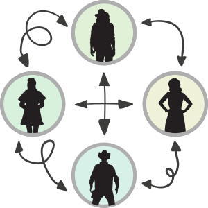



## Post-doctoral scientists

There are multiple projects and positions available in the lab, and we are looking forward to working with post-doctoral scientists who are interested in the human microbiome, and microbial ecology in general.

We are especially interested in computational peope who wish to learn microbiology, or microbiologists who wish to advance in bioinformatics and computation. If some of these keywords apply to you, please consider sending a CV along with a very short description of your background and research interests to meren at uchicago.edu to start a conversation: `human microbiome`, `host-microbe interactions`, `IBD`, `metagenomics`, `metatranscriptomics`, `information theory`, `Python`, `Javascript`, `C`, `R`, `scientific visualization`, `software design`. 

## Ph.D. Students

*(soon)...*

## And More...

If you are an undergraduate student or an intern who is looking for a challenging but potentially fruitful project related to the human microbiome and/or bioinformatics, please send an e-mail to meren at uchicago.edu.

Do you have another suggestions? Please don't hesitate to [write to us]({{site.url}}/people/) to start a conversation.

