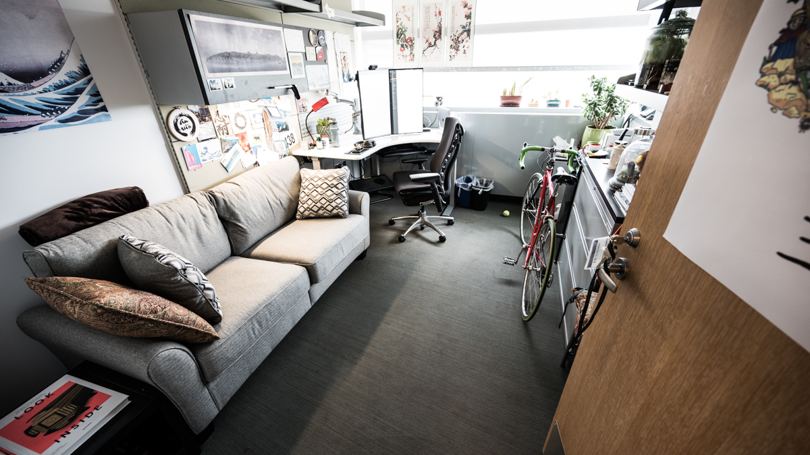
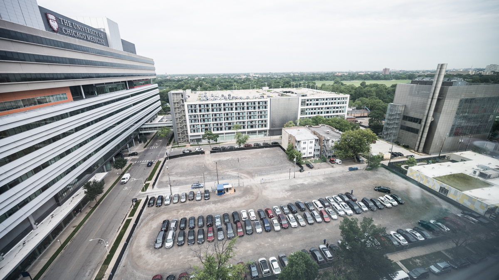
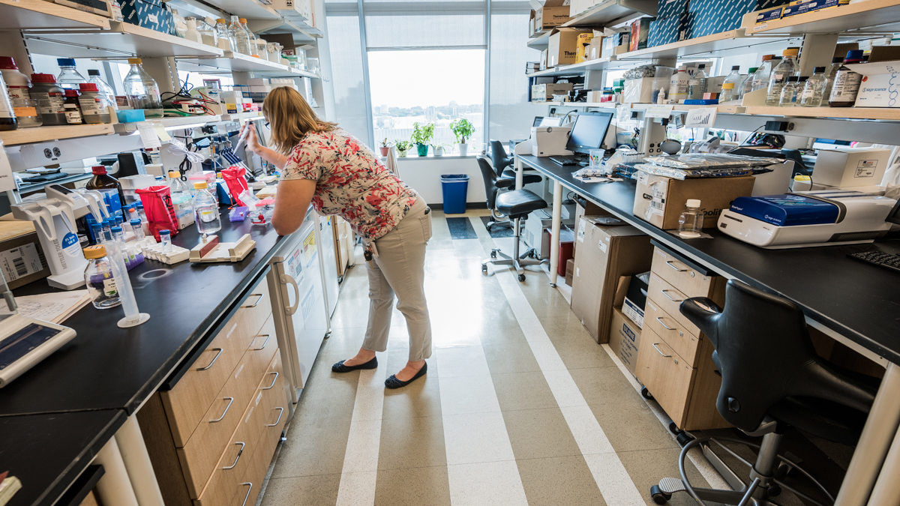
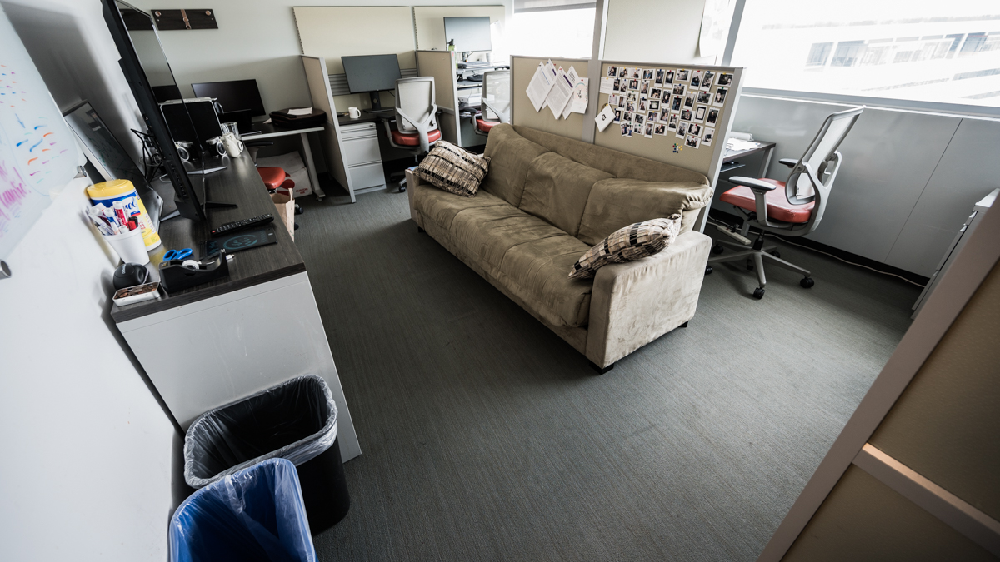
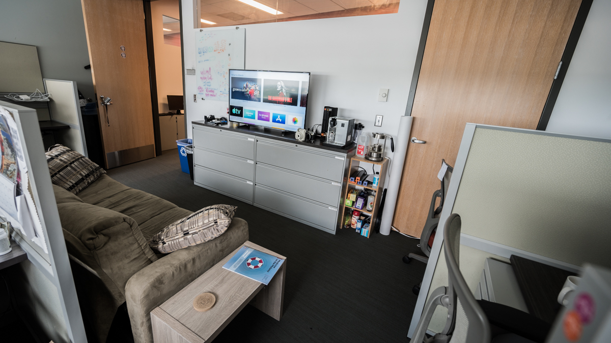
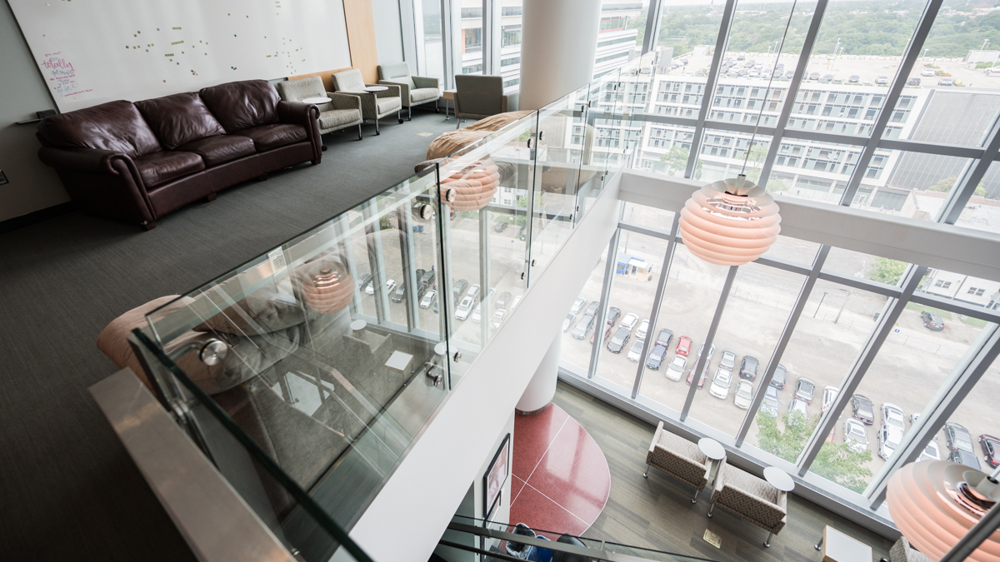
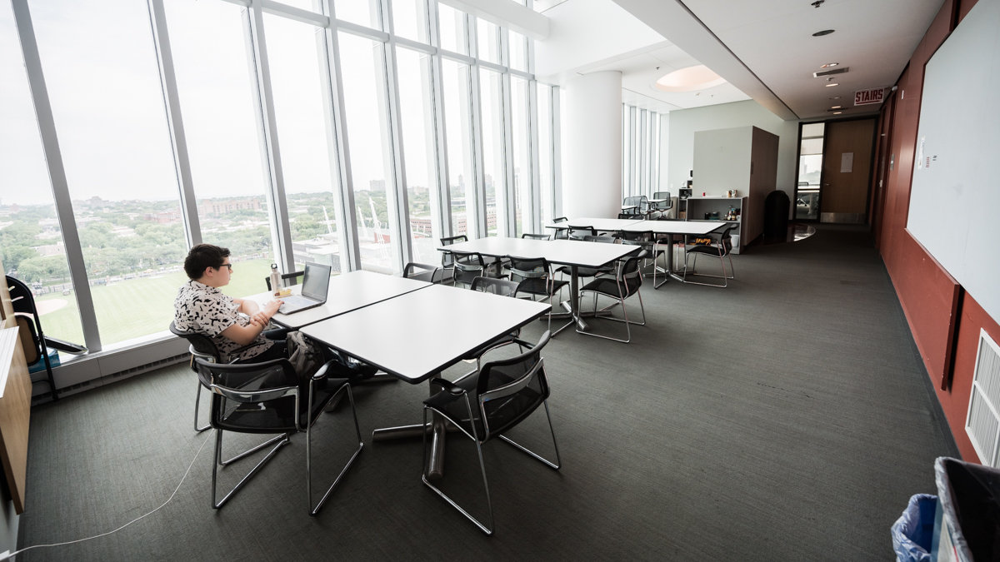
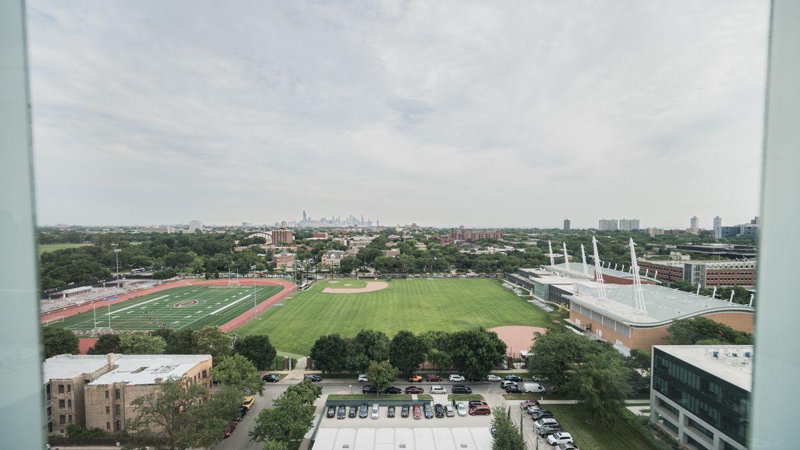
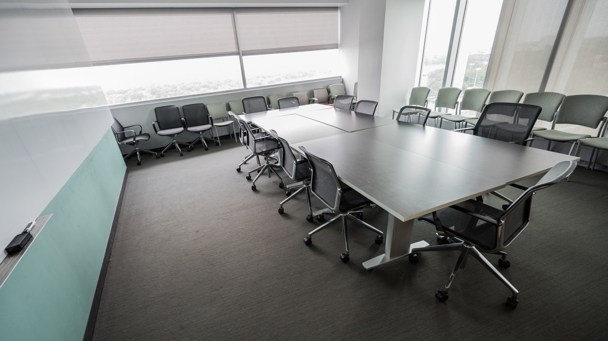

{:.warning}
**A note from around September 2022**: This document is from the olden days of when our group was at the University of Chicago, United States. We are in Germany, and and as soon as the HIFMB has its new building completed, we will update all teh space information accordingly :) Thanks for your patience.

Our lab is located at the following location in the UChicago campus:

<iframe src="https://www.google.com/maps/embed?pb=!1m18!1m12!1m3!1d2974.701287941469!2d-87.605596784187!3d41.791650878798!2m3!1f0!2f0!3f0!3m2!1i1024!2i768!4f13.1!3m3!1m2!1s0x880e293eb63accd1%3A0xb6f95ee97c4b5e08!2sKnapp+Center+for+Biomedical+Discovery+(KCBD)!5e0!3m2!1sen!2sus!4v1564193879353!5m2!1sen!2sus" width="600" height="450" frameborder="0" style="border:0" allowfullscreen></iframe>

At the 9th floor, we occupy multiple office spaces and wet-lab benches.

{:.center-img .width-90}

View from the window (looking at South).

{:.center-img .width-90}

Wet-lab area (not staged --actual science is happening).

{:.center-img .width-90}

Dry-lab area.

{:.center-img .width-90}

{:.center-img .width-90}

{:.center-img .width-90}

Common area. Great place to brood over the 8th floor. Or leave anonymous messages on the white board.

{:.center-img .width-90}

Lunch area. One of the best views in campus. It is also a great place to have little <a href="https://twitter.com/merenbey/status/889985400550412291">celebrations</a>.

{:.center-img .width-90}

{:.center-img .width-90}

One of our meeting rooms.

{:.center-img .width-90}

&nbsp;

