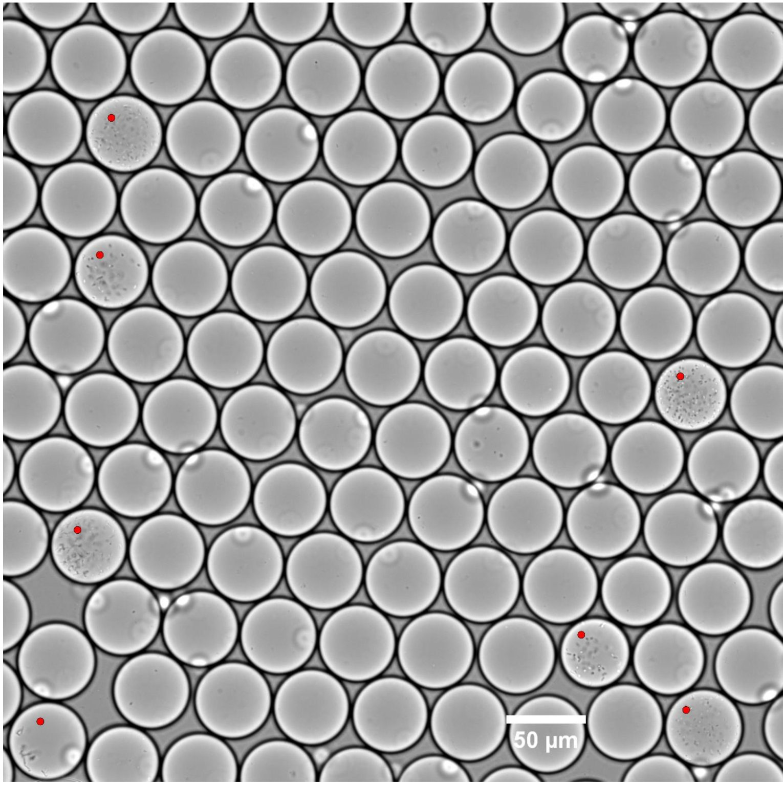
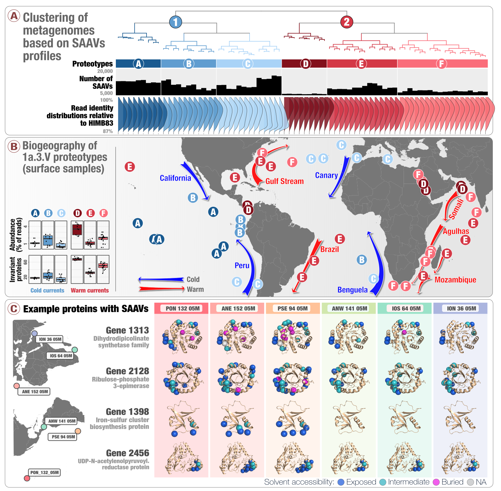
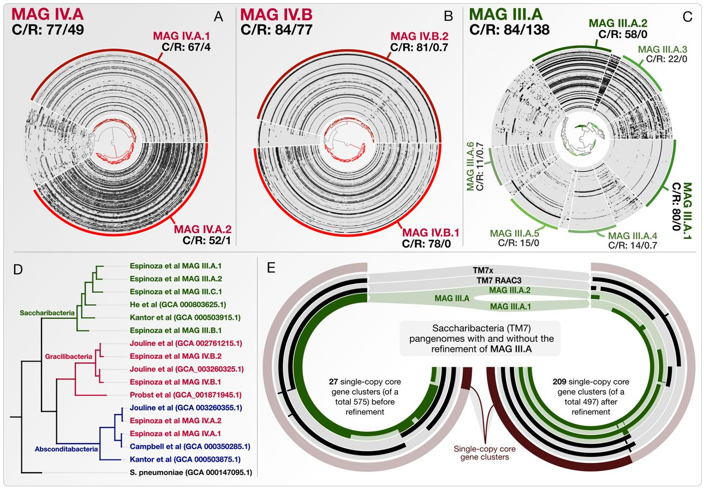
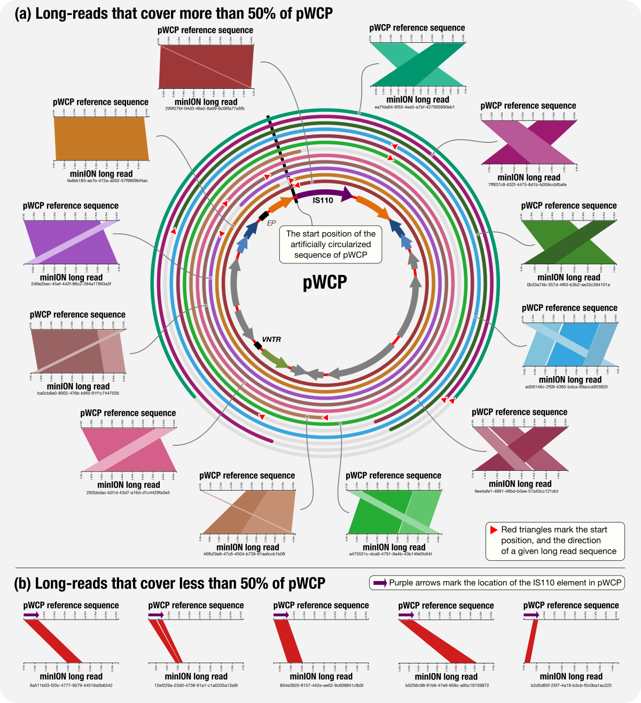
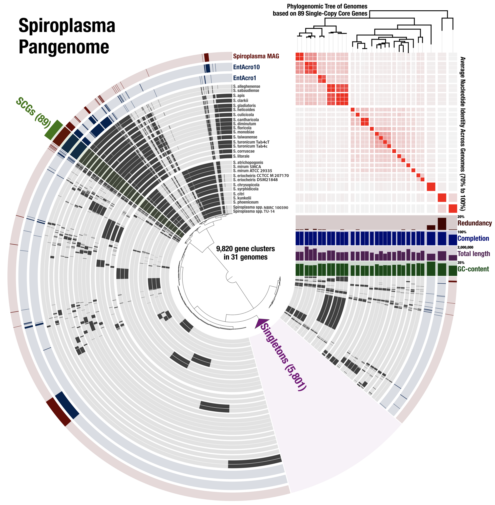
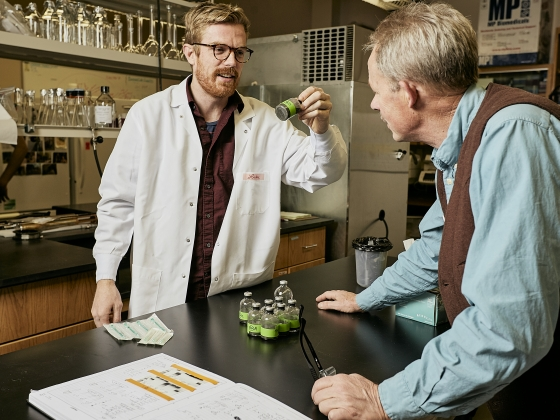
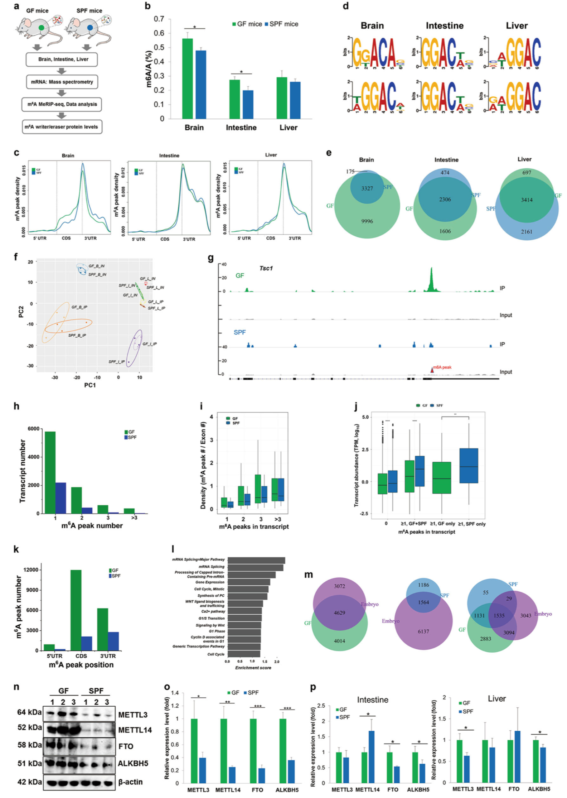
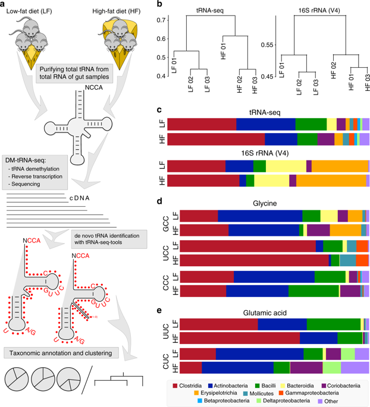
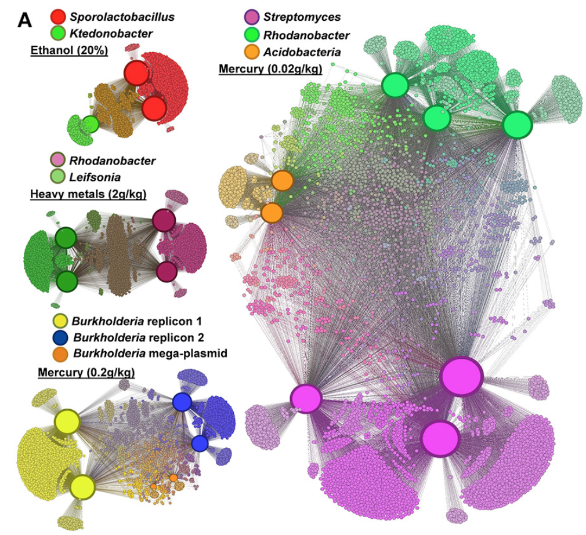

<a href="#2021">2021</a><a href="#2020">2020</a><a href="#2019">2019</a><a href="#2018">2018</a><a href="#2017">2017</a><a href="#2016">2016</a><a href="#2015">2015</a><a href="#2014">2014</a><a href="#2013">2013</a>

{:.notice}

This page lists publications that are most reflective of our interests. For a complete list, please see <a href='https://scholar.google.com/citations?user=GtLLuxoAAAAJ&view_op=list_works&sortby=pubdate' target='_blank'>Meren's Google Scholar page</a>.

## 2021

    <a href=" https://doi.org/10.1101/2021.03.02.433653" target="_new">Adaptive ecological processes and metabolic independence drive microbial colonization and resilience in the human gut</a>
    Watson AR, Füssel J, Veseli I, DeLongchamp JZ, Silva M, Trigodet F, Lolans K, Shaiber A, Fogarty EC, Quince C, Yu MK, Söylev A, Morrison HG, Lee ST, Rubin DT, Jabri B, Louie T, Eren AM
    

    

    
    

    

    - A Fecal Microbiota Transplantation (FMT) study that reveals unexpected parallels between the <b>adaptive ecological processes</b> that shape the recipient gut <b>microbial composition after FMT</b> and those that influence <b>microbial diversity in patients with Inflammatory Bowel Disease (IBD)</b>. - Includes an observation that links <b>the presence of superior metabolic competence in bacterial populations to their expansion in IBD</b>. -  Here is a <a href="https://twitter.com/merenbey/status/1369016402896695298" target="_blank">Twitter thread</a> that explains <b>key points</b> of the study.
    

    

    <b>bioRxiv</b> <a href="https://doi.org/10.1101/2021.03.02.433653" target="_blank">🔗</a>

    <a href=" https://doi.org/10.1101/2021.03.03.433801" target="_new">High molecular weight DNA extraction strategies for long-read sequencing of complex metagenomes</a>
    Trigodet F☯, Lolans K☯, Fogarty EC, Shaiber A, Morrison HG, Barreiro L, Jabri B, Eren AM
    ☯Co-first authors
    

    

    
    

    

    - A study that <b>benchmarks six high molecular weight DNA extraction strategies</b> (commercially available kits, phenol-chloroform extraction, and agarose encasement followed by agarase digestion) <b>for long-read sequencing of metagenomes</b> with MinION. -  It turns out the protocol that works best for sequencing DNA from microbial isolates may not be the most effetive method for long-read sequencing of metagenomes ¯\_(ツ)_/¯
    

    

    <b>bioRxiv</b> <a href="https://doi.org/10.1101/2021.03.03.433801" target="_blank">🔗</a>

## 2020

    <a href=" https://doi.org/10.1038/s41564-020-00834-3" target="_new">Community-led, integrated, reproducible multi-omics with anvi'o</a>
    Eren AM, Kiefl E, Shaiber A, Veseli I, Miller SE, Schechter MS, Fink I, Pan JN, Yousef M, Fogarty EC, Trigodet F, Watson AR, Esen ÖC, Moore RM, Clayssen Q, Lee MD, Kivenson V, Graham ED, Merrill BD, Karkman A, Blankenberg D, Eppley JM, Sjödin A, Scott JJ, Vázquez-Campos X, McKay LJ, McDaniel EA, Stevens SLR, Anderson RE, Fuessel J, Fernandez-Guerra A, Maignien L, Delmont TO, Willis AD
    

    

    
    

    

    - A summary of the progress of <a href="/software/anvio" target="_blank">anvi'o</a> during the past five years.
    

    

    <b>Nature Microbiology</b>, 6(1):3:6 <a href="https://doi.org/10.1038/s41564-020-00834-3" target="_blank">🔗</a>

    <a href=" https://doi.org/10.1186/s13059-020-02195-w" target="_new">Functional and genetic markers of niche partitioning among enigmatic members of the human oral microbiome</a>
    Shaiber A, Willis AD, Delmont TO, Roux S, Chen L, Schmid AC, Yousef M, Watson AR, Lolans K, Esen ÖC, Lee STM, Downey N, Morrison HG, Dewhirst FE, Mark Welch JL‡, Eren AM‡
    ‡Co-senior authors
    

    

    
    

    

    - A multi-omics study that combines <b>genome-resolved metagenomics</b>, <b>pangenomics</b>, <b>phylogenomics</b>, and <b>microbial population genetics</b> to investigate the ecology and evolution of Saccharibacteria (TM7) in the human oral cavity, and offers a formal description of '<b>functional enrichment</b>' statistic for phylogenomics and pangenomics. -  Demonstrates that TM7s split into tongue specialists and plaque specialists, and plaque TM7s group with environmental TM7s, leading to an hypothesis that <b>the dental plaque may have served as a stepping stone for environmental microbes to adapt to host environments</b> at least for some clades of microbes -  A news article by <a href="https://twitter.com/alie_astrocyte" target="_blank">Alison Caldwell, PhD</a>: <a href="https://www.uchicagomedicine.org/forefront/biological-sciences-articles/microbes-in-dental-plaque" target="_blank">Microbes in dental plaque look more like relatives in soil than those on the tongue</a>. -  <a href="/data/#niche-partitioning-in-the-human-oral-cavity" target="_blank">Public raw and intermediate data</a>. <a href="https://static-content.springer.com/esm/art%3A10.1186%2Fs13059-020-02195-w/MediaObjects/13059_2020_2195_MOESM13_ESM.docx" target="_blank">Reviewer comments and responses</a>.
    

    

    <b>Genome Biology</b>, 21:292 <a href="https://doi.org/10.1186/s13059-020-02195-w" target="_blank">🔗</a>

    <a href=" https://doi.org/10.1186/s13059-020-02200-2" target="_new">Metapangenomics of the oral microbiome provides insights into habitat adaptation and cultivar diversity</a>
    Utter DR, Borisy GG, Eren AM, Cavanaugh CM‡, Mark Welch JL‡
    ‡Co-senior authors
    

    

    
    

    

    - An application of <b>metapangenomics</b> that links the gene pool of two major oral microbial taxa, <i>Haemophilus parainfluenzae</i> and the genus <i>Rothia</i>, to their ecology using the Human Microbiome Project metageonomes generated from tongue, buccal mucosa, and dental plaque samples. -  Reveals that seemingly generalist organisms are composed of cryptic subpopulations with distinct ecology that is associated with only a small number of genes. -  <a href="https://static-content.springer.com/esm/art%3A10.1186%2Fs13059-020-02200-2/MediaObjects/13059_2020_2200_MOESM7_ESM.pdf" target="_blank">Reviewer comments and responses</a>. <a href="https://dutter.github.io/projects/oral_metapan">Reproducible bioinformatics workflow</a>.
    

    

    <b>Genome Biology</b>, 21:293 <a href="https://doi.org/10.1186/s13059-020-02200-2" target="_blank">🔗</a>

    <a href=" https://doi.org/10.7554/eLife.56998" target="_new">Droplet-based high-throughput cultivation for accurate screening of antibiotic resistant gut microbes</a>
    Watterson WJ, Tanyeri M, Watson AR, Cham CM, Shan Y, Chang EB, Eren AM‡, Tay S‡
    ‡Co-senior authors
    

    

    
    

    

    - An aneorobic microfluidics platform for high-throughput cultivation of microbes that grows <b>single microbial cells in millions of picoliter droplets</b>. -  Populations of gut microbes that compete poorly in plates grow well in droplets <b>regardless of culture media</b>. Furthermore, taxonomic profile of droplets resembles droplets much better than plate scrapings even at the level of oligotypes. -  Demonstrates that <b>not detecting microbes in plate-based screening of antibiotic resistance may not mean that the original sample does not contain microbes resistant to antibiotics</b>.
    

    

    <b>eLife</b>, 9:e56998 <a href="https://doi.org/10.7554/eLife.56998" target="_blank">🔗</a>

    <a href=" https://doi.org/10.1101/gr.258640.119" target="_new">Accurate and complete genomes from metagenomes</a>
    Chen L, Anantharaman K, Shaiber A, Eren AM‡, Banfield JF‡
    ‡Co-senior authors
    

    

    
    

    

    - A <b>review on genome-resolved metagenomics</b> that discusses the importance of using assembly and careful binning strategies to study metagenomes. -  Case studies include a demonstration of how <b>single-copy core genes can fail to predict the quality of metagenome-assembled genomes</b>, and <b>automated strategies that yield tens of thousands of metagenome-assembled genomes will include extensive contamination</b>. -  Promotes approaches to reconstruct <b>'complete' genomes from metagenomes</b> and the use of <b>GC skew as a metric for checking genome correctness</b>. -  Tutorial on <a href="https://ggkbase-help.berkeley.edu/genome_curation/scaffold-extension-and-gap-closing/" target="_blank">scaffold extension and gap closing</a>, reproducible workflow for <a href="http://merenlab.org/data/parcubacterium-in-hbcfdna/" target="_blank">binning and phylogenomics of a Parcubacterium genome from human blood metagenomes</a>.
    

    

    <b>Genome Research</b>, 30(3):315-333 <a href="https://doi.org/10.1101/gr.258640.119" target="_blank">🔗</a>

## 2019

    <a href=" https://doi.org/10.7554/eLife.46497" target="_new">Single-amino acid variants reveal evolutionary processes that shape the biogeography of a global SAR11 subclade</a>
    Delmont TO☯, Kiefl E☯, Kilinc O, Esen ÖC, Uysal I, Rappé MS, Giovannoni S, Eren AM
    ☯Co-first authors
    

    

    
    

    

    - A study that introduces <a href="http://merenlab.org/2015/07/20/analyzing-variability/#an-intro-to-single-nucleotidecodonamino-acid-variation" target="_blank">'single-amino acid variants'</a> (SAAVs) and demonstrates <b>the use of SAAVs to tease apart evolutionary processes that shape the biogeography and genomic heterogeneity within a SAR11 population</b> through metagenomics. -  A first attempt to link population genetics and the predicted protein structures to explore <i>in silico</i> <b>the intersection beetween protein biochemistry and evolutionary processes</b> acting on an environmental microbe. -  An application of <a href="https://peerj.com/articles/4320/" target="_blank">metapangenomics</a> to define <b>subclades of SAR11 based on gene content and ecology</b>. -  Reproducible bioinformatics workflow is <a href="http://merenlab.org/data/sar11-saavs/" target="_blank">here</a>. <a href="https://doi.org/10.7554/eLife.46497.040" target="_blank">Reviewer criticism</a> and <a href="https://doi.org/10.7554/eLife.46497.041" target="_blank">our responses</a> are also available.
    

    

    <b>eLife</b>, 8:e46497 <a href="https://doi.org/10.7554/eLife.46497" target="_blank">🔗</a>

    <a href=" https://doi.org/10.1128/mBio.00725-19" target="_new">Composite Metagenome-Assembled Genomes Reduce the Quality of Public Genome Repositories</a>
    Shaiber A, Eren AM
    

    

    
    

    

    - A letter that stresses that the composite metagenome-assembled genomes influence phylogenomic, pangenomic, and ecological insights (<a href="../files/Shaiber_Eren_2019_reviewer_response.pdf" target="_blank">peer reviews and responses</a>). -  <a href="http://merenlab.org/data/refining-espinoza-mags/" target="_blank">A reproducible workflow</a> to detail the steps of genome refinement and make available the refined versions of some key genomes.
    

    

    <b>mBio</b>, 10(3):e00725-19 <a href="https://doi.org/10.1128/mBio.00725-19" target="_blank">🔗</a>

    <a href=" https://doi.org/10.1038/s41467-019-08973-w" target="_new">The Wolbachia mobilome in Culex pipiens includes a putative plasmid</a>
    Reveillaud J☯, Bordenstein SR☯, Cruaud C, Shaiber A, Esen ÖC, Weill M, Makoundou P, Lolans K, Watson AR, Rakotoarivony I, Bordenstein S, Eren AM
    ☯Co-first authors
    

    

    
    

    

    - The first report of a <i>Wolbachia</i> plasmid through genome-resolved metagenomics on microsurgically removed individual mosquito ovary samples (<a href="https://static-content.springer.com/esm/art%3A10.1038%2Fs41467-019-08973-w/MediaObjects/41467_2019_8973_MOESM2_ESM.pdf">peer reviews and responses</a>). -  Yet another application of <a href="https://doi.org/10.7717/peerj.4320">metapangenomics</a> and an applicatoin of minION long-read sequencing on extremely low-biomass samples. -  <a href="http://merenlab.org/data/wolbachia-plasmid">Reproducible bioinformatics workflow</a> with all data items, a 'behind the paper' <a href="http://merenlab.org/2019/03/05/wolbachia-plasmid/">blog post</a> by <a href="https://twitter.com/JulieReve">Julie Reveillaud</a>, and a <a href="https://www.mbl.edu/blog/new-mobile-element-found-in-mosquito-parasite-has-potential-for-disease-control/">press release</a> from the Marine Biological Laboratory.
    

    

    <b>Nature Communications</b>, 10(1):1051 <a href="https://doi.org/10.1038/s41467-019-08973-w" target="_blank">🔗</a>

    <a href=" https://doi.org/10.7717/peerj.7548" target="_new">Genome-resolved insights into a novel Spiroplasma symbiont of the Wheat Stem Sawfly (Cephus cinctus)</a>
    Yeoman CJ, Brutscher LM, Esen ÖC, Ibaoglu F, Fowler C, Eren AM, Wanner K, Weaver DK
    

    

    
    

    

    - A study that uses (1) <b>genome-resolved metagenomics</b> to reconstruct a population genome from fly metagenomes that resolves to the genus <a href="https://en.wikipedia.org/wiki/Spiroplasma" target="_blank"><i>Spiroplasma</i></a>, (2) <b>pangenomics</b> to put this genome in the context of other <i>Spiroplasma</i> genomes, (3) <b>phylogenomics</b> to infer ancestral relationships between <i>Spiroplasma</i> genomes, and (4) includes an ANI-based distance estimation between all genomes for comprehensive reporting. -  It is a particularly good example that demonstrates how pangenomics can reveal appropriate targets for high-resolution phylogenomics. -  A fully reproducible bioinformatics workflow for this multi'omics analysis is <a href="http://merenlab.org/data/spiroplasma-pangenome/" target="_blank">here</a>. Anvi'o databases to interactively reproduce and explore the Spiroplasma pangenome is also <a href="http://doi.org/10.6084/m9.figshare.8201852" target="_blank">available</a>.
    

    

    <b>PeerJ</b>, 7:e7548 <a href="https://doi.org/10.7717/peerj.7548" target="_blank">🔗</a>

    <a href=" https://doi.org/10.1038/s41564-019-0494-6" target="_new">Global phylogeography and ancient evolution of the widespread human gut virus crAssphage</a>
    Edwards RA, Vega AA, Norman HM, Ohaeri M, Levi K, Dinsdale EA, Cinek O, Aziz RK, McNair K, Barr JJ, Bibby K, Brouns S, Cazares A, deJonge PA, Desnues C, Díaz Muñoz SL, Fineran PC, Kurilshikov A, Lavigne R, Mazankova K, McCarthy DT, Nobrega FL, Reyes Muñoz A, Tapia G, Trefault N, Tyakht AV, Vinuesa P, Wagemans J, Zhernakova A, Aarestrup FM, Ahmadov G, Alassaf A, Anton J, Asangba A, Billings EK, Cantu VA, Carlton JM, Cazares D, Cho GS, Condeff T, Cortés P, Cranfield M, Cuevas DA, De la Iglesia R, Decewicz P, Doane MP, Dominy NJ, Dziewit L, Elwasila BM, Eren AM, Franz C, Fu J, Garcia-Aljaro C, Ghedin E, Gulino KM, Haggerty JM, Head SR, Hendriksen RS, Hill C, Hyöty H, Ilina EN, Irwin MT, Jeffries TC, Jofre J, Junge RE, Kelley ST, Khan Mirzaei M, Kowalewski M, Kumaresan D, Leigh SR, Lipson D, Lisitsyna ES, Llagostera M, Maritz JM, Marr LC, McCann A, Molshanski-Mor S, Monteiro S, Moreira-Grez B, Morris M, Mugisha L, Muniesa M, Neve H, Nguyen NP, Nigro OD, Nilsson AS, O'Connell T, Odeh R, Oliver A, Piuri M, Prussin Ii AJ, Qimron U, Quan ZX, Rainetova P, Ramírez-Rojas A, Raya R, Reasor K, Rice G, Rossi A, Santos R, Shimashita J, Stachler EN, Stene LC, Strain R, Stumpf R, Torres PJ, Twaddle A, Ugochi Ibekwe M, Villagra N, Wandro S, White B, Whiteley A, Whiteson KL, Wijmenga C, Zambrano MM, Zschach H, and Dutilh BE
    

    

    
    

    

    - A monumental effort lead by <a href="https://twitter.com/linsalrob" target="_blank">Rob Edwards</a> and <a href="https://twitter.com/BEDutilh" target="_blank">Bas Dutilh</a> to explore with the help of 114 scientists from around the world the global phylogeorgraphy and evolution of <a href="https://www.nature.com/articles/ncomms5498" target="_blank">crAssphage</a>, one of the most numerous viruses in the human gut that infect bacteria. - A curated list of press coverage of this study is available <a href="https://edwards.sdsu.edu/research/press-about-global-phylogeography-of-crassphage/" target="_blank">on Rob Edwards' web site</a>.
    

    

    <b>Nature Microbiology</b>, 4(10):1727 <a href="https://doi.org/10.1038/s41564-019-0494-6" target="_blank">🔗</a>

    <a href=" https://doi.org/10.1038/s41564-019-0362-4" target="_new">Co-occurring genomic capacity for anaerobic methane and dissimilatory sulfur metabolisms discovered in the Korarchaeota</a>
    McKay LJ, Dlakić M, Fields MW, Delmont TO, Eren AM, Jay ZJ, Klingelsmith KB, Rusch DB, Inskeep WP
    

    

    
    

    

    - Yesllowstone National Park, archaeal evolution, genome-resolved metagenomics, phylogenomics, and pangenomics (cool stuff all over). -  First description of a microbial population with both anaerobic methane and dissimilatory sulfur metabolisms. -  A news article by Montana State University with the photographs of cools scientists: <a href="http://www.montana.edu/news/18471">An organism in Yellowstone hot spring potentially linked to earliest life on Earth"</a>
    

    

    <b>Nature Microbiology</b>, 4(4):614 <a href="https://doi.org/10.1038/s41564-019-0362-4" target="_blank">🔗</a>

    <a href=" https://doi.org/10.1038/s41422-018-0127-2" target="_new">Transcriptome-wide reprogramming of N 6-methyladenosine modification by the mouse microbiome</a>
    Wang X, Li Y, Chen W, Shi H, Eren AM, Morozov A, He C, Luo G, Pan T
    

    

    
    

    

    -  N6-methyladenosine (m6A) is the most abundant mesenger RNA modification in mammalian cells, occurring at ~3 modified adenosine residues per transcript. -  Using liquid chromatography/mass spectrometry, this study shows differential occurrence of m6A modifications in brain, liver, and intestinal cells between germ-free and conventional mice, demonstrating that the microbiome has a strong effect on host m6A mRNA modification.
    

    

    <b>Cell Research</b>, 29(2):167 <a href="https://doi.org/10.1038/s41422-018-0127-2" target="_blank">🔗</a>

    <a href=" https://doi.org/10.1126/scitranslmed.aau9356" target="_new">B cell superantigens in the human intestinal microbiota</a>
    Bunker JJ, Drees C, Watson AR, Plunkett CH, Nagler CR, Schneewind O, Eren AM, Bendelac A
    <b>Science Translational Medicine</b>, 11(507):eaau9356 <a href="https://doi.org/10.1126/scitranslmed.aau9356" target="_blank">🔗</a>

## 2018

    <a href=" https://doi.org/10.1038/s41467-018-07675-z" target="_new">Microbiome characterization by high-throughput transfer RNA sequencing and modification analysis</a>
    Schwartz MH, Wang H, Pan JN, Clark WC, Cui S, Eckwahl MJ, Pan DW, Parisien M, Owens SM, Cheng BL, Martinez K, Xu J, Chang EB, Pan T‡, Eren AM‡
    ‡Co-senior authors
    

    

    
    

    

    - First application of tRNA sequencing to microbiomes (<a href="https://static-content.springer.com/esm/art%3A10.1038%2Fs41467-018-07675-z/MediaObjects/41467_2018_7675_MOESM2_ESM.pdf">peer reviews and responses</a>). -  tRNA-seq distinguishes high-fat- and low-fat-fed mice in a comparable fashion to 16S rRNA gene amplicons, reveals taxon- and diet-dependent variations in tRNA modifications, and provides in situ insights into tRNA gene expression dynamics and post-transcriptional modifications. -  "<a href="https://www.uchicagomedicine.org/forefront/microbiome-articles/2018/december/new-rna-sequencing-strategy-provides-insight-into-microbiomes">New RNA sequencing strategy provides insight into microbiomes</a>", by <b>Matt Wood</b>. -  "<a href="https://www.news-medical.net/news/20181217/RNA-sequencing-offers-novel-insights-into-the-microbiome.aspx">RNA sequencing offers novel insights into the microbiome</a>", by <b>Liji Thomas</b>, MD, and <b>Kate Anderton</b>, B.Sc.
    

    

    <b>Nature Communications</b>, 9(1):5353 <a href="https://doi.org/10.1038/s41467-018-07675-z" target="_blank">🔗</a>

    <a href=" https://doi.org/10.1038/s41564-018-0176-9" target="_new">Nitrogen-fixing populations of Planctomycetes and Proteobacteria are abundant in surface ocean metagenomes</a>
    Delmont TO, Quince C, Shaiber A, Esen ÖC, Lee STM, Rappé MS, MacLellan SL, Lücker S, Eren AM
    

    

    
    

    

    - First genomic evidence for abundant and widespread non-cyanobacterial nitrogen-fixing populations in the surface ocean. -  Nearly 1,000 non-redundant, high-quality bacterial, archaeal, and eukaryotic population genomes from TARA Oceans metagenomes. -  A "behind the paper" <a href="https://naturemicrobiologycommunity.nature.com/users/113363-a-murat-eren-meren/posts/34040-microbiologists-vs-shotgun-metagenomes-surface-ocean" target="_blank">blog post</a> by Meren, a <a href="http://www.mbl.edu/blog/large-scale-study-indicates-novel-and-abundant-nitrogen-fixing-microbes-in-the-surface-ocean/" target="_blank">press release</a> by the MBL, and an extensive description of <a href="http://merenlab.org/data/2017_Delmont_et_al_HBDs/" target="_blank">the bioinformatics workflow</a>.
    

    

    <b>Nature Microbiology</b>, 3(7):804-813 <a href="https://doi.org/10.1038/s41564-018-0176-9" target="_blank">🔗</a>

    <a href=" https://doi.org/10.7717/peerj.4320" target="_new">Linking pangenomes and metagenomes: the Prochlorococcus metapangenome</a>
    Delmont TO, Eren AM
    

    

    
    

    

    - A big-data study in which a pangenome of 31 <i>Prochlorococcus</i> isolates meets 31 billion Tara Oceans metagenomic sequences (<a href="https://peerj.com/articles/4320/reviews/">Peer-review history</a>). -  Metapangenomes reveal to what extent genes that may be linked to the ecology and fitness of microbes are conserved within a phylogenetic clade. -  <a href="http://merenlab.org/data/prochlorococcus-metapangenome" target="_blank">Reproducible bioinformatics workflow</a>.
    

    

    <b>PeerJ</b>, 6:e4320 <a href="https://doi.org/10.7717/peerj.4320" target="_blank">🔗</a>

    <a href=" https://doi.org/10.1186/s40168-018-0474-8" target="_new">Gut microbes contribute to variation in solid organ transplant outcomes in mice</a>
    McIntosh CM, Chen L, Shaiber A, Eren AM, Alegre M
    

    

    - Two groups of genetically identical mice with different microbial community structures differ in their response to skin transplants from genetically identical sources: one group rejects the skin faster than the other. -  Transferring poop from slow-rejecting mice into fast-rejecting mice turns fast-rejecting mice into slow-rejecting mice. -  These suggest that differences in 'resident microbiome' in healthy individuals <i>may</i> contribute to interpersonal variability in graft outcomes, and fecal microbiota transplantation <i>may</i> play a therapeutic role to reverse that phenotype. -  Basically, "we do not have a mechanistic understanding, but this is definitely very interesting".
    

    

    <b>Microbiome</b>, 6(1):96 <a href="https://doi.org/10.1186/s40168-018-0474-8" target="_blank">🔗</a>

    <a href=" https://doi.org/10.1038/s41586-018-0125-z" target="_new">Microbial signals drive pre-leukaemic myeloproliferation in a Tet2-deficient host</a>
    Meisel M☯, Hinterleitner R☯, Pacis A, Chen L, Earley ZM, Mayassi T, Pierre JF, Ernest JD, Galipeau HJ, Thuille N, Bouziat R, Buscarlet M, Ringus DL, Wang Y, Li Y, Dinh V, Kim SM, McDonald BD, Zurenski MA, Musch MW, Furtado GC, Lira SA, Baier G, Chang EB, Eren AM, Weber CR, Busque L, Godley LA, Verdú EF, Barreiro LB, Jabri B
    ☯Co-first authors
    

    

    - TET2 deficiency ➡️  deteriorating small intestinal barrier ➡️  bacterial translocation ➡️  incrased IL-6 signalling ➡️  pre-leukemic myeloproliferation (a leukemia precursor). -  ScienceDaily: <a href="https://www.sciencedaily.com/releases/2018/05/180516131226.htm" target="_blank">Under certain conditions, bacterial signals set the stage for leukemia</a>.
    

    

    <b>Nature</b>, 557(7706):580 <a href="https://doi.org/10.1038/s41586-018-0125-z" target="_blank">🔗</a>

## 2017

    <a href=" https://doi.org/10.1186/s40168-017-0270-x" target="_new">Tracking microbial colonization in fecal microbiota transplantation experiments via genome-resolved metagenomics</a>
    Lee STM☯, Kahn SA☯, Delmont TO, Shaiber A, Esen ÖC, Hubert NA, Morrison HG, Antonopoulos DA, Rubin DT, Eren AM
    ☯Co-first authors
    

    

    
    

    

    - An FMT study with metagenome-assembled genomes (see <a href="http://merenlab.org/data/#lee-et-al-2017--fecal-transplants" target="_blank">public data</a>). - Bacteroidales: high-colonization rate. Clostridiales: low colonization rate. Colonization success is negatively correlated with the number of genes related to sporulation. -  MAGs with the same taxonomy showed different colonization properties, highlighting the importance of high-resolution analyses. -  Populations colonized both recipients were also prevalent in the HMP cohort (and the ones that did not, distribute sporadically across the HMP cohort).
    

    

    <b>Microbiome</b>, 5(1):50 <a href="https://doi.org/10.1186/s40168-017-0270-x" target="_blank">🔗</a>

    <a href=" https://doi.org/10.1073/pnas.1712186114" target="_new">Simulations predict microbial responses in the environment? This environment disagrees retrospectively</a>
    Delmont TO, Eren AM
    

    

    
    

    

    - A letter that re-analyzes some of the findings published in <a href="http://www.pnas.org/content/114/28/7432.abstract" target="_blank">Hu et al.</a> -  Here is a <a href="http://www.pnas.org/content/early/2017/10/09/1712466114.extract" target="_blank">rebuttal from Probst et al.</a> challenging our findings in this letter. -  Here is <a href="http://merenlab.org/2017/10/16/reply-to-probst-et-al/" target="_blank">our response to Probst et al.</a>, and <a href="http://merenlab.org/2017/11/25/DWH-O-desum-v2/" target="_blank">the recovery of DWH O. Desum v2</a>.
    

    

    <b>Proceedings of the National Academy of Sciences</b>, 114(43):E8947-E8949 <a href="https://doi.org/10.1073/pnas.1712186114" target="_blank">🔗</a>

    <a href=" https://doi.org/10.1038/s41467-017-01228-6" target="_new">Genomic variation in microbial populations inhabiting the marine subseafloor at deep-sea hydrothermal vents</a>
    Anderson RE, Reveillaud J, Reddington E, Delmont TO, Eren AM, McDermott JM, Seewald JS, Huber JA
    <b>Nature Communications</b>, 8(1):1114 <a href="https://doi.org/10.1038/s41467-017-01228-6" target="_blank">🔗</a>

    <a href=" https://doi.org/10.1186/s13059-017-1309-9" target="_new">DESMAN: a new tool for de novo extraction of strains from metagenomes</a>
    Quince C, Delmont TO, Raguideau S, Alneberg J, Darling AE, Collins G, Eren AM
    <b>Genome Biology</b>, 18(1):181 <a href="https://doi.org/10.1186/s13059-017-1309-9" target="_blank">🔗</a>

    <a href=" https://doi.org/10.1038/nbt.3893" target="_new">Minimum information about a single amplified genome (MISAG) and a metagenome-assembled genome (MIMAG) of bacteria and archaea</a>
    Bowers RM, Kyrpides NC, Stepanauskas R, Harmon-Smith M, Doud D, Reddy TBK, Schulz F, Jarett J, Rivers AR, Eloe-Fadrosh EA, Tringe SG, Ivanova NN, Copeland A, Clum A, Becraft ED, Malmstrom RR, Birren B, Podar M, Bork P, Weinstock GM, Garrity GM, Dodsworth JA, Yooseph S, Sutton G, Glöckner FO, Gilbert JA, Nelson WC, Hallam SJ, Jungbluth SP, Ettema TJG, Tighe S, Konstantinidis KT, Liu W, Baker BJ, Rattei T, Eisen JA, Hedlund B, McMahon KD, Fierer N, Knight R, Finn R, Cochrane G, Karsch-Mizrachi I, Tyson GW, Rinke C, Kyrpides NC, Schriml L, Garrity GM, Hugenholtz P, Sutton G, Yilmaz P, Meyer F, Glöckner FO, Gilbert JA, Knight R, Finn R, Cochrane G, Karsch-Mizrachi I, Lapidus A, Meyer F, Yilmaz P, Parks DH, Eren AM, Schriml L, Banfield JF, Hugenholtz P, Woyke T
    <b>Nature biotechnology</b>, 35(8):725 <a href="https://doi.org/10.1038/nbt.3893" target="_blank">🔗</a>

    <a href=" https://doi.org/10.1016/j.celrep.2017.06.060" target="_new">Peripartum antibiotics promote gut dysbiosis, loss of immune tolerance, and inflammatory bowel disease in genetically prone offspring</a>
    Miyoshi J, Bobe AM, Miyoshi S, Huang Y, Hubert N, Delmont TO, Eren AM, Leone V, Chang EB
    

    

    
    

    

    - Antibiotics during pregnancy promote offspring gut dysbiosis, immune dysfunction, and IBD. -  Antibiotics given after the developmental period do not increase IBD. -  Antibiotic-perturbed maternal microbiota likely contribute to neonatal gut dysbiosis. -  <a href="https://sciencelife.uchospitals.edu/2017/07/11/antibiotics-taken-late-in-pregnancy-can-increase-risk-for-inflammatory-bowel-diseases-in-offspring/" target="_blank">Press release</a>.
    

    

    <b>Cell Reports</b>, 20(2):491-504 <a href="https://doi.org/10.1016/j.celrep.2017.06.060" target="_blank">🔗</a>

## 2016

    <a href=" https://doi.org/10.7717/peerj.1839" target="_new">Identifying contamination with advanced visualization and analysis practices: metagenomic approaches for eukaryotic genome assemblies</a>
    Delmont TO, Eren AM
    

    

    
    

    

    - A holistic approach to visualize and curate genomic and metagenomic assemblies. - A re-analysis of the first released Tardigrade genome reveals a likely symbiont among other contaminants. -  A practical approach to estimate the number bacterial genomes in an assembly.
    

    

    <b>PeerJ</b>, 4:e1839 <a href="https://doi.org/10.7717/peerj.1839" target="_blank">🔗</a>

    <a href=" https://doi.org/10.1128/mBio.01713-16" target="_new">Patient-specific bacteroides genome variants in pouchitis</a>
    Vineis JH, Ringus DL, Morrison HG, Delmont TO, Dalal S, Raffals LH, Antonopoulos DA, Rubin DT, Eren AM, Chang EB, Sogin ML
    <b>mBio</b>, 7(6):e01713-16 <a href="https://doi.org/10.1128/mBio.01713-16" target="_blank">🔗</a>

    <a href=" https://doi.org/10.3389/fmicb.2016.01318" target="_new">New insights into microbial ecology through subtle nucleotide variation</a>
    Eren AM, Sogin ML, Maignien L
    <b>Frontiers in microbiology</b>, 7:1318 <a href="https://doi.org/10.3389/fmicb.2016.01318" target="_blank">🔗</a>

    <a href=" https://doi.org/10.1093/femsre/fuw017" target="_new">Millions of reads, thousands of taxa: microbial community structure and associations analyzed via marker genes</a>
    Bálint M, Bahram M, Eren AM, Faust K, Fuhrman JA, Lindahl B, O'hara RB, Öpik M, Sogin ML, Unterseher M
    <b>FEMS Microbiology Reviews</b>, 40(5):686-700 <a href="https://doi.org/10.1093/femsre/fuw017" target="_blank">🔗</a>

## 2015

    <a href=" https://doi.org/10.7717/peerj.1319" target="_new">Anvi’o: an advanced analysis and visualization platform for ‘omics data</a>
    Eren AM, Esen ÖC, Quince C, Vineis JH, Morrison HG, Sogin ML, Delmont TO
    

    

    
    

    

    - The methods paper for <a href="http://merenlab.org/software/anvio/" target="_blank">anvi'o</a>. -  Binning, and single-nucleotide variant analysis of a human gut time series metagenome. -  Re-analysis of cultivar genomes, metagenomes, and metatranscriptomes associated with the Deepwater Horizon oil spill.
    

    

    <b>PeerJ</b>, 3:e1319 <a href="https://doi.org/10.7717/peerj.1319" target="_blank">🔗</a>

    <a href=" https://doi.org/10.1038/ismej.2014.195" target="_new">Minimum entropy decomposition: unsupervised oligotyping for sensitive partitioning of high-throughput marker gene sequences</a>
    Eren AM, Morrison HG, Lescault PJ, Reveillaud J, Vineis JH, Sogin ML
    <b>The ISME Journal</b>, 9(4):968 <a href="https://doi.org/10.1038/ismej.2014.195" target="_blank">🔗</a>

    <a href=" https://doi.org/10.1038/ismej.2014.97" target="_new">A single genus in the gut microbiome reflects host preference and specificity</a>
    Eren AM, Sogin ML, Morrison HG, Vineis JH, Fisher JC, Newton RJ, McLellan SL
    <b>The ISME Journal</b>, 9(1):90 <a href="https://doi.org/10.1038/ismej.2014.97" target="_blank">🔗</a>

    <a href=" https://doi.org/10.3389/fmicb.2015.00358" target="_new">Reconstructing rare soil microbial genomes using in situ enrichments and metagenomics</a>
    Delmont TO, Eren AM, Maccario L, Prestat E, Esen ÖC, Pelletier E, Le Paslier D, Simonet P, Vogel TM
    

    

    
    

    

    -  Application of <i>in situ</i> enrichments to shape the diversity of complex metagenomes prior to sequencing. -  The first successful attempt to assemble multiple near-complete bacterial genomes directly from a soil sample. -  The abundance of reconstructed genomes ranged from rare (<0.0001%) to relatively abundant (>0.01%) in pristine soil metagenomes.
    

    

    <b>Frontiers in microbiology</b>, 6:358 <a href="https://doi.org/10.3389/fmicb.2015.00358" target="_blank">🔗</a>

    <a href=" https://doi.org/10.1038/ajg.2015.357" target="_new">Extensive modulation of the fecal metagenome in children with Crohn’s disease during exclusive enteral nutrition</a>
    Quince C, Ijaz UZ, Loman N, Eren AM, Saulnier D, Russell J, Haig SJ, Calus ST, Quick J, Barclay A, Bertz M, Blaut M, Hansen R, McGrogan P, Russell RK, Edwards CA, Gerasimidis K
    <b>The American journal of gastroenterology</b>, 110(12):1718 <a href="https://doi.org/10.1038/ajg.2015.357" target="_blank">🔗</a>

    <a href=" https://doi.org/10.1128/mBio.02574-14" target="_new">Sewage reflects the microbiomes of human populations</a>
    Newton RJ, McLellan SL, Dila DK, Vineis JH, Morrison HG, Eren AM, Sogin ML
    <b>mBio</b>, 6(2):e02574-14 <a href="https://doi.org/10.1128/mBio.02574-14" target="_blank">🔗</a>

## 2014

    <a href=" https://doi.org/10.1073/pnas.1409644111" target="_new">Oligotyping analysis of the human oral microbiome</a>
    Eren AM, Borisy GG, Huse SM, Welch JLM
    <b>Proceedings of the National Academy of Sciences</b>, 111(28):E2875-E2884 <a href="https://doi.org/10.1073/pnas.1409644111" target="_blank">🔗</a>

    <a href=" https://doi.org/10.1016/j.tim.2014.08.002" target="_new">Discovering new indicators of fecal pollution</a>
    McLellan SL, Eren AM
    <b>Trends in Microbiology</b>, 22(12):697-706 <a href="https://doi.org/10.1016/j.tim.2014.08.002" target="_blank">🔗</a>

    <a href=" https://doi.org/10.3389/fmicb.2014.00568" target="_new">Dynamics of tongue microbial communities with single-nucleotide resolution using oligotyping</a>
    Mark Welch JL, Utter DR, Rossetti BJ, Mark Welch DB, Eren AM, Borisy GG
    <b>Frontiers in microbiology</b>, 5:568 <a href="https://doi.org/10.3389/fmicb.2014.00568" target="_blank">🔗</a>

    <a href=" https://doi.org/10.1371/journal.pone.0090785" target="_new">Humpback whale populations share a core skin bacterial community: towards a health index for marine mammals?</a>
    Apprill A, Robbins J, Eren AM, Pack AA, Reveillaud J, Mattila D, Moore M, Niemeyer M, Moore KM, Mincer TJ
    <b>PLoS One</b>, 9(3):e90785 <a href="https://doi.org/10.1371/journal.pone.0090785" target="_blank">🔗</a>

    <a href=" https://doi.org/10.1038/ismej.2013.227" target="_new">Host-specificity among abundant and rare taxa in the sponge microbiome</a>
    Reveillaud J, Maignien L, Eren AM, Huber JA, Apprill A, Sogin ML, Vanreusel A
    <b>The ISME Journal</b>, 8(6):1198-209 <a href="https://doi.org/10.1038/ismej.2013.227" target="_blank">🔗</a>

    <a href=" https://doi.org/10.1128/mBio.00682-13" target="_new">Ecological succession and stochastic variation in the assembly of Arabidopsis thaliana phyllosphere communities</a>
    Maignien L, DeForce EA, Chafee ME, Eren AM, Simmons SL
    <b>mBio</b>, 5(1):e00682-13 <a href="https://doi.org/10.1128/mBio.00682-13" target="_blank">🔗</a>

## 2013

    <a href=" https://doi.org/10.1111/2041-210X.12114" target="_new">Oligotyping: differentiating between closely related microbial taxa using 16S rRNA gene data</a>
    Eren AM, Maignien L, Sul WJ, Murphy LG, Grim SL, Morrison HG, Sogin ML
    <b>Methods in Ecology and Evolution</b>, 4(12):1111-1119 <a href="https://doi.org/10.1111/2041-210X.12114" target="_blank">🔗</a>

    <a href=" https://doi.org/10.1371/journal.pone.0066643" target="_new">A filtering method to generate high quality short reads using Illumina paired-end technology</a>
    Eren AM, Vineis JH, Morrison HG, Sogin ML
    <b>PLOS ONE</b>, 8(6):e66643 <a href="https://doi.org/10.1371/journal.pone.0066643" target="_blank">🔗</a>

    <a href=" https://doi.org/10.1093/bib/bbt010" target="_new">DRISEE overestimates errors in metagenomic sequencing data</a>
    Eren AM, Morrison HG, Huse SM, Sogin ML
    <b>Briefings in Bioinformatics</b>, 15(5):783-787 <a href="https://doi.org/10.1093/bib/bbt010" target="_blank">🔗</a>

    <a href=" https://doi.org/10.1111/1462-2920.12092" target="_new">Sewage reflects the distribution of human faecal Lachnospiraceae</a>
    McLellan SL, Newton RJ, Vandewalle JL, Shanks OC, Huse SM, Eren AM, Sogin ML
    <b>Environmental Microbiology</b>, 15(8):2213-2227 <a href="https://doi.org/10.1111/1462-2920.12092" target="_blank">🔗</a>

