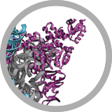



## Marker genes

Marker genes amplified from environmental samples have been primary tools for deep and detailed characterization of microbial population structures, including very rare members that occur in the environmental samples. The 16S rRNA gene has been historically a very useful gene to target, and over the years 16S rRNA gene-based surveys have generated tremendous amount of data. One of our goals is to continue developing tools and algorithms, such as [oligotyping]({{ site.url }}/projects/oligotyping/) and [minimum entropy decomposition]({{ site.url }}/projects/med/), to help researchers to partition their high-throughput sequencing datasets into highly resolved and ecologically relevant units.

## Metagenomics & Metatranscriptomics

Although marker genes are useful for the characterization of the community structure, they cannot answer questions about microbial communities regarding what they are capable of doing with respect to their total genomic content with confidence, or what genes are being expressed at a given condition. Although there are challenges, metagenomic approaches that utilize shotgun sequencing of environmental DNA and/or RNA is key to understand the overall functional potential and/or acitivity of a naturally occurring microbial community. We have been developing [anvi'o]({{ site.url  }}/projects/anvio/), an advanced software platform with analytical tools and ivisualization capabilities to better-exploit metagenomic and metatranscriptomic datasets.

## And More...

We believe in holistic approaches, and hyptothesis-driven science.

We spend a lot of effort to identify best practices to better understand microbes and their interactions with the environment.

We appreciate the importance of cultivation, imaging, and reliance on model systems. Whether it is related to human health and medicine, or environmental remediation and protection, we strive to design our experiments and form our collaborations to achieve multifaceted perspectives to address challenging questions.

Please don't hesitate to [write to us]({{site.url}}/people/) for more information.

