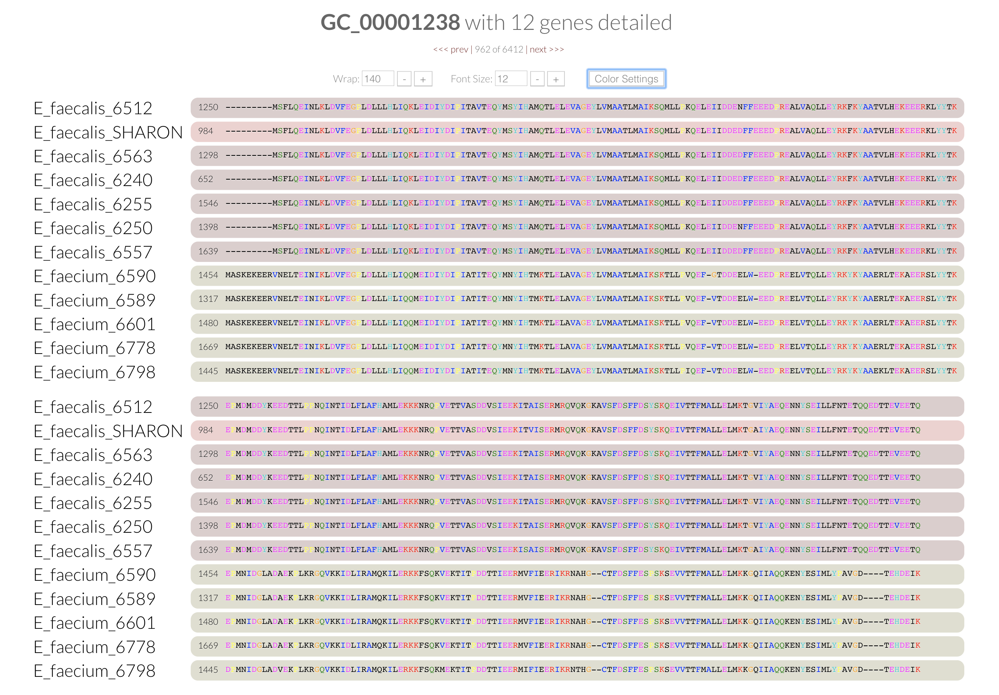



A FASTA-type anvi'o artifact. This artifact is typically generated, used, and/or exported **by anvi'o** (and not provided by the user)..

🔙 **[To the main page](../../)** of anvi'o programs and artifacts.

## Provided by

[anvi-get-sequences-for-gene-clusters](../../programs/anvi-get-sequences-for-gene-clusters) [anvi-get-sequences-for-hmm-hits](../../programs/anvi-get-sequences-for-hmm-hits)

## Required or used by

[anvi-gen-phylogenomic-tree](../../programs/anvi-gen-phylogenomic-tree)

## Description

This file **contains the alignment information for multiple genes across different organisms**.

Basically, a single gene alignment compares a single gene's sequence across multiple organisms. For example, you could align some specific rRNA sequence across all of the organisms in your sample. This alignment highlights both mutations and insertions and deletions (indicated with dashes). 

Clustal programs do a great job of visualizing this data, by color coding it. Here is an example from Anvi'o's pangenome display: 

A concatenated gene alignment fasta contains multiple of these gene alignments, in order to generate a tree based off of multiple genes. 

This information can then be used to generate a phylogenomic tree using [anvi-gen-phylogenomic-tree](/software/anvio/help/7.1/programs/anvi-gen-phylogenomic-tree) or through programs like [FastTree](http://www.microbesonline.org/fasttree/). 

In Anvi'o, this is an output of [anvi-get-sequences-for-gene-clusters](/software/anvio/help/7.1/programs/anvi-get-sequences-for-gene-clusters) (for generating a tree based off of gene clusters in your workflow) as well as [anvi-get-sequences-for-hmm-hits](/software/anvio/help/7.1/programs/anvi-get-sequences-for-hmm-hits) (for generating a tree based off of the genes that got HMM hits). 

{:.notice}
Edit [this file](https://github.com/merenlab/anvio/tree/master/anvio/docs/artifacts/concatenated-gene-alignment-fasta.md) to update this information.

