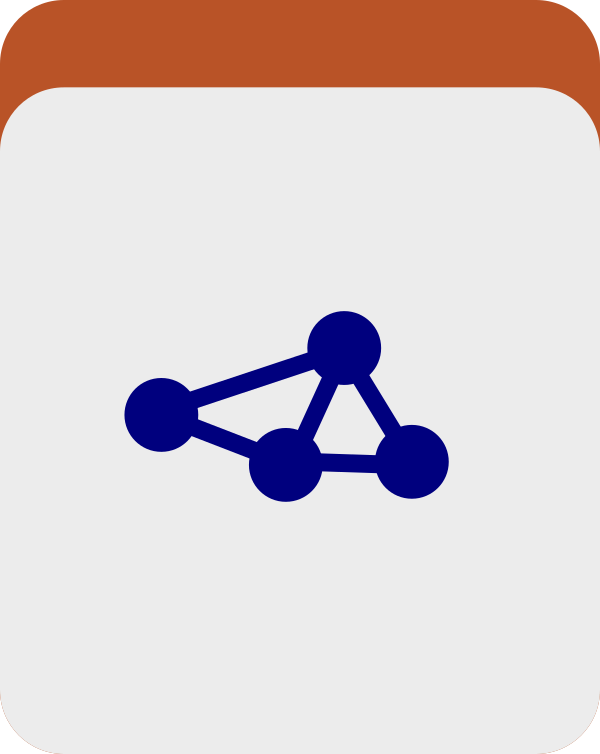

A program to cluster items in a merged anvi&#x27;o profile using automatic binning algorithms.

🔙 **[To the main page](../../)** of anvi'o programs and artifacts.



{{ "network.json" }}
{{ 300 }}


## Authors

Özcan C. Esen
<a href="http://blog.ozcanesen.com/" class="person-social" target="_blank"><i class="fa fa-fw fa-home"></i>Web</a><a href="mailto:ozcanesen@gmail.com" class="person-social" target="_blank"><i class="fa fa-fw fa-envelope-square"></i>Email</a><a href="http://twitter.com/ozcanesen" class="person-social" target="_blank"><i class="fa fa-fw fa-twitter-square"></i>Twitter</a><a href="http://github.com/ozcan" class="person-social" target="_blank"><i class="fa fa-fw fa-github"></i>Github</a>

A. Murat Eren (Meren)
<a href="http://meren.org" class="person-social" target="_blank"><i class="fa fa-fw fa-home"></i>Web</a><a href="mailto:a.murat.eren@gmail.com" class="person-social" target="_blank"><i class="fa fa-fw fa-envelope-square"></i>Email</a><a href="http://twitter.com/merenbey" class="person-social" target="_blank"><i class="fa fa-fw fa-twitter-square"></i>Twitter</a><a href="http://github.com/meren" class="person-social" target="_blank"><i class="fa fa-fw fa-github"></i>Github</a>

## Can consume

[profile-db](../../artifacts/profile-db)  [contigs-db](../../artifacts/contigs-db)  [collection](../../artifacts/collection) 

## Can provide

[collection](../../artifacts/collection)  [bin](../../artifacts/bin) 

## Usage

This program clusters the contigs stored in a [profile-db](/software/anvio/help/7.1/artifacts/profile-db) using your binning algorithm of choice and stores the results in several [bin](/software/anvio/help/7.1/artifacts/bin)s. 

This is a quick alternative to manually binning your contigs, but it might miss some details that a human doing manual binning would find. After running this, you might want to run [anvi-summarize](/software/anvio/help/7.1/programs/anvi-summarize) on the resulting [collection](/software/anvio/help/7.1/artifacts/collection) to look through your bins, and, if necessary, use [anvi-refine](/software/anvio/help/7.1/programs/anvi-refine) to change the contents of them. 

You have to option to use several different clustering algorithms, which you'll specify with the `driver` parameter: [concoct](https://github.com/BinPro/CONCOCT/blob/develop/doc/source/index.rst), [metabat2](https://www.ncbi.nlm.nih.gov/pmc/articles/PMC6662567/), [maxbin2](https://academic.oup.com/bioinformatics/article/32/4/605/1744462), [dastool](https://github.com/cmks/DAS_Tool), and [binsanity](https://www.ncbi.nlm.nih.gov/pmc/articles/PMC5345454/). 

So, a run of this program will look like the following:

anvi&#45;cluster&#45;contigs &#45;p [profile&#45;db](/software/anvio/help/7.1/artifacts/profile&#45;db) \
                     &#45;c [contigs&#45;db](/software/anvio/help/7.1/artifacts/contigs&#45;db) \ 
                     &#45;C [collection](/software/anvio/help/7.1/artifacts/collection) \ 
                     &#45;&#45;driver concoct

Once you specify an algorithm, there are many algorithm specific parameters that you can change to your liking. When this program is set up, these parameters will appear in the help menu for the algorithms that anvi'o can find. 

{:.notice}
Edit [this file](https://github.com/merenlab/anvio/tree/master/anvio/docs/programs/anvi-cluster-contigs.md) to update this information.

## Additional Resources

{:.notice}
Are you aware of resources that may help users better understand the utility of this program? Please feel free to edit [this file](https://github.com/merenlab/anvio/tree/master/bin/anvi-cluster-contigs) on GitHub. If you are not sure how to do that, find the `__resources__` tag in [this file](https://github.com/merenlab/anvio/blob/master/bin/anvi-interactive) to see an example.
