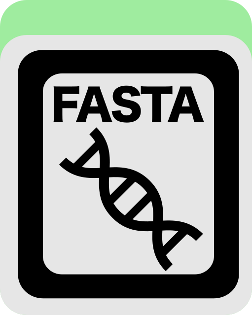

Identify redundant (highly similar) genomes.

🔙 **[To the main page](../../)** of anvi'o programs and artifacts.



{{ "network.json" }}
{{ 300 }}


## Authors

Evan Kiefl
<a href="mailto:kiefl.evan@gmail.com" class="person-social" target="_blank"><i class="fa fa-fw fa-envelope-square"></i>Email</a><a href="http://twitter.com/evankiefl" class="person-social" target="_blank"><i class="fa fa-fw fa-twitter-square"></i>Twitter</a><a href="http://github.com/ekiefl" class="person-social" target="_blank"><i class="fa fa-fw fa-github"></i>Github</a>

Mahmoud Yousef
<a href="mailto:mahmoudyousef@uchicago.edu" class="person-social" target="_blank"><i class="fa fa-fw fa-envelope-square"></i>Email</a><a href="http://github.com/mahmoudyousef98" class="person-social" target="_blank"><i class="fa fa-fw fa-github"></i>Github</a>

## Can consume

[external-genomes](../../artifacts/external-genomes)  [internal-genomes](../../artifacts/internal-genomes)  [fasta](../../artifacts/fasta)  [genome-similarity](../../artifacts/genome-similarity) 

## Can provide

[fasta](../../artifacts/fasta) 

## Usage

This program uses the user's similarity metric of choice to identify genomes that are highly similar to each other, and groups them together into redundant clusters. The program finds representative sequences for each cluster and outputs them into [fasta](/software/anvio/help/7.1/artifacts/fasta) files.

#### Input Options 

You have two options for the input to this program: 

- the results of [anvi-compute-genome-similarity](/software/anvio/help/7.1/programs/anvi-compute-genome-similarity) (a [genome-similarity](/software/anvio/help/7.1/artifacts/genome-similarity) directory). If you used `fastANI` or `pyANI` when you ran [anvi-compute-genome-similarity](/software/anvio/help/7.1/programs/anvi-compute-genome-similarity), provide this using the parameter `--ani-dir`; if you used sourmash, use the parameter `--mash-dir`. 

- an [internal-genomes](/software/anvio/help/7.1/artifacts/internal-genomes), [external-genomes](/software/anvio/help/7.1/artifacts/external-genomes) or a series of [fasta](/software/anvio/help/7.1/artifacts/fasta) files (each of which represents a genome), in which case anvi'o will run [anvi-compute-genome-similarity](/software/anvio/help/7.1/programs/anvi-compute-genome-similarity) for you.  When providing these inputs, you can also provide any of the parameters that [anvi-compute-genome-similarity](/software/anvio/help/7.1/programs/anvi-compute-genome-similarity) can take, including the `--program` you want to use (out of  [PyANI](https://github.com/widdowquinn/pyani), [fastANI](https://github.com/ParBLiSS/FastANI),  [sourmash](https://sourmash.readthedocs.io/en/latest/)) and their parameters. Details about all of this can be found in the help menu for [anvi-compute-genome-similarity](/software/anvio/help/7.1/programs/anvi-compute-genome-similarity).

#### Output Format 

By default, the output of this program is a directory containing two descriptive text files (the cluster report and fasta report) and a subdirectory called `GENOMES`:

-The cluster report describes is a tab-delimited text file where each row describes a cluster. This file contains four columns: the cluster name, the number of genomes in the cluster, the representative genome of the cluster, and a list of the genomes that are in the cluster. Here is an example describing 11 genomes in three clusters:

    DEREPLICATION-0.97 $ head CLUSTER_REPORT.txt
    cluster    size    representative    genomes
    cluster_000001    1    G11_IGD_MAG_00001    G11_IGD_MAG_00001
    cluster_000002    8    G11_IGD_MAG_00012    G08_IGD_MAG_00008,G33_IGD_MAG_00011,G01_IGD_MAG_00013,G06_IGD_MAG_00023,G03_IGD_MAG_00021,G05_IGD_MAG_00014,G11_IGD_MAG_00012,G10_IGD_MAG_00010
    cluster_000003    2    G03_IGD_MAG_00011    G11_IGD_MAG_00013,G03_IGD_MAG_00011

-The subdirectory `GENOMES` contains fasta files describing the representative genome from each cluster. For example, if your original set of genomes had two identical genomes, this program would cluster them together, and the `GENOMES` folder would only include one of their sequences. 

-The fasta report describes the fasta files contained in the subdirectory `GENOMES`. By default, this describes the representative sequence of each of the final clusters. It tells you the genome name, its source, its cluster (and the representative sequence of that cluster), and the path to its fasta file in  `GENOMES`.  So, for the example above, the fasta report would look like this:

    DEREPLICATION-0.97 $ head FASTA_REPORT.txt
    name    source    cluster    cluster_rep    path
    G11_IGD_MAG_00001    fasta    cluster_000001    G11_IGD_MAG_00001    GENOMES/G11_IGD_MAG_00001.fa
    G11_IGD_MAG_00012    fasta    cluster_000002    G11_IGD_MAG_00012    GENOMES/G11_IGD_MAG_00012.fa
    G03_IGD_MAG_00011    fasta    cluster_000003    G03_IGD_MAG_00011    GENOMES/G03_IGD_MAG_00011.fa

You can also choose to report all genome fasta files (including redundant genomes) (with `--report-all`) or report no fasta files (with `--skip-fasta-report`). This would change the fasta files included in `GENOMES` and the genomes mentioned in the fasta report. The cluster report would be identical.

#### Required Parameters and Example Runs

You are required to set the threshold for two genomes to be considered redundant and put in the same cluster. 

For example, if you had the results from an [anvi-compute-genome-similarity](/software/anvio/help/7.1/programs/anvi-compute-genome-similarity) run where you had used `PyANI` and wanted the threshold to be 90 percent, you would run: 

anvi&#45;dereplictate&#45;genomes &#45;&#45;ani&#45;dir [genome&#45;similarity](/software/anvio/help/7.1/artifacts/genome&#45;similarity) \ 
                          &#45;o path/to/output \
                          &#45;&#45;similiarity&#45;threshold 0.90

If instead you hadn't yet run [anvi-compute-genome-similarity](/software/anvio/help/7.1/programs/anvi-compute-genome-similarity) and instead wanted to cluster the genomes in your [external-genomes](/software/anvio/help/7.1/artifacts/external-genomes) file with similarity 85 percent or more (no fasta files necessary) using sourmash, you could run: 

anvi&#45;dereplictate&#45;genomes &#45;e [external&#45;genomes](/software/anvio/help/7.1/artifacts/external&#45;genomes) \ 
                          &#45;&#45;skip&#45;fasta&#45;report \
                          &#45;&#45;program sourmash \
                          &#45;o path/to/output \
                          &#45;&#45;similiarity&#45;threshold 0.85 

#### Other parameters

You can change how anvi'o picks the representative sequence from each cluster with the parameter `--representative-method`. For this you have three options:

- `Qscore`: picks the genome with highest completion and lowest redundancy
- `length`: picks the longest genome in the cluster
- `centrality` (default): picks the genome with highest average similiarty to every other genome in the cluster

You can also choose to skip checking genome hashes (which will warn you if you have identical sequences in separate genomes with different names), provide a log path for debug messages or use multithreading (relevant only if not providing `--ani-dir` or `--mash-dir`).

{:.notice}
Edit [this file](https://github.com/merenlab/anvio/tree/master/anvio/docs/programs/anvi-dereplicate-genomes.md) to update this information.

## Additional Resources

{:.notice}
Are you aware of resources that may help users better understand the utility of this program? Please feel free to edit [this file](https://github.com/merenlab/anvio/tree/master/bin/anvi-dereplicate-genomes) on GitHub. If you are not sure how to do that, find the `__resources__` tag in [this file](https://github.com/merenlab/anvio/blob/master/bin/anvi-interactive) to see an example.
