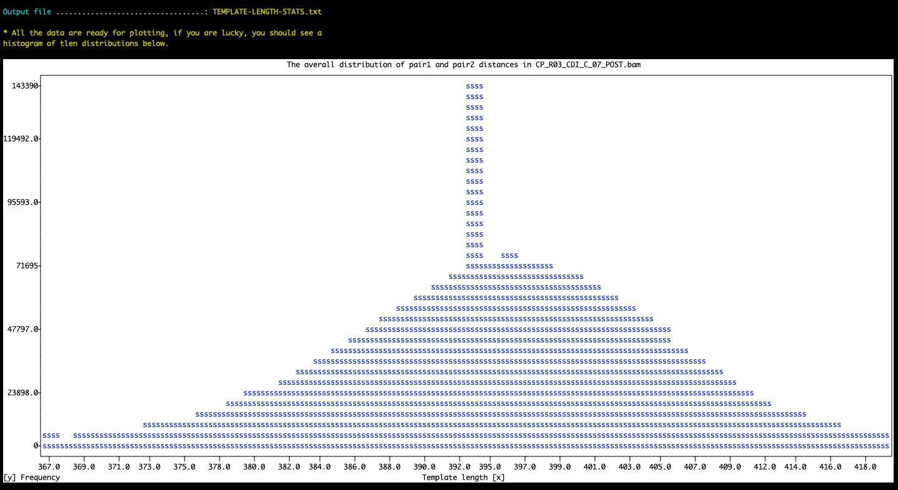

Report the distribution of template lengths from a BAM file. The purpose of this is to get an idea about the insert size distribution in a BAM file rapidly by summarizing distances between each paired-end read in a given read recruitment experiment..

🔙 **[To the main page](../../)** of anvi'o programs and artifacts.



<div id="svg" class="subnetwork"></div>
{{ "network.json" }}
{{ 300 }}



## Authors

<div class="page-author"><div class="page-author-info"><div class="page-person-photo"></div><div class="page-person-info-box"><span class="page-author-name">A. Murat Eren (Meren)</span><div class="page-author-social-box"><a href="http://meren.org" class="person-social" target="_blank"><i class="fa fa-fw fa-home"></i>Web</a><a href="mailto:a.murat.eren@gmail.com" class="person-social" target="_blank"><i class="fa fa-fw fa-envelope-square"></i>Email</a><a href="http://twitter.com/merenbey" class="person-social" target="_blank"><i class="fa fa-fw fa-twitter-square"></i>Twitter</a><a href="http://github.com/meren" class="person-social" target="_blank"><i class="fa fa-fw fa-github"></i>Github</a></div></div></div></div>


## Can consume


<p style="text-align: left" markdown="1"><span class="artifact-r">[bam-file](../../artifacts/bam-file) </span></p>


## Can provide


This program does not seem to provide any artifacts. Such programs usually print out some information for you to see or alter some anvi'o artifacts without producing any immediate outputs.


## Usage


This program may be useful if you are interested in learning the insert size distribution in a given <span class="artifact-n">[bam-file](/software/anvio/help/7.1/artifacts/bam-file)</span>.

## Example run

The most straightforward way to run the program is the following:

<div class="codeblock" markdown="1">
anvi&#45;get&#45;tlen&#45;dist&#45;from&#45;bam <span class="artifact&#45;n">[bam&#45;file](/software/anvio/help/7.1/artifacts/bam&#45;file)</span>
</div>

Here is an example output in the terminal:

```
BAM file .....................................: ./INVERSION-TEST/CP_R03_CDI_C_07_POST.bam
Number of contigs ............................: 8
Number of reads ..............................: 2,331,062
Minimum template length frequency ............: 10
Maximum template length to consider ..........: 500,000


WARNING
===============================================
Some of your contigs, 2 of 8 to be precise, did not seem to have any template
lenght data. There are many reasons this could happen, including a very high
`--min-tlen-frequency` parameter for BAM files with small number of reads. But
since there are some contigs that seem to have proper paired-end reads with
template lengths, anvi'o will continue reporting and put zeros for contigs that
have no data in output files.

Output file ..................................: TEMPLATE-LENGTH-STATS.txt


✓ anvi-get-tlen-dist-from-bam took 0:00:05.483682
```

## Output file

The program will report a TAB-delimited output file with the following format:

|contig|length|num_reads_considered|mean|mean_Q2Q3|median|min|max|std|
|:--|:--:|:--:|:--:|:--:|:--:|:--:|:--:|:--:|
|B_fragilis_ARW016_000000000001|5526948|2213634|367.6|392.5|393.0|32|71613|663.1|
|B_fragilis_ARW016_000000000002|3905|634|398.6|398.7|399.0|382|415|7.926|
|B_fragilis_ARW016_000000000003|4039|588|397.5|397.8|398.0|380|411|7.206|
|B_fragilis_ARW016_000000000004|3950|524|397.4|397.2|397.0|382|414|7.492|
|B_fragilis_ARW016_000000000005|911|0|||||||
|B_fragilis_ARW016_000000000006|647|0|||||||
|B_fragilis_ARW016_000000000007|12247|1860|394.9|396.7|397.0|99|419|23.61|
|B_fragilis_ARW016_000000000008|4861|528|396.7|396.7|397.0|384|410|6.746|

## Histogram

If you run the program with the flag `--plot`, it will attempt to plot a histogram for all contigs in the BAM file.

{:.warning}
The plotting function requires an additional Python library, [plotext](https://github.com/piccolomo/plotext), to be installed. While it is not a part of the default anvi'o distirbution, you can install it in your environment by running `pip install plotext`.

Here is an example run:

```
anvi-get-tlen-dist-from-bam CP_R03_CDI_C_07_POST.bam \
                            --plot \
                            --max-template-length-to-consider 5000 \
                            --min-template-length-frequency 2500
```

And the result in the terminal:

[{:.center-img}](../../images/anvi-get-tlen-dist-from-bam.png)

The histogram may require additional filters to avoid skewed displays due to outliers. The parameters `--max-template-length-to-consider` and/or `--min-template-length-frequency` may be useful for such adjustments. Please see the help menu for their details.

The best practice is likely to run the program without any of these parameters and without the `--plot` flag to generate a comprehensive TAB-delimited report, and then use the `--plot` flag to visualize trends.

{:.notice}
Edit [this file](https://github.com/merenlab/anvio/tree/master/anvio/docs/programs/anvi-get-tlen-dist-from-bam.md) to update this information.


## Additional Resources


{:.notice}
Are you aware of resources that may help users better understand the utility of this program? Please feel free to edit [this file](https://github.com/merenlab/anvio/tree/master/bin/anvi-get-tlen-dist-from-bam) on GitHub. If you are not sure how to do that, find the `__resources__` tag in [this file](https://github.com/merenlab/anvio/blob/master/bin/anvi-interactive) to see an example.
