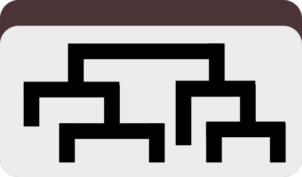

Populate additional data or order tables in pan or profile databases for items and layers, OR additional data in contigs databases for nucleotides and amino acids (the Swiss army knife-level serious stuff).

🔙 **[To the main page](../../)** of anvi'o programs and artifacts.



{{ "network.json" }}
{{ 300 }}


## Authors

A. Murat Eren (Meren)
<a href="http://meren.org" class="person-social" target="_blank"><i class="fa fa-fw fa-home"></i>Web</a><a href="mailto:a.murat.eren@gmail.com" class="person-social" target="_blank"><i class="fa fa-fw fa-envelope-square"></i>Email</a><a href="http://twitter.com/merenbey" class="person-social" target="_blank"><i class="fa fa-fw fa-twitter-square"></i>Twitter</a><a href="http://github.com/meren" class="person-social" target="_blank"><i class="fa fa-fw fa-github"></i>Github</a>

## Can consume

[pan-db](../../artifacts/pan-db)  [profile-db](../../artifacts/profile-db)  [contigs-db](../../artifacts/contigs-db)  [misc-data-items-txt](../../artifacts/misc-data-items-txt)  [dendrogram](../../artifacts/dendrogram)  [phylogeny](../../artifacts/phylogeny)  [misc-data-layers-txt](../../artifacts/misc-data-layers-txt)  [misc-data-layer-orders-txt](../../artifacts/misc-data-layer-orders-txt)  [misc-data-nucleotides-txt](../../artifacts/misc-data-nucleotides-txt)  [misc-data-amino-acids-txt](../../artifacts/misc-data-amino-acids-txt) 

## Can provide

[misc-data-items](../../artifacts/misc-data-items)  [misc-data-layers](../../artifacts/misc-data-layers)  [misc-data-layer-orders](../../artifacts/misc-data-layer-orders)  [misc-data-nucleotides](../../artifacts/misc-data-nucleotides)  [misc-data-amino-acids](../../artifacts/misc-data-amino-acids) 

## Usage

This program lets you **bring additional information into your anvi'o databases** that will appear when you run [anvi-interactive](/software/anvio/help/7.1/programs/anvi-interactive).   

With this, you can 
- **bring additional data about your items or layers into the anvi'o interactive interface** by putting it into a [pan-db](/software/anvio/help/7.1/artifacts/pan-db) or [profile-db](/software/anvio/help/7.1/artifacts/profile-db)
- **bring additional data about your nucleotides/amino acids** into a [contigs-db](/software/anvio/help/7.1/artifacts/contigs-db) 

You also have the option to associate keys with only a specific data group, or transpose the input before processing (in case you misformatted it). 

If you no longer want to see data you've added with this function, you can export it as the original text file with [anvi-export-misc-data](/software/anvio/help/7.1/programs/anvi-export-misc-data) and delete it from the database with [anvi-delete-misc-data](/software/anvio/help/7.1/programs/anvi-delete-misc-data).

## Items, Layers, and the Interactive Interface 

{:.notice}
This process, as well as the definition of an item and a layer, are described in more detail in [this blog post](http://merenlab.org/2017/12/11/additional-data-tables). 

Basically, you can add additional information to the interactive interface by running this program on the database you want to display and a text file containing your information. You can do this with three types of data (see their individual pages for more information on each): 

1. [misc-data-items](/software/anvio/help/7.1/artifacts/misc-data-items) by providing a [misc-data-items-txt](/software/anvio/help/7.1/artifacts/misc-data-items-txt). This contains information about *each of your items in the central tree* (whether those are contigs, bins, or genes), and will appear as **additional concentric circles** when you run [anvi-interactive](/software/anvio/help/7.1/programs/anvi-interactive). 

    

    anvi&#45;import&#45;misc&#45;data &#45;p [profile&#45;db](/software/anvio/help/7.1/artifacts/profile&#45;db) \
                          &#45;t items \
                          [misc&#45;data&#45;items&#45;txt](/software/anvio/help/7.1/artifacts/misc&#45;data&#45;items&#45;txt) 
    

        
2. [misc-data-layers](/software/anvio/help/7.1/artifacts/misc-data-layers) by providing a [misc-data-layers-txt](/software/anvio/help/7.1/artifacts/misc-data-layers-txt). This contains information about *each layer (or concentric circle) of the interface* (which usually correspond to your samples), and will appear as **graphs in line with your circles of data** (on the right, similar to how to the titles of each layer are displayed at the top) when you run [anvi-interactive](/software/anvio/help/7.1/programs/anvi-interactive). 

    

    anvi&#45;import&#45;misc&#45;data &#45;p [pan&#45;db](/software/anvio/help/7.1/artifacts/pan&#45;db) \
                          &#45;t layers \
                          [misc&#45;data&#45;layers&#45;txt](/software/anvio/help/7.1/artifacts/misc&#45;data&#45;layers&#45;txt)                               
    

3. [misc-data-layer-orders](/software/anvio/help/7.1/artifacts/misc-data-layer-orders) by providing a [misc-data-layer-orders-txt](/software/anvio/help/7.1/artifacts/misc-data-layer-orders-txt). This contains information about *what order you want the concentric circles to be displayed in*  (which usually correspond to your samples), and will appear as **above the misc-data-layers graphs as a tree** when you run [anvi-interactive](/software/anvio/help/7.1/programs/anvi-interactive). 

    

    anvi&#45;import&#45;misc&#45;data &#45;p [profile&#45;db](/software/anvio/help/7.1/artifacts/profile&#45;db) \
                          &#45;t layer_orders \
                          [misc&#45;data&#45;layer&#45;orders&#45;txt](/software/anvio/help/7.1/artifacts/misc&#45;data&#45;layer&#45;orders&#45;txt) 
    

## Nucleotides, Amino Acids, and Contigs Databases

This feature lets you import additional data about specfic residues or specific base pairs into your [contigs-db](/software/anvio/help/7.1/artifacts/contigs-db). This is especially useful for strucutral analysis (so when running programs like [anvi-display-structure](/software/anvio/help/7.1/programs/anvi-display-structure)) and will be very relevant to the InteracDome functionality when it's added in anvi'o v7 (curious readers can take a look at [this blog post](http://merenlab.org/2020/07/22/interacdome/)). 

When adding additional data, unlike with layers and items, you do not have to provide values for every single nucleotide in your database. With this program, you can easily provide data for only a select few. 

Basically, you can add two types of data to your contigs database:

1. [misc-data-nucleotides](/software/anvio/help/7.1/artifacts/misc-data-nucleotides) by providing a [misc-data-nucleotides-txt](/software/anvio/help/7.1/artifacts/misc-data-nucleotides-txt). This contains information about *specific nucleotides in your database.*

    

    anvi&#45;import&#45;misc&#45;data &#45;c [contigs&#45;db](/software/anvio/help/7.1/artifacts/contigs&#45;db) \
                          &#45;t nucleotides \
                          [misc&#45;data&#45;nucleotides&#45;txt](/software/anvio/help/7.1/artifacts/misc&#45;data&#45;nucleotides&#45;txt) 
    

        
2. [misc-data-amino-acids](/software/anvio/help/7.1/artifacts/misc-data-amino-acids) by providing a [misc-data-amino-acids-txt](/software/anvio/help/7.1/artifacts/misc-data-amino-acids-txt). This contains information about *specific amino acid residues in your database*

    

    anvi&#45;import&#45;misc&#45;data &#45;c [contigs&#45;db](/software/anvio/help/7.1/artifacts/contigs&#45;db) \
                          &#45;t amino_acids \
                          [misc&#45;data&#45;amino&#45;acids&#45;txt](/software/anvio/help/7.1/artifacts/misc&#45;data&#45;amino&#45;acids&#45;txt)                               
    

{:.notice}
Edit [this file](https://github.com/merenlab/anvio/tree/master/anvio/docs/programs/anvi-import-misc-data.md) to update this information.

## Additional Resources

* [A primer on anvi&#x27;o misc data tables](http://merenlab.org/2017/12/11/additional-data-tables/)

{:.notice}
Are you aware of resources that may help users better understand the utility of this program? Please feel free to edit [this file](https://github.com/merenlab/anvio/tree/master/bin/anvi-import-misc-data) on GitHub. If you are not sure how to do that, find the `__resources__` tag in [this file](https://github.com/merenlab/anvio/blob/master/bin/anvi-interactive) to see an example.
