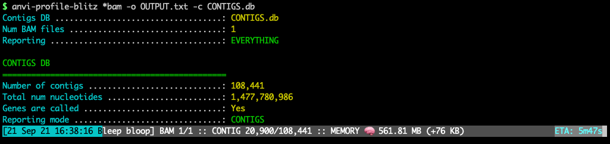

FAST profiling of BAM files to get contig- or gene-level coverage and detection stats. Unlike `anvi-profile`, which is another anvi&#x27;o program that can profile BAM files, this program is designed to be very quick and only report long-format files for various read recruitment statistics per item. Plase also see the program `anvi-script-get-coverage-from-bam` for recovery of data from BAM files without an anvi&#x27;o contigs database.

🔙 **[To the main page](../../)** of anvi'o programs and artifacts.



{{ "network.json" }}
{{ 300 }}


## Authors

A. Murat Eren (Meren)
<a href="http://meren.org" class="person-social" target="_blank"><i class="fa fa-fw fa-home"></i>Web</a><a href="mailto:a.murat.eren@gmail.com" class="person-social" target="_blank"><i class="fa fa-fw fa-envelope-square"></i>Email</a><a href="http://twitter.com/merenbey" class="person-social" target="_blank"><i class="fa fa-fw fa-twitter-square"></i>Twitter</a><a href="http://github.com/meren" class="person-social" target="_blank"><i class="fa fa-fw fa-github"></i>Github</a>

## Can consume

[bam-file](../../artifacts/bam-file)  [contigs-db](../../artifacts/contigs-db) 

## Can provide

[bam-stats-txt](../../artifacts/bam-stats-txt) 

## Usage

This program **produces a [bam-stats-txt](/software/anvio/help/7.1/artifacts/bam-stats-txt) from one or more [bam-file](/software/anvio/help/7.1/artifacts/bam-file) given a [contigs-db](/software/anvio/help/7.1/artifacts/contigs-db)**. It is designed to serve people who only need to process read recruitment data stored in a [bam-file](/software/anvio/help/7.1/artifacts/bam-file) to recover coverage and detection statistics (along with others) for their genes and/or contigs, and will report what's going on nicely with memory usage information and estimated time of completion:

[{:.center-img}](../../images/anvi-profile-blitz.png)

There are other programs in anvi'o software ecosystem that are similar to this one:

* [anvi-profile](/software/anvio/help/7.1/programs/anvi-profile) also takes a [bam-file](/software/anvio/help/7.1/artifacts/bam-file) and profiles it. **They both require a [contigs-db](/software/anvio/help/7.1/artifacts/contigs-db)**. But while [anvi-profile](/software/anvio/help/7.1/programs/anvi-profile) produces a [single-profile-db](/software/anvio/help/7.1/artifacts/single-profile-db) for downstream analyses in anvi'o, [anvi-profile-blitz](/software/anvio/help/7.1/programs/anvi-profile-blitz) produces text files for downstream analyses by the user (via R, Python, or other solutions). In contrast to [anvi-profile](/software/anvio/help/7.1/programs/anvi-profile), [anvi-profile-blitz](/software/anvio/help/7.1/programs/anvi-profile-blitz) is orders of magnitude faster with similar memory usage.

* [anvi-script-get-coverage-from-bam](/software/anvio/help/7.1/programs/anvi-script-get-coverage-from-bam) also takes a [bam-file](/software/anvio/help/7.1/artifacts/bam-file) and profiles it. **They both produce text output files.** But while [anvi-script-get-coverage-from-bam](/software/anvio/help/7.1/programs/anvi-script-get-coverage-from-bam) does not require a [contigs-db](/software/anvio/help/7.1/artifacts/contigs-db), [anvi-profile-blitz](/software/anvio/help/7.1/programs/anvi-profile-blitz) requires one to work. They will both run very rapidly, [anvi-script-get-coverage-from-bam](/software/anvio/help/7.1/programs/anvi-script-get-coverage-from-bam) will work with much smaller amount of memory.

## Output files

For output file formats, please see [bam-stats-txt](/software/anvio/help/7.1/artifacts/bam-stats-txt).

## Running

You can use this program with one or more BAM files to recover minimal or extended statistics for contigs or genes in a [contigs-db](/software/anvio/help/7.1/artifacts/contigs-db).

{:.warning}
Since the program will not be able to ensure the [contigs-db](/software/anvio/help/7.1/artifacts/contigs-db) was generated from the same [contigs-fasta](/software/anvio/help/7.1/artifacts/contigs-fasta) that was used for read recruitment that resulted in [bam-file](/software/anvio/help/7.1/artifacts/bam-file)s for analysis, you can make serious mistakes unless you mix up your workflow and start profiling BAM files that have nothing to do with a [contigs-db](/software/anvio/help/7.1/artifacts/contigs-db). If you make a mistake like that, in the best case scenario you will get an empty output file because the program will skip all contigs with non-matching name. In the worst case scenario you will get a file if some names in [contigs-db](/software/anvio/help/7.1/artifacts/contigs-db) incorrectly matches to some names in the [bam-file](/software/anvio/help/7.1/artifacts/bam-file). While this warning may be confusing, you can avoid all these if you use the SAME FASTA FILE both as reference for read recruitment and as input for [anvi-gen-contigs-database](/software/anvio/help/7.1/programs/anvi-gen-contigs-database).

### Contigs mode, default output

Profile contigs, produce a default output:

anvi&#45;profile&#45;blitz [bam&#45;file](/software/anvio/help/7.1/artifacts/bam&#45;file) \
                   &#45;c [contigs&#45;db](/software/anvio/help/7.1/artifacts/contigs&#45;db) \
                   &#45;o OUTPUT.txt

This example is with a single BAM file, but you can also have multiple BAM files as a parameter by using wildcards,

anvi&#45;profile&#45;blitz &#42;.bam \
                   &#45;c [contigs&#45;db](/software/anvio/help/7.1/artifacts/contigs&#45;db) \
                   &#45;o OUTPUT.txt

or by providing multiple paths:

anvi&#45;profile&#45;blitz /path/to/SAMPLE&#45;01.bam \
                   /path/to/SAMPLE&#45;02.bam \
                   /another/path/to/SAMPLE&#45;03.bam
                   &#45;c [contigs&#45;db](/software/anvio/help/7.1/artifacts/contigs&#45;db) \
                   &#45;o OUTPUT.txt

### Contigs mode, minimal output

Profile contigs, produce a minimal output. This is the fastest option:

anvi&#45;profile&#45;blitz [bam&#45;file](/software/anvio/help/7.1/artifacts/bam&#45;file) \
                   &#45;c [contigs&#45;db](/software/anvio/help/7.1/artifacts/contigs&#45;db) \
                   &#45;&#45;report&#45;minimal \
                   &#45;o OUTPUT.txt

### Genes mode, default output

Profile genes, produce a default output:

anvi&#45;profile&#45;blitz [bam&#45;file](/software/anvio/help/7.1/artifacts/bam&#45;file) \
                   &#45;c [contigs&#45;db](/software/anvio/help/7.1/artifacts/contigs&#45;db) \
                   &#45;&#45;gene&#45;mode \
                   &#45;o OUTPUT.txt

### Genes mode, minimal output

Profile genes, produce a default output:

anvi&#45;profile&#45;blitz [bam&#45;file](/software/anvio/help/7.1/artifacts/bam&#45;file) \
                   &#45;c [contigs&#45;db](/software/anvio/help/7.1/artifacts/contigs&#45;db) \
                   &#45;&#45;gene&#45;mode \
                   &#45;&#45;report&#45;minimal \
                   &#45;o OUTPUT.txt

## Performance

The memory use will be correlated linaerly with the size of the [contigs-db](/software/anvio/help/7.1/artifacts/contigs-db), but once everything is loaded, the memory usage will not increase substantially over time.

With the flag `--report-minimal`, [anvi-profile-blitz](/software/anvio/help/7.1/programs/anvi-profile-blitz) profiled on a laptop computer 100,000 contigs that contained 1 billion nts in 6 minutes and used  ~300 Mb memory. This contigs database had 1.5 million genes, and memory usage increased to 1.7 Gb when [anvi-profile-blitz](/software/anvio/help/7.1/programs/anvi-profile-blitz) run in `--gene-mode`. The flag `--gene-mode` does not change time complexity dramatically.

Anvi'o has this program because [Emile Faure](https://twitter.com/faureemile) presented us with a [challenge](https://anvio.slack.com/archives/C8SFMGYF3/p1631723790065300): Emile had a ~140 Gb anvi'o [contigs-db](/software/anvio/help/7.1/artifacts/contigs-db) that contained nearly 70 million contig sequences from over 200 single-assembled metagenomes, and wanted to learn the coverages of each gene in the contigs database in 200 metagenomes individually. Yet the combination of [anvi-profile](/software/anvio/help/7.1/programs/anvi-profile) and [anvi-summarize](/software/anvio/help/7.1/programs/anvi-summarize) jobs would take **more than 40 days** to complete. Since all Emile needed was to learn the coverages from BAM files, we implemented [anvi-profile-blitz](/software/anvio/help/7.1/programs/anvi-profile-blitz) to skip the profiling step. The run took **8 hours to compute and report coverage values for 175 million genes in 70 million contigs**, and the memory use remained below 200 Gb.

{:.notice}
Edit [this file](https://github.com/merenlab/anvio/tree/master/anvio/docs/programs/anvi-profile-blitz.md) to update this information.

## Additional Resources

{:.notice}
Are you aware of resources that may help users better understand the utility of this program? Please feel free to edit [this file](https://github.com/merenlab/anvio/tree/master/bin/anvi-profile-blitz) on GitHub. If you are not sure how to do that, find the `__resources__` tag in [this file](https://github.com/merenlab/anvio/blob/master/bin/anvi-interactive) to see an example.
