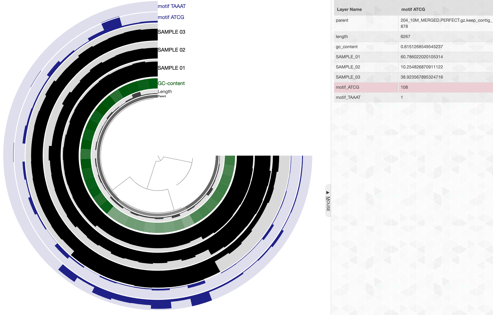

A program to find one or more sequence motifs in contig or gene sequences, and store their frequencies.

🔙 **[To the main page](../../)** of anvi'o programs and artifacts.



{{ "network.json" }}
{{ 300 }}


## Authors

A. Murat Eren (Meren)
<a href="http://meren.org" class="person-social" target="_blank"><i class="fa fa-fw fa-home"></i>Web</a><a href="mailto:a.murat.eren@gmail.com" class="person-social" target="_blank"><i class="fa fa-fw fa-envelope-square"></i>Email</a><a href="http://twitter.com/merenbey" class="person-social" target="_blank"><i class="fa fa-fw fa-twitter-square"></i>Twitter</a><a href="http://github.com/meren" class="person-social" target="_blank"><i class="fa fa-fw fa-github"></i>Github</a>

## Can consume

[profile-db](../../artifacts/profile-db)  [contigs-db](../../artifacts/contigs-db)  [genes-db](../../artifacts/genes-db) 

## Can provide

[misc-data-items](../../artifacts/misc-data-items)  [misc-data-layers](../../artifacts/misc-data-layers) 

## Usage

[anvi-search-sequence-motifs](/software/anvio/help/7.1/programs/anvi-search-sequence-motifs) will search one or more sequence motifs in applicable anvi'o databases and will report their frequency. If you have more than one motif to search, you can list them as comma-separated sequences

In this context we assume a motif is a 4 to 10 nucleotide-long string, although, anvi'o will not impose any limit to length, and will search any motif it is given along with its reverse-complement across all sequences and report frequencies.

The most primitive output is a TAB-delimited text file, but anvi'o will store frequency information also into your databases like a pro if you use the `--store-in-db` flag.

The following subsections include some examples.

## A contigs database

The minimum amount of stuff you need to run this program is a motif sequence and a [contigs-db](/software/anvio/help/7.1/artifacts/contigs-db):

anvi&#45;search&#45;sequence&#45;motifs &#45;c [contigs&#45;db](/software/anvio/help/7.1/artifacts/contigs&#45;db) \
                            &#45;&#45;motifs ATCG,TAAAT \
                            &#45;&#45;output&#45;file motifs.txt

Running this will yield an output file with as many columns as the number of sequence motifs that show their frequencies across each contig found in the [contigs-db](/software/anvio/help/7.1/artifacts/contigs-db). Here is an example:

|contig_name|ATCG|TAAAT|
|:--|:--:|:--:|
|204_10M_contig_1720|101|159|
|204_10M_contig_6515|64|31|
|204_10M_contig_878|435|3|

## Contigs database + profile database

If you provide this program with a [profile-db](/software/anvio/help/7.1/artifacts/profile-db), this time it will count your motif sequences in split sequences rather than contigs,

anvi&#45;search&#45;sequence&#45;motifs &#45;c [contigs&#45;db](/software/anvio/help/7.1/artifacts/contigs&#45;db) \
                            &#45;p [profile&#45;db](/software/anvio/help/7.1/artifacts/profile&#45;db)
                            &#45;&#45;motifs ATCG,TAAAT \
                            &#45;&#45;output&#45;file motifs.txt

And the output will look like this:

|split_name|ATCG|TAAAT|
|:--|:--:|:--:|
|204_10M_contig_1720_split_00001|14|22|
|204_10M_contig_1720_split_00002|2|6|
|204_10M_contig_1720_split_00003|14|23|
|204_10M_contig_1720_split_00004|8|18|
|204_10M_contig_1720_split_00005|9|17|
|204_10M_contig_1720_split_00006|19|28|
|204_10M_contig_1720_split_00007|4|8|
|204_10M_contig_1720_split_00008|31|32|
|204_10M_contig_1720_split_00009|0|5|
|204_10M_contig_6515_split_00001|7|5|
|204_10M_contig_6515_split_00002|5|2|
|204_10M_contig_6515_split_00003|5|4|
|204_10M_contig_6515_split_00004|25|8|
|204_10M_contig_6515_split_00005|6|2|
|204_10M_contig_6515_split_00006|8|3|
|204_10M_contig_6515_split_00007|3|3|
|204_10M_contig_6515_split_00008|5|3|
|204_10M_contig_878_split_00001|17|0|
|204_10M_contig_878_split_00002|14|0|
|204_10M_contig_878_split_00003|108|1|
|204_10M_contig_878_split_00004|35|0|
|204_10M_contig_878_split_00005|7|0|
|204_10M_contig_878_split_00006|18|0|
|204_10M_contig_878_split_00007|42|0|
|204_10M_contig_878_split_00008|12|1|
|204_10M_contig_878_split_00009|13|0|
|204_10M_contig_878_split_00010|18|0|
|204_10M_contig_878_split_00011|28|0|
|204_10M_contig_878_split_00012|0|1|
|204_10M_contig_878_split_00013|24|0|
|204_10M_contig_878_split_00014|11|0|
|204_10M_contig_878_split_00015|33|0|
|204_10M_contig_878_split_00016|13|0|
|204_10M_contig_878_split_00017|2|0|
|204_10M_contig_878_split_00018|40|0|

{:.notice}
This output format may enable you to bin your splits based on their motif composition and use [anvi-import-collection](/software/anvio/help/7.1/programs/anvi-import-collection) to import them as a new collection into your profile database, or use [anvi-matrix-to-newick](/software/anvio/help/7.1/programs/anvi-matrix-to-newick) to cluster them based on this information to organize splits in the interface based on their motif composition.

You can also store this information into your profile database using the flag `--store-in-db`. When you do that, running [anvi-interactive](/software/anvio/help/7.1/programs/anvi-interactive) on this profile database will include additional layers where these frequencies are displayed. Here is an example:

[anvi&#45;search&#45;sequence&#45;motifs](/software/anvio/help/7.1/programs/anvi&#45;search&#45;sequence&#45;motifs) &#45;c [contigs&#45;db](/software/anvio/help/7.1/artifacts/contigs&#45;db) \
                             &#45;p [profile&#45;db](/software/anvio/help/7.1/artifacts/profile&#45;db)
                             &#45;&#45;motifs ATCG,TAAAT \
                             &#45;&#45;store&#45;in&#45;db

And this is how things will look like in the interface:

[anvi&#45;interactive](/software/anvio/help/7.1/programs/anvi&#45;interactive) &#45;c [contigs&#45;db](/software/anvio/help/7.1/artifacts/contigs&#45;db) \
                  &#45;p [profile&#45;db](/software/anvio/help/7.1/artifacts/profile&#45;db)

[{:.center-img .width-50}](../../images/layers_for_sequence_motifs.png)

Layers for sequence motif frequencies will be automatically colored to a shade of blue (although the user can change this through the [interactive](/software/anvio/help/7.1/artifacts/interactive) interface and/or through [state](/software/anvio/help/7.1/artifacts/state) files).

## Contigs database + genes database

Instead of a profile database, this program can also run on an anvi'o [genes-db](/software/anvio/help/7.1/artifacts/genes-db) and search sequence motifs for each gene rather than split or contig sequences.

{:.notice}
Edit [this file](https://github.com/merenlab/anvio/tree/master/anvio/docs/programs/anvi-search-sequence-motifs.md) to update this information.

## Additional Resources

{:.notice}
Are you aware of resources that may help users better understand the utility of this program? Please feel free to edit [this file](https://github.com/merenlab/anvio/tree/master/bin/anvi-search-sequence-motifs) on GitHub. If you are not sure how to do that, find the `__resources__` tag in [this file](https://github.com/merenlab/anvio/blob/master/bin/anvi-interactive) to see an example.
