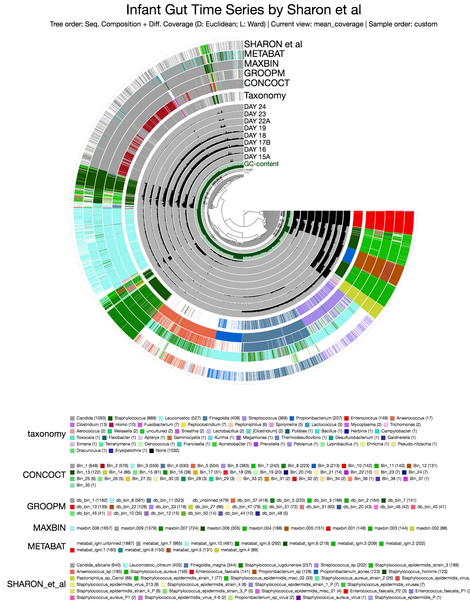
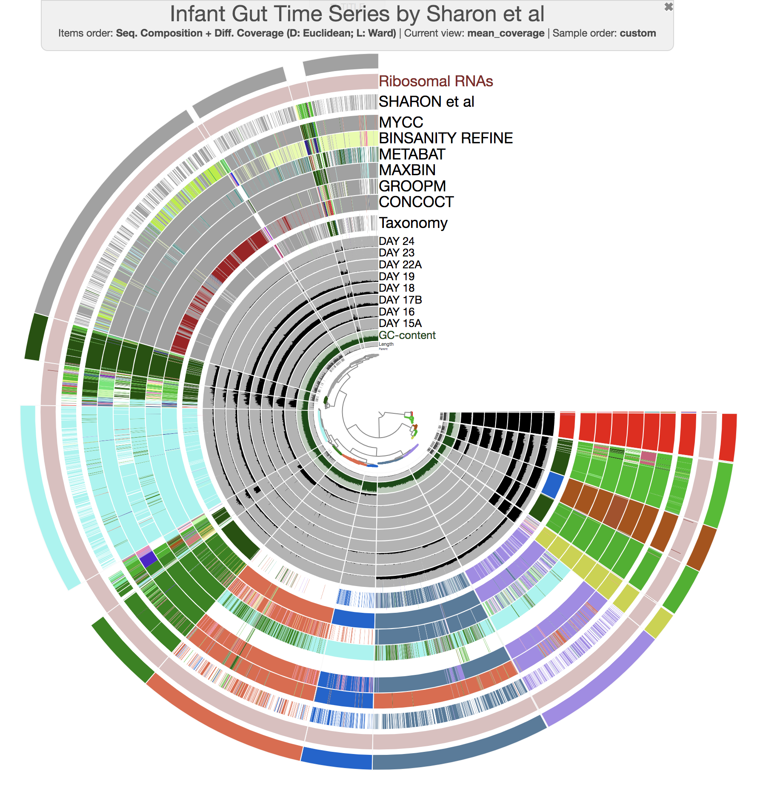
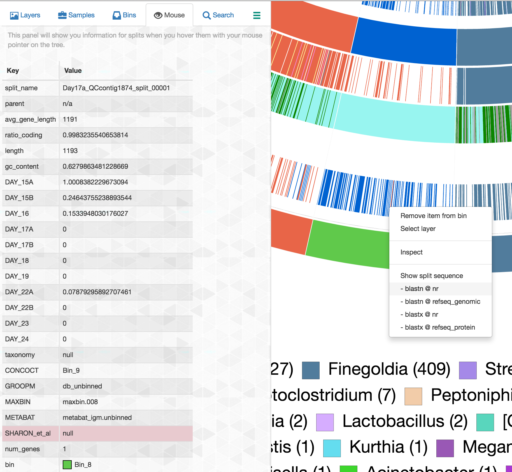
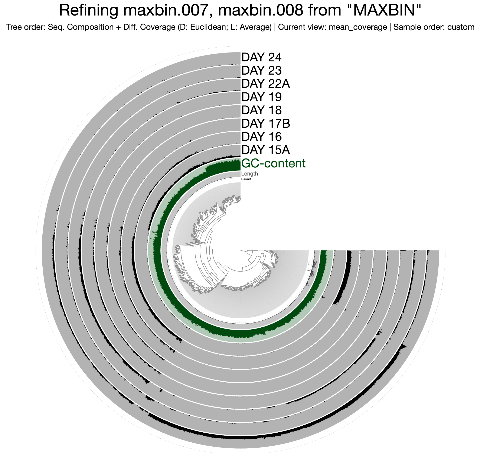
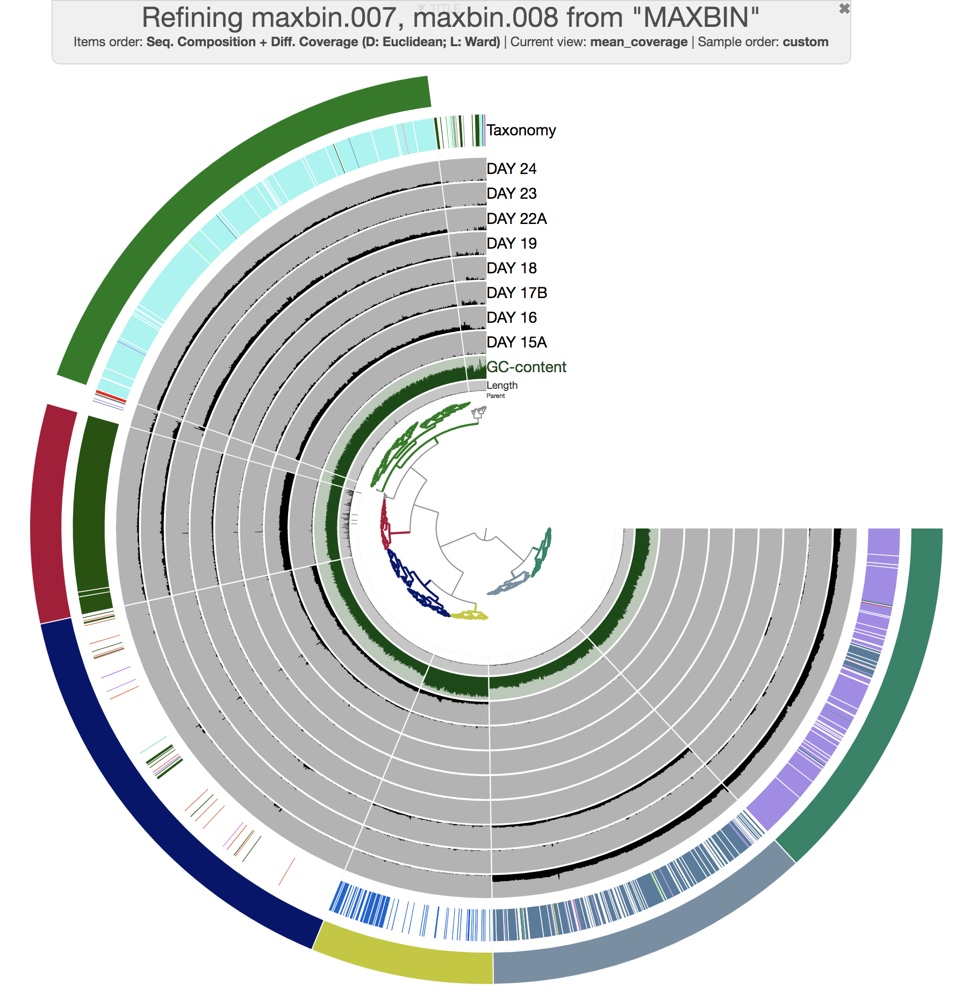
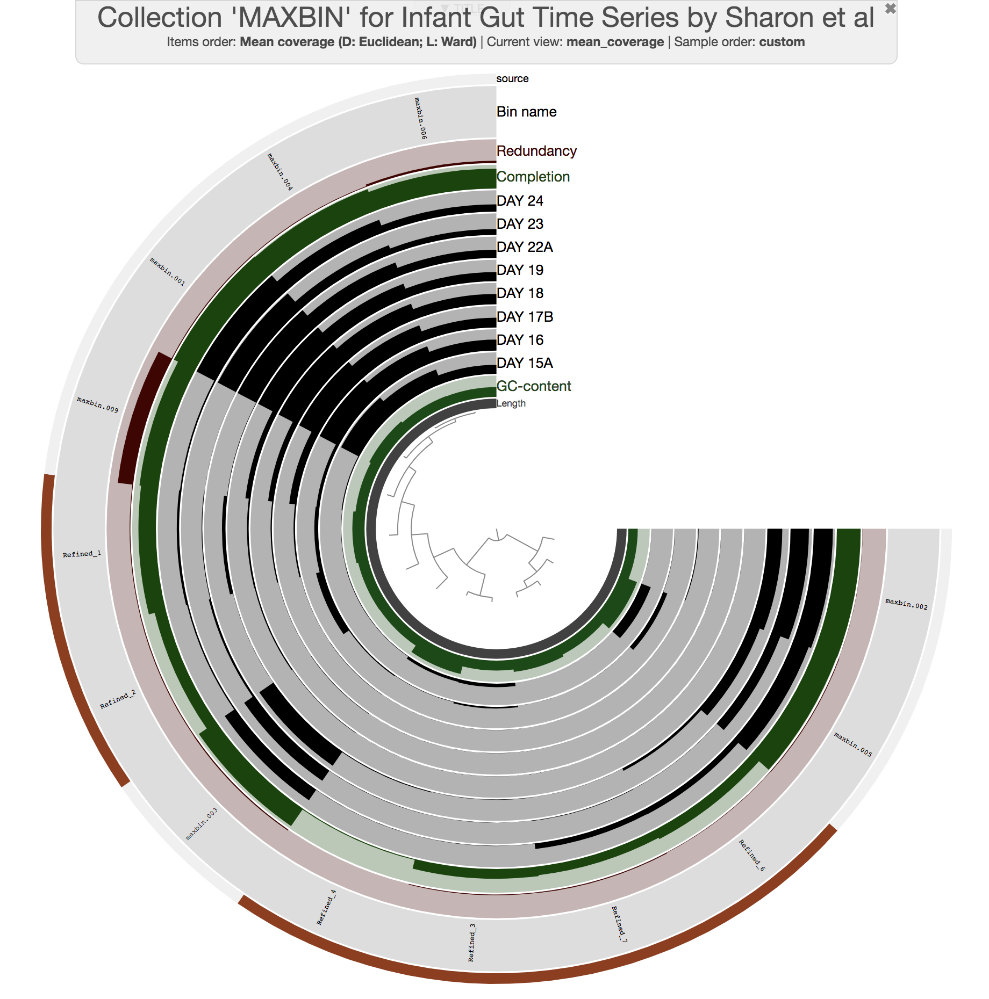

{:.notice}
This tutorial is tailored for anvi'o `v2.0.2` or later. You can learn the version of your installation by typing `anvi-interactive -v`. If you have an older version, some things will not work the way they should.

The purpose of this tutorial is to have a conversation about metagenomic binning (while demonstrating some of the anvi'o capabilities) using the Infant Gut Dataset (IGD), which was generated, analyzed, and published by [Sharon et al. (2013)](http://www.ncbi.nlm.nih.gov/pubmed/22936250), and was re-analyzed in the [anvi'o methods paper](https://peerj.com/articles/1319/).

{:.notice}
While this tutorial will take you through a simple analysis of a real dataset, there also is available a more comprehensive (but more abstract tutorial) on [anvi'o metagenomic workflow]().



A typical anvi'o metagenomic workflow [starts with BAM files and a FASTA file](#preparation) of contigs. There are many ways to get your contigs and BAM files for your metagenomes. But we have started implementing a tutorial that describes the workflow _we_ use to generate these files regularly: "[A tutorial on assembly-based metagenomics]({{ site.url }}/tutorials/assembly-based-metagenomics/)". Please feel free to take a look at that one, as well.

## The contigs database & anvi'o merged profile for the Infant Gut Dataset

If you are following this tutorial, you will need the anvi'o merged profile database and the anvi'o contigs database for the IGD. You can download them using this link: [https://figshare.com/articles/Infant_Gut_Data_v2/3502445](https://figshare.com/articles/Infant_Gut_Data_v2/3502445) (click the 'Download all', and unzip the resulting directory, and go into it using your terminal).

{:.notice}
Some crash course on anvi'o databases: An **anvi’o contigs database** keeps all the information related to your contigs: positions of open reading frames, k-mer frequencies for each contig, where splits start and end, functional and taxonomic annotation of genes, etc. The contigs database is an essential component of everything related to anvi’o metagenomic workflow. In contrast to the contigs database, an **anvi'o profile database** stores sample-specific information about contigs. Profiling a BAM file with anvi'o creates a single profile that reports properties for each contig in a single sample based on mapping results. Each profile database automatically links to a contigs database, and anvi’o can merge single profiles that link to the same contigs database into **anvi'o merged profile**s (which is what you have in this directory). If you would like to learn more about these, here are some direct links: [creating an anvi'o contigs database](#creating-an-anvio-contigs-database), [creating single anvi'o profiles](#profiling-bam-files), and [merging anvi'o profiles](#working-with-anvio-profiles)

While in that directory, run this command to unpack the additional files directory,


 $ tar -zxvf additional-files.tar.gz


### Taking a quick look at the merged profile

If you run the following command using `anvi-interactive`,


 $ anvi-interactive -p PROFILE.db -c CONTIGS.db 


The anvi'o interactive interface should pop up with this display:

{:.center-img .width-50}

Once the interactive interface is up and running, you can start binning:

{:.center-img .width-50}

When you are tired of the interactive interface, you can go back to the terminal and press `CTRL + C` to kill the server.

### Importing taxonomy

Centrifuge ([code](https://github.com/infphilo/centrifuge), [pre-print](http://biorxiv.org/content/early/2016/05/25/054965.article-info)) is [one of the options](#centrifuge-output) to [import taxonomic annotations]() into an anvi'o contigs database. Centrifuge files for the IGD are already in the directory `additional-files/centrifuge-files`.

If you import these files into the contigs database the following way,


 $ anvi-import-taxonomy -c CONTIGS.db -i additional-files/centrifuge-files/*.tsv -p centrifuge 


And run the interactive interface again,


 $ anvi-interactive -p PROFILE.db -c CONTIGS.db 


You will see an additional layer with taxonomy:

{:.notice}
In the Layers tab find the `Taxonomy` layer, set its height to `200`, and click `Draw` again. Then click `Save State` button, and overwrite the `default` state. This will make sure anvi'o remembers to make the height of that layer 200px the next time you run the interactive interface!

{:.center-img .width-50}

## Binning

### External binning results

The directory `additional-files/external-binning-results` contains a number of files that describe the binning of contigs in the IGD based on various binning approaches. These files are `CONCOCT.txt`, `GROOPM.txt`, `MAXBIN.txt`, `METABAT.txt`, `SHARON_et_al.txt`.

The first three files are courtesy of Elaina Graham, who used [GroopM](http://www.ncbi.nlm.nih.gov/pmc/articles/PMC4183954/) (v0.3.5), [MetaBat](https://peerj.com/articles/1165/) (v0.26.3), and [MaxBin](https://microbiomejournal.biomedcentral.com/articles/10.1186/2049-2618-2-26) (v2.1.1) to bin the IGD. For future references, here are the parameters Elaina used for each approach:


 # GroopM v0.3.5 (followed the general workflow on their manual)
 $ groopm parse groopm.db contigs.fa [list of bam files]
 $ groopm core groopm.db -c 1000 -s 10 -b 1000000
 $ groopm recruit groopm.db -c 500 -s 200
 $ groopm extract groopm.db contigs.fa 

 # MetaBat v0.26.3 (used jgi_summarize_bam_contig_depths to get a depth file from BAM files).
 $ metabat -i contigs.fa -a depth.txt -o bin

 # MaxBin v2.1.1
 $ run_MaxBin.pl -contig contigs.fa -out maxbin_IGM -abund_list [list of all coverage files in associated format]


[CONCOCT](http://www.nature.com/nmeth/journal/v11/n11/full/nmeth.3103.html) results come from the CONCOCT module embedded within anvi'o. 

Finally, I created a file corresponding to Sharon et al. results by BLAST-searching sequences in bins identified by the authors of the study (see [http://ggkbase.berkeley.edu/carrol](http://ggkbase.berkeley.edu/carrol)) to our contigs to have matching names for our assembly.

Now you have the background information about where these files are coming. Moving on.

### Importing an external binning result

In the anvi'o lingo, a 'collection' is something that describes one or more bins, each of which describe one or more contigs. You can create a collection by using the interactive interface, or you can import external binning results into your profile database as a collection and see how that collection groups contigs. For instance, let's import the CONCOCT collection:


 $ anvi-import-collection -c CONTIGS.db -p PROFILE.db -C CONCOCT --contigs-mode additional-files/external-binning-results/CONCOCT.txt


And run the interactive again,


 $ anvi-interactive -p PROFILE.db -c CONTIGS.db 


When you click `Bins > Load bin collection > CONCOCT > Load` once the interface is ready, this is what you will see:

{:.center-img .width-50}

So far so good.

### Comparing multiple binning approaches

Since we have all these results from different binning approaches, it clearly would have been interesting to compare them to each other (because [benchmarking stuff]() is often very insightful). But how to do it? The simplest way to do it is to assume a 'true organization of contigs', and then investigate every other approach with respect to that.

Here we have the organization of contigs based on hierarchical clustering analysis, taxonomy from Centrifuge per contig (which is independent of the organization of contigs so it is a very good validation to see whether the organization makes sense), and results from the original publication from Sharon et al., in which authors did a very careful job to identify every genome in the dataset, including resolving the *Staphylococcus* pangenome (which is extremely hard for automatic binning approaches to resolve with one co-assembly). So these are the things we will assume "true enough" to build upon.

To compare binning results, we could import each collection into the profile database the way we imported CONCOCT. But unfortunately at any given time there could only be one collection that can be displayed in the interface. Luckily there are other things we can do. For instance, as a workaround, we can merge all binning results into a single file, and use that file as an 'additional data file' to visualize them in the interactive interface.

Anvi'o has a script to merge multiple files for external binning results into a single merged file (don't ask why):


 $ anvi-script-merge-collections -c CONTIGS.db -i additional-files/external-binning-results/*.txt -o collections.tsv


If you take a look at this file, you will realize that it has a very simple format:


 $ head collections.tsv | column -t
contig                           CONCOCT  GROOPM     MAXBIN      METABAT               SHARON_et_al
Day17a_QCcontig1000_split_00001  Bin_4    db_bin_11  maxbin.008  metabat_igm.unbinned  Finegoldia_magna
Day17a_QCcontig1001_split_00001  Bin_7    db_bin_46  maxbin.006  metabat_igm.unbinned  Staphylococcus_epidermidis_virus_014
Day17a_QCcontig1002_split_00001  Bin_4    db_bin_11  maxbin.007  metabat_igm.unbinned  Finegoldia_magna
Day17a_QCcontig1003_split_00001  Bin_2    db_bin_1   maxbin.009  metabat_igm.7
Day17a_QCcontig1004_split_00001  Bin_3    db_bin_8   maxbin.008  metabat_igm.10
Day17a_QCcontig1005_split_00001  Bin_5    db_bin_47  maxbin.007  metabat_igm.unbinned  Staphylococcus_epidermidis_viruses
Day17a_QCcontig1006_split_00001  Bin_3    db_bin_8   maxbin.008  metabat_igm.10        Leuconostoc_citreum
Day17a_QCcontig1007_split_00001  Bin_3    db_bin_8   maxbin.008  metabat_igm.10
Day17a_QCcontig1008_split_00001  Bin_2    db_bin_1   maxbin.009  metabat_igm.7         Candida_albcans


Good. Now you can run the interactive interface to display all collections of bins stored in `collections.tsv` as 'additional layers':


 $ anvi-interactive -p PROFILE.db -c CONTIGS.db -A collections.tsv


At this point you should be seeing a display similar to this (after setting the height of each additional layer to 200px):

{:.center-img .width-50}

To emphasize relationships between bins visually. If you import it the following way, 


 $ anvi-import-state --state additional-files/state-files/state-merged.json --name default -p PROFILE.db


and run the interactive interface again,


 $ anvi-interactive -p PROFILE.db -c CONTIGS.db -A collections.tsv -Y genus


this time you should get this display:

{:.center-img .width-50}

So far so good?

Let's also import the collection we published in the [anvi'o methods paper](https://peerj.com/articles/1319/) with the proper colors:


 $ anvi-import-collection additional-files/previous-binning-results/merens.txt \
                          -p PROFILE.db \
                          -c CONTIGS.db \
                          -C merens \
                          --bins-info additional-files/previous-binning-results/merens-info.txt


Now you can rerun the interactive interface, and click `Bins > Load bin collection > merens > Load` to display our collection in comparison:

{:.center-img .width-50}

Much better!

Now we can discuss about the efficacy of different approaches.

As a reminder, you can in fact investigate the taxonomy of contigs by BLASTing them against NCBI's collection using the right-click menu to have a second opinion about what do public databases think they are:

{:.center-img .width-50}

### Refining automatically identified bins

OK. Let's assume, we didn't see the interactive interface, and we have no idea about the dataset. We didn't do any of the things we did up to this point. We just had profiled and merged the IGD, and we did binning of this dataset using MaxBin. Let's start by importing MaxBin results into the profile database as a collection:


 $ anvi-import-collection additional-files/external-binning-results/MAXBIN.txt\
                          -c CONTIGS.db -p PROFILE.db -C MAXBIN --contigs-mode
 					


From here, there are two things we can do very quickly. First, we can create a summary of our new collection (which would generate a comprehensive static output for all the bins that are identified):


 $ anvi-summarize -c CONTIGS.db -p PROFILE.db -C MAXBIN -o MAXBIN-SuMMARY


{:.notice}
You can learn more about `anvi-summarize` [here](#anvi-summarize).

Second, we can take a very quick look at the binning results by initiating the interactive interface in the `collection` mode:


 $ anvi-interactive -p PROFILE.db -c CONTIGS.db -C MAXBIN


This command should give you a display similar to this:

{:.center-img .width-50}

All previous interactive displays were at the contig-level. However, this display is at the *bin-level*. Instead of contigs, this display shows us the distribution of *bins* MaxBin identified. We also have completion and redundancy estimates for each bin, which helps us make some early sense of what is going on.

{:.notice}
Please read this post to learn more about completion and redundancy estimates: [Assessing completion and contamination of metagenome-assembled genomes]()

It is clear that some bins are not as well-resolved as others. For instance, bins `maxbin.007` and `maxbin.008` have redundancy estimates of 90% and 59%, respectively, which suggests each of them describe multiple groups of organisms.

{:.notice}
"Why not `maxbin.009`, Meren?". Yes, I am cheating. But for a good reason. Does anyone have any idea what that reason might be? Hint: what are bacterial single-copy core genes not good for?

Well, clearly we would have preferred those bins to *behave*.

Luckily anvi'o allows the refinement of bins. So in fact you can focus only those two bins, and refine them using the interactive interface. First we need to crete a file with bin names we are interested in to refine:


 $ python -c 'print("maxbin.007\nmaxbin.008")' > maxbin-bins-to-refine.txt
 $ cat maxbin-bins-to-refine
maxbin.007
maxbin.008


{:.notice}
Normally we can give a bin name to `anvi-refine` using the `-b` parameter. But since we are interested in more than one bin name, `-B` parameter with a file with names is the right way to go with.

Good. Now we can call `anvi-refine`:


 $ anvi-refine -p PROFILE.db -c CONTIGS.db -C MAXBIN -B maxbin-bins-to-refine


Which would give us this:

{:.center-img .width-50}

Here we see the distribution of each contig originally binned into `maxbin.007` and `maxbin.008` across samples. The hierarchical clustering did pick up some trends, and you can see there are more than two clusters you can identify somewhat easily. Here I made some selections:

{:.center-img .width-50}

Once you are satisfied, you can store new selections to the database from the `Bins` tab, and kill the server once you see the confirmation on the top-right part of the window.

If you run the interactive interface for the collection `MAXBIN` again,:


 $ anvi-interactive -p PROFILE.db -c CONTIGS.db -C MAXBIN 


things will look much better:

{:.center-img .width-50}

As you can see, even if the initial results from an automatic binning approach contain poorly identified bins, it is possible to improve the final results through refinement steps.

{:.notice}
You can read more about `anvi-refine` [here]().

Thank you for following the tutorial this far!

## Meren's two cents on binning

Binning is inherently a very challenging task.

In most cases it is absolutely doable, especially when there is a decent assembly, but it *is* very challenging.

The IGD is one of the most friendly metagenomic datasets available to play with (since an astonishing fraction of nucleotides map back to the assembly), and it comes from a well-implemented experimental design (because that's what [Banfield group]((http://geomicrobiology.berkeley.edu/)) does). Yet, you now have seen the extent of disagreement between multiple binning approaches even for this dataset.

You should reming yourself that each of these approaches are implemented by people who are well-trained scientists working with groups of people who are experts in their fields. These tools are benchmarked against others and showed improvements. So each one of them provides the *best result* compared to all others in *at least* one metagenomic dataset. I think understanding what this means is important. There is no silver bullet in the common bioinformatics toolkit that will take care of every dataset when you fire it. In fact, depending on the dataset, even the best tools we managed to come up with with every definition of the word may look like sticks and stones against the Death Star. Computational people are working very hard to improve things, but they would be the first ones to suggest that their tools should never make users feel free from the fact that it is their own responsibility to make sure the results are meaningful and appropriate.

So which one to choose? How to get out of this situation easily and move on? I know how much desire there is to outsource everything we do to fully automated computational solutions. I also acknowledge that the ability to do that is important to perform large-scale and reproducible analyses without going through too much pain. But we are not at a stage yet with metagenomics where you can rely on any of the available automated binning tools, and expect your MAGs to be safe and sound.

For instance, I think CONCOCT is doing a pretty awesome job identifying MAGs in the IGD, even with the low-abundance organisms. However, it is not perfect, either. In fact if you look carefully, you can see that it creates two bins for one *Candida albicans* genome. Hierarchical clustering will always get you closest to the best organization of contigs with simple distance metrics and linkage algorithms. But there are major challenges associated with that approach, including the fact that it is simply an exploratory method and can't give you "bins" out-of-the-box. Even more importantly, it has tremendous limitations come from its computational complexity (~*O*(*m*2 log *m*), where *m* is the number of data points). So in most cases it is not even a remote possibility to organize contigs using a hierarchical clustering approach in an assembly in reasonable amount of time (and there is no way to visualize that even if you were to get a dendrogram for 200,000 contigs (you can create simple 2D ordinations with that number of items, but you really shouldn't, but that's another discussion)). Except assemblies with rather smaller number of contigs like the IGD, we are always going to use automated ways to identify bins, at least *initially*, knowing that resulting bins may be, and in most cases will be, crappy. That's why in anvi'o we implemented ways to quickly look into automatically identified bins (i.e., the `collection` mode of `anvi-interactive`), and even refine those with poor redundancy scores to improve final results (i.e., `anvi-refine`).

So we can fix crappy bins to an extent since [we know more or less how things should look like](), and [we have tools to do that](). That being said, there is one more consideration that is very easy to miss. Although it is somewhat possible to recover from bins that are heavily contaminated through refinement of a single bin, it is much harder to recover from the situation where parts of a single genome is described in multiple bins. You can see examples of this case if you take a careful look from this figure (i.e., CONCOCT bins between 9:30 and 12:00 o'clock, or MaxBin bins between 5:00 and 7:00 o'clock):

{:.center-img .width-50}

This is a problem that likely happens quite often, and very hard to deal with once the bins are identified. But we can even recover from that.

#### A Meren Lab Heuristic

One of the heuristics we recently started using in our lab to avoid over-split bins is to confine CONCOCT's clustering space to a much smaller number of clusters than the expected number of bacterial genomes in a given dataset, and then curate resulting contaminated bins manually. Let's say we expect to find `n` bacterial genomes, so we run CONCOCT with a maximum number of clusters of about `n/2` (no judging! I told you it was a heuristic!).

<blockquote>
Well, how do you even know how many bacterial genomes you should expect to find in a metagenome?

You

</blockquote>

Thanks for the great question. Although this may sound like a challenging problem to some, we have a very simple way to resolve it (which I described in this [blog post]()). If you still have access to the IGD, you can run these commands,


 $ anvi-script-gen_stats_for_single_copy_genes.py CONTIGS.db
 $ anvi-script-gen_stats_for_single_copy_genes.R CONTIGS.db.hits CONTIGS.db.genes


to get an output PDF file, `contigs.db.hits_e_1_new.pdf`, which would indicate that one should expect 8 to 10 near-complete genomes in this dataset.

Fine. Using `anvi-cluster-with-concoct` program, we ask CONCOCT to naively identify 5 clusters in this dataset, and store the results in the profile database as a collection:


 $ anvi-cluster-with-concoct -p PROFILE.db -c CONTIGS.db --num-clusters 5 -C CONCOCT_C5


Now you can run the interface again,


 $ anvi-interactive -p PROFILE.db -c CONTIGS.db --title 'Infant Gut Time Series by Sharon et al. [w/ 5 CONCOCT clusters]'


and you would see this after loading the new `CONCOCT_C5` collection from the `Bins` tab:

{:.center-img .width-50}

As you can see, there aren't any over-split bins, and in fact CONCOCT did an amazing job to identify general patterns in the dataset. Now refining these bins would be much more easier. If you would like to try, here is an example:


 $ anvi-refine -p PROFILE.db -c CONTIGS.db -C CONCOCT_C5 -b Bin_1


---

There are more ways to improve bins and binning results. But although we have seen major improvements in our research by exploring these directions, there are also many other cases nothing is quite enough.

Then it is time to increase the depth of sequencing, implement a different assembly strategy, rethink the sampling strategy, or change the experimental approach to do what seems to be undoable. Here is an example from Tom Delmont et al. to that last point with soil metagenomics: [doi:10.3389/fmicb.2015.00358](http://dx.doi.org/10.3389/fmicb.2015.00358).

We all just have to continue working, and enjoy this revolution.

## Pangenomic analysis of _E. facealis_ bin

{:.notice}
STOP here. You don't have the necessary files to go through this, but you will have them very soon!

Using anvi'o we could easily do a pangenomic analysis. To demonstrate the pangenomic workflow, I downloaded 6 *E. facealis*, and 5 *E. faecium* genomes into the folder `05_PANGENOMICS`, to analyze them together with our *E. facealis* bin.

{:.notice}
You can find a comprehensive tutorial on the anvi'o pangenomic workflow [here]().

There is one thing for ECOGEO people to fix first:


 $ cd ../05_PANGENOMICS/
 $ sed -i 's/03_ANVIO_MERGED_PROFILE/01_ANVIO_MERGED_PROFILE/g' internal-genomes.txt


Then you can run `anvi-pan-genome` program the following way:


 $ anvi-pan-genome -i internal-genomes.txt -e external-genomes.txt -o enterococcus_pan_genome -T 4


This will generate many output files in the output directory, including a sub-directory that contains all the files to run the anvi'o interactive interface to visualize results. You can initiate the interactive interface the following way,


 $ cd enterococcus_pan_genome/enterococcus_pan_genome/
 $ anvi-interactive -t tree.txt -d view_data.txt -s samples.db -A additional_view_data.txt --manual -p profile.db --title "Enterococcus Pan"


To get this ugly looking display:

{:.center-img .width-50}

I did it prettier for you. If you kill the server, and import the state file the following way, and re-run the server,


 $ wget http://merenlab.org/tutorials/infant-gut/files/pan-state.json 
 $ anvi-import-state -p profile.db --state pan-state.json --name default
 $ anvi-interactive -t tree.txt -d view_data.txt -s samples.db -A additional_view_data.txt --manual -p profile.db --title "Enterococcus Pan"


It will look much more reasonable:

{:.center-img .width-50}

Now not only we can see how our E. facealis genome to what is available, we can also see that it is not missing or carrying a great number of proteins compared to other genomes. The clustering of genomes based on protein clusters indicate that it is most similar to the genome `Enterococcus faecalis 6250`, which, according to the `00_INFO_ABOUT_EXTERNAL_GENOMES.txt` under `05_PANGENOMICS` directory, corresponds to the assembly ID [ASM28119v1](https://www.ncbi.nlm.nih.gov/gquery/?term=ASM28119v1) if you were to be interested in exploring further.

