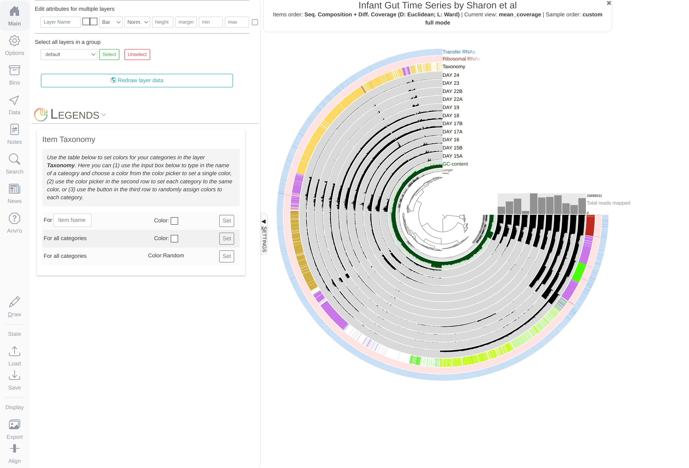

{:.notice}
This tutorial is tailored for anvi'o `v2.0.1`. If you do not have this version available to you, certain things may not work the way they should.

The purpose of this tutorial is to demonstrate some of the anvi'o capabilities using the Infant Gut dataset, which was originally analyzed and published by [Sharon et al. (2013)](http://www.ncbi.nlm.nih.gov/pubmed/22936250), and was re-analyzed in the [anvi'o methods paper](https://peerj.com/articles/1319/).

You can access to a more general and comprehensive (yet more abstract) tutorial on the metagenomics workflow of anvi'o by clicking [here]().

If you are on this page you probably have access to the infant gut data pack. If not, please let me know.

## Files and Directories in the Infant Gut Data Pack

The data pack contains some raw and intermediate metagenomic data from the infant gut dataset to play with using anvi'o throughout this tutorial. Following subsections will provide brief descriptions of the contents of each directory.

### 00_BAM_FILES_AND_CONTIGS

{:.notice}
You may be missing this directory in your data pack due to storage space or considerations.

This directory contains the the co-assembly of the time series data, `contigs.fa`, and an indexed BAM file for each sampling day. These BAM files were generated by mapping metagenomic short reads from each sample to `contigs.fa`.

The tutorial we have started implementing, "[A tutorial on assembly-based metagenomics]({{ site.url }}/tutorials/assembly-based-metagenomics/)", describes the details of the workflow we use to generate these files regularly.

### 01_ANVIO_MERGED_PROFILE

This directory contains the anvi'o contigs database that is generated from `00_BAM_FILES_AND_CONTIGS/contigs.fa`, and the merged anvi'o profile database, which is generated by merging individual anvi'o profiles for each of the BAM file in `00_BAM_FILES_AND_CONTIG`.

If you go into that directory,


 $ cd 01_ANVIO_MERGED_PROFILE/


and execute the `anvi-interactive` command on these files,


 $ anvi-interactive -p PROFILE.db -c CONTIGS.db 


{:.center-img .width-50}

When you are tired of the interactive interface, you can go back to the terminal and press `CTRL + C` to kill the server.

### 02_CENTRIFUGE_FILES

This directory contains output files from [centrifuge](https://github.com/infphilo/centrifuge).

Centrifuge is [one of the options](#centrifuge-output) to [import taxonomic annotations]() into an anvi'o contigs database.

If you import these files into the contigs database,


 $ anvi-import-taxonomy -c CONTIGS.db -i ../02_CENTRIFUGE_FILES/*.tsv -p centrifuge 


And run the interactive again,


 $ anvi-interactive -p PROFILE.db -c CONTIGS.db 


You will see an additional layer with taxonomy:

{:.notice}
In the Layers tab find the `Taxonomy` layer, set its height to `200`, and click `Draw` again. Then click `Save State` button, and overwrite the `default` state. This will make sure anvi'o remembers to make the height of that layer 200px the next time you run the interactive interface!

{:.center-img .width-50}

### 03_EXTERNAL_BINNING_RESULTS

This directory contains files from various binning software:

* [GROOPM.txt](files/GROOPM.txt)
* [METABAT.txt](files/METABAT.txt)
* [MAXBIN.txt](files/MAXBIN.txt)
* [CONCOCT.txt](files/CONCOCT.txt)
* [SHARON_et_al.txt](files/SHARON_et_al.txt)

The first three files are courtesy of Elaina Graham, who generated them using GroopM (v0.3.5), MetaBat (v0.26.3), and MaxBin (v2.1.1) using the BAM files and the FASTA file for contigs in `01_ANVIO_MERGED_PROFILE`. CONCOCT results come from the CONCOCT module embedded within anvi'o, and Sharon et al. results was generated by BLAST searching bins identified by the authors of the study [http://ggkbase.berkeley.edu/carrol](http://ggkbase.berkeley.edu/carrol) to our FASTA files of contigs.

You can import any of these files into your profile database, and see how they group contigs. For instance, let's import CONCOCT results:


 $ anvi-import-collection -c CONTIGS.db -p PROFILE.db -C CONCOCT --contigs-mode ../03_EXTERNAL_BINNING_RESULTS/CONCOCT.txt


And run the interactive again,


 $ anvi-interactive -p PROFILE.db -c CONTIGS.db 


Once the display is ready, click `Bins > Load bin collection > CONCOCT > Load`.

{:.center-img .width-50}

So far so good. But it would definitely be interesting to compare all the binning results. For this, we could import each external binning result into the profile database the way we imported CONCOCT. The problem is that at any given time there could only be one bin collection can be displayed in the interface. As a workaround, we will merge all binning results into a single file, and use it as an 'additional data file'.

I implemented a little program, [`anvi-script-merge-collections`](files/anvi-script-merge-collections), to merge multiple collections into a single TAB-delimited file. If you download it,


 $ wget http://merenlab.org/tutorials/infant-gut/files/anvi-script-merge-collections


And run it the following way,


 $ python anvi-script-merge-collections -c CONTIGS.db -i ../03_EXTERNAL_BINNING_RESULTS/*.txt -o collections.tsv


You can run the interactive interface to display all collections of bins as additional layers,


 $ anvi-interactive -p PROFILE.db -c CONTIGS.db -A collections.tsv


And you would get a display similar to this (after setting the height of each additional layer to 200px):

{:.center-img .width-50}

To make thinks a little more visually related, I created an anvi'o states file, `states.json`, and wrote a program, `anvi-import-state`, to import it into your profile database. If you download these files and run them the following way, 


 $ wget http://merenlab.org/tutorials/infant-gut/files/anvi-import-state
 $ wget http://merenlab.org/tutorials/infant-gut/files/state.json
 $ python anvi-import-state --state state.json --name default -p PROFILE.db


And run the interactive interface again,


 $ anvi-interactive -p PROFILE.db -c CONTIGS.db -A collections.tsv


This time you will get this display:

{:.center-img .width-50}

Let's also import the collection we published in the [anvi'o methods paper](https://peerj.com/articles/1319/) with the proper colors:


 $ wget http://merenlab.org/tutorials/infant-gut/files/merens.txt
 $ wget http://merenlab.org/tutorials/infant-gut/files/merens-info.txt
 $ anvi-import-collection merens.txt -p PROFILE.db -c CONTIGS.db -C merens --bins-info merens-info.txt


Now you can rerun the interactive interface, and click `Bins > Load bin collection > merens > Load` to display our collection in comparison:

{:.center-img .width-50}

Much better! Now we can discuss about the efficacy of different approaches, and investigate the taxonomy of contigs where methods disagree:

{:.center-img .width-50}

### 04_VARIABILITY_ANALYSIS

### 05_PANGENOMICS