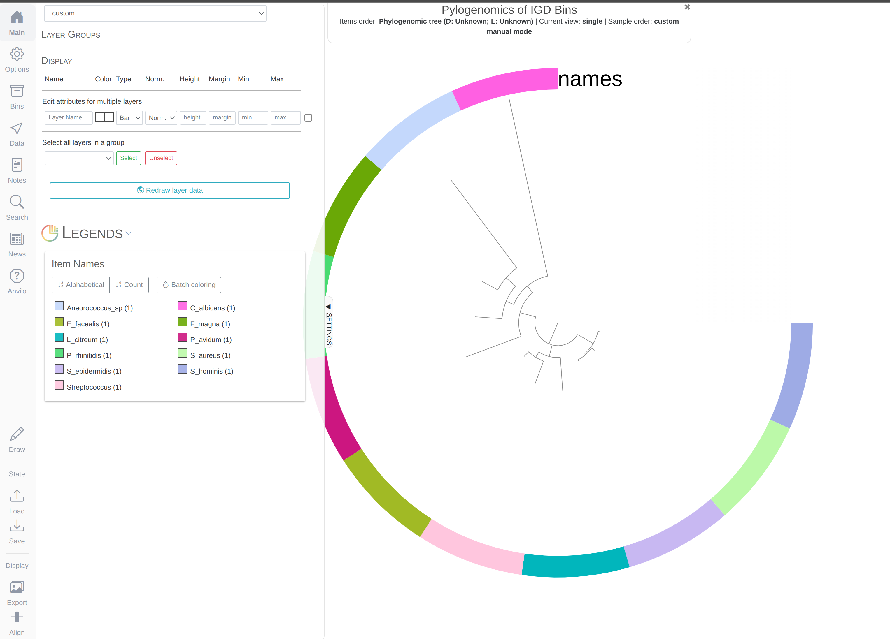
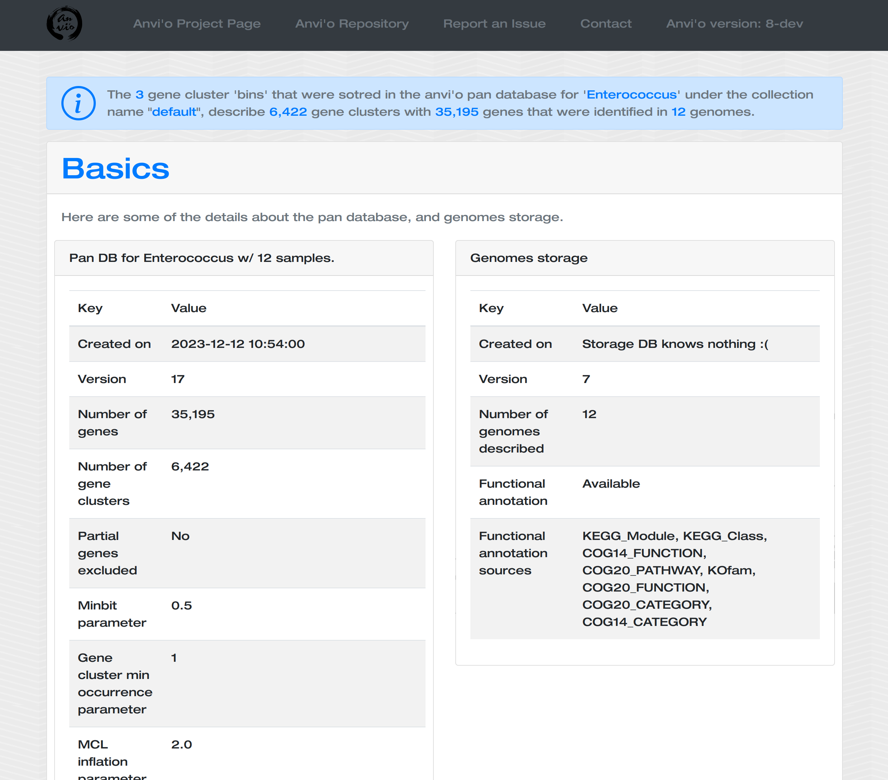

{:.notice}
This tutorial is tailored for anvi'o `v3` or later. You can learn the version of your installation by typing `anvi-interactive -v`. If you have an older version, some things will not work the way they should.

The purpose of this tutorial is to have a conversation about metagenomic binning (while demonstrating some of the anvi'o capabilities) using the Infant Gut Dataset (IGD), which was generated, analyzed, and published by [Sharon et al. (2013)](http://www.ncbi.nlm.nih.gov/pubmed/22936250){:target="_blank"}, and was re-analyzed in the [anvi'o methods paper](https://peerj.com/articles/1319/){:target="_blank"}.

{:.notice}
While this tutorial will take you through a simple analysis of a real dataset, there also is available a more comprehensive (but more abstract) tutorial on [anvi'o metagenomic workflow](){:target="_blank"}.



A typical anvi'o metagenomic workflow [starts with BAM files and a FASTA file](#preparation){:target="_blank"} of contigs. There are many ways to get your contigs and BAM files for your metagenomes and we have started implementing a tutorial that describes the workflow _we_ regularly use to generate these files: "[A tutorial on assembly-based metagenomics]({{ site.url }}/tutorials/assembly-based-metagenomics/){:target="_blank"}". The following tutorial jumps in from a point in the workflow when you have used your BAM and FASTA files to generate anvi'o contigs and profile databases.

## Downloading the pre-packaged Infant Gut Dataset

If you are following this tutorial, you will need the anvi'o merged profile database and the anvi'o contigs database for the IGD. You can download them using this link: [https://ndownloader.figshare.com/files/9545176](https://ndownloader.figshare.com/files/9545176).

When you click the link, it will start downloading a **132 Mb** compressed file automatically. Once it is done, go to the relevant directory that contains this file using your terminal, and unpack it the following way:

``` bash
 $ tar -zxvf INFANTGUTTUTORIAL.tar.gz && cd INFANT-GUT-TUTORIAL
```

{:.notice}
If you were sent here somewhere from down below, now you can **go back**. If you have no idea what this means, ignore this notice, and continue reading. You're OK :)

<div class="extra-info" markdown="1">

<span class="extra-info-header">A crash course on *some* anvi'o databases...</span>

An **anvi’o contigs database** keeps all the information related to your contigs: positions of open reading frames, k-mer frequencies for each contig, where splits start and end, functional and taxonomic annotation of genes, etc. The contigs database is an essential component of everything related to anvi’o metagenomic workflow.

In contrast to the contigs database, an **anvi'o profile database** stores sample-specific information about contigs. Profiling a BAM file with anvi'o creates a single profile that reports properties for each contig in a single sample based on mapping results. Each profile database automatically links to a contigs database, and anvi’o can merge single profiles that link to the same contigs database into **anvi'o merged profile**s (which is what you have in this directory).

If you're asking yourself, "How do I generate profile and contigs databases for my own data?", or would like to learn more, here are some direct links:

* [Creating an anvi'o contigs database](#creating-an-anvio-contigs-database){:target="_blank"}
* [Creating an anvi'o profile database](#profiling-bam-files){:target="_blank"}
* [Merging anvi'o profile databases](#working-with-anvio-profiles){:target="_blank"}
</div>


### Taking a quick look at the merged profile

If you run the following command using `anvi-interactive`,

``` bash
 $ anvi-interactive -p PROFILE.db -c CONTIGS.db 
```

The anvi'o interactive interface should pop up with this display:

[](images/infant-gut-merged.png){:.center-img .width-50}

Once the interactive interface is up and running, you can start binning:

[](images/infant-gut-merged.gif){:.center-img .width-50}

Make contig selections by hovering your mouse over the tree in the center of the anvi'o figure. To add the highlighted selection to your current bin, left click. To remove the highlighted selection from your current bin, right click. To create a new bin, click "New bin" under the `Bins` tab in `Settings`. To change to a different bin, click the blue dot next to the bin name you're interested in. We'll talk more about saving bin "collections" soon.

When you are tired of the interactive interface, you can go back to the terminal and press `CTRL + C` to kill the server.

### Importing taxonomy

Centrifuge ([code](https://github.com/infphilo/centrifuge){:target="_blank"}, [pre-print](http://biorxiv.org/content/early/2016/05/25/054965.article-info){:target="_blank"}) is [one of the options](#centrifuge-output){:target="_blank"} to [import taxonomic annotations](){:target="_blank"} into an anvi'o contigs database. Centrifuge files for the IGD are already in the directory `additional-files/centrifuge-files`.

If you import these files into the contigs database the following way,

``` bash
 $ anvi-import-taxonomy -c CONTIGS.db -i additional-files/centrifuge-files/centrifuge_report.tsv additional-files/centrifuge-files/centrifuge_hits.tsv -p centrifuge 
```

And run the interactive interface again,

``` bash
 $ anvi-interactive -p PROFILE.db -c CONTIGS.db 
```

You will see an additional layer with taxonomy:

{:.notice}
In the Layers tab find the `Taxonomy` layer, set its height to `200`, and click `Draw` again. Then click `Save State` button, and overwrite the `default` state. This will make sure anvi'o remembers to make the height of that layer 200px the next time you run the interactive interface!

[](images/infant-gut-with-tax.png){:.center-img .width-50}


## Binning

In this section we will compare multiple binning approaches and see how they perform on the same dataset.

### External binning results

The directory `additional-files/external-binning-results` contains a number of files that describe the binning of contigs in the IGD based on various binning approaches. These files are `GROOPM.txt`, `MAXBIN.txt`, `METABAT.txt`, `BINSANITY_REFINE.txt`, `MYCC.txt`, `CONCOCT.txt`, and `SHARON_et_al.txt`. We also have a file under the directory `additional-files/collections/` that represents the binning results of this dataset we published in [the anvi'o paper](https://peerj.com/articles/1319/){:target="_blank"}. We'll get to all of these.

The first five files are courtesy of **Elaina Graham**, who used [GroopM](http://www.ncbi.nlm.nih.gov/pmc/articles/PMC4183954/){:target="_blank"} (v0.3.5), [MetaBat](https://peerj.com/articles/1165/){:target="_blank"} (v0.26.3), [MaxBin](https://microbiomejournal.biomedcentral.com/articles/10.1186/2049-2618-2-26){:target="_blank"} (v2.1.1), [MyCC](https://sourceforge.net/projects/sb2nhri/files/MyCC/){:target="_blank"}, and [BinSanity](http://biorxiv.org/content/early/2016/08/16/069567){:target="_blank"} (v0.2.1) to bin the IGD. For future references, here are the parameters Elaina used for each approach:

``` bash
 # GroopM v0.3.5 (followed the general workflow on their manual)
 $ groopm parse groopm.db contigs.fa [list of bam files]
 $ groopm core groopm.db -c 1000 -s 10 -b 1000000
 $ groopm recruit groopm.db -c 500 -s 200
 $ groopm extract groopm.db contigs.fa 

 # MetaBat v0.26.3 (used jgi_summarize_bam_contig_depths to get a depth file from BAM files).
 $ metabat -i contigs.fa -a depth.txt -o bin

 # MaxBin v2.1.1
 $ run_MaxBin.pl -contig contigs.fa -out maxbin_IGM -abund_list [list of all coverage files in associated format]

# MyCC (ran via the docker image available here: https://sourceforge.net/projects/sb2nhri/files/MyCC/)
(used jgi_summarize_bam_contig_depths to get depth file from BAM files per the authors suggestion)
MyCC.py contigs.fa 4mer -a depth.txt

# BinSanity + refinement v0.2.1
Binsanity -f . -l contigs.fa -p -10 -c igm.coverage.lognorm

## After bin inspection using CheckM & Anvi'o, INFANT-GUT-ASSEMBLY-bin_18
## was refined using the following parameters
Binsanity-refine -f . -l -p -150 -c igm.coverage.lognorm
```

[CONCOCT](http://www.nature.com/nmeth/journal/v11/n11/full/nmeth.3103.html){:target="_blank"} results come from the CONCOCT module embedded within anvi'o.

Finally, I created a file corresponding to Sharon et al. results by BLAST-searching sequences in bins identified by the authors of the study (see [http://ggkbase.berkeley.edu/carrol](http://ggkbase.berkeley.edu/carrol){:target="_blank"}) to our contigs to have matching names for our assembly.

Now you have the background information about where these files are coming. Moving on.


### Importing an external binning result

In the anvi'o *lingo*, a 'collection' is something that describes one or more bins, each of which describe one or more contigs. You can create a collection by using the interactive interface, or you can import external binning results into your profile database as a collection and see how that collection groups contigs. For instance, let's import the CONCOCT collection:

``` bash
 $ anvi-import-collection -c CONTIGS.db \
                          -p PROFILE.db \
                          -C CONCOCT \
                          --contigs-mode \
                          additional-files/external-binning-results/CONCOCT.txt
```

And run the interactive again with that collection name:

``` bash
 $ anvi-interactive -p PROFILE.db -c CONTIGS.db --collection-autoload CONCOCT
```

{:.notice}
Alternatively you could load the interface without the `--collection-autoload ` flag, and click `Bins > Load bin collection > CONCOCT > Load` to load the CONCOCT collection.

To turn off text annotation, go to `Main > Display > Additional Settings > Selections` and then uncheck `Show names`. You will then see something like this:

[](images/infant-gut-concoct.png){:.center-img .width-50}

So this is how you load and display a collection. So far so good.

### Comparing multiple binning approaches

Since we have all these results from different binning approaches, it clearly would have been interesting to compare them to each other (because [benchmarking stuff](){:target="_blank"} is often very insightful). But how to do it? The simplest way to do it is to assume a 'true organization of contigs', and then investigate every other approach with respect to that.

Here we have the organization of contigs based on hierarchical clustering analysis, taxonomy from Centrifuge per contig (which is independent of the organization of contigs so it is a very good validation to see whether the organization makes sense), and results from the original publication from Sharon et al., in which authors did a very careful job to identify every genome in the dataset, including resolving the *Staphylococcus* pangenome (which is extremely hard for automatic binning approaches to resolve with one co-assembly). So these are the things we will assume "true enough" to build upon.

To compare binning results, we could import each collection into the profile database the way we imported CONCOCT. But unfortunately at any given time there could only be one collection that can be displayed in the interface. Luckily there are other things we can do. For instance, as a workaround, we can merge all binning results into a single file, and use that file as an 'additional data file' to visualize them in the interactive interface.

Anvi'o has a script to merge multiple files for external binning results into a single merged file (don't ask why):

``` bash
 $ anvi-script-merge-collections -c CONTIGS.db \
                                 -i additional-files/external-binning-results/*.txt \
                                 -o collections.tsv
```

If you take a look at this file, you will realize that it has a very simple format:

``` bash
 $ head collections.tsv | column -t
contig                           BINSANITY_REFINE                CONCOCT  GROOPM     MAXBIN      METABAT               MYCC              SHARON_et_al
Day17a_QCcontig1000_split_00001  INFANT-GUT-ASSEMBLY-bin_19.fna  Bin_4    db_bin_11  maxbin.008  metabat_igm.unbinned  Cluster.5.fasta   Finegoldia_magna
Day17a_QCcontig1001_split_00001  INFANT-GUT-ASSEMBLY-bin_6.fna   Bin_7    db_bin_46  maxbin.006  metabat_igm.unbinned  Cluster.3.fasta   Staphylococcus_epidermidis_virus_014
Day17a_QCcontig1002_split_00001  INFANT-GUT-ASSEMBLY-bin_19.fna  Bin_4    db_bin_11  maxbin.007  metabat_igm.unbinned  Cluster.5.fasta   Finegoldia_magna
Day17a_QCcontig1003_split_00001  INFANT-GUT-ASSEMBLY-bin_14.fna  Bin_2    db_bin_1   maxbin.009  metabat_igm.7         Cluster.12.fasta
Day17a_QCcontig1004_split_00001  INFANT-GUT-ASSEMBLY-bin_16.fna  Bin_3    db_bin_8   maxbin.008  metabat_igm.10        Cluster.14.fasta
Day17a_QCcontig1005_split_00001  INFANT-GUT-ASSEMBLY-bin_13.fna  Bin_5    db_bin_47  maxbin.007  metabat_igm.unbinned  Cluster.3.fasta   Staphylococcus_epidermidis_viruses
Day17a_QCcontig1006_split_00001  INFANT-GUT-ASSEMBLY-bin_16.fna  Bin_3    db_bin_8   maxbin.008  metabat_igm.10        Cluster.14.fasta  Leuconostoc_citreum
Day17a_QCcontig1007_split_00001  INFANT-GUT-ASSEMBLY-bin_16.fna  Bin_3    db_bin_8   maxbin.008  metabat_igm.10        Cluster.14.fasta
Day17a_QCcontig1008_split_00001  INFANT-GUT-ASSEMBLY-bin_14.fna  Bin_2    db_bin_1   maxbin.009  metabat_igm.7         Cluster.8.fasta   Candida_albcans
```

Good. Now you can run the interactive interface to display all collections of bins stored in `collections.tsv` as 'additional layers':

``` bash
 $ anvi-interactive -p PROFILE.db -c CONTIGS.db -A collections.tsv
```

At this point you should be seeing a display similar to this (after setting the height of each additional layer to 200px) in Settings:

[](images/infant-gut-collections.png){:.center-img .width-50}

The legends for each of the bin collections are available in the `Legends` tab of `Settings`. To visually emphasize relationships between bins, you can change the color of each bin manually by clicking on the colored boxes in the legends. Or, if you're not a masochist you can import an anvi'o state where we did that for you:

``` bash
 $ anvi-import-state --state additional-files/state-files/state-merged.json \
                     --name default \
                     -p PROFILE.db
```

and run the interactive interface again with the same command line,

``` bash
 $ anvi-interactive -p PROFILE.db -c CONTIGS.db -A collections.tsv
```

this time you should get this display:

[](images/infant-gut-collections-final.png){:.center-img .width-50}

So far so good?

Let's also import the collection we published in the [anvi'o methods paper](https://peerj.com/articles/1319/){:target="_blank"} with the proper colors:

``` bash
 $ anvi-import-collection additional-files/collections/merens.txt \
                          -p PROFILE.db \
                          -c CONTIGS.db \
                          -C merens \
                          --bins-info additional-files/collections/merens-info.txt
```

Now you can rerun the interactive interface, and click `Bins > Load bin collection > merens > Load` to display our collection in comparison:

[](images/infant-gut-collections-final-w-merens.png){:.center-img .width-50}

Much better!

Now we can discuss about the efficacy of different approaches.

As a reminder, you can in fact investigate the taxonomy of contigs by BLASTing them against NCBI's collection using the right-click menu to have a second opinion about what do public databases think they are:

[](images/infant-gut-split.gif){:.center-img .width-50}

### Refining automatically identified bins

OK. Let's assume, we didn't see the interactive interface, and we have no idea about the dataset. We didn't do any of the things we did up to this point. We just had profiled and merged the IGD, and we did binning of this dataset using MaxBin. Let's start by importing MaxBin results into the profile database as a collection:

``` bash
 $ anvi-import-collection additional-files/external-binning-results/MAXBIN.txt \
                          -c CONTIGS.db \
                          -p PROFILE.db \
                          -C MAXBIN \
                          --contigs-mode
 					
```

From here, there are two things we can do very quickly. First, we can create a summary of our new collection (which would generate a comprehensive static output for all the bins that are identified):

``` bash
 $ anvi-summarize -c CONTIGS.db \
                  -p PROFILE.db \
                  -C MAXBIN \
                  -o MAXBIN-SUMMARY
```

{:.notice}
You can learn more about `anvi-summarize` [here](#anvi-summarize).

Second, we can take a very quick look at the binning results by initiating the interactive interface in the `collection` mode:

``` bash
 $ anvi-interactive -p PROFILE.db \
                    -c CONTIGS.db \
                    -C MAXBIN
```

This command should give you a display similar to this:

[](images/maxbin-collection.png){:.center-img .width-50}

All previous interactive displays were at the contig-level (each leaf in the center tree was a contig). However, this display is at the *bin-level*. Instead of contigs, this display shows us the distribution of *bins* MaxBin identified. We also have completion and redundancy estimates for each bin, which helps us make some early sense of what is going on.

{:.notice}
Please read this post to learn more about completion and redundancy estimates: [Assessing completion and contamination of metagenome-assembled genomes](){:target="_blank"}

It is clear that some bins are not as well-resolved as others. For instance, bins `maxbin.007` and `maxbin.008` have redundancy estimates of 90% and 59%, respectively, which suggests each of them describe multiple groups of organisms.

{:.notice}
"Why not `maxbin.009`, Meren?". Yes, I am cheating. But for a good reason. Does anyone have any idea what that reason might be? Hint: what are bacterial single-copy core genes not good for?

Well, clearly we would have preferred those bins to *behave*.

Luckily anvi'o allows the refinement of bins. So in fact you can focus only those two bins, and refine them using the interactive interface. First we need to crete a file with bin names we are interested in to refine:

``` bash
 $ python -c 'print("maxbin.007\nmaxbin.008")' > maxbin-bins-to-refine.txt
 $ cat maxbin-bins-to-refine.txt
maxbin.007
maxbin.008
```

{:.notice}
Normally we can give a bin name to `anvi-refine` using the `-b` parameter. But since we are interested in more than one bin name, `-B` parameter with a file with names is the right way to go with.

Good. Now we can call `anvi-refine`:

``` bash
 $ anvi-refine -p PROFILE.db \
               -c CONTIGS.db \
               -C MAXBIN \
               -B maxbin-bins-to-refine.txt
```

Which would give us this:

[](images/maxbin-refining.png){:.center-img .width-50}

Here we see the distribution of each contig originally binned into `maxbin.007` and `maxbin.008` across samples. The hierarchical clustering did pick up some trends, and you can see there are more than two clusters you can identify somewhat easily. Here I made some selections:

[](images/maxbin-refined.png){:.center-img .width-50}

Once you are satisfied, you can store new selections to the database from the `Bins` tab, and kill the server once you see the confirmation on the top-right part of the window.

If you run the interactive interface for the collection `MAXBIN` again,:

``` bash
 $ anvi-interactive -p PROFILE.db \
                    -c CONTIGS.db \
                    -C MAXBIN 
```

things will look much better:

[](images/maxbin-collection-refined.png){:.center-img .width-50}

By investigating the `Legends` tab you can see that the `source` layer indicates which of the bins has been generated with `anvi-refine`.

As you can see, even if the initial results from an automatic binning approach contain poorly identified bins, it is possible to improve the final results through refinement steps.

<div class="extra-info" markdown="1">

<span class="extra-info-header">More on refinement...</span>

You can read more about `anvi-refine` [here](){:target="_blank"}. Also you may want to look at Tom's refining of the Loki archaea: [Inspecting the genomic link between Archaea and Eukaryota]().

If you are feeling lazy, you can just take a quick look at this videos from the post above.

First a closer look at *Lokiarchaeum* sp. GC14_75

<iframe width="600" height="315" src="https://www.youtube.com/embed/fuggwaagLng" frameborder="0" allowfullscreen></iframe>

And then curating it:

<iframe width="600" height="315" src="https://www.youtube.com/embed/vXPKP5vKiBM" frameborder="0" allowfullscreen></iframe>

You should always double-check your metagenome-assembled genomes. 

</div>

Thank you for following the tutorial this far!

## Meren's two cents on binning

Binning is inherently a very challenging task.

In most cases it is absolutely doable, especially when there is a decent assembly, but it *is* very challenging.

The IGD is one of the most friendly metagenomic datasets available to play with (since an astonishing fraction of nucleotides map back to the assembly), and it comes from a well-implemented experimental design (because that's what [Banfield group]((http://geomicrobiology.berkeley.edu/){:target="_blank"}) does). Yet, you now have seen the extent of disagreement between multiple binning approaches even for this dataset.

You should reming yourself that each of these approaches are implemented by people who are well-trained scientists working with groups of people who are experts in their fields. These tools are benchmarked against others and showed improvements. So each one of them provides the *best result* compared to all others in *at least* one metagenomic dataset. I think understanding what this means is important. There is no silver bullet in the common bioinformatics toolkit that will take care of every dataset when you fire it. In fact, depending on the dataset, even the best tools we have may be as efficient as sticks and stones against the Death Star. Computational people are working very hard to improve things, but they would be the first ones to suggest that their tools should never make users feel free from the fact that it is their own responsibility to make sure the results are meaningful and appropriate.

So which one to choose? How to get out of this situation easily and move on? I know how much desire there is to outsource everything we do to fully automated computational solutions. I also acknowledge that the ability to do that is important to perform large-scale and reproducible analyses without going through too much pain. But we are not at a stage yet with metagenomics where you can rely on any of the available automated binning tools, and expect your MAGs to be safe and sound.

For instance, I think CONCOCT is doing a pretty awesome job identifying MAGs in the IGD, even with the low-abundance organisms. However, it is not perfect, either. In fact if you look carefully, you can see that it creates two bins for one *Candida albicans* genome. Hierarchical clustering will always get you closest to the best organization of contigs with simple distance metrics and linkage algorithms. But there are major challenges associated with that approach, including the fact that it is simply an exploratory method and can't give you "bins" out-of-the-box. Even more importantly, it has tremendous limitations come from its computational complexity (~*O*(*m*<sup>2</sup> log *m*), where *m* is the number of data points). So in most cases it is not even a remote possibility to organize contigs using a hierarchical clustering approach in an assembly in reasonable amount of time (and there is no way to visualize that even if you were to get a dendrogram for 200,000 contigs (you can create simple 2D ordinations with that number of items, but you really shouldn't, but that's another discussion)). Except assemblies with rather smaller number of contigs like the IGD, we are always going to use automated ways to identify bins, at least *initially*, knowing that resulting bins may be, and in most cases will be, crappy. That's why in anvi'o we implemented ways to quickly look into automatically identified bins (i.e., the `collection` mode of `anvi-interactive`), and even refine those with poor redundancy scores to improve final results (i.e., `anvi-refine`).

So we can fix crappy bins to an extent since [we know more or less how things should look like](){:target="_blank"}, and [we have tools to do that](). That being said, there is one more consideration that is very easy to miss. Although it is somewhat possible to recover from **conflation error** (i.e., more than one genome ends up in one bin), it is much harder to recover from the **fragmentation error** (i.e., one genome is split into multiple bins). You can see an example for fragmentation error if you take a careful look from this figure (i.e., CONCOCT bins between 9:30 and 12:00 o'clock, or MaxBin bins between 5:00 and 7:00 o'clock):

[](images/infant-gut-collections-final.png){:.center-img .width-50}

This is a problem that likely happens quite often, and very hard to deal with once the bins are identified. But we *can* recover from that.

#### From fragmentation to conflation error: A Meren Lab Heuristic to fight back

One of the heuristics we recently started using in our lab to avoid fragmentation error is to confine CONCOCT's clustering space to a much smaller number of clusters than the expected number of bacterial genomes in a given dataset, and then curate resulting contaminated bins manually. Let's say we expect to find `n` bacterial genomes, so we run CONCOCT with a maximum number of clusters of about `n/2` (no judging! I told you it was a heuristic!).

<blockquote>
Well, how do you even know how many bacterial genomes you should expect to find in a metagenome?

<div class="blockquote-author">You</div>
</blockquote>

Thanks for the great question. Although this may sound like a challenging problem to some, we have a very simple way to resolve it (which I described in this [blog post](){:target="_blank"}). If you still have access to the IGD, you can run this simple command:

``` bash
 $ anvi-display-contigs-stats CONTIGS.db
```

If you take a look at the resulting interactive graph, you can see that one should expect to find about 10 near-complete genomes in this dataset:

[](images/scgs.png){:.center-img .width-50}

{:.notice}
We have a citable version, and a more formal description of this workflow in our recent paper “[Identifying contamination with advanced visualization and analysis practices: metagenomic approaches for eukaryotic genome assemblies](https://peerj.com/articles/1839/){:target="_blank"}” (see the [supplementary material](https://doi.org/10.7717/peerj.1839/supp-1)).

Fine. Using `anvi-cluster-with-concoct` program, we ask CONCOCT to naively identify 5 clusters in this dataset, and store the results in the profile database as a collection:

``` bash
 $ anvi-cluster-with-concoct -p PROFILE.db \
                             -c CONTIGS.db \
                             --num-clusters 5 \
                             -C CONCOCT_C5
```

Now you can run the interface again,

``` bash
 $ anvi-interactive -p PROFILE.db \
                    -c CONTIGS.db \
                    --title 'Infant Gut Time Series by Sharon et al. [w/ 5 CONCOCT clusters]'
```

and you would see this after loading the new `CONCOCT_C5` collection from the `Bins` tab:

[](images/concoct-5-clusters.png){:.center-img .width-50}

As you can see, there aren't any fragmentation errors anymore, and in fact CONCOCT did an amazing job to identify general patterns in the dataset. Now refining these bins to fix all the conflation errors would be much more easier. If you would like to try, here is an example:

``` bash
 $ anvi-refine -p PROFILE.db \
               -c CONTIGS.db \
               -C CONCOCT_C5 \
               -b Bin_1
```

---

There are more ways to improve bins and binning results. But although we have seen major improvements in our research by exploring these directions, there are also many other cases nothing is quite enough.

Then it is time to increase the depth of sequencing, implement a different assembly strategy, rethink the sampling strategy, or change the experimental approach to do what seems to be undoable. Here is an example from Tom Delmont et al. to that last point with soil metagenomics: [doi:10.3389/fmicb.2015.00358](http://dx.doi.org/10.3389/fmicb.2015.00358){:target="_blank"}.

We all just have to continue working, and enjoy this revolution.

## Phylogenomics (MAGs)

{:.notice}
This is more of a practical tutorial to do phylogenomic analyses on metagenome-assembled genomes described in anvi'o collections. For a more abstract tutorial on phylogenomics, please consider first reading '[An anvi'o workflow for phylogenomics](){:target="_blank"}'.

{:.notice}
**If you haven't followed the previous sections of the tutorial**, you will need the anvi'o merged profile database and the anvi'o contigs database for the IGD available to you. Before you continue, please [click here](#downloading-the-pre-packaged-infant-gut-dataset), do everything mentioned there, and come back right here to continue following the tutorial from the next line when you read the directive **go back**.

Please run the following command in the IGD dir, so you have everything you need. We will simply import our previously generated collection of bins in the IGD dataset as the `default` collection:

``` bash
anvi-import-collection additional-files/collections/merens.txt \
                       -p PROFILE.db \
                       -c CONTIGS.db \
                       -C default \
                       --bins-info additional-files/collections/merens-info.txt
```

At this point, you have in your anvi'o profile database a collection with multiple bins:

``` bash
$ anvi-show-collections-and-bins -p PROFILE.db

Collection: "default"
===============================================
Collection ID ................................: default
Number of bins ...............................: 13
Number of splits described ...................: 4,451
Bin names ....................................: Aneorococcus_sp, C_albicans, E_facealis, F_magna, L_citreum, P_acnes, P_avidum, P_rhinitidis, S_aureus, S_epidermidis, S_hominis, S_lugdunensis, Streptococcus
```

Putting genomes in a phylogenomic context is one of the common ways to compare them to each other. The common practice is to concatenate aligned sequences of single-copy core genes for each genome of interest, and generate a phylogenomic tree by analyzing the resulting alignment.

Let's assume we want to run a phylogenomic analysis on all genome bins we have in the collection `merens` in the IGD (you may have your own collections somewhere, that is fine too).

In order to do the phylogenomic analysis, we will need a FASTA file of concatenated genes. And to get that FASTA file out of our anvi'o databases, we will primarily use the program `anvi-get-sequences-for-hmm-hits`.

### Selecting genes from an HMM Profile

We first need to identify an HMM profile, and then select some gene names from this profile to play with.

Going back to the IGD, let's start by looking at what HMM profiles available to us:

``` bash
 $ anvi-get-sequences-for-hmm-hits -c CONTIGS.db \
                                   -p PROFILE.db \
                                   -o seqs-for-phylogenomics.fa \
                                   --list-hmm-sources
                                   
* Campbell_et_al [type: singlecopy] [num genes: 139]
* Rinke_et_al [type: singlecopy] [num genes: 162]
```

{:.notice}
As you know, you can use `anvi-run-hmms` program with custom made HMM profiles to add your own HMMs into the contigs database.

Alright. We have two. Let's see what genes do we have in `Campbell_et_al`:

``` bash
 $ anvi-get-sequences-for-hmm-hits -c CONTIGS.db \
                                   -p PROFILE.db \
                                   -o seqs-for-phylogenomics.fa \
                                   --hmm-source Campbell_et_al \
                                   --list-available-gene-names
 
* Campbell_et_al [type: singlecopy]: Arg_tRNA_synt_N, B5, CTP_synth_N, CoaE,
Competence, Cons_hypoth95, Cytidylate_kin, DNA_pol3_beta, DNA_pol3_beta_2,
DNA_pol3_beta_3, EF_TS, Enolase_N, FAD_syn, FDX-ACB, Flavokinase, GAD,
GMP_synt_C, GTP1_OBG, GidB, GrpE, IF-2, IF2_N, IF3_C, IF3_N, IPPT, LepA_C,
Methyltransf_5, MurB_C, NusA_N, Oligomerisation, PGK, PNPase, Pept_tRNA_hydro,
Peptidase_A8, Phe_tRNA-synt_N, PseudoU_synth_1, RBFA, RNA_pol_A_CTD,
RNA_pol_A_bac, RNA_pol_L, RNA_pol_Rpb1_1, RNA_pol_Rpb1_2, RNA_pol_Rpb1_3,
RNA_pol_Rpb1_4, RNA_pol_Rpb1_5, RNA_pol_Rpb2_1, RNA_pol_Rpb2_2, RNA_pol_Rpb2_3,
RNA_pol_Rpb2_45, RNA_pol_Rpb2_6, RNA_pol_Rpb2_7, RRF, RecA, RecR,
Ribonuclease_P, Ribosom_S12_S23, Ribosomal_L1, Ribosomal_L10, Ribosomal_L11,
Ribosomal_L11_N, Ribosomal_L12, Ribosomal_L13, Ribosomal_L14, Ribosomal_L16,
Ribosomal_L17, Ribosomal_L18e, Ribosomal_L18p, Ribosomal_L19, Ribosomal_L2,
Ribosomal_L20, Ribosomal_L21p, Ribosomal_L22, Ribosomal_L23, Ribosomal_L27,
Ribosomal_L28, Ribosomal_L29, Ribosomal_L2_C, Ribosomal_L3, Ribosomal_L32p,
Ribosomal_L35p, Ribosomal_L4, Ribosomal_L5, Ribosomal_L5_C, Ribosomal_L6,
Ribosomal_L9_C, Ribosomal_L9_N, Ribosomal_S10, Ribosomal_S11, Ribosomal_S13,
Ribosomal_S15, Ribosomal_S16, Ribosomal_S17, Ribosomal_S18, Ribosomal_S19,
Ribosomal_S2, Ribosomal_S20p, Ribosomal_S3_C, Ribosomal_S4, Ribosomal_S5,
Ribosomal_S5_C, Ribosomal_S6, Ribosomal_S7, Ribosomal_S8, Ribosomal_S9, RimM,
RuvA_C, RuvA_N, RuvB_C, S-AdoMet_synt_C, S-AdoMet_synt_M, SRP_SPB, SecE, SecG,
SecY, Seryl_tRNA_N, SmpB, THF_DHG_CYH, THF_DHG_CYH_C, TIM, TRCF, Toprim_N,
Trigger_C, Trigger_N, TruB_N, UBA, UPF0054, UPF0079, UPF0081, UvrB, UvrC_HhH_N,
Val_tRNA-synt_C, YchF-GTPase_C, dsrm, eIF-1a, tRNA-synt_1d, tRNA-synt_2d,
tRNA_m1G_MT, zf-C4_ClpX, Enolase_C
```

OK. A lot. Good for you, Campbell et al. For the sake of this simple example, let's assume we want to use a bunch of ribosomal genes for our phylogenomic analysis: `Ribosomal_L1`, `Ribosomal_L2`, `Ribosomal_L3`, `Ribosomal_L4`, `Ribosomal_L5`, `Ribosomal_L6`. 

OK. The following command will give us all these genes from all bins described in the collection `default`:

``` bash
 $ anvi-get-sequences-for-hmm-hits -c CONTIGS.db \
                                   -p PROFILE.db \
                                   -o seqs-for-phylogenomics.fa \
                                   --hmm-source Campbell_et_al \
                                   -C default \
                                   --gene-names Ribosomal_L1,Ribosomal_L2,Ribosomal_L3,Ribosomal_L4,Ribosomal_L5,Ribosomal_L6
                                   
Init .........................................: 4451 splits in 13 bin(s)
Hits .........................................: 1358 hits for 1 source(s)
Filtered hits ................................: 65 hits remain after filtering for 6 gene(s)
Mode .........................................: DNA seqeunces
Genes are concatenated .......................: False
Output .......................................: seqs-for-phylogenomics.fa
```

If you look at the resulting FASTA file, you will realize that it doesn't look like an alignment (I trimmed the output, you will see the full output when you look at the file yourself):


``` bash
 $ less seqs-for-phylogenomics.fa
>Ribosomal_L1___Campbell_et_al___3fa0f|bin_id:S_epidermidis|source:Campbell_et_al|e_value:2.2e-54|contig:Day17a_QCcontig126|gene_callers_id:9864|start:4107|stop:4803|length:696
ATGGCTAAAAAAGGTAAAAAGTATCAAGAAGCAGCTAGTAAAGTTGACCGCACTCAATACTATAGTGTTGAAGAAGCAATCAAATTAGCTAAAGAAACTAGCGTTGCTAATTTCGACGCT
(...)
>Ribosomal_L1___Campbell_et_al___b951485a8ed00f92d337846ef702c968d4f6b2f0be5ddd541d3f45c0|bin_id:C_albicans|source:Campbell_et_al|e_value:5.4e-21|contig:Day17a_QCcontig2188|gene_callers_id:26054|start:241|stop:997|length:756
TCAANNAGCTTTTAGTTTTGAAGTTTCGAGAAGTATTGGTTTTGCCATTTGAATTAAAAATGGTAATTTTTTATTCTTATAATAAAATAATTCACCTAATACATTTGGTAAGAATTTCAT
(...)
>Ribosomal_L4___Campbell_et_al___67a14|bin_id:E_facealis|source:Campbell_et_al|e_value:6.1e-71|contig:Day17a_QCcontig16|gene_callers_id:3081|start:230590|stop:231214|length:624
ATGCCGAATGTAGCATTATTCAAACAAGATGGAACTCAAAACGGTGAAATCACTTTAAATGAAGAAATCTTCGGAATCGAACCTAATGAAAGTGTTGTCTATGATGCAATCATCATGCAA
(...)
```

To exit `less` mode, press `q`.

Every sequence for every HMM hit is for itself :/ Hmm.

Concatenated we stand divided we fall.


### Concatenating genes

Although you can see how and why the previous output could be very useful for many other purposes, it is kinda useless for a phylogenomic analysis since we need a single concatenated alignment of gene sequences per genome.

If you look at the help menu of `anvi-get-sequences-for-hmm-hits`, you will see that there is a flag, `--concatenate-genes`, to get your genes of interest to be concatenated. Let's do that:

``` bash
 $ anvi-get-sequences-for-hmm-hits -c CONTIGS.db \
                                   -p PROFILE.db \
                                   -o seqs-for-phylogenomics.fa \
                                   --hmm-source Campbell_et_al \
                                   -C default \
                                   --gene-names Ribosomal_L1,Ribosomal_L2,Ribosomal_L3,Ribosomal_L4,Ribosomal_L5,Ribosomal_L6 \
                                   --concatenate-genes


Config Error: If you want your genes to be concatenated into a multi-alignment file, you must
              also ask for the best hit (using the `--return-best-hit`) flag to avoid issues
              if there are more than one hit for a gene in a given genome. Anvio could have
              set this flag on your behalf, but it just is not that kind of a platform :/

```

Well. That didn't go well.

The reason why it didn't go so well is because even in the most complete genomes, there may be multiple HMM hits for a given 'single-copy gene'. [Here is a evidence for that]() with gold standard genomes for skeptics. As a solution to this problem, anvi'o asks you to use the `--return-best-hit` flag, which will return the most significant HMM hit if there are more than one gene that matches to the HMM of a given gene in a given genome. Fine. Let's do that, then:

``` bash
anvi-get-sequences-for-hmm-hits -c CONTIGS.db \
                                -p PROFILE.db \
                                -o seqs-for-phylogenomics.fa \
                                --hmm-source Campbell_et_al \
                                -C default \
                                --gene-names Ribosomal_L1,Ribosomal_L2,Ribosomal_L3,Ribosomal_L4,Ribosomal_L5,Ribosomal_L6 \
                                --concatenate-genes \
                                --return-best-hit
```

If you take a look at the output file, you can see that we are getting somewhere.

But the output is in `DNA` alphabet, which may not be the best option for phylogenomic analyses, especially if the genomes you have are coming from distant clades (which happens to be the case for IGD). Fortunately, you can easily switch to `AA` alphabet with an additional flag `--get-aa-sequences` (and no, there is no end to anvi'o flags, and the earlier you start getting used to the idea of reading those help menus, the sooner you will master your anvi'o game).

``` bash
anvi-get-sequences-for-hmm-hits -c CONTIGS.db \
                                -p PROFILE.db \
                                -o seqs-for-phylogenomics.fa \
                                --hmm-source Campbell_et_al \
                                -C default \
                                --gene-names Ribosomal_L1,Ribosomal_L2,Ribosomal_L3,Ribosomal_L4,Ribosomal_L5,Ribosomal_L6 \
                                --concatenate-genes \
                                --return-best-hit \
                                --get-aa-sequences
```

If you look at the resulting file again, you will see how everything looks just so lovely. Congratulations. You did it.

### Computing the phylogenomic tree

Once you have your concatenated genes, which you now have them in `seqs-for-phylogenomics.fa` if you followed the previous section, it is time to perform the phylogenomic analysis.

There are multiple ways to do this. Here we will use the program `anvi-gen-phylogenomic-tree`, which accepts a FASTA file and uses one of the programs it knows about to compute the tree. Currently the only option is [FastTree](http://www.microbesonline.org/fasttree/), which infers approximately-maximum-likelihood phylogenetic trees from FASTA files that look like yours. Send us your favorite, and we will happily consider expanding the collection of available tools for this analysis.

Computing a phylogenomic tree from our FASTA file is as simple as this:

``` bash
 $ anvi-gen-phylogenomic-tree -f seqs-for-phylogenomics.fa \
                              -o phylogenomic-tree.txt
```

{:.notice}
If anvi'o complains that you don't have `FastTree`, you need to do two things. First, feel ashamed. Second, get FastTree: [click me](http://merenlab.org/2016/06/18/installing-third-party-software/#fasttree). (If you are using a mac and have `brew`, quietly type `brew install fasttree` and pretend it never happened).

The resulting file `phylogenomic-tree.txt` is a proper newick tree. If you want, you can visualize it immediately with `anvi-interactive` in manual mode:

``` bash
anvi-interactive --tree phylogenomic-tree.txt \
                 -p temp-profile.db \
                 --title "Pylogenomics of IGD Bins" \
                 --manual
```

Which should give you this (after clicking `Draw`):

[](images/phylogenomics-manual-mode.png){:.center-img .width-50}

You can replace the colors with the bin names by selecting `Text` from `Main > Layers > bin_name` and re-clicking `Draw`:

[](images/phylogenomics-manual-mode-text.png){:.center-img .width-50}

We can do much more with this phylogenomic tree of our bins than visualizing it in manual mode.

For instance, we could use it immediately to organize our bins in our collection while showing their distribution across samples. 

``` bash
 anvi-interactive -p PROFILE.db \
                  -c CONTIGS.db \
                  -C default \
                  --tree phylogenomic-tree.txt
```

Which would give you the following display after selecting the 'Phylogenomic tree' from the 'orders' combo box in the 'Settings' tab.

[](images/phylogenomics-collection-mode.png){:.center-img .width-50}


The tree in the middle shows the phylogenomic organization of bins we identified in the IGD.
 

## Profiling SNVs in a Bin

Here we will profile the single-nucleotide variations (SNVs) in the *E. faecalis* bin found in Sharon et al.'s Infant Gut Dataset (IGD).

{:.notice}
This is more of a practical tutorial for hands on experience to recover and make sense of SNVs. For a more theoretical one on the same topic, please consider first reading the tutorial [Analyzing single nucleotide variations (SNVs) with anvi'o](){:target="_blank"}.

{:.notice}
**If you haven't followed the previous sections of the tutorial**, you will need the anvi'o merged profile database and the anvi'o contigs database for the IGD available to you. Before you continue, please [click here](#downloading-the-pre-packaged-infant-gut-dataset), do everything mentioned there and come back right here to continue following the tutorial from the next line when you read the directive **go back**.

First of all, if you haven't already, run this command to load the collection containing the *E. faecalis* bin (no harm done running it twice):

``` bash
 $ anvi-import-collection additional-files/collections/merens.txt \
                          -p PROFILE.db \
                          -c CONTIGS.db \
                          -C merens \
                          --bins-info additional-files/collections/merens-info.txt
```

Please run following commands in the IGD dir. They will set the stage for us to take a look at the *E. faecalis* bin:

``` bash
# importing taxonomy for gene calls
$ anvi-import-taxonomy -c CONTIGS.db \
                       -i additional-files/centrifuge-files/centrifuge_report.tsv \
                           additional-files/centrifuge-files/centrifuge_hits.tsv \
                       -p centrifuge

# importing the state file so things look pretty
$ anvi-import-state --state additional-files/state-files/state-merged.json \
                    --name default \
                    -p PROFILE.db
```

OK. Let's first remind ourselves where this bin is.

You remember the *E. faecalis* bin from previous sections of this tutorial:

[](images/e-faecalis-bin.png){:.center-img .width-50}

The red selection in the most outer layer represents the *E. faecalis* bin, which is very abundant in every sample, and it is stored in the collection `merens` under the bin name `E_facealis` (yes, the name has a typo, we know, it is all Tom's fault). In this section we will focus on this bin, and in fact we don't really need the rest of this metagenome.

Since we have identified the genome bin of focus, we can set aside the rest of the metagenome, and 'split' that bin out of this profile database to create a self-contained anvi'o profile that *only* describes this single bin. This is also a great way to share your research with others. Here is how we can get that bin out of this metagenome:

``` bash
$ anvi-split -p PROFILE.db \
             -c CONTIGS.db \
             -C merens \
             -b E_facealis -o MAGs
```

Once it is done, this is what you will see in the resulting directory:

``` bash
$ ls MAGs/
E_facealis
$ ls MAGs/E_facealis/
AUXILIARY-DATA.h5 CONTIGS.db        CONTIGS.h5        PROFILE.db
```

Look familiar? This generated a new anvi'o profile database and anvi'o contigs database that pertains only to the `E_facealis` bin. While the program `anvi-split` does its magic, it also adds into the resulting profile database a collection (called `DEFAULT`), with a single bin in it (called `ALL_SPLITS`) that contains all the contigs in this MAG. This way we can access to its contents from all anvi'o programs. Here is an example:

``` bash
$ anvi-script-get-collection-info -p MAGs/E_facealis/PROFILE.db \
                                  -c MAGs/E_facealis/CONTIGS.db \
                                  -C DEFAULT
Auxiliary Data ...............................: Found: MAGs/E_facealis/CONTIGS.h5 (v. 1)
Contigs DB ...................................: Initialized: MAGs/E_facealis/CONTIGS.db (v. 9)

* Completion and redundancy estimates. PC: Percent completion; PR: Percent
redundancy; N: Number of splits; L: Length (total number of nucleotides); D:
Domain for single-copy core genes; C: Domain confidence.


Bins in collection "DEFAULT"
===============================================
ALL_SPLITS :: PC: 100.00%, PR: 3.60%, N: 140, L: 2,865,861, D: bacteria (C: 1.04)
```

OK. If you were to visualize this bin,

``` bash
$ anvi-interactive -p MAGs/E_facealis/PROFILE.db \
                   -c MAGs/E_facealis/CONTIGS.db
```

this is what you should get:

[](images/e-faecalis-split.png){:.center-img .width-50}

Alright. Now we can move on to study it.

Here is a different representation of the coverage of this bin across samples (which is a screenshot from our paper):

<div class='centerimg'>
<a href='{{ site.url }}/images/anvio/2015-07-20-analyzing-variability/coverage.png'></a>
</div>

See, it *really* is abundant (every dot here is the coverage of a nucleotide position that was reported as a variable position).

OK. Clearly, we have no way of knowing the extent of variation within this bin through this perspective. But `anvi-gen-variability-profile` is exactly for that purpose, and that's what we will do here using two different methods to visualize its report (using R, and using anvi'o).

Let's first generate the SNV profile output file, [details of which were described extensively here](#the-output-matrix). Here it is:

``` bash
$ anvi-gen-variability-profile -c MAGs/E_facealis/CONTIGS.db \
                               -p MAGs/E_facealis/PROFILE.db \
                               -C DEFAULT \
                               -b ALL_SPLITS \
                               --samples-of-interest additional-files/samples.txt \
                               --min-coverage-in-each-sample 20 \
                               --include-split-names \
                               --min-scatter 3 \
                               --quince-mode \
                               -o E-faecalis-SNVs.txt
```

This command simply requests `anvi-gen-variability-profile` to select all *E. faecalis* **nucleotide positions** that were identified as 'variable' in at least one sample, and (1) covered by more than 20X in **all** 8 samples of interest (2) and display a minimum scattering power of 3 (minimum scattering power is a very simple attribute of a nucleotide position, and described [here](#parameters-to-filter-the-output){:target="_blank"}). Instead of `--min-scatter 3` you could use `--min-occurrence 3`, however, in that case the program would have returned every SNV position that was reported in more than 3 samples, which would have included nucleotide positions that were variable in every sample. Finally we also used the `--samples-of-interest` parameter with the following file:

``` bash
 $ cat additional-files/samples.txt
DAY_15B
DAY_16
DAY_17B
DAY_18
DAY_19
DAY_22A
DAY_23
DAY_24
```

which contains only the sample names with larger number of reads for every duplicate day to simplify things.

OK. Our beloved `anvi-gen-variability-profile` will kindly store results from 466 nucleotide positions in the output file, `E-faecalis-SNVs.txt`. Because we used the flag `--quince-mode`, there will be a total of 3,728 entries in the file (=466 x 8).

At this point we now know that the *E. faecalis* is not a monoclonal bin, and does maintain some level of heterogeneity. What we don't know is whether it is just noise, or if there is any signal that may tell us something about the nature of this variability.

Now we will visualize the information two different ways.

### Visualizing SNV profiles using R

First, we will use R to recapitulate what we did in our [paper](https://peerj.com/articles/1319/){:target="_blank"}. Of course, please feel absolutely free to look at the Figure 3 behind that link if you are fine with RUINING THE SURPRISE :( 

For this step we will need [this R script](https://github.com/meren/anvio-methods-paper-analyses/blob/master/SHARON_et_al/VARIABILITY_REPORTS/02_GEN_FIGURE_SUMMARY.R){:target="_blank"} Meren had written before. You can download it the following way:

``` bash
 $ wget https://raw.githubusercontent.com/meren/anvio-methods-paper-analyses/a57b0cee07e9dd6fc59892114f2ad5bb9df78215/SHARON_et_al/VARIABILITY_REPORTS/02_GEN_FIGURE_SUMMARY.R \
        -O visualize-SNVs.R
 $ chmod +x visualize-SNVs.R
```

Here is an extra step, and why we need it: `E-faecalis-SNVs.txt` contains filtered SNVs, but we also want to know about each sample's *variation density*, the number of nucleotide positions reported as a variable position for each 1,000 nts. The R script can already do it, but we need another file that reports ALL SNVs for every sample, without any filters to get the raw counts. Let's first create that the following way:

``` bash
$ anvi-gen-variability-profile -c MAGs/E_facealis/CONTIGS.db \
                               -p MAGs/E_facealis/PROFILE.db \
                               -C DEFAULT \
                               -b ALL_SPLITS \
                               --samples-of-interest additional-files/samples.txt \
                               -o E-faecalis-SNV-density.txt
```

Now we can use the R script to visualize this information the following way,

{:.notice}
This R script will require some libraries to be installed. You can install all of them by typing `R` in your terminal, and then entering this command: ```install.packages(c('ggplot2', 'reshape2', 'reshape', 'gridExtra', 'grid', 'plyr', 'gtools'))```. After everything installs, exit `R` by typing `q()`. My R version that worked with this script was `v3.2.2`.

``` bash
$ ./visualize-SNVs.R E-faecalis-SNVs.txt E-faecalis-SNV-density.txt 150 2870000
```

where `150` is the number of random positions we want to show in the heatmap, and `2780000` is the genome size to calculate the SNV density per sample. If you have all necessary R libraries installed, you should see a new PDF file in the directory that looks like this:

[](images/e-faecalis-SNVs-R.png){:.center-img .width-40}

<div class='quotable'>
The figure displays for the E. faecalis bin in each sample (from top to bottom), (1) average coverage values for all splits, (2) variation density (number of variable positions reported during the profiling step per kilo base pairs), (3) heatmap of variable nucleotide positions, (4) ratio of variable nucleotide identities, and finally (5) the ratio of transitions (mutations that occur from A to G, or T to C, and vice versa) versus transversions. In the heatmap, each row represents a unique variable nucleotide position, where the color of each tile represents the nucleotide identity, and the shade of each tile represents the square root-normalized ratio of the most frequent two bases at that position (i.e., the more variation in a nucleotide position, the less pale the tile is).
</div>


With some rearrangement and polishing using Inkscape, you can see how this output fit into our [Figure 3](https://peerj.com/articles/1319/#fig-3){:target="_blank"}:

[](images/eren_et_al_fig_3.png){:.center-img .width-70}

The figure shows that the variation density changes quite dramatically from one day to another, despite the rather stable coverage. Plus, the emergence of this pattern is not random: the heatmap shows that the nucleotide positions that show variation re-occur, and competing base identities remains the same.

Investigating what causes this, is of course when things start to get exciting. However, we will not go there. Instead, we would like to leave you with this thought: by using patterns of variability, we can start characterizing changes in microbial population structures across environments, and generate better-informed hypotheses to investigate mechanisms that drive these shifts.


### Visualizing SNV profiles using anvi'o

R visualization is useful, but the heatmap in that figure can't effectively visualize more than a couple hundred positions. That's why there is a random subsampling step. But we can use the anvi'o interactive interface to display up to 25,000 nucleotide positions easily.

For this, we have a little program called `anvi-script-snvs-to-interactive` which reads an anvi'o variability profile, and creates an *anvi'o interactive interface-compatible* output from it.

So when you run this script the following way,

``` bash
 $ anvi-script-snvs-to-interactive E-faecalis-SNVs.txt -o e_faecalis_snvs
```

it will do its magic, and create an output directory with material that can directly be used with `anvi-interactive` with the `--manual` flag.

{:.notice}
A little note for people who are interested in programming: Feel free to take a look at the [relevant line of the source code](https://github.com/meren/anvio/blob/master/sandbox/anvi-script-snvs-to-interactive#L72){:target="_blank"} of this script to see how easy it is to generate an anvi'o-compatible visualizable output from any TAB-delimited matrix file.

If you run the interactive interface on these results the following way,

``` bash
$ anvi-interactive -d e_faecalis_snvs/view_data.txt \
                   -s e_faecalis_snvs/samples.db \
                   -t e_faecalis_snvs/tree.txt \
                   -p e_faecalis_snvs/profile.db \
                   -A e_faecalis_snvs/additional_view_data.txt \
                   --title "SNV Profile for the E. faecalis bin" \
                   --manual
```

You will get this view:

[](images/e-faecalis-SNVs-anvio.png){:.center-img .width-50}

This view can definitely be improved. I prepared a state file to match colors of competing nucleotides to the R results. If you import that state file and run the interactive interface the following way,

``` bash
$ anvi-import-state -p e_faecalis_snvs/profile.db \
                    --state additional-files/state-files/state-snvs.json \
                    --name default

$ anvi-interactive -d e_faecalis_snvs/view_data.txt \
                   -s e_faecalis_snvs/samples.db \
                   -t e_faecalis_snvs/tree.txt \
                   -p e_faecalis_snvs/profile.db \
                   -A e_faecalis_snvs/additional_view_data.txt \
                   --title "SNV Profile for the E. faecalis bin" \
                   --manual
```

This time you will get this display:

[](images/e-faecalis-SNVs-anvio-state.png){:.center-img .width-50}

As we've seen before, occurrence of SNVs follow a bi-daily fashion. Not that it needs any further convincing, but just to show off here, if you were to click `Samples > Sample order > view_data > Draw`, you can see that even days and odd days nicely separate from each other:

[](images/e-faecalis-SNVs-anvio-state-clustered.png){:.center-img .width-50}

For instance while I was on this page, I selected two SNV positions that showed different patterns:

[](images/e-faecalis-SNVs-anvio-state-clustered-selected.png){:.center-img .width-50}

Position 80 (the selection towards the right) shows variability only in odd days, position 686 shows variability only in even days. This will probably at some point will become a right-click menu function, but even now we can do some tricks to explore the context of these SNVs. Because that is what anvi'o is all about. Exploring, sometimes to disturbing depths. Well, here are two tiny AWK one-liner to get some specific information about these positions from our files. This is for the one on the left:

``` bash
 $ awk '{if(NR == 1 || $2 == 686) print $2 " " $3 " " $4 " " $6 " " $14 " " $15 " " $25}' E-faecalis-SNVs.txt | column -t
unique_pos  sample_id  pos   gene_call  departure_from_ref  competing_nts  split_name
686         DAY_18     6333  1826       0.0617647058824     CT             Day17a_QCcontig4_split_00022
686         DAY_22A    6333  1826       0.0697674418605     CT             Day17a_QCcontig4_split_00022
686         DAY_16     6333  1826       0.0805369127517     CT             Day17a_QCcontig4_split_00022
686         DAY_24     6333  1826       0.0863636363636     CT             Day17a_QCcontig4_split_00022
686         DAY_17B    6333  1826       0                   CC             Day17a_QCcontig4_split_00022
686         DAY_19     6333  1826       0                   CC             Day17a_QCcontig4_split_00022
686         DAY_15B    6333  1826       0                   CC             Day17a_QCcontig4_split_00022
686         DAY_23     6333  1826       0                   CC             Day17a_QCcontig4_split_00022
```

And this is for the one on the right:

``` bash
 $ awk '{if(NR == 1 || $2 == 80) print $2 " " $3 " " $4 " " $6 " " $14 " " $15 " " $25}' E-faecalis-SNVs.txt | column -t
unique_pos  sample_id  pos   gene_call  departure_from_ref  competing_nts  split_name
80          DAY_17B    7955  233        0.122591943958      GT             Day17a_QCcontig1_split_00012
80          DAY_19     7955  233        0.0752688172043     GT             Day17a_QCcontig1_split_00012
80          DAY_15B    7955  233        0.109271523179      GT             Day17a_QCcontig1_split_00012
80          DAY_23     7955  233        0.11377245509       GT             Day17a_QCcontig1_split_00012
80          DAY_18     7955  233        0                   TT             Day17a_QCcontig1_split_00012
80          DAY_22A    7955  233        0                   TT             Day17a_QCcontig1_split_00012
80          DAY_16     7955  233        0                   TT             Day17a_QCcontig1_split_00012
80          DAY_24     7955  233        0                   TT             Day17a_QCcontig1_split_00012
```

Good, everything checks out. Now since we know the split names and positions in splits, we can in fact see where they actually are using the interactive interface to visualize the merged profile database again, and look at the wider context using the 'inspect' option. Which I have already done for you:

[](images/e-faecalis-SNV-context.gif){:.center-img .width-50}

There are many directions you can go once you have the gene caller IDs associated with a question you have. Just take a look at this post and see some of the hidden talents of anvi'o: [Musings over a *Nitrospira* genome that can do complete nitrification](){:target="_blank"}.

Here I will stop, but still we have a lot to talk about!


### Visualizing SNV profiles as a network

Finally, you can generate an XML description of the SNV profiles you have generated using `anvi-gen-variability-profile` program, using the program `anvi-gen-variability-network`:

``` bash
 $ anvi-gen-variability-network -i E-faecalis-SNVs.txt \
                                -o E-faecalis-SNVs.gexf
```

You can use [Gephi](https://gephi.org/){:target="_blank"} to play with the resulting file to visualize or to analyze the network properties of nucleotide positions further.

Here is a screenshot from Gephi for SNV profiles in the *E. faecalis* genome bin:

[](images/network.png){:.center-img .width-100}

OK.

You just read about three different ways to visualize the single-nucleotide variability profiles. We are done here!


## A pangenomic analysis

You can also use anvi'o to perform pangenomic analyses, and here I will give a small demo using the now infamous *E. faecalis* bin.

{:.notice}
You can find a comprehensive tutorial on the anvi'o pangenomic workflow [here](){:target="_blank"}.

{:.notice}
**If you haven't followed the previous sections of the tutorial**, you will need the anvi'o merged profile database and the anvi'o contigs database for the IGD available to you. Before you continue, please [click here](#downloading-the-pre-packaged-infant-gut-dataset), do everything mentioned there, and come back right here to continue following the tutorial from the next line when you read the directive **go back**.

Please run following commands in the IGD dir. They will set the stage for us to take a look at the *E. faecalis* bin:

``` bash
 $ anvi-import-collection additional-files/collections/e-faecalis.txt \
                          -p PROFILE.db \
                          -c CONTIGS.db \
                          -C E_faecalis \
                          --bins-info additional-files/collections/e-faecalis-info.txt
```

---

For this example I downloaded 6 *E. facealis*, and 5 *E. faecium* genomes to analyze them together with our *E. facealis* bin. For each of these 11 *external genomes*, I generated anvi'o contigs databases. You can find all of them in the additional files directory:

``` bash
 $ ls additional-files/pangenomics/external-genomes/*db
additional-files/pangenomics/external-genomes/Enterococcus_faecalis_6240.db
additional-files/pangenomics/external-genomes/Enterococcus_faecalis_6250.db
additional-files/pangenomics/external-genomes/Enterococcus_faecalis_6255.db
additional-files/pangenomics/external-genomes/Enterococcus_faecalis_6512.db
additional-files/pangenomics/external-genomes/Enterococcus_faecalis_6557.db
additional-files/pangenomics/external-genomes/Enterococcus_faecalis_6563.db
additional-files/pangenomics/external-genomes/Enterococcus_faecium_6589.db
additional-files/pangenomics/external-genomes/Enterococcus_faecium_6590.db
additional-files/pangenomics/external-genomes/Enterococcus_faecium_6601.db
additional-files/pangenomics/external-genomes/Enterococcus_faecium_6778.db
additional-files/pangenomics/external-genomes/Enterococcus_faecium_6798.db
```

There also are two files in the `additional-files/pangenomics` directory to describe how to access to the external genomes:

|name|contigs_db_path|
|:--|:--|
|E_faecalis_6240|external-genomes/Enterococcus_faecalis_6240.db|
|E_faecalis_6250|external-genomes/Enterococcus_faecalis_6250.db|
|E_faecalis_6255|external-genomes/Enterococcus_faecalis_6255.db|
|E_faecalis_6512|external-genomes/Enterococcus_faecalis_6512.db|
|E_faecalis_6557|external-genomes/Enterococcus_faecalis_6557.db|
|E_faecalis_6563|external-genomes/Enterococcus_faecalis_6563.db|
|E_faecium_6589|external-genomes/Enterococcus_faecium_6589.db|
|E_faecium_6590|external-genomes/Enterococcus_faecium_6590.db|
|E_faecium_6601|external-genomes/Enterococcus_faecium_6601.db|
|E_faecium_6778|external-genomes/Enterococcus_faecium_6778.db|
|E_faecium_6798|external-genomes/Enterococcus_faecium_6798.db|

and the internal one:

|name|bin_id|collection_id|profile_db_path|contigs_db_path|
|:--|:--:|:--:|:--|:--|
|E_faecalis_SHARON|E_faecalis|E_faecalis|../../PROFILE.db|../../CONTIGS.db|

It is this simple to combine MAGs and isolates.

So everything is ready for an analysis, and the first step in the pangenomic workflow is to generate an [anvi'o genomes storage](/#generating-an-anvio-genomes-storage){:target="_blank"}.

``` bash
 $ anvi-gen-genomes-storage -i additional-files/pangenomics/internal-genomes.txt \
                            -e additional-files/pangenomics/external-genomes.txt \
                            -o Enterococcus-GENOMES.h5
```

Now we have the genomes storage, we can characterize the pangenome:

``` bash
 $ anvi-pan-genome -g Enterococcus-GENOMES.h5 -n Enterococcus -o PAN --num-threads 6 --skip-align
```

{:.notice}
The flag `--skip-alignment` makes anvi'o skip pairwise aligning amino acid sequences in each protein cluster. Why? Because we haven't parallelized that step yet, and it is taking more time than what we can tolerate during a workshop :/ But when you do a real analysis, consider waiting for a bit extra. It will be worthwhile. Meanwhile, we will work on improving this step :)

Now the pangenome is ready to display. This is how you can run it:


``` bash
 $ anvi-display-pan -g Enterococcus-GENOMES.h5 \
                    -p PAN/Enterococcus-PAN.db \
                    -s PAN/Enterococcus-SAMPLES.db \
                    --title "Enterococccus Pan"
```

To get this ugly looking display:

[](images/e-faecalis-pan.png){:.center-img .width-50}

<div class="extra-info" markdown="1">

<span class="extra-info-header">Never settle for bad-looking figures</span>

Well, you can do whatever you want, but just take a look at this anvi'o figure:

[](../../images/miscellaneous/2017-02-05-zhou-salmonella/zhemin_et_al_anvio.png){:.center-img .width-50}

This is a pangenomic analysis visualized with anvi'o by Zhemin Zhou and his colleagues. Here is more information about this excellent study: [An 800-years-old *Salmonella* genome, and a lovely anvi'o figure](){:target="_blank"}.

I am not arguing that every figure should look like that one, but I would like you to consider the fact that if you would like to do better, there are ways. Here is a post about [working with SVG files anvi'o generate](){:target="_blank"}.

</div>


OK. I made the previous display a bit prettier for you. If you kill the server, and import the state file the following way, and re-run the server,

``` bash
 $ anvi-import-state -p PAN/Enterococcus-PAN.db --state additional-files/state-files/state-pan.json --name default
 $ anvi-display-pan -g Enterococcus-GENOMES.h5 \
                    -p PAN/Enterococcus-PAN.db \
                    -s PAN/Enterococcus-SAMPLES.db \
                    --title "Enterococccus Pan"
```

It will look much more reasonable:

[](images/e-faecalis-pan-state.png){:.center-img .width-70}

Now not only can we see how our E. faecalis genome looks like compared to available genomes, we can also see that it is not missing or carrying a great number of proteins compared to other genomes. The clustering of genomes based on protein clusters indicate that it is most similar to the genome `Enterococcus faecalis 6512`, which, according to the `00_INFO_ABOUT_EXTERNAL_GENOMES.txt` under `additional-files/pangenomics/external-genomes` directory, corresponds to the assembly ID [ASM17257v2](https://www.ncbi.nlm.nih.gov/gquery/?term=ASM17257v2){:target="_blank"} if you were to be interested in exploring further.

From this display you can make selections of protein clusters. I already made some selections and stored them. If you import them the following way,

``` bash
 $ anvi-import-collection additional-files/pangenomics/pan-collection.txt \
                          --bins-info additional-files/pangenomics/pan-collection-info.txt \
                          -p PAN/Enterococcus-PAN.db \
                          -C default   
```

and re-run the interactive interface,

``` bash
 $ anvi-display-pan -g Enterococcus-GENOMES.h5 \
                    -p PAN/Enterococcus-PAN.db \
                    -s PAN/Enterococcus-SAMPLES.db \
                    --title "Enterococccus Pan"
```

you will see the following selections:

[](images/e-faecalis-pan-selections.png){:.center-img .width-70}

We used collections to store bins of contigs in the first section (and that's how we identified that *E. faecalis* population from the Sharon et al. metagenomes anyway), and now the same concept serves us as a way to store bins of protein clusters.

If you right-click on any of the protein clusters, you will see a menu,

{:.center-img .width-100}

which, among other things, will give you access to the inspection page:

[](images/pan-inspect.png){:.center-img .width-50}

Inspecting protein clusters can be a lot of fun and very depressing at the same time. But of course it is hard to get a comprehensive understanding by going through things one by one. But can we summarize the pangenome?

For instance, in my tentative selection above, there is a bin called `CORE ALL`, which describes all protein clusters that seems to be in all genomes in this analysis. You can in fact summarize the collection `default` to access all the information about each gene described in each protein cluster selected as `CORE ALL`.

You can summarize the pangenome using the collection we have the following way:

``` bash
 $ anvi-summarize -p PAN/Enterococcus-PAN.db \
                  -g Enterococcus-GENOMES.h5 \
                  -C default \
                  tutorials/infant-gut/images/scgs.png-o PAN_SUMMARY
```

If you run the the following command on a Mac system (or simply open the index.html file in your browser),

``` bash
 $ open PAN_SUMMARY/index.html
```

You will see a web page with some information about your pangenome:

[](images/pan-summary.png){:.center-img .width-50}

The most important part of this output is this one:

[](images/pan-summary-pcs.png){:.center-img .width-50}

You can unzip this file,

``` bash
 $ gzip -d PAN_SUMMARY/Enterococcus_protein_clusters_summary.txt.gz
```

And play with it to see how it will solve all your problems. You can import it into R, or open it in EXCEL to have a quick look at its contents. But here is a quick look at the first 10 lines of this file that contains 35,175 gene entries:

unique_id  |  protein_cluster_id  |  bin_name  |  genome_name      |  gene_callers_id  |  COG_CATEGORY_ACC  |  COG_CATEGORY  |  COG_FUNCTION_ACC  |  COG_FUNCTION                             |  aa_sequence   |
-----------|----------------------|------------|-------------------|-------------------|--------------------|----------------|--------------------|-------------------------------------------|----------------|---------------------------------------------------------------------------------------------------------------------------------------------------------------------------------------------------------------------------------------------------------------------------------------------------------------------------------
1          |  PC_00000001         |            |  E_faecalis_6240  |  26               |  X                 |  X             |  COG2826           |  Transposase and inactivated derivatives  |   IS30 family  |  MTYKHLTIDELTMIESYYLQHNKPVEIANRMGRAIQTIYNVVNKFKQGKTALDYWHQYKENKKKCGRKVIQLPAHEVDYIKEKVTLGWTPDVIIGRKERPVSCGMRTLYRLFSKGIFDIDTLPMKGKRKPNGHQEKRGKQQYQRSIHDRPDNYPDFNSEFGHLEGDTIVGIHHKSAVITLVERLSKVIITIKPNGRKALDIETALNQWFSRFPKNFFKSITFDCGKEFSNWKAISNQHDIDIYFADPGTPSQRPLNENSNGILRRNGLPKSMDFREVNQTFISSVSNQRNHIPRKSLNYRTPIEIFLSYVQEAFYSNLI
2          |  PC_00000001         |            |  E_faecalis_6240  |  615              |  X                 |  X             |  COG2826           |  Transposase and inactivated derivatives  |   IS30 family  |  MTYKHLTIDELTMIESYYLQHNKPVEIANRMGRAIQTIYNVVNKFKQGKTALDYWHQYKENKKKCGRKVIQLPAHEVDYIKEKVTLGWTPDVIIGRKERPVSCGMRTLYRLFSKGIFDIDTLPMKGKRKPNGHQEKRGKQQYQRSIHDRPDNYPDFNSEFGHLEGDTIVGIHHKSAVITLVERLSKVIITIKPNGRKALDIETALNQWFSRFPKNFFKSITFDCGKEFSNWKAISNQHDIDIYFADPGTPSQRPLNENSNGILRRNGLPKSMDFREVNQTFISSVSNQRNHIPRKSLNYRTPIEIFLSYVQEAFYSNLI
3          |  PC_00000001         |            |  E_faecalis_6240  |  2032             |  X                 |  X             |  COG2826           |  Transposase and inactivated derivatives  |   IS30 family  |  MTYKHLTIDELTMIESYYLQHNKPVEIANRMGRAIQTIYNVVNKFKQGKTALDYWHQYKENKKKCGRKVIQLPAHEVDYIKEKVTLGWTPDVIIGRKERPVSCGMRTLYRLFSKGIFDIDTLPMKGKRKPNGHQEKRGKQQYQRSIHDRPDNYPDFNSEFGHLEGDTIVGIHHKSAVITLVERLSKVIITIKPNGRKALDIETALNQWFSRFPKNFFKSITFDCGKEFSNWKAISNQHDIDIYFADPGTPSQRPLNENSNGILRRNGLPKSMDFREVNQTFISSVSNQRNHIPRKSLNYRTPIEIFLSYVQEAFYSNLI
4          |  PC_00000001         |            |  E_faecalis_6240  |  2200             |  X                 |  X             |  COG2826           |  Transposase and inactivated derivatives  |   IS30 family  |  MTYKHLTIDELTMIESYYLQHNKPVEIANRMGRAIQTIYNVVNKFKQGKTALDYWHQYKENKKKCGRKVIQLPAHEVDYIKEKVTLGWTPDVIIGRKERPVSCGMRTLYRLFSKGIFDIDTLPMKGKRKPNGHQEKRGKQQYQRSIHDRPDNYPDFNSEFGHLEGDTIVGIHHKSAVITLVERLSKVIITIKPNGRKALDIETALNQWFSRFPKNFFKSITFDCGKEFSNWKAISNQHDIDIYFADPGTPSQRPLNENSNGILRRNGLPKSMDFREVNQTFISSVSNQRNHIPRKSLNYRTPIEIFLSYVQEAFYSNLI
5          |  PC_00000001         |            |  E_faecalis_6240  |  2747             |  X                 |  X             |  COG2826           |  Transposase and inactivated derivatives  |   IS30 family  |  MTYKHLTIDELTMIESYYLQHNKPVEIANRMGRAIQTIYNVVNKFKQGKTALDYWHQYKENKKKCGRKVIQLPAHEVDYIKEKVTLGWTPDVIIGRKERPVSCGMRTLYRLFSKGIFDIDTLPMKGKRKPNGHQEKRGKQQYQRSIHDRPDNYPDFNSEFGHLEGDTIVGIHHKSAVITLVERLSKVIITIKPNGRKALDIETALNQWFSRFPKNFFKSITFDCGKEFSNWKAISNQHDIDIYFADPGTPSQRPLNENSNGILRRNGLPKSMDFREVNQTFISSVSNQRNHIPRKSLNYRTPIEIFLSYVQEAFYSNLI
6          |  PC_00000001         |            |  E_faecalis_6240  |  2925             |  X                 |  X             |  COG2826           |  Transposase and inactivated derivatives  |   IS30 family  |  MTYKHLTIDELTMIESYYLQHNKPVEIANRMGRAIQTIYNVVNKFKQGKTALDYWHQYKENKKKCGRKVIQLPAHEVDYIKEKVTLGWTPDVIIGRKERPVSCGMRTLYRLFSKGIFDIDTLPMKGKRKPNGHQEKRGKQQYQRSIHDRPDNYPDFNSEFGHLEGDTIVGIHHKSAVITLVERLSKVIITIKPNGRKALDIETALNQWFSRFPKNFFKSITFDCGKEFSNWKAISNQHDIDIYFADPGTLSQRPLNENSNGILRHNGLPKSMDFREVNQTFISSVSNQRNHIPRKSLNYRTPIEIFLSYVQEAFYSNLI
7          |  PC_00000001         |            |  E_faecalis_6240  |  2902             |  X                 |  X             |  COG2826           |  Transposase and inactivated derivatives  |   IS30 family  |  MTYKHLTIDELTMIESYYLQHNKPVEIANRMGRAIQTIYNVVNKFKQGKTALDYWHQYKENKKKCGRKVIQLPAHEVDYIKEKVTLGWTPDVIIGRKERPVSCGMRTLYRLFSKGIFDIDTLPMKGKRKPNGHQEKRGKQQYQRSIHDRPDNYPDFNSEFGHLGGDTIVGIHHKSAVITLVERLSKVIITIKPNGRKALDIETALNQWFSRFPKNFFKSITFDCGKEFSNWKAISNQHDIDIYFADPGTLSQRPLNENSNGILRHNGLPKSMDFREVNQTFISSVSNQRNHIPRKSLNYRTPIEIFLSYVQEAFYSNLI
8          |  PC_00000001         |            |  E_faecalis_6240  |  2674             |  X                 |  X             |  COG2826           |  Transposase and inactivated derivatives  |   IS30 family  |  MTYKHLTIDELTMIESYYLQHNKPVEIANRMGRAIQTIYNVVNKFKQGKTALDYWHQYKENKKKCDRKVIQLPAHEVDYIKEKVTLGWTPDVIIGRKERPVSCGMRTLYRLFSKGIFDIDTLPMKGKRKPNGHQEKRGKQQYQRSIHDRPDNYPDFNSEFGHLGGDTIVGIHHKSAVITLVERLSKVIITIKPNGRKALDIETALNQWFSRFPKNFFKSITFDCGKEFSNWKAISNQHDIDIYFADPGTLSQRPLNENSNGILRHNGLPKSMDFREVNQTFISSVSNQRNHIPRKSLNYRTPIEIFLSYVQEAFYSNLI
9          |  PC_00000001         |            |  E_faecalis_6240  |  25               |  X                 |  X             |  COG2826           |  Transposase and inactivated derivatives  |   IS30 family  |  MTYTHLTSNELAMIEAYYNNHQSVAKTAVLLNRSRQTIHKVYQFFKTGHNALDYFNQYKKNKTRCGRRPIVLSDEQTEYIQKRVVQGWTPDVIVGRAEFSISCSMRTLYRMFKQGVFEVTHLPMKGKRKANGHKETRGKQSFRRSLRDRGNDYSKFNQEFGHLEGDTIVGKKHKSAVITLVERLSKVIITLQPEGRRAIDIENRLNQWMQSVPKHLFKSMTFDCGKEFSNWKSISNINDIDIYFADPGTPSQRGLNENSNGLLRKDGLPKQMDFNEVDESFIQSIASKRNNIPRKSLNYKTPIEVFLSHICKEELSNLI


I'm sure you need no help to know what to do with this file.


## Final words

Do you want more examples? Do you have questions? Please don't hesitate to get in touch with [us](../../people/)!
