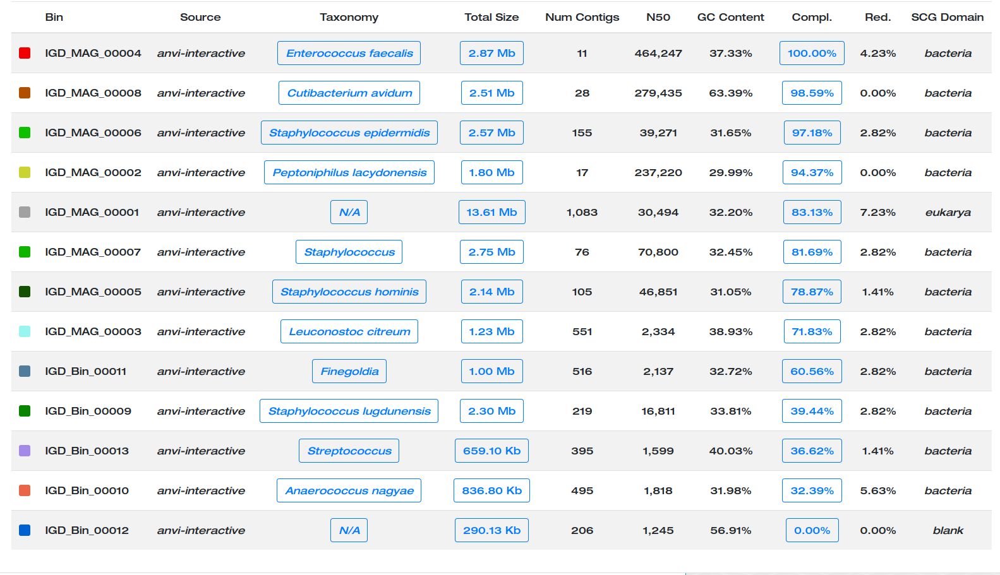
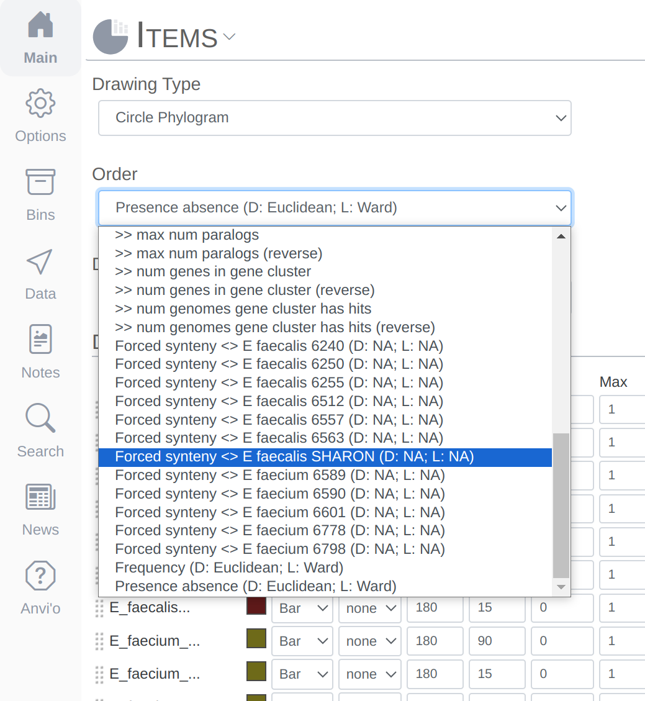
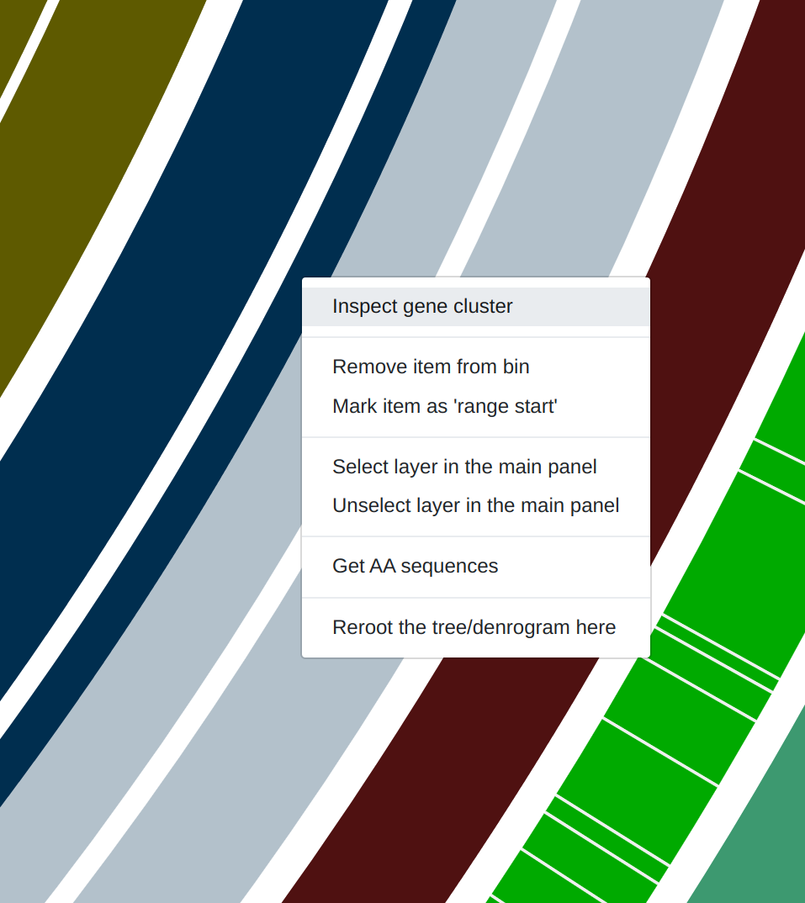
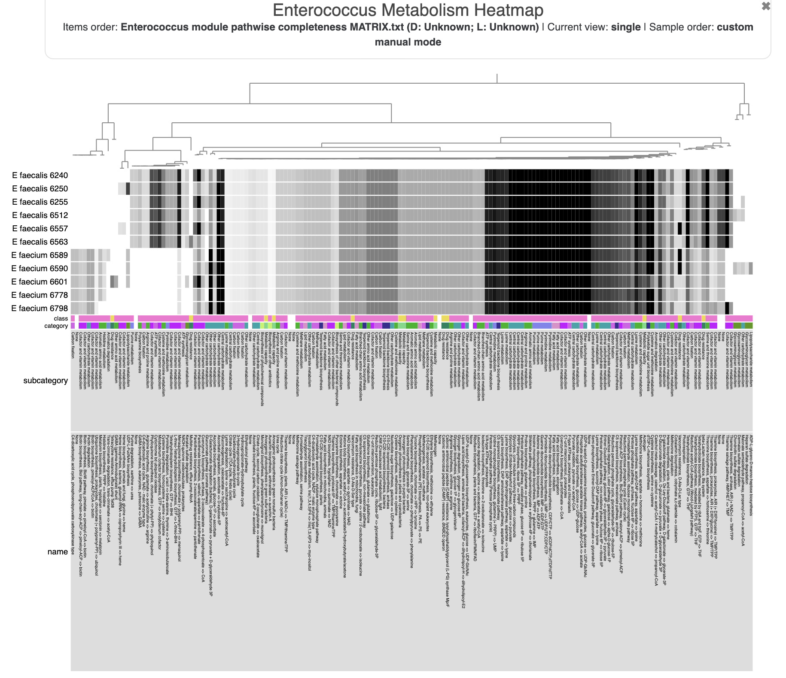
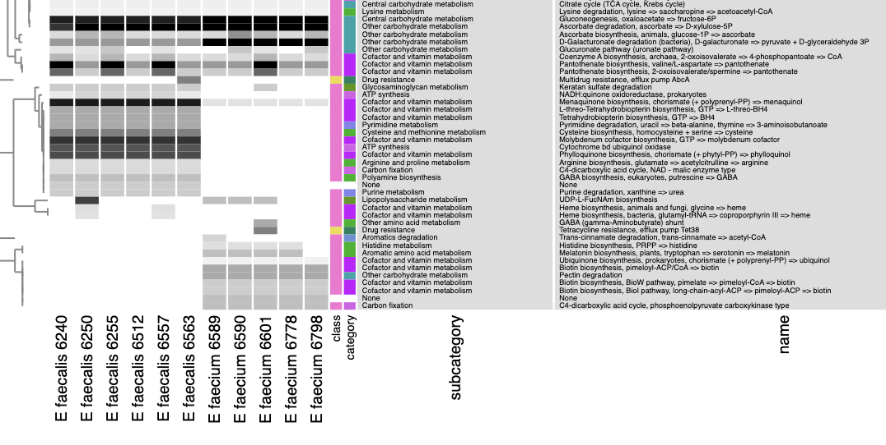
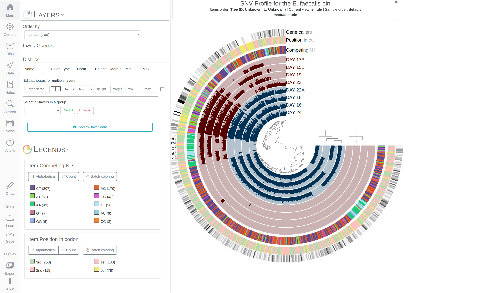

{:.warning}
This tutorial is tailored for anvi'o `v6` or later. You can learn the version of your installation by typing `anvi-interactive -v`. If you have an older version, some things will not work the way they should.

**The goal of this tutorial** is to explore some of the most fundamental aspects of anvi'o and its application to a real-world dataset. We organized it in multiple interconnected chapters, which all use the same dataset:

* [**Chapter I**: Genome-resolved Metagenomics](#chapter-i-genome-resolved-metagenomics)
* [**Chapter II**: Automatic Binning](#chapter-ii-automatic-binning)
* [**Chapter III**: Phylogenomics](#chapter-iii-phylogenomics)
* [**Chapter IV**: Pangenomics](#chapter-iv-pangenomics)
* [**Chapter V**: Metabolism Prediction](#chapter-v-metabolism-prediction)
* [**Chapter VI**: Microbial Population Genetics](#chapter-vi-microbial-population-genetics)
* [**Chapter VII**: Genes and genomes across metagenomes](#chapter-vii-genes-and-genomes-across-metagenomes)
* [**Chapter VIII**: From single-amino acid variants to protein structures](#chapter-viii-from-single-amino-acid-variants-to-protein-structures)


**At the end of this tutorial, you should be able to**

* Characterize high-quality genomes from metagenomes and manually curate them,
* Incorporate automatic binning results into your metagenomes,
* Perform phylogenomic analyses to learn about their approximate location in the tree of life,
* Determine core and accessory genes they contain compared to closely related genomes through pangenomics,
* Explore within population genomic diversity through single-nuleotide variants,
* Put a given metagenome-assembled, single-cell or isolate genome into the context of public metagenomes to investigate their core and accessory genes, and
* Investigate the genomic heterogeneity in the context of predicted protein structures.

All of these sections use the **same publicly available metagenomic dataset** generated by [Sharon et al. (2013)](http://www.ncbi.nlm.nih.gov/pubmed/22936250), which contains 11 feacal samples from a premature infant collected between Day 15 and Day 24 of her life in a time-series manner. After downloading raw sequencing reads, we co-assembled all samples and processed the resulting contigs longer than 1K using anvi'o following the [anvi'o metagenomic workflow](http://merenlab.org/2016/06/22/anvio-tutorial-v2/). The main reason we chose this dataset was its simplicity: more than 95% of metagenomic reads map back to the contigs, a great indication of the assembled contigs describe a very large fraction of this infant's gut microbiome.

We hope you find the tutorial useful, and generously share your opinions or criticism should you have any.


## Downloading the pre-packaged Infant Gut Dataset

To download and unpack [the infant gut data-pack](https://figshare.com/ndownloader/files/45076909), copy-paste the following commands into your terminal:

``` bash
curl -L -o INFANT-GUT-TUTORIAL.tar.gz \
     https://cloud.uol.de/public.php/dav/files/WLxH3aPJymCW9Lp

tar -zxvf INFANT-GUT-TUTORIAL.tar.gz && cd INFANT-GUT-TUTORIAL
```

This will download a **224 Mb** compressed file, and unpack it, which will take an additional **502 Mb**.

If you are using a newer version of anvi'o than was the one that was used to generate these databases (perhaps you are following the development branch), you may need to run  to get them up to date. If you are not sure whether you need this, do not worry - you could safely skip it and anvi'o would later remind you what exactly needs to be done.

``` bash
anvi-migrate --migrate-safely *.db
```

{:.notice}
If you were sent here somewhere from down below, now you can **go back**. If you have no idea what this means, ignore this notice, and continue reading. You're OK :)

<div class="extra-info" markdown="1">

<span class="extra-info-header">Some details on the contents of the data-pack for the curious</span>

If you type `ls` in the dataset directory you will see that the data-pack contains an anvi'o contigs database, an anvi'o merged profile database (that describes 11 metagenomes), and other additional data that are required by various sections in this tutorial. Here are some simple descriptions for some of these files, and how we generated them.

**The contigs and profile databases**. We generated an anvi'o contigs database using the program . This special anvi'o database keeps all the information related to your contigs: positions of open reading frames, k-mer frequencies for each contig, functional and taxonomic annotation of genes, etc. The contigs database is an essential component of everything related to anvi'o metagenomic workflow. We also generated a merged anvi'o profile database using the program . In contrast to the contigs database, anvi'o profile databases store *sample-specific* information about contigs. Profiling a BAM file with anvi'o creates a single profile that reports properties for each contig in a single sample based on mapping results. Each profile database automatically links to a contigs database, and anvi'o can merge  that link to the same contigs database into an **anvi'o merged profile** (which is what you will work with during this tutorial), using the program . Here are some direct links describing these steps:

* [Creating an anvi'o contigs database](#creating-an-anvio-contigs-database){:target="_blank"}
* [Creating an anvi'o profile database](#profiling-bam-files){:target="_blank"}
* [Merging anvi'o profile databases](#working-with-anvio-profiles){:target="_blank"}

**Identifying single-copy core genes among contigs**. We used the program  to identify single-copy core genes for Bacteria, Archaea, Eukarya, as well as sequences for ribosomal RNAs among the IGD contigs. All of these results are also stored in the contigs database. This information allows us to learn the completion and redundancy estimates of newly identified  in the interactive interface, on the fly. Note that if all single copy-core genes for a given domain are detected once in the selected bin, then the completion will be 100% and the redundancy 0%. If a few genes are detected multiple times, the redundancy value will increase. If a few genes are missing, then it is the completion value that will drop.

**Assigning functions to genes.** We also ran  and  on the contigs database before we packaged it for you, which stored  for genes results in the contigs database. At the end of the binning process, functions occurring in each bin will be made available for downstream analyses.

</div>

## Chapter I: Genome-resolved Metagenomics

The purpose of this tutorial is to have a conversation about genome-resolved metagenomics (with a focus on manual binning) using the Infant Gut Dataset (IGD), which was generated, analyzed, and published by [Sharon et al. (2013)](http://www.ncbi.nlm.nih.gov/pubmed/22936250){:target="_blank"}, and was re-analyzed in the [anvi'o methods paper](https://peerj.com/articles/1319/){:target="_blank"}.

By the end of the tutorial, you will be able to:

- Familiarize with the __interactive interface__ for binning (~25 minutes)
- __Inspect contigs__ in the context of their metagenomic signal (~5 minutes)
- Characterize __bins__ by manual binning (~20 minutes)
- __Summarize manual binning results__ for downstream analyses (~20 minutes)
- __Manually curate individual bins__ for quality control (~10 minutes)
- Import and visualize __external binning results__ (~20 minutes)
- Combine __manual and automatic binning__ (~10 minutes)

By the end of this chapter, you should (1) have a comprehensive understanding of genome-resolved metagenomics, and (2) be able to characterize and manually curate genomes from your own assembly outputs moving forwards.

---

A typical anvi'o genome-resolved metagenomic workflow [starts with one or more BAM files and a FASTA file of your contigs](#preparation){:target="_blank"}. There are many ways to get your contigs and BAM files for your metagenomes and we have started implementing a tutorial that [describes the workflows we often use](). But in this tutorial we will start from a point in the workflow where you have used your BAM and FASTA files to generate anvi'o contigs and profile databases.

{:.notice}
While this tutorial will take you through a simple analysis of a real dataset, there also is available a more comprehensive (but more abstract) tutorial on [anvi'o metagenomic workflow](){:target="_blank"}.

Using the files in the data-pack directory, let's take a first look at the merged profile database for the infant gut dataset metagenome. If you copy-paste this to your terminal:

``` bash
anvi-interactive -p PROFILE.db -c CONTIGS.db
```

The anvi'o  interface should welcome you with this display (after you click "draw"):

[](images/infant-gut-merged.png){:.center-img .width-50}

{:.notice}
When it is time to type other commands, you can close the window, go back to the terminal and press `CTRL + C` to kill the server.

<details markdown="1"><summary>Show/hide Tom's description of the metagenomic binning-related features of the anvi'o interactive interface</summary>

The  interface of anvi'o can be quite overwhelming. This particular box, in addition to the [interactive interface tutorial](/tutorials/interactive-interface/), attempts to give you insights into the features of the interactive interface relevant to metagenomic binning.

First of all, each leaf in the cerntral dendrogram describes an individual contig. Contigs that were fragmented into multiple splits due to their extensive length can be identified in the `Parent` layer. The grey layers after the `GC-Content` display mean coverage values (i.e., the environmental signal) of each contig/split across the 11 metagenomes. Finally, you can click on the `MOUSE` box on the right side of the interface to explore numerical and alphabetic values in more details across the display.

[](images/Interface-explanations.png){:.center-img .width-50}

Once the interactive interface is up and running, you can start binning:

[](images/infant-gut-merged.gif){:.center-img .width-50}

Make contig selections by hovering your mouse over the tree in the center of the anvi'o figure. To add the highlighted selection to your current , left click. To remove the highlighted selection from your current bin, right click. To create a new bin, click "New bin" under the `Bins` tab in `Settings`. To change to a different bin, click the blue dot next to the bin name you're interested in.

**Manipulating the inner dendrogram**. By default, anvi'o uses three different clutering approaches to organize contigs in the center dendrogram. Your ability to perform manual binning will be in part determined on your understanding of these clustering strategies. Here is a brief description of each:

- *Differential coverage*: clustering based on the differential coverage of contigs across metagenomes. The logic behind this metric is that fragments originating from the same genome should have the same distribution patterns, often different from other genomes.

- *Sequence composition*: clustering based on the sequence composition of contigs (by default their tetra-nucleotide frequency). This might seem strange (and in fact, it is to many of us), but fragments originating from the same genome have the tendency to exhibit a similar sequence composition, often different from genomes corresponding to distant lineages.

- *Differential coverage and sequence composition*: clustering using the two metrics for optimal binning resolution.

And here is where to change the settings in the `Main` tab:

[](images/Clustering_options.png){:.center-img .width-50}

{:.warning}
Anvi'o by default trusts the assembly; therefore splits from the same contig will remain together (but you can breakup contigs through the interface).

{:.warning}
Your selections will not be lost when switching from one organization to another. This particular ability has been very useful to visualize differences between clustering strategies and access the biological relevance of identified bins.

**Inspecting individual contigs in the context of their metagenomic signal**. In addition to selecting bins based on different clustering strategies, you can explore in more details the coverage of individual contigs across metagenomes: this is the __inspection mode__. You simply need to right click on any metagenomic layer at the coordinates of a contig of interest, and select "Inspect split". A new window should pop-up, like in this example:

{:.center-img .width-50}

Note that gene coordinates are displayed at the bottom and their inferred function can be accessed in a simple click. When detected, single nucleotide variants are also described in this display (vertical bars). You can close the `inspection mode` window when your curiosity has been satisfied.
</details>


### Importing taxonomy for genes

Anvi'o can work with gene-level taxonomic annotations, but gene-level taxonomy is not useful for anything beyond occasional help with manual binning. Once gene-level taxonomy is added into the contigs database, anvi'o will determine the taxonomy of each contig based on the taxonomic affiliation of genes they describe, and display them in the interface whenever possible.

Centrifuge ([code](https://github.com/DaehwanKimLab/centrifuge){:target="_blank"}, [paper](http://doi.org/10.1101/gr.210641.116){:target="_blank"}) is [one of the options](#centrifuge-output){:target="_blank"} to [import taxonomic annotations](){:target="_blank"} into an anvi'o contigs database. Centrifuge files for the IGD are already in the directory `additional-files/centrifuge-files`.

If you import these files into the contigs database the following way,

``` bash
anvi-import-taxonomy-for-genes -c CONTIGS.db \
                               -p centrifuge \
                               -i additional-files/centrifuge-files/centrifuge_report.tsv \
                               additional-files/centrifuge-files/centrifuge_hits.tsv
```

And run the  interface again,

``` bash
anvi-interactive -p PROFILE.db -c CONTIGS.db
```

You will see an additional layer with taxonomy:

{:.notice}
In the Layers tab find the `Taxonomy` layer, set its height to `200`, then drag the layer in between `DAY24` and `hmms_Ribosomal_RNAs`, and click `Draw` again. Then click `Save State` button, and overwrite the `default` state. This will make sure anvi'o remembers to make the height of that layer 200px the next time you run the interactive interface!

[](images/infant-gut-with-tax.png){:.center-img .width-50}

### Inferring taxonomy for metagenomes

So at this point we don't have any idea about what genomes do we have in this dataset, but anvi'o can make sense of the taxonomic make up of a given metagenome by characterizing taxonomic affiliations of single-copy core genes. The details of this  is described [here]() in greater detail.

You can take a very quick look at the taxonomic composition of the metagenome through the command line first:

```
anvi-estimate-scg-taxonomy -c CONTIGS.db \
                           --metagenome-mode
```

which should give us this output for the IGD:

```
╒════════════════════╤════════════════════╤══════════════════════════════════════════════════════════════════════════════════════════════════════════════════════════════════╕
│                    │   percent_identity │ taxonomy                                                                                                                         │
╞════════════════════╪════════════════════╪══════════════════════════════════════════════════════════════════════════════════════════════════════════════════════════════════╡
│ Ribosomal_S6_11655 │               98.9 │ Bacteria / Firmicutes / Bacilli / Staphylococcales / Staphylococcaceae / Staphylococcus / Staphylococcus epidermidis             │
├────────────────────┼────────────────────┼──────────────────────────────────────────────────────────────────────────────────────────────────────────────────────────────────┤
│ Ribosomal_S6_12163 │               98.9 │ Bacteria / Firmicutes / Bacilli / Staphylococcales / Staphylococcaceae / Staphylococcus / Staphylococcus hominis                 │
├────────────────────┼────────────────────┼──────────────────────────────────────────────────────────────────────────────────────────────────────────────────────────────────┤
│ Ribosomal_S6_15200 │               98.9 │ Bacteria / Firmicutes / Bacilli / Lactobacillales / Lactobacillaceae / Leuconostoc / Leuconostoc citreum                         │
├────────────────────┼────────────────────┼──────────────────────────────────────────────────────────────────────────────────────────────────────────────────────────────────┤
│ Ribosomal_S6_25880 │               98.9 │ Bacteria / Firmicutes / Clostridia / Tissierellales / Helcococcaceae / Finegoldia / Finegoldia magna                             │
├────────────────────┼────────────────────┼──────────────────────────────────────────────────────────────────────────────────────────────────────────────────────────────────┤
│ Ribosomal_S6_2915  │               97.9 │ Bacteria / Firmicutes / Bacilli / Lactobacillales / Enterococcaceae / Enterococcus / Enterococcus faecalis                       │
├────────────────────┼────────────────────┼──────────────────────────────────────────────────────────────────────────────────────────────────────────────────────────────────┤
│ Ribosomal_S6_29818 │               98.9 │ Bacteria / Firmicutes / Bacilli / Lactobacillales / Streptococcaceae / Streptococcus / Streptococcus oralis                      │
├────────────────────┼────────────────────┼──────────────────────────────────────────────────────────────────────────────────────────────────────────────────────────────────┤
│ Ribosomal_S6_30904 │               92.5 │ Bacteria / Firmicutes / Clostridia / Tissierellales / Helcococcaceae / Anaerococcus / Anaerococcus sp002359915                   │
├────────────────────┼────────────────────┼──────────────────────────────────────────────────────────────────────────────────────────────────────────────────────────────────┤
│ Ribosomal_S6_4484  │               98.9 │ Bacteria / Firmicutes / Clostridia / Tissierellales / Peptoniphilaceae / Peptoniphilus / Peptoniphilus rhinitidis                │
├────────────────────┼────────────────────┼──────────────────────────────────────────────────────────────────────────────────────────────────────────────────────────────────┤
│ Ribosomal_S6_6421  │                100 │ Bacteria / Actinobacteriota / Actinobacteria / Propionibacteriales / Propionibacteriaceae / Cutibacterium / Cutibacterium avidum │
├────────────────────┼────────────────────┼──────────────────────────────────────────────────────────────────────────────────────────────────────────────────────────────────┤
│ Ribosomal_S6_7660  │               98.9 │ Bacteria / Firmicutes / Bacilli / Staphylococcales / Staphylococcaceae / Staphylococcus /                                        │
╘════════════════════╧════════════════════╧══════════════════════════════════════════════════════════════════════════════════════════════════════════════════════════════════╛
```

Good, but could have been better. Why?

{:.notice}
**Pro tip**: we have a profile database, what does it mean and how it could improve the information we see here?

Making use of our  the following way, will give us a little more information about our dataset:

```
anvi-estimate-scg-taxonomy -c CONTIGS.db \
                           -p PROFILE.db \
                           --metagenome-mode \
                           --compute-scg-coverages
```

which should give us the following output:

```
Taxa in metagenome "Infant Gut Contigs from Sharon et al."
===============================================
╒════════════════════╤════════════════════╤════════════════════════════════╤═══════════╤═══════════╤══════════╤═══════════╤═══════════╤══════════════╕
│                    │   percent_identity │ taxonomy                       │   DAY_15A │   DAY_15B │   DAY_16 │   DAY_17A │   DAY_17B │ ... 6 more   │
╞════════════════════╪════════════════════╪════════════════════════════════╪═══════════╪═══════════╪══════════╪═══════════╪═══════════╪══════════════╡
│ Ribosomal_S6_2915  │               97.9 │ (s) Enterococcus faecalis      │   372.512 │   699.853 │  663.241 │    186.34 │    1149.6 │ ... 6 more   │
├────────────────────┼────────────────────┼────────────────────────────────┼───────────┼───────────┼──────────┼───────────┼───────────┼──────────────┤
│ Ribosomal_S6_11655 │               98.9 │ (s) Staphylococcus epidermidis │   112.694 │   172.478 │  147.304 │   23.3901 │   140.769 │ ... 6 more   │
├────────────────────┼────────────────────┼────────────────────────────────┼───────────┼───────────┼──────────┼───────────┼───────────┼──────────────┤
│ Ribosomal_S6_4484  │               98.9 │ (s) Peptoniphilus lacydonensis │         0 │         0 │        0 │         0 │         0 │ ... 6 more   │
├────────────────────┼────────────────────┼────────────────────────────────┼───────────┼───────────┼──────────┼───────────┼───────────┼──────────────┤
│ Ribosomal_S6_7660  │               98.9 │ (g) Staphylococcus             │         0 │         0 │        0 │         0 │         0 │ ... 6 more   │
├────────────────────┼────────────────────┼────────────────────────────────┼───────────┼───────────┼──────────┼───────────┼───────────┼──────────────┤
│ Ribosomal_S6_6421  │                100 │ (s) Cutibacterium avidum       │   17.8935 │   5.87368 │  4.79909 │         0 │         0 │ ... 6 more   │
├────────────────────┼────────────────────┼────────────────────────────────┼───────────┼───────────┼──────────┼───────────┼───────────┼──────────────┤
│ Ribosomal_S6_12163 │               98.9 │ (s) Staphylococcus hominis     │   2.39322 │   22.5447 │  13.2806 │         0 │   9.94853 │ ... 6 more   │
├────────────────────┼────────────────────┼────────────────────────────────┼───────────┼───────────┼──────────┼───────────┼───────────┼──────────────┤
│ Ribosomal_S6_15200 │               98.9 │ (s) Leuconostoc citreum        │         0 │         0 │  1.86532 │         0 │    1.6936 │ ... 6 more   │
├────────────────────┼────────────────────┼────────────────────────────────┼───────────┼───────────┼──────────┼───────────┼───────────┼──────────────┤
│ Ribosomal_S6_29818 │               98.9 │ (s) Streptococcus oralis       │         0 │         0 │        0 │         0 │         0 │ ... 6 more   │
├────────────────────┼────────────────────┼────────────────────────────────┼───────────┼───────────┼──────────┼───────────┼───────────┼──────────────┤
│ Ribosomal_S6_25880 │               98.9 │ (s) Finegoldia magna           │         0 │         0 │        0 │         0 │         0 │ ... 6 more   │
├────────────────────┼────────────────────┼────────────────────────────────┼───────────┼───────────┼──────────┼───────────┼───────────┼──────────────┤
│ Ribosomal_S6_30904 │               98.1 │ (s) Anaerococcus nagyae        │  0.528958 │         0 │  0.14157 │         0 │         0 │ ... 6 more   │
╘════════════════════╧════════════════════╧════════════════════════════════╧═══════════╧═══════════╧══════════╧═══════════╧═══════════╧══════════════╛
```

These look like information that would have been useful to have in front of us in our interactive interface. Luckily, anvi'o can add these taxonomic insights into a given , if you change the previous command just a bit:

```
anvi-estimate-scg-taxonomy -c CONTIGS.db \
                           -p PROFILE.db \
                           --metagenome-mode \
                           --compute-scg-coverages \
                           --update-profile-db-with-taxonomy
```

Tadaa. Now let's take another look at our interactive interface and find the additional data for our layers:

```
anvi-interactive -c CONTIGS.db \
                 -p PROFILE.db
```

At this point we have an overall idea about the make up of this metagenome, but we don't have any genomes from it. The following sections will cover some of multiple ways to do this.

### Manual identification of genomes in the Infant Gut Dataset

Let's first talk about the signal that leads to this specific organization of contigs we see in our display, and its biological implications.

Next, we can perform a round of manual binning. This should take about 10 minutes.

<div class="extra-info" markdown="1">

<span class="extra-info-header">A few tips for binning:</span>

- You do not have to bin all contigs. Instead, try to identify bins corresponding to an actual genome. Those will have relatively high completion values. The low-completion or no-completion bins in metagenomes might represent viruses, plasmids, or other interesting genetic elements, but this tutorial will ignore them.
- Please try to avoid bins with redundancy >10%. [Those likely contain contaminants](http://merenlab.org/2016/06/09/assessing-completion-and-contamination-of-MAGs/).
- You can increase the inner tree radius (e.g., 5,000) for a better binning experience in the `Main` tab (additional settings)
- You can select the option `show grid` in the `Main` tab (additional settings) for a better demarcation of identified bins

</div>

Here is an example of 16 bins we identified for comparison AFTER you performed your own binning:

[](images/Manual_Binnin_Result_Example.png){:.center-img .width-50}

Please save your bins as a collection. You can give your collection any name, but if you call it `default`, anvi'o will treat it differently.

{:.notice}
In the anvi'o lingo, a  is something that describes one or more , each of which describe one or more contigs.

If you identified near-complete genomes, then congratulations, you have characterized genomic contents of microbial populations *de novo*.

### Summarizing the binning results

Why do we do binning? Because we are interested in making sense of our metagenomes in the context of genomes we have recovered through binning. Understanding the distribution patterns of the genomes we have in a collection in a quantitative fashion, or getting back a table of function names found in each one of them, or even summarizing our bins as distinct FASTA files are critical for next steps of every binning analysis. After all, binning is a boring detail before you start doing your science.

To ensure that you have everything you need to continue working with the outcomes of your binning effort outside of anvi'o, we have a program called . It is possible to summarize any collection stored in an anvi'o profile database through this program. The result is a static HTML page that can be viewed on any computer.

<div class="extra-info" markdown="1">

<span class="extra-info-header">For the lazy</span>

If you don't want to do your own binning and still be able to continue with the commands below, you can import some binning results this way:

```
anvi-import-collection additional-files/collections/merens.txt \
                       --bins-info additional-files/collections/merens-info.txt \
                       -p PROFILE.db \
                       -c CONTIGS.db \
                       -C default
```

</div>

Let's summarize the collection you have just created:

```
anvi-summarize -p PROFILE.db \
               -c CONTIGS.db \
               -C default \
               -o SUMMARY
```

Once the summary is finished, take a minute to look at its contents.

### Renaming bins in your collection (from chaos to order)

As you can see from the  file, at this point bin names are random, and we often find it useful to put some order on this front. This becomes an extremely useful strategy especially when the intention is to merge multiple binning efforts later. For this task we use the program :

``` bash
anvi-rename-bins -p PROFILE.db \
                 -c CONTIGS.db  \
                 --collection-to-read default  \
                 --collection-to-write MAGs  \
                 --call-MAGs \
                 --prefix IGD \
                 --report-file rename-bins-report.txt
```

With those settings, a new collection `MAG` will be created in which (1) bins with a completion >70% are identified as MAGs (stands for Metagenome-Assembled Genome), and (2) bins and MAGs are attached the prefix IGD and renamed based on the difference between completion and redundancy.

Now we can use the program  to summarize the new collection:

``` bash
anvi-summarize -p PROFILE.db \
               -c CONTIGS.db \
               -C MAGs \
               -o SUMMARY_AFTER_RENAME
```

You can now visualize the results by double-clicking on the `index.html` file present in the newly created folder `SUMMARY_MAGs`.

Here are the MAGs we got:

[](images/Renamed_Collection_MAGs.png){:.center-img .width-50}

Better.

### Refining individual MAGs: the curation step

{:.warning}
**Why do we need to curate bins?** Please see [this paper](https://doi.org/10.1128/mBio.00725-19) to see how poorly refined bins can influence ecological and evolutionary insights we gain from MAGs. There is also a step-by-step workflow to describe steps of manual curation [here](https://merenlab.org/data/refining-mags/).

{:.warning}
**Why not relying only on single-copy core genes to estimate purity of a genome bin?** Let's think about this altogether. But once we are done with this, please see the relevant section in [this study](https://doi.org/10.1101/gr.258640.119).

To straighten the quality of the `MAGs` collection, it is possible to visualize individual bins and if needed, refine them. For this we use the program . For instance, if you were to be interested in refining one of the bins in our current collection, you could run this command:


``` bash
anvi-refine -p PROFILE.db \
            -c CONTIGS.db \
            -C MAGs \
            -b IGD_MAG_00001
```

Now the  interface only displays contigs from a single bin. During this curation step, one can try different clustering strategies (i.e. by only relying on coverage, or only relying on sequence composition) to identify outliers and investigate carefully whether they may be contaminants. You can select everything, and remove those contigs you don't want to keep in the bin before using the Bins panel to store your updated set of contigs in the database.

Here is an example of MAG we had to curate (we removed three contigs):

[](images/Refining_a_MAG_example.png){:.center-img .width-50}

{:.warning}
Storing the refined new bin in the database will modify the collection, but you will need to run `anvi-summarize` if you want the summary output to also be updated.

This is indeed a simple example. But in some cases refining a given MAG can take hours. But this is an extremely critical step of genome-resolved metagenomics studies, especially when important claims are made based on MAGs.

## Chapter II: Automatic Binning

Even if you prefer manual binning over automatic binning for the sake of accuracy and control over your data, automatic binning is an unavoidable need due to performance limitations associated with manual binning. The actual purpose of this chapter is to talk about advantages and disadvantages of automatic binning, by comparing multiple binning approaches on the simplest real-world gut metagenome there is: the infant gut dataset. However, while we are going through this, you will also learn about how to incorporate automatic binning results into anvi'o.

The directory `additional-files/external-binning-results` contains a number of files that describe the binning of contigs in the IGD based on various automatic and manual approaches. These files include (1) outputs from some of the well-known binning algorithms (i.e., `GROOPM.txt`, `MAXBIN.txt`, `METABAT.txt`, `BINSANITY_REFINE.txt`, `MYCC.txt`, and `CONCOCT.txt`), (2) the original binning of this dataset (`SHARON_et_al.txt`), and the manual binning we performed in the [anvi'o paper](https://peerj.com/articles/1319/) (`MEREN_et_al.txt`).

<div class="extra-info" markdown="1">

<span class="extra-info-header">External binning results [FROM AGES AGO]:</span>

The first five files are courtesy of **Elaina Graham**, who used [GroopM](http://www.ncbi.nlm.nih.gov/pmc/articles/PMC4183954/){:target="_blank"} (v0.3.5), [MetaBat](https://peerj.com/articles/1165/){:target="_blank"} (v0.26.3), [MaxBin](https://microbiomejournal.biomedcentral.com/articles/10.1186/2049-2618-2-26){:target="_blank"} (v2.1.1), [MyCC](https://sourceforge.net/projects/sb2nhri/files/MyCC/){:target="_blank"}, and [BinSanity](http://biorxiv.org/content/early/2016/08/16/069567){:target="_blank"} (v0.2.1) to bin the IGD. For future references, here are the parameters Elaina used for each approach:

``` bash
# GroopM v0.3.5 (followed the general workflow on their manual)
groopm parse groopm.db contigs.fa [list of bam files]
groopm core groopm.db -c 1000 -s 10 -b 1000000
groopm recruit groopm.db -c 500 -s 200
groopm extract groopm.db contigs.fa

# MetaBat v0.26.3 (used jgi_summarize_bam_contig_depths to get a depth file from BAM files).
metabat -i contigs.fa -a depth.txt -o bin

# MaxBin v2.1.1
run_MaxBin.pl -contig contigs.fa -out maxbin_IGM -abund_list [list of all coverage files in associated format]

# MyCC (ran via the docker image available here: https://sourceforge.net/projects/sb2nhri/files/MyCC/)
(used jgi_summarize_bam_contig_depths to get depth file from BAM files per the authors suggestion)
MyCC.py contigs.fa 4mer -a depth.txt

# BinSanity + refinement v0.2.1
Binsanity -f . -l contigs.fa -p -10 -c igm.coverage.lognorm

## After bin inspection using CheckM & Anvi'o, INFANT-GUT-ASSEMBLY-bin_18
## was refined using the following parameters
Binsanity-refine -f . -l -p -150 -c igm.coverage.lognorm
```

[CONCOCT](http://www.nature.com/nmeth/journal/v11/n11/full/nmeth.3103.html){:target="_blank"} results come from the CONCOCT module that was embedded within anvi'o until `v6`.

Eren et al. results come directly from the  generated during the study.

Finally, a file corresponding to Sharon et al. results was created by BLAST-searching sequences in bins identified by the authors of the study (see [http://ggkbase.berkeley.edu/carrol](http://ggkbase.berkeley.edu/carrol){:target="_blank"}) to our contigs to have matching names for our assembly.

</div>

Now you have the background information about where these files are coming from. Moving on. But just before we continue to move on, let's remove the default collection from our , if there is one, to avoid any confusion.

You can use the program  to see all collections in your anvi'o profile database:

```
anvi-show-collections-and-bins -p PROFILE.db
```

And use  to remove one that's called `default`:

```
anvi-delete-collection -p PROFILE.db \
                       -C default
```

### Importing an external binning result

You can create a collection by using the  interface (e.g., the `default` and `MAGs` collections you just created), or you can import  into your profile database as a collection and see how that collection groups contigs. For instance, let's  the CONCOCT collection:

``` bash
anvi-import-collection additional-files/external-binning-results/CONCOCT.txt \
                       -c CONTIGS.db \
                       -p PROFILE.db \
                       -C CONCOCT \
                       --contigs-mode
```

you can immediately see what collections are available in a given profile database using the program  (which in this case should show us the collections `CONCOCT`, and `MAGs`):

``` bash
anvi-show-collections-and-bins -p PROFILE.db
```

You can get a quick idea regarding the  of bins in a given collection:

``` bash
anvi-estimate-genome-completeness -p PROFILE.db \
                                  -c CONTIGS.db \
                                  -C CONCOCT
```

You can also get an idea about their taxonomy:

``` bash
anvi-estimate-scg-taxonomy -p PROFILE.db \
                           -c CONTIGS.db \
                           -C CONCOCT
```

OK. Let's run the interactive interface again with the `CONCOCT` collection:

``` bash
anvi-interactive -p PROFILE.db \
                 -c CONTIGS.db \
                 --collection-autoload CONCOCT
```

{:.notice}
Alternatively you could load the interface without the `--collection-autoload` flag, and click `Bins > Load bin collection > CONCOCT > Load` to load the CONCOCT collection.

To turn off text annotation, go to `Settings > Options > Bins Selection` and then uncheck `Show names`. You will then see something like this:

[](images/infant-gut-concoct.png){:.center-img .width-50}

So this is how you load and display an external collection. So far so good.

### Comparing multiple binning approaches

Since we have all these results from different binning approaches, it clearly would have been interesting to compare them to each other (because [benchmarking stuff](){:target="_blank"} is often very insightful). But how to do it? The simplest way to do it is to assume a 'true organization of contigs', and then investigate every other approach with respect to that.

Here we have multiple independent sources of information we could use. Including (1) the organization of contigs based on hierarchical clustering analysis, (2) per-contig taxonomy estimated from the gene-level taxonomic annotations by Centrifuge, and (3) results from the original publication from Sharon et al., in which authors did a very careful job to identify every genome in the dataset (even resolving the *Staphylococcus* pangenome, which is extremely hard for automatic binning approaches that work with a single co-assembly). So these are the things we can build upon for a modest comparison.

To include binning results in this framework, we could import each collection into the profile database the way we imported CONCOCT. But unfortunately at any given time there could only be one collection that can be displayed in the interface. Luckily there are other things we can do. For instance, as a workaround, we can merge all binning results into a single file, and use that file as an  to visualize them in the interactive interface.

Anvi'o has a script called  to merge multiple files from external binning results into a single merged file (don't ask why):

``` bash
anvi-script-merge-collections -c CONTIGS.db \
                              -i additional-files/external-binning-results/*.txt \
                              -o collections.tsv
```

If you take a look at this file, you will realize that it has a very simple format:

``` bash
head collections.tsv | column -t
contig                           BINSANITY_REFINE                CONCOCT  GROOPM     MAXBIN      METABAT               MYCC              SHARON_et_al
Day17a_QCcontig1000_split_00001  INFANT-GUT-ASSEMBLY-bin_19.fna  Bin_4    db_bin_11  maxbin.008  metabat_igm.unbinned  Cluster.5.fasta   Finegoldia_magna
Day17a_QCcontig1001_split_00001  INFANT-GUT-ASSEMBLY-bin_6.fna   Bin_7    db_bin_46  maxbin.006  metabat_igm.unbinned  Cluster.3.fasta   Staphylococcus_epidermidis_virus_014
Day17a_QCcontig1002_split_00001  INFANT-GUT-ASSEMBLY-bin_19.fna  Bin_4    db_bin_11  maxbin.007  metabat_igm.unbinned  Cluster.5.fasta   Finegoldia_magna
Day17a_QCcontig1003_split_00001  INFANT-GUT-ASSEMBLY-bin_14.fna  Bin_2    db_bin_1   maxbin.009  metabat_igm.7         Cluster.12.fasta
Day17a_QCcontig1004_split_00001  INFANT-GUT-ASSEMBLY-bin_16.fna  Bin_3    db_bin_8   maxbin.008  metabat_igm.10        Cluster.14.fasta
Day17a_QCcontig1005_split_00001  INFANT-GUT-ASSEMBLY-bin_13.fna  Bin_5    db_bin_47  maxbin.007  metabat_igm.unbinned  Cluster.3.fasta   Staphylococcus_epidermidis_viruses
Day17a_QCcontig1006_split_00001  INFANT-GUT-ASSEMBLY-bin_16.fna  Bin_3    db_bin_8   maxbin.008  metabat_igm.10        Cluster.14.fasta  Leuconostoc_citreum
Day17a_QCcontig1007_split_00001  INFANT-GUT-ASSEMBLY-bin_16.fna  Bin_3    db_bin_8   maxbin.008  metabat_igm.10        Cluster.14.fasta
Day17a_QCcontig1008_split_00001  INFANT-GUT-ASSEMBLY-bin_14.fna  Bin_2    db_bin_1   maxbin.009  metabat_igm.7         Cluster.8.fasta   Candida_albcans
```

Good. Now you can run the interactive interface to display all bins in all collections stored in `collections.tsv` as additional layers:

``` bash
anvi-interactive -p PROFILE.db \
                 -c CONTIGS.db \
                 -A collections.tsv
```

<div class="extra-info" markdown="1">

<span class="extra-info-header">Dealing with additional data tables like a pro</span>

As you can see, `-A` parameter allows us to add anything to the interface as additional layers as far as the first column of that data matches to our item names. We could alternatively import this additional information into our profile database, and the way to do it is through the use of [additional data tables subsystem of anvi'o](). There is much more information on how to deal with additional data of all sorts here, but basically we can use the program  to import this data into our database:

``` bash
anvi-import-misc-data collections.tsv \
                      -p PROFILE.db \
                      -t items
```

Now you can run the interactive interface *without* the `collections.tsv`, and you would get the exact same display, since the additional data now would be read from the additional data tables:

``` bash
anvi-interactive -p PROFILE.db -c CONTIGS.db
```

But for now, we will continue without these tables, so let's delete them from the profile database:

``` bash
anvi-delete-misc-data -p PROFILE.db \
                      -t items \
                      --just-do-it
```

</div>

Fine.

At this point you should be seeing a display similar to this (after setting the height of each additional layer to 200px):

[](images/infant-gut-collections.png){:.center-img .width-50}

The legends for each of the bin collections are available in the `Legends` tab of `Settings`. To visually emphasize relationships between bins, you can change the color of each bin manually by clicking on the colored boxes in the legends. Or, if you're not a masochist, you can use the program  to import an anvi'o  we have created for you:

``` bash
anvi-import-state --state additional-files/state-files/state-merged.json \
                  --name default \
                  -p PROFILE.db
```

and run the interactive interface again with the same command line,

``` bash
anvi-interactive -p PROFILE.db \
                 -c CONTIGS.db \
                 -A collections.tsv
```

this time you should get this display:

[](images/infant-gut-collections-final-tod.png){:.center-img .width-50}

So far so good?

Now we can discuss about different approaches of automatic binning.

{:.warning}
Please note that the algorithms we have used here may have been improved since the time we did these analyses, therefore please don't make any decisions about their performance or efficacy based on what you are seeing here.

Just a reminder, once you have the interactive interface in front of you, you can in fact investigate the taxonomy of contigs by BLASTing them against various NCBI collections using the right-click menu to have a second opinion about what do public databases think they are:

[](images/infant-gut-split.gif){:.center-img .width-50}

{:.notice}
Mouse section moved under `Settings > Data`, after version 7.0.0. 

{:.notice}
We recently have added an option to quickly run them on [BIGSI](http://www.bigsi.io/). Sometimes it takes a split second, sometimes (especially when you are in France) it takes minutes. So, no promises, but try it for sure! It is an [excellent algorithm](http://dx.doi.org/10.1038/s41587-018-0010-1).

### Manually curating automatic binning outputs

OK. Let's assume, we didn't see the interactive interface, and we have no idea about the dataset. We didn't do any of the things we did up to this point. We just had profiled and merged the IGD, and we did binning of this dataset using MaxBin. Let's start by importing MaxBin results into the profile database as a collection:

``` bash
anvi-import-collection additional-files/external-binning-results/MAXBIN.txt \
                       -c CONTIGS.db \
                       -p PROFILE.db \
                       -C MAXBIN \
                       --contigs-mode
```

From here, there are two things we can do very quickly. First, we can create a  of our new collection or we can take a quick look at the  of bins described by this collection from the command line, using :

``` bash
anvi-estimate-genome-completeness -p PROFILE.db \
                                  -c CONTIGS.db \
                                  -C MAXBIN
```

Alternatively, we can take a quick look at the binning results by initiating the interactive interface in `collection` mode:

``` bash
anvi-interactive -p PROFILE.db \
                 -c CONTIGS.db \
                 -C MAXBIN
```

This command should give you a display similar to this:

[](images/maxbin-collection.png){:.center-img .width-50}

All previous interactive displays were at the contig-level (each leaf in the center tree was a contig). However, this display is at the *bin-level*. Instead of contigs, this display shows us the distribution of *bins* MaxBin identified. We also have completion and redundancy estimates for each bin, which helps us make some early sense of what is going on.

{:.notice}
Please read this post to learn more about completion and redundancy estimates: [Assessing completion and contamination of metagenome-assembled genomes](){:target="_blank"}

It is clear that some bins are not as well-resolved as others. For instance, bins `maxbin_007` and `maxbin_008` have redundancy estimates of 22% and 91%, respectively, which suggests each of them describe multiple distinct populations. Well, clearly we would have preferred those bins to *behave*.

If you order bins based on their detection across metagenomes (by changing the 'Items order' to 'detection' from the menu in the Main tab), you can also see that  bins `maxbin_007` and `maxbin_008` are right next to each other. This suggests that it may be a good idea to simply merge these bins first, and then use the program  to avoid issues of over-splitting populations of interest. Let's use the program  to merge them into a single bin first:

```
anvi-merge-bins -p PROFILE.db \
                --collection-name MAXBIN \
                --bin-names-list "maxbin_007, maxbin_008" \
                --new-bin-name maxbin_007_and_008
```

If you take a quick look at the collection again, you can see that the new bin `maxbin_007_and_008` is the bin that needs immediate action based on single-copy core genes:

```
anvi-estimate-genome-completeness -p PROFILE.db \
                                  -c CONTIGS.db \
                                  -C MAXBIN
```

```
Bins in collection "MAXBIN"
===============================================
╒════════════════════╤══════════╤══════════════╤════════════════╤════════════════╤══════════════╤════════════════╕
│ bin name           │ domain   │   confidence │   % completion │   % redundancy │   num_splits │   total length │
╞════════════════════╪══════════╪══════════════╪════════════════╪════════════════╪══════════════╪════════════════╡
│ maxbin_001         │ BACTERIA │            1 │            100 │           4.23 │          148 │        2969341 │
├────────────────────┼──────────┼──────────────┼────────────────┼────────────────┼──────────────┼────────────────┤
│ maxbin_002         │ BACTERIA │          0.9 │          94.37 │              0 │           88 │        1801068 │
├────────────────────┼──────────┼──────────────┼────────────────┼────────────────┼──────────────┼────────────────┤
│ maxbin_003         │ BACTERIA │          0.7 │          81.69 │           2.82 │          144 │        2764617 │
├────────────────────┼──────────┼──────────────┼────────────────┼────────────────┼──────────────┼────────────────┤
│ maxbin_004         │ BACTERIA │          0.9 │          97.18 │           1.41 │          188 │        2571878 │
├────────────────────┼──────────┼──────────────┼────────────────┼────────────────┼──────────────┼────────────────┤
│ maxbin_005         │ BACTERIA │            1 │          98.59 │              0 │          151 │        2555414 │
├────────────────────┼──────────┼──────────────┼────────────────┼────────────────┼──────────────┼────────────────┤
│ maxbin_006         │ BACTERIA │          0.6 │          78.87 │           5.63 │          305 │        2901149 │
├────────────────────┼──────────┼──────────────┼────────────────┼────────────────┼──────────────┼────────────────┤
│ maxbin_009         │ EUKARYA  │          0.7 │          83.13 │           7.23 │         1379 │       13915165 │
├────────────────────┼──────────┼──────────────┼────────────────┼────────────────┼──────────────┼────────────────┤
│ maxbin_007_and_008 │ BACTERIA │            1 │          95.77 │         154.93 │         2381 │        6287535 │
╘════════════════════╧══════════╧══════════════╧════════════════╧════════════════╧══════════════╧════════════════╛
```

Fine. Let's refine that bin:

``` bash
anvi-refine -p PROFILE.db \
            -c CONTIGS.db \
            -C MAXBIN \
            -b maxbin_007_and_008
```

Which should give us this display, on which we see the distribution of contigs that were originally binned into `maxbin_007` and `maxbin_008` across samples. The hierarchical clustering picked up some trends, and you can see clusters one can identify quickly:

[](images/MaxBin_One_Bin_refine.png){:.center-img .width-50}

We can now make the following selections to split these two bins into six, and update our database by storing these refined bins from the Bins panel in the interface:

[](images/MaxBin_One_Bin_refine_selections.png){:.center-img .width-50}

If you take another look after this, you can see that `maxbin_007_and_008` is replaced with smaller bins, and the total redundancy in the collection is much lower:

```
anvi-estimate-genome-completeness -p PROFILE.db \
                                  -c CONTIGS.db \
                                  -C MAXBIN
```

```
Bins in collection "MAXBIN"
===============================================
╒══════════════════════╤══════════╤══════════════╤════════════════╤════════════════╤══════════════╤════════════════╕
│ bin name             │ domain   │   confidence │   % completion │   % redundancy │   num_splits │   total length │
╞══════════════════════╪══════════╪══════════════╪════════════════╪════════════════╪══════════════╪════════════════╡
│ maxbin_001           │ BACTERIA │            1 │            100 │           4.23 │          148 │        2969341 │
├──────────────────────┼──────────┼──────────────┼────────────────┼────────────────┼──────────────┼────────────────┤
│ maxbin_002           │ BACTERIA │          0.9 │          94.37 │              0 │           88 │        1801068 │
├──────────────────────┼──────────┼──────────────┼────────────────┼────────────────┼──────────────┼────────────────┤
│ maxbin_003           │ BACTERIA │          0.7 │          81.69 │           2.82 │          144 │        2764617 │
├──────────────────────┼──────────┼──────────────┼────────────────┼────────────────┼──────────────┼────────────────┤
│ maxbin_004           │ BACTERIA │          0.9 │          97.18 │           1.41 │          188 │        2571878 │
├──────────────────────┼──────────┼──────────────┼────────────────┼────────────────┼──────────────┼────────────────┤
│ maxbin_005           │ BACTERIA │            1 │          98.59 │              0 │          151 │        2555414 │
├──────────────────────┼──────────┼──────────────┼────────────────┼────────────────┼──────────────┼────────────────┤
│ maxbin_006           │ BACTERIA │          0.6 │          78.87 │           5.63 │          305 │        2901149 │
├──────────────────────┼──────────┼──────────────┼────────────────┼────────────────┼──────────────┼────────────────┤
│ maxbin_009           │ EUKARYA  │          0.7 │          83.13 │           7.23 │         1379 │       13915165 │
├──────────────────────┼──────────┼──────────────┼────────────────┼────────────────┼──────────────┼────────────────┤
│ maxbin_007_and_008_1 │ BACTERIA │          0.4 │          38.03 │           2.82 │          417 │         696607 │
├──────────────────────┼──────────┼──────────────┼────────────────┼────────────────┼──────────────┼────────────────┤
│ maxbin_007_and_008_2 │ BACTERIA │          0.6 │          47.89 │              0 │          369 │         753160 │
├──────────────────────┼──────────┼──────────────┼────────────────┼────────────────┼──────────────┼────────────────┤
│ maxbin_007_and_008_3 │ BLANK    │            1 │              0 │              0 │          206 │         290126 │
├──────────────────────┼──────────┼──────────────┼────────────────┼────────────────┼──────────────┼────────────────┤
│ maxbin_007_and_008_4 │ BACTERIA │          0.3 │          32.39 │           5.63 │          488 │         810476 │
├──────────────────────┼──────────┼──────────────┼────────────────┼────────────────┼──────────────┼────────────────┤
│ maxbin_007_and_008_5 │ BACTERIA │          0.3 │          38.03 │           2.82 │          247 │        2333489 │
├──────────────────────┼──────────┼──────────────┼────────────────┼────────────────┼──────────────┼────────────────┤
│ maxbin_007_and_008_6 │ BACTERIA │          0.8 │          71.83 │           2.82 │          556 │        1237568 │
╘══════════════════════╧══════════╧══════════════╧════════════════╧════════════════╧══════════════╧════════════════╛
```

The take home message here is that even when automatic binning approaches yield poorly identified bins, it is possible to improve the final results through a manual refinement step. Clearly these extra steps require a lot of expertise, intuition, attention, and decision making. And fortunately you are all familiar with each one of them because science.

Thank you for following the tutorial this far!

<details markdown="1"><summary>Show/hide More on refinement</summary>

You can read more about  [here](){:target="_blank"}. Also you may want to look at Tom's refining of the Loki archaea: [Inspecting the genomic link between Archaea and Eukaryota]().

If you are feeling lazy, you can just take a quick look at this videos from the post above.

First a closer look at *Lokiarchaeum* sp. GC14_75

<iframe width="600" height="315" src="https://www.youtube.com/embed/fuggwaagLng" frameborder="0" allowfullscreen></iframe>
<br />

And then curating it:

<iframe width="600" height="315" src="https://www.youtube.com/embed/vXPKP5vKiBM" frameborder="0" allowfullscreen></iframe>

<br />
You should always double-check your metagenome-assembled genomes.

</details>

<details markdown="1"><summary>Show/hide Meren's two cents on binning</summary>

Binning is inherently a very challenging task.

In most cases it is absolutely doable, especially when there is a decent assembly, but it *is* very challenging.

The IGD is one of the most friendly metagenomic datasets available to play with (since an astonishing fraction of nucleotides map back to the assembly), and it comes from a well-implemented experimental design (because that's what [Banfield group]((http://geomicrobiology.berkeley.edu/){:target="_blank"}) does). Yet, you now have seen the extent of disagreement between multiple binning approaches even for this dataset.

You should reming yourself that each of these approaches are implemented by people who are well-trained scientists working with groups of people who are experts in their fields. These tools are benchmarked against others and showed improvements. So each one of them provides the *best result* compared to all others in *at least* one metagenomic dataset. I think understanding what this means is important. There is no silver bullet in the common bioinformatics toolkit that will take care of every dataset when you fire it. In fact, depending on the dataset, even the best tools we have may be as efficient as sticks and stones against the Death Star. Computational people are working very hard to improve things, but they would be the first ones to suggest that their tools should never make users feel free from the fact that it is their own responsibility to make sure the results are meaningful and appropriate.

So which one to choose? How to get out of this situation easily and move on? I know how much desire there is to outsource everything we do to fully automated computational solutions. I also acknowledge that the ability to do that is important to perform large-scale and reproducible analyses without going through too much pain. But we are not at a stage yet with metagenomics where you can rely on any of the available automated binning tools, and expect your MAGs to be safe and sound.

For instance, I think CONCOCT is doing a pretty awesome job identifying MAGs in the IGD, even with the low-abundance organisms. However, it is not perfect, either. In fact if you look carefully, you can see that it creates two bins for one *Candida albicans* genome. Hierarchical clustering will always get you closest to the best organization of contigs with simple distance metrics and linkage algorithms. But there are major challenges associated with that approach, including the fact that it is simply an exploratory method and can't give you "bins" out-of-the-box. Even more importantly, it has tremendous limitations come from its computational complexity (~*O*(*m*<sup>2</sup> log *m*), where *m* is the number of data points). So in most cases it is not even a remote possibility to organize contigs using a hierarchical clustering approach in an assembly in reasonable amount of time (and there is no way to visualize that even if you were to get a dendrogram for 200,000 contigs (you can create simple 2D ordinations with that number of items, but you really shouldn't, but that's another discussion)). Except assemblies with rather smaller number of contigs like the IGD, we are always going to use automated ways to identify bins, at least *initially*, knowing that resulting bins may be, and in most cases will be, crappy. That's why in anvi'o we implemented ways to quickly look into automatically identified bins (i.e., the `collection` mode of `anvi-interactive`), and even refine those with poor redundancy scores to improve final results (i.e., `anvi-refine`).

So we can fix crappy bins to an extent since [we know more or less how things should look like](){:target="_blank"}, and [we have tools to do that](). That being said, there is one more consideration that is very easy to miss. Although it is somewhat possible to recover from **conflation error** (i.e., more than one genome ends up in one bin), it is much harder to recover from the **fragmentation error** (i.e., one genome is split into multiple bins). You can see an example for fragmentation error if you take a careful look from this figure (i.e., CONCOCT bins between 9:30 and 12:00 o'clock, or MaxBin bins between 5:00 and 7:00 o'clock):

[](infant-gut-collections-final-tod.png){:.center-img .width-50}

This is a problem that likely happens quite often, and very hard to deal with once the bins are identified. But we *can* recover from that.

**From fragmentation to conflation error: A Meren Lab Heuristic to fight back**

One of the heuristics we recently started using in our lab to avoid fragmentation error is to confine CONCOCT's clustering space to a much smaller number of clusters than the expected number of bacterial genomes in a given dataset, and then curate resulting contaminated bins manually. Let's say we expect to find `n` bacterial genomes, so we run CONCOCT with a maximum number of clusters of about `n/2` (no judging! I told you it was a heuristic!).

<blockquote>
Well, how do you even know how many bacterial genomes you should expect to find in a metagenome?

<div class="blockquote-author">You</div>
</blockquote>

Thanks for the great question. Although this may sound like a challenging problem to some, we have a very simple way to resolve it (which I described in this [blog post](){:target="_blank"}). If you still have access to the IGD, you can run this simple command:

```
anvi-display-contigs-stats CONTIGS.db
```

If you take a look at the resulting interactive graph, you can see that one should expect to find about 10 near-complete genomes in this dataset:

[](images/scgs.png){:.center-img .width-50}

{:.notice}
We have a citable version, and a more formal description of this workflow in our recent paper “[Identifying contamination with advanced visualization and analysis practices: metagenomic approaches for eukaryotic genome assemblies](https://peerj.com/articles/1839/){:target="_blank"}” (see the [supplementary material](https://doi.org/10.7717/peerj.1839/supp-1)).

Fine. Using `anvi-cluster-with-concoct` program, we ask CONCOCT to naively identify 5 clusters in this dataset, and store the results in the profile database as a collection:

``` bash
anvi-cluster-with-concoct -p PROFILE.db \
                          -c CONTIGS.db \
                          --num-clusters 5 \
                          -C CONCOCT_C5
```

{:.notice}
anvi-cluster-with-concoct has been superseded with 


Now you can run the interface again,

``` bash
anvi-interactive -p PROFILE.db \
                 -c CONTIGS.db \
                 --title 'Infant Gut Time Series by Sharon et al. [w/ 5 CONCOCT clusters]' \
                 --collection-autoload CONCOCT_C5
```

and you would see this:

[](images/concoct-5-clusters.png){:.center-img .width-50}

Well, there aren't any fragmentation errors anymore, and in fact CONCOCT did an amazing job to identify general patterns in the dataset. Now refining these bins to fix all the conflation errors would be much more easier. If you would like to try, here is an example:

``` bash
anvi-refine -p PROFILE.db \
            -c CONTIGS.db \
            -C CONCOCT_C5 \
            -b Bin_1
```

---

There are more ways to improve bins and binning results. But although we have seen major improvements in our research by exploring these directions, there are also many other cases where nothing is quite enough.

Then it is time to increase the depth of sequencing, implement a different assembly strategy, rethink the sampling strategy, or change the experimental approach to do what seems to be undoable. Here is an example from Tom Delmont et al. to that last point with soil metagenomics: [doi:10.3389/fmicb.2015.00358](https://doi.org/10.3389/fmicb.2015.00358){:target="_blank"}.

We all just have to continue working, and enjoy this revolution.

</details>

## Chapter III: Phylogenomics

{:.notice}
This is more of a practical tutorial to do phylogenomic analyses on metagenome-assembled genomes described in anvi'o . For a more abstract tutorial on phylogenomics, please consider first reading '[An anvi'o workflow for phylogenomics](){:target="_blank"}'.

{:.notice}
To see a practical application of phylogenomics see [this workflow](http://merenlab.org/data/parcubacterium-in-hbcfdna/){:target="_blank"}.


{:.notice}
**If you haven't followed the previous sections of the tutorial**, you will need the anvi'o merged  and the anvi'o  for the IGD available to you. Before you continue, please [click here](#downloading-the-pre-packaged-infant-gut-dataset), do everything mentioned there, and come back right here to continue following the tutorial from the next line when you read the directive **go back**.

Please run the following command in the IGD dir, so you have everything you need. We will simply import our previously generated collection of  in the IGD dataset as the `default` collection:

``` bash
anvi-import-collection additional-files/collections/merens.txt \
                       --bins-info additional-files/collections/merens-info.txt \
                       -p PROFILE.db \
                       -c CONTIGS.db \
                       -C default
```

At this point, you have in your anvi'o profile database a collection with multiple bins:

``` bash
anvi-show-collections-and-bins -p PROFILE.db

Collection: "default"
===============================================
Collection ID ................................: default
Number of bins ...............................: 13
Number of splits described ...................: 4,451
Bin names ....................................: Aneorococcus_sp, C_albicans, E_facealis, F_magna, L_citreum, P_acnes, P_avidum, P_rhinitidis, S_aureus, S_epidermidis, S_hominis, S_lugdunensis, Streptococcus
```

Putting genomes in a phylogenomic context is one of the common ways to compare them to each other. The common practice is to concatenate aligned sequences of single-copy core genes for each genome of interest, and generate a phylogenomic tree by analyzing the resulting alignment.

Let's assume we want to run a phylogenomic analysis on all genome bins we have in the collection `merens` in the IGD (you may have your own collections somewhere, that is fine too).

In order to do the phylogenomic analysis, we will need a FASTA file of concatenated genes. And to get that FASTA file out of our anvi'o databases, we will primarily use the program `anvi-get-sequences-for-hmm-hits`.

### Selecting genes from an HMM Profile

We first need to identify an HMM profile, and then select some gene names from this profile to play with.

Going back to the IGD, let's start by looking at what HMM profiles are available to us:

``` bash
anvi-get-sequences-for-hmm-hits -c CONTIGS.db \
                                -p PROFILE.db \
                                -o seqs-for-phylogenomics.fa \
                                --list-hmm-sources

* Bacteria_71 [type: singlecopy] [num genes: 71]
* Archaea_76 [type: singlecopy] [num genes: 76]
* Protista_83 [type: singlecopy] [num genes: 83]
* Ribosomal_RNAs [type: Ribosomal_RNAs] [num genes: 12]
```

{:.notice}
As you know, you can use  program with custom made HMM profiles to add your own HMMs into the contigs database.

Alright. We have two. Let's see what genes do we have in `Bacteria_71`:

``` bash
anvi-get-sequences-for-hmm-hits -c CONTIGS.db \
                                -p PROFILE.db \
                                -o seqs-for-phylogenomics.fa \
                                --hmm-source Bacteria_71 \
                                --list-available-gene-names

* Bacteria_71 [type: singlecopy]: ADK, AICARFT_IMPCHas, ATP-synt, ATP-synt_A,
Chorismate_synt, EF_TS, Exonuc_VII_L, GrpE, Ham1p_like, IPPT, OSCP, PGK,
Pept_tRNA_hydro, RBFA, RNA_pol_L, RNA_pol_Rpb6, RRF, RecO_C, Ribonuclease_P,
Ribosom_S12_S23, Ribosomal_L1, Ribosomal_L13, Ribosomal_L14, Ribosomal_L16,
Ribosomal_L17, Ribosomal_L18p, Ribosomal_L19, Ribosomal_L2, Ribosomal_L20,
Ribosomal_L21p, Ribosomal_L22, Ribosomal_L23, Ribosomal_L27, Ribosomal_L27A,
Ribosomal_L28, Ribosomal_L29, Ribosomal_L3, Ribosomal_L32p, Ribosomal_L35p,
Ribosomal_L4, Ribosomal_L5, Ribosomal_L6, Ribosomal_L9_C, Ribosomal_S10,
Ribosomal_S11, Ribosomal_S13, Ribosomal_S15, Ribosomal_S16, Ribosomal_S17,
Ribosomal_S19, Ribosomal_S2, Ribosomal_S20p, Ribosomal_S3_C, Ribosomal_S6,
Ribosomal_S7, Ribosomal_S8, Ribosomal_S9, RsfS, RuvX, SecE, SecG, SecY, SmpB,
TsaE, UPF0054, YajC, eIF-1a, ribosomal_L24, tRNA-synt_1d, tRNA_m1G_MT,
Adenylsucc_synt
```

OK. A lot. Good for you, `Bacteria_71`.

{:.notice}
`Bacteria_71` is a collection that anvi'o developers curated by taking [Mike Lee](https://twitter.com/AstrobioMike)'s bacterial single-copy core gene collection first released in [GToTree](https://doi.org/10.1093/bioinformatics/btz188), which is an easy-to-use phylogenomics workflow.

For the sake of this simple example, let's assume we want to use a bunch of ribosomal genes for our phylogenomic analysis: `Ribosomal_L1`, `Ribosomal_L2`, `Ribosomal_L3`, `Ribosomal_L4`, `Ribosomal_L5`, `Ribosomal_L6`.

OK. The  will give us all these genes from all bins described in the collection `default`:

``` bash
anvi-get-sequences-for-hmm-hits -c CONTIGS.db \
                                -p PROFILE.db \
                                -o seqs-for-phylogenomics.fa \
                                --hmm-source Bacteria_71 \
                                -C default \
                                --gene-names Ribosomal_L1,Ribosomal_L2,Ribosomal_L3,Ribosomal_L4,Ribosomal_L5,Ribosomal_L6

Init .........................................: 4451 splits in 13 bin(s)
Hits .........................................: 668 hits for 1 source(s)
Filtered hits ................................: 64 hits remain after filtering for 6 gene(s)
Mode .........................................: DNA sequences
Genes are concatenated .......................: False
Output .......................................: seqs-for-phylogenomics.fa
```

If you look at the resulting FASTA file, you will realize that it doesn't look like an alignment (I trimmed the output, you will see the full output when you look at the file yourself):


``` bash
less seqs-for-phylogenomics.fa
>Ribosomal_L1___Bacteria_71___9a3cc bin_id:E_facealis|source:Bacteria_71|e_value:8.4e-59|contig:Day17a_QCcontig1|gene_callers_id:116|start:106378|stop:107068|length:690
ATGGCTAAAAAGAGCAAAAAAATGCAAGAAGCATTGAAAAAAGTTGATGCTACAAAAGCTTACTCAGTTGAAGAAGCAGTAGCTTTAGCAAAAGATACAAACATCGCGAAATTTGACGCA
(...)
>Ribosomal_L6___Bacteria_71___05162 bin_id:S_epidermidis|source:Bacteria_71|e_value:1.1e-43|contig:Day17a_QCcontig7|gene_callers_id:2325|start:13243|stop:13780|length:537
ATGAGTCGTGTTGGTAAGAAAATTATTGACATTCCTAGTGACGTAACAGTAACTTTTGACGGAAGTCATGTCACTGTAAAAGGTCCAAAAGGTGAATTAGAAAGAACTTTAAATGAAAGA
(...)
>Ribosomal_L5___Bacteria_71___ec17f bin_id:S_epidermidis|source:Bacteria_71|e_value:1.8e-31|contig:Day17a_QCcontig7|gene_callers_id:2328|start:14441|stop:14981|length:540
TTGAACCGTTTAAAAGAAAAATTTAATACAGAAGTTACTGAAAACTTAGTGAAAAAATTCAATTATAGTTCAGTGATGGAAGTACCAAAAATTGAGAAAATCGTTGTGAATATGGGTGTA
(...)
```

To exit `less` mode, press `q`.

Every sequence for every HMM hit is for itself :/ Hmm.

Concatenated we stand, divided we fall.


### Concatenating genes

Although you can see how and why the previous output could be very useful for many other purposes, it is kinda useless for a phylogenomic analysis since we need a single concatenated alignment of gene sequences per genome.

If you look at the help menu of `anvi-get-sequences-for-hmm-hits`, you will see that there is a flag, `--concatenate-genes`, to get your genes of interest to be concatenated. Let's do that:

``` bash
anvi-get-sequences-for-hmm-hits -c CONTIGS.db \
                                -p PROFILE.db \
                                -o seqs-for-phylogenomics.fa \
                                --hmm-source Bacteria_71 \
                                -C default \
                                --gene-names Ribosomal_L1,Ribosomal_L2,Ribosomal_L3,Ribosomal_L4,Ribosomal_L5,Ribosomal_L6 \
                                --concatenate-genes

Config Error: If you want your genes to be concatenated into a multi-alignment file, you must
              also ask for the best hit (using the `--return-best-hit`) flag to avoid issues
              if there are more than one hit for a gene in a given genome. Anvi'o could have
              set this flag on your behalf, but it just is not that kind of a platform :/
```

Well. That didn't go well.

The reason why it didn't go so well is because even in the most complete genomes, there may be multiple HMM hits for a given 'single-copy gene'. [Here is an evidence for that]() coming from gold standard genomes for skeptics. As a solution to this problem, anvi'o asks you to use the `--return-best-hit` flag, which will return the most significant HMM hit if there are more than one gene that matches to the HMM of a given gene in a given genome. Fine. Let's do that, then:

``` bash
anvi-get-sequences-for-hmm-hits -c CONTIGS.db \
                                -p PROFILE.db \
                                -o seqs-for-phylogenomics.fa \
                                --hmm-source Bacteria_71 \
                                -C default \
                                --gene-names Ribosomal_L1,Ribosomal_L2,Ribosomal_L3,Ribosomal_L4,Ribosomal_L5,Ribosomal_L6 \
                                --concatenate-genes \
                                --return-best-hit
```

If you take a look at the output file, you can see that we are getting somewhere.

But the output is in `DNA` alphabet, which may not be the best option for phylogenomic analyses, especially if the genomes you have are coming from distant clades (which happens to be the case for IGD). Fortunately, you can easily switch to `AA` alphabet with an additional flag `--get-aa-sequences` (and no, there is no end to anvi'o flags, and the earlier you start getting used to the idea of reading those help menus, the sooner you will master your anvi'o game).

``` bash
anvi-get-sequences-for-hmm-hits -c CONTIGS.db \
                                -p PROFILE.db \
                                -o seqs-for-phylogenomics.fa \
                                --hmm-source Bacteria_71 \
                                -C default \
                                --gene-names Ribosomal_L1,Ribosomal_L2,Ribosomal_L3,Ribosomal_L4,Ribosomal_L5,Ribosomal_L6 \
                                --concatenate-genes \
                                --return-best-hit \
                                --get-aa-sequences
```

If you look at the resulting file again, you will see how everything looks just so lovely. Congratulations. You did it.

{:.warning}
In `v8`, anvi'o forgets to tell you that two bins in the `default` collection, `P_acnes` and `S_lugdunensis`, have none of the 6 requested genes, and instead silently removes them from the analysis (bad anvi'o). This is fixed in the development version and will hopefully be updated in this tutorial at the time of the next stable release. But for now, just keep it in mind since the loss of those two bins will become relevant in the next section.

### Computing the phylogenomic tree

Once you have your concatenated genes, which you now have them in `seqs-for-phylogenomics.fa` if you followed the previous section, it is time to perform the phylogenomic analysis.

There are multiple ways to do this. Here we will use the program , which accepts a FASTA file and uses one of the programs it knows about to compute the tree. Currently the only option is [FastTree](http://www.microbesonline.org/fasttree/), which infers approximately-maximum-likelihood phylogenetic trees from FASTA files that look like yours. Send us your favorite, and we will happily consider expanding the collection of available tools for this analysis.

Computing a phylogenomic tree from our FASTA file is as simple as this:

``` bash
anvi-gen-phylogenomic-tree -f seqs-for-phylogenomics.fa \
                           -o phylogenomic-tree.txt
```

{:.notice}
If anvi'o complains that you don't have `FastTree`, you need to do two things. First, feel ashamed. Second, get FastTree: [click me](http://merenlab.org/2016/06/18/installing-third-party-software/#fasttree). (If you are using a mac and have `brew`, quietly type `brew install fasttree` and pretend it never happened).

The resulting file `phylogenomic-tree.txt` is a proper newick tree. If you want, you can visualize it immediately with `anvi-interactive` in manual mode:

``` bash
anvi-interactive --tree phylogenomic-tree.txt \
                 -p temp-profile.db \
                 --title "Pylogenomics of IGD Bins" \
                 --manual
```

Which should give you this (after clicking `Draw`):

[](images/phylogenomics-manual-mode.png){:.center-img .width-50}

You can replace the colors with the bin names by selecting `Text` from `Main > Legends > Item Names > bin_name` and re-clicking `Draw`:

[](images/phylogenomics-manual-mode-text.png){:.center-img .width-50}

We can do much more with this phylogenomic tree of our bins than visualizing it in manual mode.

For instance, we could use it immediately to organize our bins in our collection while showing their distribution across samples.

``` bash
anvi-interactive -p PROFILE.db \
                 -c CONTIGS.db \
                 -C default \
                 --tree phylogenomic-tree.txt
```

{:.warning}
You will likely get an error from this command due to the loss of 2 bins that are missing the ribosomal proteins we asked for (see warning box at the end of the previous section). Those 2 bins never made it into the `seqs-for-phylogenomics.fa`, and therefore weren't included in the tree. We'll hopefully fix this section of the tutorial soon, but in the meantime please keep reading for the solution.

If you got an error from the previous command saying something like "the 11 items in your tree file do not match to the 13 items the 'default' collection describes", then you can fix the mismatch between the two by making a new collection containing only the 11 genomes that made it into the phylogenomic tree. Here is how you can do that by exporting the original 'default' collection, removing the 2 bins missing from the tree (here done using the inverse `grep` command, but other strategies are possible), and importing the reduced collection back into the profile database:

```bash
anvi-export-collection -p PROFILE.db -C default
grep -v P_acnes collection-default.txt | grep -v S_lugdunensis > collection-default-reduced.txt
anvi-import-collection -c CONTIGS.db -p PROFILE.db -C default_reduced collection-default-reduced.txt
```

After this, you can visualize the tree like so:
```
anvi-interactive -p PROFILE.db \
                 -c CONTIGS.db \
                 -C default_reduced \
                 --tree phylogenomic-tree.txt
```

Which would give you the following display after selecting the 'Phylogenomic tree' from the 'orders' combo box in the 'Settings' tab (note that the name of your collection might not match to the one in the screenshot).

[](images/phylogenomics-collection-mode.png){:.center-img .width-50}


The tree in the middle shows the phylogenomic organization of bins we identified in the IGD.

Now you know how to organize distantly related genomes using universally conserved genes.


## Chapter IV: Pangenomics

Both phylogenomics and pangenomics are strategies under the umbrella of comparative genomics, and they are inherently very similar despite their key differences. In this chapter we will discuss pangenomics and use anvi'o to have a small pangenomic analysis using our famous *E. faecalis*  we recovered from the infant gut dataset and a bunch of others from the interwebs.

{:.notice}
You can find a comprehensive tutorial on the anvi'o pangenomic workflow [here](){:target="_blank"}.

{:.warning}
**If you haven't followed the previous sections of the tutorial**, you will need the anvi'o merged  and the anvi'o  for the IGD available to you. Before you continue, please [click here](#downloading-the-pre-packaged-infant-gut-dataset), do everything mentioned there, and come back right here to continue following the tutorial from the next line when you read the directive **go back**.

Please run following  in the IGD dir. They will set the stage for us to take a look at the *E. faecalis* bin:

``` bash
anvi-import-collection additional-files/collections/e-faecalis.txt \
                       --bins-info additional-files/collections/e-faecalis-info.txt \
                       -p PROFILE.db \
                       -c CONTIGS.db \
                       -C E_faecalis
```

---

### Generating a genome storage

For this example I downloaded 6 *E. faecalis*, and 5 *E. faecium* genomes to analyze them together with our *E. faecalis* bin. For each of these 11 *external genomes*, I generated anvi'o contigs databases. You can find all of them in the additional files directory:

``` bash
ls additional-files/pangenomics/external-genomes/*db
additional-files/pangenomics/external-genomes/Enterococcus_faecalis_6240.db
additional-files/pangenomics/external-genomes/Enterococcus_faecalis_6250.db
additional-files/pangenomics/external-genomes/Enterococcus_faecalis_6255.db
additional-files/pangenomics/external-genomes/Enterococcus_faecalis_6512.db
additional-files/pangenomics/external-genomes/Enterococcus_faecalis_6557.db
additional-files/pangenomics/external-genomes/Enterococcus_faecalis_6563.db
additional-files/pangenomics/external-genomes/Enterococcus_faecium_6589.db
additional-files/pangenomics/external-genomes/Enterococcus_faecium_6590.db
additional-files/pangenomics/external-genomes/Enterococcus_faecium_6601.db
additional-files/pangenomics/external-genomes/Enterococcus_faecium_6778.db
additional-files/pangenomics/external-genomes/Enterococcus_faecium_6798.db
```

{:.notice}
The post [Accessing and including NCBI genomes in 'omics analyses in anvi'o]() explains how to download sets of genomes you are interested in from the NCBI and turn them into anvi'o contigs databases.

There also are two files in the `additional-files/pangenomics` directory to describe how to access to the :

|name|contigs_db_path|
|:--|:--|
|E_faecalis_6240|external-genomes/Enterococcus_faecalis_6240.db|
|E_faecalis_6250|external-genomes/Enterococcus_faecalis_6250.db|
|E_faecalis_6255|external-genomes/Enterococcus_faecalis_6255.db|
|E_faecalis_6512|external-genomes/Enterococcus_faecalis_6512.db|
|E_faecalis_6557|external-genomes/Enterococcus_faecalis_6557.db|
|E_faecalis_6563|external-genomes/Enterococcus_faecalis_6563.db|
|E_faecium_6589|external-genomes/Enterococcus_faecium_6589.db|
|E_faecium_6590|external-genomes/Enterococcus_faecium_6590.db|
|E_faecium_6601|external-genomes/Enterococcus_faecium_6601.db|
|E_faecium_6778|external-genomes/Enterococcus_faecium_6778.db|
|E_faecium_6798|external-genomes/Enterococcus_faecium_6798.db|

and the  one:

|name|bin_id|collection_id|profile_db_path|contigs_db_path|
|:--|:--:|:--:|:--|:--|
|E_faecalis_SHARON|E_faecalis|E_faecalis|../../PROFILE.db|../../CONTIGS.db|

It is this simple to combine MAGs and isolates.

So everything is ready for an analysis, and the first step in the pangenomic workflow is to generate an [anvi'o genomes storage](/#generating-an-anvio-genomes-storage){:target="_blank"}.

``` bash
anvi-gen-genomes-storage -i additional-files/pangenomics/internal-genomes.txt \
                         -e additional-files/pangenomics/external-genomes.txt \
                         -o Enterococcus-GENOMES.db
```

### Computing and visualizing the pangenome

Now we have the , we can characterize the pangenome:

``` bash
anvi-pan-genome -g Enterococcus-GENOMES.db \
                -n Enterococcus \
                -o PAN \
                --num-threads 10
```

Now the pangenome is ready to display. This is how you can run it:

``` bash
anvi-display-pan -g Enterococcus-GENOMES.db \
                 -p PAN/Enterococcus-PAN.db \
                 --title "Enterococccus Pan"
```

To get this ugly looking display:

[](images/e-faecalis-pan.png){:.center-img .width-50}

<div class="extra-info" markdown="1">

<span class="extra-info-header">Never settle for bad-looking figures</span>

Well, you can do whatever you want, but just take a look at this anvi'o figure:

[](../../images/miscellaneous/2017-02-05-zhou-salmonella/zhemin_et_al_anvio.png){:.center-img .width-50}

This is a pangenomic analysis visualized with anvi'o by Zhemin Zhou and his colleagues. Here is more information about this excellent study: [An 800-years-old *Salmonella* genome, and a lovely anvi'o figure](){:target="_blank"}.

I am not arguing that every figure should look like that one, but I would like you to consider the fact that if you would like to do better, there are ways. Here is a post about [working with SVG files anvi'o generate](){:target="_blank"}. Finally, please visit [this reproducible workflow](http://merenlab.org/data/spiroplasma-pangenome/) to see a step-by-step for a more humanly-possible prettification of a pangenome:

<blockquote class="twitter-tweet"><p lang="en" dir="ltr">This GIF shows the evolution of an anvi&#39;o figure from the raw anvi&#39;o display to its published form :) We know the anvi&#39;o interactive interface can be scary, but it IS powerful :)<a href="https://t.co/IfvDndFgBD">https://t.co/IfvDndFgBD</a> describes every step in the interface to go from the 1st to the 2nd image. <a href="https://t.co/sb4dzLKAg3">pic.twitter.com/sb4dzLKAg3</a></p>&mdash; A. Murat Eren (Meren) (@merenbey) <a href="https://twitter.com/merenbey/status/1166379164720685056?ref_src=twsrc%5Etfw">August 27, 2019</a></blockquote> <script async src="https://platform.twitter.com/widgets.js" charset="utf-8"></script>

</div>


OK. I made the previous display a bit prettier for you. If you kill the server, and  the  file the following way, and re-run the server,

``` bash
anvi-import-state -p PAN/Enterococcus-PAN.db \
                  --state additional-files/state-files/state-pan.json \
                  --name default

anvi-display-pan -g Enterococcus-GENOMES.db \
                 -p PAN/Enterococcus-PAN.db \
                 --title "Enterococccus Pan"
```

It will look much more reasonable:

[](images/e-faecalis-pan-state.png){:.center-img .width-70}

Now not only can we see how our E. faecalis genome looks like compared to available genomes, we can also see that it is not missing or carrying a great number of proteins compared to other genomes. The clustering of genomes based on gene clusters indicate that it is most similar to the genome `Enterococcus faecalis 6512`, which, according to the `00_INFO_ABOUT_EXTERNAL_GENOMES.txt` under `additional-files/pangenomics/external-genomes` directory, corresponds to the assembly ID [ASM17257v2](https://www.ncbi.nlm.nih.gov/gquery/?term=ASM17257v2){:target="_blank"} if you were to be interested in exploring further.

### Adding average nucleotide identity

The pangenome tells us about the similarities and dissimilarities between those genomes given the amino acid sequences of open reading frames we identified within each one of them. We could also compare them to each other by computing the average nucleotide identity between them. Anvi'o comes with a  to do that, which uses [PyANI by Pritchard et al.](https://github.com/widdowquinn/pyani) to pairwise align DNA sequences between genomes to estimate similarities between them. [See this tutorial for details](#computing-the-average-nucleotide-identity-for-genomes).

We can compute average nucleotide identity among our genomes, and add them to the pan database the following way:

``` bash
anvi-compute-genome-similarity -e additional-files/pangenomics/external-genomes.txt \
                               -i additional-files/pangenomics/internal-genomes.txt \
                               --program pyANI \
                               -o ANI \
                               -T 6 \
                               --pan-db PAN/Enterococcus-PAN.db
```

<div class="extra-info" markdown="1">

<span class="extra-info-header">For people in a rush</span>

Computing ANI can take a long time especially if you don't have many threads to share. Your data-pack contains the ANI percent identity file that emerges from the previous command line that you can  into your pan database if you don't want to run the command and move on:

``` bash
anvi-import-misc-data additional-files/pangenomics/ANI_percentage_identity.txt \
                      -p PAN/Enterococcus-PAN.db \
                      --target-data-table layers \
                      --target-data-group ANI_percentage_identity
```

</div>


If you visualize your pangenome again once you have your ANI results in your database,

``` bash
anvi-display-pan -g Enterococcus-GENOMES.db \
                 -p PAN/Enterococcus-PAN.db \
                 --title "Enterococccus Pan"
```

And take a careful look at your 'Layers' tab, you can see visualize your pangenome with the new ANI results:

[](images/e-faecalis-w-ani.png){:.center-img .width-70}

### Organizing gene clusters based on a forced synteny

By default, anvi'o will organize gene clusters in a given pangenome based on their distribution patterns across genomes. Which, by definition, will break gene synteny, i.e., two gene clusters that are next to each other in the display will not necessarily carry genes that are next to each other in respective genomes. If you have a relatively complete genome, you can ask anvi'o to organize gene clusters based on the organization of genes in that genome.

Here, for instance, we can force the organization of gene clusters based on the synteny of genes in our *E. faecalis* genome:

[](images/pan-synteny-box.png){:.center-img .width-50}

And here we go:

[](images/pan-synteny.png){:.center-img .width-70}


{:.warning}
Please take a look at [this study](https://doi.org/10.1038/s41467-019-08973-w) and its [reproducible workflow](http://merenlab.org/data/wolbachia-plasmid) if you would like to see a useful practical application of this strategy by [Julie Reveillaud](https://twitter.com/JulieReve).


### Functional enrichment analyses

One of the things we often are interested in is this question: which functions are associated with a particular organization of genomes due to their phylogenomic or pangenomic characteristics.

For instance, genomes in this pangenome are organized into two distinct groups based on differential distribution of gene clusters. That is of course not surprising, since these genomes are classified into two distinct 'species' within the genus Enterococcus. So you can certainly imagine more appropriate or interesting examples where you may be wondering about functional enrichment across groups of genomes that do not have such clear distinctions at the level of taxonomy. The actual tutorial to make sense of functions in pangenomes is [here](/#making-sense-of-functions-in-your-pangenome). Here we will make a quick pass to demonstrate its relevance.

First, you need to define how you would like to group your genomes in the pangenome so anvi'o can find out which functions are characteristic of each group. Here is our TAB-delimited file to divide these genomes into two groups:


|name|clade|
|:--|:--:|
|E_faecalis_6240|faecalis|
|E_faecalis_6250|faecalis|
|E_faecalis_6255|faecalis|
|E_faecalis_6512|faecalis|
|E_faecalis_6557|faecalis|
|E_faecalis_6563|faecalis|
|E_faecalis_SHARON|faecalis|
|E_faecium_6589|faecium|
|E_faecium_6590|faecium|
|E_faecium_6601|faecium|
|E_faecium_6778|faecium|
|E_faecium_6798|faecium|

Which is also in your data-pack. Let's  it into the pan database as an additional layer data:

``` bash
anvi-import-misc-data -p PAN/Enterococcus-PAN.db \
                      --target-data-table layers \
                      additional-files/pangenomics/additional-layers-data.txt
```

Once it is imported, we can re-run the pangenome,

``` bash
anvi-display-pan -g Enterococcus-GENOMES.db \
                 -p PAN/Enterococcus-PAN.db \
                 --title "Enterococccus Pan"
```

and see the new layer there that correspond to our clades:

[](images/pan-clades.png){:.center-img .width-70}

Now we can use the program  to ask anvi'o to identify and report functions that are enriched in either of these clades along with the gene clusters they are associated with:

``` bash
anvi-compute-functional-enrichment-in-pan -p PAN/Enterococcus-PAN.db \
                                          -g Enterococcus-GENOMES.db \
                                          --category-variable clade \
                                          --annotation-source COG20_FUNCTION \
                                          -o functional-enrichment.txt
```

Which would generate a new file, `functional-enrichment.txt`, which is an anvi'o artifact called , in our work directory that is just filled with stuff like this:

| COG20_FUNCTION | enrichment_score | unadjusted_p_value | adjusted_q_value | associated_groups | accession | gene_clusters_ids | p_faecium |p_faecalis | N_faecium | N_faecalis |
|:--|:--:|:--:|:--:|:--:|:--:|:--:|:--:|:--:|:--:|:--:|
| Na+/glutamate symporter (GltS) | 12.00000001 | 5.3200E-4 | 0.00359836 | faecalis | COG0786 | GC_00001886 | 1 | 0 | 7 | 5 |
| Uncharacterized conserved protein (PDB:4LQE) | 12.00000001 | 5.3200E-4 | 0.00359836 | faecalis | COG4815 | GC_00002033 | 1 | 0 | 7 | 5 |
| ABC-type transport system involved in cytochrome bd biosynthesis, ATPase and permease components (CydD) | 12.00000001 | 5.3200E-4 | 0.00359836 | faecalis | COG4988 | GC_00002143 | 1 | 0 | 7 | 5 |
|(...)|(...)|(...)|(...)|(...)|(...)|(...)|(...)|(...)|(...)|(...)|
| ABC-type sugar transport system, ATPase component (MglA) | 12.00000001 | 5.3200E-4 | 0.00359836 | faecium | COG1129 | GC_00002839 | 0 | 1 | 7 | 5 |
| Transcriptional regulator GlxA, contains an amidase domain and an AraC-type DNA-binding HTH domain (GlxA) | 12.00000001 | 5.3200E-4 | 0.00359836 | faecium | COG4977 | GC_00002985, GC_00004051 | 0 | 1 | 7 | 5 |
| tRNA uridine 5-carbamoylmethylation protein Kti12 (Killer toxin insensitivity protein) (Kti12) (PDB:3A4L) | 12.00000001 | 5.3200E-4 | 0.00359836 | faecium | COG4088 | GC_00002966 | 0 | 1 | 7 | 5 |
|(...)|(...)|(...)|(...)|(...)|(...)|(...)|(...)|(...)|(...)|(...)|
| Capsular polysaccharide biosynthesis protein YveK (YveK) | 8.57057147 | 0.00341639 | 0.02206531 | faecium | COG3944 | GC_00002486 | 0.1429 | 1 | 7 | 5 |
| V8-like Glu-specific endopeptidase (eMpr) | 8.57057147 | 0.00341639 | 0.02206531 | faecalis | COG3591 | GC_00002396, GC_00004621 | 0.8571 | 0 | 7 | 5 |
| Zn-dependent metalloprotease (Neutral protease B) (LasB) (PDB:3NQY) | 8.57057147 | 0.00341639 | 0.02206531 | faecalis | COG3227 | GC_00002507 | 0.8571 | 0 | 7 | 5 |
|(...)|(...)|(...)|(...)|(...)|(...)|(...)|(...)|(...)|(...)|(...)|

So it turns out *killer toxin insensitivity* protein is only encoded by *E. faecium*... I am not surprised. One should expect anything from these microbes :(

### Binning gene clusters

There are multiple ways to identify gene clusters that match to a given set of criteria. If you like, you can use a combination of filters that are available through the interface:

[](images/pan-filters.png){:.center-img .width-50}

The command line program  can also give you access to these filters and more to get very precise reports. Another option is the good'ol  interface, and using the dendrogram it produces to organize gene clusters based on their distribution across genomes. From this display you can make manual selections of gene clusters. I already made some selections and stored them in a file for your convenience. If you  them the following way,

``` bash
anvi-import-collection additional-files/pangenomics/pan-collection.txt \
                       --bins-info additional-files/pangenomics/pan-collection-info.txt \
                       -p PAN/Enterococcus-PAN.db \
                       -C default
```

and re-run the interactive interface,

``` bash
anvi-display-pan -g Enterococcus-GENOMES.db \
                 -p PAN/Enterococcus-PAN.db \
                 --title "Enterococccus Pan"
```

you will see the following selections:

[](images/e-faecalis-pan-selections.png){:.center-img .width-70}

We used a collection to store bins of contigs in the first section (and that's how we identified that *E. faecalis* population from the Sharon et al. metagenomes anyway), and now the same concept serves us as a way to store bins of gene clusters.

If you right-click on any of the gene clusters, you will see a menu,

{:.center-img .width-100}

which, among other things, will give you access to the inspection page:

[](images/pan-inspect.png){:.center-img .width-90}

Inspecting gene clusters can be a lot of fun and very depressing at the same time. But of course it is hard to get a comprehensive understanding by going through things one by one. But can we summarize the pangenome?

Yes we can!

### Summarizing a pangenome

For instance, in my tentative selection above, there is a bin called `CORE ALL`, which describes all gene clusters that seems to be in all genomes in this analysis. You can in fact summarize the collection `default` to access all the information about each gene described in each gene cluster selected as `CORE ALL`.

You can  the pangenome using the collection we have the following way:

``` bash
anvi-summarize -p PAN/Enterococcus-PAN.db \
               -g Enterococcus-GENOMES.db \
               -C default \
               -o PAN_SUMMARY
```

If you run the the following command on a Mac system (or simply open the index.html file in your browser),

``` bash
open PAN_SUMMARY/index.html
```

You will see a web page with some information about your pangenome:

[](images/pan-summary.png){:.center-img .width-50}

The most important part of this output is this one:

[](images/pan-summary-pcs.png){:.center-img .width-50}

You can unzip this file,

``` bash
gzip -d PAN_SUMMARY/Enterococcus_gene_clusters_summary.txt.gz
```

And play with it to see how it will solve all your problems. You can import it into R, or open it in EXCEL to have a quick look at its contents. But here is a quick look at the first 10 lines of this file that contains 35,175 gene entries:

unique_id | gene_cluster_id | bin_name | genome_name | gene_callers_id | num_genomes_gene_cluster_has_hits | num_genes_in_gene_cluster | max_num_paralogs | SCG | functional_homogeneity_index | geometric_homogeneity_index | combined_homogeneity_index | COG14_CATEGORY_ACC | COG14_CATEGORY | COG20_CATEGORY_ACC | COG20_CATEGORY | KEGG_Module_ACC | KEGG_Module | COG20_FUNCTION_ACC | COG20_FUNCTION | KOfam_ACC | KOfam | COG20_PATHWAY_ACC | COG20_PATHWAY | COG14_FUNCTION_ACC | COG14_FUNCTION | KEGG_Class_ACC | KEGG_Class | aa_sequence
---|---|---|---|---|---|---|---|---|---|---|---|---|---|---|---|---|---|---|---|---|---|---|---|---|---|---|---|---|
1 | GC_00000001 |  | E_faecalis_6240 | 25 | 8 | 131 | 25 | 0 | 0.794525316839173 | 0.792244649463775 | 0.793383344147778 | X | X | X | Mobilome: prophages, transposons | | | COG2826 | Transposase and inactivated derivatives, IS30 family (Tra8) | K07482 | transposase, IS30 family |  |  | COG2826 | Transposase and inactivated derivatives, IS30 family |  |  | --MTYTHLTSNELAMIEAYYNNHQSVAKTAVLLNRSRQTIHKVYQFFKTGHNALDYFNQYKKNKTRCGRRPIVLSDEQTEYIQKRVVQGWTPDVIVGRAEFSISCSMRTLYRMFKQGVFEVTHLPMKGKRKANGHKETRGKQSFRRSLRDRGNDYSKFNQEFGHLEGDTIVGKKHKSAVITLVERLSKVIITLQPEGRRAIDIENRLNQWMQSVPKHLFKSMTFDCGKEFSNWKSISNINDIDIYFADPGTPSQRGLNENSNGLLRKDGLPKQMDFNEVDESFIQSIASKRNNIPRKSLNYKTPIEVFLSHICKEELSNLI-----
2 | GC_00000001 |  | E_faecalis_6240 | 26 | 8 | 131 | 25 | 0 | 0.794525316839173 | 0.792244649463775 | 0.793383344147778 | X | X | X | Mobilome: prophages, transposons | | | COG2826 | Transposase and inactivated derivatives, IS30 family (Tra8) | K07482 | transposase, IS30 family |  |  | COG2826 | Transposase and inactivated derivatives, IS30 family |  |  | --MTYKHLTIDELTMIESYYLQHNKPVEIANRMGRAIQTIYNVVNKFKQGKTALDYWHQYKENKKKCGRKVIQLPAHEVDYIKEKVTLGWTPDVIIGRKERPVSCGMRTLYRLFSKGIFDIDTLPMKGKRKPNGHQEKRGKQQYQRSIHDRPDNYPDFNSEFGHLEGDTIVGIHHKSAVITLVERLSKVIITIKPNGRKALDIETALNQWFSRFPKNFFKSITFDCGKEFSNWKAISNQHDIDIYFADPGTPSQRPLNENSNGILRRNGLPKSMDFREVNQTFISSVSNQRNHIPRKSLNYRTPIEIFLSYVQEAFYSNLI-----
3 | GC_00000001 |  | E_faecalis_6240 | 615 | 8 | 131 | 25 | 0 | 0.794525316839173 | 0.792244649463775 | 0.793383344147778 | X | X | X | Mobilome: prophages, transposons | | | COG2826 | Transposase and inactivated derivatives, IS30 family (Tra8) | K07482 | transposase, IS30 family |  |  | COG2826 | Transposase and inactivated derivatives, IS30 family |  |  | --MTYKHLTIDELTMIESYYLQHNKPVEIANRMGRAIQTIYNVVNKFKQGKTALDYWHQYKENKKKCGRKVIQLPAHEVDYIKEKVTLGWTPDVIIGRKERPVSCGMRTLYRLFSKGIFDIDTLPMKGKRKPNGHQEKRGKQQYQRSIHDRPDNYPDFNSEFGHLEGDTIVGIHHKSAVITLVERLSKVIITIKPNGRKALDIETALNQWFSRFPKNFFKSITFDCGKEFSNWKAISNQHDIDIYFADPGTPSQRPLNENSNGILRRNGLPKSMDFREVNQTFISSVSNQRNHIPRKSLNYRTPIEIFLSYVQEAFYSNLI-----
4 | GC_00000001 |  | E_faecalis_6240 | 2032 | 8 | 131 | 25 | 0 | 0.794525316839173 | 0.792244649463775 | 0.793383344147778 | X | X | X | Mobilome: prophages, transposons | | | COG2826 | Transposase and inactivated derivatives, IS30 family (Tra8) | K07482 | transposase, IS30 family |  |  | COG2826 | Transposase and inactivated derivatives, IS30 family |  |  | --MTYKHLTIDELTMIESYYLQHNKPVEIANRMGRAIQTIYNVVNKFKQGKTALDYWHQYKENKKKCGRKVIQLPAHEVDYIKEKVTLGWTPDVIIGRKERPVSCGMRTLYRLFSKGIFDIDTLPMKGKRKPNGHQEKRGKQQYQRSIHDRPDNYPDFNSEFGHLEGDTIVGIHHKSAVITLVERLSKVIITIKPNGRKALDIETALNQWFSRFPKNFFKSITFDCGKEFSNWKAISNQHDIDIYFADPGTPSQRPLNENSNGILRRNGLPKSMDFREVNQTFISSVSNQRNHIPRKSLNYRTPIEIFLSYVQEAFYSNLI-----
5 | GC_00000001 |  | E_faecalis_6240 | 2200 | 8 | 131 | 25 | 0 | 0.794525316839173 | 0.792244649463775 | 0.793383344147778 | X | X | X | Mobilome: prophages, transposons | | | COG2826 | Transposase and inactivated derivatives, IS30 family (Tra8) | K07482 | transposase, IS30 family |  |  | COG2826 | Transposase and inactivated derivatives, IS30 family |  |  | --MTYKHLTIDELTMIESYYLQHNKPVEIANRMGRAIQTIYNVVNKFKQGKTALDYWHQYKENKKKCGRKVIQLPAHEVDYIKEKVTLGWTPDVIIGRKERPVSCGMRTLYRLFSKGIFDIDTLPMKGKRKPNGHQEKRGKQQYQRSIHDRPDNYPDFNSEFGHLEGDTIVGIHHKSAVITLVERLSKVIITIKPNGRKALDIETALNQWFSRFPKNFFKSITFDCGKEFSNWKAISNQHDIDIYFADPGTPSQRPLNENSNGILRRNGLPKSMDFREVNQTFISSVSNQRNHIPRKSLNYRTPIEIFLSYVQEAFYSNLI-----
6 | GC_00000001 |  | E_faecalis_6240 | 2747 | 8 | 131 | 25 | 0 | 0.794525316839173 | 0.792244649463775 | 0.793383344147778 | X | X | X | Mobilome: prophages, transposons | | | COG2826 | Transposase and inactivated derivatives, IS30 family (Tra8) | K07482 | transposase, IS30 family |  |  | COG2826 | Transposase and inactivated derivatives, IS30 family |  |  | --MTYKHLTIDELTMIESYYLQHNKPVEIANRMGRAIQTIYNVVNKFKQGKTALDYWHQYKENKKKCGRKVIQLPAHEVDYIKEKVTLGWTPDVIIGRKERPVSCGMRTLYRLFSKGIFDIDTLPMKGKRKPNGHQEKRGKQQYQRSIHDRPDNYPDFNSEFGHLEGDTIVGIHHKSAVITLVERLSKVIITIKPNGRKALDIETALNQWFSRFPKNFFKSITFDCGKEFSNWKAISNQHDIDIYFADPGTPSQRPLNENSNGILRRNGLPKSMDFREVNQTFISSVSNQRNHIPRKSLNYRTPIEIFLSYVQEAFYSNLI-----
7 | GC_00000001 |  | E_faecalis_6240 | 2925 | 8 | 131 | 25 | 0 | 0.794525316839173 | 0.792244649463775 | 0.793383344147778 | X | X | X | Mobilome: prophages, transposons | | | COG2826 | Transposase and inactivated derivatives, IS30 family (Tra8) | K07482 | transposase, IS30 family |  |  | COG2826 | Transposase and inactivated derivatives, IS30 family |  |  | --MTYKHLTIDELTMIESYYLQHNKPVEIANRMGRAIQTIYNVVNKFKQGKTALDYWHQYKENKKKCGRKVIQLPAHEVDYIKEKVTLGWTPDVIIGRKERPVSCGMRTLYRLFSKGIFDIDTLPMKGKRKPNGHQEKRGKQQYQRSIHDRPDNYPDFNSEFGHLEGDTIVGIHHKSAVITLVERLSKVIITIKPNGRKALDIETALNQWFSRFPKNFFKSITFDCGKEFSNWKAISNQHDIDIYFADPGTLSQRPLNENSNGILRHNGLPKSMDFREVNQTFISSVSNQRNHIPRKSLNYRTPIEIFLSYVQEAFYSNLI-----
8 | GC_00000001 |  | E_faecalis_6240 | 2902 | 8 | 131 | 25 | 0 | 0.794525316839173 | 0.792244649463775 | 0.793383344147778 | X | X | X | Mobilome: prophages, transposons | | | COG2826 | Transposase and inactivated derivatives, IS30 family (Tra8) | K07482 | transposase, IS30 family |  |  | COG2826 | Transposase and inactivated derivatives, IS30 family |  |  | --MTYKHLTIDELTMIESYYLQHNKPVEIANRMGRAIQTIYNVVNKFKQGKTALDYWHQYKENKKKCGRKVIQLPAHEVDYIKEKVTLGWTPDVIIGRKERPVSCGMRTLYRLFSKGIFDIDTLPMKGKRKPNGHQEKRGKQQYQRSIHDRPDNYPDFNSEFGHLGGDTIVGIHHKSAVITLVERLSKVIITIKPNGRKALDIETALNQWFSRFPKNFFKSITFDCGKEFSNWKAISNQHDIDIYFADPGTLSQRPLNENSNGILRHNGLPKSMDFREVNQTFISSVSNQRNHIPRKSLNYRTPIEIFLSYVQEAFYSNLI-----
9 | GC_00000001 |  | E_faecalis_6240 | 2674 | 8 | 131 | 25 | 0 | 0.794525316839173 | 0.792244649463775 | 0.793383344147778 | X | X | X | Mobilome: prophages, transposons | | | COG2826 | Transposase and inactivated derivatives, IS30 family (Tra8) | K07482 | transposase, IS30 family |  |  | COG2826 | Transposase and inactivated derivatives, IS30 family |  |  | --MTYKHLTIDELTMIESYYLQHNKPVEIANRMGRAIQTIYNVVNKFKQGKTALDYWHQYKENKKKCDRKVIQLPAHEVDYIKEKVTLGWTPDVIIGRKERPVSCGMRTLYRLFSKGIFDIDTLPMKGKRKPNGHQEKRGKQQYQRSIHDRPDNYPDFNSEFGHLGGDTIVGIHHKSAVITLVERLSKVIITIKPNGRKALDIETALNQWFSRFPKNFFKSITFDCGKEFSNWKAISNQHDIDIYFADPGTLSQRPLNENSNGILRHNGLPKSMDFREVNQTFISSVSNQRNHIPRKSLNYRTPIEIFLSYVQEAFYSNLI-----


I'm sure you need no help to know what to do with this file.

## Chapter V: Metabolism Prediction

{:.notice}
**If you haven't followed the previous sections of the tutorial**, you will need the anvi'o  for the *E. faecalis* and *E. faecium* genomes used in the pangenomics chapter of the tutorial. Before you continue, please [click here](#downloading-the-pre-packaged-infant-gut-dataset), do everything mentioned there, and come back right here to continue following the tutorial from the next line when you read the directive **go back**.

{:.notice}
A more comprehensive standalone tutorial for metabolism prediction in anvi'o can be found [here](https://anvio.org/tutorials/fmt-mag-metabolism/). It covers more features than this chapter does, so check it out if you want more. :)

Microbiologists care a lot about what microbes are doing, and for this reason we spend a lot of time looking at functional annotations in our 'omics data. But what if we told you that you could go a step further than that, and look at functional annotations in the larger context of metabolism? This chapter is about how to leverage known, structured information on metabolic pathways to predict the metabolic capacity encoded by microbial genomes, MAGs, or metagenomes.

In the pangenomics chapter, we explored functions in two species of *Enterococcus*. To demonstrate the utility of metabolism reconstruction in anvi'o, we are now going to predict the metabolic potential of these organisms.

### Some obligatory background on metabolism prediction
Metabolism prediction, also known as metabolic reconstruction, is the practice of guessing (estimating) what metabolic pathways an organism can use to build or break down molecules, based on the proteins it encodes in its genome. It typically involves integrating knowledge about metabolic pathways from well-curated, publically-available databases such as [KEGG](https://www.genome.jp/kegg/) or [MetaCyc](https://metacyc.org/).

In some cases, metabolic reconstruction is a modeling approach that uses fancy math to compute a metabolic network from a genome and refine it based on experimental data in a process called [Flux Balance Analysis (FBA)](https://www.nature.com/articles/nbt.1614). You cannot currently do FBA in anvi'o, but you *can* generate metabolic models for use with your favorite FBA tool with the program .

Here in this tutorial, we will cover a type of metabolism estimation called pathway prediction, which involves collecting gene annotations and matching them to defined metabolic pathways to compute a 'completeness' score for each pathway. Statistics about each pathway and the genes that contribute to them are then summarized in a variety of output files that can be analyzed either by reading them directly or by using them as input to downstream programs/scripts.

{:.notice}
As of `v8`, anvi'o can use either [KEGG](https://www.genome.jp/kegg/) or  as the source of metabolism information for estimation purposes. Our examples below will show how to use KEGG data, which is the default. But you can find instructions on user-defined pathways elsewhere. In particular, we recommend [this tutorial](https://anvio.org/tutorials/fmt-mag-metabolism/) as a starting point.

### Estimating metabolism in the *Enterococcus* genomes

{:.notice}
We've already prepped the Infant Gut Dataset to be ready for the metabolism estimation commands below, but in case you are working on your own dataset, please note that before you can run metabolism estimation on a fresh contigs database, you would need to first set up KEGG data on your computer using  and then annotate your database using .

Let's get to it. To start off, we want an overview picture of what metabolisms are encoded in the *Enterococcus* genomes. We could visualize this nicely if we had a matrix of the completeness scores for each metabolic module (from the KEGG MODULE database) in each bin.  can provide output files in matrix format if we run it in "multi-mode", which means we will need an . Luckily, there is already one in the datapack - the same one that is described above in the pangenomics chapter - in the `additional-files/pangenomics` folder.

Here is the command to run metabolism estimation on each bin, and produce matrix-formatted output:

``` bash
anvi-estimate-metabolism -e additional-files/pangenomics/external-genomes.txt \
                         -O Enterococcus \
                         --matrix-format
```

When this program runs, it will look at the KOfam annotations (for KEGG Orthologs, or KOs) within each genome, match them up to the KEGG module definitions to estimate the completeness of each module, and produce multiple output matrices. For simplicity, we'll use only the matrix containing pathwise completeness scores (what is pathwise completeness, you ask? Check out ).

<div class="extra-info" markdown="1">

<span class="extra-info-header">The completeness threshold and presence/absence of modules</span>
A module is considered 'complete' or 'present' in a genome, bin, or contig (the level of resolution depends on your input type) if its completeness score is above the a certain threshold, which can be set with the `--module-completion-threshold` parameter. A static threshold such as this is not the most ideal metric, especially since metabolic modules have variable numbers of genes - for example, with the default threshold of 0.75 (75%), a module with 3 KOs in it would only be considered complete if all 3 of those KOs were found in a genome, while a module with 5 KOs could be considered complete if only 4 of its KOs were found. This problem is exacerbated in metagenomes since bins (or contigs) are more likely to be incomplete than isolate genomes. Therefore, the completeness score threshold only exists as a quick-and-dirty way for you to filter through modules that might be of interest, and we urge you to always double-check the data to avoid false negatives as much as possible. :)
</div>

We can use anvi'o to visualize the pathwise completeness matrix as a heatmap. First, we generate a newick tree from the matrix with the program 

``` bash
anvi-matrix-to-newick Enterococcus-module_pathwise_completeness-MATRIX.txt
```

And then we use the `--dry-run` flag to ask `anvi-interactive` to give us a new profile database, import our state in it, and THEN run anvi'o interactive interface to visualize the distribution of modules across the *Enterococcus* genomes:

``` bash
# dry run to get the profile db:
anvi-interactive -d Enterococcus-module_pathwise_completeness-MATRIX.txt \
                 -p Enterococcus_metabolism_PROFILE.db \
                 --manual-mode \
                 --dry-run

# import the state file:
anvi-import-state -s additional-files/state-files/state-metabolism.json \
                  -p Enterococcus_metabolism_PROFILE.db \
                  -n default

# run for reals:
anvi-interactive --manual-mode \
                 -d Enterococcus-module_pathwise_completeness-MATRIX.txt \
                 -t Enterococcus-module_pathwise_completeness-MATRIX.txt.newick \
                 -p Enterococcus_metabolism_PROFILE.db \
                 --title "Enterococcus Metabolism Heatmap"
```

Which should give us this display:

[](images/entero_heatmap_unlabeled.png){:.center-img }

Excellent. We can already see that the *E. faecalis* and *E. faecium* genomes form two distinct groups, with the distinguishing metabolic pathways on the rightmost side of the heatmap. But what exactly are those pathways? The module numbers, which are IDs from the KEGG MODULE database, aren't very informative. We can fix that by adding additional layers of text data describing each metabolic module. Let's first generate a useful  to import into our profile database:

``` bash
# learn where the MODULES.db is:
export ANVIO_MODULES_DB=`python -c "import anvio; import os; print(os.path.join(os.path.dirname(anvio.__file__), 'data/misc/KEGG/MODULES.db'))"`

# start an empty file:
echo -e "module\tclass\tcategory\tsubcategory\tname" > modules_info.txt

# get module classes:
sqlite3 $ANVIO_MODULES_DB "select module, data_value from modules where data_name='CLASS'" | \
    sed 's/; /|/g' | \
    tr '|' '\t' >> module_class.txt

# get module names:
sqlite3 $ANVIO_MODULES_DB "select module,data_value from modules where data_name='NAME'" | \
    tr '|' '\t' > module_names.txt

# join everything
paste module_class.txt <(cut -f 2 module_names.txt ) >> modules_info.txt

# empty the trash bin:
rm module_names.txt module_class.txt
```

Throughout these steps we essentially have used the program `sqlite3` and some terminal magic for a bit of text manipulation to generate a tab-delimited file from the anvi'o  that looks like this:

module | class | category | subcategory | name
:----|:----|:----|:-----|:----
M00001 | Pathway modules | Carbohydrate metabolism | Central carbohydrate metabolism | Glycolysis (Embden-Meyerhof pathway), glucose => pyruvate
M00002 | Pathway modules | Carbohydrate metabolism | Central carbohydrate metabolism | Glycolysis, core module involving three-carbon compounds
M00003 | Pathway modules | Carbohydrate metabolism | Central carbohydrate metabolism | Gluconeogenesis, oxaloacetate => fructose-6P
M00307 | Pathway modules | Carbohydrate metabolism | Central carbohydrate metabolism | Pyruvate oxidation, pyruvate => acetyl-CoA
M00009 | Pathway modules | Carbohydrate metabolism | Central carbohydrate metabolism | Citrate cycle (TCA cycle, Krebs cycle)

We can now import this file into the established profile database using the :

```bash
anvi-import-misc-data additional-files/metabolism/modules_info.txt \
                      -p Enterococcus_metabolism_PROFILE.db \
                      -t items
```

To painlessly make your interactive visualizations look like the ones in the screenshots, you can import the following state file into your profile database:
```
anvi-import-state -s additional-files/metabolism/metabolism_state.json \
                  -p Enterococcus_metabolism_PROFILE.db \
                  -n default
```
All this command does is save some settings for the interactive interface to the profile database. The settings will be automatically loaded the next time you run  so that you don't have to manually change the settings yourself to get the same figure that you see in the screenshots.

Now we can run the interface command yet again to visualize the heatmap with labels. Here is the same command from above, copied here for your convenience:
```
anvi-interactive --manual-mode \
                 -d Enterococcus-module_pathwise_completeness-MATRIX.txt \
                 -t Enterococcus-module_pathwise_completeness-MATRIX.txt.newick \
                 -p Enterococcus_metabolism_PROFILE.db \
                 --title "Enterococcus Metabolism Heatmap"
```

[](images/entero_heatmap_labeled.png){:.center-img }

And here is a (rotated) screenshot of the leftmost part, where we can see which pathways distinguish the two species:

[](images/entero_heatmap_zoomed.png){:.center-img }

You can see that *E. faecalis* genomes are on the left side and *E. faecium* ones are on the right. Based on the estimated pathwise completeness scores, it looks like the two species differ in select energy metabolism, amino acid metabolism, and vitamin/cofactor metabolism pathways. Yet many of those are faint bands indicating a low completeness score, so perhaps these genomes share a select few KOs that contribute to several of the species-specific pathways. 

If you open the 'Settings' on the left side of the interface and choose the 'Data' panel, then you can hover your mouse over any part of the heatmap and see the underlying data. For example, one interesting observation is that all the *E. faecalis* genomes have near-complete pathways for Menaquinone Biosynthesis, Molybdenum Cofactor Biosynthesis, and Phylloquinone Biosynthesis (the completeness scores for these pathways are 88%, 80%, and 70%, respectively, in each *E. faecalis* genome), while these pathways are incomplete in all the *E. faecium* genomes (the corresponding completeness scores are 11%, 0%, and 0% in each *E. faecium*) genome. It would not be surprising if the same KOs from these pathways are present in each genome.

So now that we know what to look for, let's get some more detailed metabolism estimation output. We'll run the metabolism estimation again, but this time we will get long-format output - specifically 'modules' mode output, which will print information about each module in each genome, and 'hits' mode output, which will print information about each KEGG Ortholog that was annotated in each genome. 'modules' mode is the default, so if that was all we wanted, we wouldn't need to specify it on the command line, but since we are also asking for 'hits' mode here we pass both of them, in a comma-separated list, to the `--output-modes` parameter. (Side note: you can find more details about the possible outputs of `anvi-estimate-metabolism` ).

``` bash
anvi-estimate-metabolism -e additional-files/pangenomics/external-genomes.txt \
                         -O Enterococcus_metabolism \
                         --output-modes modules,hits
```

This produces two output files: `Enterococcus_metabolism_modules.txt`, and `Enterococcus_metabolism_hits.txt`. Here is a sample from the top of the modules file:

|**module**|**genome_name**|**db_name**|**module_name**|**module_class**|**module_category**|**module_subcategory**|**module_definition**|**stepwise_module_completeness**|**stepwise_module_is_complete**|**pathwise_module_completeness**|**pathwise_module_is_complete**|**proportion_unique_enzymes_present**|**enzymes_unique_to_module**|**unique_enzymes_hit_counts**|**enzyme_hits_in_module**|**gene_caller_ids_in_module**|**warnings**|
|:--|:--|:--|:--|:--|:--|:--|:--|:--|:--|:--|:--|:--|:--|:--|:--|:--|:--|
|M00001|Enterococcus_faecalis_6240|E_faecalis_6240|Glycolysis (Embden-Meyerhof pathway), glucose => pyruvate|Pathway modules|Carbohydrate metabolism|Central carbohydrate metabolism|"(K00844,K12407,K00845,K25026,K00886,K08074,K00918) (K01810,K06859,K13810,K15916) (K00850,K16370,K21071,K00918) (K01623,K01624,K11645,K16305,K16306) K01803 ((K00134,K00150) K00927,K11389) (K01834,K15633,K15634,K15635) K01689 (K00873,K12406)"|1.0|True|1.0|True|NA|No enzymes unique to module|NA|K00134,K00134,K00850,K00873,K00927,K01624,K01689,K01803,K01810,K01834,K01834,K25026|642,1044,225,226,1043,348,1041,1042,600,2342,2646,1608|K01803 is present in multiple modules: M00001/M00002/M00003,K01689 is present in multiple modules: M00001/M00002/M00003/M00346,K01834 is present in multiple modules: M00001/M00002/M00003,K25026 is present in multiple modules: M00001/M00549/M00909,K00873 is present in multiple modules: M00001/M00002,K01624 is present in multiple modules: M00001/M00003/M00165/M00167/M00345/M00344/M00611/M00612,K01810 is present in multiple modules: M00001/M00004/M00892/M00909,K00134 is present in multiple modules: M00001/M00002/M00003/M00308/M00552/M00165/M00166/M00611/M00612,K00850 is present in multiple modules: M00001/M00345,K00927 is present in multiple modules: M00001/M00002/M00003/M00308/M00552/M00165/M00166/M00611/M00612|
|M00002|Enterococcus_faecalis_6240|E_faecalis_6240|Glycolysis, core module involving three-carbon compounds|Pathway modules|Carbohydrate metabolism|Central carbohydrate metabolism|"K01803 ((K00134,K00150) K00927,K11389) (K01834,K15633,K15634,K15635) K01689 (K00873,K12406)"|1.0|True|1.0|True|NA|No enzymes unique to module|NA|K00134,K00134,K00873,K00927,K01689,K01803,K01834,K01834|642,1044,226,1043,1041,1042,2342,2646|K01803 is present in multiple modules: M00001/M00002/M00003,K01689 is present in multiple modules: M00001/M00002/M00003/M00346,K01834 is present in multiple modules: M00001/M00002/M00003,K00873 is present in multiple modules: M00001/M00002,K00134 is present in multiple modules: M00001/M00002/M00003/M00308/M00552/M00165/M00166/M00611/M00612,K00927 is present in multiple modules: M00001/M00002/M00003/M00308/M00552/M00165/M00166/M00611/M00612|
|M00003|Enterococcus_faecalis_6240|E_faecalis_6240|Gluconeogenesis, oxaloacetate => fructose-6P|Pathway modules|Carbohydrate metabolism|Central carbohydrate metabolism|"(K01596,K01610) K01689 (K01834,K15633,K15634,K15635) K00927 (K00134,K00150) K01803 ((K01623,K01624,K11645) (K03841,K02446,K11532,K01086,K04041),K01622)"|0.8571428571428571|True|0.875|True|NA|No enzymes unique to module|NA|K00134,K00134,K00927,K01624,K01689,K01803,K01834,K01834,K04041|642,1044,1043,348,1041,1042,2342,2646,617|K01803 is present in multiple modules: M00001/M00002/M00003,K01689 is present in multiple modules: M00001/M00002/M00003/M00346,K01834 is present in multiple modules: M00001/M00002/M00003,K04041 is present in multiple modules: M00003/M00611/M00612,K01624 is present in multiple modules: M00001/M00003/M00165/M00167/M00345/M00344/M00611/M00612,K00134 is present in multiple modules: M00001/M00002/M00003/M00308/M00552/M00165/M00166/M00611/M00612,K00927 is present in multiple modules: M00001/M00002/M00003/M00308/M00552/M00165/M00166/M00611/M00612|
|M00307|Enterococcus_faecalis_6240|E_faecalis_6240|Pyruvate oxidation, pyruvate => acetyl-CoA|Pathway modules|Carbohydrate metabolism|Central carbohydrate metabolism|"((K00163,K00161+K00162)+K00627+K00382-K13997),K00169+K00170+K00171+(K00172,K00189),K03737"|1.0|True|1.0|True|1.0|K00627|1|K00382,K00382,K00627,K03737,K03737|539,771,538,1117,1396|K00382 is present in multiple modules: M00307/M00009/M00011/M00532/M00621/M00036/M00032,K03737 is present in multiple modules: M00307/M00173/M00614|


As you can see, each row contains one metabolic module in one genome, and includes for that module:
- some details about its name, categorization, and definition (all of which are sourced from KEGG, in this case)
- followed by information specific to this genome:
  - completeness score (two types, depending on how you interpret the module definition)
  - whether or not each score is above the completeness score threshold
  - how many enzymes (and which ones) were annotated that are unique to the current module
  - which enzymes (here, KEGG Orthologs) were annotated that contribute to this module
  - the gene caller IDs of those genes
  - some caveats to be aware of (in the 'warnings' column)

Let's take a look at the Menaquinone Biosynthesis pathway that was differentially present between the two species. This is module M00116, so we can search for that ID number in the first column. Since we are specifically interested in which genes from this pathway were present in each genome, we will filter the output so that we only see the module number, genome name (2nd column), module definition (8th column), pathwise completeness score (11th column), list of annotated KOs (16th), and gene caller ids (17th) (scroll right to see the latter columns). Here is the command to do that search and filter from your terminal:
``` bash
grep '^M00116' Enterococcus_metabolism_modules.txt | cut -f 1,2,8,11,16,17
```

|**module**|**genome_name**|**module_definition**|**pathwise_module_completeness**|**enzyme_hits_in_module**|**gene_caller_ids_in_module**|
|:--|:--|:--|:--|:--|:--|
|M00116|Enterococcus_faecalis_6240|"K02552 K02551 K08680 K02549 K01911 K01661 K19222 K02548 K03183"|0.8888888888888888|K01661,K01911,K02548,K02548,K02549,K02551,K02552,K08680,K19222|2534,2535,1077,2087,2539,2537,2536,2538,2533|
|M00116|Enterococcus_faecalis_6250|"K02552 K02551 K08680 K02549 K01911 K01661 K19222 K02548 K03183"|0.8888888888888888|K01661,K01911,K02548,K02548,K02549,K02551,K02552,K08680,K19222|475,476,1837,2963,480,478,477,479,474|
|M00116|Enterococcus_faecalis_6255|"K02552 K02551 K08680 K02549 K01911 K01661 K19222 K02548 K03183"|0.8888888888888888|K01661,K01911,K02548,K02548,K02549,K02551,K02552,K08680,K19222|398,399,1966,2825,403,401,400,402,397|
|M00116|Enterococcus_faecalis_6512|"K02552 K02551 K08680 K02549 K01911 K01661 K19222 K02548 K03183"|0.8888888888888888|K01661,K01911,K02548,K02548,K02549,K02551,K02552,K08680,K19222|323,324,1649,2482,328,326,325,327,322|
|M00116|Enterococcus_faecalis_6557|"K02552 K02551 K08680 K02549 K01911 K01661 K19222 K02548 K03183"|0.8888888888888888|K01661,K01911,K02548,K02548,K02549,K02551,K02552,K08680,K19222|569,570,2137,3277,574,572,571,573,568|
|M00116|Enterococcus_faecalis_6563|"K02552 K02551 K08680 K02549 K01911 K01661 K19222 K02548 K03183"|0.8888888888888888|K01661,K01911,K02548,K02548,K02549,K02551,K02552,K08680,K19222|321,322,1727,2667,326,324,323,325,320|
|M00116|Enterococcus_faecium_6589|"K02552 K02551 K08680 K02549 K01911 K01661 K19222 K02548 K03183"|0.1111111111111111|K02548|3003|
|M00116|Enterococcus_faecium_6590|"K02552 K02551 K08680 K02549 K01911 K01661 K19222 K02548 K03183"|0.1111111111111111|K02548|3286|
|M00116|Enterococcus_faecium_6601|"K02552 K02551 K08680 K02549 K01911 K01661 K19222 K02548 K03183"|0.1111111111111111|K02548|3026|
|M00116|Enterococcus_faecium_6778|"K02552 K02551 K08680 K02549 K01911 K01661 K19222 K02548 K03183"|0.1111111111111111|K02548|2795|
|M00116|Enterococcus_faecium_6798|"K02552 K02551 K08680 K02549 K01911 K01661 K19222 K02548 K03183"|0.1111111111111111|K02548|2617|

Turns out everyone has got K02548, the second-to-last step in the module definition. What's more, all the *E. faecalis* genomes have the same set of 8 KOs to make this module 88% complete (and they all have two copies of K02548). It also looks like the several of these KOs that are not shared with *E. faecium* are always right next to each other in the genome, because their gene caller ids are off-by-one from each other (this means that, for instance, these enzymes seem to be encoded in an operon with the following order: K19222, K01661, K01911, K02552, K02551, K08680, and K02549). All genomes are missing the enzyme for the last step in the pathway (K03183).

Let's see what these KOs are by checking out the second file, `Enterococcus_metabolism_hits.txt`. That file looks like this:

|**enzyme**|**genome_name**|**db_name**|**gene_caller_id**|**contig**|**modules_with_enzyme**|**enzyme_definition**|
|:--|:--|:--|:--|:--|:--|:--|
|K25026|Enterococcus_faecalis_6240|E_faecalis_6240|1608|Enterococcus_faecalis_6240_contig_00003_chromosome|M00001,M00549,M00909|glucokinase [EC:2.7.1.2]|
|K01810|Enterococcus_faecalis_6240|E_faecalis_6240|600|Enterococcus_faecalis_6240_contig_00003_chromosome|M00001,M00004,M00892,M00909|glucose-6-phosphate isomerase [EC:5.3.1.9]|
|K00850|Enterococcus_faecalis_6240|E_faecalis_6240|225|Enterococcus_faecalis_6240_contig_00003_chromosome|M00001,M00345|6-phosphofructokinase 1 [EC:2.7.1.11]|
|K01624|Enterococcus_faecalis_6240|E_faecalis_6240|348|Enterococcus_faecalis_6240_contig_00003_chromosome|M00001,M00003,M00165,M00167,M00345,M00344,M00611,M00612|fructose-bisphosphate aldolase, class II [EC:4.1.2.13]|

In this file, each row is an annotation in one genome. The columns are hopefully self-explanatory from the headers. :)  Most of the enzyme-related information will be the same across every genome, with the exception of the gene caller ID and the contig that the gene is located on. Let's look for each of the KOs in module M00116. For simplicity, we'll only look for the annotations in one of the *E. faecalis* genomes. Here is a loop to do the search for each KO number in this file:
```
for ko in K02552 K02551 K08680 K02549 K01911 K01661 K19222 K02548 K03183; do \
  grep $ko Enterococcus_metabolism_hits.txt | grep Enterococcus_faecalis_6255; \
done
```
then we see the following:

|**enzyme**|**genome_name**|**db_name**|**gene_caller_id**|**contig**|**modules_with_enzyme**|**enzyme_definition**|
|:--|:--|:--|:--|:--|:--|:--|
|K02552|Enterococcus_faecalis_6255|E_faecalis_6255|400|Enterococcus_faecalis_6255_contig_00001_chromosome|M00116,M00932|menaquinone-specific isochorismate synthase [EC:5.4.4.2]|
|K02551|Enterococcus_faecalis_6255|E_faecalis_6255|401|Enterococcus_faecalis_6255_contig_00001_chromosome|M00116,M00932|2-succinyl-5-enolpyruvyl-6-hydroxy-3-cyclohexene-1-carboxylate synthase [EC:2.2.1.9]|
|K08680|Enterococcus_faecalis_6255|E_faecalis_6255|402|Enterococcus_faecalis_6255_contig_00001_chromosome|M00116,M00932|2-succinyl-6-hydroxy-2,4-cyclohexadiene-1-carboxylate synthase [EC:4.2.99.20]|
|K02549|Enterococcus_faecalis_6255|E_faecalis_6255|403|Enterococcus_faecalis_6255_contig_00001_chromosome|M00116,M00932|o-succinylbenzoate synthase [EC:4.2.1.113]|
|K01911|Enterococcus_faecalis_6255|E_faecalis_6255|399|Enterococcus_faecalis_6255_contig_00001_chromosome|M00116,M00932|o-succinylbenzoate---CoA ligase [EC:6.2.1.26]|
|K01661|Enterococcus_faecalis_6255|E_faecalis_6255|398|Enterococcus_faecalis_6255_contig_00001_chromosome|M00116,M00932|naphthoate synthase [EC:4.1.3.36]|
|K19222|Enterococcus_faecalis_6255|E_faecalis_6255|397|Enterococcus_faecalis_6255_contig_00001_chromosome|M00116,M00932|1,4-dihydroxy-2-naphthoyl-CoA hydrolase [EC:3.1.2.28]|
|K02548|Enterococcus_faecalis_6255|E_faecalis_6255|2825|Enterococcus_faecalis_6255_contig_00001_chromosome|M00116|1,4-dihydroxy-2-naphthoate polyprenyltransferase [EC:2.5.1.74]|
|K02548|Enterococcus_faecalis_6255|E_faecalis_6255|1966|Enterococcus_faecalis_6255_contig_00001_chromosome|M00116|1,4-dihydroxy-2-naphthoate polyprenyltransferase [EC:2.5.1.74]|

You can see that most of these enzymes are actually useful for two different metabolic pathways: M00116 and M00932. In fact, out of all of these KOs, only K02548 (which is also present in the *E. faecium* genomes) is unique to the menaquinone biosynthesis pathway. M00932 is the phylloquinone biosynthesis pathway that we also noticed earlier when looking at the heatmap.

So, are these *E. faecalis* populations capable of producing menaquinone? It appears likely, considering the 88% completeness score of the menaquinone biosynthesis module. However, we cannot know for sure given the absence of the enzyme required for the last step of the pathway. It is entirely possible that we failed to annotate this enzyme for some reason, and perhaps a more thorough search for K03183, would turn up something. Or perhaps menaquinone-producing capabilities have already been confirmed in these organisms, and a literature search would turn up evidence for this. However, KEGG's own reference pathway for [M00116 in *E. faecalis*](https://www.genome.jp/kegg-bin/show_module?efa_M00116) indicates that this pathway is incomplete (their reference genome is actually missing two enzymes -- K19222 and K03183. It is likely that we were able to annotate K19222 because  has a heuristic for finding missing annotations, which you can read about in the documentation).

But, as often happens in science, every scientist must decide for themself at what point they feel comfortable accepting results and at what point they need to go deeper to confirm them. And it is of course important to keep in mind that while genomically-encoded metabolic pathways are the first requirement for an organism to be able to perform some metabolism, even that does not necessarily mean the organism is doing so in all environments or stages of life. Perhaps `anvi-estimate-metabolism` is thus most reliable as a hypothesis-generating tool used to inform wet-lab experiments or to guide literature searches. It is up to you, and your science. :)

### Metabolism Enrichment

Just like we looked at functional enrichment in the pangenomics chapter, we can look for enriched metabolic modules in the two *Enterococcus* species. In fact, we can use a program that will run the same statistical tests - except that instead of functional annotations, it will use modules which have a completeness score above the threshold that the user sets (by default, 0.75). All we need is the 'modules' mode output, and a file indicating which group each genome belongs to. We already have the modules file from before. Here is the  (which is also in the datapack):

|sample|group|
|:--|:--:|
|E_faecalis_6240|faecalis|
|E_faecalis_6250|faecalis|
|E_faecalis_6255|faecalis|
|E_faecalis_6512|faecalis|
|E_faecalis_6557|faecalis|
|E_faecalis_6563|faecalis|
|E_faecium_6589|faecium|
|E_faecium_6590|faecium|
|E_faecium_6601|faecium|
|E_faecium_6778|faecium|
|E_faecium_6798|faecium|

And here is the command to run  on modules:
``` bash
anvi-compute-metabolic-enrichment -M Enterococcus_metabolism_modules.txt \
                                  -G additional-files/metabolism/entero_groups.txt \
                                  -o Enterococcus_enriched_modules.txt
```

We get from this a file called `Enterococcus_enriched_modules.txt`, in which the modules are organized from highest to lowest enrichment score. So if we look at the top 10 or so rows in the file, we will see the metabolic pathways that are most enriched in either group:

|**MODULE**|**enrichment_score**|**unadjusted_p_value**|**adjusted_q_value**|**associated_groups**|**accession**|**sample_ids**|**p_faecalis**|**N_faecalis**|**p_faecium**|**N_faecium**|
|:--|:--|:--|:--|:--|:--|:--|:--|:--|:--|:--|
|D-Galacturonate degradation (bacteria), D-galacturonate => pyruvate + D-glyceraldehyde 3P|11.00004247343848|9.110979983090494e-4|0.006637999701965931|faecium|M00631|E_faecium_6589,E_faecium_6590,E_faecium_6601,E_faecium_6778,E_faecium_6798|0|6|1|5|
|D-Glucuronate degradation, D-glucuronate => pyruvate + D-glyceraldehyde 3P|11.00004247343848|9.110979983090494e-4|0.006637999701965931|faecium|M00061|E_faecium_6589,E_faecium_6590,E_faecium_6601,E_faecium_6778,E_faecium_6798|0|6|1|5|
|Menaquinone biosynthesis, chorismate (+ polyprenyl-PP) => menaquinol|11.00004247343848|9.110979983090494e-4|0.006637999701965931|faecalis|M00116|E_faecalis_6240,E_faecalis_6250,E_faecalis_6255,E_faecalis_6512,E_faecalis_6557,E_faecalis_6563|1|6|0|5|
|Methionine biosynthesis, aspartate => homoserine => methionine|11.00004247343848|9.110979983090494e-4|0.006637999701965931|faecalis|M00017|E_faecalis_6240,E_faecalis_6250,E_faecalis_6255,E_faecalis_6512,E_faecalis_6557,E_faecalis_6563|1|6|0|5|
|Molybdenum cofactor biosynthesis, GTP => molybdenum cofactor|11.00004247343848|9.110979983090494e-4|0.006637999701965931|faecalis|M00880|E_faecalis_6240,E_faecalis_6250,E_faecalis_6255,E_faecalis_6512,E_faecalis_6557,E_faecalis_6563|1|6|0|5|
|Tetrahydrofolate biosynthesis, GTP => THF|11.00004247343848|9.110979983090494e-4|0.006637999701965931|faecalis|M00126|E_faecalis_6240,E_faecalis_6250,E_faecalis_6255,E_faecalis_6512,E_faecalis_6557,E_faecalis_6563|1|6|0|5|
|Threonine biosynthesis, aspartate => homoserine => threonine|11.00004247343848|9.110979983090494e-4|0.006637999701965931|faecalis|M00018|E_faecalis_6240,E_faecalis_6250,E_faecalis_6255,E_faecalis_6512,E_faecalis_6557,E_faecalis_6563|1|6|0|5|
|Thiamine salvage pathway, HMP/HET => TMP|7.542898979759332|0.006024703126062904|0.03840748242865102|faecalis|M00899|E_faecalis_6240,E_faecalis_6250,E_faecalis_6255,E_faecalis_6512,E_faecalis_6557,E_faecalis_6563,E_faecium_6798|1|6|0.2|5|
|Adenine ribonucleotide degradation, AMP => Urate|5.238112468277843|0.02209723642085117|0.11269590574634096|faecalis|M00958|E_faecalis_6240,E_faecalis_6512,E_faecalis_6557,E_faecalis_6563|0.6666666666666666|6|0|5|

Well, it seems like there are only a few modules that could be enriched in either group, considering that the p-value and adjusted q-value jump to high, non-significant values (ie, q < 0.01) starting with the Thiamine salvage pathway. But of the 6-7 modules with high enrichment scores and low p/q-values, it seems that the *E. faecium* genomes are enriched with a couple of sugar degradation pathways while the *E. faecalis* genomes are enriched with several biosynthesis pathways - including the Menaquinone and Molybdenum cofactor biosynthesis pathways that we found earlier when looking at the heatmap. In fact, if you look back at the zoomed heatmap you can find a few more of these enriched modules and visualize the difference in completeness score between the two clades. The enrichment script is a good way to quantify these differences and assign a significance value to them.  

If you are interested in learning more details about this enrichment analysis and its output, the tutorial for it is [here](/#making-sense-of-functions-in-your-pangenome).

## Chapter VI: Microbial Population Genetics

Here we will profile the single-nucleotide variations (SNVs) in the *E. faecalis* bin found in Sharon et al.'s Infant Gut Dataset (IGD).

{:.notice}
This is more of a practical tutorial for hands on experience to recover and make sense of SNVs. For a more theoretical one on the same topic, please consider first reading the tutorial [Analyzing sequence variants with anvi'o](){:target="_blank"}.

{:.notice}
**If you haven't followed the previous sections of the tutorial**, you will need the anvi'o merged  and the anvi'o  for the IGD available to you. Before you continue, please [click here](#downloading-the-pre-packaged-infant-gut-dataset), do everything mentioned there and come back right here to continue following the tutorial from the next line when you read the directive **go back**.

First of all, if you haven't already, run this command to load the collection containing the *E. faecalis* bin (no harm done running it twice):

``` bash
anvi-import-collection additional-files/collections/merens.txt \
                       --bins-info additional-files/collections/merens-info.txt \
                       -p PROFILE.db \
                       -c CONTIGS.db \
                       -C default
```

Please run the following commands in the IGD dir. They will set the stage for us to take a look at the *E. faecalis* bin:

``` bash
# importing taxonomy for gene calls
anvi-import-taxonomy-for-genes -c CONTIGS.db \
                               -i additional-files/centrifuge-files/centrifuge_report.tsv \
                                  additional-files/centrifuge-files/centrifuge_hits.tsv \
                               -p centrifuge

# importing the state file so things look pretty
anvi-import-state --state additional-files/state-files/state-merged.json \
                  --name default \
                  -p PROFILE.db
```

OK. Let's first remind ourselves where this bin is.

You remember the *E. faecalis* bin from previous sections of this tutorial:

[](images/e-faecalis-bin.png){:.center-img .width-50}

The red selection in the most outer layer represents the *E. faecalis* bin, which is very abundant in every sample, and it is stored in the collection `merens` under the bin name `E_facealis` (yes, the name has a typo, we know, it is all Tom's fault). In this section we will focus on this bin, and in fact we don't really need the rest of this metagenome.

Since we have identified the genome bin of focus, we can set aside the rest of the metagenome, and 'split' that bin out of this profile database to create a self-contained anvi'o profile that *only* describes this single bin. This is also a great way to share your research with others. Here is how we can get that bin out of this metagenome:

``` bash
anvi-split -p PROFILE.db \
           -c CONTIGS.db \
           -C default \
           -b E_facealis \
           -o MAGs
```

Once it is done, this is what you will see in the resulting directory:

``` bash
ls MAGs/
E_facealis
ls MAGs/E_facealis/
AUXILIARY-DATA.h5 CONTIGS.db        CONTIGS.h5        PROFILE.db
```

Look familiar? This generated a new anvi'o profile database and anvi'o contigs database that pertains only to the `E_facealis` bin. While the program `anvi-split` does its magic, it also adds into the resulting profile database a collection (called `DEFAULT`), with a single bin in it (called `ALL_SPLITS`) that contains all the contigs in this MAG. This way we can access to its contents from all anvi'o programs. Here is an example:

``` bash
anvi-estimate-genome-completeness -p MAGs/E_facealis/PROFILE.db \
                                  -c MAGs/E_facealis/CONTIGS.db \
                                  -C DEFAULT

╒════════════╤══════════╤══════════════╤════════════════╤════════════════╤══════════════╤════════════════╕
│ bin name   │ domain   │   confidence │   % completion │   % redundancy │   num_splits │   total length │
╞════════════╪══════════╪══════════════╪════════════════╪════════════════╪══════════════╪════════════════╡
│ ALL_SPLITS │ BACTERIA │            1 │            100 │           4.23 │          140 │        2865861 │
╘════════════╧══════════╧══════════════╧════════════════╧════════════════╧══════════════╧════════════════╛
```

OK. If you were to visualize this bin,

``` bash
anvi-interactive -p MAGs/E_facealis/PROFILE.db \
                 -c MAGs/E_facealis/CONTIGS.db
```

this is what you should get:

[](images/e-faecalis-split.png){:.center-img .width-50}

{:.warning}
**Expert question**. Do you see that one split that has a different taxonomy? Who *does not* think it is not contamination? Why?

<div class="extra-info" markdown="1">

<span class="extra-info-header">Why anvi-split is great for open science?</span>
In a recent large-scale study we discovered very abundant, yet previously unrecognized microbial populations in the surface ocean that have the capacity to 'fix' nitrogen. Here is [the study](https://go.nature.com/2y2NmKU), and here is the [behind the paper](https://naturemicrobiologycommunity.nature.com/users/113363-a-murat-eren-meren/posts/34040-microbiologists-vs-shotgun-metagenomes-surface-ocean) blog post.

We did the scariest of all in the name of open science by making sure anyone could 'see' what is going on in our genome bins with as little effort as possible.

For instance, if you would you like to see the distribution and nucleotide-level coverage patterns of HBD-06, one of our nitrogen-fixing populations in our study across Tara Oceans metagenomes, you can simply copy-paste the following commands to your terminal:

``` bash
curl -L https://cloud.uol.de/public.php/dav/files/JtmcrZTRqRzk5xm \
   -o TARA_ANW_MAG_00006.tar.gz

tar -zxvf TARA_ANW_MAG_00006.tar.gz

# we had compressed the auxiliary data to save space,
# you need to unzip it:
gzip -d TARA_ANW_MAG_00006/AUXILIARY-DATA.h5.gz

# if you are not using anvi'o v2.3.0, you need to migrate
# anvi'o databases to your version:
ANVIO_SAMPLES_DB=SKIP anvi-migrate TARA_ANW_MAG_00006/*.db --migrate-safely


anvi-interactive -p TARA_ANW_MAG_00006/PROFILE.db \
                 -c TARA_ANW_MAG_00006/CONTIGS.db
```

Anyone who is running these commands on a computer with any version of anvi'o (well, `v2.3.0` or later) will see an  interface in their browser that shows the coverage of each contig across all Tara Oceans Project surface ocean samples:

[](images/tara-mag-00006.png){:.center-img .width-70}

Yep. Because it is 2021. That's why.
</div>


Alright.

Here is a different representation of the coverage of this bin across samples (which is a screenshot from our paper):

<div class='centerimg'>
<a href='{{ site.url }}/images/anvio/2015-07-20-analyzing-variability/coverage.png'></a>
</div>

See, it *really* is abundant (every dot here is the coverage of a nucleotide position that was reported as a variable position).

OK. Clearly, we have no way of knowing the extent of variation within this bin through this perspective. But `anvi-gen-variability-profile` is exactly for that purpose, and that's what we will do here using two different methods to visualize its report (using R, and using anvi'o).

Let's first generate the SNV profile output file, [details of which were described extensively here](#the-output-matrix). Here it is:

``` bash
anvi-gen-variability-profile -c MAGs/E_facealis/CONTIGS.db \
                             -p MAGs/E_facealis/PROFILE.db \
                             -C DEFAULT \
                             -b ALL_SPLITS \
                             --samples-of-interest additional-files/samples.txt \
                             --min-coverage-in-each-sample 20 \
                             --min-occurrence 3 \
                             --include-split-names \
                             --quince-mode \
                             -o E-faecalis-SNVs.txt
```

This command simply requests `anvi-gen-variability-profile` to select all *E. faecalis* **nucleotide positions** that were identified as 'variable' in at least one sample, and (1) covered by more than 20X in **all** 8 samples of interest (2) and display a minimum scattering power of 3 (minimum scattering power is a very simple attribute of a nucleotide position, and described [here](#parameters-to-filter-the-output){:target="_blank"}). Instead of `--min-scatter 3` you could use `--min-occurrence 3`, however, in that case the program would have returned every SNV position that was reported in more than 3 samples, which would have included nucleotide positions that were variable in every sample. Finally we also used the `--samples-of-interest` parameter with the following file:

``` bash
cat additional-files/samples.txt
DAY_15B
DAY_16
DAY_17B
DAY_18
DAY_19
DAY_22A
DAY_23
DAY_24
```

which contains only the sample names with larger number of reads for every duplicate day to simplify things.

OK. Our beloved `anvi-gen-variability-profile` will kindly store results from 466 nucleotide positions in the output file, `E-faecalis-SNVs.txt`. Because we used the flag `--quince-mode`, there will be a total of 3,728 entries in the file (=466 x 8).

At this point we now know that the *E. faecalis* is not a monoclonal bin, and does maintain some level of heterogeneity. What we don't know is whether it is just noise, or if there is any signal that may tell us something about the nature of this variability.

Now we will visualize the information two different ways.

### Visualizing SNV profiles using R

First, we will use R to recapitulate what we did in our [paper](https://peerj.com/articles/1319/){:target="_blank"}. Of course, please feel absolutely free to look at the Figure 3 behind that link if you are fine with RUINING THE SURPRISE :(

{:.warning}
This section is here due to historical reasons. This is not our preferred way of visualizing SNV data.

For this step we will need [this R script](https://github.com/meren/anvio-methods-paper-analyses/blob/master/SHARON_et_al/VARIABILITY_REPORTS/02_GEN_FIGURE_SUMMARY.R){:target="_blank"} Meren had written before. You can download it the following way:

``` bash
wget https://raw.githubusercontent.com/meren/anvio-methods-paper-analyses/a57b0cee07e9dd6fc59892114f2ad5bb9df78215/SHARON_et_al/VARIABILITY_REPORTS/02_GEN_FIGURE_SUMMARY.R \
      -O visualize-SNVs.R
chmod +x visualize-SNVs.R
```

Here is an extra step, and why we need it: `E-faecalis-SNVs.txt` contains filtered SNVs, but we also want to know about each sample's *variation density*, the number of nucleotide positions reported as a variable position for each 1,000 nts. The R script can already do it, but we need another file that reports ALL SNVs for every sample, without any filters to get the raw counts. Let's first create that the following way:

``` bash
anvi-gen-variability-profile -c MAGs/E_facealis/CONTIGS.db \
                             -p MAGs/E_facealis/PROFILE.db \
                             -C DEFAULT \
                             -b ALL_SPLITS \
                             --samples-of-interest additional-files/samples.txt \
                             -o E-faecalis-SNV-density.txt
```

Now we can use the R script to visualize this information the following way,

{:.notice}
This R script will require some libraries to be installed. You can install all of them by typing `R` in your terminal, and then entering this command: ```install.packages(c('ggplot2', 'reshape2', 'reshape', 'gridExtra', 'grid', 'plyr', 'gtools'))```. After everything installs, exit `R` by typing `q()`. My R version that worked with this script was `v3.2.2`.

``` bash
./visualize-SNVs.R E-faecalis-SNVs.txt E-faecalis-SNV-density.txt 150 2870000
```

where `150` is the number of random positions we want to show in the heatmap, and `2780000` is the genome size to calculate the SNV density per sample. If you have all necessary R libraries installed, you should see a new PDF file in the directory that looks like this:

[](images/e-faecalis-SNVs-R.png){:.center-img .width-40}

<div class='quotable'>
The figure displays for the E. faecalis bin in each sample (from top to bottom), (1) average coverage values for all splits, (2) variation density (number of variable positions reported during the profiling step per kilo base pairs), (3) heatmap of variable nucleotide positions, (4) ratio of variable nucleotide identities, and finally (5) the ratio of transitions (mutations that occur from A to G, or T to C, and vice versa) versus transversions. In the heatmap, each row represents a unique variable nucleotide position, where the color of each tile represents the nucleotide identity, and the shade of each tile represents the square root-normalized ratio of the most frequent two bases at that position (i.e., the more variation in a nucleotide position, the less pale the tile is).
</div>


With some rearrangement and polishing using Inkscape, you can see how this output fit into our [Figure 3](https://peerj.com/articles/1319/#fig-3){:target="_blank"}:

[](images/eren_et_al_fig_3.png){:.center-img .width-70}

The figure shows that the variation density changes quite dramatically from one day to another, despite the rather stable coverage. Plus, the emergence of this pattern is not random: the heatmap shows that the nucleotide positions that show variation re-occur, and competing base identities remains the same.

Investigating what causes this, is of course when things start to get exciting. However, we will not go there. Instead, we would like to leave you with this thought: by using patterns of variability, we can start characterizing changes in microbial population structures across environments, and generate better-informed hypotheses to investigate mechanisms that drive these shifts.


### Visualizing SNV profiles using anvi'o

R visualization is useful, but the heatmap in that figure can't effectively visualize more than a couple hundred positions. That's why there is a random subsampling step. But we can use the anvi'o interactive interface to display up to 25,000 nucleotide positions easily.

For this, we have a little program called `anvi-script-snvs-to-interactive` which reads an anvi'o variability profile, and creates an *anvi'o interactive interface-compatible* output from it.

So when you run this script the following way,

``` bash
anvi-script-snvs-to-interactive E-faecalis-SNVs.txt -o e_faecalis_snvs
```

it will do its magic, and create an output directory with material that can directly be used with `anvi-interactive` with the `--manual` flag.

{:.notice}
A little note for people who are interested in programming: Feel free to take a look at the [relevant line of the source code](https://github.com/meren/anvio/blob/master/sandbox/anvi-script-snvs-to-interactive#L72){:target="_blank"} of this script to see how easy it is to generate an anvi'o-compatible visualizable output from any TAB-delimited matrix file.

If you run the interactive interface on these results the following way,

``` bash
anvi-interactive --profile e_faecalis_snvs/profile.db \
                 --tree e_faecalis_snvs/tree.txt \
                 --view-data e_faecalis_snvs/view.txt \
                 --title "SNV Profile for the E. faecalis bin" \
                 --manual
```

You will get this view:

[](images/e-faecalis-SNVs-anvio.png){:.center-img .width-50}

This view can definitely be improved. I prepared a state file to match colors of competing nucleotides to the R results. If you import that state file and run the interactive interface the following way,

``` bash
anvi-import-state -p e_faecalis_snvs/profile.db \
                  --state additional-files/state-files/state-snvs.json \
                  --name default

anvi-interactive -d e_faecalis_snvs/view.txt \
                 -t e_faecalis_snvs/tree.txt \
                 -p e_faecalis_snvs/profile.db \
                 --title "SNV Profile for the E. faecalis bin" \
                 --manual
```

This time you will get this display:

[](images/e-faecalis-SNVs-anvio-state.png){:.center-img .width-50}

As we've seen before, occurrence of SNVs follow a bi-daily fashion. Not that it needs any further convincing, but just to show off here, if you were to click `Main > Layers > Order by > Default(tree) > Draw`, you can see that even days and odd days nicely separate from each other:

[](images/e-faecalis-SNVs-anvio-state-clustered.png){:.center-img .width-50}

For instance while I was on this page, I selected two SNV positions that showed different patterns:

[](images/e-faecalis-SNVs-anvio-state-clustered-selected.png){:.center-img .width-50}

Position 80 (the selection towards the right) shows variability only in odd days, position 686 shows variability only in even days. This will probably at some point will become a right-click menu function, but even now we can do some tricks to explore the context of these SNVs. Because that is what anvi'o is all about. Exploring, sometimes to disturbing depths. Well, here are two tiny AWK one-liner to get some specific information about these positions from our files. Just to have a bit more insights into these SNVs, here is one nucleotide position that is varible only in odd days:

``` bash
awk '{if(NR == 1 || $2 == 142) print $2 "\t" $6 "\t" $14 "\t" $22 "\t" $17 "\t" $18 "\t" $19 "\t" $21 "\t" $23 "\t" $24}' E-faecalis-SNVs.txt | anvi-script-as-markdown
```

|**unique_pos_identifier**|**sample_id**|**coverage**|**reference**|**A**|**C**|**G**|**T**|**consensus**|**competing_nts**|
|:--|:--|:--|:--|:--|:--|:--|:--|:--|:--|
|142|DAY_15B|269|A|245|0|23|1|A|AG|
|142|DAY_16|244|A|244|0|0|0|A|AA|
|142|DAY_17B|483|A|436|0|43|4|A|AG|
|142|DAY_18|251|A|251|0|0|0|A|AA|
|142|DAY_19|419|A|391|0|27|1|A|AG|
|142|DAY_22A|292|A|292|0|0|0|A|AA|
|142|DAY_23|173|A|164|0|9|0|A|AG|
|142|DAY_24|179|A|179|0|0|0|A|AA|

And here is another one that is only variable in even days:

``` bash
awk '{if(NR == 1 || $2 == 186) print $2 "\t" $6 "\t" $14 "\t" $22 "\t" $17 "\t" $18 "\t" $19 "\t" $21 "\t" $23 "\t" $24}' E-faecalis-SNVs.txt | anvi-script-as-markdown
```

|**unique_pos_identifier**|**sample_id**|**coverage**|**reference**|**A**|**C**|**G**|**T**|**consensus**|**competing_nts**|
|:--|:--|:--|:--|:--|:--|:--|:--|:--|:--|
|186|DAY_15B|421|T|0|0|0|421|T|TT|
|186|DAY_16|382|T|0|350|0|32|C|CT|
|186|DAY_17B|700|T|0|0|0|700|T|TT|
|186|DAY_18|471|T|0|436|0|35|C|CT|
|186|DAY_19|540|T|0|0|0|540|T|TT|
|186|DAY_22A|369|T|0|346|1|22|C|CT|
|186|DAY_23|226|T|0|0|0|226|T|TT|
|186|DAY_24|318|T|0|286|0|32|C|CT|

Good, everything checks out. Now since we know the split names and positions in splits, we can in fact see where they actually are using the interactive interface to visualize the merged profile database again, and look at the wider context using the 'inspect' option. Which I have already done for you:

[](images/e-faecalis-SNV-context.gif){:.center-img .width-50}

There are many directions you can go once you have the gene caller IDs associated with a question you have. Just take a look at this post and see some of the hidden talents of anvi'o: [Musings over a *Nitrospira* genome that can do complete nitrification](){:target="_blank"}.

Here I will stop, but still we have a lot to talk about!


### Visualizing SNV profiles as a network

You can ALSO generate an XML description of the SNV profiles you have generated using `anvi-gen-variability-profile` program, using the program `anvi-gen-variability-network`:

``` bash
anvi-gen-variability-network -i E-faecalis-SNVs.txt \
                             -o E-faecalis-SNVs.gexf
```

You can use [Gephi](https://gephi.org/){:target="_blank"} to play with the resulting file to visualize or to analyze the network properties of nucleotide positions further.

Here is a screenshot from Gephi for SNV profiles in the *E. faecalis* genome bin:

[](images/network.png){:.center-img .width-100}

Networks. Everyone likes networks.

### Measuring distances between metagenomes with F<sub>ST</sub>

The [fixation index](https://en.wikipedia.org/wiki/Fixation_index), F<sub>ST</sub>, is a measure of differentiation revealed by SNVs between two populations, and is a variation of the most widely used approach to describe population structures, [*F*-statistic](https://en.wikipedia.org/wiki/F-statistics). Anvi'o includes a program, [anvi-gen-fixation-index-matrix](/software/anvio/vignette/#anvi-gen-fixation-index-matrix), which implements F<sub>ST</sub> in accordance with [Schloissnig et al.'s 2013 work](https://doi.org/10.1038/nature11711) to permit multi-allelic variant positions.

As an alternative to previous strategies, we can use F<sub>ST</sub> to estimate distances between metagenomes using the SNV data following the footsteps of [Tom Delmont and Evan Kiefl et al's previous work](https://elifesciences.org/articles/46497) by providing this program with the variability profile anvi'o generates:

```
anvi-gen-fixation-index-matrix --variability-profile E-faecalis-SNVs.txt \
                               --output-file FST_E_facealis.txt
```

The resulting file is a distance matrix, in which 0 indicates maximum similarity, and 1 indicates maximum distance between two metagenomes as a function of, in our case, SNVs they have in the context of a given genome. We can quickly turn that distance matrix into a hierarchical clustering dendrogram,

```
anvi-matrix-to-newick FST_E_facealis.txt \
                      --output-file FST_E_facealis.newick
```

And visualize the output in anvi'o,

```
anvi-interactive -t FST_E_facealis.newick \
                 -p FST_E_facealis.db \
                 --manual
```

And voila:

[](images/FST_E_facealis.png){:.center-img .width-60}

Even though F<sub>ST</sub> is quite a sane way to investigate associations between metagenomes, it is important to look at the entirety of the SNV profile by first *looking* at it using the second method.

OK.

You just read about four different ways to visualize the single-nucleotide variability profiles with anvi'o. We are done here.

## Chapter VII: Genes and genomes across metagenomes

In the previous sections of this tutorial we recovered an *E. faecalis* genome from an infant gut metagenome.

Increasing availability of shotgun metagenomes offer quite powerful ways to characterize MAGs and isolate genomes across different systems. Harnessing the power of available metagenomes, in fact we could ask the question "*how does our E. faecalis MAG look like in other infant gut metagenomes*". To provide a preliminary answer to this question, and how similar questions can be answered using in anvi'o, here we will use [another Banfield group study](https://www.nature.com/articles/s41467-017-02018-w) by Brooks et al.

In your data-pack you have a merged anvi'o profile that describes the read recruitment statistics of our E. faecalis MAG across 20 gut metagenomes from the Brooks et al. study.

<div class="extra-info" markdown="1">

<span class="extra-info-header">Snakemake workflows to the rescue</span>
Your data-pack already contains an anvi'o contigs database and a merged profile database that puts the E. faecalis genome in the context of 20 gut metagenomes, but here is some extra info for those of you who are curious to know how did we generated these data.

To generate these mapping results and to profile them using anvi'o, we used the anvi'o snakemake workflow for metagenomics.

{:.warning}
Please [read this](http://merenlab.org/2018/07/09/anvio-snakemake-workflows/) article for an extensive tutorial on anvi'o snakemake workflows.

Basically, this is how our `samples.txt` file looked like:

|sample|r1|r2|
|:--|:--:|:--:|
|SRR5405923|SRR5405923_R1.fastq|SRR5405923_R1.fastq|
|SRR5405692|SRR5405692_R1.fastq|SRR5405692_R1.fastq|
|SRR5405915|SRR5405915_R1.fastq|SRR5405915_R1.fastq|
|SRR5405913|SRR5405913_R1.fastq|SRR5405913_R1.fastq|
|SRR5405912|SRR5405912_R1.fastq|SRR5405912_R1.fastq|
|SRR5405829|SRR5405829_R1.fastq|SRR5405829_R1.fastq|
|SRR5405918|SRR5405918_R1.fastq|SRR5405918_R1.fastq|
|SRR5405707|SRR5405707_R1.fastq|SRR5405707_R1.fastq|
|SRR5405710|SRR5405710_R1.fastq|SRR5405710_R1.fastq|
|SRR5405922|SRR5405922_R1.fastq|SRR5405922_R1.fastq|
|SRR5405920|SRR5405920_R1.fastq|SRR5405920_R1.fastq|
|SRR5405783|SRR5405783_R1.fastq|SRR5405783_R1.fastq|
|SRR5405711|SRR5405711_R1.fastq|SRR5405711_R1.fastq|
|SRR5405693|SRR5405693_R1.fastq|SRR5405693_R1.fastq|
|SRR5405708|SRR5405708_R1.fastq|SRR5405708_R1.fastq|
|SRR5405784|SRR5405784_R1.fastq|SRR5405784_R1.fastq|
|SRR5405958|SRR5405958_R1.fastq|SRR5405958_R1.fastq|
|SRR5405957|SRR5405957_R1.fastq|SRR5405957_R1.fastq|
|SRR5405770|SRR5405770_R1.fastq|SRR5405770_R1.fastq|
|SRR5405712|SRR5405712_R1.fastq|SRR5405712_R1.fastq|

Which simply lists names and paths for 20 metagenomes we downloaded from the study above.

Next, the `fasta.txt` file, which gives the path for our FASTA file for the MAG:

|reference|path|
|:--|:--:|
|E_facealis|E_facealis_MAG.fa|

And this is our `config.json`, which describes how to do the read recruitment:

``` json
{
    "samples_txt": "samples.txt",
    "fasta_txt": "fasta.txt",
    "references_mode": true,
    "import_percent_of_reads_mapped": {
        "run": false
    },
    "bowtie": {
        "additional_params": "--no-unal",
        "threads": 4
    },
    "anvi_profile": {
        "--overwrite-output-destinations": true,
        "--min-contig-length": 0,
        "--profile-SCVs": true,
        "--skip-SNV-profiling": false,
        "threads": 4
    },
    "anvi_script_reformat_fasta": {
        "run": true
    },
    "anvi_run_ncbi_cogs": {
        "run": true,
        "threads": 15
    },
    "output_dirs": {
        "FASTA_DIR": "02_FASTA",
        "LOGS_DIR": "00_LOGS",
        "QC_DIR": "01_QC",
        "PROFILE_DIR": "05_ANVIO_PROFILE",
        "MERGE_DIR": "06_MERGED",
        "MAPPING_DIR": "04_MAPPING",
        "CONTIGS_DIR": "03_CONTIGS"
    },
    "anvi_run_hmms": {
        "run": false
    },
    "iu_filter_quality_minoche": {
        "run": false
    },
    "anvi_merge": {
        "--skip-concoct-binning": true
    }
}
```

And we run the following command, which gave us the anvi'o output in your data-pack:

``` bash
anvi-run-workflow -w metagenomics \
                  -c config.json
```

Magic.

</div>

You can visualize the merged profile in your data-pack by typing the following command,

``` bash
anvi-interactive -p additional-files/e_faeealis_across_hmp/PROFILE.db \
                 -c additional-files/e_faeealis_across_hmp/CONTIGS.db
```

[](images/e-across-hmp.png){:.center-img .width-60}

This output simply puts our contigs in the *E. faecalis* genome we recovered from Sharon et al.'s infant gut in the context of 20 other infant gut metagenomes.

### The gene mode: studying distribution patterns at the gene-level

Furthermore, one could want to do it per gene basis for a more higly resolved understanding of distribution patterns. Luckily, if you have a collection and a bin in your profile database, anvi'o allows that.

{:.notice}
If you don't have a collection, `anvi-script-add-default-collection` will help you add one.

The 'gene mode' can be invoked using the following command:

``` bash
anvi-interactive -p additional-files/e_faeealis_across_hmp/PROFILE.db \
                 -c additional-files/e_faeealis_across_hmp/CONTIGS.db \
                 -C DEFAULT \
                 -b EVERYTHING \
                 --gene-mode
```

which should produce the following output, where the coverage of each gene is independently visualized in the context of other metagenomes:

[](images/e-across-hmp-gene-view.png){:.center-img .width-60}

If you right click any of the genes, you can see that this menu has more options,

[](images/inspect-gene-menu.png){:.center-img .width-40}

Including the inspection of a given gene in its context with upstream and downstream coverage information:

[](images/gene-inspection.png){:.center-img .width-80}

## Chapter VIII: From single-amino acid variants to protein structures

{:.notice}
This section of the tutorial uses the data described in the above section [Putting the E. faecalis
genome in the context of HMP gut metagenomes](#downloading-the-pre-packaged-infant-gut-dataset). You
already have this data, but if you're wondering "where did this come from?", you should read that
section and then come back.

This section briefly showcases 2 separate, yet integrated features. The first is binding site
prediction prediction with [InteracDome](https://interacdome.princeton.edu/), and the second is
protein structure visualization with [anvi'o structure]({{ site.url }}/software/anvio-structure). This is a
**showcase** of these features, not an in-depth tutorial on either topic. For more comprehensive
material on InteracDome, check out [this blog]({{ site.url }}/2020/07/22/interacdome/). For more
detailed info and in depth tutorial on anvi'o structure and what it can do for you, please refer to [this post]({{ site.url
}}/2018/09/04/getting-started-with-anvio-structure/).

### Predicting binding sites with InteracDome

{:.warning}
This is considered an experimental feature at this point in time. It has not been sufficiently
tested, yet we are very excited to experiment with it and make it available to *you* to experiment
with. Please report any bugs you may find.

In the previous chapters of this tutorial we used single-nucleotide variants (SNVs) to explore
sequence heterogeneity of an *E. faecalis* population. This demonstrated the ease with which SNVs
can be explored and characterized, however offered zero insight into their potential impact on
fitness. This is an extremely difficult task, yet as a step towards this direction, the first
section of this chapter is dedicated to exploring how we can predict binding sites using InteracDome
via the program `anvi-run-interacdome`, and thereby attribute more meaning and context to
observed distributions of SNVs.

For this demo, we once again will use the *E. faecalis* genome as a medium to estimate per-residue binding
frequencies. We start (and end) the process with the following command:

{:.notice}
In order for the command below to work, you will need to have at some point ran
`anvi-setup-interacdome`, which downloads all necessary files. This will require an internet
connection, ~250MB of free space, and about 10 minutes. So if the command didn't work, first type
`anvi-setup-interacdome` and let anvi'o loose.

```bash
anvi-run-interacdome -c additional-files/e_faeealis_across_hmp/CONTIGS.db -T 2
```

As you may be getting used to, `-c` specifies the contigs database you would like to predict binding
sites for, and `-T` means to run the command with 2 threads (feel free to use more if you have the
hardware).

In brief, running this command searches each gene in your contigs database against a subset of the
Pfam database that have been annotated with per-residue "binding frequencies". These binding
frequencies are values between 0 and 1 which indicate how likely it is a residue is involved in
interacting with a ligand. The search is ran with [HMMER](http://hmmer.org/) and the binding
frequencies are from the [InteracDome](https://interacdome.princeton.edu/).

{:.notice}
If you want to understand the inner workings as to how the InteracDome dataset was created, you
should read [this paper](https://academic.oup.com/nar/article/47/2/582/5232439) which introduces the
InteracDome resource.

After running the command, you will see a bunch of output. Let's take a look at the output, one
chunk at a time. Note that if you are unsatisfied with any of my descriptions of these outputs (Evan
speaking here), check out my [implementation diary]({{ site.url }}/2020/07/22/interacdome) of this
anvi'o feature for way more info. Here is the first chunk of output:

```
CITATION
===============================================
Anvi'o will use 'InteracDome' by Kobren and Singh (DOI: 10.1093/nar/gky1224) to
attribute binding frequencies. If you publish your findings, please do not
forget to properly credit their work.
```

InteracDome is the resource published by Kobren and Singh, that has annotated per-residue binding
frequencies to Pfams. Without them, this would not be possible, so don't forget to cite. Next:

```
INITIALIZATION
===============================================
Interacdome dataset used .....................: representable
Minimum hit fraction .........................: 0.5
Pfam database directory ......................: /Users/evan/Software/anvio/anvio/data/misc/Interacdome
Pfam database version ........................: 31.0 (2017-02)
Contigs DB ...................................: Initialized: additional-files/e_faeealis_across_hmp/CONTIGS.db (v. 18)
HMM profiles loaded from .....................: /Users/evan/Software/anvio/anvio/data/misc/Interacdome/Pfam-A.hmm
Number of HMM profiles loaded ................: 2375 profiles
num genes that HMM will be run on ............: 2,754
Output .......................................: /var/folders/58/mpjnklbs5ql_y2rsgn0cwwnh0000gn/T/tmpz7zrm92p/AA_gene_sequences.fa
```

This simply provides some information about where the Pfams are located, which contigs database is
being used, as well as the amino acid sequences exported from the contigs database. It also lets us
know that we will be attempting to compute binding frequencies for 2754 *E. faecalis* genes since
that's how many genes in the contigs database had amino acid sequences. To compute these binding
frequencies, we will use an InteracDome database of 2375 Pfams that have annotated binding
frequencies. This number comes from the fact that we are using the 'representable' subset of Pfams,
which *“correspond[s] to domain-ligand interactions that had nonredundant instances across three or
more distinct PDB structures. [Kobren and Singh] recommend using this collection to learn more about
domain binding properties”*. If you want to include only highly confident interactions that have
been cross-validated, supply the flag `--interacdome-dataset confident`. Next up:

```
HMM Profiling for InteracDome
===============================================
Reference ....................................: unknown
Kind .........................................: unknown
Alphabet .....................................: AA
Context ......................................: DOMAIN
Domain .......................................: N/A
HMM model path ...............................: /Users/evan/Software/anvio/anvio/data/misc/Interacdome/Pfam-A.hmm
Number of genes in HMM model .................: 2,375
Noise cutoff term(s) .........................: --cut_ga
Number of CPUs will be used for search .......: 2
HMMer program used for search ................: hmmsearch
Temporary work dir ...........................: /var/folders/58/mpjnklbs5ql_y2rsgn0cwwnh0000gn/T/tmpeqd9lraw
Log file for thread 0 ........................: /var/folders/58/mpjnklbs5ql_y2rsgn0cwwnh0000gn/T/tmpeqd9lraw/AA_gene_sequences.fa.0_log
Log file for thread 1 ........................: /var/folders/58/mpjnklbs5ql_y2rsgn0cwwnh0000gn/T/tmpeqd9lraw/AA_gene_sequences.fa.1_log
```

Rather boringly, this output just lets us know how we are running `HMMER`. Next:

```
HMMER results
===============================================
Loaded HMMER results from ....................: /var/folders/58/mpjnklbs5ql_y2rsgn0cwwnh0000gn/T/tmpeqd9lraw/hmm.standard
num total domain hits ........................: 2,898
num unique genes .............................: 1,521
num unique HMMs ..............................: 956
filtered hits (no InteracDome data) ..........: 0
filtered hits (disagrees with conserved match states) : 1
filtered hits (hit is too partial hit) .......: 261
```

These are the results from running `HMMER`. 2898 domain hits were found for 1521 genes. That means
that about half the *E. faecalis* genome had at least one domain hit, and that the average number of
domain hits for these genes was about 2. There were 956 Pfams (HMMs) that contributed domain hits,
which is about 40% of the InteracDome "representable" dataset. The remaining lines indicate some
filtering info. Most notably, 261 hits were removed because they corresponded to domain hits that
had Pfams that aligned less than half of their length to the *E. faecalis* gene. You can change this
fraction threshold with the parameter `--min-hit-fraction`, which by default is 0.5.

Next up:

```
InteracDome Results
===============================================
* (Pre-filter) 1488 genes with at least 1 binding freq
* (Pre-filter) 728542 total position-ligand combos with binding freqs
    - position-ligand combos with binding freqs in range [0.0,0.1): 458055
    - position-ligand combos with binding freqs in range [0.1,0.2): 96063
    - position-ligand combos with binding freqs in range [0.2,0.3): 49816
    - position-ligand combos with binding freqs in range [0.3,0.4): 35944
    - position-ligand combos with binding freqs in range [0.4,0.5): 22678
    - position-ligand combos with binding freqs in range [0.5,0.6): 18016
    - position-ligand combos with binding freqs in range [0.6,0.7): 16228
    - position-ligand combos with binding freqs in range [0.7,0.8): 10809
    - position-ligand combos with binding freqs in range [0.8,0.9): 7704
    - position-ligand combos with binding freqs in range [0.9,1.0]: 13229

Filter by minimum binding frequency ..........: True
Minimum binding frequency ....................: 0.2

* (Post-filter) 1488 genes with at least 1 binding freq
* (Post-filter) 174424 total position-ligand combos with binding freqs
    - position-ligand combos with binding freqs in range [0.0,0.1): 0
    - position-ligand combos with binding freqs in range [0.1,0.2): 0
    - position-ligand combos with binding freqs in range [0.2,0.3): 49816
    - position-ligand combos with binding freqs in range [0.3,0.4): 35944
    - position-ligand combos with binding freqs in range [0.4,0.5): 22678
    - position-ligand combos with binding freqs in range [0.5,0.6): 18016
    - position-ligand combos with binding freqs in range [0.6,0.7): 16228
    - position-ligand combos with binding freqs in range [0.7,0.8): 10809
    - position-ligand combos with binding freqs in range [0.8,0.9): 7704
    - position-ligand combos with binding freqs in range [0.9,1.0]: 13229
```

The following shows a text-based histogram of the binding frequency scores attributed to the *E.
faecalis* genes (Reminder: the InteracDome dataset attributes to each residue a score between 0 and
1, where 0 means unlikely and 1 means likely to be involved in binding a ligand). The first section
shows before filtering low-frequency hits, and the second shows after filtering. As we can see, most
binding frequencies attributed fall under 0.2, and by default there is a filter cutoff of 0.2. You
can change this with `--min-binding-frequency`.

Finally, there is:

```
* Binding frequencies for 49195 unique positions successfully stored in
additional-files/e_faeealis_across_hmp/CONTIGS.db
* Domain hit summaries stored in INTERACDOME-domain_hits.txt
* Match state contributors stored in INTERACDOME-match_state_contributors.txt
```

After all filtering, the results are in: 49195 residues in the *E. faecalis* genome have been
implicated in ligand binding. The positions, ligand types, and binding frequencies are
stored in the contigs database, and a slew of additional information is stored in the text outputs
`INTERACDOME-domain_hits.txt` and `INTERACDOME-match_state_contributors.txt`.

With the addition of this information, there is seemingly an uncountable number of directions to go,
and the truth is that we ourselves have not even scratched the surface. We therefore can't predict
how this may be useful to you. I, Evan, have some ideas of my own, but I haven't even had time to
explore them. That's how fresh these cookies are. That said, in the next section we will transition
to talking about anvi'o structure, a tool to visualize protein structures, and as you may have guessed,
there will be a section in which we visualize the predicted binding sites we calculated in this
section.

### Visualizing protein structures, SAAVs, SCVs, and binding sites with anvi'o structure

So far we have been referring to sequence variants as SNVs, yet when analyzing sequence variation in
the context of proteins, it makes a lot more sense to characterize sequence variation with single
codon variants (SCVs) or single amino acid variants (SAAVS) rather than SNVs. If you are unfamiliar
with these concepts, or want to learn more, [click me]({{ site.url
}}/2015/07/20/analyzing-variability/#single-nucleotide-variants). Point is, we will be working with
SAAVs and SCVs moving forward.

In this section we will introduce [anvi'o structure]({{ site.url }}/software/anvio-structure), an integrated
component of anvi'o that enables one to predict protein structures for genes in your
contigs database and visualize them in an interactive interface. The motivation was seeded by
wanting more direct insight into the potential effect that sequence variants had on fitness, by
visualizing them directly on the structure, since it is the physical properties of these structures
that define function.

<details markdown="1"><summary>Show/hide Evan's note</summary>

It's worth noting that this *E. faecalis* MAG recruits reads from populations with relatively low
amounts of intra-population diversity. In more diverse microbial environments such as marine or soil
ecosystems, visual patterns of variants on protein structures become much more striking. While the
infant gut tutorial is a good medium to get you familiarized with various features of anvi'o
structure, you
should check out [this paper](https://doi.org/10.7554/eLife.46497) if you want to see more striking
patterns of structural sequence variation. Here is a figure from that study:

[](images/SAR11_SAAVs.png){:.center-img .width-80}

[Evan](https://twitter.com/evankiefl).

</details>

### The structure database

To analyze and visualize where nucleotide-level variation occurs in the three-dimensional structure
of an encoded protein, you need a protein structure. For this, anvi'o structure has a dedicated structure
database that stores all structural information requested by the user. Users can create their own
structure database by providing a contigs database, and a list of gene IDs in the contigs database
they want to predict structures for.

{:.notice}
Very briefly, structures are predicted using [MODELLER](http://merenlab.org/2016/06/18/installing-third-party-software/#modeller), which attempts to find homologous proteins with experimentally-solved structures. If any exist, they are used as templates to model your proteins of interest.

You already have a pre-made structure database in the data-pack, and you can make sure it exists with the following command:

``` bash
ls additional-files/e_faeealis_across_hmp/STRUCTURE.db
```

<div class="extra-info" markdown="1">

<span class="extra-info-header">Make your own structure database</span>
For your information, you can re-create this structure database with the following command, although
you will have to install some dependencies (`anvi-gen-structure-database` will tell you what to do if you try but don't
have the dependencies):

``` bash
anvi-gen-structure-database -c additional-files/e_faeealis_across_hmp/CONTIGS.db \
                            --max-number-templates 1 \
                            --gene-caller-ids 58,620,2105,2371,2602 \
                            -o additional-files/e_faeealis_across_hmp/STRUCTURE_NEW.db
```
</div>

### Visualizing proteins with anvi-display-structure

With a structure database in hand, you are ready to visualize SAAVs and SCVs on protein structures.

``` bash
anvi-display-structure -s additional-files/e_faeealis_across_hmp/STRUCTURE.db \
                       -p additional-files/e_faeealis_across_hmp/PROFILE.db \
                       -c additional-files/e_faeealis_across_hmp/CONTIGS.db \
                       --min-departure-from-consensus 0
```

After running the above command, you should see the following view.

[](images/structure-interactive-default.png){:.center-img .width-90}

This is the predicted structure for `gene 58`. The left panel indicates that it is a
Hydroxyethylthiazole kinase of the sugar kinase family, and [the template
protein](https://www.rcsb.org/structure/3DZV) used to model the structure (PDB code 3DZV) was
crystallized from an *E. faecalis* isolate by the Joint Center for Structural Genomics. The template
shares 96.5% sequence identity with our gene, and so we are very confident in the accuracy of the
predicted structure. On the display, each red sphere indicates the position of a SAAV that occurred
in at least one of the metagenomes. You can learn more about each SAAV by hovering the mouse above
it. Try and find the SAAV occurring at the 87th residue. To help, you can click the `Views` tab at
the top, find the `Backbone Color` section, and then select the `Rule` to be `residueindex`. The
SAAV at position 87 is orange in color.

[](images/SAAV-hover.png){:.center-img .width-90}

Under 'Reference info' you can see that the MAG had an asparagine at this position, however under
'Variant frequencies', 88% of reads were threonine within the infants sampled. If you inspect the
amino acid frequencies of more of these SAAVs, you will notice that most of them have insignificant
levels of variation. These may be true biological variation in the environment, but they are at such
low frequencies they are indistinguishable from sequencing error. To avoid fooling ourselves, we can
filter out these reads by going to the Filters tab, and conservatively setting the minimum departure
from reference value to 0.05:

[](images/structure-filter-dfc.gif){:.center-img .width-90}

(*I turned off the translucent surface by going to `Views|Structure|Surface|Show` and unchecking the
box*)

To get a better idea of the characteristics of each SAAV, you can set the color and size for each
according to various metrics of interest in the Perspectives tab. In the animation below, we color
each SAAV according to its entropy to quantify the degree of variation at each site (click
[here](http://merenlab.org/2015/07/20/analyzing-variability/#the-output-matrix) and search for
'entropy' for an explanation):

[](images/structure-color-entropy.gif){:.center-img .width-90}

(*I turned off rainbow coloring by going to `Views|Structure|Backbone Color|Rule` and selecting
`Static`*)

The 4 white-ish spheres are sites in which the metagenomes disagree with the MAG, but where there is
little to no variation within the environment. In contrast, the 3 red-ish spheres indicate sites in
which the environment has a mixed population of 2 or more amino acids. Verify this for yourself by
looking at the variant frequencies and comparing their identities to the reference residue.

### SAAVs and SCVs

So far we've focused exclusively on SAAVs, however we can also study variation with [single codon
variants (SCVs)](http://merenlab.org/2015/07/20/analyzing-variability/#single-codon-variants). You
can visualize SCVs by clicking `CDN` (read: codon) in the Main tab:

[](images/structure-engine-select.png){:.center-img .width-40}

In this view, the first thing you will notice is that there are many more SCVs than SAAVs. That's
because unlike SAAVs, SCVs also report on synonymous variation. For example, this residue is
completely synonymous, but impressively houses 4 of the 6 arginine codons:

[](images/structure-synonymous-hover.png){:.center-img .width-40}

If you inspect enough of these genes, you'll start to notice that SCVs at solvent inaccessible
residues (relative solvent accessibility = 0) are almost always entirely synonymous (synonymity =
1). Do you have any explanation for why?

### Case study: sequence variation within a kinase binding pocket

Since `gene 58` is a kinase, it may not surprise you it has a binding pocket for ADP. Remember when
we ran `anvi-run-interacdome` and predicted ligand sites? Let's visualize where this ADP pocket is.
First, let's navigate to the Views tab, turn on the surface, and increase the opacity to 1. Then
color the surface dynamically according to ADP binding frequency values. Your settings should mimic
this:

[](images/structure-adp-settings.png){:.center-img .width-40}

Here is what you should be seeing:

[](images/structure-select-ADP.gif){:.center-img .width-90}

Rather gorgeously, we can see where the ADP is predicted to bind. Since binding pockets are
meticulously constrained to maintain optimal binding kinetics, they are under extreme purifying
selection. To see whether are there are any SAAVs in the binding pocket, I turned off the surface
and changed the settings so that the backbone color represents ADP binding frequency, where purple
represents higher frequencies:

[](images/structure-adp-purple-settings.png){:.center-img .width-40}

Here I've zoomed into the binding pocket, where you can see there are no SAAVs in "site".

[](images/structure-adp-saavs.png){:.center-img .width-90}

However, when we switch to a view of SCVs, the pocket lights up like a Christmas tree.

[](images/structure-adp-scvs.png){:.center-img .width-90}

 Visually it's clear that only variants that are fully synonymous are permissible in the binding
 pocket.  This is a fine example of how non-synonymous sequence evolution is usually more highly
 constrained than synonymous sequence evolution due to fitness-decreasing alterations in the
 biophysical properties of the encoded protein. Since these synonymous SCVs do not influence the
 binding site, they have no fitness effect on the protein's ability to function. It's impossible to
 know without conducting fitness experiments, but most likely they are neutral mutations, and have
 entered the population through drift and/or draft.

<div class="extra-info" markdown="1">

<span class="extra-info-header">Check out the other structures</span>
There are a couple of other structures in this database, that you can select from the Main tab.
There is a lot to explore. For example, shown below is where acetyl co-enzyme binds to
`gene 620`, an acetyltransferase.

[](images/structure-aco.png){:.center-img .width-50}

</div>

### Grouping metagenomes

You now know the basics. Let's talk about how to get the most out of this interface. Sometimes it is
desirable to partition metagenomes into groups based on the experimental design. For example, these
20 metagenomes are from 7 infants, and it would be useful to group which metagenomes belong to which
infant. Unless the user provides custom categories for groupings, only two are by default available:
`merged` and `samples`. Currently you are using the `merged` category, which is why you see all
variant data merged onto a single protein view. Go to the Main tab and select `samples` from within
the Category dropdown menu. You should see this:

[](images/structure-samples-category.png){:.center-img .width-100}

Now you can visualize each metagenome's variants individually. Let's import some metadata so we can create our own custom groupings. Return to your terminal and import the additional data table into the profile database:

``` bash
anvi-import-misc-data additional-files/e_faeealis_across_hmp/additional_layers_table.txt \
                      -p additional-files/e_faeealis_across_hmp/PROFILE.db \
                      -t layers
```

This is just a TAB-delimited table that is compatible with anvi'o misc data table inputs:

samples     |  dol  |  cohort  |  location  |  infant  |  cohort_infant  |  birth_date_matched_to_study_day  |  gestational_age_weeks  |  sex  |  birth_mode  |  birth_weight_grams  |  hospital      |  day_of_life_range
------------|-------|----------|------------|----------|-----------------|-----------------------------------|-------------------------|-------|--------------|----------------------|----------------|-------------------
SRR5405958  |  7    |  NIHY2   |  Gut       |  61      |  NIHY2_61       |  303.0                            |  28.0                   |  M    |  Vaginal     |  1184.0              |  Magee-Womens  |  00-10
SRR5405957  |  8    |  NIHY2   |  Gut       |  61      |  NIHY2_61       |  303.0                            |  28.0                   |  M    |  Vaginal     |  1184.0              |  Magee-Womens  |  00-10
SRR5405923  |  15   |  NIHY2   |  Gut       |  66      |  NIHY2_66       |  330.0                            |  28.0                   |  F    |  Vaginal     |  1028.0              |  Magee-Womens  |  10-20
SRR5405922  |  17   |  NIHY2   |  Gut       |  66      |  NIHY2_66       |  330.0                            |  28.0                   |  F    |  Vaginal     |  1028.0              |  Magee-Womens  |  10-20
SRR5405920  |  21   |  NIHY2   |  Gut       |  66      |  NIHY2_66       |  330.0                            |  28.0                   |  F    |  Vaginal     |  1028.0              |  Magee-Womens  |  20-30
SRR5405918  |  31   |  NIHY2   |  Gut       |  66      |  NIHY2_66       |  330.0                            |  28.0                   |  F    |  Vaginal     |  1028.0              |  Magee-Womens  |  30-40
SRR5405915  |  48   |  NIHY2   |  Gut       |  66      |  NIHY2_66       |  330.0                            |  28.0                   |  F    |  Vaginal     |  1028.0              |  Magee-Womens  |  40-50
SRR5405913  |  60   |  NIHY2   |  Gut       |  66      |  NIHY2_66       |  330.0                            |  28.0                   |  F    |  Vaginal     |  1028.0              |  Magee-Womens  |  60-70
SRR5405912  |  64   |  NIHY2   |  Gut       |  66      |  NIHY2_66       |  330.0                            |  28.0                   |  F    |  Vaginal     |  1028.0              |  Magee-Womens  |  60-70
SRR5405829  |  6    |  Sloan2  |  Gut       |  4       |  Sloan2_4       |  805.0                            |  30.0                   |  M    |  C-section   |  1138.0              |  Magee-Womens  |  00-10
SRR5405784  |  11   |  Sloan2  |  Gut       |  8       |  Sloan2_8       |  891.0                            |  27.0                   |  M    |  Vaginal     |  1023.0              |  Magee-Womens  |  10-20
SRR5405783  |  12   |  Sloan2  |  Gut       |  8       |  Sloan2_8       |  891.0                            |  27.0                   |  M    |  Vaginal     |  1023.0              |  Magee-Womens  |  10-20
SRR5405770  |  10   |  Sloan2  |  Gut       |  9       |  Sloan2_9       |  912.0                            |  25.0                   |  F    |  Vaginal     |  930.0               |  Magee-Womens  |  10-20
SRR5405712  |  10   |  Sloan2  |  Gut       |  12      |  Sloan2_12      |  986.0                            |  29.0                   |  F    |  C-section   |  1210.0              |  Magee-Womens  |  10-20
SRR5405711  |  11   |  Sloan2  |  Gut       |  12      |  Sloan2_12      |  986.0                            |  29.0                   |  F    |  C-section   |  1210.0              |  Magee-Womens  |  10-20
SRR5405710  |  12   |  Sloan2  |  Gut       |  12      |  Sloan2_12      |  986.0                            |  29.0                   |  F    |  C-section   |  1210.0              |  Magee-Womens  |  10-20
SRR5405708  |  14   |  Sloan2  |  Gut       |  12      |  Sloan2_12      |  986.0                            |  29.0                   |  F    |  C-section   |  1210.0              |  Magee-Womens  |  10-20
SRR5405707  |  15   |  Sloan2  |  Gut       |  12      |  Sloan2_12      |  986.0                            |  29.0                   |  F    |  C-section   |  1210.0              |  Magee-Womens  |  10-20
SRR5405693  |  9    |  Sloan2  |  Gut       |  14      |  Sloan2_14      |  1009.0                           |  30.0                   |  M    |  C-section   |  1200.0              |  Magee-Womens  |  00-10
SRR5405692  |  10   |  Sloan2  |  Gut       |  14      |  Sloan2_14      |  1009.0                           |  30.0                   |  M    |  C-section   |  1200.0              |  Magee-Womens  |  10-20

Afterwards, we can rerun the interactive display:

``` bash
anvi-display-structure -s additional-files/e_faeealis_across_hmp/STRUCTURE.db \
                       -p additional-files/e_faeealis_across_hmp/PROFILE.db \
                       -c additional-files/e_faeealis_across_hmp/CONTIGS.db \
                       --min-departure-from-consensus 0
```

Now, there are many more grouping categories available to us.

[](images/structure-category-pulldown.png){:.center-img .width-60}

`cohort_infant` categorizes metagenomes into the infants from which they were sampled. Select it to
reveal one protein view for each of the 7 infants. Now the display can inform us about subtle
differences in SAAVs between each infant.

[](images/structure-dramatic-zoom.gif){:.center-img .width-90}

We hope this tutorial give you enough motivation to explore your own data with this framework! Feel
free to click on the other 4 genes in the Main tab and further explore, or better yet, do it with
your own metagenomes.

Let's face it: it is a lot easier to live in a world of A, C, T, and G. But in this restricted space
we can't explore the biochemical consequences of our sequences, and we therefore can't understand
why DNA sequences are the way they are. Anvi'o structure has been designed to help make this undertaking
more accessible, but it is only in its infancy. If you have suggestions, please let us know.


## Final words

Do you want more examples? Do you have questions? Please don't hesitate to get in touch with [us](/people/)!
