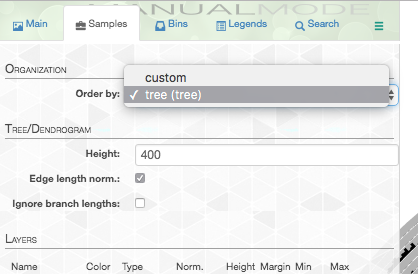
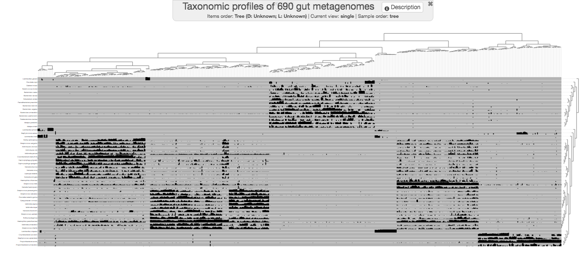
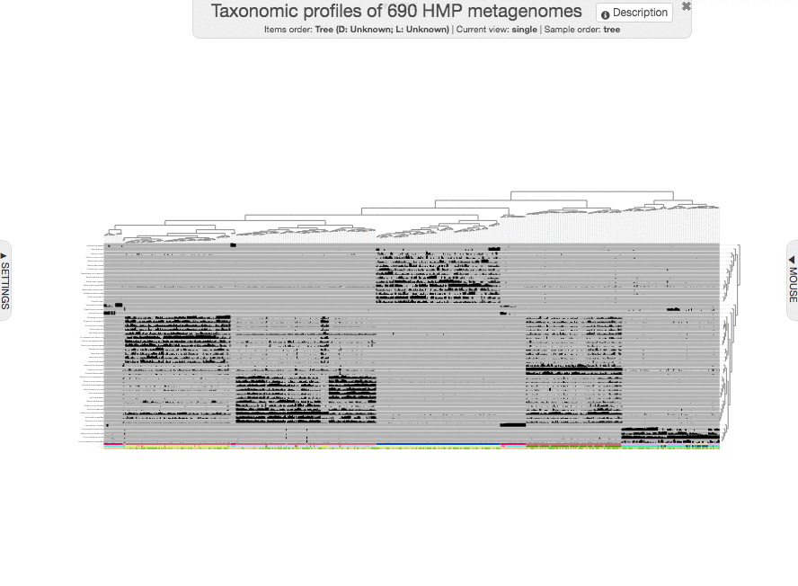
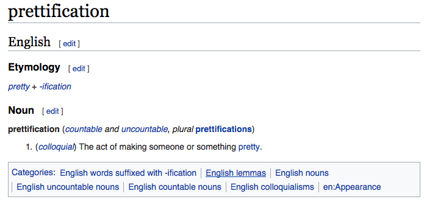

{:.notice}
This tutorial is tailored for anvi'o `v2.3.0` or later. You can learn the version of your installation by typing `anvi-interactive -v` in your terminal.



The purpose of this tutorial is to give you a brief idea about the capabilities of the anvi'o interactive interface using an intuitive dataset without using any of the actual anvi'o functionality. The dataset we will use throughout this page is the taxonomic profiles of 690 metagenomes from the [Human Microbiome Project](http://www.hmpdacc.org/) (HMP)) generated by [MetaPhlAn](http://huttenhower.sph.harvard.edu/metaphlan).

To follow this tutorial open your terminal, create a new directory anywhere on your computer, and go into it using your terminal.

{:.notice}
While this tutorial will take you through a simple analysis of a real dataset, there also is available a more comprehensive (but more abstract) tutorial on [data types in the anvi'o interactive interface understands](){:target="_blank"}.

## The data matrix

Anvi'o interactive interface is often initiated to display and manupilate data stored in anvi'o databases. However, in this simple tutorial we will use the interactive interface in 'manual mode' by providing it with the data to diplay manually.

We often work with data tables that look like this:

||item_1|item_2|item_3|item_4|item_5|item_6|item_7|(...)|
|:--|:--:|:--:|:--:|:--:|:--:|:--:|:--:|:--:|
|sample_1|?|?|?|?|?|?|?|(...)|
|sample_2|?|?|?|?|?|?|?|(...)|
|sample_3|?|?|?|?|?|?|?|(...)|
|sample_4|?|?|?|?|?|?|?|(...)|
|sample_5|?|?|?|?|?|?|?|(...)|
|sample_6|?|?|?|?|?|?|?|(...)|
|sample_7|?|?|?|?|?|?|?|(...)|
|sample_8|?|?|?|?|?|?|?|(...)|
|sample_9|?|?|?|?|?|?|?|(...)|
|(...)|(...)|(...)|(...)|(...)|(...)|(...)|(...)|(...)|

The dataset we will go through in this tutorial is not any different, and it follows the same structural organization:

|Metagenome|Streptococcus_mitis|Propionibacterium_acnes|Haemophilus_parainfluenzae|Lactobacillus_crispatus|Bacteroides_unclassified|Corynebacterium_matruchotii|(...)|
|:--|:--:|:--:|:--:|:--:|:--:|:--:|:--:|
|SRS011061|0|0|0.0375|0|0.5463|0|(...)|
|SRS011090|78.99923|0.01181|1.86651|0|0|0|(...)|
|SRS011098|1.03629|0.00202|3.1655|0|0.00442|10.7104|(...)|
|SRS011126|0.80909|0|8.07113|0|0.06489|21.49041|(...)|
|SRS011132|1.8407|75.61046|0.15936|0|0|0|(...)|
|SRS011134|0.20981|0|0.0731|0|14.23341|0|(...)|
|SRS011140|2.70361|0.00204|18.00913|0|0.0154|0.04016|(...)|
|SRS011144|32.22543|0.06306|3.622|0|0.03833|0.18776|(...)|
|SRS011152|1.50179|0|14.26581|0|0.01726|19.2156|(...)|
|(...)|(...)|(...)|(...)|(...)|(...)|(...)|(...)|

Each row in this table represents a gut metagenome and every column represents a microbial taxon. The cells display the percent abundance of a given taxon in a given metagenome.

You can download the full dataset on your computer by running the following command in your terminal:

``` bash
 $ wget http://merenlab.org/tutorials/interactive-interface/files/data.txt
```

Then you can take a very quick look at it in anvi'o:

``` bash
$ anvi-interactive -d data.txt \
                   -p profile.db \
                   --title "Taxonomic profiles of 690 gut metagenomes" \
                   --manual
```

[](images/data-raw.png){:.center-img .width-50}

Because we haven't provided any specific organization, anvi'o organizes all samples alphabetically. But we will recover from that.

{:.notice}
If you press `m` on your keyboard, you can toggle the information window on that would show you the actual data points under your mouse pointer.

{:.warning}
Once you are done looking at an interactive display and would like to continue running more commands, you should close the browser tab and kill the server by pressing `CTRL+C` key combination in your terminal.

## Organizing items

Clearly there is not much to see in the previous display. Because we already know that those samples come from different environments (such as gut, and oral cavity), and they can be organized much better than sorting them alphabetically.

We can do a quick hierarchical clustering on the data using the program `anvi-matrix-to-newick `, and get back a newick "tree" that would make things a bit easier on our eyes:

``` bash
 $ anvi-matrix-to-newick data.txt \
                         -o tree.txt
```

``` bash
 $ anvi-interactive -d data.txt \
                    -p profile.db \
                    --title "Taxonomic profiles of 690 gut metagenomes" \
                    --tree tree.txt \
                    --manual
```

[](images/data-w-tree.png){:.center-img .width-50}

A bit better! 

{:.notice}
Although the program `anvi-matrix-to-newick` uses Euclidean distance and ward linkage by default to organize things, available **distance metrics** include `braycurtis`, `canberra`, `chebyshev`, `cityblock`, `correlation`, `cosine`, `dice`, `euclidean`, `hamming`, `jaccard`, `kulsinski`, `matching`, `minkowski`, `rogerstanimoto`, `russellrao`, `sokalmichener`, `sokalsneath`, `sqeuclidean`, and `yule` with available **linkage algorithms**, `single`, `complete`, `average`, `weighted`, `centroid`, `median`, and `ward`.

## State files

Anvi'o enables you to a lot with its interactive interface when it comes to making visualization decisions. It also offers you a way to store these changes through so called *states*. A state is a JSON-formatted description of what you see in the interface and is stored in a anvi'o profile databases. There can be more than one state files in a given database, but if anvi'o finds a state in a given profile database called `default`, then it will automatically load it and click the Draw button on your behalf.

While we are here, let's click "save state" and save a `default` state so we don't have to press draw every time we run the interface going forward (later we will have to update this state as we continue editing the interface).

There are other ways to deal with states. For instance, if you go to your terminal and run the command,

```
anvi-help state
``` 

You will see that there are multiple programs that can export these state files. Just for fun, let's export the state we just stored and take a look at it:

```
anvi-export-state -p profile.db \
                  -s default \
                  -o default.json
```

As you can imagine, an edited state file can also be imported to a profile database.


## Organizing layers

Going back to the dataset we have been playing with, we definitely have improved the display of items when we organized them based on the occurrence patterns of different taxa on metagenomes. But layers, which, in this particular dataset represent taxa, could have been organized better, as well.

Doing it with anvi'o is somewhat similar to the initial step of organizing items (but notice that we now add the flag `--transpose`):

``` bash
 $ anvi-matrix-to-newick data.txt \
                         --transpose \
                         -o layers-tree.txt
```

Now we have a tree file to organize our layers, however, the utilization of this tree file is not going to be as straightforward as using the `--tree` parameter for the `anvi-interactive` command. 

It will require us to add this information into the 'layer orders' table. This table is one of additional data table anvi'o often uses to enrich its displays.

A rather comprehensive description of these tables, and how to operate on them is laid out here:

* [Working with anvi'o additional data tables]()

If you read that article, you already know about the simple structure of the input file to add new layers orders into a profile database. If you don't want to spend time on it you can download it here:

``` bash
 $ wget http://merenlab.org/tutorials/interactive-interface/files/layer-orders.txt
```

After taking a look at the contents of this file, you can import it in your profile database:

``` bash
 $ anvi-import-misc-data layer-orders.txt \
                         --target-data-table layer_orders \
                         --pan-or-profile-db profile.db
```

and re-run the `anvi-interactive`,

``` bash
 $ anvi-interactive -d data.txt \
                    -p profile.db \
                    --title "Taxonomic profiles of 690 gut metagenomes" \
                    --tree tree.txt \
                    --manual
```

You will be surprised to see that nothing has really changed. Why? Because you need to instruct anvi'o to use the new organization to order layers. This can be done from the "layers" tab:

[](images/samples-org.png){:.center-img .width-90}

Then, if you click draw again, you will feel that we are getting somewhere.

[](images/data-w-samples-org.png){:.center-img .width-50}


{:.notice}
This may be a good time to update your default state.


## Let's go all corners

We are aware that most people have quite strong feelings against circular plots.

<blockquote class="twitter-tweet" data-lang="en"><p lang="en" dir="ltr">Strong feelings against circle plots? That&#39;s OK! You can have it the way you like interactively with <a href="https://twitter.com/hashtag/anvio?src=hash">#anvio</a>: <a href="https://t.co/vynUkahdfK">https://t.co/vynUkahdfK</a> :) <a href="https://t.co/fL4ley5lT2">pic.twitter.com/fL4ley5lT2</a></p>&mdash; A. Murat Eren (@merenbey) <a href="https://twitter.com/merenbey/status/856521515516518400">April 24, 2017</a></blockquote>
<script async src="//platform.twitter.com/widgets.js" charset="utf-8"></script>

We like them because they display more data in media we use for publishing (i.e., the A4 page size, etc). But as you probably know, anvi'o can also give you ugly, cornered displays (hehe).

To honor all those who like corners better, we shall continue with the phylogram display for the rest of this tutorial. When you change the "Drawing type" to phylogram, it will initially look quite ugly. But after playing with settings a little bit, you can make it look more reasonable:

[](images/phylo.png){:.center-img .width-80}


## Additional data for the items

Anvi'o can extend any view with additional data. For instance, we have some information about these metagenomes. Such as the sampling site, or the gender of the individual they originate from. We could display that information to improve our understanding of the data.

You can download the pre-prepared items additional data file from here:

``` bash
 $ wget http://merenlab.org/tutorials/interactive-interface/files/additional-items-data.txt
```

The first column of the additional data file is pretty much identical to the data file, but there are some other data columns in it:

|Metagenome|Body_Site|Body_Subsite|Host_Gender|
|:--|:--:|:--:|:--:|
|SRS011061|GastrointestinalTract|Stool|Female|
|SRS011090|Oral|Buccal_mucosa|Female|
|SRS011098|Oral|Supragingival_plaque|Female|
|SRS011126|Oral|Supragingival_plaque|Male|
|SRS011132|Airways|Nares|Male|
|SRS011134|GastrointestinalTract|Stool|Male|
|SRS011140|Oral|Tongue_dorsum|Male|
|SRS011144|Oral|Buccal_mucosa|Male|
|SRS011152|Oral|Supragingival_plaque|Male|
|(...)|(...)|(...)|(...)|

Careful readers know what's up. We need to add these additional data into the profile database, right? Yes. And it is will go exactly the way you imagine it would (note the change in target data table):

``` bash
 $ anvi-import-misc-data additional-items-data.txt \
                         --target-data-table items \
                         --pan-or-profile-db profile.db
```

Now you can re-run your interactive interface:

``` bash
 $ anvi-interactive -d data.txt \
                    -p profile.db \
                    --title "Taxonomic profiles of 690 HMP metagenomes" \
                    --tree tree.txt \
                    --manual
```

to get this one (you will really squint your eyes to see the new layer at the bottom):

[](images/final-raw.png){:.center-img .width-80}

Just a small tip while we are here: you can always zoom-in to a particular part of a given display by making a selection while pressing your `shift` key:

{:.center-img .width-80}

{:.notice}
You could have shown your items additional data in the interactive interface without importing it, but using the `--additional-layers` parameter. But it is always a better practice to import additional data into the profile database to minimize the number of files that need to be carried around for full reproducibility.


## Additional data for the layers

How about extending layers with extra information? At this point we can at least add some taxonomy for these layers.

Here is a layers additional data file for the lazy:

``` bash
 $ wget http://merenlab.org/tutorials/interactive-interface/files/additional-layers-data.txt
```

After taking a look at the file, you can import it into the profile database:

``` bash
 $ anvi-import-misc-data additional-layers-data.txt \
                         --target-data-table layers \
                         --pan-or-profile-db profile.db
```

And rerun the interactive interface:

``` bash
 $ anvi-interactive -d data.txt \
                    -p profile.db \
                    --title "Taxonomic profiles of 690 HMP metagenomes" \
                    --tree tree.txt \
                    --manual
```

to get this one:

[](images/final-all.png){:.center-img .width-80}

I guess we can all agree that this figure looks *unbearably* ugly, and quite useless :(

## Prettification

I had started this section by saying "prettification is clearly not a real word, but it absolutely should should have been". Then I Google'd it just for fun, and there it was! It *is* a real word, which means there is no reason for you to not do it:

[](https://en.wiktionary.org/wiki/prettification){:.center-img .width-70}

One of the most powerful aspects of anvi'o is its ability to give you so much power to communicate your results as best as possible. Prettification is working with the anvi'o display above and not letting it go until it starts to look like something that helps you convey your message.

{:.notice}
Working with large SVG files can be challenging. We have some [suggestions here](http://merenlab.org/2016/10/27/high-resolution-figures/) to ameliorate that burden.

Let's step by step prettify this display, to get to here:

[](images/final-pretty.png){:.center-img .width-80}

And this is the circular version, if you are curious AND not stubborn (hehe):

[](images/final-pretty-circle.png){:.center-img .width-60}

You can import this visual display into your version by downloading the anvi'o state file:

``` bash
 $ wget http://merenlab.org/tutorials/interactive-interface/files/pretty-state.json
 $ anvi-import-state -p profile.db -s pretty-state.json -n default
```

Now you can re-run your interface, and you will have it, too:

``` bash
 $ anvi-interactive -d data.txt \
                    -p profile.db \
                    --title "Taxonomic profiles of 690 HMP metagenomes" \
                    --tree tree.txt \
                    --manual
```


