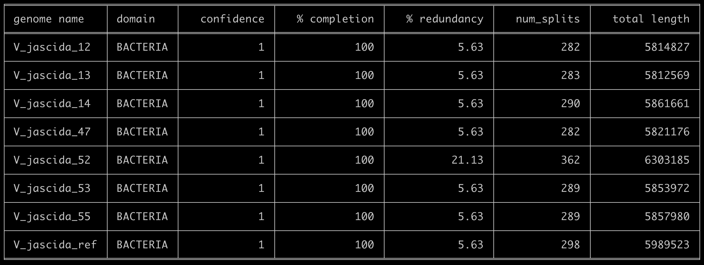

**The goal of this mini workshop** was to compute a _Vibrio jascida_ pangenome using the isolate genomes that were generated during the Microbial Diversity course at the Marine Biological Laboratory in 2018. Essentially, we sat together with the course participants of the Microbial Diversity Course in July 2021 in Woods Hole, and went through the information on this page while discussing what we are seeing and did spontaneous investigations of the pangenome we have computed for _Vibrio jascida_. We are making this content publicly available in case others wish to play with these data, primarily because why not.

{:.warning}
Thanks to the generosity of the Microbial Diversity Course at the MBL, all the novel isolate genomes this mini workshop will be using are now publicly available, and anyone will be able to follow this material on your own anvi'o-installed computers. But if you happen to do something that is much more serious than what is covered here, please consider reaching out to [Rachel Whitaker](https://mcb.illinois.edu/faculty/profile/rwhitakr) before any publication to discuss the best way forward.

The following material starts with a very brief introduction to the isolates, and work its way through the steps of computing a pangenome using anvi'o. I hope this material will be useful not only to those of you who sat through the workshop at the MBL with me in-person, but also to those of you who run into this material later.

Please feel free to leave a comment at the end of the page or find us on Discord.




{:.notice}
This tutorial is tailored for anvi'o `v7.1` or later. You can learn the version of your installation by typing `anvi-interactive -v`. If you have an older version, some things may not work the way they should since we have a few new programs used in this tutorial.


## Isolate genomes

Here we will analyze genomes of seven _Vibrio jascida_ populations isolated from various Woods Hole places (including Eel Pond, Marine Resources Center, and the Great Harbor) using complete seawater medium from. This table offers a brief information for each isolate to get back to later:

|Plate Num|Researcher|Source|
|:--|:--|:--|:--|:--|
|12|Peggy Lai|Seawater, Great Harbor, Woods Hole|
|13|Peggy Lai|Seawater, Great Harbor, Woods Hole|
|14|Peggy Lai|Seawater, Great Harbor, Woods Hole|
|47|Danielle Campbell|Seawater, Eel Pond, Woods Hole|
|52|Brittni Bertolet|??|
|53|Sarah Schwenck|Coral (from MRC), Woods Hole|
|55|Monica E. McCallum|Coral (from MRC), Woods Hole|

## Finalizing the list of genomes

Please note that the following few sections will take you through the steps of gathering the FASTA files for genomes we are intersted in and turning them into anvi'o  files prior to our pangenomic analysis. If you would like to skip these steps completely and start with a collection of contigs-db files directly, please first run either of the following commands depending on which version of anvi'o you're using.

If you are using `anvio-dev`, please use this command to download the pre-packaged data:

``` bash
# download the data pack for v8-dev contigs-db files
curl -L https://cloud.uol.de/public.php/dav/files/XktW549BjTg5ikj \
     -o V_jascida_contigs_dbs.tar.gz
```

If you are using the stable `v8` version of anvi'o, use this command to download the pre-packaged data:

``` bash
# download the data pack for v8 contigs-db files
curl -L https://cloud.uol.de/public.php/dav/files/7xDdqqXxdtWnpMg \
     -o V_jascida_contigs_dbs.tar.gz
```

OK. Now you have the pre-packaged data, you can continue with the following commands to unpack the archive:

```
# unpack it
tar -zxvf V_jascida_contigs_dbs.tar.gz

# go into the new directory
cd V_jascida_contigs_dbs

# take a look at the list of files, you know, as one should always do
ls
```

Once you are done with them, from here you can [jump here](#taking-a-quick-look-at-genome-stats) to follow the rest of the tutorial.

---

If you are still here, it means you want to go through each step one by one to go from FASTA files to anvi'o contigs-db files. You are a gem among people.

We will start by downloading the FASTA files for the Vibrio genomes:

```bash
# download the pack
curl -L https://cloud.uol.de/public.php/dav/files/LdgMQW6ixzzPKzS \
     -o V_jascida_genomes.tar.gz

# unpack it
tar -zxvf V_jascida_genomes.tar.gz

# go into the new directory
cd V_jascida_genomes

# take a look at what we have in our hands
ls
```

{:.warning}
Please remember these novel genomes are public thanks to the generosity of the Microbial Diversity Course at the MBL and its 2018 participants, Peggy Lai, Danielle Campbell, Brittni Bertolet, Sarah Schwenck, and Monica E. McCallum.

Now we have all the FASTA files for our 'novel' _Vibrio jascida_ genomes and in theory we are good to go. But it is always good to try to be a little more inclusive. For instance, to our collection of _Vibrio jascida_ genomes we can include at least one reference genome for this taxon to anchor our pangenome in everyone else's reality. Indeed, searching on the NCBI for _Vibrio jascida_ does return some *complete* genomes:



Let's download the first one:



Unzipping the compressed file NCBI sends resulted in a directory with a lot of things in it, but we simply want the FASTA file. This is how I moved that FASTA file of interest into my work directory where all the FASTA files for other _Vibrio jascida_ isolates were living:

```
mv ~/Downloads/V_jasicida_NCBI/ncbi_dataset/data/GCF_002887615.1/GCF_002887615.1_ASM288761v1_genomic.fna ref_scaffolds.fasta
```

Please note that the command above may differ for you as a function of a number of things, so please try to figure out where things are if you get an error at this stage. All you want to do is to download a reference genome for our taxon from the NCBI, and move the FASTA file for it into your work directory as `ref_scaffolds.fasta`.

If you were successful, your work directory should look like this:

```
ls *fasta

12_scaffolds.fasta
13_scaffolds.fasta
14_scaffolds.fasta
47_scaffolds.fasta
52_scaffolds.fasta
53_scaffolds.fasta
55_scaffolds.fasta
ref_scaffolds.fasta
```

OK. Now we have all the FASTA files, and we are good to go.

## FASTA files to Contigs DBs

For a pangenomic analysis of these genomes we will use [anvi'o](https://merenlab.org/software/anvio/), an open-source software platform for microbial 'omics. And anvi'o requires some additional steps for us to be able to work with FASTA files :/

Most analyses in anvi'o start after the conversion of FASTA files into a special anvi'o database called . So the first order of business is to turn each of these FASTA files into a contigs database.

We can turn a FASTA file into an anvi'o contigs database by running the program . So that is what we need to do that for each one of the FASTA files we have one by one. But a better way to do such repetitive tasks is to put together a `for` loop using the scripting capabilities of the shell (which we access through our terminal).

To build a `for` loop, let's first put our genome names into a text file:

```
ls *fasta | awk 'BEGIN{FS="_"}{print $1}' > genomes.txt
```

If you take a look at the contents of this file, you'll see that it is nothing more than the following:

```
cat genomes.txt

12
13
14
47
52
53
55
ref
```

You will see how it will become useful in a second.

### Finalizing the FASTA files

Before we go through converting each FASTA file into a contigs database, it is always a great idea to take a look at them to make sure they all make sense. What I mean by looking at them is literally looking at them in a text editor.

For instance, when you do that it becomes immediately clear that the FASTA files assembled from the sequencing of isolates contain many extremely short sequences. Since we are working with cultured organisms and expect high-quality assemblies, it is a good idea is to start by removing sequences that are too short since they may be coming from low-abundance contaminants that didn't assemble well and/or influence how gene clusters are formed.

There are multiple ways to remove short sequences. But here we will go through each entry in our `genomes.txt` file, and use the program  create copies of each FASTA file without the sequences that are less than 2,500 nucleotides:

```
for g in `cat genomes.txt`
do
    echo
    echo "Working on $g ..."
    echo
    anvi-script-reformat-fasta ${g}_scaffolds.fasta \
                               --min-len 2500 \
                               --simplify-names \
                               -o ${g}_scaffolds_2.5K.fasta
done
```

### Generating contigs databases

Now we have our final, anvi'o-compatible  files, it is time to generate anvi'o contigs databases using the program :

```
for g in `cat genomes.txt`
do
    echo
    echo "Working on $g ..."
    echo
    anvi-gen-contigs-database -f ${g}_scaffolds_2.5K.fasta \
                              -o V_jascida_${g}.db \
                              --num-threads 4 \
                              -n V_jascida_${g}
done
```

### Annotating contigs databases

An anvi'o  is a talented form of a FASTA file, and in addition to our genome sequences, it can hold a lot of additional information per genome. Such as gene calls, sequence k-mer frequencies, gene functions, and so on. Here we can use some relevant anvi'o programs, such as , , , , to identify bacterial single-copy core genes, ribosomal RNAs, transfer RNAs among our contigs, and annotate our genes with functions (note that we are now going through each file that ends with '.db', rather than entries in the `genomes.txt`):

```
for g in *.db
do
    anvi-run-hmms -c $g --num-threads 4
    anvi-run-ncbi-cogs -c $g --num-threads 4
    anvi-scan-trnas -c $g --num-threads 4
    anvi-run-scg-taxonomy -c $g --num-threads 4
done
```

### Taking a quick look at genome stats

If you are here, it means you have your contigs-db files ready and you are ready to jump into the pangenomics. But first, let's take a look at the simple features of these genomes we have using the program :

```
anvi-display-contigs-stats *db
```

Running this pulls this display up on my browser:

[](images/contigs_stats.png){:.center-img .width-60}

There is a lot to discuss here, so let's take a moment and try to make sense of this information here.

### Creating an external genomes file

This is not necessarily a standard step of turning FASTA files to contigs databases, but when we need to work with a bunch of contigs databases in anvi'o, we use a special file called  to describe them all together in one place as a logically relevant group of contigs databases (in case you are curious, yes there also is an  file format). So let's create one here so we can use it for our downstream analyses.

The structure of the  file is simple: it is a two-column TAB-delimited file. One can easily create it using EXCEL or any kind of text editor. But anvi'o comes with a script,  to create one from all the contigs databases found in a directory. So let's use that to generate an external genomes file:

```
anvi-script-gen-genomes-file --input-dir . \
                             -o external-genomes.txt
```

You can take a look at the resulting file to see how simple it is.

## Investigating contamination

In theory, everything is ready at this point for us to compute a pangenome. But when one is dealing with sequence data, nothing can ever be truly ready for anything in practice. I learned over the years that every time I look at things more carefully I find more things to improve. There is no end to it and we often have to call it a day and move on. But this is the last checkpoint before we turn our genomes into a pangenome, so it is a good idea to invest a little more time to see if there is something that would REALLY upset us later.

We can start by taking a quick look at the level of completion of our genomes using the program , which, like many anvi'o programs, accepts  as an input:

```
anvi-estimate-genome-completeness -e external-genomes.txt
```

And voila:

[](images/completion_pre_cleaning.png){:.center-img .width-60}

This output clearly shows that there is something fishy going on with `V_jascida_52`. It has more redundancy than others, it is larger in size than others, etc. This can be due to some sort of contamination, but how can we be sure? One way to do it is to take a more careful look at this genome by visualizing it through , and perhaps remove some contigs from it if necessary.

### Visualizing contigs for refinement

If you were to look at the help menu of  you would realize that this program requires an anvi'o . Which we do not have, since we did not profile anything.

{:.notice}
Profiling in anvi'o typically makes sense of read recruitment results, and we have not conducted any read recruitment here since we did not have access to the raw sequencing data of these isolates.

But while the program  requires a  as an input, we still can generate a *blank* profile without any mapping results using the flag `--blank`:

```
anvi-profile -c V_jascida_52.db \
             --sample-name V_jascida_52 \
             --output-dir V_jascida_52 \
             --blank
```

OK. Now we are ready to use :

```
anvi-interactive -c V_jascida_52.db \
                 -p V_jascida_52/PROFILE.db
```

Which shows us this display:

[](images/vj52.png){:.center-img .width-60}

The organization of contigs based on tetranucleotide frequency shows clear signs of contamination, but we are able to identify a set of contigs that we are relatively more confident to represent the true *V. jascida* genome we are interested in. In my opinion this is how it looks like:

[](images/vj52_bins.png){:.center-img .width-60}

We can even talk about what is contaminating:

[](images/bins_panel.png){:.center-img .width-60}

So it is clear that we don't want to include those contaminating genes in our analysis and we should only work the But how to get those sequences we marked as `V_jascida_52_CLEAN`. But how do we get those sequences?

### Splitting a genome

Getting out the clean sequences from this will be much easier than you probably think, but it requires some introduction to some of the anvi'o lingo for which we don't have time or space. That said, here is a very brief blurb: we have stored our  into a  called `default` using the *store bin collection* button in the previous screenshot (the collection name doesn't really matter, we could call it anything). Having a  in an anvi'o  (which is stored in our *blank* profile database in this case), enables us to access sequences in those bins in different ways. If you would like to have an idea, you can [take a look at all the anvi'o programs that can work with a *collection* artifact](/software/anvio/help/main/artifacts/collection/).

One of those programs that can use a collection is the program , which does something we really need: _splits_ a contigs database into smaller ones each of which individually represent a single bin in a collection. So we can run it on our poor _Vibrio jascida #52_:

```
anvi-split -p V_jascida_52/PROFILE.db \
           -c V_jascida_52.db \
           -C default \
           -o V_jascida_52_SPLIT
```

The  for the 'cleaned up' *V. jascida #52* is now here in my work directory:

```
V_jascida_52_SPLIT/V_jascida_52_CLEAN/CONTIGS.db
```

### Updating the external genomes file

Now we have a better contigs database for *V. jascida #52*, we want to have a new  file where the old *V. jascida #52* is replaced with the cleaner one. One quick way to do that is the following:

```
sed 's/V_jascida_52.db/V_jascida_52_SPLIT\/V_jascida_52_CLEAN\/CONTIGS.db/g' external-genomes.txt > external-genomes-final.txt
```

Which creates a new file called `external-genomes-final.txt` that we can use for downstream analyses. Before we move on, let's take a look at the difference between the two sets of contigs databases using  just to be sure:

```
anvi-estimate-genome-completeness -e external-genomes.txt
anvi-estimate-genome-completeness -e external-genomes-final.txt
```

## Computing the pangenome

The first step of computing a pangenome is to generate a yet-another anvi'o artifact: , which essentially merges all the  into a single, leaner file, so pangenomes can be made publicly available. The program  does that for us by taking in an  file:

```
anvi-gen-genomes-storage -e external-genomes-final.txt \
                         -o V_jascida-GENOMES.db
```

This step took 6 seconds on my laptop.

Then, we can use the program  to compute the pangenome:

```
anvi-pan-genome -g V_jascida-GENOMES.db \
                --project-name V_jascida \
                --num-threads 4
```

This step took 4 minutes on my laptop.

### Displaying the pangenome

We can now visualize this pangenome the program  and start discussing what we see.

```
anvi-display-pan -p V_jascida/V_jascida-PAN.db \
                 -g V_jascida-GENOMES.db
```

The command above gives us this ugly (yet interactive) display:



There are many things that can be done here, and covering all the features of the interface would be almost impossoble. But let's do a few things to improve our understanding of the members of this pangenome. First, let's change the background color of the reference genome so we see it clearly.

For that we first mark it in the 'main panel' so it is easy to see which genome it is:



And then change the background color before re-drawing it:



When we redraw, this is what we see:



As you can see the way genomes are ordered in this display follows the alphabetical order. Gene clusters, however, don't seem to care much about the way we named the genomes. The next thing we can do is to switch to a more meaningful order using the Layers panel:



Drawing again, gives us this:



Things are slowly coming together, but the display is just way too busy. We can remove all those additional layers for now and then turn them on for our discussions. First the additional data layers for items:



Then the additional data for layers:



OK. Looks much better.



### Calculating average nucleotide identity between genomes

One question that display can not answer to what extent the associations between genomes are predicted by the average nucleotide identity between each genome. But we can easily recover that by using the program  to calculate ANI between genomes, and *also* add that information to the pangenome:

{:.notice}
Before killing your server to run this command, you may want to store your  :)

```
anvi-compute-genome-similarity --external-genomes external-genomes-final.txt \
                               --program pyANI \
                               --output-dir ANI \
                               --num-threads 6 \
                               --pan-db V_jascida/V_jascida-PAN.db
```

The successful completion of this will update our pangenome.

### Displaying ANI and adjusting it

We can re-display the same pangenome, now with ANI values in it, using :

```
anvi-display-pan -p V_jascida/V_jascida-PAN.db \
                 -g V_jascida-GENOMES.db
```

But to *actually* display ANI values, we need to turn on what we wish to display from the Layers tab:



Although clicking redraw may yield a rather disappointing discovery o_O

But do not despair. This is due to the fact that the default min-max values of ANI values are set to 70% to 100%, and our genomes way too closely related for those numbers to make sense. Since they resolve to the same 'species', 95% ANI is a much better cutoff than 70% to start with.

One can in fact quickly adjust these values: 



98% it is. With that, things make a little more sense:



## Studying the pangenome

Perhaps this is a good moment to stop and discuss what we are seeing in the light of how these isolates relate to one another:

|Plate Num|Researcher|Source|
|:--|:--|:--|:--|:--|
|12|Peggy Lai|Seawater, Great Harbor, Woods Hole|
|13|Peggy Lai|Seawater, Great Harbor, Woods Hole|
|14|Peggy Lai|Seawater, Great Harbor, Woods Hole|
|47|Danielle Campbell|Seawater, Eel Pond, Woods Hole|
|52|Brittni Bertolet|??|
|53|Sarah Schwenck|Coral (from MRC), Woods Hole|
|55|Monica E. McCallum|Coral (from MRC), Woods Hole|

There are MANY ways to perform exploratory analyses or test hypotheses once one reaches to this stage. I would like everyone to take 30 minutes with the pangenome to find their own stories in it. But here are some quick tips that you may find beneficial.

### Inspecting amino acid sequence alignments



### Binning gene clusters



### Changing how gene clusters are ordered



For instance, an 'enforced synteny' using the reference genome will change your display, where gene clusters will be ordered to respect the synteny of the genes they contain in the reference genome:



### Selecting a range of gene clusters




### Searching for functions



### Searching using gene cluster filters



### Storing a collection

Storing a collection is an important step since the concept of  is important for anvi'o.



### Splitting a pangenome

Do you remember the program  that we used to split a genome into pieces? Well, the same program can split a pangenome, too, because that's how anvi'o rolls. If you were to be interested in focusing ONLY on the single-copy core gene clusters we stored as a collection in the previous gif, you could split it from the pan database into its standalone project. 

If you don't remember collections stored in your pangenome, you can always use the program :

```
anvi-show-collections-and-bins -p V_jascida/V_jascida-PAN.db

Collection: "my_collection"
===============================================
Collection ID ................................: my_collection
Number of bins ...............................: 2
Number of splits described ...................: 5,131
Bin names ....................................: SCGs, Singletons
```

OK, so we want the SCGs bin from the collection `my_collection`. Here comes the :

```
anvi-split -p V_jascida/V_jascida-PAN.db \
           -g V_jascida-GENOMES.db \
           --collection-name my_collection \
           --bin-id SCGs \
           --output-dir SPLIT
```

And here we go:

```
anvi-display-pan -p SPLIT/SCGs/PAN.db \
                 -g V_jascida-GENOMES.db
```



It is boring because everything is a single-copy core here. But there are indeed very interesting things to do. If we have time here during the workshop, Meren will show an extremely high-resolution phylogenomics analysis using subtly varying single-copy core genes.


### Summarizing the pangenome

This effectively gives you a huge TAB-delimited file that describes everything you see on your pangenome. It is quite a critical output.

While I would strongly recommend you to use the anvi'o command line program  to generate a static output file for your pangenome, you can also do it through the interface:



Perhaps this is a good moment to take a look at the summary output, and open the summary of gene clusters in EXCEL or R.

### Sharing the pangenome with others

The  step essentially generates an output directory with an `index.html` file that can be opened on any browser, and enables you to share your pangenome as a supplementary data item in any publication. 

Another option, especially if you would like to feel like the year 2021 has finally arrived, you can shre your pangenome in a fully reproducible and interactive way. For that (1) create a new directory, (2) copy into this directory the two essential files, `V_jascida/V_jascida-PAN.db` and `V_jascida-GENOMES.db`, (3) compress the directory (i.e., tar/gz it), (4) upload it to Zenodo or FigShare, and (5) include the DOI for this item in your data availability section of your publication.

---

Thank you for your time! Please let me or others know if you have any suggestions!


